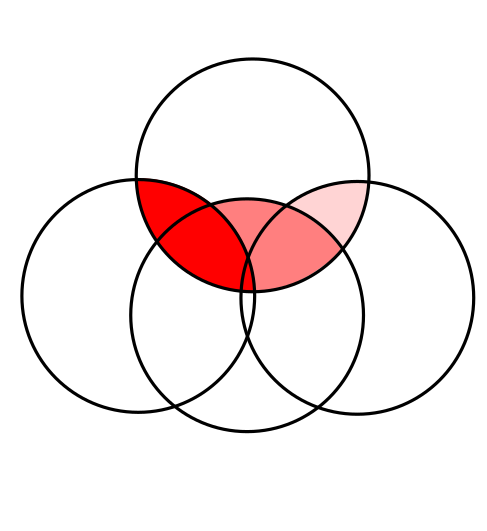

```{r setup, include=FALSE}
options(htmltools.dir.version = FALSE)
options(digits=4,scipen=2)
options(knitr.table.format="html")
xaringanExtra::use_xaringan_extra(c("tile_view","animate_css","tachyons"))
xaringanExtra::use_extra_styles(
  mute_unhighlighted_code = FALSE
)
library(knitr)
library(tidyverse)
library(ggplot2)
source('R/pres_theme.R')
knitr::opts_chunk$set(
  dev = "svg",
  warning = FALSE,
  message = FALSE
)
source('R/myfuncs.R')
```

```{r xaringan-themer, include = FALSE}
library(xaringanthemer)
style_mono_accent(
  #base_color = "#0F4C81", # DAPR1
  # base_color = "#BF1932", # DAPR2
  # base_color = "#88B04B", # DAPR3 
  base_color = "#FCBB06", # USMR
  # base_color = "#a41ae4", # MSMR
  header_color = "#000000",
  header_font_google = google_font("Source Sans Pro"),
  header_font_weight = 400,
  text_font_google = google_font("Source Sans Pro", "400", "400i", "600", "600i"),
  code_font_google = google_font("Source Code Pro"),
  code_font_size = "0.8rem"
)
```

class: inverse, center, middle
# Part 1
## Quick Refresh

---
# Some new data

.pull-left[
```{r frecap2,fig.asp=.6,echo=FALSE}
library(faux)
set.seed(29)
dat <- rnorm_multi(n=50,
                   mu=c(0.1,650),
                   sd=c(.009,60),
                   r=.4,
                   varnames=c('BloodAlc','RT'))
d20 <- dat %>% sample_n(20)
m1 <- lm(RT~BloodAlc, data=d20)
d20 <- d20 %>% mutate(pred=predict(m1),mRT=mean(RT))
dat %>% ggplot(aes(x=BloodAlc,y=RT)) +
  xlab("Blood Alcohol %/vol") + ylab("RT (ms)") +
  geom_point(size=3)
mod <- lm(RT~BloodAlc, data=dat)
```
]
.pull-right[


]

???
- new data
- we see positive r

---
# Some new data

.pull-left[
```{r frecap22,fig.asp=.6,echo=FALSE}
dat %>% ggplot(aes(x=BloodAlc,y=RT)) +
  xlab("Blood Alcohol %/vol") + ylab("RT (ms)") +
  geom_point(size=3) + geom_smooth(method="lm")
mod <- lm(RT~BloodAlc, data=dat)
```

.tc[
"for every extra 0.01% blood alcohol, reaction time slows down by around `r round(coef(mod)[2]*0.01,0)` ms"
]
]
.pull-right[

]

???

- describe using a line
- line defined by two numbers
  - intercept  
  - slope

- .08% = intoxicated
- >.4 = fatal

---
# The Model

.pull-left[
```{r summod}
mod <- lm(RT~BloodAlc, data=dat)
summary(mod)
```
]

???
- formally, we're fitting a linear model to the data 

- note the _huge_ affect of `BloodAlc`
- why is this? [pause?]
- slope = change in RT for increase of 1% in bloodalc

- but in reality, everyone is <1% 
- change happens in bloodalc at the .01% level  

---
# Another (identical) Model


```{r}
dat <- dat %>% mutate(BloodAlc100 = BloodAlc*100)
mod2 <- lm(RT~BloodAlc100, data=dat)
summary(mod2)
```

???
- multiply these by 100
  - .09 = 9
  - .10 = 10
- what has changed? [pause]
  - slope
  - nothing else! 

- estimates describe the sample
- we want to make statements about the population

- so we perform a test.
  - last week:
    - test of coefficient
    - test of whether model improves over chance

- both of these:
  - imagine a universe where no relationship. "null universe"
  - calculate probability of observing data from sample of same size in that universe
  
  - if probability is low, reason to believe our universe is NOT the null universe
  - if probability is high, no reason not to believe our universe is the null universe

---
class: inverse, center, middle
# Part 2
## Checking Assumptions


???
- To conduct these tests
- we make certain assumptions


---
# Assumptions of Linear Models

.pull-left[
.br3.bg-gray.white.pa2[
### required
- **linearity** of relationship(!)

- for the _residuals_:
  + **normality**
  + **homogeneity of variance**
  + **independence**
]
]
.pull-right[
.br3.bg-gray.white.pa2[
### desirable
<!-- - uncorrelated predictors (no collinearity) -->
- no 'bad' (overly influential) observations
]]

???
- the first assumption we make is about nature of relationship we're studying
  - [DRAW height ~ age]
  - not a good model. 

- we also have some assumptions that we make on the residuals
  - high level
  - [WRITE reality = model + error]
  - model is systematic, error is random. so we want to make sure that the residuals look random.  

- the standard errors of coefs, and the F stat, all rely on calculations that involve measuring the variance of the residuals
    - normality = we want variance to be an appropriate metric
      - not normal, variance isn't great
    - homogeneity variance = we want variance same across model
      - [DRAW heterosked plot]. line is imprecise
    - independence
      - systematic relationship between residuals

- we also have some desirable qualities - that our model is not unduly influenced by a small set of our obs
      
- LETS LOOK IN MORE DETAIL

WHY? 
$SE(\hat \beta_1) = \sqrt{\frac{ SS_{Residual}/(n-k-1)}{\sum(x_i - \bar{x})^2}}$
https://www.saedsayad.com/mlr.htm


---
# Residuals

.pull-left[
$$y_i=b_0+b_1\cdot{}x_i+\epsilon_i$$
$$\color{red}{\epsilon\sim{}N(0,\sigma)~\text{independently}}$$
- normally distributed (mean should be $\simeq{}$ zero)

- homogeneous (differences from $\hat{y}$ shouldn't be systematically smaller or larger for different $x$)

- independent (residuals shouldn't influence other residuals)
]
.pull-right[
```{r resid,fig.asp=.6,echo=F}
d20 %>% ggplot(aes(x=BloodAlc,y=RT,yend=pred)) +
  geom_segment(aes(xend=BloodAlc),linetype="dotted",colour="red",size=1) +
  geom_smooth(method="lm",se=FALSE) +
  geom_point(size=3)
```
]

???
- here's model
- here's how we write our assumptions

- "zero mean constant variance" 
- DOTTED LINES 
  - normally distributed with mean of zero
  - spread doesn't change as we move up the line
  - not related to one another


---
# At A Glance
```{r modresid,highlight.output=7}
summary(mod)
```

???

- brief glance in the summary
  - like a boxplot, shows quartiles of residuals
  - want this to by roughly symmetric

---
# In More Detail

```{r margins,include=FALSE}
par(mar=c(0,0,0,0))
```

.pull-left[
### linearity

```{r resid1,fig.asp=.8,fig.show='hide'}
plot(mod,which=1)
```
- plots residuals $\epsilon_i$ against fitted values $\hat{y}_i$

- the 'average residual' is roughly zero across $\hat{y}$, so relationship is likely to be linear
]
.pull-right[

]

???
- we get a lot from plot(model)

- we can see the linearity in the first plot

- want the line to be horizontal at zero

- [DRAW] non linear


---
# In More Detail

.pull-left[
### normality

```{r resid2,fig.asp=.8,fig.show='hide'}
hist(resid(mod))
```
]
.pull-right[

]

???
- we can look at normality in various ways
- we've already seen things like hist

---
count: false
# In More Detail

.pull-left[
### normality

```{r resid3,fig.asp=.8,fig.show='hide'}
plot(density(resid(mod)))
```

- check that residuals $\epsilon$ are approximately normally distributed

- in fact there's a better way of doing this...
]
.pull-right[

]

???
- and density too


---
name: QQ
# In More Detail

.pull-left[
### normality

```{r resid4,fig.asp=.8,fig.show='hide'}
plot(mod,which=2)
```

- **Q-Q plot** compares the residuals $\epsilon$ against a known distribution (here, normal)

- observations close to the straight line mean residuals are approximately normal

- numbered observations refer to _row numbers_ in the original data, for checking
]
.pull-right[

]

???
- QQ plots
- also one of plot(model)

- compares residuals against normal distribution
- dots that follow the line are good


---
# Q-Q Plots


.pull-left[
#### y axis

- Our residuals, in terms of "standard deviations from the mean": $\text{standardized residual} = \frac{\text{residual}-mean(\text{residual})}{sd(\text{residual})}$

```{r qn2, eval=FALSE}
scale(resid(mod))
```
```
[1] -2.10063 -1.51541 -1.46399 -1.33279 -1.30350 
[6] -1.27782 -1.19769 -1.12129 -1.09559 -0.86440
...
...
```
]

???
- reading QQplots is easy enough - we're looking for dots fllowing the straight line

- let's unpack it a litte more

- y axis = our residuals, but staadardised. 


--

.pull-right[
#### x axis

- we have 50 residuals.  

- for a normal distribution, what values _should_ 1/50th, 2/50th, 3/50th (etc) of the observations lie below? 

- expressed in "standard deviations from the mean"

```{r qn1}
qnorm(c(1/50,2/50,3/50))
```
]

???
- on the x axis, we have the equivalent steps of the normal distribution
- so we have 50 obs
- where does 1/50th of the normal distribution lie?
- where does 2/50th lie? 


--

- Q-Q Plot shows these values plotted against each other

???

- we're just plotting these together 

it's actually not quite 1/50, but 0.5/50, because it's the centres of those areas
so this is the qqplot: 
plot(x=qnorm(seq(0.5,49.5)/50),y=sort(scale(resid(mod))))

---
template: QQ
---
# In More Detail

.pull-left[
### homogeneity of variance

```{r resid5,fig.asp=.8,fig.show='hide'}
plot(mod,which=3)
```

- the _size_ of the residuals is approximately the same across values of $\hat{y}$
]
.pull-right[

]

???
- for homogeneity of variance
- "scale location plot" 

- the y axis is a measure of distance from the mean, so we want that to be constant 
- we want the red line to be horizontal


---
# Visual vs Other Methods

- statistical ways of checking assumptions are introduced in the reading

- they tend to have limitations (for example, they're susceptible to sample size)

- nothing beats looking at plots like these (and `plot(<model>)` makes it easy)

- however, two things:

???
- [READ]

--

.pt2[
1. there are no criteria for deciding exactly when assumptions are sufficiently met

  + it's a matter of experience and judgement
  
1. we need to talk about **independence** of residuals
]

---
class: inverse, center, middle, animated, flip
# End of Part 2

---
class: inverse, center, middle
# Part 3
## Independence, Influence

---
# Independence

- no easy way to check independence of residuals

- in part, because it depends on the _source_ of the observations

.pt2[
- one determinant might be a single person being observed multiple times

- e.g., my reaction times might tend to be slower than yours<br/>
  $\rightarrow$ multivariate statistics
]

---
# Independence

- another determinant might be _time_

- observations in a sequence might be autocorrelated
  
- can be checked using the Durbin-Watson Test from the `car` package
  
```{r dwt,highlight.output=2}
library(car)
dwt(mod)
```

- shows no autocorrelation at lag 1

???
- typically, we _think_ about independence and account for it in our model structure, rather than inspecting for it


---
# Influence
.center[
```{r baddata1,echo=F,fig.asp=.6,fig.width=6}
ba <- mean(d20$BloodAlc)
b20 <- d20 %>% select(RT,BloodAlc) %>% add_row(BloodAlc=ba,RT=1000)
p <- d20 %>% ggplot(aes(x=BloodAlc,y=RT)) +
  geom_point(size=2) +
  geom_smooth(method="lm",se=FALSE)
m <- lm(RT~BloodAlc,data=b20)
tt <- tibble(x=c(min(b20$BloodAlc),max(b20$BloodAlc)),
             y=c(min(predict(m)),max(predict(m))))
p + geom_line(data=tt,aes(x=x,y=y),size=.8,colour="red") +
  geom_point(aes(x=ba,y=1000),size=3,colour="red")
```
]
- even substantial **outliers** may only have small effects on the model

- here, only the intercept is affected

???

- let's move to looking at influence
- when we talk about influence, we're talking about how specific observations influence our results 

- one thing that contributes to influence is the value of residual. 
- [SEE PLOT]


---
# Influence
.center[
```{r baddata2,echo=F,fig.asp=.6,fig.width=6}
m1 <- lm(RT~BloodAlc,data=d20)
rt=coef(m1)[1]+.14*coef(m1)[2]+rnorm(1,sd=50)
b20 <- d20 %>% select(RT,BloodAlc) %>% add_row(BloodAlc=.14,RT=rt)
m <- lm(RT~BloodAlc,data=b20)
tt <- tibble(x=c(min(b20$BloodAlc),max(b20$BloodAlc)),
             y=c(min(predict(m)),max(predict(m))))
p + geom_line(data=tt,aes(x=x,y=y),size=.8,colour="red") +
  geom_point(aes(x=.14,y=rt),size=3,colour="red")
```
]
- observations with high **leverage** are inconsistent with other data, but may not be distorting the model

???
- another thing is the leverage

- link to a lever. 

- [SEE PLOT]

---
# Influence
.center[
```{r baddata3,echo=F,fig.asp=.6,fig.width=6}
m1 <- lm(RT~BloodAlc,data=d20)
rt=coef(m1)[1]+.13*coef(m1)[2]+rnorm(1,sd=50)-250
b20 <- d20 %>% select(RT,BloodAlc) %>% add_row(BloodAlc=.13,RT=rt)
m <- lm(RT~BloodAlc,data=b20)
tt <- tibble(x=c(min(b20$BloodAlc),max(b20$BloodAlc)),
             y=c(min(predict(m)),max(predict(m))))
p + geom_line(data=tt,aes(x=x,y=y),size=.8,colour="red") +
  geom_point(aes(x=.13,y=rt),size=3,colour="red")
```
]
- we care about observations with high **influence** (outliers with high leverage)

???
- when these two things combine, we get influence

---
# Cook's Distance

.center[
```{r cook,fig.asp=.6,fig.width=6,echo=F}
tt <- mutate(tt,y1=c(min(predict(m1)),coef(m1)[1]+max(x)*coef(m1)[2]))
tb <- d20 %>% mutate(y1=predict(m1),y2=predict(m)[-21])
d20 %>% ggplot(aes(x=BloodAlc,y=RT)) +
  geom_point(size=2) + geom_point(aes(x=.13,y=rt),size=3,colour="red") +
  geom_line(data=tt,aes(x=x,y=y),col="red",size=.8) +
  geom_line(data=tt,aes(x=x,y=y1),col="blue",size=.8) +
  geom_segment(data=tb,aes(x=BloodAlc,xend=BloodAlc,y=y1,yend=y2),linetype="dashed")
```
]

- a standardised measure of "how much the model differs without observation $i$"

???
- there are metrics to examine how much influence observations have

- best known = "cooks distance" 

- a standardised measure of "how much the model differs without observation $i$"


---
.flex.items-center[.w-10.pa1[] .f1.w-80.pa1[Cook's Distance]]

.pt3[
$$D_i=\frac{\sum_{j=1}^{n}{(\hat{y}_j-\hat{y}_{j(i)})^2}}{(p+1)\hat{\sigma}^2}$$
- $\hat{y}_j$ is the $j$th fitted value
- $\hat{y}_{j(i)}$ is the $j$th value from a fit which doesn't include observation $i$
- $p$ is the number of regression coefficients
- $\hat{\sigma}^2$ is the estimated variance from the fit, i.e., mean squared error
]

???
- dangerous bend in the road.  

- here's the formula. 

- looks scary, but we can maybe simplify it
   - top bit: all the differences between the y on the blue line and those on the red line [prev slide]. all the differences in estimated values between the model with and without i
   - bottom bit: something to scale it all back. something to standardise the top bit
   - and that's the numner of predictors and the variance of the residuals


---
# Cook's Distance

```{r scramble,include=F}
b20 <- b20 %>% slice_sample(n=21)
mod <- lm(RT~BloodAlc,data=b20)
```

.pull-left[
```{r cook2,fig.asp=.8,fig.show='hide'}
plot(mod,which=4)
```

- observations labelled by row

- various rules of thumb, but start looking when Cook's Distance > 0.5
]
.pull-right[

]

???
- now we can just do this automatically - using again, plot(model)

- lots and lots of suggested cutoffs, but there's no hard rule on this
- typically, start looking when the value is >.5  
- sometimes useful to just examine the relative size
  - see in the plot - one obs is much much bigger than rest


---
class: animated, rollIn
# Learning to Read

```{r makedat,include=FALSE}
# library(broom)
# doit <- TRUE
# 
# while (doit) {
#   reading <- tibble(
#     age=runif(50,5,11),
#     hrs_wk=rnorm(50,5,1),
#     method=gl(2,25,labels=c("phonics","word"))
#   )
# 
#   reading <- reading %>% mutate(
#     R_AGE=age + hrs_wk/2 - ifelse(method=="word",2,0)
#   )
# 
#   reading <- reading %>% mutate(
#     R_AGE=R_AGE+hrs_wk*ifelse(method=="word",0,.6)
#   )
# 
#   reading <- reading %>% mutate(
#     R_AGE=R_AGE-.03*age*hrs_wk
#   )
# 
#   reading <- reading %>% mutate(
#     R_AGE=R_AGE+rnorm(50,sd=.5)
#   )
# 
#   m <- lm(R_AGE ~ method,data=reading) %>% tidy() %>% mutate(sig=(p.value<.05))
#   if (!m$sig[2]) {
#     next
#   }
# 
#   m <- lm(R_AGE~age+hrs_wk,data=reading) %>% tidy() %>% mutate(sig=(p.value<.05))
# 
#   if (sum(m$sig[2:3])!=2) {
#     next
#   }
# 
#   m <- lm(R_AGE ~ hrs_wk*method,data=reading) %>% tidy() %>% mutate(sig=(p.value<.05))
#   if (!m$sig[4]) {
#     next
#   }
# 
#   m <- lm(R_AGE ~ age*hrs_wk,data=reading) %>% tidy() %>% mutate(sig=(p.value<.05))
#   if (!m$sig[4]) {
#     next
#   }
# 
#   doit <- FALSE
# 
# }
# 
# save(reading,file = "R/reading.Rdata")

load("R/reading.Rdata")
```
.pull-left[

]
.pull-right[
- the Playmo School has been evaluating its reading programmes, using 50 students

- ages of students

- hours per week students spend reading of their own volition

- whether they are taught using phonics or whole-word methods

- **outcome: "reading age"**
]

???
- let's look at this in practice

- so here are our playmo people
- and we're examining the school children's reading programmes

- so we've got 50 children
  - measured their age
  - measured how much reading practice they do a week
  - whether they are taught using one of two methods 
  - measured their reading proficiency - their "reading age"
  - reading age is going to be our outcome


---
count: false
# Learning to Read

.pull-left[

]
.pull-right[
.center[
```{r showdat, echo=FALSE}
library(gt)
reading %>% slice(c(1:5,46:50)) %>% gt()
```
]]
???
- this is just some of the data in the dataframe

- on the right you can see the outcome variable, `R_AGE` for reading age.

- note that I tend to put my dependent variables in all caps, just so that I can recognise at a glance that they're what we measured.

---
count: false
# Learning to Read

.pull-left[

]
.pull-right[
.center[
```{r showdat2, echo=FALSE}
library(gt)
reading %>% slice(c(1:5,46:50)) %>% gt() %>%
  data_color(columns=c("hrs_wk","R_AGE"),colors="#d0d9ff",alpha=.8)
```
]]
???
- so here is what we're goin to look at now
- these two variables
  - hrs week practice
  - and reading age


---
# Does Practice Affect Reading Age?

.pull-left[

```{r plot1,fig.asp=.6,fig.show='hide'}
p <- reading %>% 
  ggplot(aes(x=hrs_wk,y=R_AGE)) +
  geom_point(size=3) +
  ylab("reading age") +
  xlab("hours reading/week")
p
```

]
.pull-right[

]

???
we can see a positive relationship. 

--

- hours per week is correlated with reading age: $r=`r cor(reading$hrs_wk,reading$R_AGE)`$,
$p=`r cor.test(reading$hrs_wk,reading$R_AGE)$p.value`$

- we can use a linear model to say something about the effect size

???
- we can test that using correlation, but we might want to describe it in more depth, e.g. put a number on how much practice increases reading age

---
# Does Practice Affect Reading Age?

.pull-left[
```{r plot2,fig.asp=.6,fig.show='hide'}
p + geom_smooth(method="lm")
```
]
.pull-right[

]

```{r include=FALSE}
mod <- lm(R_AGE~hrs_wk,data=reading)
```

???
- so we add our lm()

--

- each extra hour spent reading a week adds `r .rround(coef(mod)[2])` years to reading age

???

- and we can now talk about things in this style

---
# A Linear Model

```{r lm1, highlight.output=c(7,11,12,17,18)}
mod <- lm(R_AGE ~ hrs_wk, data=reading)
summary(mod)
```

???

- and we got that from fitting this model.  
- and we can see all the various bits we've talked about in the course so far highlighted here.  

---
class: center, middle, inverse
.f1[but...]

???
but we need to check assumptions! 

---
.center[
```{r diagp2,echo=FALSE,fig.asp=.7,fig.width=9}
par(mfrow=c(2,2))
plot(mod,which=1:4)
```
]

???
- here's the plots we get from plot(model)  

- doesn't look great. 
- doesn't look completely awful either.  

- this **is** subjective.  
- top left looks okay, but QQ and scale location don't look very good to me


---
# Assumptions Not Met!
.pull-left[
- it seems that the assumptions aren't met for this model

- (another demonstration on the right)

- one reason for this can be because there's still systematic structure in the residuals

- i.e., _more than one thing_ which can explain the variance
]
.pull-right[
```{r re,echo=F,fig.asp=.7}
plot(density(resid(mod)))
```

]

???
- so... we have a model that we can't really use?  
- the first thing to do here is think about whether there might be something i have missed out from the model.  

- something systematic in the residuals - something that looks unlike randomness

- [BOARD - reality = model + error]  


---
class: inverse, center, middle, animated, flip

# End of Part 3


???
and that's what we'll start looking at after a short break 

---
class: inverse, center, middle

# Part 4
## Multiple Regression 

---
# Adding Age into the Equation

.pull-left[
- so far, have focused on effects of practice

- but presumably older children read better?

```{r tab3,echo=F}
reading %>% slice(c(1:3,48:50)) %>% gt() %>%
  data_color(columns=c("age","R_AGE"),colors="#d0d9ff",alpha=.8)
```
]
.pull-right[
```{r try3d,echo=F,fig.width=7}
library(rgl)
par(mar=c(0,0,0,0))
plot3d(x=reading$hrs_wk,y=reading$age,z=reading$R_AGE,
       type='s',
       radius=.1,
       xlab="practise",ylab="age",zlab="READING AGE")
rglwidget()
```
]

???
- okay, so we have been looking at hrs week and reading proficiency.. 

- but surely older children will read better?  

- child's age is an important part of the picture

- **rotate cube leftward to show R_AGE~age**

---
# Another Model

.center[
```{r anmod,fig.asp=.6,echo=F}
reading %>% ggplot(aes(x=age,y=R_AGE)) +
  xlab("age") + ylab("reading age") +
  geom_point(size=3) +
  geom_smooth(method="lm")
```

]

???
- for starters, let's examine age and reading age separately
- we can see a positive relationship


---
# Another Model

```{r mod2,highlight.output=c(7,11,12,17,18)}
mod2 <- lm(R_AGE ~ age, data=reading)
summary(mod2)
```

???
- and here's the associated model
- intercept is quite meaningless (reading age for age zero)

---
.center[
```{r diag2,echo=F,fig.asp=.7,fig.width=9}
par(mfrow=c(2,2))
plot(mod2,which=1:4)

```
]

???
- and here are the assumptions
- again.. it doesn't look great...


---
# Two Models, No Answers

.pull-left[
- we now have two models that don't map well to assumptions

- each suggests an effect

  + one of `age`
  
  + one of `hrs_wk`
]
.pull-right[
- if we run them independently, the chances of a type 1 error are

  + $\frac{1}{20}$ (`mod`, including `hrs_wk`)
  
  + $\frac{1}{20}$ (`mod2`, including `age`)
  
- or ** $\frac{1}{10}$ ** overall
]

???
- so we have two models
  - one shows effect of age
  - one shows effect of hrs week practice
- neither look like they satisfy assumptions enabling us to conduct tests and use those models

- in addition... 
  - we would be doing lots of tests here. 
  - remember we typically reject the null hypothesis if p<.05 or 1/20
  - so for each model, we have 1/20 chance of incorrectly rejecting the null
  - do it twice, we have 1/10

--
.pt1[
&nbsp;
]

.br3.pa2.bg-gray.white.tc[
we need to test multiple predictors in _one_ linear model
]

???
- what's the solution to all this?
- put both predictors into one model


---
# Model Equations Again

$$\color{red}{\textrm{outcome}_i}=\color{blue}{(\textrm{model})_i}+\textrm{error}_i$$

$$\color{red}{y_i}=\color{blue}{b_0\cdot{}1+b_1\cdot{}x_i}+\epsilon_i$$

???
- here's our linear model equation we've seen a lot of lately

--

### linear model with two predictors

$$\color{red}{y_i}=\color{blue}{b_0\cdot{}1+b_1\cdot{}x_{1i}+b_2\cdot{}x_{2i}}+\epsilon_i$$
$$\color{red}{\hat{y}_i}=\color{blue}{b_0\cdot{}1+b_1\cdot{}x_{1i}+b_2\cdot{}x_{2i}}$$

???
- and here's how we can add to it.
- now, y is predicted by 
  - some number b0, 
  - plus some amount b1 times x1, 
  - plus some amount b2 times x2 (another predictor)

--
.center[
`y ~ 1 + x1 + x2`

`R_AGE ~ 1 + hrs_wk + age` &nbsp;&nbsp; or &nbsp;&nbsp; `R_AGE ~ hrs_wk + age`<sup>1</sup>
]


.footnote[
<sup>1</sup> we'll come back to why order can matter in a bit
]

???
- and in R this is quite easy, we just add in the predictor x2
- we can do this in either order, but for _some_ of the things we can do with these models, the order will matter. 
  - we'll come back to that in a bit

---
# Running a Multiple Regression

```{r multi,highlight.output=11:13}
mod.m <- lm(R_AGE ~ age + hrs_wk, data=reading)
summary(mod.m)
```

???
- so here's our model! 
- and we get out a coefficient for each


---
# Running a Multiple Regression

```{r multi2, echo=F}
ca <- coef(mod.m)[2]
ch <- coef(mod.m)[3]
.pp(summary(mod.m),l = list(0,11:13,0))
```

- there are _independent_ effects of age and practice

  + reading age improves by `r ca` for each year of age

  + reading age improves by `r ch` for each weekly hour of practice

- note that the _intercept_ (0 years old, 0 hours/week) is meaningless here

???
- intercept is estimated R_AGE when all predictors are zero
- reading age improves by `r ca` for each year of age
- reading age improves by `r ch` for each weekly hour of practice

--

- important question:  is this model _better_ than a model based just on age?

???
- our first question then, might be whether this improves over the model based just on age? - this would tell us about the effect of hrs_week on reading age that is independent of effects of age

---
# Model Fit: $R^2$

```{r multi3,echo=F,highlight.output=3}
.pp(summary(mod.m),l=list(0,17:19))
```

- in multiple regression, $R^2$ measures the fit of the entire model
  + sum of individual $R^2$s _if predictors not correlated_

- $R^2=`r summary(mod.m)$r.squared`$ looks better than the $R^2$ for `mod2` (`age` as a predictor) of $`r summary(mod2)$r.squared`$

- but _any_ predictor will improve $R^2$ (chance associations guarantee this)

```{r multi4,eval=F}
mod2 <- lm(R_AGE ~ age, data=reading)
mod.2r <- update(mod2, ~ . + runif(50))
summary(mod.2r)
```
```{r multi4b,echo=F}
mod2 <- lm(R_AGE ~ age, data=reading)
mod.2r <- update(mod2, ~ . + runif(50))
.pp(summary(mod.2r),l=list(0,18,0))
```

???
- so let's look at model overall. 

- we have and R^2, which is the amount of variance explained by all predictors combined
- for our model with both age and hrs week in it, R^2 is .39
- this is better than the model with jut age, where it is .32

- however, even if we add in completely random numbers as predictors, the variance explained will increase, just by chance.  
- here i've just updated the model with age and added a set of 50 random numbers.
- R^2 increases to .36

- instead we should really look at the Adjusted $R^2$. 
- this is similar to the R^2, only it accounts for multiple predictors
- contains a penalty for how many predictors we put in

- for `mod2`, it's `r summary(mod2)$adj.r.squared`

- for `mod.2r`, it's `r summary(mod.2r)$adj.r.squared`

---
# Model Fit: F

```{r multi3f,echo=F,highlight.output=4}
.pp(summary(mod.m),l=list(0,17:19))
```

- in multiple regression, $F$ tests the whether the model overall explains more variance than we would expect by chance.  
- can be phrased as a model comparison: 

```{r highlight.output=7}
null_mod <- lm(R_AGE ~ 1, data = reading)
mod.m <- lm(R_AGE ~ age + hrs_wk, data=reading)
anova(null_mod, mod.m)
```

???
- the F stat at the bottom of the summary of the model tells us if the model overall (i.e. both predictors) explain more variance than we would expect over chance 

- and this is a bit like a model comparison:
- between our model and the model with no predictors.
- so just to show you - that's what we've done here. 
  - uses the `anova()` function to compare two models
  - 9e-06 is 0.000009

---
# Comparing Models

- We can also use $F$ ratios to compare models in terms of variance explained by each model:  

  - Models must be "nested" - predictors of one model are a subset of predictors in the other.  
  
  - Models must be fitted to the same data.  

```{r}
mod.r <- lm(R_AGE ~ age, data=reading)
mod.f <- lm(R_AGE ~ age + hrs_wk, data=reading)
anova(mod.r, mod.f)
```

???
- we can use F to compare different models, however. 
- so we can directly compare our model to the model with just age in it

- we can only do this when models are _nested_, and fitted to same data
- so we can see from this comparison, that hrs_week does improve on the age-only model,
- it improves more so than we would expect by chance


---
# Partitioning Variance

- Take one model, and examine variance explained by each predictor:  

```{r multic2}
mod.f <- lm(R_AGE ~ age + hrs_wk, data=reading)
anova(mod.m)
```

???
- another thing we can do with our model, is separate out the variance explained by each predictor in the model
- to do that, we just give the one model to `anova()`. 


---
# Order Matters!

- `age` then `hrs_wk`
```{r echo=F}
mod.agefirst <- lm(R_AGE~age+hrs_wk,data=reading)
.pp(anova(mod.agefirst),l=list(1,3:8))
```
- `hrs_wk` then `age`
```{r echo=F}
mod.hrsfirst <- lm(R_AGE~hrs_wk+age,data=reading)
.pp(anova(mod.hrsfirst),l=list(1,3:8))
```

???
- Important thing here is that this is where the order matters
- using `anova()`, tests the incremental addition of each predictor to the model
- [DESCRIBE] as series of model comparisons

---
# Type 1 vs. Type 3 SS

- order matters because R, by default, uses **Type 1** sums of squares for `anova()`
  + calculate each predictor's improvement to the model _in turn_
  
- compare to **Type 3** sums of squares
  + calculate each predictor's improvement to the model _taking all other predictors into account_
  
- huge debate about which is "better" (nobody likes Type 2)

- if using Type 1, _predictors should be entered into the model in a theoretically-motivated order_

???
- the order matters for this because for `anova()` in R, it defaults to using something called type 1 sums of squares. 
- this involves calculating the reduction in sums squared residuals as we add each predictor _in turn_

- there are other types that may be useful, and that is type 3
- (i'm not going to mention which type 2, because no one uses it)
- type 3 examines variance explained by each predictor as if it were the last one into the model  

- if using Type 1, _predictors should be entered into the model in a theoretically-motivated order_

---
# Type 1 vs. Type 3 SS
.pull-left[
### type 1
.center[

]]
.pull-right[
### type 3
.center[

]]

???
- so let's try and build this intuition a bit using some venn diagrams

- top circle is outcome, Y
- circle area is the variance in Y
- bottom circles are each a predictor  
- overlap is the shared variance. 
- predictors are probably related a little, so they overlap a bit
- [DRAW] - 1 pred, 2 pred uncor, 2 pred cor

- so what does type 1 SS do?  

---

```{r t1, echo=F, results="asis"}
img <- dir("lecture_8_files/t13/jk",pattern="type1.+svg$",full.names=TRUE)
slides_txt <- glue::glue("
count: false
# Type 1 vs. Type 3 SS
.pull-left[
### type 1
.center[

]]
.pull-right[
### type 3
.center[

]]

---

")
cat(slides_txt, sep="")
```

```{r t3, echo=F, results="asis"}
img <- dir("lecture_8_files/t13/jk",pattern="type3.+svg$",full.names=TRUE)
slides_txt <- glue::glue("
count: false
# Type 1 vs. Type 3 SS
.pull-left[
### type 1
.center[

]]
.pull-right[
### type 3
.center[

]]

---

")
cat(slides_txt, sep="")
```

# Type 1 vs. Type 3 SS

.pull-left[
__Type 1 - "Incremental" (Order Matters)__  
```{r eval=FALSE}
# age then hrs_wk:   `
anova(lm(R_AGE~age+hrs_wk,data=reading))
```
```{r multic5, echo=F}
.pp(anova(lm(R_AGE~age+hrs_wk,data=reading)), l=list(1:8))
```
```{r eval=FALSE}
# hrs_wk then age: 
anova(lm(R_AGE~hrs_wk+age,data=reading))
```
```{r multic5o, echo=F}
.pp(anova(lm(R_AGE~hrs_wk+age,data=reading)), l=list(1:8))
```
]
.pull-right[
__Type 3 - "Last one in"__  
```{r eval=FALSE}
mod.m <- lm(R_AGE~hrs_wk+age,data=reading)
drop1(mod.m, test="F")
```

```{r multic5oo, echo=F}
.pp(drop1(lm(R_AGE~hrs_wk+age,data=reading), test="F"), l=list(1:9))
```
]

???
- and this is what we see in the use of `anova()` for type 1.  
- and `drop1()` for type 3. 
- the last one in, is the same as the bottom of each of these  


---
# So far.. 

What can we do with multiple regressions?

- Examine proportion of variance explained - $R^2$  

- Test whether the model improves over chance - $F$ test at the bottom of `summary(model)`  

- Conduct comparisons between _nested_ models
    - e.g. `lm(y ~ x1)` vs `lm(y ~ x1 + x2 + x3 + x4)`  
    - using `anova(model1, model2)` 

- Test the variance explained by each predictor in the model, either... 
    - incrementally (in the order inputted into the model)  
      `anova(model)`
    - after accounting for all other predictors  
      `drop1(model, test = "F")`


???
- okay, so far we've talked a lot about 
  - the model overall, 
  - about how we can examine variance explained by sets of predictors using model comparison
  - and how we can partition up the variance explained by each predictor in the model
    - either added incrementally
    - or after including all other predictors  
    
- i haven't talked much about the coefficients themselves yet. 


---
# Two Subtly Different Questions

.pull-left[

> After accounting for `age`, *does* `hrs_wk` influence `R_AGE`? 

```{r eval=FALSE}
mod.m <- lm(R_AGE~ age + hrs_wk, data=reading)
anova(mod.m)
```
```{r echo=FALSE}
.pp(anova(lm(R_AGE~age + hrs_wk,data=reading)), l=list(1:8))
```

]
.pull-right[

> After accounting for `age`, *__how__ does* `hrs_wk` influence `R_AGE`? 

```{r eval=FALSE}
mod.m <- lm(R_AGE~ age + hrs_wk, data=reading)
summary(mod.m)
```
```{r echo=FALSE}
.pp(summary(lm(R_AGE~ age + hrs_wk, data=reading)),
    l=list(0,10:14,0))
```

]

???
- i'd like to draw a distinction between how these two things 
  - analysing variance explained
  - and testing the slope of the predictor
- address two slightly different questions.  

- we can ask "does" x have an effect, or "is there an effect"? 
- and that's asking if a predictor explains variance.  

- we can also ask, and probably will want to ask "how does x effect y?"
- and for that we need our coefficients. 


---
# The Two-Predictor Model

```{r multiti,highlight.output=11:13}
<<multi>>
```

???
- our coefficients are interpreted a bit more similar to the type 3 approach. 
- order doesn't matter here
- the effect of age on R_AGE _after accounting for hrs_week_
- the effect of hrs_week on R_AGE _after accounting for age_

- where previously we had 2 things, an intercept and a slope
- we now have 3: an intercept and 2 slopes  

- what this means is that instead of a line, our model is now... 

---

# The Two-Predictor Model

.flex.items-center[
.w-25[
&nbsp;
]
.w-50[
```{r 3d,echo=F}
plot3d(x=reading$hrs_wk,y=reading$age,z=reading$R_AGE,
       type='s',
       radius=.1,
       xlab="practise",ylab="age",zlab="READING AGE")
coefs <- coef(mod.m)
a <- coefs["hrs_wk"]
b <- coefs["age"]
c <- -1
d <- coefs["(Intercept)"]
planes3d(a,b,c,d, alpha=0.5)
rglwidget()
```
]
.w-25[
&nbsp;
]]

???
and that's what i want to look at for the remainder of the class, but i'm going to go into R to do so.  

---
class: inverse, center, middle, animated, flip

# End

---
# Acknowledgements


- icons by Diego Lavecchia from the [Noun Project](https://thenounproject.com/)