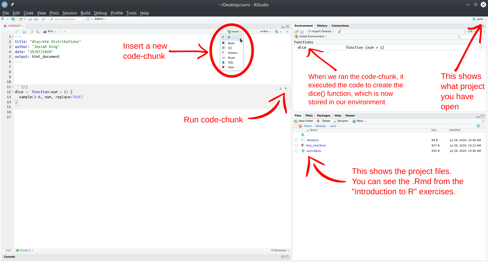

```{r setup, include=FALSE}
source('assets/setup.R')
```


:::lo
**Preliminaries**  

1. Please ensure you have successfully installed R and RStudio, or are working on RStudio Cloud, and that you have completed the tasks on the [Getting started in R & RStudio](00_introPG.html) page, which introduced the basics of a) how to navigate around Rstudio, b) how to create and write in an R script, c) how to read data into R, and d) how to use R to do basic arithmetic.  

2. Open Rstudio, and make sure you have your USMR course project open.  

3. Open a new R script document:    
__File > New File > R Script..__  
:::

# Simulating Dice

`r qbegin("A1")`
At the top of your script, copy the code from the lecture which creates a custom function called `dice()` (copied below). Be sure to *run* the code (highlight it all with your cursor, and hit "run" in the top right, or press Ctrl/Cmd+Enter).  
```{r}
dice <- function(num = 1) {
  sum(sample(1:6, num, replace=TRUE))
}
```

---

```{r echo=FALSE}

```

`r qend()`

<div style="border-radius: 5px; padding: 20px 20px 10px 20px; margin-top: 20px; margin-bottom: 20px; border: 1px solid #333333 !important;">
**What did that code do?**

In a sense, this code does *nothing*:  It won't give you any output when you run it.  What it is actually doing, though, is defining a *function* called `dice()`.  If you look at your *environment* panel (top right), you'll see `dice` appear when you run the code.
  
To produce some output, we have to *call* the function `dice()` (by writing it into code:  `dice(4)`, for example).  `dice()` wants to be supplied with some information (in the *argument* `num`).  If no information is supplied, num will take a *default value* of `1`.  (So writing `dice()` is equivalent to writing `dice(1)`).

What does `dice()` do with `num`?  It calls another function, `sample()`, with *3* arguments.  We didn't write `sample()`:  it's a function that's "supplied with" R.  To find out more about what `sample()` does:

* click inside the brackets just after `sample()` in your R script;

* press `TAB` (`⇥`), then `F1`

* you should see some help appear in the bottom right-hand panel of RStudio.

You will find that "`sample()` takes a sample ... from the elements of `x` ..."  If you compare the code in RStudio to the code under "Usage" you'll see that where the help has `x`, we have `1:6`.  So what does `1:6` mean?  One way to find out is to open the **console** in RStudio (bottom left) and just type stuff in.  What happens when you type `1:6`?  What about `2:17`?  (What about `6:1`?)

The console is the place to "try stuff out" (don't worry, you can't break it). 
Watch the video below and then try it out yourself:

<center><video width="320" height="240" controls>
  <source src="images/dice.mp4" type="video/mp4">
</video></center>

What you will discover is that `1:6` creates a *vector* (list of similar things, in this case numbers) of the numbers 1-6.
The next bit of the `sample()` function is `size`. In the `dice()` function, the `num` passes down to the `size` of the `sample()`: Looking through the help, `size` is the number of items to choose.  So `sample(1:6, 1)` would choose one number from the numbers 1-6 at random; `sample(1:6, 3)` would choose 3, and so on.  The last argument, `replace=TRUE`, tells `sample()` what to do with a number once it's been picked:  Does it go 'back into the bag' to be picked again (`TRUE`) or not? (`FALSE`)?  

Around the outside is `sum()` which simply sums the numbers on however many (`num`) dice you "rolled".  

Putting it all together, our `dice()` function "throws a die `num` times" by `sample()`ing from the numbers 1-6 `num` times, `replace`ing each number when it's been picked, and sums the numbers of all the dice.  

</div>


`r qbegin("A2")`
Look up the function `replicate()`. We can use it to do something in R lots of times!  
  ```{r}
  # run the code "1+1" 20 times: 
  replicate(20, 1+1)
  ```
  
Use `replicate()` to simulate 100 rolls of a single dice (*Hint:* this means `num = 1`), and store the results in an object in your environment. Give it an easily identifiable name.   
**Refresher:** defining things in R, we use the syntax `name <- value`  
  
Create a barplot showing the frequency with which each number was landed on in the 100 rolls.  
**Hint:** the functions `table()` and `barplot()` were used to do this in the lecture.
`r qend()`
`r solbegin(show=params$SHOW_SOLS, toggle=params$TOGGLE)`
We'll name it "roll100". 
```{r}
roll100 <- replicate(100, dice(1))
```

We can get the frequency table using `table()`
```{r}
table(roll100)
```
Which we can then pass to the `barplot()` function:
```{r}
barplot(table(roll100))
```
`r solend()`

`r qbegin("A3")`
Do the same for 1,000 rolls, and then for 10,000.  
What do you notice?  
`r qend()`
`r solbegin(show=params$SHOW_SOLS, toggle=params$TOGGLE)`
```{r}
d <- replicate(1000, dice(1))
barplot(table(d))

d <- replicate(10000, dice(1))
barplot(table(d))
```

:::int
The more rolls we do of the dice, the flatter the graph becomes. This is because there is an equal probability of the die landing on any of the responses - there is a **uniform probability**.  
:::
`r solend()`


:::statbox
__Uniformity__

The idea of a die having equal probability of landing on any of the responses is, in its abstract form is known as a **probability distribution**.  
For a fair 6-sided die, the probability of the die landing on each side is 1/6. The probabilities of all the possible responses sum to 1, because it has to land on *one of* the sides. 

```{r echo=FALSE, out.width="40%"}
tibble(response = 1:6, prob = rep(1/6,6)) %>%
ggplot(., aes(x=response, y=prob))+
  geom_point(size=3)+
  geom_segment(aes(x=response, xend=response, y=0,yend=prob),lty="dotted")+
  scale_x_continuous("faces of a die", breaks=1:6)+
  scale_y_continuous("probability", limits = c(0,1), breaks=map_dbl(1:6,~./6), labels=c(paste0(1:5,"/6"),"1"))+
  theme_classic()+
  theme(text = element_text(size = 24))
```
We can generalise from the example of a die to any variable which has a set of discrete response options. If it follows a uniform probability distribution, and there are $n$ possible responses, then the probability of each response ocurring is $1/n$. 

```{r echo=FALSE, out.width="40%"}
tibble(response = c(1,2,5), prob = rep(1/6,3)) %>%
ggplot(., aes(x=response, y=prob))+
  geom_point(size=3)+
  geom_segment(aes(x=response, xend=response, y=0,yend=prob),lty="dotted")+
  geom_segment(aes(x=2.9, xend=3.1, y=prob,yend=prob),lty="dotted")+
  geom_segment(aes(x=3.9, xend=4.1, y=prob,yend=prob),lty="dotted")+
  scale_x_continuous("possible responses", breaks=1:5, labels=c("1","2","...","...","n"))+
  scale_y_continuous("probability", limits = c(0,1/5), breaks=1/6, labels="1/n")+
  theme_classic()+
  theme(text = element_text(size = 24))
```
The focus of this topic is about categorical data - i.e. data which has a discrete set of response options. 
However, it is worth briefly thinking about how the uniform probability distribution can be utilised for a continuous numeric variable (e.g. something which as well as taking the values 4 and 5 can also take 4.1, 4.11, 4.1111111111, 4.764968473 etc.. - they can take *any* real value). 

We can preserve the idea that probability sums to 1 for this sort of variable by having the probability as $\frac{1}{b-a}$, where $a$ and $b$ are the lower and upper bounds of the response domain. 
Why? Because this makes the **area** of the distribution equal to 1 (area of a rectangle = width $\times$ height. $(b-a) \times \frac{1}{(b-a)} = \frac{b-a}{b-a} = 1)$. This means we can compute areas of parts of the distribution in order to calculate probabilities! 

```{r echo=FALSE, out.width="40%"}
tibble(response = 1:6, prob = rep(1/6,6)) %>%
ggplot(., aes(x=response, y=prob))+
  geom_point(aes(x=2,y=prob), size=3)+
  geom_point(aes(x=5,y=prob), size=3)+
  geom_segment(aes(x=2,xend=5,y=prob, yend=prob))+
  geom_segment(aes(x=2,xend=2,y=0, yend=prob),lty="dotted")+
  geom_segment(aes(x=5,xend=5,y=0, yend=prob), lty="dotted")+
  scale_x_continuous("possible response", limits = c(1,6), breaks=c(2,5), labels=c("a","b"))+
  scale_y_continuous("probability density", limits = c(0,1/5), breaks=1/6, labels="1/(b-a)")+
  theme_classic()+
  theme(text = element_text(size = 24))
```
This stuff will become important in future topics. 
:::


`r qbegin("A4")`
Copy the code below into your script and run it. 
It creates a new function called `wdice()` which simulates the rolling of `num` dice which are slightly weighted. 

Roll a single weighted die 100 times and plot the frequency distribution. Do the same for 1,000 and 10,000 rolls of a single die.  
Does a pattern emerge? At how many rolls? 

```{r}
wdice <- function(num = 1){
    sum(sample(1:6, num, replace=TRUE, prob = c(0.15,0.15,0.15,0.15,0.15,0.25)))
}
```

`r qend()`
`r solbegin(show=params$SHOW_SOLS, toggle=params$TOGGLE)`
Your plots will look slightly different to these, because all of our dice are random!  
```{r echo=FALSE}
set.seed(564)
```

```{r}
wd <- replicate(100, wdice(1))
barplot(table(wd))

wd <- replicate(1000, wdice(1))
barplot(table(wd))

wd <- replicate(10000, wdice(1))
barplot(table(wd))
```

:::int
The die is clearly weighted towards landing on 6. 
However, 100 rolls is not enough to reliably observe this. In our 100 rolls above, it landed on 2 quite a bit too! The pattern becomes clearer after 1000 rolls.  
:::

`r solend()`

`r qbegin("A5")`
Remember, `wdice()` and `dice()` are really just relying on different functions, like `sample()`. Try playing around with `sample()` in the console again - what does the `prob = c(....)` bit do?  
<br>

Now let's try to modify the `wdice()` function. Edit the code for `wdice()` so that 50% of the time it lands on number 6.  

**NOTE:** To test out your modified function, you will need to re-run code which defines the function. 
  
:::frame
__Think of it as "overwriting", "replacing", or "reassigning"__

```{r}
# define an object called "x" which has the value 3
x <- 3
# print the object x
x 
# reassign the name "x" to 2 plus the current value of x. 
x <- x + 2
# x is now 5, not 3
x
```

When we use the assignment operator `<-` we assign a name to a value and store in R's memory.  
To edit any of these named objects, we simply _reassign_ the name to the edited value. This applies to functions, to dataframes, and to specific observations in dataframes etc.  

:::

`r qend()`
`r solbegin(show=params$SHOW_SOLS, toggle=params$TOGGLE)`
The `prob` bit of `sample()` takes a set of probabilities `prob = c(.....)`.  
We need to be careful to remember that the probability of the different outcomes must sum to 1 (i.e., it's not possible to "50% of the time land on 6" as well as "70% of the time land on 5"!).  

```{r}
wdice <- function(num = 1){
    sum(sample(1:6, num, replace=TRUE, prob = c(0.1,0.1,0.1,0.1,0.1,0.5)))
}
```
`r solend()`

`r qbegin("A6")`
Can you observe the weighting in your new die (the one which 50% of the time lands on number 6) in only 100 rolls?  

Conceptually, what can we learn from this toy example?    
**Hint:** Think of how strongly weighted the die is as an *effect size*, and the number of rolls as the *sample size*.  
`r qend()`
`r solbegin(show=params$SHOW_SOLS, toggle=params$TOGGLE)`
```{r}
wd <- replicate(100, wdice(1))
barplot(table(wd))
```

:::int
The bigger the effect, the smaller the sample size required to observe it. 
:::

`r solend()` 

---

---

# Data in R   

Now that we've played with a toy example for a bit, we're going to look at reading in some data, exploring some of the variables, and the syntax we can use to access and edit certain bits of a dataset.    

## Reading in data

First we'll load the **tidyverse** package, so that we can use the `read_csv()` function.  
```{r}
library(tidyverse)
starwars2 <- read_csv("https://uoepsy.github.io/data/starwars2.csv")
```

:::rtip
__Reading data from a URL__ 

Note that when you have a url for some data (e.g. [this](https://raw.githubusercontent.com/uoepsy/data/master/starwars2.csv)) you can read it in directly by giving functions like `read_csv()` the url inside quotation marks. 
:::

The data contains information on various characteristics of characters from Star Wars.
We can print out the top of the data by using the `head()` function which displays the first six rows of the data by default. You could change this by saying, for example, `head(data, n = 10)`:
```{r}
head(starwars2, n = 10)
```

_(Don't worry about the_ NAs _for now, they are just how R tells you an entry is missing, i.e. Not Available.)_  

:::rtip
__Tip:__ Try clicking on the data in your __environment__ (the top right window of RStudio). It will open the data in a tab in the editor window - this is another way of looking at the data, more like you would in spreadsheet software like Microsoft Excel.
This can be time-consuming if your data file is big.
:::

We can take a look at how big the data is (the dimensions), using `dim()`
```{r}
dim(starwars2)
```

We can see that there are `r nrow(starwars2)` rows and `r ncol(starwars2)` columns.  
In the __starwars2__ data, each character is an __observational unit__, and there are 6 __variables__ (things which vary between units) such as their _height_, _species_, _homeworld_, etc.  

:::statbox
__Units and variables__

The individual entities on which data are collected are called __observational units__ or __cases__. Often (but not always), these equate to the rows of a dataset.  

A __variable__ is any characteristic that varies from observational unit to observational unit (these are often the columns of the dataset)
:::

## Accessing subsets of data

What if we want to extract certain subsections of our dataset, such as specific observational units or variables? 
This is where we learn about two important bits of R code used to access parts of data - the dollar sign `$`, and the square brackets `[]`.

:::rtip
__The dollar sign $__  
  
The dollar sign allows us to extract a specific variable from a dataframe.
For instance, we can pull out the variable named "eye_color" in the data, by using `$eye_color` after the name that we gave our dataframe: 
```{r}
starwars2$eye_color
```
:::

Each variable in a dataframe is a vector (a set of values). Once extracted, we will have a vector and not a dataframe.


:::rtip
__The square brackets []__  
  
Square brackets are used to do what is known as __indexing__ (finding specific entries in your data).  
We can retrieve bits of data by identifying the $i^{th}$ entry(s) inside the square brackets, for instance: 

```{r}
# assign the numbers 10, 20 ... 100 to the name "somevalues"
somevalues <- c(10, 20, 30, 40, 50, 60, 70, 80, 90, 100)

# pull out the 3rd entry
somevalues[3]
```

In the above example, we have a __vector__ (a single sequence of values), and so we can retrieve entries with the syntax:
<center> 
**vector[entry]**
</center>
<br>
In a __dataframe__ we have an extra dimension - we have rows _and_ columns. Using square brackets with a dataframe needs us to specify both:  
<center>
**dataframe[rows, columns]**
</center>
:::

Let's look at some examples: 
```{r}
# first row, fourth column:
starwars2[1, 4]

# tenth row, first column:
starwars2[10, 1]
```

<br>

If we leave either rows or columns blank, then we will get out __all__ of them: 
```{r}
# tenth row, all columns:
starwars2[10, ]

# all rows, 2nd column:
starwars2[ , 2]
```

<br>

There are is another way to identify column - we can use the name in quotation marks:
```{r}
# first row, "species" column
starwars2[1, "species"]
```
<br>
Finally, we can also ask for multiple rows, or multiple columns, or both! To do that, we use the combine function `c()`:
```{r}
# the 1st AND the 6th row, 
# and the 1st AND 3rd columns:
starwars2[c(1,6), c(1,3)]
```
<br>
And we can specify a sequence using the colon, `from:to`:  
```{r}
# FROM the 1st TO the 6th row, all columns:
starwars2[1:6, ]
```

Why? Because the colon operator, `from:to`, creates a vector from the value `from` to the value `to` in steps of 1.
```{r}
1:6
```
`r optbegin(label="Extra: Combining $ and []. Click the plus to expand &#8594;", olabel=FALSE)`
We can use the two accessors in combination: 

```{r}
# extract the variable called "name" and show the 20th entry 
starwars2$name[20]
```

This represents the 20th name in the data.

__Note:__ When we do this, we don't have the comma inside the square brackets.  
When we use the `$` to pull out a variable, such as `starwars2$name`, we no longer have a dataframe - `starwars2$name` doesn't have rows and columns, it just has a series of values - _it's a vector!_.   
So when you are using `[]` with a __vector__ (1 dimension) rather than a __dataframe__ (2 dimensions), you don't specify `[rows, columns]`, but simply `[entry]`. 
`r optend()`


:::rtip
__The dollar sign $__ 

Used to extract a variable from a dataframe:   

+ `dataframe$variable`

__The square brackets []__

Used to extract parts of an R object by identifying rows and/or columns, or more generally, "entries". Left blank will return all. 

+ `vector[entries]`
+ `dataframe[rows, columns]`
:::

### Accessing by a condition {-}  

We can also do something really useful, which is to access all the entries in the data for which _a specific condition_ is true.  

Let's take a simple example to start:
```{r}
somevalues <- c(10, 10, 0, 20, 15, 40, 10, 40, 50, 35)
```

To only select values which are greater than 20, we can use:
```{r}
somevalues[somevalues > 20]
```

:::rtip
Unpacking: `somevalues[somevalues > 20]`  
<br>
First, let's look at what `somevalues > 20` does. It returns TRUE for the entries of `somevalues` which are greater than 20, and FALSE for the entries of `somevalues` that are not (that is, which are less than, or equal to, 20. 

This statement `somevalues > 20` is called the __condition__.    
```{r}
somevalues > 20
```

We can give a name to this sequence of TRUEs and FALSEs
```{r}
condition <- somevalues > 20
condition
```

Now consider putting the sequence of TRUEs and FALSEs inside the square brackets in `somevalues[]`.
This returns only the entries of `somevalues` for which the condition is `TRUE`.  
```{r}
somevalues[condition]
```

So what we can do is use a __condition__ inside the square brackets to return all the values for which that condition is TRUE.

Note that you don't have to always give a name to the condition. This works too:
```{r}
somevalues[somevalues > 20]
```

:::

<br>
We can extend this same logic to a dataframe.
Let's suppose we want to access all the entries in our Star Wars data who have the value "Droid" in the _species_ variable.
To work out how to do this, we first need a line of code which defines our __condition__ - one which returns `TRUE` for each entry of the _species_ variable which is "Droid", and `FALSE` for those that are not "Droid".  

We can use the dollar sign to pull out the _species_ variable: 
```{r}
starwars2$species
```

And we can ask R whether each value __is equal to__ "Droid" (*Remember:* in R, we ask whether something __is equal to__ something else by using a double-equals, `==`). A single equal sign would be wrong, as it denotes assignment.
```{r}
starwars2$species == "Droid"
```

Finally, we can use this condition inside our square brackets to access the entries of the data for which this condition is TRUE:
```{r}
# I would read the code below as: 

# "In the starwars2 dataframe, give me all the rows for which the
# condition starwars2$species=="Droid" is TRUE, and give me all the columns."

starwars2[starwars2$species == "Droid", ]
```

`r optbegin('Optional: with(). Click the plus to expand &#8594;', FALSE)`
A useful function is `with()`. This creates a "container" where the variables of the dataframe are available to R within the `with()` parentheses without the need to use `$`:
```{r}
with(starwars2, starwars2[species == "Droid", ])
```
`r optend()`


## Editing parts of the data  

Now that we've seen a few ways of _accessing_ sections of data, we can learn how to edit them!  
One of the most common reasons you will need to modify entries in your data is in __data cleaning__. This is the process of identifying incorrect/incomplete/irrelevant data, and replacing/modifying/deleting them.  

### Changing specific entries {-}  

Above, we looked at the subsection of the data where the _species_ variable had the entry "Droid". Some of you may have noticed earlier that we had some data on C3PO. Is he not also a droid? 

<center>
  
</center>

(Looks pretty Droid-y to me! _disclaimer: I know nothing about Star Wars_ &#128578; )

Just as we saw above how to _access_ specific entries, e.g.: 
```{r}
# 2nd row, all columns
starwars2[2, ]
# 2nd row, 6th column (the "species" column)
starwars2[2,6]
```

We can change these by __assigning them a new value__ (remember the `<-` symbol):
```{r}
# C3PO is a droid, not a human
starwars2[2,6] <- "Droid"

# Look at the 2nd row now -
# the entry in the "species" column has changed:
starwars2[2, ]
```

:::rtip
We have _replaced_ / _overwritten_ / _reassigned_ , the entry in the 2nd row and 6th column of the data (`starwars2[2,6]`) with the value "Droid". 
:::

### Changing entries via a condition {-}  

We saw above how to access parts of data by means of a __condition__, with code such as:

```{r}
# "In the starwars2 dataframe, give me all the rows for which the
# condition starwars2$homeworld=="Naboo" is TRUE, and give me all the columns."
starwars2[starwars2$homeworld=="Naboo", ]
```

What if we wanted to modify it so that every character from "Naboo" was actually of species "Nabooian"?  

We can do that in a number of ways, all of which do the same thing - namely, they access parts of the data and assign them the new value "Nabooian".  

Study the lines of code below and their interpretations:  

```{r}
# In the starwars2 data, give the rows for which condition 
# starwars2$homeworld=="Naboo" is TRUE, and select only the "species" column. 
# Assign to these selected entries the value "Nabooian".
starwars2[starwars2$homeworld=="Naboo", "species"] <- "Nabooian"

# In the starwars2 data, give the rows for which condition 
# starwars2$homeworld=="Naboo" is TRUE, and select only the 6th column. 
# Assign to these selected entries the value "Nabooian".
starwars2[starwars2$homeworld=="Naboo", 6] <- "Nabooian"

# Extract the species variable from the starwars2 data (it's a vector).
# Pick the entries for which the condition starwars2$homeworld=="Naboo" is TRUE.
# Assign to these selected entries the value "Nabooian".
starwars2$species[starwars2$homeworld=="Naboo"] <- "Nabooian"
```


### Changing a variable

Another thing we might want to do is change a whole variable (a whole column) in some way.  
The logic is exactly the same, for instance, we can take the variable "height" from the dataframe "starwars2", dividing it by 100 via `starwars2$height / 100`, and then assign the result to the same variable name in the data, i.e. we overwrite the column: 
```{r}
starwars2$height <- starwars2$height / 100
```

We coud instead have added a _new column_ named "height2" with those values if we did not want to overwrite "height":
```{r eval=FALSE}
starwars2$height2 <- starwars2$height / 100
```
This would have left the "height" variable as-is, and created a new one called "height2" which was the values in "height" divided by 100. 


### Removing rows or columns

Lastly, we might want to change the data by removing a row or a column.
Again, the logic remains the same, in that we use `<-` to assign the edited data to a name (either a new name, thus creating a new object, or an existing name, thereby _overwriting_ that object).  
  
For instance, notice that the 35th and 75th rows of our data probably aren't a valid observation - I'm reasonably sure that Marge and Homer Simpson never appeared in Star Wars:
```{r}
starwars2[c(35,75), ]
```

We can remove a certain row(s) by using a minus sign `-` inside the square brackets 
```{r}
# everything minus the 75th row
starwars2[-75, ]

# everything minus the (35th and 75th rows)
starwars2[-c(35, 75), ]
```

And we can simply _re-use_ the name "starwars2" to overwrite the data and make this change take effect (rather than just print out the result, which the code above did):
```{r}
starwars2 <- starwars2[-c(35, 75), ]
```
(now, in the __environment__ pane of Rstudio, the object named "starwars2" will say 73 observations, rather than 75, which it had before - we've removed the 2 rows)   

<br>
The same logic applies for columns:
```{r}
# Create a new object called "anonymous_starwars2" and assign it 
# to the values which are the "starwars2" dataframe minus the 
# 1st column (the "name" column):
anonymous_starwars2 <- starwars2[, -1]

# print out anonymous_starwars2
anonymous_starwars2
```

# Types of Data

In the dice-rolling example, each roll of the die could take one of a discrete set of responses (1, 2, 3, 4, 5 or 6). A die cannot land on 5.3, or 2.6.  

There are many different things we can measure / record on observational units, and the data we collect will also have different characteristics. Some data will be similar to rolling a die in that values take on **categories**, and others could take any value on a **continuous** scale. In the last couple of years during welcome week, we have asked students of the statistics courses in the Psychology department to fill out a little survey. 
```{r echo=F, fig.cap="Screenshot of survey data fields"}

```
Consider how we have captured data on student heights (we asked for answers in cm, and respondents could be precise as they liked) and the colours of they eyes (we gave a set of options to choose from). We distinguish between these different types of data by talking about __categorical__ and __numerical__ variables. Within each, there also are a few important sub-classes.

:::statbox
__Categorical__ variables tell us what group or category each individual belongs to. Each distinct group or category is called a __level__ of the variable.
:::

|  __Type__ | __Description__ |  __Example__|
|:--|:--|:--|
|  __Nominal (Unordered categorical)__ | A categorical variable with _no_ intrinsic ordering among the levels. | Species: _Human_, _Droid_, _Wookie_, _Hutt_, ... |
|  __Ordinal (Ordered categorical)__ | A categorical variable which levels possess some kind of order |  Level: _Low_, _Medium_, _High_ |
|  __Binary categorical__ | A special case of categorical variable with only 2 possible levels |  Is_Human: _Yes_ or _No_. |

<br>

:::statbox
__Numerical__ (or quantitative) variables consist of numbers, and represent a measurable quantity. Operations like adding and averaging make sense only for numeric variables.
:::
|  __Type__ | __Description__ |  __Example__|
|:--|:--|:--|
|  __Continuous__ | Variables which can take any real number within the specified range of measurement |  Height: _172_, _165.2_, _183_, ... |
| __Discrete__ |  Variables which can only take integer number values. For instance, a _counts_ can only take positive integer values (0, 1, 2, 3, etc.) | Number_of_siblings: _0_, _1_, _2_, _3_, _4_, ... |


```{r echo=FALSE}
knitr::include_graphics("images/ahorst/continuous_discrete.png")
```
```{r echo=FALSE, fig.cap="Artwork by \\@allison_horst"}
knitr::include_graphics("images/ahorst/nominal_ordinal_binary.png")
```

  

# Categorical distributions  

For these exercises, we have a dataset on some of the most popular internet passwords, their strength, and how long it took for an algorithm to crack it. The data are available online at https://uoepsy.github.io/data/passworddata.csv.  
  
| Variable Name | Description            |
|---------------|--------------------|
| rank   | Popularity in the database of released passwords |
| password     | Password |
| type     | Category of password  |
| cracked     | Time to crack by online guessing |
| strength     | Strength = quality of password where 10 is highest, 1 is lowest |
| strength_cat     | Strength category (weak, medium, strong) |

`r qbegin("B1")`
Read in the data from the url.  
Pass the dataset to `summary()` to see a quick summary of each variable. Which variables are categorical?  

<br>
Don't get misled by the output of `summary()` - R doesn't know what type each variable is, and will use a best guess. For instance, it will treat a variable like  "strength" as numerical, when it is actually a set of ordered categories.  
`r qend()`
`r solbegin(show=params$SHOW_SOLS,toggle=params$TOGGLE)`
```{r}
pwords <- read_csv("https://uoepsy.github.io/data/passworddata.csv")
summary(pwords)
```
`r solend()`

`r qbegin("B2")` 
In R, categorical variables are known as "factors".  
  
Explore the help documentation for the `factor()` function.   
(type `?factor` into the console to bring the help page up). 
  
For the "type" and "strength_cat" variables, use `factor()` to modify the variable so that R knows it's a factor. Can you tell R about the ordering of the "strength_cat" variable?  
After you've done this, try `summary()` again to see how the output changes for these two variables.    

`r qend()`
`r solbegin(show=params$SHOW_SOLS,toggle=params$TOGGLE)`
Note that in R, "factors" have an attribute called "levels". These are the possible responses/categories.
```{r}
pwords$type <- factor(pwords$type)
levels(pwords$type)
```

The strength_cat variable is a factor, but it has an order. We tell R about this ordering, but we actually have to tell R the specific ordering. It will default to alphabetically ordering them, which would give "medium" < "strong" < "weak", which is not what we want at all!  
```{r}
pwords$strength_cat <- factor(pwords$strength_cat, ordered = TRUE, levels = c("weak","medium","strong"))
levels(pwords$strength_cat)
```

Now let's look at how `summary()` now behaves:
```{r}
summary(pwords)
```
`r solend()`


`r qbegin("B3")`
Create a table of frequencies of different password types.  
How might you turn the table into a table of percentages, rather than of counts? 
`r qend()`
`r solbegin(show=params$SHOW_SOLS,toggle=params$TOGGLE)`
```{r}
table(pwords$type)
```
Divide by the total number of passwords (500) in order to turn them into proportions. Multiply by 100 to turn them to percentages. 
```{r}
table(pwords$type)/500*100
```
`r solend()`

`r qbegin("B4")`
`table()` can take multiple variables, not just one.  

We're interested in how password strength differs between "cool-macho" passwords and "simple-alphanumeric" passwords.
Make a two-way contingency table of strength and type, showing only the "cool-macho" and "simple-alphanumeric" passwords.  

**Hints:**  

- We can specify multiple conditions using `&` and `|` for "and" and "or" respectively. Try playing in the console to see what these lines do:  
  ```{r eval=FALSE}
  pwords[pwords$type == "cool-macho" | pwords$type == "simple-alphanumeric", ]
  pwords[pwords$type == "cool-macho" & pwords$strength == 6, ]
  pwords[pwords$cracked > 5 & pwords$strength < 5, ]
  pwords[pwords$password=="bear" | pwords$strength == 2, ]
  ```
- You might find that the table you create has all the other "levels" in it too. You could try looking into the `droplevels()` function.
`r qend()`
`r solbegin(show=params$SHOW_SOLS,toggle=params$TOGGLE)`
```{r}
# one way to do it:
table(pwords$type[pwords$type == "cool-macho" | pwords$type == "simple-alphanumeric"],
      pwords$strength[pwords$type == "cool-macho" | pwords$type == "simple-alphanumeric"])

# another way:
coolsimple <- pwords[pwords$type == "cool-macho" | pwords$type == "simple-alphanumeric", ]
table(coolsimple$type, coolsimple$strength)

# We can get rid of the empty levels of the "type" variable using droplevels():
coolsimple <- droplevels(coolsimple)
table(coolsimple$type, coolsimple$strength)
```
`r solend()`

`r qbegin("B5")`
For a randomly selected "cool-macho" password, what is the probability that it has a strength of $\geq 5$? 
What about for a randomly selected "simple-alphanumeric" password?
`r qend()`
`r solbegin(show=params$SHOW_SOLS,toggle=params$TOGGLE)`
Think about what the code below does:
```{r eval=FALSE}
pwords$strength >=5
```

We can actually use this to really easily edit our two-way table:
```{r}
table(pwords$type, pwords$strength>=5)
```

For "cool-macho" the probability of being $\geq 5$ is $\frac{74}{74+5}$ = `r round(74/(74+5),2)`.  
For "simple-alphanumeric" the probability of being $\geq 5$ is $\frac{17}{44+17}$ = `r round(17/(44+17),2)`.  
`r solend()`

# ggplot! 

:::frame
_"By visualizing information, we turn it into a landscape that you can explore with your eyes. A sort of information map. And when you’re lost in information, an information map is kind of useful."_ – [David McCandless](https://informationisbeautiful.net/)
:::

We're going to now make our first steps into the world of data visualisation. R is an incredibly capable language for creating visualisations of almost any kind. It is used by many media companies (e.g., the BBC), and has the capability of producing 3d visualisations, animations, interactive graphs, and more.  

We are going to use the most popular R package for visualisation, __ggplot2__. This is actually part of the __tidyverse__, so if we have an R script, and we have loaded the __tidyverse__ packages at the start (by using `library(tidyverse)`), then __ggplot2__ will be loaded too).  

Recall our way of plotting frequencies that we have seen so far: 
```{r}
barplot(table(pwords$strength))
```

We can also use ggplot() to visualise this. The benefit is that we can easily then edit *all* aspects of the visualisation.  
```{r}
# create the plot, and give the "mappings"
ggplot(data = pwords, aes(x = strength)) + 
  # add some shapes
  geom_bar() +
  # add some titles, axes labels etc
  labs(x = "Password Strength", y = "Count", title = "Password strength frequencies")+
  # specify the exact x values for the axis
  scale_x_continuous(breaks=1:10)
  
```

:::rtip
__Basic ggplot components__  

Note the key components of the ggplot code. 

*  `data = ` where we provide the name of the dataframe. 
*  `aes = ` where we provide the _aesthetics_. These are things which we map from the data to the graph. For instance, the x-axis, or if we wanted to colour the columns/bars according to some aspect of the data. 

Then we add (using `+`) some _geometry_. These are the shapes (in our case, the columns/bars), which will be put in the correct place according to what we specified in `aes()`.  

* `+ geom_....` Adds different shapes (e.g., bars) to the plot.  

<br>
You can find great documentation on ggplot2 at https://www.statsandr.com/blog/graphics-in-r-with-ggplot2/.  
:::


`r optbegin("Optional - Looking ahead to different aes() and geoms, labels. Click the plus to expand &#8594;", olabel=FALSE)`
Use these as reference for when you want to make changes to the plots you create.  
Additionall, remember that google is your friend - there are endless forums with people asking how to do something in ggplot, and you can just copy and paste bits of code to add to your plots!  
  
1. Filling/colouring geoms: 
```{r}
ggplot(data = pwords, aes(x = strength, fill = strength_cat)) +
  geom_bar()+
  labs(x = "Password Strength", y = "Count", title = "Password strength frequencies") +
  scale_x_continuous(breaks=1:10)
```
2. Change the limits of the axes:
```{r}
ggplot(data = pwords, aes(x = strength, fill = strength_cat)) +
  geom_bar()+
  labs(x = "Password Strength", y = "Count", title = "Password strength frequencies") + 
  scale_x_continuous(breaks=1:10) +
  ylim(0,200)
```
3. Remove (or reposition) the legend:
```{r}
# setting legend.position as "bottom" would put it at the bottom!
ggplot(data = pwords, aes(x = strength, fill = strength_cat)) +
  geom_bar()+
  labs(x = "Password Strength", y = "Count", title = "Password strength frequencies") + 
  scale_x_continuous(breaks=1:10) + 
  theme(legend.position = "none") 
```
4. Changing the theme:
```{r}
# there are many predefine themes, including: 
# theme_bw(), theme_classic(), theme_light()

ggplot(data = pwords, aes(x = strength, fill = strength_cat)) +
  geom_bar()+
  labs(x = "Password Strength", y = "Count", title = "Password strength frequencies") + 
  scale_x_continuous(breaks=1:10) + 
  theme_minimal()
```
5. Other shapes, x and y:
```{r}
ggplot(data = pwords, aes(x = type, y = strength)) +
  geom_boxplot()

ggplot(data = pwords, aes(x = type, y = strength)) +
  geom_violin()

ggplot(data = pwords, aes(x = strength, y = cracked)) + 
  geom_point()
```
`r optend()`


```{r echo=FALSE, fig.cap="Artwork by \\@allison_horst"}
knitr::include_graphics("images/ahorst/ggplot2_masterpiece.png")
```

`r qbegin("C1")`
Create a ggplot visualisation which shows how password strengths (either the categories 1:10, or the categories weak, medium, and strong) are different depending on the password type. There's no *Correct* answer to this, but certain ways of visualising provide different perspectives, and different levels of clarity.  

Some things you *might* to look into (but don't *have* to use): 

- `facet_wrap()` or `facet_grid()`
- `coord_flip()`  

`r qend()`
`r solbegin(show=params$SHOW_SOLS,toggle=params$TOGGLE)`
Some options:
```{r fig.width=8, fig.height=8}
ggplot(data = pwords, aes(x = type, fill = strength_cat)) +
  geom_bar()+
  labs(x = "Password Strength", y = "Count") + 
  theme_minimal()

ggplot(data = pwords, aes(x = type, fill = strength_cat)) +
  geom_bar(position="dodge")+
  labs(x = "Password Strength", y = "Count") + 
  theme_minimal()

ggplot(data = pwords, aes(x = strength, fill = strength_cat)) +
  geom_bar()+
  labs(x = "Password Strength", y = "Count") + 
  theme_minimal()+
  facet_wrap(~type)

ggplot(data = pwords, aes(x = type, fill = strength_cat)) +
  geom_bar()+
  labs(x = "Password Type", y = "Count") + 
  theme_minimal() + 
  coord_flip() + 
  facet_wrap(~strength_cat, scales = "free_x")
```


`r solend()`

<div class="tocify-extend-page" data-unique="tocify-extend-page" style="height: 0;"></div>

