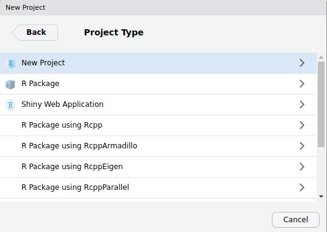
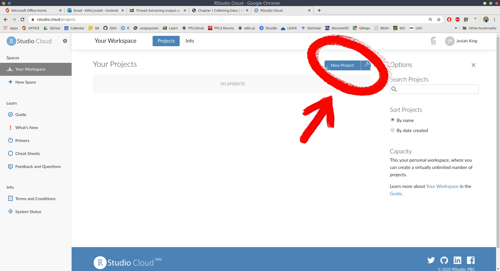
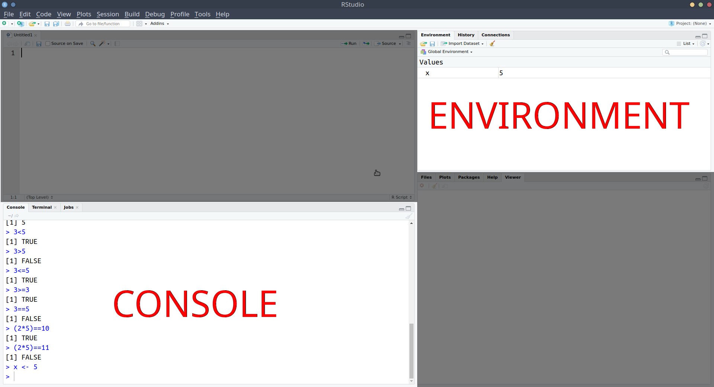
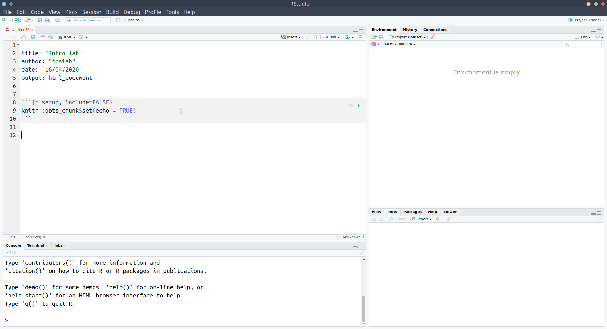

# Collecting Data {#chap-collecting-data}

:::lo
#### Learning Objectives {-}

+ LO1: Install R & Rstudio, and get comfortable with the layout  
+ LO2: Learn about how to read in and store data in R
+ LO3: Produce your first Rmarkdown document  
:::


:::frame 
      
You have two options for how you use R and Rstudio:  

  __A:__ Download R and Rstudio onto your computer (recommended)  
  __B:__ Use R and Rstudio online via a web browser (for people using chromebooks).  


__Checklist for today__

1. __EITHER:__
    + Option A: Install R and Rstudio
    + Option B: Register for RstudioCloud (free) and log in
1. Start a new project for the course
1. Change a few Rstudio settings (recommended)
1. Install some R packages (the "tidyverse")
1. Create a new Rmarkdown document
1. Complete today's tasks and exercises
1. Compile your Rmarkdown document
1. Celebrate!

:::

## Introducing R and Rstudio  

### Installing R and Rstudio {-}  

`r solbegin("Option A: Installing R and Rstudio (recommended)",slabel=FALSE)`

1. Download and install the most recent version of R:  
    + If you are on a Mac: https://cran.r-project.org/bin/macosx/
    + If you are on Windows: https://cran.r-project.org/bin/windows/base/
1. Download and install Rstudio:  
    + Choose the appropriate downloaded for your computer (e.g.., MacOS/Windows): https://www.rstudio.com/products/rstudio/download/#download
1. Open Rstudio:
1. Create a new project:
    + File > New Project..
    + Click New Directory:  
    
    + Click New Project:  
    
    + Name the project, and decide where you want to save it on your computer by clicking on browse. Then click Create Project:  
    

`r solend()`

`r solbegin("Option B: Rstudio Cloud (for chromebook users)",slabel=FALSE)`

1. Register for Rstudio Cloud [(https://rstudio.cloud/)](https://rstudio.cloud/). 
1. Log in to Rstudio Cloud 
1. Create a new project

1. Rename the project


`r solend()`

### First look at Rstudio {-} 

Okay, now you should have a project open, and you should see something which looks more or less like the below, where there are several little windows.  


We're going to explore what each of these little windows offer by just diving in and starting to do things. 

### R as a calculator {-}  

Starting in the left-hand window, you'll notice the little blue arrow <span style="color:blue">\></span>. 
This is where we R code gets _executed_. 
Type 2+2, and hit enter &#8629;   

It's a calculator!  

Let's work through some of the basic operations (adding, subtracting etc).   
Try these commands yourself:

+ `2+5`
+ `10-4`
+ `2*5`
+ `10-(2*5)`
+ `(10-2)*5` 
+ `10/2`
+ `3^2` (Hint, interpret the `^` symbol as "to the power of")

:::green  
__Helpful tip__

Whenever you see the blue arrow (<span style="color:blue">\></span>), it means R is ready and waiting for a command.  

If you type `10+` and press enter, you'll see that instead of <span style="color:blue">\></span> you are left with <span style="color:blue">\+</span>. This means that R is waiting for more. Either give it more, or cancel the command by pressing the escape key on your keyboard. 
:::
  
Now let's take a sidestep.   
As well as performing calculations, we can _ask_ R things, such as "Is 3 less than 5?":
```{r}
3<5
```

Try the following:  

+ `3>5` - "is 3 greater than 5?"
+ `3<=5` - "is 3 less than OR equal to 5?"
+ `3>=3` - "is 3 greater than OR equal to 3?"
+ `3==5` - "is 3 equal to 5?"
+ `(2*5)==10` "is 2 times 5 equal to 10?"
+ `(2*5)!=11` "is 2 times 5 NOT equal to 11?"

### R as a calculator with a memory {-}

We can also store things in R's memory, and to that we just need to give them a name.  
Type `x <- 5` and press enter.  
  
What has happened? We've just stored something named `x` which has the value `5`. 
We can now refer to the name and it will give us the value! 
Try typing `x` and hitting enter. It should give you the number 5.  
What about `x*3`?  

:::yellow
__Storing things in R__  

The `<-` symbol is used to _assign_ a value to a named object. 

_[name]_ <- _[value]_  
  
Note, there are a few rules about names in R:  

+ No spaces - spaces _inside_ a name are not allowed (the spaces around the `<-` don't matter):  
    + `lucky_number <- 5` &#10004; &emsp; `lucky number <- 5` &#10060;  
+ Names must start with a letter:  
    + `lucky_number <- 5` &#10004; &emsp; `1lucky_number <- 5` &#10060;  
+ Case sensitive:  
    + `lucky_number` is different from `Lucky_Number`  
+ Reserved words - there is a set of words you can't use as names, including: if, else, for, in, TRUE, FALSE, NULL, NA, NaN, function  
(Don't worry about remembering these, R will tell you if you make the mistake of trying to name a variable after one of these). 

:::

You might have noticed that something else happened when you executed the code `x<-5`. 
The thing we named __x__ with a value of __5__ suddenly appeared in the top-right window. This is known as the __environment__, and it shows everything that we store things in R: 

 

We've now used a couple of the windows - we've been executing R code in the __console__, and learned about how we can store things in R's memory (the __environment__) by assigning a name to them:  



Notice that in the screenshot above, we have moved the __console__ down to the bottom-left, and introduced a new window above it. This is the one that we're going to talk about next.  

### Rscripts and Rmarkdown {-}  

What if we want to edit our code?  
Whatever we write in the console just disappears upwards. What if we want to change things we did earlier on?  

Well, we can write and edit our code in a separate place _before_ sending it to the __console__ to be executed!!

#### R scripts {-}

`r qbegin("Task",qlabel=FALSE)`
1. Open an R script
    + __File > New File > R script__
1. Copy and paste the following into the R script
```{r eval=FALSE}
x<-210
y<-15
x/y
```
1. With your text-cursor (blinking vertical line) on the top line:
    + Ctrl + enter (Windows)
    + Cmd + enter (MacOS)
`r qend()`

Notice what has happened - it has sent the command `x<-210` to the console, where it has been executed, and __x__ is now in your environment.   
Additionally, it has moved the text-cursor to the next line.  


`r qbegin("Task",qlabel=FALSE)`
Press Ctrl + enter (Windows) or Cmd + enter (MacOS) again.   
Do it twice (this will run the next two lines).  
  
Then, change __x__ to some other number in your R script, and run the lines again (starting at the top).
`r qend()`

`r qbegin("Task",qlabel=FALSE)`
Add the following line to your Rscript and execute it (send it to the console pressing Ctrl/Cmd + Enter):
```{r eval=FALSE}
plot(1,5)
```
`r qend()`

A very basic plot should have appeared in the bottom-right of Rstudio. 
The bottom-right window actually does some other useful things. 

`r qbegin("Task",qlabel=FALSE)`
1. Save the Rscript you have been working with:
    + File > Save
    + give it an appropriate name, and click save.
1. Check that you can now see that file in the project, by clicking on the "Files" tab of the bottom-right window. 
`r qend()`

#### Rmarkdown {-}

In addition to R scripts, there is another type of document we can create, known as an "Rmarkdown". 

Rmarkdown documents combine the analytical power of R and the utility of a text-processor. 
We can have one document which contains all of our analysis as well as our written text, and can be _compiled_ into a nicely formatted report. This saves us doing analysis in R and copying results across to Microsoft Word. It ensures our report accurately reflects our analysis. Everything that you're reading now has all been written in Rmarkdown!  

We're going to use Rmarkdown documents throughout this course. We'll get into it how to write them lower down, but it basically involves writing normal text interspersed with "code-chunks" (i.e., chunks of code!).   
In the example below, you can see the grey boxes indicating the R code, with text in between.  
We can then compile the document into either a __.pdf__ or a __.html__. 


### Recap {-} 

Okay, so we've now seen all of the different windows in Rstudio in action:

+ The __console__ is where R code gets executed
+ The __environment__ is R's memory, you can _assign_ something a name and store it here, and then refer to it by name in your code.
+ The __editor__ is where you can write and edit R code and Rmarkdown documents. You can then send this to the console for it to be executed.
+ The bottom-right window shows you the __plots__ that you create, the __files__ in your project, and some other things (we'll get to these later). 


---  

## Take a breather

Below are a couple of our recommended settings for you to change as you begin your journey in R. 
After you've changed them, take a 5 minute break before moving on to learning about how we store data in R.  

:::green
__Useful Settings 1: Clean environments__  

As you use R more, you will store lots of things with different names. Throughout this course alone, you'll probably name hundreds of different things.  
This could quickly get messy within our project.  
  
We can make it so that we have a clean environment each time you open Rstudio. This will be really handy. 


1. In the top menu, click  
__Tools > Global Options...__
1. Then, _untick_ the box for "Restore .RData into workspace at startup", and change "Save workspace to .RData on exit" to "Never":

:::

:::green
__Useful Settings 2: Wrapping code__  

In the editor, you might end up with a line of code which is really long:
```{r eval=FALSE}
x <- 1+2+3+6+3+45+8467+356+8565+34+34+657+6756+456+456+54+3+78+3+3476+8+4+67+456+567+3+34575+45+2+6+9+5+6
```

You can make Rstudio 'wrap' the line, so that you can see it all, without having to scroll. 
```{r eval=FALSE}
x <- 1+2+3+6+3+45+8467+356+8565+34+34+657+6756+456+456+54+3+78+3+3476+8+4+67+
456+567+3+34575+45+2+6+9+5+6
```

1. In the top menu, click  
__Tools > Global Options...__
1. In the left menu of the box, click "Code"
1. _Tick_ the box for "Soft-wrap R source files"
:::

---  

## Data in R

### Installing R packages {-}  

Alongside the basic installation of R and Rstudio, there are many add-on packages which the R community create and maintain.  
  
The thousands of packages are part of what makes R such a powerful and useful tool - there is a package for almost everything you could want to do in R. 
  
In order to be able to write and compile Rmarkdown documents (and do a whole load of other things which we are going to need throughout the course) we are now going to install a set of packages known collectively as the "tidyverse".  

`r qbegin("Task",qlabel=FALSE)`
In the __console__, type `install.packages("tidyverse")` and hit enter.  

Lots of red text will come up, and it will take a bit of time. 

When it has finished, and R is ready for you to use again, you will see the little blue arrow <span style="color:blue;">\></span>. 

### Starting a new .Rmd document {-}   

`r qbegin("Task",qlabel=FALSE)`
Open a new Rmarkdown document. 

__File > New File > R Markdown..__

When the box pops-up, give a title of your choice ("Intro lab", maybe?) and your name as the author.  
`r qend()`

The file which opens will have some template stuff in it. Delete everything below the first code chunk to start with a fresh document:



`r qbegin("Task",qlabel=FALSE)`
Insert a new code chunk by either using the Insert button in the top right of the document, and clicking R, or typing _Ctrl + Alt + i_ 

Inside the chunk, type:  
`print("Hello world! My name is ?")`.  

To execute the code inside the chunk, you can either:  

+ do as you did in the R script - put the text-cursor on the first line, and hit Ctrl/Cmd + Enter to run the lines sequentially 
+ click the little green arrow at the top right of your code-chunk to run all of the code inside the chunk.  

You can see that the output gets printed below. 
`r qend()`

### Using R packages {-}
  
We're going to use some functions which are in the __tidyverse__ package, which already installed above.    
However, it's not enough just to install it - to actually _use_ the package, we need to load it using `library(tidyverse)`.  


(source: https://twitter.com/visnut/status/1248087845589274624)

When writing analysis code, we want it to be __reproducible__ - we want to be able to give somebody else our code and the data, and ensure that they can get the same results. To do this, we need to show what packages we use.  
It is good practice to load any packages you use at the top of your code. 

`r qbegin("Task",qlabel=FALSE)`
In your first code chunk, type:
```{r}
#I'm going to use these packages in this document:
library(tidyverse)
```
and run the chunk.  
_Note, you might get various messages popping up below when you run this chunk, that is fine)._  
:::yellow  
__Comments in code__  
Note that using `#` in R code makes that line a comment, which basically means that R will ignore the line. Comments are useful for you to remind yourself of what your code is doing.
:::
`r qend()`

`r qbegin("Task",qlabel=FALSE)`
__Below__ the code chunk, add a new line with the following:  

 # R code examples  
`r qend()`

Note that when the # is used in a Rmarkdown file __outside__ of a code-chunk, it will make that line a heading when we finally get to _compiling_ the document. Below, what you see on the left will be compiled to look like those on the right:  


`r qbegin("Task",qlabel=FALSE)`
In your Rmarkdown document, choose a few of the symbols below, and write an explanation of what it does, giving an example in a code chunk. You can see an example of the first few below. 

+ `+` 
+ `-`
+ `*`
+ `/`
+ `()`
+ `^`
+ `<-`
+ `<`
+ `>`
+ `<=`
+ `>=`
+ `==`
+ `!=` 


`r qend()`


### Storing data in R: Sequences ("Vectors") of values {-} 

We've already seen how to assign a value to a name/symbol using `<-`.   
However, we've only seen how to assign a single number, e.g, `x<-5`.  

To assign a sequence of values to R, we combine the values using `c()`. 

```{r}
myfirstvector <- c(1,5,3,7)
myfirstvector
```

We can perform arithmetic operations to each value in the vector:  
```{r}
myfirstvector + 5
```

Values don't have to be numbers, but note what happens when we try to add 5 to a sequence which includes some non-numbers:  

```{r, eval=FALSE}
mysecondvector <- c(1,4,"cat","dog","parrot","peppapig")
mysecondvector + 5
```
<p style="color:red">Error in mysecondvector + 5 : non-numeric argument to binary operator</p>

### Reading in data {-}

While we can manually input data like we did above, more often, we will need to read in data which has been created elsewhere (like in excel, or by some software which is used to present participants with experiments).  

`r qbegin("Task",qlabel=FALSE)`
Add a new heading by typing the following:  

 # Reading and storing data
 
__Remember:__ We make headings using the # _outside_ of a code chunk. 
`r qend()`

`r qbegin("Task",qlabel=FALSE)`
Open Microsoft Excel, or LibreOffice Calc, or whatever spreadsheet software you have available to you, and create some data with more than one variable.  
  
It can be whatever you want, but we've used a very small example here for you to follow, so feel free to use it if you like. 
  
We've got two sets of values here: the names and the birth-years of each member of the beatles. The easiest way to think of this would be to have a row for each Beatle, and a column for each of name and birth-year.   


`r qend()`

`r qbegin("Task",qlabel=FALSE)`
Save the data as a __.csv__ file.  
  
Although R can read data when it's saved in Microsoft/LibreOffice formats, the simplest, and most universal way to save data is as simple text, with the values separated by some character - __.csv__ stands for __comma separated values__.  
 
In Microsoft Excel, if you go to:
__File > Save as__  
In the Save as Type box, choose to save the file as __CSV (Comma delimited)__.  


__Important:__ save your data in the project folder you created at the start of this lab. 
`r qend()`

Back in Rstudio...

Next, we're going to read the data into R. We can do this by using the `read_csv()` function, and directing it to the file you just saved.  

`r qbegin("Task",qlabel=FALSE)`
Create a new code-chunk in your Rmarkdown, and in the chunk, type:
`read_csv("name-of-your-data.csv")`, where you replace _name-of-your-data_ with whatever you just saved your data as in your spreadsheet software.  

:::green
__Helpful tip__  

If you have your text-cursor inside the quotation marks, and press the tab key on your keyboard, it will show you the files inside your project. You can then use the arrow keys to choose between them and press enter to add the code: 

TODO - screencap gif
:::

When you run the line of code you just wrote, it will print out the data, but will not store it. To do that, we need to assign it as something:
```{r}
beatles <- read_csv("data_from_excel.csv")
```
Note that this will now turn up in the _Environment_ pane of Rstudio.  
`r qend()`

Now that we've got our data in R, we can print it out by simply using its name:  
```{r}
beatles
```

And we can do things such as ask R how many rows and columns there are:
```{r}
dim(beatles)
str(beatles)
```

`r qbegin("Task",qlabel=FALSE)`
Use `dim()` to confirm how many rows and columns are in your data.  

Use `str()` to take a look at the structure of the data.  
Don't worry about the output of `str()` right now, we'll pick up with this in the next chapter. 
`r qend()`

---

`r qbegin("Task",qlabel=FALSE)`
By now, you should have an Rmardkown document ( __.Rmd__ ) with your answers to the tasks we've been through today.  
  
Compile the document by clicking on the __Knit__ button at the top (it will ask you to save your document first). The little arrow to the right of the Knit button allows you to compile to either __.pdf__ or __.html__. 
`r qend()`


:::frame 
__Checklist for today__

1. __EITHER:__
    + Option A: Install R and Rstudio &emsp; &#10004;
    + Option B: Register for RstudioCloud (free) and log in &emsp; &#10004;
1. Start a new project for the course &emsp; &#10004;
1. Change a few Rstudio settings (recommended) &emsp; &#10004;
1. Install some R packages (the "tidyverse") &emsp; &#10004;
1. Create a new Rmarkdown document &emsp; &#10004;
1. Complete today's tasks and exercises &emsp; &#10004;
1. Compile your Rmarkdown document &emsp; &#10004;
1. Celebrate! &emsp; &#10004; &#127881;

:::


## Glossary {-}

+ console
+ environment
+ editor
+ r script
+ rmarkdown


| Symbol |  Description| Example |
|--:|--:|--:|
|`+` |  Adds two numbers together | `2+2` - two plus two |
|`-`|   Subtract one number from another  | `3-1` - three minus one |
|`*`|   Multiply two numbers together | `3*3` - three times three |
|`/`|   Divide one number by another  | `9/3` - nine divided by three |
|`()`|  group operations together     | `(2+2)/4` is different from `2+2/4` |
|`^`|   to the power of..    | `4^2` - four to the power of two, or four squared |
|`<-`|  stores an object in R with the left hand side (LHS) as the name, and the RHS as the value | `x<-10` |
|`=`|   stores an object in R with the left hand side (LHS) as the name, and the RHS as the value | `x = 10`     |
|`<`|   is less than?  | `2<3` |
|`>`|   is greater than? | `2>3` |
|`<=`|  is less than or equal to? | `2<=3` |
|`>=`|  is greater than or equal to? | `2>=2` |
|`==`|  is equal to? | `(5+5) == 10` |
|`!=` | is not equal to?  | `(2+3) != 4` |
| `c()` | combines values into a vector (a sequence of values) | `c(1,2,3,4)` | 


