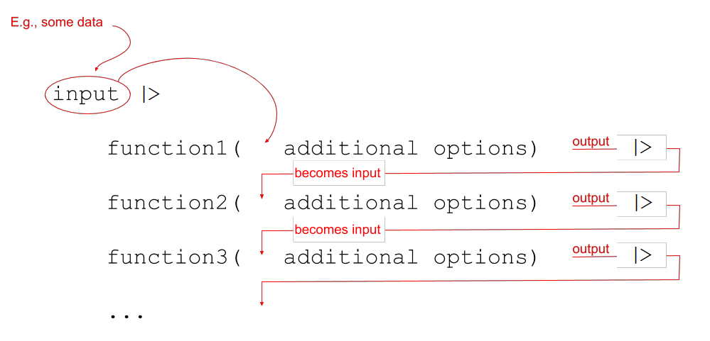

```{r setup, include=FALSE}
source('assets/setup.R')
library(patchwork)
```


:::red
**Preliminaries**  

- Be sure to check the [**solutions to last week's exercises**](01_categorical.html). You can still ask any questions about previous weeks' materials if things aren't clear!    

1. Open Rstudio, make sure you have the USMR project open, and create a new RMarkdown document (giving it a title for this week). 

2. Make sure you regularly save the Rmarkdown files you are writing in, and it might help to close the ones from previous weeks to make your RStudio experience less busy. You should still be able to see in the bottomr right window of RStudio, there is a "Files" tab. When this is open, you are able to see the various files within your project. 

:::


# Reading: Tidyverse and pipes! 

Before we get started on the statistics, we're going to briefly introduce a crucial bit of R code. 

We have seen already seen a few examples of R code such as: 
```{r eval=FALSE}
# show the dimensions of the data
dim(somedata)
# show the frequency table of values in a variable
table(somedata$somevariable)
```

And we have seen how we might wrap functions inside functions: 
```{r eval=FALSE}
barplot(table(somedata$somevariable))
```

:::yellow
__R evaluates code from the inside-out!__ 

You can end up with functions inside functions inside functions ... 
```{r eval=FALSE}
# Don't worry about what all these functions do, 
# it's just an example -
round(mean(log(cumsum(diff(1:10)))))
```
:::

We can write in a different style, however, and this may help to keep code tidy and easily readable - we can write __sequentially__:  



Notice that what we are doing is using a new symbol: `%>%`  
This symbol takes the output of whatever is on it's left-hand side, and uses it as an _input_ for whatever is on the right-hand side. The `%>%` symbol gets called a "pipe".  

Let's see it in action with the starwars2 dataset from the previous lab. First we need to load the tidyverse packages, because that is where `%>%` and `read_csv()` are found.
```{r}
library(tidyverse)
starwars2 <- read_csv("https://uoepsy.github.io/data/starwars2.csv")
```

:::yellow
__Reading data from a URL__ 

Note that when you have a url for some data, such as [https://uoepsy.github.io/data/starwars2.csv](https://raw.githubusercontent.com/uoepsy/data/master/starwars2.csv), you can read it in directly by giving functions like `read_csv()` the url inside quotation marks. 
:::

```{r}
starwars2 %>%
    summary()
```

We can now write code that requires reading it from the inside-out:
```{r eval=FALSE}
barplot(table(starwars2$species))
```
or which reads from left to right:
```{r eval=FALSE}
starwars2$species %>%
    table() %>%
    barplot()
```
Both of which do exactly the same thing! They create the plot below:
```{r echo=FALSE}
starwars2$species %>%
    table() %>%
    barplot()
```


Similarly, that long line of code from above:
```{r eval=FALSE}
# again, don't worry about all these functions, 
# just notice the difference in the two styles.
round(mean(log(cumsum(diff(1:10)))))
```
becomes:
```{r eval=FALSE}
1:10 %>%
    diff() %>%
    cumsum() %>%
    log() %>%
    mean() %>%
    round()
```
<br>
We're going to use this way of writing a lot throughout the course, and it pairs really well with a group of functions in the __tidyverse__ packages, which were designed to be used in conjunction with `%>%`:

* `select()` extracts columns  
* `filter()` subsets data based on conditions  
* `mutate()` adds new variables    
* `group_by()` group related rows together  
* `summarise()`/`summarize()` reduces values down to a single summary  

We introduce a couple of these in more detail in the refresher and exercises below. 

# Exercises: Sampling heights

`r qbegin("A1")`  
Copy the code below and explore what it does.  
Note that `tibble()` is the tidyverse name for a `data.frame()`. 
```{r}
library(tidyverse)
simdata <-
  tibble(
    id = 1:10000,
    height = rnorm(10000, mean = 178, sd = 10)
  )

simdata
```
`r qend()`
`r solbegin(show=params$SHOW_SOLS, toggle=params$TOGGLE)`
The code creates a dataframe object called "simdata", which has 2 columns, "id" and "height".  
The "id" variable has the numbers 1 to 10,000. The "height" variable has 10,000 random numbers drawn from a population with a mean of 178 and a standard deviation of 10.  
`r solend()`

`r qbegin("A2")`  
For now, let's imagine that the 10,000 entries we created in `simdata` are the entire population of interest.  
Calculate the mean height of the population. 
`r qend()`
`r solbegin(show=params$SHOW_SOLS, toggle=params$TOGGLE)`
```{r}
mean(simdata$height)
```
`r solend()`

:::yellow
__mutate()__  

The `mutate()` function is used to add or modify variables to data.  
```{r eval=FALSE}
# take the data
# %>%
# mutate it, such that there is a variable called "newvariable", which
# has the values of a variable called "oldvariable" multiplied by two.
data %>%
  mutate(
    newvariable = oldvariable * 2
  )
```
__Note:__ Inside `mutate()`, we don't have to keep using the dollar sign `$`, as we have already told it what data to look for variables in.  
  
To ensure that our additions/modifications of variables are stored in R's environment (rather than simply printed out), we need to *reassign* the name of our dataframe:
```{r eval=FALSE}
data <- 
  data %>%
  mutate(
    ...
  )
```

```{r echo=FALSE, out.width="50%", fig.cap="Artwork by \\@allison_horst"}
knitr::include_graphics("images/ahorst/dplyr_mutate.png")
```

:::


`r qbegin("A3")`  
Add a new variable to `simdata` which is TRUE for those in the population who are over 6 foot (182.88cm) and FALSE for those who are under.  
You can do this with or without using `mutate()`, why not see if you can do both?  

Calculate the proportion of the population are over 6 foot?  

`r optbegin("helpful hint. Click the plus to expand &#8594;", olabel=FALSE)`
```{r}
# some numbers:
x1 <- c(3,1,4,2,7)
# whether or not each value is <5
x2 <- x1<5
# x2 is a set of TRUEs and FALSEs
x2
# TRUE gets counted as 1, FALSE as 0:
sum(x2)
# the proportion of TRUEs:
sum(x2)/length(x2)
# or, alternatively:
mean(x2)
mean(x1<5)
```
`r optend()`

`r qend()`
`r solbegin(show=params$SHOW_SOLS, toggle=params$TOGGLE)`
Using `mutate()`:
```{r}
simdata <- 
  simdata %>% 
  mutate(
    over6foot = height > 182.88
  )
```

Or, the non-tidyverse way:
```{r}
simdata$over6foot <- simdata$height > 182.88
```

Proportion over 6 foot:
```{r}
mean(simdata$over6foot)
```
`r solend()`

`r qbegin("A4")`  
In real life, we rarely have data on the entire population that we're interested in. Instead, we collect a sample.    Statistical inference is the use of a sample statistic to estimate a population parameter. For example, we can use the mean height from a sample of 20 as an estimate of the mean height of the population!  
  
The thing is, *samples vary*. Using `sample()`, take a sample of size $n=20$ from the `simdata` population.  
Calculate the mean height of the sample. 
Run the code a couple of times (each time you run `sample()` it will draw a new sample), to see how the mean of the samples vary.
`r qend()`
`r solbegin(show=params$SHOW_SOLS, toggle=params$TOGGLE)`
```{r}
mean(sample(simdata$height, size = 20))
mean(sample(simdata$height, size = 20))
mean(sample(simdata$height, size = 20))
```
`r solend()`

`r qbegin("A5")`  
Using `replicate()`, calculate the means of 1000 samples of size $n=20$ drawn randomly from the heights in `simdata`.  
You can make a quick visualisation of the distribution of sample means using `hist()`.  
`r qend()`
`r solbegin(show=params$SHOW_SOLS, toggle=params$TOGGLE)`
```{r}
hist(replicate(1000, mean(sample(simdata$height, size = 20))))
```
`r solend()`

`r qbegin("A6")`  
What happens to the shape of the distribution if you take 1000 means of samples of size $n=200$, rather than $n=20$?  
`r qend()`
`r solbegin(show=params$SHOW_SOLS, toggle=params$TOGGLE)`
```{r}
hist(replicate(1000, mean(sample(simdata$height, size = 200))))
```

:::int  
Note the values on the x-axis. Most of the values are in a much narrow bracket (176 to 180) than when we took lots of samples of $n=20$.  
:::

`r solend()`

`r qbegin("A7")`  
For 1000 samples of size $n=20$, calculate the proportion of the sample which is over 6 foot. Plot the distribution of the 1000 sample proportions.  
At what value would you expect the distribution to be centred? 
`r qend()`
`r solbegin(show=params$SHOW_SOLS, toggle=params$TOGGLE)`
We would expect the distribution of sample proportions to be centered around the population proportion. 
```{r}
hist(replicate(1000, mean(sample(simdata$over6foot, size = 20))))
```
`r solend()`


`r qbegin("A8")`  
Plot the distribution of heights of you and your fellow students.  
In Welcome week, we asked a set of core questions in surveys delivered to all of the statistics courses the statistics courses in Psychology Department. Anonymised data are available at https://uoepsy.github.io/data/surveydata_allcourse.csv. 

Can you think of how you might make a separate histogram for the distributions of heights in different courses?  
`r qend()`
`r solbegin(show=params$SHOW_SOLS, toggle=params$TOGGLE)`
```{r}
survey_data <- read_csv("https://uoepsy.github.io/data/surveydata_allcourse.csv")
ggplot(survey_data, aes(x = height)) +
  geom_histogram()
```
```{r}
ggplot(survey_data, aes(x = height)) +
  geom_histogram() + 
  facet_wrap(~course)
```
`r solend()`


# Reading: Central Tendency and Spread

:::frame  

In the following examples, we are going to use some data on 120 participants' IQ scores (measured on the Wechsler Adult Intelligence Scale (WAIS)), their ages, and their scores on 2 other tests.  
The data are available at https://uoepsy.github.io/data/wechsler.csv  

```{r}
wechsler <- read_csv("https://uoepsy.github.io/data/wechsler.csv")
summary(wechsler)
```

:::

## Mode and median revisited {-}  

For categorical data there are two different measures of central tendency:

+ __Mode:__ The most frequent value (the value that occurs the greatest number of times).  
+ __Median:__ The value for which 50% of observations a lower and 50% are higher. It is the mid-point of the values when they are rank-ordered. 

We can apply these to categorical data, but we can also use them for __numeric__ data.

|   |  Mode |  Median |  Mean |
|--:|--:|--:|--:| 
|  Nominal (unordered categorical) | &#10004; | &#10008; | &#10008; | 
|  Ordinal (ordered categorical) | &#10004; | &#10004; | **?**<br>(you may see it sometimes for certain types of ordinal data - there's no consensus) |
|  Numeric Continuous  | &#10004; | &#10004; | &#10004; |

<br>
The mode of numeric variables is not frequently used. Unlike categorical variables where there are a distinct set of possible values which the data can take, for numeric variables, data can take a many more (or infinitely many) different values. Finding the "most common" is sometimes not possible.  
<br>
The most frequent value (the __mode__) of the _iq_ variable is 97:
```{r}
# take the "wechsler" dataframe %>%
# count() the values in the "iq" variable (creates an "n" column), and
# from there, arrange() the data so that the "n" column is descending - desc()
wechsler %>%
    count(iq) %>%
    arrange(desc(n))
```

Recall that the __median__ is found by ordering the data from lowest to highest, and finding the mid-point. 
In the _wechsler_ dataset we have IQ scores for 120 participants. 
We find the median by ranking them from lowest to highest IQ, and finding the mid-point between the $60^{th}$ and $61^{st}$ participants' scores.  
  
We can also use the `median()` function with which we are already familiar:
```{r}
median(wechsler$iq)
```


## Mean {-}  

One of the most frequently used measures of central tendency for __numeric__ data is the __mean__. 

:::yellow
__Mean:__ $\bar{x}$  

The mean is calculated by summing all of the observations together and then dividing by the total number of obervations ($n$). 

When we have sampled some data, we denote the mean of our sample with the symbol $\bar{x}$ (sometimes referred to as "x bar"). The equation for the mean is:

$$\bar{x} = \frac{\sum\limits_{i = 1}^{n}x_i}{n}$$

`r optbegin("Optional - Help reading mathematical formulae. Click the plus to expand &#8594;", olabel=FALSE)`
This might be the first mathematical formula you have seen in a while, so let's unpack it.  

The $\sum$ symbol is used to denote a _series of additions_ - a __"summation".__  
  
When we include the bits around it: $\sum\limits_{i = 1}^{n}x_i$ we are indicating that we add together all the terms $x_i$ for values of $i$ between $1$ and $n$: 
$$\sum\limits_{i = 1}^{n}x_i \qquad = \qquad x_1+x_2+x_3+...+x_n$$ 

So in order to calculate the mean, we do the summation (adding together) of all the values from the $1^{st}$ to the $n^{th}$ (where $n$ is the total number of values), and we divide that by $n$. 
`r optend()`
`r optbegin("Optional - Samples and populations. Click the plus to expand &#8594;", olabel=FALSE)`
Statistics is all about drawing inferences from some __sampled__ data about the larger __population__ from which it is sampled.  

A statistic which we calculate from our sample provides us with _an estimate_ of something in the population (for instance, we might take the average age of students at Edinburgh University as an estimate of the age of _all_ students).  

Because of this, statisticians have different notations for when we are talking about populations vs talking about samples:  

|  |  Sample|  Population|
|--:|--:|--:|
|  Number of observations |  $n$|  $N$|
|  Mean |  $\bar{x} = \frac{\sum\limits_{i = 1}^{n}x_i}{n}$ |  $\mu = \frac{\sum\limits_{i = 1}^{N}x_i}{N}$ |

`r optend()`


:::

We can do the calculation by summing the _iq_ variable, and dividing by the number of observations (in our case we have 120 participants):
```{r}
# get the values in the "iq" variable from the "wechsler" dataframe, and
# sum them all together. Then divide this by 120
sum(wechsler$iq)/120
```

Or, more easily, we can use the `mean()` function:
```{r}
mean(wechsler$iq)
```

## Summarising variables {-}

Functions such as `mean()`, `median()`, `min()` and `max()` can quickly summarise data, and we can use them together really easily in combination with `summarise()`.  

:::yellow
__Summarise()__

The `summarise()` function is used to reduce variables down to a single summary value.
```{r eval=FALSE}
# take the data %>%
# summarise() it, such that there is a value called "summary_value", which
# is the sum() of "variable1" column, and a value called 
# "summary_value2" which is the mean() of the "variable2" column.
data %>%
  summarise(
    summary_value = sum(variable1),
    summary_value2 = mean(variable2)
  )
```
__Note:__ Just like with `mutate()` we don't have to keep using the dollar sign `$`, as we have already told it what dataframe to look for the variables in. 
:::

So if we want to show the mean IQ score and the mean age of our participants:
```{r}
# take the "wechsler" dataframe %>%
# summarise() it, such that there is a value called "mean_iq", which
# is the mean() of the "iq" variable, and a value called 
# "mean_age" which is the mean() of the "age" variable. 
wechsler %>%
    summarise(
        mean_iq = mean(iq),
        mean_age = mean(age)
    )
```

## Interquartile range {-}

If we are using the __median__ as our measure of central tendency and we want to discuss how spread out the spread are around it, then we will want to use quartiles (recall that these are linked: the $2^{nd}$ quartile = the median). 

We have already briefly introduced how for __ordinal__ data, the 1st and 3rd quartiles give us information about how spread out the data are across the possible response categories. 
For numeric data, we can likewise find the 1st and 3rd quartiles in the same way - we rank-order all the data, and find the point at which 25% and 75% of the data falls below. 

The _difference_ between the 1st and 3rd quartiles is known as the __interquartile range (IQR)__.  
<small>( __Note__, we couldn't take the _difference_ for ordinal data, because "difference" would not be quantifiable - the categories are ordered, but intervals are between categories are unknown)</small>

In R, we can find the IQR as follows:
```{r}
IQR(wechsler$age)
```

Alternatively, we can use this inside `summarise()`:
```{r}
# take the "wechsler" dataframe %>%
# summarise() it, such that there is a value called "median_age", which
# is the median() of the "age" variable, and a value called "iqr_age", which
# is the IQR() of the "age" variable.
wechsler %>% 
  summarise(
    median_age = median(age),
    iqr_age = IQR(age)
  )
```


## Variance {-}

If we are using the __mean__ as our as our measure of central tendency, we can think of the spread of the data in terms of the __deviations__ (distances from each value to the mean).

Recall that the mean is denoted by $\bar{x}$. If we use $x_i$ to denote the $i^{th}$ value of $x$, then we can denote deviation for $x_i$ as $x_i - \bar{x}$.  
The deviations can be visualised by the red lines in Figure \@ref(fig:deviations).  

```{r deviations, echo=FALSE, fig.cap="Deviations from the mean"}
knitr::include_graphics("images/numeric/deviations.png")
```

:::frame
__The sum of the deviations from the mean, $x_i - \bar x$, is always zero__

$$
\sum\limits_{i = 1}^{n} (x_i - \bar{x}) = 0
$$

The mean is like a center of gravity - the sum of the positive deviations (where $x_i > \bar{x}$) is equal to the sum of the negative deviations (where $x_i < \bar{x}$).
:::

Because deviations around the mean always sum to zero, in order to express how spread out the data are around the mean, we must we consider __squared deviations__.  
Squaring the deviations makes them all positive. Observations far away from the mean _in either direction_ will have large, positive squared deviations. The average squared deviation is known as the __variance,__ and denoted by $s^2$

:::yellow
__Variance:__ $s^2$

The variance is calculated as the average of the squared deviations from the mean.  

When we have sampled some data, we denote the mean of our sample with the symbol $\bar{x}$ (sometimes referred to as "x bar"). The equation for the variance is:

$$s^2 = \frac{\sum\limits_{i=1}^{n}(x_i - \bar{x})^2}{n-1}$$

`r optbegin("Optional: Why n minus 1? Click the plus to expand &#8594;", olabel=FALSE)`
The top part of the equation $\sum\limits_{i=1}^{n}(x_i - \bar{x})^2$ can be expressed in $n-1$ terms, so we divide by $n-1$ to get the average.  
<br>
__Example:__ If we only have two observations $x_1$ and $x_2$, then we can write out the formula for variance in full quite easily. The top part of the equation would be:
$$
\sum\limits_{i=1}^{2}(x_i - \bar{x})^2 \qquad = \qquad (x_1 - \bar{x})^2 + (x_2 - \bar{x})^2
$$

The mean for only two observations can be expressed as $\bar{x} = \frac{x_1 + x_2}{2}$, so we can substitute this in to the formula above. 
$$
(x_1 - \bar{x})^2 + (x_2 - \bar{x})^2 \qquad = \qquad \left(x_1 - \frac{x_1 + x_2}{2}\right)^2 + \left(x_2 - \frac{x_1 + x_2}{2}\right)^2 
$$
Which simplifies down to one value:
$$
\left(x_1 - \frac{x_1 + x_2}{2}\right)^2 + \left(x_2 - \frac{x_1 + x_2}{2}\right)^2 \qquad = \qquad  \left(\frac{x_1 - x_2}{\sqrt{2}}\right)^2
$$
<br>
So although we have $n=2$ datapoints ($x_1$ and $x_2$), the top part of the equation for the variance has only 1 ($n-1$) units of information. In order to take the average of these bits of information, we divide by $n-1$. 
`r optend()`
:::

We can get R to calculate this for us using the `var()` function:
```{r}
wechsler %>%
  summarise(
    variance_iq = var(iq)
  )
```

## Standard deviation {-}

One difficulty in interpreting __variance__ as a measure of spread is that it is in units of __squared deviations.__  It relects the typical _squared_ distance from a value to the mean.  
Conveniently, by taking the square root of the variance, we can translate the measure back into the units of our original variable. This is known as the __standard deviation.__  

:::yellow
__Standard Deviation:__ $s$

The standard deviation, denoted by $s$, is a rough estimate of the typical distance from a value to the mean.  
It is the square root of the variance (the typical _squared_ distance from a value to the mean). 

$$
s = \sqrt{\frac{\sum\limits_{i=1}^{n}(x_i - \bar{x})^2}{n-1}}
$$

:::  


We can get R to calculate the standard deviation of a variable `sd()` function:
```{r}
wechsler %>%
  summarise(
    variance_iq = var(iq),
    sd_iq = sd(iq)
  )
```

# Reading: Visualisations

## Boxplots {-}

Boxplots provide a useful way of visualising the __interquartile range (IQR).__ You can see what each part of the boxplot represents in Figure \@ref(fig:boxplotdesc). 

```{r boxplotdesc, echo=FALSE, fig.cap="Anatomy of a boxplot", out.width = '100%'}
set.seed(34875)
px = rnorm(100,10,10)
mn=min(px[px>quantile(px, .25)-(1.5*IQR(px))])
mx=max(px[px<quantile(px, .75)+(1.5*IQR(px))])
outs_up = px[px>quantile(px, .75)+(1.5*IQR(px))]
outs_lw = px[px<quantile(px, .25)-(1.5*IQR(px))]
ggplot(data = NULL, aes(x = px)) +
  geom_boxplot(col="red")+
  ylim(-1,1)+xlim(-30,45)+
  theme_classic()+
  theme(axis.title = element_blank(), axis.text = element_blank(),
      axis.ticks = element_blank(), axis.line = element_blank())+
  
  # Quartiles
  annotate("text",x=median(px), y=0.7, label="Q2\n(Median)", vjust=1,hjust=0.5, col="grey70")+
  annotate("text",x=quantile(px, .25), y=0.6, label="Q1", vjust=1,hjust=1, col="grey70")+
  annotate("text",x=quantile(px, .75), y=0.6, label="Q3", vjust=1,hjust=0, col="grey70")+
  geom_segment(aes(x=median(px), xend=median(px), y=0.48, yend=0.38), col="grey70",lty="dashed")+
  geom_segment(aes(x=quantile(px, .25), xend=quantile(px, .25), y=0.48, yend=0.38), col="grey70",lty="dashed")+
  geom_segment(aes(x=quantile(px, .75), xend=quantile(px, .75), y=0.48, yend=0.38), col="grey70",lty="dashed")+
  
  # Whiskers
  annotate("text",x=mn, y=-0.2, label="Minimum value in data\nwhich is > Q1 - (1.5 * IQR)", vjust=1,hjust=0.5, col="grey70")+
  annotate("text",x=mx, y=-0.2, label="Maximum value in data\nwhich is < Q3 + (1.5 * IQR)", vjust=1,hjust=0.5, col="grey70")+
  geom_segment(aes(x=mn, xend=mn, y=0, yend=-0.2),col="grey70",lty="dashed")+
  geom_segment(aes(x=mx, xend=mx, y=0, yend=-0.2),col="grey70",lty="dashed")+
  
  #IQR
  geom_segment(aes(x=quantile(px, .25), xend=quantile(px, .25), y=0.78, yend=0.85), col="grey70")+
  geom_segment(aes(x=quantile(px, .75), xend=quantile(px, .75), y=0.78, yend=0.85), col="grey70")+
  geom_segment(aes(x=quantile(px, .75), xend=quantile(px, .25), y=0.85, yend=0.85), col="grey70")+
  annotate("label",x=median(px), y=0.9, label="IQR", vjust=1,hjust=0.5, col="grey70")+
  
  # Outliers +
  geom_segment(aes(x=outs_up, xend=mean(outs_up), y=0, yend=0.27), col="grey70", lty="dashed")+
  annotate("text",x=mean(outs_up), y=0.5, label="Outliers\nDatapoints > Q3 + (1.5 * IQR)", vjust=1,hjust=0.5, col="grey70")+
  # Outliers -
  geom_segment(aes(x=outs_lw, xend=mean(outs_lw), y=0, yend=0.27), col="grey70", lty="dashed")+
  annotate("text",x=mean(outs_lw), y=0.5, label="Outliers\nDatapoints < Q1 - (1.5 * IQR)", vjust=1,hjust=0.5, col="grey70")+
  
  NULL
  
rm(mn,mx,outs_lw,outs_up,px)
```

We can create a boxplot of our age variable using the following code:
```{r fig.height=3}
# Notice, we put age on the x axis, making the box plot vertical. 
# If we had set aes(y = age) instead, then it would simply be rotated 90 degrees 
ggplot(data = wechsler, aes(x = age)) +
  geom_boxplot()
```


## Histograms {-}

Now that we have learned about the different measures of central tendency and of spread, we can look at how these influence visualisations of numeric variables.  

We can visualise numeric data using a __histogram__, which shows the frequency of values which fall within _bins_ of an equal width. 
```{r}
# make a ggplot with the "wechsler" data. 
# on the x axis put the possible values in the "iq" variable,
# add a histogram geom (will add bars representing the count 
# in each bin of the variable on the x-axis)
ggplot(data = wechsler, aes(x = iq)) + 
  geom_histogram()
```
We can specifiy the width of the bins:
```{r}
ggplot(data = wechsler, aes(x = iq)) + 
  geom_histogram(binwidth = 5)
```

Let's take a look at the means and standard deviations of participants' scores on the other tests (the _test1_ and _test2_ variables):
```{r}
wechsler %>% 
  summarise(
    mean_test1 = mean(test1),
    sd_test1 = sd(test1),
    mean_test2 = mean(test2),
    sd_test2 = sd(test2)
  )
```
Tests 1 and 2 have similar means (around 50), but the standard deviation of Test 2 is almost double that of Test 1. We can see this distinction in the visualisation below - the histograms are centered at around the same point (50), but the one for Test 2 is a lot wider than that for Test 1.
```{r echo=FALSE}
ggplot(data = wechsler, aes(x = test1)) + 
  geom_histogram()+
  xlim(0,100) +
ggplot(data = wechsler, aes(x = test2)) + 
  geom_histogram()+
  xlim(0,100)
```

## Density curves {-}  

In addition to grouping numeric data into _bins_ in order to produce a histogram, we can also visualise a __density curve.__
  
For the time being, you can think of the density as a bit similar to the notion of __relative frequency__, in that for a density curve, the values on the y-axis are scaled so that the total area under the curve is equal to 1. Because there are infinitely many values that numeric variables could take (e.g., 50, 50.1, 50.01, 5.001, ...), we could group the data into infinitely many bins. In creating a curve for which the total area underneath is equal to one, we can use the area under the curve in a range of values to indicate the proportion of values in that range.  

```{r}
ggplot(data = wechsler, aes(x = iq)) + 
  geom_density()+
  xlim(50,150)
```

## Skew 

Skewness is a measure of _asymmetry_ in a distribution. Distributions can be _positively skewed_ or _negatively skewed_, and this influences our measures of central tendency and of spread to different degrees (see Figure \@ref(fig:skewplot)). 

```{r, skewplot, echo=FALSE, fig.cap = "Skew influences the mean and median to different degrees."}
library(sn)
tibble(
  x = seq(0, 200, 1),
  y = dnorm(x, 100, 15),
  y2 = dsn(x, xi = 180, omega=27.5, alpha = -5),
  y3 = dsn(x, xi = 20, omega=27.5,alpha = 5),
) %>%
  ggplot(.,aes(x=x))+
  geom_ribbon(aes(ymin=0, ymax=y, fill="Symmetric"), alpha=0.2)+
  geom_ribbon(aes(ymin=0, ymax=y2, fill="Negative Skew"), alpha=0.2)+
  geom_ribbon(aes(ymin=0, ymax=y3, fill="Positive Skew"), alpha=0.2)+
  theme_classic()+
  scale_fill_manual("",breaks=c("Positive Skew","Symmetric","Negative Skew"), values=c("chartreuse3","blue","red"))+
  scale_y_continuous(NULL, breaks=NULL,)+
  theme(axis.line.y = element_blank(), axis.text.x = element_blank(), 
        axis.title.x = element_blank(), legend.position="bottom")+
  
  geom_vline(aes(xintercept=100), lty="dashed", col="blue")+
  annotate("label",x=100, y=0.029, label="Mode", vjust=1,hjust=0.5, col="blue")+
  annotate("label",x=100, y=0.031, label="Median", vjust=1,hjust=0.5, col="blue")+
  annotate("label",x=100, y=0.033, label="Mean", vjust=1,hjust=0.5, col="blue")+
  
  geom_vline(xintercept=c(155,165,170), lty="dashed", col="red")+
  annotate("label",x=170, y=0.029, label="Mode", vjust=1,hjust=0.5, col="red")+
  annotate("label",x=165, y=0.031, label="Median", vjust=1,hjust=0.5, col="red")+
  annotate("label",x=155, y=0.033, label="Mean", vjust=1,hjust=0.5, col="red")+
  
  geom_vline(xintercept=c(45,35,30), lty="dashed", col="chartreuse3")+
  annotate("label",x=30, y=0.029, label="Mode", vjust=1,hjust=0.5, col="chartreuse3")+
  annotate("label",x=35, y=0.031, label="Median", vjust=1,hjust=0.5, col="chartreuse3")+
  annotate("label",x=45, y=0.033, label="Mean", vjust=1,hjust=0.5, col="chartreuse3")+
  NULL
```
  


# Exercises: Stroop Experiment

:::frame
The data we are going to use for these exercises is from an experiment using one of the best known tasks in psychology, the "Stroop task".  
<br>
130 participants completed an online task in which they saw two sets of coloured words. Participants spoke out loud the colour of each word, and timed how long it took to complete each set. In the first set of words, the words _matched_ the colours they were presented in (e.g., word "blue" was coloured blue). In the second set of words, the words _mismatched_ the colours (e.g., the word "blue" was coloured red, see Figure \@ref(fig:stroop)). Participants' recorded their times for each set (*matching* and *mismatching*).  
Participants were randomly assigned to either do the task once only, or to record their times after practicing the task twice.  
<br>
You can try out the experiment at https://faculty.washington.edu/chudler/java/ready.html.  
<br>
The data are available at https://uoepsy.github.io/data/strooptask.csv
<br><br>
```{r stroop, echo=FALSE, fig.cap="Stroop Task - Color word interference. Images from  https://faculty.washington.edu/chudler/java/ready.html"}
knitr::include_graphics("images/numeric/stroop1.png")
```

:::

`r qbegin("B1")` 
Create a new heading for these exercises and read in the data. Be sure to assign it a clear name.  
`r qend()`
`r solbegin(show=params$SHOW_SOLS, toggle=params$TOGGLE)`
```{r}
stroopdata <- read_csv("https://uoepsy.github.io/data/strooptask.csv")
```
`r solend()`

`r qbegin("B2")`  
using `summarise()`, show the minimum, maximum, mean and median of the times taken to read the matching word set, and then do the same for the mismatching word set.
`r qend()`
`r solbegin(show=params$SHOW_SOLS, toggle=params$TOGGLE)`
Matching words
```{r}
stroopdata %>%
  summarise(
    min_time = min(matching),
    max_time = max(matching),
    mean_time = mean(matching),
    median_time = median(matching)
  )
```

Mismatching words
```{r}
stroopdata %>%
  summarise(
    min_time = min(mismatching),
    max_time = max(mismatching),
    mean_time = mean(mismatching),
    median_time = median(mismatching)
  )
```
`r solend()`

`r qbegin("B3")` 
What we are interested in is the differences between these times. For someone who took 10 seconds for the matching set, and 30 seconds for the mismatching set, we want to record the difference of 20 seconds.  

Create a new variable called _stroop_effect_ which is the difference between the _mismatching_ and _matching_ variables.  

__Hint:__ Remember we can use the `mutate()` function to add a new variable. Recall also that we need to _reassign_ this to the name of your dataframe, to make the changes appear in the __environment__ (rather than just printing them out).  
```{r eval=FALSE}
stroopdata <- 
  stroopdata %>%
  mutate(
    ?? = ??
  )
```

`r qend()`
`r solbegin(show=params$SHOW_SOLS, toggle=params$TOGGLE)`
```{r}
stroopdata <- 
  stroopdata %>%
  mutate(
    stroop_effect = mismatching - matching
  )

# and print it out:
stroopdata
```
`r solend()`

`r qbegin("B4")`  
For the _stroop_effect_ variable you just created, produce both a histogram and a density curve.  

What is the more appropriate guess for the mean of this variable?  

a. 0
a. 2
a. 6
a. 8 

`r qend()`
`r solbegin(show=params$SHOW_SOLS, toggle=params$TOGGLE)`

```{r fig.width=3, fig.height=3}
ggplot(data = stroopdata, aes(x = stroop_effect)) +
  geom_histogram()
```

The default binwidth of the histogram here might lead you astray in guessing the mean value - the highest bar by some distance is at 0 seconds.  
Try changing the binwidth to get a different picture - for example:
```{r fig.width=3, fig.height=3}
ggplot(data = stroopdata, aes(x = stroop_effect)) +
  geom_histogram(binwidth = 2)
```

In both histograms, you can see that there is quite a lot of data between the values of 0 and 5.  

An advantage of the density curve is that they are better at displaying the distribution shape as they are not influenced by the number of bins. However, this comes at the expense of no longer having the easily interpreted _count_ on the y-axis. A benefit of a histogram is that the viewer can also gain an idea of _how much_ data there is, whereas a density curve of 10 datapoints could be hard to distinguish from one of 100. 
```{r fig.width=3, fid.height=3}
ggplot(data = stroopdata, aes(x = stroop_effect)) +
  geom_density()
```
`r solend()`

## Introducing filter() and select()

We know how to use `[]` and `$` in order to manipulate data by specifying rows/columns/conditions which we want to access: 
```{r eval=FALSE}
# In the stroopdata dataframe, give me all the rows for which the
# condition stroopdata$practice=="no" is TRUE, and give me all the columns.
stroopdata[stroopdata$practice == "no", ]
```

In the **tidyverse** way of doing things, there are two functions which provide similar functionality - `filter()` and `select()`.  
They are designed to work well with the rest of tidyverse (e.g., `mutate()` and `summarise()`) and are often used in conjunction with the `%>%` operator to tell the functions where to find the variables (meaning we don't need to use `data$variable`, we can just use the variable name)

:::yellow
__filter()__ 

The `filter()` function allows us to filter a dataframe down to those rows which meet a given condition. It will return all columns.  

```{r eval=FALSE}
# take the data
# and filter it to only the rows where the "variable1" column is 
# equal to "value1". 
data %>% 
  filter(variable1 == value1)
```
:::  

:::yellow  
__select()__  

The `select()` function allows us to choose certain columns in a dataframe. It will return all rows. 

```{r eval=FALSE}
# take the data
# and select the "variable1" and "variable2" columns
data %>%
  select(variable1, variable2)
```
:::

---

`r qbegin("B5")`  
Filter the data to only participants who are at least 40 years old and did not have any practice, and calculate the mean stroop effect for these participants. 
`r qend()`
`r solbegin(show=params$SHOW_SOLS, toggle=params$TOGGLE)`
```{r}
stroopdata %>% filter(age >= 40, practice == "no") %>%
  summarise(
    meanstroop = mean(stroop_effect)
  )
```
`r solend()`

`r qbegin("B6")`  
Create a density plot of the stroop effect for those who had no practice.  
If the experimental manipulation had no effect, what would you expect the mean to be?  

**Tip:** You can pass data to a ggplot using `%>%`. It means you can do sequences of **data &#8594; manipulation &#8594; plot**, without having to store the manipulated data as a named object in R's memory. For instance:
```{r eval=FALSE}
data %>% 
  filter(condition) %>% 
  mutate(
    new_variable = variable1 * variable2
  )
  ggplot(aes(x = variable1, y = new_variable)) +
  geom....
```

`r qend()`
`r solbegin(show=params$SHOW_SOLS, toggle=params$TOGGLE)`
```{r}
stroopdata %>% 
  filter(practice == "no") %>%
  ggplot(aes(x = stroop_effect)) + 
  geom_density()
```

If there wasn't a difference between the conditions, then we would expect the mean of the variable we just created (the difference between conditions) to be 0. 
`r solend()`


# Exercises: Many samples

Let's assume that in the population, the Stroop task doesn't do anything - i.e., in the population there is *no* difference in reaction times between the matching and mismatching conditions. In other words, the mean in the population "stroop_effect" is zero (indicating no difference between conditions). 
Let's also assume, for this example, that the standard deviation of the population is the same as the standard deviation of the sample we collected (`sd(stroopdata$stroop_effect)` = `r sd(stroopdata$stroop_effect)`).  

We can now generate an hypothetical sample of the "stroop_effect" variable, of the same $n$ as our experiment.  
```{r}
# generate a sample of 131, drawn from population with mean 0 and sd 5.02
rnorm(n = 131, mean = 0, sd = 5.015774) 
```

`r qbegin("C1")`  
Now that we know how to generate a sample, wrap the whole thing with the `mean()` function to find the mean of a randomly generated hypothetical sample.  

Run this again and again, and notice that your hypothetical sample means change each time. Why?
`r qend()`
`r solbegin(show=params$SHOW_SOLS, toggle=params$TOGGLE)`
Each result will be different, because we're *randomly* generating a new sample each time!    
Even when we specify `mean = 0`, randomness means that it will deviate slightly each time!
```{r}
mean(rnorm(n = 131, mean = 0, sd = 5.015774))
```
`r solend()`

`r qbegin("C2")`  

Using `replicate()`, calculate the means of 2000 hypothetical samples of $n = 131$.  
Store the sample means as a named object and make a quick histogram of them using `hist()`.  

```{r echo=FALSE, out.width="50%", fig.cap="Got a boring task you want doing thousands of times over? Computers!"}

```

`r qend()`
`r solbegin(show=params$SHOW_SOLS, toggle=params$TOGGLE)`
```{r}
samplemeans <- replicate(2000, mean(rnorm(n=131, mean=0, sd=5.015774)))
hist(samplemeans)
```
`r solend()`

`r qbegin("C2")`  
Write a sentence explaining what the histogram you just created shows.  

How can we use the histogram to inform us about the *observed* mean which we calculated from our collected data?
```{r}
# observed mean
mean(stroopdata$stroop_effect)
```

`r qend()`
`r solbegin(show=TRUE, toggle=params$TOGGLE)`

The histogram shows how means of samples of size 131 will vary due to random sampling, *if the true population mean is zero*.  

We can then ask ourselves: "if the true population mean is 0, how likely is it that we would get a mean of `r round(mean(stroopdata$stroop_effect),2)` from a sample of 131?"  

```{r echo=FALSE}
set.seed(2394)
samplemeans <- replicate(2000, mean(rnorm(n=131, mean=0, sd=5.015774)))

ggplot(data=tibble(samplemeans),aes(x=samplemeans))+
  geom_histogram(alpha=.6)+
  #stat_function(geom="line",fun=~dnorm(.x, mean=0,sd=sd(samplemeans))*270,lwd=1)+
  geom_vline(aes(xintercept=mean(stroopdata$stroop_effect)),lty="dashed",col="tomato1")+
  labs(x = "mean stroop effect")+
  scale_y_continuous(NULL, breaks=NULL)+
  theme_minimal()+
  annotate("text",x=1.3, y=230, label="What we would expect for the mean\nstroop effect from samples of size 131\nif the population mean is 0", col="grey30")+
  annotate("text",x=1.5, y=100, label="What we observed for the mean\nstroop effect of our sample\nof size 131", col="tomato1")+
  geom_curve(aes(x=1.3, xend=0.5, y=200, yend=150), col="grey30", size=0.5, curvature = -0.2, arrow = arrow(length = unit(0.03, "npc")))+
  geom_curve(aes(x=1.5, xend=2.35, y=75, yend=30), col="tomato1", size=0.5, curvature = 0.2, arrow = arrow(length = unit(0.03, "npc")))+
  annotate("text",x=-1.1, y=150, label="SD = 0.44", col="grey30")+
  geom_curve(aes(x=-0.8, xend=-0.2, y=150, yend=100), col="grey30", size=0.5, curvature = -0.2, arrow = arrow(length = unit(0.03, "npc")))+
  geom_segment(aes(x=0, xend=-0.44, y=95, yend=95), col="grey30", size=0.5)
```

`r solend()`

<div class="tocify-extend-page" data-unique="tocify-extend-page" style="height: 0;"></div>

