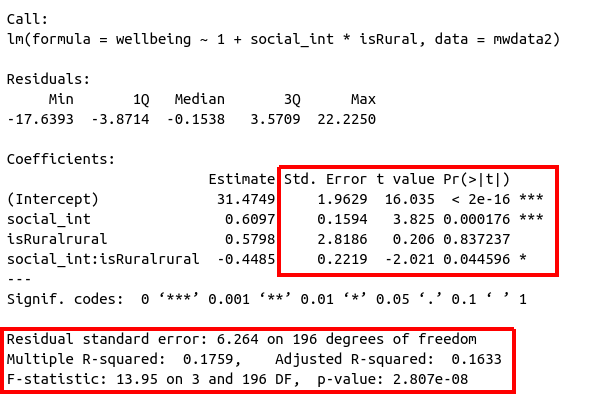

```{r setup, include=FALSE}
source('assets/setup.R')
library(tidyverse)
library(patchwork)
```

:::red
**Preliminaries**  

1. Open Rstudio, make sure you have the USMR project open, and create a new RMarkdown document (giving it a title for this week). 

:::

# CHOOSE > FIT > ASSESS > USE

:::yellow  
__IMPORTANT!__

It may help to think of the sequence of steps involved in statistical modeling as:  
$$
\text{Choose} \rightarrow \text{Fit} \rightarrow \text{Assess} \rightarrow \text{Use}
$$
<br>
We explore/visualise our data and **Choose** our model specification.   
Then we **Fit** the model in R.  
Next, we **Assess** the fit, to ensure that it meets all the underlying assumptions?  
*Finally*, we **Use** our model to draw statistical inferences about the world, or to make predictions. 

:::frame
**A general rule**  
<br>
<center>Do not **use** (draw inferences or predictions from) a model *before* you have **assessed** that the model satisfies the underlying assumptions</center>
:::

<br>
In these exercises, at times we will skip straight to **Using** the model (interpreting our parameter estimates and construct confidence intervals around them), before considering the assumptions. This is because we believe this ordering aids learning what different parts of fitted models represent, and enables us to devote a section to **Assessing** assumptions later on. Please note that this when conducting real analyses, the $\text{Choose} \rightarrow \text{Fit} \rightarrow \text{Assess} \rightarrow \text{Use}$ is the appropriate sequence of steps. 
:::

# Exercises: Simple regression

# Exercises: Multiple Regression 

In this block of exercises, we move from the simple linear regression model (one outcome variable, one explanatory variable) to the _multiple regression model_ (one outcome variable, multiple explanatory variables).  
Everything we just learned about simple linear regression can be extended (with minor modification) to the multiple regresion model. The key conceptual difference is that for simple linear regression we think of the distribution of errors at some fixed value of the explanatory variable, and for multiple linear regression, we think about the distribution of errors at fixed set of values for all our explanatory variables. 

## ~ Numeric + Numeric

> **Research question**  
> Reseachers are interested in the relationship between psychological wellbeing and time spent outdoors.  
The researchers know that other aspects of peoples' lifestyles such as how much social interaction they have can influence their mental well-being. They would like to study whether there is a relationship between well-being and time spent outdoors *after* taking into account the relationship between well-being and social interactions.  

<!-- We previously used simple linear regression to examine whether score on the WMBWS was related to the amount of time spent outdoors (self-reported as the average number of hours per week). We will now extend this and build a multiple regression model which we can use to predict WEMWBS score based on both outdoor time *and* number of social interactions.   -->

`r optbegin("Wellbeing data codebook", olabel=FALSE)`  

__Download link__

The data is available at https://uoepsy.github.io/data/wellbeing.csv.   
  
__Description__

Researchers interviewed 32 participants, selected at random from the population of residents of Edinburgh & Lothians. They used the Warwick-Edinburgh Mental Wellbeing Scale (WEMWBS), a self-report measure of mental health and well-being. The scale is scored by summing responses to each item, with items answered on a 1 to 5 Likert scale. The minimum scale score is 14 and the maximum is 70.  
The researchers also asked participants to estimate the average number of hours they spend outdoors each week, the average number of social interactions they have each week (whether on-line or in-person), and whether they believe that they stick to a routine throughout the week (Yes/No).  

The data in `wellbeing.csv` contain five attributes collected from a random sample of $n=32$ hypothetical residents over Edinburgh & Lothians, and include:

- `wellbeing`: Warwick-Edinburgh Mental Wellbeing Scale (WEMWBS), a self-report measure of mental health and well-being. The scale is scored by summing responses to each item, with items answered on a 1 to 5 Likert scale. The minimum scale score is 14 and the maximum is 70.  
- `outdoor_time`: Self report estimated number of hours per week spent outdoors  
- `social_int`: Self report estimated number of social interactions per week (both online and in-person)
- `routine`: Binary Yes/No response to the question "Do you follow a daily routine throughout the week?"
- `location`: Location of primary residence (City, Suburb, Rural)

__Preview__

The first six rows of the data are:

```{r echo=FALSE}
library(tidyverse)
read_csv('https://uoepsy.github.io/data/wellbeing.csv') %>% head %>% gt::gt()
```
`r optend()`

`r qbegin("B1")`
Create a new section heading in your RMarkdown document for the multiple regression exercises.  
Import the wellbeing data into R. Assign them to a object called `mwdata`.   

`r qend()`

`r solbegin(show=params$SHOW_SOLS, toggle=params$TOGGLE)`
```{r, warning=FALSE, message=FALSE}
library(tidyverse)
# Read in data
mwdata = read_csv(file = "https://uoepsy.github.io/data/wellbeing.csv")
head(mwdata)
```
`r solend()`

`r qbegin("B2")`
Produce plots of the _marginal distributions_ (the distributions of each variable in the analysis without reference to the other variables) of the `wellbeing`, `outdoor_time`, and `social_int` variables. 
`r qend()`
`r solbegin(show=params$SHOW_SOLS, toggle=params$TOGGLE)`
We should be familiar now with how to visualise a marginal distribution. You might choose histograms, density curves, or boxplots, or a combination:   
```{r fig.cap="Marginal distribution plots of wellbeing sores, weekly hours spent outdoors, and social interactions"}
library(patchwork) #used to arrange plots

wellbeing_plot <- 
  ggplot(data = mwdata, aes(x = wellbeing)) +
  geom_density() +
  geom_boxplot(width = 1/250) +
  labs(x = "Score on WEMWBS (range 14-70)", y = "Probability\ndensity")

outdoortime_plot <- 
  ggplot(data = mwdata, aes(x = outdoor_time)) +
  geom_density() +
  geom_boxplot(width = 1/200) +
  labs(x = "Time spent outdoors per week (hours)", y = "Probability\ndensity")

social_plot <- 
  ggplot(data = mwdata, aes(x = social_int)) +
  geom_density() +
  geom_boxplot(width = 1/150) +
  labs(x = "Number of social interactions per week", y = "Probability\ndensity")

# the "patchwork" library allows us to arrange multiple plots
wellbeing_plot / outdoortime_plot / social_plot
```

:::int  

+ The marginal distribution of scores on the WEMWBS is unimodal with a mean of approximately `r round(mean(mwdata$wellbeing),1)` years. There is variation in employees' salaries (SD = `r round(sd(mwdata$wellbeing),1)` years).   
+ The marginal distribution of weekly hours spend outdoors is unimodal with a mean of approximately `r round(mean(mwdata$outdoor_time),1)` years. There is variation in employees' salaries (SD = `r round(sd(mwdata$outdoor_time),1)` years).  
+ The marginal distribution of numbers of social interactions per week is unimodal with a mean of approximately `r round(mean(mwdata$social_int),1)` years. There is variation in employees' salaries (SD = `r round(sd(mwdata$social_int),1)` years).  

:::

`r solend()`

`r qbegin("B3")`
Produce plots of the _marginal relationships_ between the outcome variable (`wellbeing`) and each of the explanatory variables.  
`r qend()`
`r solbegin(show=params$SHOW_SOLS, toggle=params$TOGGLE)`
```{r mwdata-mlr-rels, fig.cap='Scatterplots displaying the relationships between scores on the WEMWBS and a) weekly outdoor time (hours), and b) weekly number of social interactions'}
wellbeing_outdoor <- 
  ggplot(data = mwdata, aes(x = outdoor_time, y = wellbeing)) +
  geom_point(alpha = 0.5) +
  labs(x = "Time spent outdoors per week (hours)", y = "Wellbeing score (WEMWBS)")

wellbeing_social <- 
  ggplot(data = mwdata, aes(x = social_int, y = wellbeing)) +
  geom_point(alpha = 0.5) +
  labs(x = "Number of social interactions per week", y = "Wellbeing score (WEMWBS)")

wellbeing_outdoor | wellbeing_social
```
`r solend()`
  
`r qbegin("B4")`
Produce a correlation matrix of the variables which are to be used in the analysis, and write a short paragraph describing the relationships. 

:::yellow
__Correlation matrix__  

A table showing the correlation coefficients - $r_{(x,y)}=\frac{\mathrm{cov}(x,y)}{s_xs_y}$ - between variables. Each cell in the table shows the relationship between two variables. The diagonals show the correlation of a variable with itself (and are therefore always equal to 1).  

**Hint:** We can create a correlation matrix easily by giving the `cor()` function a dataframe. However, we only want to give it 3 columns here. Think about how we select specific columns, either using `select()`, or giving the column numbers inside `[]`. 
:::

`r qend()`
`r solbegin(show=params$SHOW_SOLS, toggle=params$TOGGLE)`
We can either use:
```{r eval=FALSE}
# correlation matrix of the first 3 columns
cor(mwdata[,1:3])
```
or:
```{r}
# select only the columns we want by name, and pass this to cor()
mwdata %>% 
  select(wellbeing, outdoor_time, social_int) %>%
  cor()
```


:::int
There is a moderate, positive, linear relationship between weekly outdoor time and WEMWBS scores for the participants in the sample.
Participants' wellbeing scores tend to increase, on average, with the number of hours spent outdoors each week.  
There is a moderate, positive, linear relationship between the weekly number of social interactions and WEMWBS scores for the participants in the sample.
Participants' wellbeing scores tend to increase, on average, with the weekly number of social interactions. 
There is also a weak positive correlation between weekly outdoor time and the weekly number of social interactions.  
::: 

<br>
Note that there is a weak correlation between our two explanatory variables (outdoor_time and social_int). We will return to how this might affect our model when later on we look at the assumptions of multiple regression.  
`r solend()`

`r qbegin("B5")`
The scatterplots we created above show moderate, positive, and linear relationships both between outdoor time and wellbeing, and between numbers of social interactions and wellbeing.

Specify the form of your model, where $x_1$ = weekly outdoor time, $x_2$ = weekly numbers of social interactions and $y$ = scores on the WEMWBS.  
What are the _parameters_ of the model. How do we denote _parameter estimates_?  
`r qend()`
`r solbegin(show=TRUE, toggle=params$TOGGLE)`
A model for the relationship between $x_1$ = weekly outdoor time, $x_2$ = weekly numbers of social interactions and $y$ = scores on the WEMWBS is given by:
$$
y = \beta_0 + \beta_1 x_1 + \beta_2 x_2 + \epsilon \\ \quad \\ \text{where} \quad \epsilon \sim N(0, \sigma) \text{ independently}
$$

In the model specified above,

- $\mu_{y|x_1, x_2} = \beta_0 + \beta_1 x + \beta_2 x_2$ represents the systematic part of the model giving the mean of $y$ at each combination of values of $x_1$ and $x_2$;
- $\epsilon$ represents the error (deviation) from that mean, and the errors are independent from one another.  
  
  
The parameters of our model are:

+ $\beta_0$ (The intercept);
+ $\beta_1$ (The slope across values of $x_1$);
+ $\beta_2$ (The slope across values of $x_2$);  
+ $\sigma$ (The standard deviation of the errors).

When we estimate these parameters from the available data, we have a _fitted model_ (recall that the h$\hat{\textrm{a}}$ts are used to distinguish our _estimates_ from the _true unknown parameters_): 
$$
\widehat{Wellbeing} = \hat \beta_0 + \hat \beta_1 \cdot Outdoor Time + \hat \beta_2 \cdot Social Interactions + \hat \epsilon
$$
Where residuals $\hat \epsilon = y - \hat y$ are the deviations from the observed values and our model-predicted responses.  
`r solend()`


:::frame   
__Visual__

Note that for simple linear regression we talked about our model as a _line_ in 2 dimensions: the systematic part $\beta_0 + \beta_1 x$ defined a line for $\mu_y$ across the possible values of $x$, with $\epsilon$ as the random deviations from that line. But in multiple regression we have more than two variables making up our model. 

In this particular case of three variables (one outcome + two explanatory), we can think of our model as a _regression surface_ (See Figure \@ref(fig:regsurf)). The systematic part of our model defines the surface across a range of possible values of both $x_1$ *and* $x_2$. Deviations from the surface are determined by the random error component, $\hat \epsilon$.  

```{r regsurf, echo=FALSE, fig.cap = "Regression surface for wellbeing ~ outdoor_time + social_int, from two different angles", out.width="100%"}
fit<-lm(wellbeing~outdoor_time+social_int, data=mwdata)
steps=50
outdoor_time <- with(mwdata, seq(min(outdoor_time),max(outdoor_time),length=steps))
social_int <- with(mwdata, seq(min(social_int),max(social_int),length=steps))
newdat <- expand.grid(outdoor_time=outdoor_time, social_int=social_int)
wellbeing <- matrix(predict(fit, newdat), steps, steps)


par(mfrow=c(1,2))
p <- persp(outdoor_time,social_int,wellbeing, theta = 35,phi=10, col = NA)
obs <- with(mwdata, trans3d(outdoor_time,social_int, wellbeing, p))
pred <- with(mwdata, trans3d(outdoor_time, social_int, fitted(fit), p))
points(obs, col = "red", pch = 16)
#points(pred, col = "blue", pch = 16)
segments(obs$x, obs$y, pred$x, pred$y)

p <- persp(outdoor_time,social_int,wellbeing, theta = -35,phi=10, col = NA)
obs <- with(mwdata, trans3d(outdoor_time,social_int, wellbeing, p))
pred <- with(mwdata, trans3d(outdoor_time, social_int, fitted(fit), p))
points(obs, col = "red", pch = 16)
#points(pred, col = "blue", pch = 16)
segments(obs$x, obs$y, pred$x, pred$y)

par(mfrow=c(1,1))
```

Don't worry about trying to figure out how to visualise it if we had any more explanatory variables! We can only concieve of 3 spatial dimensions. One could imagine this surface changing over time, which would bring in a 4th dimension, but beyond that, it's not worth trying!.

:::

`r qbegin("B6")`
Fit the linear model in R, assigning the output to an object called `wb_mdl1`.  
  
As we did for simple linear regression, we can fit our multiple regression model using the `lm()` function. We can add as many explanatory variables as we like, separating them with a `+`.  
<br>
<center>`lm( <response variable> ~ 1 + <explanatory variable 1> + <explanatory variable 2> + ... , data = <dataframe> )`</center>
<br>

`r qend()`
`r solbegin(show=params$SHOW_SOLS, toggle=params$TOGGLE)`
```{r}
wb_mdl1 <- lm(wellbeing ~ 1 + outdoor_time + social_int, data = mwdata)
```
`r solend()`


:::frame 
__Interpretation of Muliple Regression Coefficients__

You'll hear a lot of different ways that people explain multiple regression coefficients.  
For the model $y = \beta_0 + \beta_1 x_1 + \beta_2 x_2 + \epsilon$, the estimate $\hat \beta_1$ will often be reported as:  
  
the increase in $y$ for a one unit increase in $x_1$ when...

- holding the effect of $x_2$ constant.
- controlling for differences in $x_2$.
- partialling out the effects of $x_2$.
- holding $x_2$ equal. 
- accounting for effects of $x_2$. 

:::int
```{r, echo=FALSE}
summary(wb_mdl1)$coefficients
```

The coefficient `r round(coef(wb_mdl1)[2],2)` of weekly outdoor time for predicting wellbeing score says that among those with the same number of social interactions per week, those who have one additional hour of outdoor time tend to, on average, score `r round(coef(wb_mdl1)[2],2)` higher on the WEMWBS wellbeing scale. The multiple regression coefficient measures that average _conditional_ relationship.
:::

:::

`r qbegin("B7")`
Using any of:  

- `wb_mdl1`
- `wb_mdl1$coefficients`
- `coef(wb_mdl1)`
- `coefficients(wb_mdl1)`
- `summary(wb_mdl1)`

Write out the estimated parameter values of: 

1. $\hat \beta_0$, the estimated average wellbeing score associated with zero hours of outdoor time and zero social interactions per week.  
2. $\hat \beta_1$, the estimated increase in average wellbeing score associated with one hour increase in weekly outdoor time, _holding the number of social interactions constant_ (i.e., when the remaining explanatory variables are held at the same value or are fixed).
3. $\hat \beta_2$, the estimated increase in average wellbeing score associated with an additional social interaction per week (an increase of one), _holding weekly outdoor time constant_.  

`r qend()`
`r solbegin(show=params$SHOW_SOLS, toggle=params$TOGGLE)`
```{r}
coef(wb_mdl1)
```

1. $\hat \beta_0$ = `r round(coef(wb_mdl1)[1],2)`  
2. $\hat \beta_1$ = `r round(coef(wb_mdl1)[2],2)`  
3. $\hat \beta_2$ = `r round(coef(wb_mdl1)[3],2)`  

`r solend()`


`r qbegin("B8")`
Within what distance from the model predicted values (the regression surface) would we expect 95% of WEMWBS wellbeing scores to be?

**Hint:** either `sigma(wb_mdl1)` or part of the output from `summary(wb_mdl1)` will help you here.  
`r qend()`
`r solbegin(show=params$SHOW_SOLS, toggle=params$TOGGLE)`
The estimated standard deviation of the errors is $\hat \sigma$ = `r round(sigma(wb_mdl1),2)`. We would expect 95% of wellbeing scores to be within about `r paste0("$",round(sigma(wb_mdl1)*2,1)*1000)` ($2 \hat \sigma$) from the model fit. 

`r solend()`

`r qbegin("B9")`
Obtain 95\% [confidence intervals for the regression coefficients](https://lmgtfy.com/?q=confidence+intervals+for+lm+in+r), and write a sentence describing each.  
`r qend()`
`r solbegin(show=params$SHOW_SOLS, toggle=params$TOGGLE)`
```{r}
confint(wb_mdl1, level = 0.95)
```

:::int 

+ The average wellbeing score for all those with zero hours of outdoor time and zero social interactions per week is between `r round(confint(wb_mdl1, level=.95)[1,1],2)` and `r round(confint(wb_mdl1, level=.95)[1,2],2)`.  
+ When _holding the number of social interactions per week constant_, each one hour increase in weekly outdoor time is associated with a difference in wellbeing scores between `r round(confint(wb_mdl1, level=.95)[2,1],2)` and `r round(confint(wb_mdl1, level=.95)[2,2],2)`, on average.  
+ When _holding weekly outdoor time constant_, each increase of one social interaction per week is associated with a difference in wellbeing scores between `r round(confint(wb_mdl1, level=.95)[3,1],2)` and `r round(confint(wb_mdl1, level=.95)[3,2],2)`, on average.  

:::

`r solend()`

    
## ~ Numeric + Categorical

Let's do that again, but paying careful attention to where and how the process differs when we have a _categorical_ predictor. 

> Suppose that the group of researchers were instead wanting to study the relationship between well-being and time spent outdoors after taking into account the relationship between well-being and _having a routine_. 


`r qbegin("B10")`
We have already visualised the marginal distribution of weekly outdoor time in an earlier question, as well as its relationship with wellbeing scores.  
Produce visualisations of:  

1. the distribution of the `routine` variable
2. the relationship between `routine` and `wellbeing`. 

**Note:** We cannot visualise the distribution of `routine` as a density curve or boxplot, because it is a _categorical_ variable (observations can only take one of a set of discrete response values).  
`r qend()`
`r solbegin(show=params$SHOW_SOLS, toggle=params$TOGGLE)`
`geom_bar()` will count the number of observations falling into each unique level of the routine variable:
```{r, fig.cap="Marginal distribution plots of Routine (y/n)"}
ggplot(data = mwdata, aes(x = routine)) +
  geom_bar()+
  labs(x = "Routine", y = "Frequency")
```

We might plot the relationship between routine and wellbeing as two boxplots:
```{r, fig.cap="Relationship between wellbeing and presence of routine"}
ggplot(data = mwdata, aes(x = routine, y = wellbeing)) +
  geom_boxplot()+
  labs(x = "Routine", y = "Wellbeing score (WEMWBS)")
```
`r solend()`  

:::frame  
__Categorical predictors__

When we have a _categorical_ explanatory variable such as this one, what actually gets inputted into our model is a number of _dummy variables_ which are numeric variables that represents categorical data.  

For a categorical variable with $k$ levels, we can express it in $k-1$ dummy variables.  
For example, the "species" column below has three levels, and can be expressed by the two variables "species_dog" and "species_parrot":  
```{r echo=FALSE, out.width="80%"}
data.frame(
  species = c("cat","cat","dog","parrot","dog","cat","..."),
  species_dog = c(0,0,1,0,1,0,"..."),
  species_parrot = c(0,0,0,1,0,0,"...")
)
```

+ The "cat" level is expressed whenever both the "species_dog" and "species_parrot" variables are 0.
+ The "dog" level is expressed whenever the "species_dog" variable is 1 and the "species_parrot" variable is 0.
+ The "parrot" level is expressed whenever the "species_dog" variable is 0 and the "species_parrot" variable is 1.  

R will do all of this re-expression for us. If we include in our model a categorical explanatory variable with 4 different levels, the model will estimate 3 parameters - one for each dummy variable. We can interpret the parameter estimates (the coefficients we obtain using `coefficients()`,`coef()` or `summary()`) as the estimated increase in the outcome variable associated with an increase of one in each dummy variable (holding all other variables equal).  
Note that in the above example, an increase in 1 of "species_dog" is the difference between a "cat" and a "dog". An increase in one of "species_parrot" is the difference between a "cat" and a "parrot". We think of the "cat" category in this example as the _reference level_ - it is the category against which other categories are compared against. 

:::  


`r qbegin("B11")`
Fit the multiple regression model below using `lm()`, and assign it to an object named `wb_mdl2`. Examine the summary output of the model. 

$$
Wellbeing = \beta_0 + \beta_1 \cdot OutdoorTime + \beta_2 \cdot Routine + \epsilon
$$
`r qend()`
`r solbegin(show=params$SHOW_SOLS, toggle=params$TOGGLE)`
```{r}
wb_mdl2 <- lm(wellbeing ~ 1 + outdoor_time + routine, data = mwdata)
summary(wb_mdl2)
```
`r solend()`

`r qbegin("B12")`
$\hat \beta_0$ (the intercept) is the estimated average wellbeing score associated with zero hours of weekly outdoor time and zero in the routine variable.  

What group is the intercept the estimated wellbeing score for when they have zero hours of outdoor time? Why (think about what zero in the routine variable means)?  

`r qend()`
`r solbegin(show=params$SHOW_SOLS, toggle=params$TOGGLE)`
As you can see in the output of the model, we have a coefficient called `routineRoutine`. This is the parameter estimate for a dummy variable which has been inputted into the model. The `lm()` function will automatically name the dummy variables (and therefore the coefficients) according to what level is identified by the 1. It names them `<variable><Level>`, so we can tell that `routineRoutine` is 1 for "Routine" and 0 for "No Routine".  

The intercept is therefore the estimated wellbeing score for those with No Routine and zero hours of outdoor time.   
`r solend()`

`r qbegin("B13")`
In the previous example, we had a visualisation of our model as a regression surface (Figure \@ref(fig:regsurf)).  
Here, one of our explanatory variables has only two possible responses. How might we visualise the model?    

a. one line
a. one surface
a. two lines
a. two surfaces
a. a curved (not flat) surface 

`r qend()`
`r solbegin(show=params$SHOW_SOLS, toggle=params$TOGGLE)`
We can visualise the model $\widehat{Wellbeing} = \hat \beta_0 + \hat \beta_1 \cdot OutdoorTime + \hat \beta_2 \cdot Routine$ as two lines.  
Each line represents the model predicted values for wellbeing scores across the range of weekly outdoor time, with one line for those who report having "Routine" and one for those with "No Routine".  
`r solend()`

`r qbegin("B14")`
Get a pen and paper, and sketch out the plot shown in Figure \@ref(fig:plot-annotate).  

```{r plot-annotate, echo=FALSE, fig.cap="Multiple regression model: Wellbeing ~ Outdoor Time + Routine"}
sjPlot::plot_model(wb_mdl2, type="pred", terms=c("outdoor_time","routine"), show.data=FALSE)+
  scale_fill_manual(NULL, values=c(NA,NA))
```

Annotate your plot with labels for each of parameter estimates from your model: 

| Parameter Estimate   |      Model Coefficient      |  Estimate |
|----------|:-------------:|------:|
| $\hat \beta_0$ | `(Intercept)` | `r round(coef(wb_mdl2)[1],2)` |
| $\hat \beta_1$ | `outdoor_time`   |  `r round(coef(wb_mdl2)[2],2)` |
| $\hat \beta_2$ | `routineRoutine` | `r round(coef(wb_mdl2)[3],2)` |


`r optbegin("Hint",olabel=FALSE)`
Below you can see where to add the labels, but we have not said which is which. 

```{r echo=FALSE}
sjPlot::plot_model(wb_mdl2, type="pred", terms=c("outdoor_time","routine"), show.data=FALSE)+
  scale_fill_manual(NULL, values=c(NA,NA))+
  geom_vline(xintercept = 0) +
  geom_segment(aes(x=1,xend=0,
                   y=predict(wb_mdl2,newdata=data.frame(routine="No Routine",outdoor_time=0))-1,
                   yend=predict(wb_mdl2,newdata=data.frame(routine="No Routine",outdoor_time=0))),
               col="black",lwd=.2)+
  geom_label(aes(x=2,y=predict(wb_mdl2,newdata=data.frame(routine="No Routine",outdoor_time=0))-3), 
             label="B", col="black")+
  geom_segment(aes(x=20,xend=20,
                   y=predict(wb_mdl2,newdata=data.frame(routine="No Routine",outdoor_time=20)),
                   yend=predict(wb_mdl2,newdata=data.frame(routine="Routine",outdoor_time=20))),
               col="black",lwd=.2,
               arrow = arrow(length = unit(3, "mm")))+
  geom_label(aes(x=21,y=predict(wb_mdl2,newdata=data.frame(routine="Routine",outdoor_time=20))-5),
               label="A", col="black")+
  geom_segment(aes(x=10,xend=11,
                 y=predict(wb_mdl2,newdata=data.frame(routine="No Routine",outdoor_time=10)),
                 yend=predict(wb_mdl2,newdata=data.frame(routine="No Routine",outdoor_time=10))),
             col="black",lwd=.2)+
  geom_segment(aes(x=11,xend=11,
                 y=predict(wb_mdl2,newdata=data.frame(routine="No Routine",outdoor_time=10)),
                 yend=predict(wb_mdl2,newdata=data.frame(routine="No Routine",outdoor_time=11))),
             col="black",lwd=.2)+
  geom_label(aes(x=12,y=predict(wb_mdl2,newdata=data.frame(routine="No Routine",outdoor_time=10))),
                 label="C",col="black")+
  NULL -> plot_annotate

plot_annotate

```

+ A is the vertical distance between the red and blue lines (the lines are parallel, so this distance is the same wherever you cut it on the x-axis).  
+ B is the point at which the blue line cuts the y-axis.  
+ C is the vertical increase (increase on the y-axis) for the blue line associated with a 1 unit increase on the x-axis (the lines are parallel, so this is the same for the red line).  

`r optend()`
`r qend()`
`r solbegin(show=params$SHOW_SOLS, toggle=params$TOGGLE)`

+ A = $\hat \beta_2$ = `routineRoutine` coefficient = `r round(coef(wb_mdl2)[3],2)`
+ B = $\hat \beta_0$ = `(Intercept)` coefficient  = `r round(coef(wb_mdl2)[1],2)`
+ C = $\hat \beta_1$ = `outdoor_time` coefficient = `r round(coef(wb_mdl2)[2],2)` 

```{r echo=FALSE}
plot_annotate
```

`r solend()`

`r qbegin("B15")`
Load the __sjPlot__ package using `library(sjPlot)` and try running the code below. (You may already have the __sjPlot__ package installed from previous exercises. If not, you will need to install it first).  

```{r eval=FALSE}
plot_model(wb_mdl2)
plot_model(wb_mdl2, type = "pred")
plot_model(wb_mdl2, type = "pred",  terms=c("outdoor_time","routine"), show.data=TRUE)
```

What do you think each one is showing?  

:::frame
The `plot_model` function (and the __sjPlot__ package) can do a lot of different things. Most packages in R come with tutorials (or "vignettes"), for instance: https://strengejacke.github.io/sjPlot/articles/plot_model_estimates.html 
:::
`r qend()`
`r solbegin(show=params$SHOW_SOLS, toggle=params$TOGGLE)`
```{r}
library(sjPlot)
plot_model(wb_mdl2)
```
These are the parameter estimates (the $\hat \beta$'s), and the confidence intervals. 
```{r}
confint(wb_mdl2)
```

When we add `type="pred"` we are asking for the predicted values. It will provide a separate plot for each explanatory variable, showing the predicted values at each level of that variable:
```{r}
plot_model(wb_mdl2, type = "pred")
```

We can combine these into one plot, and ask it to show the raw data as well:
```{r}
plot_model(wb_mdl2, type = "pred",  terms=c("outdoor_time","routine"), show.data=TRUE)
```
`r solend()`


# Exercises: Assumptions & Diagnostics  

:::frame
Above, we have fitted a number of multiple regression models. In each case, we first specified the model, then visually explored the marginal distributions and relationships of variables which would be used in the analysis. Finally, we fit the model, and began to examine the fit by studying what the various parameter estimates represented, and the spread of the residuals (the parts of the output inside the red boxes in Figure \@ref(fig:mlroutput)). 

```{r mlroutput, echo=FALSE, fig.cap="Multiple regression output in R, summary.lm(). Residuals and Coefficients highlighted"}
knitr::include_graphics("images/mlroutput.png")
```

You will recall that **before** we draw inferences using our model estimates or use our model to make predictions, we need to be satisfied that our model meets the set of assumptions.  

All of the estimates, intervals and hypothesis tests (see Figure \@ref(fig:mlroutputhyp)) resulting from a regression analysis _assume_ a certain set of conditions have been met. Meeting these conditions is what allows us to generalise our findings beyond our sample (i.e., to the population).  
```{r mlroutputhyp, echo=FALSE, fig.cap="Multiple regression output in R, summary.lm(). Hypothesis tests highlighted"}

```
:::

:::yellow
The assumptions of the linear model can be commited to memory using the **LINE** mnemonic:   

+ **L**inearity: The relationship between $y$ and $x$ is linear.
+ **I**ndependence of errors: The error terms should be independent from one another.
+ **N**ormality: The errors $\epsilon$ are normally distributed
+ **E**qual variances ("Homoscedasticity"): The scale of the variability of the errors  $\epsilon$ is constant at all values of $x$.  

When we fit a model, we evaluate many of these assumptions by looking at the residuals (the deviations from the observed values $y_i$ and the model estimated value $\hat y_i$).  
The residuals, $\hat \epsilon$ are our estimates of the actual unknown true error term $\epsilon$. These assumptions hold both for a regression model with a single predictor and for one with multiple predictors.
:::
  
`r qbegin("C1")`
Create a new section heading for "Assumptions".    
Recall our the form of our model which we fitted and stored as `wb_mdl1`:  

$$ 
\text{Wellbeing} = \beta_0 + \beta_1 \cdot \text{Outdoor Time} + \beta_2 \cdot \text{Social Interactions} + \epsilon
$$

Wich we fitted in R using:
```{r}
wb_mdl1 <- lm(wellbeing ~ outdoor_time + social_int, data = mwdata)
```

**Note:** We have have forgone writing the `1` in `lm(y ~ 1 + x...`. The 1 just tells R that we want to estimate the Intercept, and it will do this by default even if we leave it out. 
`r qend()`

## Linearity  
:::frame
In simple linear regression with only one explanatory variable, we can assess linearity through a simple scatterplot of the outcome variable against the explanatory. In multiple regression, however, it becomes more necessary to rely on diagnostic plots of the model residuals. This is because we need to know whether the relations are linear between the outcome and each predictor _after accounting for the other predictors in the model._  

In order to assess this, we use **partial-residual plots** (also known as 'component-residual plots'). This is a plot with each explanatory variable $x_j$ on the x-axis, and **partial residuals** on the y-axis.

Partial residuals for a predictor $x_j$ are calculated as:
$$
\hat \epsilon + \hat \beta_j x_j
$$

**In R** we can easily create these plots for all predictors in the model by using the `crPlots()` function from the **car** package.  
:::

`r qbegin("C2")`
Create partial-residual plots for the `wb_mdl1` model.  
Remember to load the **car** package first. If it does not load correctly, it might mean that you have need to install it.  

Write a sentence summarising whether or not you consider the assumption to have been met. Justify your answer with reference to the plots.
`r qend()`
`r solbegin(show=params$SHOW_SOLS, toggle=params$TOGGLE)`
```{r}
library(car)
crPlots(wb_mdl1)
```

:::int
The smoother (the pink line) follows quite closely to a linear relationship (the dashed blue line), suggesting that the linearity assumption is met.  
:::

`r solend()`

## Equal variances (Homoscedasticity)  
:::frame
The equal variances assumption is that the error variance $\sigma^2$ is constant across values of the predictors $x_1$, ... $x_k$, and across values of the fitted values $\hat y$. This sometimes gets termed "Constant" vs "Non-constant" variance. Figures \@ref(fig:ncv1) & \@ref(fig:ncv2) shows what these look like visually. 

```{r ncv1, echo=FALSE, fig.cap="Non-constant variance for numeric and categorical x"}
library(patchwork)
n=1000
x <- runif(n, min = 0, max = 100)
y.increasing <- 3 + 0.2 * x + (1 + x / 25) * rnorm(n, sd = 3)
y.good <- 3 + 0.1 * x + rnorm(n, sd = 3)


lm.good <- lm(y.good ~ x)
lm.bad <-lm(y.increasing~x)

p1<-ggplot(NULL, aes(x=fitted(lm.bad), y=resid(lm.bad)))+
  geom_point(shape=1)+
  labs(title="Non-constant variance",subtitle="ncvTest p<.05",x="fitted",y="residuals")+
  theme(axis.text = element_blank())

p2<-ggplot(NULL, aes(x=fitted(lm.good), y=resid(lm.good)))+
  geom_point(shape=1)+
  labs(title="constant variance",subtitle="ncvTest p>.05",x="fitted",y="residuals")+
  theme(axis.text = element_blank())

p3<-ggplot(NULL, aes(x=fitted(lm.bad)<mean(fitted(lm.bad)), y=resid(lm.bad)))+
  geom_point(shape=1)+
  labs(x="fitted",y="residuals")+
  theme(axis.text = element_blank())

p4<-ggplot(NULL, aes(x=fitted(lm.good)<mean(fitted(lm.good)), y=resid(lm.good)))+
  geom_point(shape=1)+
  labs(x="fitted",y="residuals")+
  theme(axis.text = element_blank())


(p1 | p3 )
```

```{r ncv2, echo=FALSE, fig.cap="Constant variance for numeric and categorical x"}
(p2 | p4)
```

**In R** we can create plots of the _Pearson residuals_ against the predicted values $\hat y$ and against the predictors $x_1$, ... $x_k$ by using the `residualPlots()` function from the **car** package. This function also provides the results of a lack-of-fit test for each of these relationships (note when it is the fitted values $\hat y$ it gets called "Tukey's test").  

`ncvTest(model)` (also from the **car** package) performs a test against the alternative hypothesis that the error variance changes with the level of the fitted value (also known as the "Breusch-Pagan test"). $p >.05$ indicates that we do _not_ have evidence that the assumption has been violated.
:::

`r qbegin("C3")`
Use `residualPlots()` to plot residuals against each predictor, and use `ncvTest()` to perform a test against the alternative hypothesis that the error variance changes with the level of the fitted value.  

Write a sentence summarising whether or not you consider the assumption to have been met. Justify your answer with reference to plots and/or formal tests where available.
`r qend()`
`r solbegin(show=params$SHOW_SOLS, toggle=params$TOGGLE)`
```{r}
residualPlots(wb_mdl1)

#test against the alternative hypothesis that error variance changes with level of fitted value
ncvTest(wb_mdl1)
```

:::int
Partial residual plots show no clear non-linear trends between residuals and predictors.
Visual inspection of suggested little sign of non-constant variance, with the Breusch-Pagan test failing to reject the null that error varance does not change across the fitted values ($\chi^2(1)=0.002$, $p = .965$).
:::

`r solend()`

`r qbegin("C4")`
Create the "residuals vs. fitted plot" - a scatterplot with the residuals $\hat \epsilon$ on the y-axis and the fitted values $\hat y$ on the x-axis.  
<br>
You can either do this: 

a. manually, using the functions `residuals()` and `fitted()`, or 
b. quickly by giving the `plot()` function your model. This will actually give you lots of plots, so we can specify which plot we want to return - e.g., `plot(wb_mdl1, which = 1)`

You can use this plot to visually assess:  

+ **L**inearity: Does the average of the residuals $\hat \epsilon$ remain close to 0 across the plot?  
+ **E**qual Variance: does the spread of the residuals $\hat \epsilon$ remain constant across the predicted values $\hat y$?  

`r qend()`
`r solbegin(show=params$SHOW_SOLS, toggle=params$TOGGLE)`
The long way:
```{r}
# Notice that we create a tibble and pass it directly to ggplot()
# using the %>%.
# This means we don't have to store it as an object in the environment,
# it is just being used to create the plot
tibble(
  residuals = residuals(wb_mdl1),
  fitted = fitted(wb_mdl1)
) %>% 
  ggplot(aes(x = fitted, y = residuals)) + 
  geom_point() + 
  geom_smooth(color="red",se=FALSE)
```

The quick way:
```{r}
plot(wb_mdl1, which=1)
```

:::int
The horizontal red line shows that the average of the residual remains close to zero across the fitted values.  
The spread of the residuals remains reasonably constant across the fitted values. 
:::

`r solend()`


## Independence
:::frame
The "independence of errors" assumption is the condition that the errors do not have some underlying relationship which is causing them to influence one another. 
<br>
There are many sources of possible dependence, and often these are issues of study design. For example, we may have groups of observations in our data which we would expect to be related (e.g., multiple trials from the same participant). Our modelling strategy would need to take this into account.
<br>
One form of dependence is **autocorrelation** - this is when observations influence those adjacent to them. It is common in data for which *time* is a variable of interest (e.g, the humidity today is dependent upon the rainfall yesterday).  
<br>
**In R** we can test against the alternative hypothesis that there is autocorrelation in our errors using the `durbinWatsonTest()` (an abbreviated function `dwt()` is also available) in the **car** package.  

:::

`r qbegin("C5")`
Perform a test against the alternative hypothesis that there is autocorrelation in the error terms.  
  
Write a sentence summarising whether or not you consider the assumption of independence to have been met (you may have to assume certain aspects of the study design).  
`r qend()`
`r solbegin(show=params$SHOW_SOLS, toggle=params$TOGGLE)`
```{r}
dwt(wb_mdl1)
```

:::int
A Durbin-Watson test of autocorrelation failed to reject the null hypothesis that there was no serial dependence in the error ($DW = 2.6$, $p = .138$). We will also assume that observations to be randomly sampled during study recruitment. 
:::

`r solend()`

## Normality of errors  
:::frame
The normality assumption is the condition that the errors $\epsilon$ are normally distributed. 

We can visually assess this condition through histograms, density plots, and quantile-quantile plots (QQplots) of our residuals $\hat \epsilon$.    
We can also perform a Shapiro-Wilk test against the alternative hypothesis that the residuals were not sampled from a normally distributed population. The `shapiro.test()` function in R. 

:::

`r qbegin("C6")`
Assess the normality assumption by producing a qqplot of the residuals (either manually or using `plot(model, which = ???)`), and conducting a Shapiro-Wilk test.  
  
Write a sentence summarising whether or not you consider the assumption to have been met. Justify your answer with reference to plots and/or formal tests where available.
`r qend()`
`r solbegin(show=params$SHOW_SOLS, toggle=params$TOGGLE)`
We can get the QQplot from one of the `plot(model)` plots: 
```{r}
plot(wb_mdl1, which = 2)
```
Or we can make our own:
```{r}
tibble(
  resids = residuals(wb_mdl1)
) %>% ggplot(aes(sample=resids))+
  geom_qq()+
  geom_qq_line()
```

```{r}
shapiro.test(residuals(wb_mdl1))
```

:::int 
The QQplot indicates that the residuals follow close to a normal distribution, although with evidence of heavier tails. A Shapiro-Wilk test failed to reject the null hypothesis that the residuals were drawn from a normally distributed population ($W = 0.95$, $p = .129$)
:::

`r solend()`

## Multicollinearity  
:::frame
For the linear model with multiple explanatory variables, we need to also think about **multicollinearity** - this is when two (or more) of the predictors in our regression model are moderately or highly correlated.  
Recall our interpretation of multiple regression coefficients as  
<center>"the effect of $x_1$ on $y$ when _holding the values of $x_2$, $x_3$, ... $x_k$ constant_"</center>  
This interpretation falls down if predictors are highly correlated because if, e.g., predictors $x_1$ and $x_2$ are highly correlated, then changing the value of $x_1$ necessarily entails a change the value of $x_2$ meaning that it no longer makes sense to talk about _holding $x_2$ constant._  
<br>
We can assess multicollinearity using the **variance inflation factor (VIF)**, which for a given predictor $x_j$ is calculated as:  
$$
VIF_j = \frac{1}{1-R_j^2} \\
$$
Where $R_j^2$ is the coefficient of determination (the R-squared) resulting from a regression of $x_j$ on to all the other predictors in the model ($x_j = x_1 + ... x_k + \epsilon$).  
The more highly correlated $x_j$ is with other predictors, the bigger $R_j^2$ becomes, and thus the bigger $VIF_j$ becomes.  
<br>
The square root of VIF indicates how much the SE of the coefficient has been inflated due to multicollinearity. For example, if the VIF of a predictor variable were 4.6 ($\sqrt{4.6} = 2.1$), then the standard error of the coefficient of that predictor is 2.1 times larger than if the predictor had zero correlation with the other predictor variables. Suggested cut-offs for VIF are varied. Some suggest 10, others 5. Define what you will consider an acceptable value _prior_ to calculating it.   
<br>
**In R**, the `vif()` function from the **car** package will provide VIF values for each predictor in your model. 

:::


`r qbegin("C7")`
Calculate the variance inflation factor (VIF) for the predictors in the model.  

Write a sentence summarising whether or not you consider multicollinearity to be a problem here.  
`r qend()`
`r solbegin(show=params$SHOW_SOLS, toggle=params$TOGGLE)`
```{r}
vif(wb_mdl1)
```

:::int
VIF values <5 indicate that multicollinearity is not adversely affecting model estimates. 
:::

`r solend()`

## Individual cases  

:::frame
We have seen in the case of the simple linear regression that individual cases in our data can influence our model more than others. We know about:  

+ **Regression outliers:** A large residual $\hat \epsilon_i$ - i.e., a big discrepancy between their predicted y-value and their observed y-value.  
    + **Standardised residuals:** For residual $\hat \epsilon_i$, divide by the estimate of the standard deviation of the residuals. In R, the `rstandard()` function will give you these
    + **Studentised residuals:** For residual $\hat \epsilon_i$, divide by the estimate of the standard deviation of the residuals excluding case $i$. In R, the `rstudent()` function will give you these.
+ **High leverage cases:** These are cases which have considerable _potential_ to influence the regression model (e.g., cases with an unusual combination of predictor values). 
    + **Hat values:** are used to assess leverage. In R, The `hatvalues()` function will retrieve these. 
+ **High influence cases:** When a case has high leverage *and* is an outlier, it will have a large influence on the regression model. 
    + **Cook's Distance:** combines *leverage* (hatvalues) with *outlying-ness* to capture influence. In R, the `cooks.distance()` function will provide these. 

:::

`r qbegin("C8")`
Create a new tibble which contains:  

1. The original variables from the model (Hint, what does `wb_mdl1$model` give you?)
2. The fitted values from the model $\hat y$  
3. The residuals $\hat epsilon$
4. The studentised residuals
5. The hat values
6. The Cook's Distance values. 

`r qend()`
`r solbegin(show=params$SHOW_SOLS, toggle=params$TOGGLE)`

```{r}
mdl_diagnost <- 
  tibble(
  wb_mdl1$model,
  fitted = fitted(wb_mdl1),
  resid = residuals(wb_mdl1),
  studres = rstudent(wb_mdl1),
  hats = hatvalues(wb_mdl1),
  cooksd = cooks.distance(wb_mdl1)
)
```

`r solend()`

`r qbegin("C9")`
Looking at the studentised residuals, are there any outliers?  
`r qend()`
`r solbegin(show=params$SHOW_SOLS, toggle=params$TOGGLE)`
Recall from the lectures, studentised residuals of $>2$ or $< -2$ indicate potential outlyingness.  

We can ask R whether the *absolute* values are $>2$:
```{r}
abs(mdl_diagnost$studres) > 2
```

We could *filter* our newly created tibble to these observations:
```{r}
mdl_diagnost %>% 
  filter(abs(studres)>2)
```
There are zero rows. 

`r solend()`

`r qbegin("C10")`
Hat values of more than $2 \bar{h}$ (2 times the average hat value) are considered high leverage.  
The average hat value, $\bar{h}$ is calculated as $\frac{k + 1}{n}$, where $k$ is the number of predictors, and $n$ is the sample size. 

Looking at the hat values, are there any observations with high leverage?  
`r qend()`
`r solbegin(show=params$SHOW_SOLS, toggle=params$TOGGLE)`
For our model, the average hat value $\bar h$ is:  
$$
\bar h = \frac{k+1}{n} = \frac{2+1}{32} = \frac{3}{32} = 0.094
$$

We can ask whether any of observations have hat values which are greater than $\bar h$:

```{r}
mdl_diagnost %>%
  filter(hats > 0.094)
```

Note that quite a few observations (`r sum(mdl_diagnost$hats > 0.094)`) have high leverage. 

`r solend()`
  
`r qbegin("C11")`  
A suggested Cook's Distance cut-off is $\frac{4}{n-k-1}$, where $k$ is the number of predictors, and $n$ is the sample size.   
  
Looking at the Cook's Distance values, are there any highly influential points?  
You can also display these graphically using `plot(model, which = 4)` and `plot(model, which = 5)`. 
`r qend()`
`r solbegin(show=params$SHOW_SOLS, toggle=params$TOGGLE)`
For our model, a proposed cut-off for Cook's Distance is:
$$
D_{cutoff} = \frac{4}{n-k-1} = \frac{4}{32 - 2 - 1} = \frac{4}{29} = 0.138
$$

There are no observations which have a high influence on our model estimates:
```{r}
mdl_diagnost %>%
  filter(cooksd > 0.138)
```

`r solend()`

## Other influence.measures()

:::frame

Alongside Cook's Distance, we can examine the extent to which model estimates and predictions are affected when an entire case is dropped from the dataset and the model is refitted.  

+ **DFFit:** the change in the predicted value at the $i^{th}$ observation with and without the $i^{th}$ observation is included in the regression.  
+ **DFbeta:**  the change in a specific coefficient with and without the $i^{th}$ observation is included in the regression.  
+ **DFbetas:**  the change in a specific coefficient divided by the standard error, with and without the $i^{th}$ observation is included in the regression.  
+ **COVRATIO:** measures the effect of an observation on the covariance matrix of the parameter estimates. In simpler terms, it captures an observation's influence on standard errors. Values which are $>1+\frac{3(k+1)}{n}$ or $<1-\frac{3(k+1)}{n}$ are considered as having strong influence.  

:::


`r qbegin("C12")`

Use the function `influence.measures()` to extract these delete-1 measures of influence.  

Try plotting the distributions of some of these measures.  

**Tip:** the function `influence.measures()` returns an `infl`-type object. To plot this, we need to find a way to extract the actual numbers from it.  
What do you think `names(influence.measures(wb_mdl1))` shows you? How can we use `influence.measures(wb_mdl1)$<insert name here>` to extract the matrix of numbers?  


`r qend()`
`r solbegin(show=params$SHOW_SOLS, toggle=params$TOGGLE)`
```{r}
influence.measures(wb_mdl1)
```
  
Let's plot the distribution of COVRATIO statistics.  
Recall that values which are $>1+\frac{3(k+1)}{n}$ or $<1-\frac{3(k+1)}{n}$ are considered as having strong influence.  
For our model:
$$
1 \pm \frac{3(k+1)}{n} \quad = \quad 1 \pm\frac{3(2+1)}{32} \quad = \quad 1\pm \frac{9}{32} \quad = \quad 1\pm0.28
$$

The "infmat" bit of an `infl`-type object contains the numbers. To use it with ggplot, we will need to turn it into a dataframe (`as.data.frame()`), or a tibble (`as_tibble()`):   
```{r}
infdata <- influence.measures(wb_mdl1)$infmat %>%
  as_tibble()

ggplot(data = infdata, aes(x = cov.r)) + 
  geom_histogram() +
  geom_vline(aes(xintercept = c(1-0.28)))+
  geom_vline(aes(xintercept = c(1+0.28)))
```

It looks like a few observations may be having quite a high influence here. This is perhaps not that surprising as we only have 32 datapoints. 

`r solend()`

