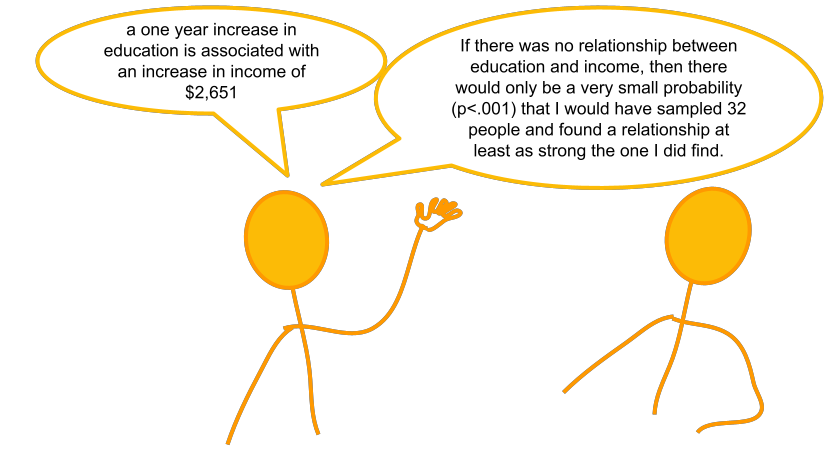

```{r setup, include=FALSE}
source('assets/setup.R')
library(tidyverse)
library(patchwork)
```

<!-- w7 -->
<!-- correlation ++ -->
<!-- significance -->
<!--   - coefficients -->
<!-- - F, R^2 -->

<!-- w8 -->
<!-- - assumptions & diagnostics -->
<!-- - multiple regression -->
<!-- - model comparison -->
<!-- - SS types -->


<!-- # Regression introduction -->
<!-- - write out model, consider hypotheses -->
<!-- - first explore the data -->
<!-- - fitting a model -->
<!-- - interpreting coefficients -->
<!-- - interpreting sigma -->
<!-- - fitted and predicted values -->

<!-- # Inference for regression coefficients -->

<!-- # Model Fit: -->
<!--  - partitioning variation -->
<!--  - testing model utility -->

<!-- # A categorical predictor -->
<!--  - (this will be covered in week 9 lecture, but the general idea is) -->

<!-- # extending to multiple predictors -->
<!-- ## ~ numeric + numeric -->


<!-- # assumptions -->
<!-- # choose > fit > assess > use -->
<!-- optbegin: a recipe book: LINE -->
<!--   ## linearity -->
<!--   ## equal variances -->
<!--   ## independence -->
<!--   ## normality of errors -->
<!-- # the general idea -->
<!-- # multicollinearity -->
<!-- # diagnostics -->
<!-- ## individual cases -->
<!-- ## other influence.measures() -->

:::lo

<div style="width:60%; display: inline-block;">

This lab is a long one! It takes us quite slowly through simple and multiple regression, but the broader ideas being introduced a actually quite simple - we are just drawing a straight line through some datapoints!  
Try to take regular breaks during these exercises. This will help (a bit) with not getting overwhelmed - these things (both the statistics side and the programming side) take time - and repeated practice - to sink in.
</div>
<div style="width:30%; display: inline-block; vertical-align: top">
```{r echo=FALSE}
knitr::include_graphics("images/slr/catworking.gif")
```
</div>
:::


# Simple regression  

Let’s imagine a study into income disparity for workers in a local authority. We might carry out interviews and find that there is a link between the level of education and an employee’s income. Those with more formal education seem to be better paid. 
Now we wouldn’t have time to interview everyone who works for the local authority so we would have to interview a sample, say 10%.  

In this lab we will use the riverview data (available at https://uoepsy.github.io/data/riverview.csv) to examine whether education level is related to income among the employees working for the city of Riverview, a hypothetical midwestern city in the US.  

:::frame
__Data: riverview.csv__  

The data is available at [https://uoepsy.github.io/data/riverview.csv.](https://uoepsy.github.io/data/riverview.csv){target="_blank"}

**Description**

The riverview data come from @Lewis-Beck2015 and contain five attributes collected from a random sample of $n=32$ employees working for the city of Riverview, a hypothetical midwestern city in the US. The attributes include:

- `education`: Years of formal education
- `income`: Annual income (in thousands of U.S. dollars)
- `seniority`: Years of seniority
- `gender`: Employee's gender
- `male`: Dummy coded gender variable (0 = Female, 1 = Male)
- `party`: Political party affiliation


**Preview**

The first six rows of the data are:

```{r echo=FALSE}
library(tidyverse)
library(kableExtra)

riverview <- read_csv('https://uoepsy.github.io/data/riverview.csv')
kable(head(riverview), align='c') %>% kable_styling(full_width = FALSE)
```
:::


`r qbegin("A1")` 
Load the required libraries and import the riverview data into a variable named `riverview`.
`r qend()`

`r solbegin(show = params$SHOW_SOLS, toggle = params$TOGGLE)`
```{r, warning=FALSE, message=FALSE}
library(tidyverse)

riverview <- read_csv(file = "https://uoepsy.github.io/data/riverview.csv")
head(riverview)
```
`r solend()`

## Exploring the data

`r qbegin("A2")`  
We first want to visualise and describe the *marginal distributions* (the distribution of each variable without reference to the values of the other variables) of employee incomes and education levels.

- You could use, for example, `geom_density()` for a density plot or `geom_histogram()` for a histogram.
- Look at the shape, centre and spread of the distribution. Is it symmetric or skewed? Is it unimodal or bimodal? 
- Do you notice any extreme observations?
  
`r qend()`

`r solbegin(show = params$SHOW_SOLS, toggle = params$TOGGLE)`
We can plot the marginal distribution of employee incomes as a density curve, and add a boxplot underneath to check for the presence of outliers.  

**Note:** The function `ggMarginal()` from the `ggExtra` library that we saw briefly in the solutions on exercises on [functions & models](05_covcor.html#Functions_and_Models) only works with scatterplots.

```{r fig.cap="Density plot and boxplot of employee incomes."}
ggplot(data = riverview, aes(x = income)) +
  geom_density() +
  geom_boxplot(width = 1/300) +
  labs(x = "Income (in thousands of U.S. dollars)", 
       y = "Probability density")
```

The plot suggests that the distribution of employee incomes is unimodal and most of the incomes are between roughly \$45,000 and \$70,000. 
The smallest income in the sample is about \$25,000 and the largest income is over \$80,000. (We could find the exact values using the `summary()` function).
This suggests there is a fair amount of variation in the data. 
Furthermore, the boxplot does not highlight any outliers in the data.


```{r fig.cap='Density plot and boxplot of employee education levels.'}
ggplot(data = riverview, aes(x = education)) +
  geom_density() +
  geom_boxplot(width = 1/100) +
  labs(x = "Education (in years)", 
       y = "Probability density")
```

To further summarize a distribution, it is typical to compute and report numerical summary statistics such as the mean and standard deviation. One way to compute these values is to use the `summarise()/summarize()` function from the `tidyverse` library:

```{r}
riverview %>% 
  summarize(
    mean_incom = mean(income), 
    sd_income = sd(income),
    mean_edu = mean(education),
    sd_edu = sd(education)
    )
```

:::int
The marginal distribution of income is unimodal with a mean of approximately \$53,700. There is variation in employees' salaries (SD = \$14,553).  
The marginal distribution of education is unimodal with a mean of 16 years. There is variation in employees' level of education (SD = 4.4 years).  
:::

`r solend()`

`r qbegin("A3")`  
After examining the marginal distributions of the variables of interest in the analysis, we typically move on to examining relationships between the variables.  
  
Visualise and describe the relationship between income and level of education among the employees in the sample.  

Think about:  

- *Direction* of association
- *Form* of association (can it be summarised well with a straight line?)  
- *Strength* of association (how closely do points fall to a recognizable pattern such as a line?)
- *Unusual observations* that do not fit the pattern of the rest of the observations and which are worth examining in more detail.  

`r qend()`

`r solbegin(show = params$SHOW_SOLS, toggle = params$TOGGLE)`
We are trying to investigate how income varies when varying years of formal education.
Hence income is the dependent variable (on the y-axis), and education is the independent variable (on the x-axis).

```{r riverview-scatterplot, fig.cap='The relationship between employees\' education level and income.'}
ggplot(data = riverview, aes(x = education, y = income)) +
  geom_point(alpha = 0.5) +
  labs(x = "Education (in years)", 
       y = "Income (in thousands of U.S. dollars)")
```

To comment on the strength of the linear association we compute the correlation coefficient:
```{r}
riverview %>%
  select(education, income) %>%
  cor()
```

that is, 
$$
r_{\text{education, income}} = 0.79
$$

We might write:

:::int
There is a strong positive linear relationship between education level and income for the employees in the sample.
High incomes tend to be observed, on average, with more years of formal education.
The scatterplot does not highlight any outliers.
:::
`r solend()`

## Fitting a Linear Model

:::statbox
**A note on notation**  

You will see a variety of different ways of specifying the linear model form in different resources.  
Some use $\beta$, some use $b$.  
  
In the lectures, you have seen the form $\color{red}{y} = \color{blue}{b_0 \cdot{} 1 + b_1 \cdot{} x} + \epsilon$.  

In the exercises below, we will tend to use $\color{red}{Y} = \color{blue}{\beta_0 \cdot{} 1 + \beta_1 \cdot{} X} + \epsilon$, to denote our population model, which when fitted on some sample data becomes $\color{red}{\hat{Y}} = \color{blue}{\hat{\beta}_0 \cdot{} 1 + \hat{\beta_1} \cdot{} X} + \hat{\epsilon}$ (the little hats indicate that they are fitted estimates).  

:::
  

`r qbegin("A4")`
The plot created in the previous question highlights a linear relationship, where the data points are scattered around an underlying linear pattern with a roughly-constant spread as x varies.

We will try to fit a simple (one $x$ variable only) linear regression model:

$$
Income = \beta_0 + \beta_1 \ Education + \epsilon \quad \\
\text{where} \quad \epsilon \sim N(0, \sigma) \text{ independently}
$$

where "$\epsilon \sim N(0, \sigma) \text{ independently}$" means that the errors around the line have mean zero and constant spread as x varies (we'll read more about what this means later in this lab in the section on [Making Valid Inferences](#making)). 


**Fit the linear model to the sample data using the `lm()` function and assign it to a name to store it in your environment**


_**Hint:**_
_The syntax of the `lm()` function is: _
```
lm(<response variable> ~ 1 + <explanatory variable>, data = <dataframe>)
```

`r optbegin("Why ~ 1?", olabel=FALSE, toggle=params$TOGGLE)`
The fitted model can be written as
$$
\widehat{Income} = \hat \beta_0 + \hat \beta_1 \ Education
$$
or
$$
\widehat{Income} = \hat \beta_0 \cdot 1 + \hat \beta_1 \cdot Education
$$

When we specify the linear model in R, we include after the tilde sign, `~`, the variables that appear to the right of the $\hat \beta$s. That's why the 1 is included.  
`r optend()`
`r qend()`

`r solbegin(show = params$SHOW_SOLS, toggle = params$TOGGLE)`
As the variables are in the `riverview` dataframe, we would write:  
```{r}
model1 <- lm(income ~ 1 + education, data = riverview)
```

`r solend()`

## Interpreting coefficients

`r qbegin("A5")`
Interpret the estimated intercept and slope in the context of the question of interest.  

Let's suppose we assigned our linear model object to the name "model1" in R. To obtain the estimated regression coefficients we can use it's name in various ways and with various functions. 


- type `model1`, i.e. simply invoke the name of the fitted model;
- type `model1$coefficients`;
- use the `coef(model1)` function;
- use the `coefficients(model1)` function;
- use the `summary(model1)` function and look under the "Estimate" column.

The estimated parameters returned by the above methods are all equivalent. However, `summary()` returns more information and you need to look under the column "Estimate".  
`r qend()`

`r solbegin(show = params$SHOW_SOLS, toggle = params$TOGGLE)`
```{r}
coef(model1)
```
The fitted line is:
$$
\widehat{Income} = 11.32 + 2.65 \ Education \\
$$


We can interpret the estimated intercept as follows,

:::int
The estimated average income associated with zero years of formal education is \$11,321.
:::

For the estimated slope we might write,

:::int
The estimated increase in average income associated with a one year increase in education is \$2,651.
:::
`r solend()`

:::statbox
The parameter estimates from our simple linear regression model take the form of a line, representing the systematic part of our model $\beta_0 + \beta_1 \ x$, which in our case is $11.32 + 2.65 \ Education$. Deviations from the line are determined by the random error component $\hat \epsilon$ (the red lines in Figure \@ref(fig:figslr) below).  

```{r figslr, echo=FALSE, fig.cap="Simple linear regression model, with systematic part of the model in blue and residuals in red"}
betas <- coef(model1)
intercept <- betas[1]
slope <- betas[2]

broom::augment(model1) %>%
ggplot(., aes(x = education, y = income)) +
  geom_point(alpha = 0.5) +
  geom_abline(intercept = intercept, slope = slope, 
              color = 'blue', size = 1) + 
  labs(x = "Education (in years)", 
       y = "Income (in thousands of U.S. dollars)")+
  geom_segment(aes(x=education, xend=education, y=income, yend=.fitted), col="red",lty="dotted")
```

:::

## Interpreting $\sigma$

`r qbegin("A6")`
Consider the following:  

1. In fitting a linear regression model, we make the assumption that the errors around the line are normally distributed around zero (this is the $\epsilon \sim N(0, \sigma)$ bit.)  
2. About 95\% of values from a normal distribution fall within two standard deviations of the centre.  

We can obtain the estimated standard deviation of the errors ($\hat \sigma$) from the fitted model using `sigma()` and giving it the name of our model.  
What does this tell us?  

`r optbegin('Huh? What is $\\sigma$?', olabel=FALSE, toggle=params$TOGGLE)`
The standard deviation of the errors, denoted by $\sigma$ is an important quantity to estimate because it measures how much individual data points tend to deviate above and below the regression line. 

A small $\sigma$ indicates that the points hug the line closely and we should expect fairly accurate predictions, while a large $\sigma$ suggests that, even if we estimate the line perfectly, we can expect individual values to deviate from it by substantial amounts.

The *estimated* standard deviation of the errors is (surprisingly) denoted $\hat \sigma$ and is equal to
$$
\hat \sigma = \sqrt{\frac{SS_{Residual}}{n - 2}} \\
\begin{align}
& \text{where} \\
& SS_{Residual} = \sum_{i=1}^n{(\epsilon_i)^2}
\end{align}
$$
`r optend()`

`r qend()`
`r solbegin(show = params$SHOW_SOLS, toggle = params$TOGGLE)`
The estimated standard deviation of the errors can be equivalently obtained by:

- typing `sigma(model1)`;
- looking at the "Residual standard error" entry of the `summary(model1)` output.

_**Note:** The term "Residual standard error" is a misnomer, as the help page for `sigma` says (check `?sigma`). However, it's hard to get rid of this bad name as it has been used in too many books showing R output._


```{r}
sigma(model1)
```

:::int
For any particular level of education, employee incomes should be distributed above and below the regression line with standard deviation estimated to be $\hat \sigma = 8.98$. 
Since $2 \hat \sigma = 2 (8.98) = 17.96$, we expect most (about 95\%) of the employee incomes to be within about \$18,000 from the regression line.
:::  

`r solend()`


## Fitted and predicted values  

:::rtip
To compute the model-predicted values for the data in the sample using various functions. Again, if our model object is named "model1" in our environment, we can use:

- `predict(model1)`
- `fitted(model1)`
- `fitted.values(model1)`
- `model1$fitted.values`

```{r}
predict(model1)
```


To compute model-predicted values for other data:

- `predict(<fitted model>, newdata = <dataframe>)`

```{r}
# make a tibble/dataframe with values for the predictor:
education_query <- tibble(education = c(11, 18))
# model predicted values of income, for the values of education
# inside the "education_query" data
predict(model1, newdata = education_query)
```
:::

`r qbegin("A6")`
Compute the model-predicted income for someone with 1 year of education.  
`r qend()`
`r solbegin(show = params$SHOW_SOLS, toggle = params$TOGGLE)`
```{r}
education_query <- tibble(education = c(1))
predict(model1, newdata = education_query)
```
`r solend()`

## Inference for regression coefficients  

:::statbox
We have fitted a linear model, and we now know how we interpret our coefficients. But this is only part of the story. 
```{r echo=FALSE, fig.cap="Estimates without inference"}
knitr::include_graphics("images/slr/conv1.png")
```


To quantify the amount of uncertainty in each estimated coefficient that is due to sampling variability, we use the standard error (SE) of the coefficient. 
_Recall that a standard error gives a numerical answer to the question of how variable a statistic will be because of random sampling._  

The standard errors are found in the column "Std. Error" of the `summary()` of a model:
```{r echo=FALSE}
summary(model1)$coefficients
```

In this example the slope, 2.651, has a standard error of 0.37. One way to envision this is as a distribution. Our best guess (mean) for the slope parameter is 2.651. The standard deviation of this distribution is 0.37, which indicates the precision (uncertainty) of our estimate.

```{r echo=FALSE, fig.cap='Sampling distribution of the slope coefficient. The distribution is approximately bell-shaped with a mean of 2.651 and a standard error of 0.37.'}
ggplot(tibble(x = c(-3 * 0.37 + 2.651, 3 * 0.37 + 2.651)), aes(x = x)) +
    stat_function(fun = dnorm, args = list(mean = 2.651, sd = 0.37)) +
  labs(x = "Estimate for employee incomes", y = '')
```

We can perform a test against the null hypothesis that the estimate is zero. Our test statistic: 
The reference distribution in this case is a t-distribution with $n-2$ degrees of freedom, where $n$ is the sample size, and our test statistic is:  
$$
t = \frac{\hat \beta_1 - 0}{SE(\hat \beta_1)}
$$

:::


`r qbegin("A8")`
Test the hypothesis that the population slope is zero --- that is, that there is no linear association between income and education level in the population.  
(Hint: you can find all the necessary information in `summary()` of your model)
`r qend()`

`r solbegin(show = params$SHOW_SOLS, toggle = params$TOGGLE)`
The information is already contained in the row corresponding to the variable "education" in the output of `summary()`, which reports the t-statistic under `t value` and the p-value under `Pr(>|t|)`:
```{r}
summary(model1)
```

Before we interpret the results, recall that the p-value `5.56e-08` in the `Pr(>|t|)` column simply means $5.56 \times 10^{-8}$. This is a very small value, hence we will report it as <.001 following the APA guidelines.

:::int
We performed a t-test against the null hypothesis that education is not a significant predictor of income: $t(30) = 7.173,\ p < .001$, two-sided.
The large t-statistic leads to a very small p-value, meaning that we have strong evidence against the null hypothesis.
:::

```{r echo=FALSE, fig.cap="conversations with statisticians"}

```


`r solend()`

## Model evaluation 

:::statbox
__Partitioning variation: $R^2$__  
  
We might ask ourselves if the model is useful. To quantify and assess model utility, we split the total variability of the response into two terms: the variability explained by the model plus the variability left unexplained in the residuals.

$$
\text{total variability in response = variability explained by model + unexplained variability in residuals}
$$

Each term is quantified by a sum of squares:

$$
\begin{aligned}
SS_{Total} &= SS_{Model} + SS_{Residual} \\
\sum_{i=1}^n (y_i - \bar y)^2 &= \sum_{i=1}^n (\hat y_i - \bar y)^2 + \sum_{i=1}^n (y_i - \hat y_i)^2 \\
\quad \\
\text{Where:} \\
y_i = \text{observed value} \\
\bar{y} = \text{mean} \\
\hat{y}_i = \text{model predicted value} \\
\end{aligned}
$$

The R-squared coefficient is defined as the proportion of the total variability in the outcome variable which is explained by our model:  
$$
R^2 = \frac{SS_{Model}}{SS_{Total}} = 1 - \frac{SS_{Residual}}{SS_{Total}}
$$
:::


`r qbegin("A9")`
What is the proportion of the total variability in incomes explained by the linear relationship with education level?

_**Hint:** The question asks to compute the value of $R^2$, but you might be able to find it already computed somewhere._
`r qend()`
`r solbegin(show=params$SHOW_SOLS, toggle=params$TOGGLE)`
```{r}
summary(model1)
```

The output of `summary()` displays the R-squared value in the following line:
```
Multiple R-squared:  0.6317
```

For the moment, ignore "Adjusted R-squared". We will come back to this later on. 

`r optbegin("Optional - Manual calculation of R-Squared", olabel=F, toggle=params$TOGGLE)`

```{r}
riverview_fitted <- riverview %>%
  mutate(
    income_hat = predict(model1),
    resid = income - income_hat
  )
head(riverview_fitted)

riverview_fitted %>%
  summarise(
    SSModel = sum( (income_hat - mean(income))^2 ),
    SSTotal = sum( (income - mean(income))^2 )
  ) %>%
  summarise(
    RSquared = SSModel / SSTotal
  )
```

`r optend()`

:::int
Approximately 63\% of the total variability in employee incomes is explained by the linear association with education level.
:::

`r solend()`

:::statbox
__Testing Model Utility: $F$ Statistic__  
  
To test if the model is useful --- that is, if the explanatory variable is a useful predictor of the response --- we test the following hypotheses:

$$
\begin{aligned}
H_0 &: \text{the model is ineffective, } \beta_1 = 0 \\
H_1 &: \text{the model is effective, } \beta_1 \neq 0
\end{aligned}
$$
The relevant test-statistic is the F-statistic:

$$
\begin{split}
F = \frac{MS_{Model}}{MS_{Residual}} = \frac{SS_{Model} / 1}{SS_{Residual} / (n-2)}
\end{split}
$$

which compares the amount of variation in the response explained by the model to the amount of variation left unexplained in the residuals.

The sample F-statistic is compared to an F-distribution with $df_{1} = 1$ and $df_{2} = n - 2$ degrees of freedom.^[
$SS_{Total}$ has $n - 1$ degrees of freedom as one degree of freedom is lost in estimating the population mean with the sample mean $\bar{y}$.
$SS_{Residual}$ has $n - 2$ degrees of freedom. There are $n$ residuals, but two degrees of freedom are lost in estimating the intercept and slope of the line used to obtain the $\hat y_i$s.
Hence, by difference, $SS_{Model}$ has $n - 1 - (n - 2) = 1$ degree of freedom.
]

`r optbegin('Optional: Another formula for the F-test.', olabel=FALSE, toggle=params$TOGGLE)`
With some algebra we can also show that:
$$
F = \frac{R^2 / 1}{(1 - R^2) / (n - 2) } = \frac{R^2 / df_{Model}}{(1 - R^2) / df_{Residual} }
$$

Proof:

$$
\begin{aligned}
F = \frac{SS_{Model} / 1}{SS_{Residual} / (n - 2)} 
= \frac{\frac{SS_{Model}}{SS_{Total}}}{\frac{SS_{Residual}}{SS_{Total}} \cdot \frac{1}{(n - 2)}} 
= \frac{R^2 / 1}{(1 - R^2) / (n - 2)}
\end{aligned}
$$
`r optend()`

:::

`r qbegin("A10")`
Look at the output of `summary()` of your model. Identify the relevant information to conduct an F-test against the null hypothesis that the model is ineffective at predicting income using education level.
`r qend()`

`r solbegin(show = params$SHOW_SOLS, toggle = params$TOGGLE)`
```{r}
summary(model1)
```

The relevant row is the following:
```
F-statistic: 51.45 on 1 and 30 DF,  p-value: 5.562e-08
```
We might write up the test results as,

:::int
We performed an F-test for the overall significance of the regression, $F(1, 30) = 51.45, p < .001$.
The large F-statistic leads to a very small p-value ($<.001$), meaning that we have very strong evidence against the null hypothesis that the model is ineffective.

In other words, the data provide strong evidence that education is an effective predictor of income.
:::

`r solend()`

`r optbegin('Optional: Equivalence of t-test for the slope and model utility F-test in simple regression.', olabel = FALSE,  toggle=params$TOGGLE)`
**In simple linear regression only**, the F-statistic for overall model significance is equal to the square of the t-statistic for $H_0: \beta_1 = 0$.

You can check that the squared t-statistic is equal, up to rounding error, to the F-statistic:
```{r}
summary(model1)$fstatistic['value']
summary(model1)$coefficients['education','t value']
```
$$
t^2 = F \\
7.173^2 = 51.452
$$


Here we will show the equivalence of the F-test for model effectiveness and t-test for the slope.

Recall the formula of the sum of squares due to the model. We will rewrite it in an equivalent form below:
$$
\begin{aligned}
SS_{Model} &= \sum_i (\hat y_i - \bar y)^2 \\
&= \sum_i (\hat \beta_0 + \hat \beta_1 x_i - \bar y)^2 \\
&= \sum_i (\bar y - \hat \beta_1 \bar x + \hat \beta_1 x_i - \bar y)^2 \\
&= \sum_i (\hat \beta_1 (x_i - \bar x))^2 \\
&= \hat \beta_1^2 \sum_i (x_i - \bar x)^2
\end{aligned}
$$

The F-statistic is given by:
$$
\begin{aligned}
F = \frac{SS_{Model} / 1}{SS_{Residual} / (n - 2)} 
= \frac{\hat \beta_1^2 \sum_i (x_i - \bar x)^2}{\hat \sigma^2} 
= \frac{\hat \beta_1^2 }{\hat \sigma^2 / \sum_i (x_i - \bar x)^2}
\end{aligned}
$$

Now recall the formula of the t-statistic,
$$
t = \frac{\hat \beta_1}{SE(\hat \beta_1)} = \frac{\hat \beta_1}{\hat \sigma / \sqrt{\sum_i (x_i - \bar x)^2}}
$$

It is evident that the latter is obtained as the square root of the former.

`r optend()`


## Binary predictors

Let's suppose that instead of having measured education in years, we had data instead on "Obtained College Degree: Yes/No". Our explanatory variable would be binary categorical (think back to our discussion of [types of data](01_categorical.html#Types_of_Data)).  

Let us pretend that everyone with >18 years of education has a college degree:
```{r}
riverview <- 
  riverview %>%
    mutate(
      degree = ifelse(education > 18, "Yes", "No")
    )
```

We may then plot our relationship as a boxplot. If you want to see the individual points, you could always "jitter" them (right-hand plot below)
```{r}
ggplot(riverview, aes(x = degree, y = income)) + 
  geom_boxplot() +
ggplot(riverview, aes(x = degree, y = income)) + 
  geom_jitter(height=0, width=.05)
```

:::statbox
__Binary predictors in linear regression__

We can include categorical predictors in a linear regression, but the interpretation of the coefficients is very specific. Whereas we talked about coefficients being interpreted as "the change in $y$ associated with a 1-unit increase in $x$", for categorical explanatory variables, coefficients can be considered to examine differences in group means. However, they are actually doing exactly the same thing - the model is simply translating the levels (like "Yes"/"No") in to 0s and 1s!  

So while we may have in our dataframe a categorical predictor like the middle column "degree", below, what is inputted into our model is more like the third column, "isYes". 
```{r echo=FALSE}
riverview %>% sample_n(size=n()) %>%
  mutate(
    isYes = ifelse(degree == "Yes", 1, 0)
  ) %>% select(income, degree, isYes)
```

Our coefficients are just the same as before. The intercept is where our predictor equals zero, and the slope is the change in our outcome variable associated with a 1-unit change in our predictor.  
However, "zero" for this predictor variable now corresponds to a whole level. This is known as the "reference level". Accordingly, the 1-unit change in our predictor (the move from "zero" to "one") corresponds to the difference between the two levels. 


```{r echo=FALSE}
cstat = coef(lm(income~degree,riverview))
riverview %>%
  mutate(
    isYes = ifelse(degree == "Yes", 1, 0)
  ) %>% ggplot(.,aes(x=factor(isYes), y=income))+
  #geom_boxplot(fatten=NULL)+
  geom_jitter(height=0,width=.05)+
  geom_smooth(method="lm",aes(x=isYes+1), se=F)+
  geom_segment(aes(x="1",xend="1",y=cstat[1],yend=cstat[1]+cstat[2]), lty="dashed",col="blue")+
  geom_segment(aes(x="0",xend="1",y=cstat[1],yend=cstat[1]), lty="dashed",col="blue")+
  annotate("text",x=2.15,y=mean(c(cstat[1], sum(cstat)))-3,label=expression(paste(beta[1], " (slope)")), col="blue")+
  geom_point(x=1,y=cstat[1], col="blue",size=3)+
  annotate("text",x=1,y=cstat[1],label=expression(paste(beta[0], " (intercept)")), col="blue", hjust=1.1)+
  labs(x="degree isYes")
```
:::  


# --

```{r echo=FALSE}
knitr::include_graphics("images/slr/catwalking.jpg")
```


# Multiple Regression 

In this next block of exercises, we move from the simple linear regression model (one outcome variable, one explanatory variable) to the _multiple regression model_ (one outcome variable, multiple explanatory variables).  
Everything we just learned about simple linear regression can be extended (with minor modification) to the multiple regression model. The key conceptual difference is that for simple linear regression we think of the distribution of errors at some fixed value of the explanatory variable, and for multiple linear regression, we think about the distribution of errors at fixed set of values for all our explanatory variables. 

## ~ Numeric + Numeric

> **Research question**  
> Reseachers are interested in the relationship between psychological wellbeing and time spent outdoors.  
The researchers know that other aspects of peoples' lifestyles such as how much social interaction they have can influence their mental well-being. They would like to study whether there is a relationship between well-being and time spent outdoors *after* taking into account the relationship between well-being and social interactions.  

<!-- We previously used simple linear regression to examine whether score on the WMBWS was related to the amount of time spent outdoors (self-reported as the average number of hours per week). We will now extend this and build a multiple regression model which we can use to predict WEMWBS score based on both outdoor time *and* number of social interactions.   -->

:::frame
__Data: Wellbeing__  

The data is available at https://uoepsy.github.io/data/wellbeing.csv.   
  
__Description__

Researchers interviewed 32 participants, selected at random from the population of residents of Edinburgh & Lothians. They used the Warwick-Edinburgh Mental Wellbeing Scale (WEMWBS), a self-report measure of mental health and well-being. The scale is scored by summing responses to each item, with items answered on a 1 to 5 Likert scale. The minimum scale score is 14 and the maximum is 70.  
The researchers also asked participants to estimate the average number of hours they spend outdoors each week, the average number of social interactions they have each week (whether on-line or in-person), and whether they believe that they stick to a routine throughout the week (Yes/No).  

The data in `wellbeing.csv` contain five attributes collected from a random sample of $n=32$ hypothetical residents over Edinburgh & Lothians, and include:

- `wellbeing`: Warwick-Edinburgh Mental Wellbeing Scale (WEMWBS), a self-report measure of mental health and well-being. The scale is scored by summing responses to each item, with items answered on a 1 to 5 Likert scale. The minimum scale score is 14 and the maximum is 70.  
- `outdoor_time`: Self report estimated number of hours per week spent outdoors  
- `social_int`: Self report estimated number of social interactions per week (both online and in-person)
- `routine`: Binary Yes/No response to the question "Do you follow a daily routine throughout the week?"
- `location`: Location of primary residence (City, Suburb, Rural)

__Preview__

The first six rows of the data are:

```{r echo=FALSE}
library(tidyverse)
read_csv('https://uoepsy.github.io/data/wellbeing.csv') %>% head %>% gt::gt()
```

:::

`r qbegin("B1")`
Create a new section heading in your R script or RMarkdown document (whichever you are using) for the multiple regression exercises.  
Import the wellbeing data into R. Assign them to a object called `mwdata`.   

`r qend()`

`r solbegin(show=params$SHOW_SOLS, toggle=params$TOGGLE)`
```{r, warning=FALSE, message=FALSE}
library(tidyverse)
# Read in data
mwdata = read_csv(file = "https://uoepsy.github.io/data/wellbeing.csv")
head(mwdata)
```
`r solend()`

`r qbegin("B2")`
Produce plots of the _marginal distributions_ (the distributions of each variable in the analysis without reference to the other variables) of the `wellbeing`, `outdoor_time`, and `social_int` variables. 
`r qend()`
`r solbegin(show=params$SHOW_SOLS, toggle=params$TOGGLE)`
We should be familiar now with how to visualise a marginal distribution. You might choose histograms, density curves, or boxplots, or a combination:   
```{r fig.cap="Marginal distribution plots of wellbeing sores, weekly hours spent outdoors, and social interactions"}
library(patchwork) #used to arrange plots

wellbeing_plot <- 
  ggplot(data = mwdata, aes(x = wellbeing)) +
  geom_density() +
  geom_boxplot(width = 1/250) +
  labs(x = "Score on WEMWBS (range 14-70)", y = "Probability\ndensity")

outdoortime_plot <- 
  ggplot(data = mwdata, aes(x = outdoor_time)) +
  geom_density() +
  geom_boxplot(width = 1/200) +
  labs(x = "Time spent outdoors per week (hours)", y = "Probability\ndensity")

social_plot <- 
  ggplot(data = mwdata, aes(x = social_int)) +
  geom_density() +
  geom_boxplot(width = 1/150) +
  labs(x = "Number of social interactions per week", y = "Probability\ndensity")

# the "patchwork" library allows us to arrange multiple plots
wellbeing_plot / outdoortime_plot / social_plot
```

:::int  

+ The marginal distribution of scores on the WEMWBS is unimodal with a mean of approximately `r round(mean(mwdata$wellbeing),1)`. There is variation in scores (SD = `r round(sd(mwdata$wellbeing),1)`).   
+ The marginal distribution of weekly hours spend outdoors is unimodal with a mean of approximately `r round(mean(mwdata$outdoor_time),1)` hours. There is variation in outdoor time (SD = `r round(sd(mwdata$outdoor_time),1)` hours).  
+ The marginal distribution of numbers of social interactions per week is unimodal with a mean of approximately `r round(mean(mwdata$social_int),1)`. There is variation in in numbers of social interactions per week (SD = `r round(sd(mwdata$social_int),1)`).  

:::

`r solend()`

`r qbegin("B3")`
Produce plots of the _marginal relationships_ between the outcome variable (`wellbeing`) and each of the explanatory variables.  
`r qend()`
`r solbegin(show=params$SHOW_SOLS, toggle=params$TOGGLE)`
```{r mwdata-mlr-rels, fig.cap='Scatterplots displaying the relationships between scores on the WEMWBS and a) weekly outdoor time (hours), and b) weekly number of social interactions'}
wellbeing_outdoor <- 
  ggplot(data = mwdata, aes(x = outdoor_time, y = wellbeing)) +
  geom_point(alpha = 0.5) +
  labs(x = "Time spent outdoors per week (hours)", y = "Wellbeing score (WEMWBS)")

wellbeing_social <- 
  ggplot(data = mwdata, aes(x = social_int, y = wellbeing)) +
  geom_point(alpha = 0.5) +
  labs(x = "Number of social interactions per week", y = "Wellbeing score (WEMWBS)")

wellbeing_outdoor | wellbeing_social
```
`r solend()`
  
`r qbegin("B4")`
Produce a correlation matrix of the variables which are to be used in the analysis, and write a short paragraph describing the relationships. 

:::statbox
__Correlation matrix__  

A table showing the correlation coefficients - $r_{(x,y)}=\frac{\mathrm{cov}(x,y)}{s_xs_y}$ - between variables. Each cell in the table shows the relationship between two variables. The diagonals show the correlation of a variable with itself (and are therefore always equal to 1).  

:::

:::rtip
We can create a correlation matrix easily by giving the `cor()` function a dataframe. However, we only want to give it 3 columns here. Think about how we select specific columns, either using `select()`, or giving the column numbers inside `[]`. 
:::

`r qend()`
`r solbegin(show=params$SHOW_SOLS, toggle=params$TOGGLE)`
We can either use:
```{r eval=FALSE}
# correlation matrix of the first 3 columns
cor(mwdata[,1:3])
```
or:
```{r}
# select only the columns we want by name, and pass this to cor()
mwdata %>% 
  select(wellbeing, outdoor_time, social_int) %>%
  cor()
```


:::int
There is a moderate, positive, linear relationship between weekly outdoor time and WEMWBS scores for the participants in the sample.
Participants' wellbeing scores tend to increase, on average, with the number of hours spent outdoors each week.  
There is a moderate, positive, linear relationship between the weekly number of social interactions and WEMWBS scores for the participants in the sample.
Participants' wellbeing scores tend to increase, on average, with the weekly number of social interactions. 
There is also a weak positive correlation between weekly outdoor time and the weekly number of social interactions.  
::: 

<br>
Note that there is a weak correlation between our two explanatory variables (outdoor_time and social_int). We will return to how this might affect our model when later on we look at the assumptions of multiple regression.  
`r solend()`

:::statbox
**Model formula**

For multiple linear regression, the model formula is an extension of the one predictor ("simple") regression model, to include any number of predictors:  
$$
y = \beta_0 \ + \ \beta_1 x_1 \ + \ \beta_2 x_2 \ + \ ... \ + \beta_k x_k \ + \ \epsilon \\ 
\quad \\ 
\text{where} \quad \epsilon \sim N(0, \sigma) \text{ independently}
$$

In the model specified above,

- $\mu_{y|x_1, x_2, ..., x_k} = \beta_0 + \beta_1 x + \beta_2 x_2 + ... \beta_k x_k$ represents the systematic part of the model giving the mean of $y$ at each combination of values of variables $x_1$-$x_k$;
- $\epsilon$ represents the error (deviation) from that mean, and the errors are independent from one another.    
  
__Visual__

Note that for simple linear regression we talked about our model as a _line_ in 2 dimensions: the systematic part $\beta_0 + \beta_1 x$ defined a line for $\mu_y$ across the possible values of $x$, with $\epsilon$ as the random deviations from that line. But in multiple regression we have more than two variables making up our model. 

In this particular case of three variables (one outcome + two explanatory), we can think of our model as a _regression surface_ (See Figure \@ref(fig:regsurf)). The systematic part of our model defines the surface across a range of possible values of both $x_1$ *and* $x_2$. Deviations from the surface are determined by the random error component, $\hat \epsilon$.  

```{r regsurf, echo=FALSE, fig.cap = "Regression surface for wellbeing ~ outdoor_time + social_int, from two different angles", out.width="100%"}
fit<-lm(wellbeing~outdoor_time+social_int, data=mwdata)
steps=50
outdoor_time <- with(mwdata, seq(min(outdoor_time),max(outdoor_time),length=steps))
social_int <- with(mwdata, seq(min(social_int),max(social_int),length=steps))
newdat <- expand.grid(outdoor_time=outdoor_time, social_int=social_int)
wellbeing <- matrix(predict(fit, newdat), steps, steps)


par(mfrow=c(1,2))
p <- persp(outdoor_time,social_int,wellbeing, theta = 35,phi=10, col = NA)
obs <- with(mwdata, trans3d(outdoor_time,social_int, wellbeing, p))
pred <- with(mwdata, trans3d(outdoor_time, social_int, fitted(fit), p))
points(obs, col = "red", pch = 16)
#points(pred, col = "blue", pch = 16)
segments(obs$x, obs$y, pred$x, pred$y)

p <- persp(outdoor_time,social_int,wellbeing, theta = -35,phi=10, col = NA)
obs <- with(mwdata, trans3d(outdoor_time,social_int, wellbeing, p))
pred <- with(mwdata, trans3d(outdoor_time, social_int, fitted(fit), p))
points(obs, col = "red", pch = 16)
#points(pred, col = "blue", pch = 16)
segments(obs$x, obs$y, pred$x, pred$y)

par(mfrow=c(1,1))
```

Don't worry about trying to figure out how to visualise it if we had any more explanatory variables! We can only concieve of 3 spatial dimensions. One could imagine this surface changing over time, which would bring in a 4th dimension, but beyond that, it's not worth trying!.

:::

`r qbegin("B5")`  
The scatterplots we created in an earlier exercise show moderate, positive, and linear relationships both between outdoor time and wellbeing, and between numbers of social interactions and wellbeing.  

In R, using `lm()`, fit the linear model specified by the formula below, assigning the output to a name to store it in your environment.   

$$
Wellbeing = \beta_0 \ + \ \beta_1 \cdot Outdoor Time \ + \ \beta_2 \cdot Social Interactions \ + \ \epsilon
$$

*Tip:*
As we did for simple linear regression, we can fit our multiple regression model using the `lm()` function. We can add as many explanatory variables as we like, separating them with a `+`.  
```
lm( <response variable> ~ 1 + <explanatory variable 1> + <explanatory variable 2> + ... , data = <dataframe>)
```
`r qend()`
`r solbegin(show=params$SHOW_SOLS, toggle=params$TOGGLE)`
```{r}
wbmodel <- lm(wellbeing ~ 1 + outdoor_time + social_int, data = mwdata)
```
`r solend()`


:::statbox
__Interpretation of Muliple Regression Coefficients__  

The parameters of a multiple regression model are:

+ $\beta_0$ (The intercept);
+ $\beta_1$ (The slope across values of $x_1$);
+ ...  
+ ...
+ $\beta_k$ (The slope across values of $x_k$);
+ $\sigma$ (The standard deviation of the errors).

<br>
You'll hear a lot of different ways that people explain multiple regression coefficients.  
For the model $y = \beta_0 + \beta_1 x_1 + \beta_2 x_2 + \epsilon$, the estimate $\hat \beta_1$ will often be reported as:  
  
the increase in $y$ for a one unit increase in $x_1$ when...

- holding the effect of $x_2$ constant.
- controlling for differences in $x_2$.
- partialling out the effects of $x_2$.
- holding $x_2$ equal. 
- accounting for effects of $x_2$. 

:::int
```{r, echo=FALSE}
summary(wbmodel)$coefficients
```

The coefficient `r round(coef(wbmodel)[2],2)` of weekly outdoor time for predicting wellbeing score says that among those with the same number of social interactions per week, those who have one additional hour of outdoor time tend to, on average, score `r round(coef(wbmodel)[2],2)` higher on the WEMWBS wellbeing scale. The multiple regression coefficient measures that average _conditional_ relationship.
:::

:::

`r qbegin("B6")`
:::statbox
Just like the simple linear regression, when we estimate parameters from the available data, we have:

- A _fitted model_ (recall that the h$\hat{\textrm{a}}$ts are used to distinguish our _estimates_ from the _true unknown parameters_): 
$$
\widehat{Wellbeing} = \hat \beta_0 + \hat \beta_1 \cdot Outdoor Time + \hat \beta_2 \cdot Social Interactions
$$
- And we have the residuals $\hat \epsilon = y - \hat y$ which are the deviations from the observed values and our model-predicted responses.  

:::

1. Extract *and interpret* the parameter estimates (the "coefficients") from your model.  
  (`summary()`, `coef()`, `$coefficients` etc will be useful here)  
2. Within what distance from the model predicted values (the regression surface) would we expect 95% of WEMWBS wellbeing scores to be? 
  (Either `sigma()` or part of the output from `summary()` will help you for this)  

`r qend()`
`r solbegin(show=params$SHOW_SOLS, toggle=params$TOGGLE)`
```{r}
coef(wbmodel)
```

- $\hat \beta_0$ = `r round(coef(wbmodel)[1],2)`, the estimated average wellbeing score associated with zero hours of outdoor time and zero social interactions per week.  
- $\hat \beta_1$ = `r round(coef(wbmodel)[2],2)`, the estimated increase in average wellbeing score associated with one hour increase in weekly outdoor time, _holding the number of social interactions constant_ (i.e., when the remaining explanatory variables are held at the same value or are fixed).
- $\hat \beta_2$ = `r round(coef(wbmodel)[3],2)`, the estimated increase in average wellbeing score associated with an additional social interaction per week (an increase of one), _holding weekly outdoor time constant_.  

```{r}
sigma(wbmodel)
```

The estimated standard deviation of the errors is $\hat \sigma$ = `r round(sigma(wbmodel),2)`. We would expect 95% of wellbeing scores to be within about `r round(sigma(wbmodel)*2,2)` ($2 \hat \sigma$) from the model fit. 

`r solend()`

`r qbegin("B7")`
Obtain 95\% [confidence intervals for the regression coefficients](https://lmgtfy.com/?q=confidence+intervals+for+lm+in+r){target="_blank"}, and write a sentence describing each.  
`r qend()`
`r solbegin(show=params$SHOW_SOLS, toggle=params$TOGGLE)`
```{r}
confint(wbmodel, level = 0.95)
```

:::int 

+ The average wellbeing score for all those with zero hours of outdoor time and zero social interactions per week is between `r round(confint(wbmodel, level=.95)[1,1],2)` and `r round(confint(wbmodel, level=.95)[1,2],2)`.  
+ When _holding the number of social interactions per week constant_, each one hour increase in weekly outdoor time is associated with a difference in wellbeing scores between `r round(confint(wbmodel, level=.95)[2,1],2)` and `r round(confint(wbmodel, level=.95)[2,2],2)`, on average.  
+ When _holding weekly outdoor time constant_, each increase of one social interaction per week is associated with a difference in wellbeing scores between `r round(confint(wbmodel, level=.95)[3,1],2)` and `r round(confint(wbmodel, level=.95)[3,2],2)`, on average.  

:::

`r solend()`

In last week's exercises, we extended the simple linear regression model to *multiple regression* (one outcome variable, multiple explanatory variables). Specifically, we looked at the case of when we had multiple numeric (or 'continuous') explanatory variables.  
We're now going to start by taking a look at a model with a mix of *numeric* and *categorical* explanatory variables. 
    
## ~ Numeric + Categorical

Suppose that the group of researchers were instead wanting to study the relationship between well-being and time spent outdoors after taking into account the relationship between well-being and _having a routine_.  

Note that in the dataset, 'having a routine' is *categorical* (participants either do, or don't have a routine).
So let's go over the modelling process again, but paying careful attention to where and how the process differs when we have a _categorical_ predictor. 

`r qbegin("A1")`
We have already visualised the marginal distribution of weekly outdoor time in questions last week, as well as its relationship with wellbeing scores.  
  
Read in the wellbeing data (https://uoepsy.github.io/data/wellbeing.csv) and produce visualisations of:  

1. the distribution of the `routine` variable
2. the relationship between `routine` and `wellbeing`. 

**Note:** We cannot visualise the distribution of `routine` as a density curve or boxplot, because it is a _categorical_ variable (observations can only take one of a set of discrete response values).  
`r qend()`
`r solbegin(show=params$SHOW_SOLS, toggle=params$TOGGLE)`
```{r}
library(tidyverse)
# Read in data
mwdata = read_csv(file = "https://uoepsy.github.io/data/wellbeing.csv")
```

`geom_bar()` will count the number of observations falling into each unique level of the routine variable:
```{r, fig.cap="Marginal distribution plots of Routine (y/n)"}
ggplot(data = mwdata, aes(x = routine)) +
  geom_bar()+
  labs(x = "Routine", y = "Frequency")
```

We might plot the relationship between routine and wellbeing as two boxplots:
```{r, fig.cap="Relationship between wellbeing and presence of routine"}
ggplot(data = mwdata, aes(x = routine, y = wellbeing)) +
  geom_boxplot()+
  labs(x = "Routine", y = "Wellbeing score (WEMWBS)")
```
`r solend()`  

`r qbegin("A2")`
Fit the multiple regression model below using `lm()`, and assign it to an object to store it in your environment. Examine the summary output of the model. 

$$
Wellbeing = \beta_0 + \beta_1 \cdot OutdoorTime + \beta_2 \cdot Routine + \epsilon
$$
`r qend()`
`r solbegin(show=params$SHOW_SOLS, toggle=params$TOGGLE)`
```{r}
wbmodel2 <- lm(wellbeing ~ 1 + outdoor_time + routine, data = mwdata)
summary(wbmodel2)
```
`r solend()`

`r qbegin("A3")`
$\hat \beta_0$ (the intercept) is the estimated average wellbeing score associated with zero hours of weekly outdoor time and zero in the routine variable.  

What group is the intercept the estimated wellbeing score for when they have zero hours of outdoor time? Why (think about what zero in the routine variable means)?  

`r qend()`
`r solbegin(show=params$SHOW_SOLS, toggle=params$TOGGLE)`
As you can see in the output of the model, we have a coefficient called `routineRoutine`. This is the parameter estimate for a dummy variable which has been inputted into the model. The `lm()` function will automatically name the dummy variables (and therefore the coefficients) according to what level is identified by the 1. It names them `<variable><Level>`, so we can tell that `routineRoutine` is 1 for "Routine" and 0 for "No Routine".  

The intercept is therefore the estimated wellbeing score for those with No Routine and zero hours of outdoor time.   
`r solend()`

`r qbegin("A4")`
In [the previous example](07_regression.html/#numeric-numeric), we had a visualisation of our model as a regression surface.  
Here, one of our explanatory variables has only two possible responses. How might we best visualise the model?    

a. one line
a. one surface
a. two lines
a. two surfaces
a. a curved (not flat) surface 

`r qend()`
`r solbegin(show=params$SHOW_SOLS, toggle=params$TOGGLE)`
We can visualise the model $\widehat{Wellbeing} = \hat \beta_0 + \hat \beta_1 \cdot OutdoorTime + \hat \beta_2 \cdot Routine$ as two lines.  
Each line represents the model predicted values for wellbeing scores across the range of weekly outdoor time, with one line for those who report having "Routine" and one for those with "No Routine".  
`r solend()`

`r qbegin("A5")`
Get a pen and paper, and sketch out the plot shown in Figure \@ref(fig:plot-annotate).  

```{r plot-annotate, echo=FALSE, fig.cap="Multiple regression model: Wellbeing ~ Outdoor Time + Routine"}
sjPlot::plot_model(wbmodel2, type="pred", terms=c("outdoor_time","routine"), show.data=FALSE)+
  scale_fill_manual(NULL, values=c(NA,NA))
```

Annotate your plot with labels for each of parameter estimates from your model: 

| Parameter Estimate   |      Model Coefficient      |  Estimate |
|----------|:-------------:|------:|
| $\hat \beta_0$ | `(Intercept)` | `r round(coef(wbmodel2)[1],2)` |
| $\hat \beta_1$ | `outdoor_time`   |  `r round(coef(wbmodel2)[2],2)` |
| $\hat \beta_2$ | `routineRoutine` | `r round(coef(wbmodel2)[3],2)` |


`r optbegin("Hint",olabel=FALSE, toggle=params$TOGGLE)`
Below you can see where to add the labels, but we have not said which is which. 

```{r echo=FALSE}
sjPlot::plot_model(wbmodel2, type="pred", terms=c("outdoor_time","routine"), show.data=FALSE)+
  scale_fill_manual(NULL, values=c(NA,NA))+
  geom_vline(xintercept = 0) +
  geom_segment(aes(x=1,xend=0,
                   y=predict(wbmodel2,newdata=data.frame(routine="No Routine",outdoor_time=0))-1,
                   yend=predict(wbmodel2,newdata=data.frame(routine="No Routine",outdoor_time=0))),
               col="black",lwd=.2)+
  geom_label(aes(x=2,y=predict(wbmodel2,newdata=data.frame(routine="No Routine",outdoor_time=0))-3), 
             label="B", col="black")+
  geom_segment(aes(x=20,xend=20,
                   y=predict(wbmodel2,newdata=data.frame(routine="No Routine",outdoor_time=20)),
                   yend=predict(wbmodel2,newdata=data.frame(routine="Routine",outdoor_time=20))),
               col="black",lwd=.2,
               arrow = arrow(length = unit(3, "mm")))+
  geom_label(aes(x=21,y=predict(wbmodel2,newdata=data.frame(routine="Routine",outdoor_time=20))-5),
               label="A", col="black")+
  geom_segment(aes(x=10,xend=11,
                 y=predict(wbmodel2,newdata=data.frame(routine="No Routine",outdoor_time=10)),
                 yend=predict(wbmodel2,newdata=data.frame(routine="No Routine",outdoor_time=10))),
             col="black",lwd=.2)+
  geom_segment(aes(x=11,xend=11,
                 y=predict(wbmodel2,newdata=data.frame(routine="No Routine",outdoor_time=10)),
                 yend=predict(wbmodel2,newdata=data.frame(routine="No Routine",outdoor_time=11))),
             col="black",lwd=.2)+
  geom_label(aes(x=12,y=predict(wbmodel2,newdata=data.frame(routine="No Routine",outdoor_time=10))),
                 label="C",col="black")+
  NULL -> plot_annotate

plot_annotate

```

+ A is the vertical distance between the red and blue lines (the lines are parallel, so this distance is the same wherever you cut it on the x-axis).  
+ B is the point at which the blue line cuts the y-axis.  
+ C is the vertical increase (increase on the y-axis) for the blue line associated with a 1 unit increase on the x-axis (the lines are parallel, so this is the same for the red line).  

`r optend()`
`r qend()`
`r solbegin(show=params$SHOW_SOLS, toggle=params$TOGGLE)`

+ A = $\hat \beta_2$ = `routineRoutine` coefficient = `r round(coef(wbmodel2)[3],2)`
+ B = $\hat \beta_0$ = `(Intercept)` coefficient  = `r round(coef(wbmodel2)[1],2)`
+ C = $\hat \beta_1$ = `outdoor_time` coefficient = `r round(coef(wbmodel2)[2],2)` 

```{r echo=FALSE}
plot_annotate
```

`r solend()`

`r qbegin("A6")`
Load the __sjPlot__ package using `library(sjPlot)` and try running the code below (changing to use the name of your fitted model). You may already have the __sjPlot__ package installed from previous exercises. If not, you will need to install it first. 

```{r eval=FALSE}
library(sjPlot)
plot_model(wbmodel2)
plot_model(wbmodel2, type = "pred")
plot_model(wbmodel2, type = "pred",  terms=c("outdoor_time","routine"), show.data=TRUE)
```

What do you think each one is showing?  

:::rtip
The `plot_model` function (and the __sjPlot__ package) can do a lot of different things. Most packages in R come with tutorials (or "vignettes"), for instance: https://strengejacke.github.io/sjPlot/articles/plot_model_estimates.html 
:::
`r qend()`
`r solbegin(show=params$SHOW_SOLS, toggle=params$TOGGLE)`
```{r}
library(sjPlot)
plot_model(wbmodel2)
```
These are the parameter estimates (the $\hat \beta$'s), and the confidence intervals. 
```{r}
confint(wbmodel2)
```

When we add `type="pred"` we are asking for the predicted values. It will provide a separate plot for each explanatory variable, showing the predicted values at each level of that variable:
```{r}
plot_model(wbmodel2, type = "pred")
```

We can combine these into one plot, and ask it to show the raw data as well:
```{r}
plot_model(wbmodel2, type = "pred",  terms=c("outdoor_time","routine"), show.data=TRUE)
```
`r solend()`

## Categorical Predictors with $k$ levels

We saw that a _binary categorical_ variable gets inputted into our model as a variable of 0s and 1s (these typically get called __"dummy variables"__).  

:::statbox
__Dummy variables__ are numeric variables that represent categorical data.  
:::

When we have a _categorical_ explanatory variable with __more than 2 levels__, our model gets a bit more - it needs not just one, but _a number of_ dummy variables. For a categorical variable with $k$ levels, we can express it in $k-1$ dummy variables.  

For example, the "species" column below has three levels, and can be expressed by the two variables "species_dog" and "species_parrot":  
```{r echo=FALSE, out.width="80%"}
data.frame(
  species = c("cat","cat","dog","parrot","dog","cat","..."),
  species_dog = c(0,0,1,0,1,0,"..."),
  species_parrot = c(0,0,0,1,0,0,"...")
)
```

+ The "cat" level is expressed whenever both the "species_dog" and "species_parrot" variables are 0.
+ The "dog" level is expressed whenever the "species_dog" variable is 1 and the "species_parrot" variable is 0.
+ The "parrot" level is expressed whenever the "species_dog" variable is 0 and the "species_parrot" variable is 1.  

R will do all of this re-expression for us. If we include in our model a categorical explanatory variable with 4 different levels, the model will estimate 3 parameters - one for each dummy variable. We can interpret the parameter estimates (the coefficients we obtain using `coefficients()`,`coef()` or `summary()`) as the estimated increase in the outcome variable associated with an increase of one in each dummy variable (holding all other variables equal).  
```{r echo=FALSE}
set.seed(348)
catplot <- tibble(
  species = rep(c("cat","dog","parrot"), each = 15),
  outcome = c(rnorm(15,60,5), rnorm(15,50,5), rnorm(15,55,5))
)
cstat = coef(lm(outcome~species,catplot))
pander::pander(summary(lm(outcome~species,catplot))$coefficients)
```

Note that in the above example, an increase in 1 of "species_dog" is the difference between a "cat" and a "dog". An increase in one of "species_parrot" is the difference between a "cat" and a "parrot". We think of the "cat" category in this example as the _reference level_ - it is the category against which other categories are compared against. 

```{r echo=FALSE}
ggplot(catplot, aes(x=species, y=outcome))+
  #geom_boxplot(fatten=NULL)+
  geom_jitter(height=0,width=.05, alpha=.4)+
  geom_point(x=1,y=cstat[1], col="blue",size=3)+
  annotate("text",x=1,y=cstat[1],label=expression(paste(beta[0], " (intercept)")), col="blue", hjust=1.1)+
  geom_segment(aes(x=1,xend=2,y=cstat[1],yend=cstat[1]+cstat[2]),col="blue")+
  geom_segment(aes(x=1,xend=2,y=cstat[1],yend=cstat[1]),col="blue", lty="dashed")+
  geom_segment(aes(x=2,xend=2,y=cstat[1],yend=cstat[1]+cstat[2]),col="blue", lty="dashed")+
  annotate("text",x=2.15,y=mean(c(cstat[1],sum(cstat[1:2]))),label=expression(paste(beta[1], " (slope)")), col="blue", hjust=.35)+
  
  geom_segment(aes(x=1,xend=3,y=cstat[1],yend=cstat[1]+cstat[3]),col="blue")+
  geom_segment(aes(x=1,xend=3,y=cstat[1],yend=cstat[1]),col="blue", lty="dashed")+
  geom_segment(aes(x=3,xend=3,y=cstat[1],yend=cstat[1]+cstat[3]),col="blue", lty="dashed")+
  annotate("text",x=3.15,y=mean(c(cstat[1],sum(cstat[c(1,3)]))),label=expression(paste(beta[2], " (slope)")), col="blue", hjust=.35)
```

## More Model Evaluation

:::statbox
__Adjusted $R^2$__  

We know from our work on simple linear regression that the R-squared can be obtained as:
$$
R^2 = \frac{SS_{Model}}{SS_{Total}} = 1 - \frac{SS_{Residual}}{SS_{Total}}
$$

However, when we add more and more predictors into a multiple regression model, $SS_{Residual}$ cannot increase, and may decrease by pure chance alone, even if the predictors are unrelated to the outcome variable. Because $SS_{Total}$ is constant, the calculation $1-\frac{SS_{Residual}}{SS_{Total}}$ will increase by chance alone. 

An alternative, the Adjusted-$R^2$, does not necessarily increase with the addition of more explanatory variables, by including a penalty according to the number of explanatory variables in the model. It is not by itself meaningful, but can be useful in determining what predictors to include in a model. 
$$
Adjusted{-}R^2=1-\frac{(1-R^2)(n-1)}{n-k-1} \\
\quad \\
\begin{align}
& \text{Where:} \\
& n = \text{sample size} \\
& k = \text{number of explanatory variables} \\
\end{align}
$$

---

**In R,** you can view the mutiple and adjusted $R^2$ at the bottom of the output of `summary(<modelname>)`:

```{r mlroutputrsq, echo=FALSE, fig.cap="Multiple regression output in R, summary.lm(). R-squared highlighted",fig.align = 'left'}
knitr::include_graphics("images/mlroutputrsq.png")
```

:::  

:::statbox
__F-ratio__  

As in simple linear regression, the F-ratio is used to test the null hypothesis that __all__ regression slopes are zero.  

It is called the F-ratio because it is the ratio of the how much of the variation is explained by the model (per parameter) versus how much of the variation is unexplained (per remaining degrees of freedom). 

$$
F_{df_{model},df_{residual}} = \frac{MS_{Model}}{MS_{Residual}} = \frac{SS_{Model}/df_{Model}}{SS_{Residual}/df_{Residual}} \\
\quad \\
\begin{align}
& \text{Where:} \\
& df_{model} = k \\
& df_{error} = n-k-1 \\
& n = \text{sample size} \\
& k  = \text{number of explanatory variables} \\
\end{align}
$$

---

**In R,** at the bottom of the output of `summary(<modelname>)`, you can view the F ratio, along with an hypothesis test against the alternative hypothesis that the at least one of the coefficients $\neq 0$ (under the null hypothesis that all coefficients = 0, the ratio of explained:unexplained variance should be approximately 1):

```{r mlroutputrf, echo=FALSE, fig.cap="Multiple regression output in R, summary.lm(). F statistic highlighted", fig.align = 'left'}
knitr::include_graphics("images/mlroutputf.png")
```
  
:::


`r qbegin("D1")`
Using the wellbeing data, fit the following model.

+ $\text{Wellbeing} = \beta_0 + \beta_1 \cdot \text{Social Interactions} + \beta_2 \cdot \text{HasRoutine} + \beta_3 \cdot \text{Outdoor Time} + \epsilon$  

Does the model provide a better fit to the data than a model with no explanatory variables? (i.e., test against the alternative hypothesis that at least one of the explanatory variables significantly predicts wellbeing scores). 

`r qend()`
`r solbegin(show=params$SHOW_SOLS, toggle=params$TOGGLE)`

```{r}
wbmodel2 <- lm(wellbeing ~ social_int + routine + outdoor_time, data=mwdata)
summary(wbmodel2)
```

:::int
```{r echo=FALSE}
mdl1<-wbmodel2
```
Weekly social interactions, outdoor time, and having a routine explained `r paste0(round(summary(mdl1)$adj.r.squared*100,1),"%")` of the variance (adjusted $R^2$ =`r round(summary(mdl1)$adj.r.squared,3)`, $F$(`r paste(summary(mdl1)$fstatistic[2:3],collapse=",")`)=`r round(summary(mdl1)$fstatistic,1)[1]`, p`r map_chr(pf(summary(mdl1)$fstatistic[1],summary(mdl1)$fstatistic[2],summary(mdl1)$fstatistic[3], lower.tail = FALSE), ~ifelse(.<001,"<.001",paste0("=",round(.,2))))`)
:::
  
`r solend()`


# --

```{r echo=FALSE}

```

# Making Valid Inferences {#making}

:::statbox
So far, we have been fitting and interpreting our regression models. In each case, we first specified the model, then visually explored the marginal distributions and relationships of variables which would be used in the analysis. Then, once we fitted the model, we began to examine the fit by studying what the various parameter estimates represented, and the spread of the residuals. We saw these in the output of `summary()` of a model - they were shown in the parts of the output inside the red boxes in Figure \@ref(fig:mlroutput)). 

```{r mlroutput, echo=FALSE, fig.cap="Multiple regression output in R, summary.lm(). Residuals and Coefficients highlighted"}
knitr::include_graphics("images/mlroutput.png")
```

We also discussed drawing inferences using our model estimates, as well as using a model to make predictions. 
However, we should really not have done this prior to being satisfied that our model meets a certain set of assumptions.  All of the estimates, intervals and hypothesis tests (see Figure \@ref(fig:mlroutputhyp)) resulting from a regression analysis _assume_ a certain set of conditions have been met. Meeting these conditions is what allows us to generalise our findings beyond our sample (i.e., to the population).  
```{r mlroutputhyp, echo=FALSE, fig.cap="Multiple regression output in R, summary.lm(). Hypothesis tests highlighted"}
knitr::include_graphics("images/mlrhyp.png")
```
:::

## Choose > Fit > Assess > Use  

:::lo 
__IMPORTANT!__

It may help to think of the sequence of steps involved in statistical modeling as:  
$$
\text{Choose} \rightarrow \text{Fit} \rightarrow \text{Assess} \rightarrow \text{Use}
$$
<br>
  
1. We explore/visualise our data and **Choose** our model specification.   
2. Then we **Fit** the model in R.  
3. Next, we **Assess** the fit, to ensure that it meets all the underlying assumptions?  
4. *Finally*, we **Use** our model to draw statistical inferences about the world, or to make predictions.  

**A general rule**  
<center>We can't **use** (draw inferences or predictions from) a model *before* we have **assessed** that the model satisfies the underlying assumptions</center>  

:::

## Assumptions: The broad idea

TODO - exercises

:::statbox
__Multicollinearity__  


For the linear model with multiple explanatory variables, we need to also think about **multicollinearity** - this is when two (or more) of the predictors in our regression model are moderately or highly correlated.  
Recall our interpretation of multiple regression coefficients as  
<center>"the effect of $x_1$ on $y$ when _holding the values of $x_2$, $x_3$, ... $x_k$ constant_"</center>  
This interpretation falls down if predictors are highly correlated because if, e.g., predictors $x_1$ and $x_2$ are highly correlated, then changing the value of $x_1$ necessarily entails a change the value of $x_2$ meaning that it no longer makes sense to talk about _holding $x_2$ constant._  
<br>
We can assess multicollinearity using the **variance inflation factor (VIF)**, which for a given predictor $x_j$ is calculated as:  
$$
VIF_j = \frac{1}{1-R_j^2} \\
$$
Where $R_j^2$ is the coefficient of determination (the R-squared) resulting from a regression of $x_j$ on to all the other predictors in the model ($x_j = x_1 + ... x_k + \epsilon$).  
The more highly correlated $x_j$ is with other predictors, the bigger $R_j^2$ becomes, and thus the bigger $VIF_j$ becomes.  
<br>
The square root of VIF indicates how much the SE of the coefficient has been inflated due to multicollinearity. For example, if the VIF of a predictor variable were 4.6 ($\sqrt{4.6} = 2.1$), then the standard error of the coefficient of that predictor is 2.1 times larger than if the predictor had zero correlation with the other predictor variables. Suggested cut-offs for VIF are varied. Some suggest 10, others 5. Define what you will consider an acceptable value _prior_ to calculating it.   

:::rtip
**In R**, the `vif()` function from the **car** package will provide VIF values for each predictor in your model. 
:::
:::


`r qbegin("C7")`
Calculate the variance inflation factor (VIF) for the predictors in the model.  

Write a sentence summarising whether or not you consider multicollinearity to be a problem here.  
`r qend()`
`r solbegin(show=params$SHOW_SOLS, toggle=params$TOGGLE)`
```{r}
library(car)
vif(wbmodel)
```

:::int
VIF values <5 indicate that multicollinearity is not adversely affecting model estimates. 
:::

`r solend()`

TODO link to extras assumptions

## Individual Case Diagnostics


:::statbox
In linear regression, individual cases in our data can influence our model more than others. There are a variety of measures we can use to evaluate the amount of misfit and influence that single observations have on our model and our model estimates. 

:::imp
TODO 
there are many ways to make a cake. recipes can be useful, but you really need to think about what ingredients you actually have (what data you have). 

don't _have_ to exclude these observations.

Do not simply blindly follow cut-offs, think carefully about outliers and influential points and whether you want to exclude them

:::


+ **Regression outliers:** A large residual $\hat \epsilon_i$ - i.e., a big discrepancy between their predicted y-value and their observed y-value.  
    + **Standardised residuals:** For residual $\hat \epsilon_i$, divide by the estimate of the standard deviation of the residuals. In R, the `rstandard()` function will give you these
    + **Studentised residuals:** For residual $\hat \epsilon_i$, divide by the estimate of the standard deviation of the residuals excluding case $i$. In R, the `rstudent()` function will give you these. Values $>|2|$ (greater in magnitude than two) are considered potential outliers.  
+ **High leverage cases:** These are cases which have considerable _potential_ to influence the regression model (e.g., cases with an unusual combination of predictor values). 
    + **Hat values:** are used to assess leverage. In R, The `hatvalues()` function will retrieve these.  
    Hat values of more than $2 \bar{h}$ (2 times the average hat value) are considered high leverage. $\bar{h}$ is calculated as $\frac{k + 1}{n}$, where $k$ is the number of predictors, and $n$ is the sample size.  
+ **High influence cases:** When a case has high leverage *and* is an outlier, it will have a large influence on the regression model. 
    + **Cook's Distance:** combines *leverage* (hatvalues) with *outlying-ness* to capture influence. In R, the `cooks.distance()` function will provide these.  
    There are many suggested [Cook's Distance cut-offs](https://en.wikipedia.org/wiki/Cook%27s_distance#Detecting_highly_influential_observations). 

:::

`r qbegin("C8")`
Create a new tibble which contains:  

1. The original variables from the model (Hint, what does `<fitted model>$model` give you?)
2. The fitted values from the model $\hat y$  
3. The residuals $\hat epsilon$
4. The studentised residuals
5. The hat values
6. The Cook's Distance values. 

`r qend()`
`r solbegin(show=params$SHOW_SOLS, toggle=params$TOGGLE)`

```{r}
mdl_diagnost <- 
  tibble(
  wbmodel$model,
  fitted = fitted(wbmodel),
  resid = residuals(wbmodel),
  studres = rstudent(wbmodel),
  hats = hatvalues(wbmodel),
  cooksd = cooks.distance(wbmodel)
)
```

`r solend()`

`r qbegin("C9")`
Looking at the studentised residuals, are there any outliers?  
`r qend()`
`r solbegin(show=params$SHOW_SOLS, toggle=params$TOGGLE)`
Recall from the lectures, studentised residuals of $>2$ or $< -2$ indicate potential outlyingness.  

We can ask R whether the *absolute* values are $>2$:
```{r}
abs(mdl_diagnost$studres) > 2
```

We could *filter* our newly created tibble to these observations:
```{r}
mdl_diagnost %>% 
  filter(abs(studres)>2)
```
There are zero rows. 

`r solend()`

`r qbegin("C10")`
Looking at the hat values, are there any observations with high leverage?  
`r qend()`
`r solbegin(show=params$SHOW_SOLS, toggle=params$TOGGLE)`
For our model, the average hat value $\bar h$ is:  
$$
\bar h = \frac{k+1}{n} = \frac{2+1}{32} = \frac{3}{32} = 0.094
$$

We can ask whether any of observations have hat values which are greater than $2 \times \bar h$:

```{r}
mdl_diagnost %>%
  filter(hats > (2*0.094))
```

Note that `r sum(mdl_diagnost$hats > (2*0.094))` observations have high leverage. 

`r solend()`
  
`r qbegin("C11")`  
Plot the Cook's Distance values, does it look like there may be any highly influential points?  
(You can use `plot(model, which = 4)` and `plot(model, which = 5)`). 
`r qend()`
`r solbegin(show=params$SHOW_SOLS, toggle=params$TOGGLE)`
<!-- For our model, one proposed cut-off for Cook's Distance is: -->
<!-- $$ -->
<!-- D_{cutoff} = \frac{4}{n-k-1} = \frac{4}{32 - 2 - 1} = \frac{4}{29} = 0.138 -->
<!-- $$ -->

<!-- There are no observations which have a high influence on our model estimates: -->
<!-- ```{r} -->
<!-- mdl_diagnost %>% -->
<!--   filter(cooksd > 0.138) -->
<!-- ``` -->

```{r}
plot(wbmodel, which = 4)
plot(wbmodel, which = 5)
```

`r solend()`

:::statbox
__Other influence.measures()__  

Alongside Cook's Distance, we can examine the extent to which model estimates and predictions are affected when an entire case is dropped from the dataset and the model is refitted.  

+ **DFFit:** the change in the predicted value at the $i^{th}$ observation with and without the $i^{th}$ observation is included in the regression.  
+ **DFbeta:**  the change in a specific coefficient with and without the $i^{th}$ observation is included in the regression.  
+ **DFbetas:**  the change in a specific coefficient divided by the standard error, with and without the $i^{th}$ observation is included in the regression.  
+ **COVRATIO:** measures the effect of an observation on the covariance matrix of the parameter estimates. In simpler terms, it captures an observation's influence on standard errors. Values which are $>1+\frac{3(k+1)}{n}$ or $<1-\frac{3(k+1)}{n}$ are considered as having strong influence.  

:::


`r qbegin("C12")`

Use the function `influence.measures()` to extract these delete-1 measures of influence.  

Try plotting the distributions of some of these measures.  

**Tip:** the function `influence.measures()` returns an `infl`-type object. To plot this, we need to find a way to extract the actual numbers from it.  
What do you think `names(influence.measures(<fitted model>))` shows you? How can we use `influence.measures(<fitted model>)$ ???? ` to extract the matrix of numbers?  


`r qend()`
`r solbegin(show=params$SHOW_SOLS, toggle=params$TOGGLE)`
```{r}
influence.measures(wbmodel)
```
  
Let's plot the distribution of COVRATIO statistics.  
Recall that values which are $>1+\frac{3(k+1)}{n}$ or $<1-\frac{3(k+1)}{n}$ are considered as having strong influence.  
For our model:
$$
1 \pm \frac{3(k+1)}{n} \quad = \quad 1 \pm\frac{3(2+1)}{32} \quad = \quad 1\pm \frac{9}{32} \quad = \quad 1\pm0.28
$$

The "infmat" bit of an `infl`-type object contains the numbers. To use it with ggplot, we will need to turn it into a dataframe (`as.data.frame()`), or a tibble (`as_tibble()`):   
```{r}
infdata <- influence.measures(wbmodel)$infmat %>%
  as_tibble()

ggplot(data = infdata, aes(x = cov.r)) + 
  geom_histogram() +
  geom_vline(aes(xintercept = c(1-0.28)))+
  geom_vline(aes(xintercept = c(1+0.28)))
```

It looks like a few observations may be having quite a high influence here. This is perhaps not that surprising as we only have 32 datapoints. 

`r solend()`


<div class="tocify-extend-page" data-unique="tocify-extend-page" style="height: 0;"></div>
