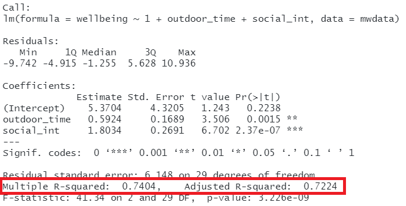
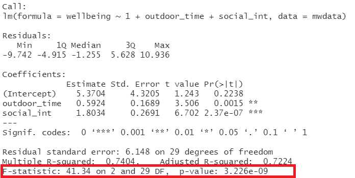

```{r setup, include=FALSE}
source('assets/setup.R')
library(tidyverse)
library(patchwork)
```

<!-- w7 -->
<!-- correlation ++ -->
<!-- significance -->
<!--   - coefficients -->
<!-- - F, R^2 -->

<!-- w8 -->
<!-- - assumptions & diagnostics -->
<!-- - multiple regression -->
<!-- - model comparison -->
<!-- - SS types -->


<!-- # Regression introduction -->
<!-- - write out model, consider hypotheses -->
<!-- - first explore the data -->
<!-- - fitting a model -->
<!-- - interpreting coefficients -->
<!-- - interpreting sigma -->
<!-- - fitted and predicted values -->

<!-- # Inference for regression coefficients -->

<!-- # Model Fit: -->
<!--  - partitioning variation -->
<!--  - testing model utility -->

<!-- # A categorical predictor -->
<!--  - (this will be covered in week 9 lecture, but the general idea is) -->

<!-- # extending to multiple predictors -->
<!-- ## ~ numeric + numeric -->


<!-- # assumptions -->
<!-- # choose > fit > assess > use -->
<!-- optbegin: a recipe book: LINE -->
<!--   ## linearity -->
<!--   ## equal variances -->
<!--   ## independence -->
<!--   ## normality of errors -->
<!-- # the general idea -->
<!-- # multicollinearity -->
<!-- # diagnostics -->
<!-- ## individual cases -->
<!-- ## other influence.measures() -->

:::lo

<div style="width:60%; display: inline-block;">

This lab is a long one! It takes us quite slowly through simple and multiple regression, but the broader ideas being introduced are actually quite simple - we are just drawing a straight line through some datapoints!  
Try to take regular breaks during these exercises. This will help (a bit) with not getting overwhelmed - these things (both the statistics side and the programming side) take time - and repeated practice - to sink in.
</div>
<div style="width:30%; display: inline-block; vertical-align: top">
```{r echo=FALSE}

```
</div>
:::


# Simple regression  
 

:::frame
__Data: riverview.csv__  

Let’s imagine a study into income disparity for workers in a local authority. We might carry out interviews and find that there is a link between the level of education and an employee’s income. Those with more formal education seem to be better paid. 
Now we wouldn’t have time to interview everyone who works for the local authority so we would have to interview a sample, say 10%.  

In this next set of exercises we will use the riverview data, which come from [Lewis-Beck, 2015](https://methods.sagepub.com/book/applied-regression-an-introduction-second-edition) and contain five attributes collected from a random sample of $n=32$ employees working for the city of Riverview, a hypothetical midwestern city in the US. The attributes include:  

- `education`: Years of formal education
- `income`: Annual income (in thousands of U.S. dollars)
- `seniority`: Years of seniority
- `gender`: Employee's gender
- `male`: Dummy coded gender variable (0 = Female, 1 = Male)
- `party`: Political party affiliation


**Preview**

The first six rows of the data are:

```{r echo=FALSE}
library(tidyverse)
library(kableExtra)

riverview <- read_csv('https://uoepsy.github.io/data/riverview.csv')
kable(head(riverview), align='c') %>% kable_styling(full_width = FALSE)
```


The data is available at [https://uoepsy.github.io/data/riverview.csv.](https://uoepsy.github.io/data/riverview.csv){target="_blank"}

:::


`r qbegin("A1")` 
Load the required libraries (probably just __tidyverse__ for now), and read in the riverview data to your R session.  
I'm going to name it `riverview` in my environment.  
`r qend()`

`r solbegin(show = params$SHOW_SOLS, toggle = params$TOGGLE)`
```{r, warning=FALSE, message=FALSE}
library(tidyverse)

riverview <- read_csv("https://uoepsy.github.io/data/riverview.csv")
head(riverview)
```
`r solend()`

## Exploring the data

:::statbox
Probably the first port of call for almost any statistical analysis is to just explore the data and make sure that things look as you would expect them to look. We can do this visually, or numerically, using the skills we saw in weeks 1 and 2. 
:::

`r qbegin("A2")`  
Let us first visualise and describe the *marginal distributions* of those variables which are of interest to us. 
These are the distribution of each variable (employee incomes and education levels) *without* reference to the values of the other variables.

- You could use, for example, `geom_density()` for a density plot or `geom_histogram()` for a histogram.
- Look at the shape, center and spread of the distribution. Is it symmetric or skewed? Is it unimodal or bimodal? 
- Do you notice any extreme observations?
  
`r qend()`

`r solbegin(show = params$SHOW_SOLS, toggle = params$TOGGLE)`
We can plot the marginal distribution of employee incomes as a density curve, and add a boxplot underneath to check for the presence of outliers.  

The `width` of the geom_boxplot() is always quite wide, so I want to make it narrower so that we can see it at the same time as the density plot. Deciding on the exact value for the width here is just trial and error. 

```{r fig.cap="Density plot and boxplot of employee incomes."}
ggplot(data = riverview, aes(x = income)) +
  geom_density() +
  geom_boxplot(width = 1/300) +
  labs(x = "Income (in thousands of U.S. dollars)", 
       y = "Probability density")
```

The plot suggests that the distribution of employee incomes is unimodal and most of the incomes are between roughly \$45,000 and \$70,000. 
The smallest income in the sample is about \$25,000 and the largest income is over \$80,000. (We could find the exact values using the `summary()` function).
This suggests there is a fair amount of variation in the data. 
Furthermore, the boxplot does not highlight any outliers in the data.


```{r fig.cap='Density plot and boxplot of employee education levels.'}
ggplot(data = riverview, aes(x = education)) +
  geom_density() +
  geom_boxplot(width = 1/100) +
  labs(x = "Education (in years)", 
       y = "Probability density")
```

To further summarize a distribution, it is typical to compute and report numerical summary statistics such as the mean and standard deviation. One way to compute these values is to use the `summarise()/summarize()` function from the `tidyverse` library:

```{r}
riverview %>% 
  summarize(
    e = mean(income), 
    sd_income = sd(income),
    mean_edu = mean(education),
    sd_edu = sd(education)
    )
```

:::int
The marginal distribution of income is unimodal with a mean of approximately \$53,700. There is variation in employees' salaries (SD = \$14,553).  
The marginal distribution of education is unimodal with a mean of 16 years. There is variation in employees' level of education (SD = 4.4 years).  
:::

`r solend()`

`r qbegin("A3")`  
After we've looked at the marginal distributions of the variables of interest in the analysis, we typically move on to examining *relationships* between the variables.  
  
Visualise and describe (just in words) the relationship between income and level of education among the employees in the sample.  

Think about:  

- *Direction* of association
- *Form* of association (can it be summarised well with a straight line?)  
- *Strength* of association (how closely do points fall to a recognizable pattern such as a line?)
- *Unusual observations* that do not fit the pattern of the rest of the observations and which are worth examining in more detail.  

`r qend()`

`r solbegin(show = params$SHOW_SOLS, toggle = params$TOGGLE)`
We are trying to investigate how income varies when varying years of formal education.
Hence income is the dependent variable (on the y-axis), and education is the independent variable (on the x-axis).

```{r riverview-scatterplot, fig.cap='The relationship between employees\' education level and income.'}
ggplot(data = riverview, aes(x = education, y = income)) +
  geom_point(alpha = 0.5) +
  labs(x = "Education (in years)", 
       y = "Income (in thousands of U.S. dollars)")
```

We might write:

:::int
There is a strong positive linear relationship between education level and income for the employees in the sample.
High incomes tend to be observed, on average, with more years of formal education.
The scatterplot does not highlight any outliers.
:::
`r solend()`

:::frame
To comment numerically on the strength of the linear association we might compute the correlation coefficient that we were introduced to in [Week 5](05_covcor.html):
```{r}
riverview %>%
  select(education, income) %>%
  cor()
```

that is, 
$$
r_{\text{education, income}} = 0.79
$$

:::


## Fitting a Linear Model

<!-- :::statbox -->
<!-- **A note on notation**   -->

<!-- You will see a variety of different ways of specifying the linear model form in different resources.   -->
<!-- Some use $\beta$, some use $b$.   -->

<!-- In the lectures, you have seen the form $\color{red}{y} = \color{blue}{b_0 \cdot{} 1 + b_1 \cdot{} x} + \epsilon$.   -->

<!-- In the exercises below, we will tend to use $\color{red}{Y} = \color{blue}{\beta_0 \cdot{} 1 + \beta_1 \cdot{} X} + \epsilon$, to denote our population model, which when fitted on some sample data becomes $\color{red}{\hat{Y}} = \color{blue}{\hat{\beta}_0 \cdot{} 1 + \hat{\beta_1} \cdot{} X} + \hat{\epsilon}$ (the little hats indicate that they are fitted estimates).   -->

<!-- ::: -->

:::frame
The plot created in the previous question highlights a linear relationship, where the data points are scattered around an underlying linear pattern with a roughly-constant spread as x varies.

We will try to fit a simple (one explanatory variable only) linear regression model:

$$
Income = b_0 + b_1 \ Education + \epsilon \quad \\
\text{where} \quad \epsilon \sim N(0, \sigma) \text{ independently}
$$

where "$\epsilon \sim N(0, \sigma) \text{ independently}$" means that the errors around the line have mean zero and constant spread as x varies (we'll read more about what this means later in this lab in the section on [Making Valid Inferences](#making)). 

:::rtip
To fit linear models, we use the `lm()` function.  
The syntax of the `lm()` function is:  
```
[model name] <- lm([response variable] ~ 1 + [explanatory variable], data = [dataframe])
```

:::
:::


:::rtip
__Why `~1`?__  

The fitted model can be written as
$$
\hat y = \hat b_0 + \hat b_1 (x)
$$
The predicted values for the outcome are equal to our intercept, $\hat b_0$, plus our slope $\hat b_1$ multiplied by the value on our explanatory variable $x$.  
The intercept is a _constant_. That is, we could write it as multiplied by 1:
$$
\hat y = \color{blue}{\hat b_0}(\color{green}{1})\color{blue}{ + \hat b_1 }(\color{green}{x})
$$

When we specify the linear model in R, we include after the tilde sign `~` all the things which appear to the right of each of the $\hat b$s (the bits in green in the equartion above). That's why the 1 is included. It is just saying "we want the intercept, $b_0$, to be estimated".   

:::

`r qbegin("A4")`
Using the `lm()` function, fit a linear model to the sample data, in which employee income is explained by education level. Assign it to a name to store it in your environment.

`r qend()`

`r solbegin(show = params$SHOW_SOLS, toggle = params$TOGGLE)`
As the variables are in the `riverview` dataframe, we would write:  
```{r}
model1 <- lm(income ~ 1 + education, data = riverview)
```

`r solend()`

## Interpreting coefficients

`r qbegin("A5")`
Interpret the estimated intercept and slope in the context of the question of interest.  

Let's suppose we assigned our linear model object to the name "model1" in R. To obtain the estimated regression coefficients we can use it's name in various ways and with various functions. 


- type `model1`, i.e. simply invoke the name of the fitted model;
- type `model1$coefficients`;
- use the `coef(model1)` function;
- use the `coefficients(model1)` function;
- use the `summary(model1)` function and look under the "Estimate" column.

The estimated parameters returned by the above methods are all equivalent. However, `summary()` returns more information and you need to look under the column "Estimate".  
`r qend()`

`r solbegin(show = params$SHOW_SOLS, toggle = params$TOGGLE)`
```{r}
coef(model1)
```
The fitted line is:
$$
\widehat{Income} = 11.32 + 2.65 \ Education \\
$$


We can interpret the estimated intercept as follows,

:::int
The estimated average income associated with zero years of formal education is \$11,321.
:::

For the estimated slope we might write,

:::int
The estimated increase in average income associated with a one year increase in education is \$2,651.
:::
`r solend()`


## Interpreting $\sigma$


:::statbox
The parameter estimates from our simple linear regression model take the form of a line, representing the systematic part of our model $b_0 + b_1 \ x$, which in our case is $11.32 + 2.65 \ Education$. Deviations from the line are determined by the random error component $\hat \epsilon$, or "residuals" (the red lines in Figure \@ref(fig:figslr) below).  

```{r figslr, echo=FALSE, fig.cap="Simple linear regression model, with systematic part of the model in blue and residuals in red"}
betas <- coef(model1)
intercept <- betas[1]
slope <- betas[2]

broom::augment(model1) %>%
ggplot(., aes(x = education, y = income)) +
  geom_point(alpha = 0.5) +
  geom_abline(intercept = intercept, slope = slope, 
              color = 'blue', size = 1) + 
  labs(x = "Education (in years)", 
       y = "Income (in thousands of U.S. dollars)")+
  geom_segment(aes(x=education, xend=education, y=income, yend=.fitted), col="red",lty="dotted")
```

We use $\sigma$ to denote the standard deviation of all the residuals

:::

`r qbegin("A6")`
Consider the following:  

1. In fitting a linear regression model, we make the assumption that the errors around the line are normally distributed around zero (this is the $\epsilon \sim N(0, \sigma)$ bit.)  
2. About 95\% of values from a normal distribution fall within two standard deviations of the centre.  

We can obtain the estimated standard deviation of the errors ($\hat \sigma$) from the fitted model using `sigma()` and giving it the name of our model.  
What does this tell us?  

`r optbegin('Huh? What is $\\sigma$?', olabel=FALSE, toggle=params$TOGGLE)`
The standard deviation of the errors, denoted by $\sigma$ is an important quantity to estimate because it measures how much individual data points tend to deviate above and below the regression line. 

A small $\sigma$ indicates that the points hug the line closely and we should expect fairly accurate predictions, while a large $\sigma$ suggests that, even if we estimate the line perfectly, we can expect individual values to deviate from it by substantial amounts.

When we actually **estimate** this quantity, we might put a hat on it, and write $\hat \sigma$. It is equal to
$$
\hat \sigma = \sqrt{\frac{SS_{Residual}}{n - 2}} \\
\begin{align}
& \text{where} \\
& SS_{Residual} = \textrm{Sum of Squared Residuals} = \sum_{i=1}^n{(\epsilon_i)^2}
\end{align}
$$
`r optend()`

`r qend()`
`r solbegin(show = params$SHOW_SOLS, toggle = params$TOGGLE)`
The estimated standard deviation of the errors can be equivalently obtained by:

- typing `sigma(model1)`;
- looking at the "Residual standard error" entry of the `summary(model1)` output.

_**Note:** The term "Residual standard error" is a misnomer, as the help page for `sigma` says (check `?sigma`). However, it's hard to get rid of this bad name as it has been used in too many books showing R output._


```{r}
sigma(model1)
```

:::int
For any particular level of education, employee incomes should be distributed above and below the regression line with standard deviation estimated to be $\hat \sigma = 8.98$. 
Since $2 \hat \sigma = 2 (8.98) = 17.96$, we expect most (about 95\%) of the employee incomes to be within about \$18,000 from the regression line.
:::  

`r solend()`


## Fitted and predicted values  

:::rtip
To compute the model-predicted values for the data in the sample we can use various functions. Again, if our model object is named "model1" in our environment, we can use:

- `predict(model1)`
- `fitted(model1)`
- `fitted.values(model1)`
- `model1$fitted.values`

For example, this will give us the estimated income (point on our regression line) for each observed value of education level.
```{r}
predict(model1)
```

We can also compute model-predicted values for other (unobserved) data:

- `predict([fitted model], newdata = [dataframe])`

```{r}
# make a tibble/dataframe with values for the predictor:
education_query <- tibble(education = c(11, 18, 50))
# model predicted values of income, for the values of education
# inside the "education_query" data
predict(model1, newdata = education_query)
```
:::

`r qbegin("A7")`
Compute the model-predicted income for someone with 1 year of education.  
`r qend()`
`r solbegin(show = params$SHOW_SOLS, toggle = params$TOGGLE)`
```{r}
education_query <- tibble(education = c(1))
predict(model1, newdata = education_query)
```
`r solend()`

`r qbegin("A8")`
Given that our fitted model takes the form: 

$$
Income = 11.32 + 2.65\cdot Education
$$
How can we get to this same answer manually?
`r qend()`
`r solbegin(show = params$SHOW_SOLS, toggle = params$TOGGLE)`
We are asking what the predicted income is for someone with 1 year of education. So we can substitute in "1" for the Education variable:
$$
\begin{align}
Income &= 11.32 + 2.65\cdot Education \\
Income &= 11.32 + 2.65\cdot 1 \\
Income &= 11.32 + 2.65\\
Income &= 13.97 \\
\end{align}
$$


`r solend()`


## Inference for regression coefficients  

:::statbox
We have fitted a linear model, and we now know how we interpret our coefficients. But this is only part of the story. 
```{r echo=FALSE, fig.cap="Estimates without inference"}

```


To quantify the amount of uncertainty in each estimated coefficient that is due to sampling variability, we use the standard error (SE) of the coefficient. 
_Recall that a standard error gives a numerical answer to the question of how variable a statistic will be because of random sampling._  

The standard errors are found in the column "Std. Error" of the `summary()` of a model:
```{r echo=FALSE}
summary(model1)$coefficients
```

In this example the slope, 2.651, has a standard error of 0.37. One way to envision this is as a distribution. Our best guess (mean) for the slope parameter is 2.651. The standard deviation of this distribution is 0.37, which indicates the precision (uncertainty) of our estimate.

```{r echo=FALSE, fig.cap='Sampling distribution of the slope coefficient. The distribution is approximately bell-shaped with a mean of 2.651 and a standard error of 0.37.'}
ggplot(tibble(x = c(-3 * 0.37 + 2.651, 3 * 0.37 + 2.651)), aes(x = x)) +
    stat_function(fun = dnorm, args = list(mean = 2.651, sd = 0.37)) +
  labs(x = "Estimate for employee incomes", y = '')
```

We can perform a test against the null hypothesis that the estimate is zero. Our test statistic: 
The reference distribution in this case is a t-distribution with $n-2$ degrees of freedom, where $n$ is the sample size, and our test statistic is:  
$$
t = \frac{\hat b_1 - 0}{SE(\hat b_1)}
$$

:::


`r qbegin("A9")`
Test the hypothesis that the population slope is zero --- that is, that there is no linear association between income and education level in the population.  

(Hint: you don't need to *do* anything for this, you can find all the necessary information in `summary()` of your model)
`r qend()`

`r solbegin(show = params$SHOW_SOLS, toggle = params$TOGGLE)`
The information is already contained in the row corresponding to the variable "education" in the output of `summary()`, which reports the t-statistic under `t value` and the p-value under `Pr(>|t|)`:
```{r}
summary(model1)
```

Before we interpret the results, recall that the p-value `5.56e-08` in the `Pr(>|t|)` column simply means $5.56 \times 10^{-8}$. This is a very small value, hence we will report it as <.001 following the APA guidelines.

:::int
We performed a t-test against the null hypothesis that education is not a significant predictor of income: $t(30) = 7.173,\ p < .001$, two-sided.
The large t-statistic leads to a very small p-value, meaning that we have strong evidence against the null hypothesis.
:::

```{r echo=FALSE, fig.cap="conversations with statisticians"}

```


`r solend()`

## Model evaluation 

:::statbox
__Partitioning variation: $R^2$__  
  
We might ask ourselves if the model is useful. To quantify and assess model utility, we split the total variability of the response into two terms: the variability explained by the model plus the variability left unexplained in the residuals.

$$
\text{total variability in response = variability explained by model + unexplained variability in residuals}
$$

Each term is quantified by a sum of squares:

$$
\begin{aligned}
SS_{Total} &= SS_{Model} + SS_{Residual} \\
\sum_{i=1}^n (y_i - \bar y)^2 &= \sum_{i=1}^n (\hat y_i - \bar y)^2 + \sum_{i=1}^n (y_i - \hat y_i)^2 \\
\quad \\
\text{Where:} \\
y_i = \text{observed value} \\
\bar{y} = \text{mean} \\
\hat{y}_i = \text{model predicted value} \\
\end{aligned}
$$

The R-squared coefficient is defined as the proportion of the total variability in the outcome variable which is explained by our model:  
$$
R^2 = \frac{SS_{Model}}{SS_{Total}} = 1 - \frac{SS_{Residual}}{SS_{Total}}
$$
:::


`r qbegin("A10")`
What is the proportion of the total variability in incomes explained by the linear relationship with education level?

_**Hint:** The question asks to compute the value of $R^2$, but you might be able to find it already computed somewhere (so much stuff is already in `summary()` of the model._
`r qend()`
`r solbegin(show=params$SHOW_SOLS, toggle=params$TOGGLE)`
```{r}
summary(model1)
```

The output of `summary()` displays the R-squared value in the following line:
```
Multiple R-squared:  0.6317
```

For the moment, ignore "Adjusted R-squared". We will come back to this later on. 

`r optbegin("Optional - Manual calculation of R-Squared", olabel=F, toggle=params$TOGGLE)`

```{r}
riverview_fitted <- riverview %>%
  mutate(
    income_hat = predict(model1),
    resid = income - income_hat
  )
head(riverview_fitted)

riverview_fitted %>%
  summarise(
    SSModel = sum( (income_hat - mean(income))^2 ),
    SSTotal = sum( (income - mean(income))^2 )
  ) %>%
  summarise(
    RSquared = SSModel / SSTotal
  )
```

`r optend()`

:::int
Approximately 63\% of the total variability in employee incomes is explained by the linear association with education level.
:::

`r solend()`

:::statbox
__Testing Model Utility: $F$ Statistic__  
  
To test if the model is useful --- that is, if the explanatory variable is a useful predictor of the response --- we test the following hypotheses:

$$
\begin{aligned}
H_0 &: \text{the model is ineffective, } b_1 = 0 \\
H_1 &: \text{the model is effective, } b_1 \neq 0
\end{aligned}
$$
The relevant test-statistic is the F-statistic:

$$
\begin{split}
F = \frac{MS_{Model}}{MS_{Residual}} = \frac{SS_{Model} / 1}{SS_{Residual} / (n-2)}
\end{split}
$$

which compares the amount of variation in the response explained by the model to the amount of variation left unexplained in the residuals.

The sample F-statistic is compared to an F-distribution with $df_{1} = 1$ and $df_{2} = n - 2$ degrees of freedom.^[
$SS_{Total}$ has $n - 1$ degrees of freedom as one degree of freedom is lost in estimating the population mean with the sample mean $\bar{y}$.
$SS_{Residual}$ has $n - 2$ degrees of freedom. There are $n$ residuals, but two degrees of freedom are lost in estimating the intercept and slope of the line used to obtain the $\hat y_i$s.
Hence, by difference, $SS_{Model}$ has $n - 1 - (n - 2) = 1$ degree of freedom.
]

`r optbegin('Optional: Another formula for the F-test.', olabel=FALSE, toggle=params$TOGGLE)`
With some algebra we can also show that:
$$
F = \frac{R^2 / 1}{(1 - R^2) / (n - 2) } = \frac{R^2 / df_{Model}}{(1 - R^2) / df_{Residual} }
$$

Proof:

$$
\begin{aligned}
F = \frac{SS_{Model} / 1}{SS_{Residual} / (n - 2)} 
= \frac{\frac{SS_{Model}}{SS_{Total}}}{\frac{SS_{Residual}}{SS_{Total}} \cdot \frac{1}{(n - 2)}} 
= \frac{R^2 / 1}{(1 - R^2) / (n - 2)}
\end{aligned}
$$
`r optend()`

:::

`r qbegin("A11")`
Look at the output of `summary()` of your model. Identify the relevant information to conduct an F-test against the null hypothesis that the model is ineffective at predicting income using education level.
`r qend()`

`r solbegin(show = params$SHOW_SOLS, toggle = params$TOGGLE)`
```{r}
summary(model1)
```

The relevant row is the following:
```
F-statistic: 51.45 on 1 and 30 DF,  p-value: 5.562e-08
```
We might interpret this as:

:::int
We performed an F-test for the overall significance of the regression, $F(1, 30) = 51.45, p < .001$, indicating very strong evidence against the null hypothesis that the model is ineffective.

In other words, the data provide strong evidence that education is an effective predictor of income.
:::

`r solend()`

`r optbegin('Optional: Equivalence of t-test for the slope and model utility F-test in simple regression.', olabel = FALSE,  toggle=params$TOGGLE)`
**In simple linear regression only**, the F-statistic for overall model significance is equal to the square of the t-statistic for $H_0: b_1 = 0$.

You can check that the squared t-statistic is equal, up to rounding error, to the F-statistic:
```{r}
summary(model1)$fstatistic['value']
summary(model1)$coefficients['education','t value']
```
$$
t^2 = F \\
7.173^2 = 51.452
$$


Here we will show the equivalence of the F-test for model effectiveness and t-test for the slope.

Recall the formula of the sum of squares due to the model. We will rewrite it in an equivalent form below:
$$
\begin{aligned}
SS_{Model} &= \sum_i (\hat y_i - \bar y)^2 \\
&= \sum_i (\hat b_0 + \hat b_1 x_i - \bar y)^2 \\
&= \sum_i (\bar y - \hat b_1 \bar x + \hat b_1 x_i - \bar y)^2 \\
&= \sum_i (\hat b_1 (x_i - \bar x))^2 \\
&= \hat b_1^2 \sum_i (x_i - \bar x)^2
\end{aligned}
$$

The F-statistic is given by:
$$
\begin{aligned}
F = \frac{SS_{Model} / 1}{SS_{Residual} / (n - 2)} 
= \frac{\hat b_1^2 \sum_i (x_i - \bar x)^2}{\hat \sigma^2} 
= \frac{\hat b_1^2 }{\hat \sigma^2 / \sum_i (x_i - \bar x)^2}
\end{aligned}
$$

Now recall the formula of the t-statistic,
$$
t = \frac{\hat b_1}{SE(\hat b_1)} = \frac{\hat b_1}{\hat \sigma / \sqrt{\sum_i (x_i - \bar x)^2}}
$$

It is evident that the latter is obtained as the square root of the former.

`r optend()`


## Binary predictors {#binpred}

Let's suppose that instead of having measured education in years, we had data instead on "Obtained College Degree: Yes/No". Our explanatory variable would be binary categorical (think back to our discussion of [types of data](01_categorical.html#Types_of_Data)).  

Let us pretend that everyone with >18 years of education has a college degree:
```{r}
riverview <- 
  riverview %>%
    mutate(
      degree = ifelse(education > 18, "Yes", "No")
    )
```

We may then plot our relationship as a boxplot. If you want to see the individual points, you could always "jitter" them (right-hand plot below)
```{r}
ggplot(riverview, aes(x = degree, y = income)) + 
  geom_boxplot() +
ggplot(riverview, aes(x = degree, y = income)) + 
  geom_jitter(height=0, width=.05)
```

:::statbox
__Binary predictors in linear regression__

We can include categorical predictors in a linear regression, but the interpretation of the coefficients is very specific. Whereas we talked about coefficients being interpreted as "the change in $y$ associated with a 1-unit increase in $x$", for categorical explanatory variables, coefficients can be considered to examine differences in group means. However, they are actually doing exactly the same thing - the model is simply translating the levels (like "Yes"/"No") in to 0s and 1s!  

So while we may have in our dataframe a categorical predictor like the middle column "degree", below, what is inputted into our model is more like the third column, "isYes". 
```{r echo=FALSE}
riverview %>% sample_n(size=n()) %>%
  mutate(
    isYes = ifelse(degree == "Yes", 1, 0)
  ) %>% select(income, degree, isYes)
```

Our coefficients are just the same as before. The intercept is where our predictor equals zero, and the slope is the change in our outcome variable associated with a 1-unit change in our predictor.  
However, "zero" for this predictor variable now corresponds to a whole level. This is known as the "reference level". Accordingly, the 1-unit change in our predictor (the move from "zero" to "one") corresponds to the difference between the two levels. 


```{r echo=FALSE}
cstat = coef(lm(income~degree,riverview))
riverview %>%
  mutate(
    isYes = ifelse(degree == "Yes", 1, 0)
  ) %>% ggplot(.,aes(x=factor(isYes), y=income))+
  #geom_boxplot(fatten=NULL)+
  geom_jitter(height=0,width=.05)+
  geom_smooth(method="lm",aes(x=isYes+1), se=F)+
  geom_segment(aes(x="1",xend="1",y=cstat[1],yend=cstat[1]+cstat[2]), lty="dashed",col="blue")+
  geom_segment(aes(x="0",xend="1",y=cstat[1],yend=cstat[1]), lty="dashed",col="blue")+
  annotate("text",x=2.15,y=mean(c(cstat[1], sum(cstat)))-3,label=expression(paste(beta[1], " (slope)")), col="blue")+
  geom_point(x=1,y=cstat[1], col="blue",size=3)+
  annotate("text",x=1,y=cstat[1],label=expression(paste(beta[0], " (intercept)")), col="blue", hjust=1.1)+
  labs(x="degree isYes")
```
:::  


```{r echo=FALSE}

```


# Multiple Regression 

In this next block of exercises, we move from the simple linear regression model (one outcome variable, one explanatory variable) to the _multiple regression model_ (one outcome variable, multiple explanatory variables).  
Everything we just learned about simple linear regression can be extended (with minor modification) to the multiple regression model. The key conceptual difference is that for simple linear regression we think of the distribution of errors at some fixed value of the explanatory variable, and for multiple linear regression, we think about the distribution of errors at fixed set of values for all our explanatory variables. 

:::statbox
**Model formula**

For multiple linear regression, the model formula is an extension of the one predictor ("simple") regression model, to include any number of predictors:  
$$
y = b_0 \ + \ b_1 x_1 \ + \ b_2 x_2 \ + \ ... \ + b_k x_k \ + \ \epsilon \\ 
\quad \\ 
\text{where} \quad \epsilon \sim N(0, \sigma) \text{ independently}
$$

In the model specified above,

- $\mu_{y|x_1, x_2, ..., x_k} = b_0 + b_1 x + b_2 x_2 + ... b_k x_k$ represents the systematic part of the model giving the mean of $y$ at each combination of values of variables $x_1$-$x_k$;
- $\epsilon$ represents the error (deviation) from that mean, and the errors are independent from one another.    
  
__Visual__

Note that for simple linear regression we talked about our model as a _line_ in 2 dimensions: the systematic part $b_0 + b_1 x$ defined a line for $\mu_y$ across the possible values of $x$, with $\epsilon$ as the random deviations from that line. But in multiple regression we have more than two variables making up our model. 

In this particular case of three variables (one outcome + two explanatory), we can think of our model as a _regression surface_ (See Figure \@ref(fig:regsurf)). The systematic part of our model defines the surface across a range of possible values of both $x_1$ *and* $x_2$. Deviations from the surface are determined by the random error component, $\hat \epsilon$.  

```{r regsurf, echo=FALSE, fig.cap = "Regression surface for wellbeing ~ outdoor_time + social_int, from two different angles", out.width="100%"}
mwdata = read_csv(file = "https://uoepsy.github.io/data/wellbeing.csv")
mwdata %>% rename(y=wellbeing,x1=outdoor_time,x2=social_int) -> mwdata
fit<-lm(y~x1+x2, data=mwdata)
steps=50
x1 <- with(mwdata, seq(min(x1),max(x1),length=steps))
x2 <- with(mwdata, seq(min(x2),max(x2),length=steps))
newdat <- expand.grid(x1=x1, x2=x2)
y <- matrix(predict(fit, newdat), steps, steps)


par(mfrow=c(1,2))
p <- persp(x1,x2,y, theta = 35,phi=10, col = NA)
obs <- with(mwdata, trans3d(x1,x2, y, p))
pred <- with(mwdata, trans3d(x1, x2, fitted(fit), p))
points(obs, col = "red", pch = 16)
#points(pred, col = "blue", pch = 16)
segments(obs$x, obs$y, pred$x, pred$y)

p <- persp(x1,x2,y, theta = -35,phi=10, col = NA)
obs <- with(mwdata, trans3d(x1,x2, y, p))
pred <- with(mwdata, trans3d(x1, x2, fitted(fit), p))
points(obs, col = "red", pch = 16)
#points(pred, col = "blue", pch = 16)
segments(obs$x, obs$y, pred$x, pred$y)

par(mfrow=c(1,1))
```

Don't worry about trying to figure out how to visualise it if we had any more explanatory variables! We can only concieve of 3 spatial dimensions. One could imagine this surface changing over time, which would bring in a 4th dimension, but beyond that, it's not worth trying!.

:::

<!-- We previously used simple linear regression to examine whether score on the WMBWS was related to the amount of time spent outdoors (self-reported as the average number of hours per week). We will now extend this and build a multiple regression model which we can use to predict WEMWBS score based on both outdoor time *and* number of social interactions.   -->

`r qbegin("B1")`
Let's imagine that some reseachers are interested in the relationship between psychological wellbeing and time spent outdoors. They know that other aspects of peoples' lifestyles such as how much social interaction they have can influence their mental well-being. They would like to study whether there is a relationship between well-being and time spent outdoors *after* taking into account the relationship between well-being and social interactions.   

To evaluate this hypothesis, we are going to fit the following model:  

$$
Wellbeing = b_0 \ + \ b_1 \cdot Outdoor Time \ + \ b_2 \cdot Social Interactions \ + \ \epsilon
$$

First, create a new section heading in your R script or RMarkdown document (whichever you are using) for the multiple regression exercises.  
Import the wellbeing data (detailed below) into R. We'll give them the name `mwdata`.    
  
`r qend()`
`r solbegin(show=params$SHOW_SOLS, toggle=params$TOGGLE)`
```{r}
library(tidyverse)
# Read in data
mwdata = read_csv(file = "https://uoepsy.github.io/data/wellbeing.csv")
```
`r solend()`

:::frame
__Data: Wellbeing__  

The data is available at https://uoepsy.github.io/data/wellbeing.csv.   
  
__Description__

Researchers interviewed 32 participants, selected at random from the population of residents of Edinburgh & Lothians. They used the Warwick-Edinburgh Mental Wellbeing Scale (WEMWBS), a self-report measure of mental health and well-being. The scale is scored by summing responses to each item, with items answered on a 1 to 5 Likert scale. The minimum scale score is 14 and the maximum is 70.  
The researchers also asked participants to estimate the average number of hours they spend outdoors each week, the average number of social interactions they have each week (whether on-line or in-person), and whether they believe that they stick to a routine throughout the week (Yes/No).  

The data in `wellbeing.csv` contain five attributes collected from a random sample of $n=32$ hypothetical residents over Edinburgh & Lothians, and include:

- `wellbeing`: Warwick-Edinburgh Mental Wellbeing Scale (WEMWBS), a self-report measure of mental health and well-being. The scale is scored by summing responses to each item, with items answered on a 1 to 5 Likert scale. The minimum scale score is 14 and the maximum is 70.  
- `outdoor_time`: Self report estimated number of hours per week spent outdoors  
- `social_int`: Self report estimated number of social interactions per week (both online and in-person)
- `routine`: Binary Yes/No response to the question "Do you follow a daily routine throughout the week?"
- `location`: Location of primary residence (City, Suburb, Rural)

__Preview__

The first six rows of the data are:

```{r echo=FALSE}
library(tidyverse)
read_csv('https://uoepsy.github.io/data/wellbeing.csv') %>% head %>% gt::gt()
```

:::

`r qbegin("B2")`
Explore and describe the relevant variables and relationships.

`r optbegin("Hints", olabel=F,toggle=params$TOGGLE)`
- Produce plots of the _marginal distributions_ (the distributions of each variable in the analysis without reference to the other variables) of the `wellbeing`, `outdoor_time`, and `social_int` variables. 
- Produce plots of the _marginal relationships_ between the outcome variable (`wellbeing`) and each of the explanatory variables.  
- Produce a correlation matrix of the variables which are to be used in the analysis, and write a short paragraph describing the relationships. 


:::statbox
__Correlation matrix__  

A table showing the correlation coefficients - $r_{(x,y)}=\frac{\mathrm{cov}(x,y)}{s_xs_y}$ - between variables. Each cell in the table shows the relationship between two variables. The diagonals show the correlation of a variable with itself (and are therefore always equal to 1).  

:::

:::rtip
We can create a correlation matrix easily by giving the `cor()` function a dataframe. However, we only want to give it 3 columns here. Think about how we select specific columns, either using `select()`, or giving the column numbers inside `[]`. 
:::

`r optend()`

`r qend()`
`r solbegin(show=params$SHOW_SOLS, toggle=params$TOGGLE)`
We should be familiar now with how to visualise a marginal distribution. You might choose histograms, density curves, or boxplots, or a combination:   
```{r fig.cap="Marginal distribution plots of wellbeing sores, weekly hours spent outdoors, and social interactions"}
library(patchwork) #used to arrange plots

wellbeing_plot <- 
  ggplot(data = mwdata, aes(x = wellbeing)) +
  geom_density() +
  geom_boxplot(width = 1/250) +
  labs(x = "Score on WEMWBS (range 14-70)", y = "Probability\ndensity")

outdoortime_plot <- 
  ggplot(data = mwdata, aes(x = outdoor_time)) +
  geom_density() +
  geom_boxplot(width = 1/200) +
  labs(x = "Time spent outdoors per week (hours)", y = "Probability\ndensity")

social_plot <- 
  ggplot(data = mwdata, aes(x = social_int)) +
  geom_density() +
  geom_boxplot(width = 1/150) +
  labs(x = "Number of social interactions per week", y = "Probability\ndensity")

# the "patchwork" library allows us to arrange multiple plots
wellbeing_plot / outdoortime_plot / social_plot
```

:::int  

+ The marginal distribution of scores on the WEMWBS is unimodal with a mean of approximately `r round(mean(mwdata$wellbeing),1)`. There is variation in scores (SD = `r round(sd(mwdata$wellbeing),1)`).   
+ The marginal distribution of weekly hours spend outdoors is unimodal with a mean of approximately `r round(mean(mwdata$outdoor_time),1)` hours. There is variation in outdoor time (SD = `r round(sd(mwdata$outdoor_time),1)` hours).  
+ The marginal distribution of numbers of social interactions per week is unimodal with a mean of approximately `r round(mean(mwdata$social_int),1)`. There is variation in in numbers of social interactions per week (SD = `r round(sd(mwdata$social_int),1)`).  

:::

```{r mwdata-mlr-rels, fig.cap='Scatterplots displaying the relationships between scores on the WEMWBS and a) weekly outdoor time (hours), and b) weekly number of social interactions'}
wellbeing_outdoor <- 
  ggplot(data = mwdata, aes(x = outdoor_time, y = wellbeing)) +
  geom_point(alpha = 0.5) +
  labs(x = "Time spent outdoors per week (hours)", y = "Wellbeing score (WEMWBS)")

wellbeing_social <- 
  ggplot(data = mwdata, aes(x = social_int, y = wellbeing)) +
  geom_point(alpha = 0.5) +
  labs(x = "Number of social interactions per week", y = "Wellbeing score (WEMWBS)")

wellbeing_outdoor | wellbeing_social
```

We can either use:
```{r eval=FALSE}
# correlation matrix of the first 3 columns
cor(mwdata[,1:3])
```
or:
```{r}
# select only the columns we want by name, and pass this to cor()
mwdata %>% 
  select(wellbeing, outdoor_time, social_int) %>%
  cor()
```


:::int
There is a moderate, positive, linear relationship between weekly outdoor time and WEMWBS scores for the participants in the sample.
Participants' wellbeing scores tend to increase, on average, with the number of hours spent outdoors each week.  
There is a moderate, positive, linear relationship between the weekly number of social interactions and WEMWBS scores for the participants in the sample.
Participants' wellbeing scores tend to increase, on average, with the weekly number of social interactions. 
There is also a weak positive correlation between weekly outdoor time and the weekly number of social interactions.  
::: 

<br>
Note that there is a weak correlation between our two explanatory variables (outdoor_time and social_int). We will return to how this might affect our model when later on we look at the assumptions of multiple regression.  
`r solend()`

`r qbegin("B3")`  
In R, using `lm()`, fit the linear model specified by the formula below, assigning the output to a name to store it in your environment.   

$$
Wellbeing = b_0 \ + \ b_1 \cdot Outdoor Time \ + \ b_2 \cdot Social Interactions \ + \ \epsilon
$$

*Tip:*
As we did for simple linear regression, we can fit our multiple regression model using the `lm()` function. We can add as many explanatory variables as we like, separating them with a `+`.  
```
[model name] <- lm([response variable] ~ 1 + [explanatory variable 1] + [explanatory variable 2] + ... , data = [dataframe])
```
`r qend()`
`r solbegin(show=params$SHOW_SOLS, toggle=params$TOGGLE)`
```{r}
wbmodel <- lm(wellbeing ~ 1 + outdoor_time + social_int, data = mwdata)
```
`r solend()`


:::statbox
__Interpretation of Muliple Regression Coefficients__  

The parameters of a multiple regression model are:

+ $b_0$ (The intercept);
+ $b_1$ (The slope across values of $x_1$);
+ ...  
+ ...
+ $b_k$ (The slope across values of $x_k$);
+ $\sigma$ (The standard deviation of the errors).

<br>
You'll hear a lot of different ways that people explain multiple regression coefficients.  
For the model $y = b_0 + b_1 x_1 + b_2 x_2 + \epsilon$, the estimate $\hat b_1$ will often be reported as:  
  
the increase in $y$ for a one unit increase in $x_1$ when...

- holding the effect of $x_2$ constant.
- controlling for differences in $x_2$.
- partialling out the effects of $x_2$.
- holding $x_2$ equal. 
- accounting for effects of $x_2$. 

:::int
```{r, echo=FALSE}
summary(wbmodel)$coefficients
```

The coefficient `r round(coef(wbmodel)[2],2)` of weekly outdoor time for predicting wellbeing score says that among those with the same number of social interactions per week, those who have one additional hour of outdoor time tend to, on average, score `r round(coef(wbmodel)[2],2)` higher on the WEMWBS wellbeing scale. The multiple regression coefficient measures that average _conditional_ relationship.
:::

:::

<!-- :::statbox -->
<!-- Just like the simple linear regression, when we estimate parameters from the available data, we have: -->

<!-- - A _fitted model_ (recall that the h$\hat{\textrm{a}}$ts are used to distinguish our _estimates_ from the _true unknown parameters_):  -->
<!-- $$ -->
<!-- \widehat{Wellbeing} = \hat \beta_0 + \hat \beta_1 \cdot Outdoor Time + \hat \beta_2 \cdot Social Interactions -->
<!-- $$ -->
<!-- - And we have the residuals $\hat \epsilon = y - \hat y$ which are the deviations from the observed values and our model-predicted responses.   -->

<!-- ::: -->

`r qbegin("B4")`

- Extract *and interpret* the parameter estimates (the "coefficients") from your model (`summary()`, `coef()`, `$coefficients` etc will be useful here).  
- Within what distance from the model predicted values (the regression surface) would we expect 95% of WEMWBS wellbeing scores to be? (Either `sigma()` or part of the output from `summary()` will help you for this)  

`r qend()`
`r solbegin(show=params$SHOW_SOLS, toggle=params$TOGGLE)`
```{r}
coef(wbmodel)
```

- $\hat \beta_0$ = `r round(coef(wbmodel)[1],2)`, the estimated average wellbeing score associated with zero hours of outdoor time and zero social interactions per week.  
- $\hat \beta_1$ = `r round(coef(wbmodel)[2],2)`, the estimated increase in average wellbeing score associated with one hour increase in weekly outdoor time, _holding the number of social interactions constant_ (i.e., when the remaining explanatory variables are held at the same value or are fixed).
- $\hat \beta_2$ = `r round(coef(wbmodel)[3],2)`, the estimated increase in average wellbeing score associated with an additional social interaction per week (an increase of one), _holding weekly outdoor time constant_.  

```{r}
sigma(wbmodel)
```

The estimated standard deviation of the errors is $\hat \sigma$ = `r round(sigma(wbmodel),2)`. We would expect 95% of wellbeing scores to be within about `r round(sigma(wbmodel)*2,2)` ($2 \hat \sigma$) from the model fit. 

`r solend()`

`r qbegin("B5")`
We can obtain confidence intervals for our estimates. These provide a means of quantifying the uncertainty (or precision) of our estimates.  

:::statbox

Think of a confidence interval like a ring-toss.  
The population parameter is some value, but we only have a sample, with which we use to *estimate* the value in the population. 
95% Confidence Intervals are a way of saying "95% of the times I might throw this ring, it will land on the stake". 
(see @EpiEllie https://twitter.com/epiellie/status/1073385427317465089 )

:::

Look up the function `confint()` and obtain some 95% Confidence Intervals for the coefficients. 
`r qend()`
`r solbegin(show=params$SHOW_SOLS, toggle=params$TOGGLE)`
```{r}
confint(wbmodel, level = 0.95)
```

:::int 

+ The average wellbeing score for all those with zero hours of outdoor time and zero social interactions per week is between `r round(confint(wbmodel, level=.95)[1,1],2)` and `r round(confint(wbmodel, level=.95)[1,2],2)`.  
+ When _holding the number of social interactions per week constant_, each one hour increase in weekly outdoor time is associated with a difference in wellbeing scores between `r round(confint(wbmodel, level=.95)[2,1],2)` and `r round(confint(wbmodel, level=.95)[2,2],2)`, on average.  
+ When _holding weekly outdoor time constant_, each increase of one social interaction per week is associated with a difference in wellbeing scores between `r round(confint(wbmodel, level=.95)[3,1],2)` and `r round(confint(wbmodel, level=.95)[3,2],2)`, on average.  

:::

`r solend()`


## More Model Evaluation

:::statbox
__Adjusted $R^2$__  

We know from our work on simple linear regression that the R-squared can be obtained as:
$$
R^2 = \frac{SS_{Model}}{SS_{Total}} = 1 - \frac{SS_{Residual}}{SS_{Total}}
$$

However, when we add more and more predictors into a multiple regression model, $SS_{Residual}$ cannot increase, and may decrease by pure chance alone, even if the predictors are unrelated to the outcome variable. Because $SS_{Total}$ is constant, the calculation $1-\frac{SS_{Residual}}{SS_{Total}}$ will increase by chance alone. 

An alternative, the Adjusted-$R^2$, does not necessarily increase with the addition of more explanatory variables, by including a penalty according to the number of explanatory variables in the model. It is not by itself meaningful, but can be useful in determining what predictors to include in a model. 
$$
Adjusted{-}R^2=1-\frac{(1-R^2)(n-1)}{n-k-1} \\
\quad \\
\begin{align}
& \text{Where:} \\
& n = \text{sample size} \\
& k = \text{number of explanatory variables} \\
\end{align}
$$

---

**In R,** you can view the mutiple and adjusted $R^2$ at the bottom of the output of `summary(<modelname>)`:

```{r mlroutputrsq, echo=FALSE, fig.cap="Multiple regression output in R, summary.lm(). R-squared highlighted",fig.align = 'left'}

```

:::  

:::statbox
__F-ratio__  

As in simple linear regression, the F-ratio is used to test the null hypothesis that __all__ regression slopes are zero (it is just that now that we have multiple predictors, "all" is more than 1).  

It is called the F-ratio because it is the ratio of the how much of the variation is explained by the model (per parameter) versus how much of the variation is unexplained (per remaining degrees of freedom). 

$$
F_{df_{model},df_{residual}} = \frac{MS_{Model}}{MS_{Residual}} = \frac{SS_{Model}/df_{Model}}{SS_{Residual}/df_{Residual}} \\
\quad \\
\begin{align}
& \text{Where:} \\
& df_{model} = k \\
& df_{error} = n-k-1 \\
& n = \text{sample size} \\
& k  = \text{number of explanatory variables} \\
\end{align}
$$

---

**In R,** at the bottom of the output of `summary(<modelname>)`, you can view the F ratio, along with an hypothesis test against the alternative hypothesis that the at least one of the coefficients $\neq 0$ (under the null hypothesis that all coefficients = 0, the ratio of explained:unexplained variance should be approximately 1):

```{r mlroutputrf, echo=FALSE, fig.cap="Multiple regression output in R, summary.lm(). F statistic highlighted", fig.align = 'left'}

```
  
:::


`r qbegin("C1")`
$$
Wellbeing = \beta_0 \ + \ \beta_1 \cdot Outdoor Time \ + \ \beta_2 \cdot Social Interactions \ + \ \epsilon
$$    

Does our model (above) provide a better fit to the data than a model with no explanatory variables? (i.e., test against the alternative hypothesis that at least one of the explanatory variables significantly predicts wellbeing scores). 

`r qend()`
`r solbegin(show=params$SHOW_SOLS, toggle=params$TOGGLE)`
```{r}
summary(wbmodel)
```

:::int
```{r echo=FALSE}
mdl1<-wbmodel
```
Weekly social interactions and outdoor time explained `r paste0(round(summary(mdl1)$adj.r.squared*100,1),"%")` of the variance (adjusted $R^2$ =`r round(summary(mdl1)$adj.r.squared,3)`, $F$(`r paste(summary(mdl1)$fstatistic[2:3],collapse=",")`)=`r round(summary(mdl1)$fstatistic,1)[1]`, p`r map_chr(pf(summary(mdl1)$fstatistic[1],summary(mdl1)$fstatistic[2],summary(mdl1)$fstatistic[3], lower.tail = FALSE), ~ifelse(.<001,"<.001",paste0("=",round(.,2))))`)
:::
  
`r solend()`

# Model Comparison

:::statbox
### Incremental F-test  

The F-ratio we see at the bottom of `summary(model)` is actually a comparison between two models: our model (with some explanatory variables in predicting $y$) and __the null model.__ In regression, the null model can be thought of as the model in which all explanatory variables have zero regression coefficients. It is also referred to as the __intercept-only model__, because if all predictor variable coefficients are zero, then the only we are only estimating $y$ via an intercept (which will be the mean: $\bar y$).  


But we don't always have to comare our model to the null model. We can compare it to all the intermediate models which vary in the complexity, from the null model to our full model.  

:::imp
If (*and only if*) two models are __nested__ (one model contains all the predictors of the other and is fitted to the same data), we can compare them using an __incremental F-test.__  
:::

This is a formal test of whether the additional predictors provide a better fitting model.  
Formally this is the test of:  

+ $H_0:$ coefficients for the added/ommitted variables are all zero.
+ $H_1:$ at least one of the added/ommitted variables has a coefficient that is not zero. 

:::rtip

**In R,** we can conduct an incremental F-test by constructing two models, and passing them to the `anova()` function: `anova(model1, model2)`. 

:::

`r optbegin("Optional: F-ratio written for model comparison", olabel=FALSE, toggle=params$TOGGLE)`
The F-ratio for comparing the residual sums of squares between two models can be written as:

$$
F_{(df_R-df_F),df_F} = \frac{(SSR_R-SSR_F)/(df_R-df_F)}{SSR_F / df_F} \\
\quad \\
\begin{align}
& \text{Where:} \\
& SSR_R = \text{residual sums of squares for the restricted model} \\
& SSR_F = \text{residual sums of squares for the full model} \\
& df_R = \text{residual degrees of freedom from the restricted model} \\
& df_F = \text{residual degrees of freedom from the full model} \\
\end{align}
$$
`r optend()`

:::

`r qbegin("C2")`
Use the code below to fit the null model.  
Then, use the `anova()` function to perform a model comparison between our earlier model and the null model.  
Check that the F statistic is the same as that which is given at the bottom of the `summary()` output of our model.  

```{r}
null_model <- lm(wellbeing ~ 1, data = mwdata)
```

`r qend()`
`r solbegin(show=params$SHOW_SOLS, toggle=params$TOGGLE)`


```{r}
# fit the null model
null_model <- lm(wellbeing ~ 1, data = mwdata)

# model comparison null vs wb_mdl1
anova(null_model, wbmodel)

# extract f statistic from summary of wb_mdl1
summary(wbmodel)$fstatistic
# we can retrieve the p-value:
fstat = summary(wbmodel)$fstatistic[1]
df_1 = summary(wbmodel)$fstatistic[2]
df_2 = summary(wbmodel)$fstatistic[3]
pf(fstat, df_1, df_2, lower.tail = FALSE)
```
`r solend()`

`r qbegin("C3")`
We can also see quickly all the F-ratios at the addition of each explanatory variable incrementally, by just using `anova(model)`.  

Fit these models:
```{r}
null_model <- lm(wellbeing ~ 1, data = mwdata)
model1 <- lm(wellbeing ~ 1 + outdoor_time, data = mwdata)
model2 <- lm(wellbeing ~ 1 + outdoor_time + social_int, data = mwdata)
```

And compare the different outputs from each of these lines of code:
```{r eval=F}
anova(null_model, model1, model2)
anova(model2)
```

__Using either of the outputs from the above two lines of code, does weekly outdoor time explain a significant amount of variance in wellbeing scores over and above weekly social interactions?__

`r qend()`
`r solbegin(show=params$SHOW_SOLS, toggle=params$TOGGLE)`

```{r}
null_model <- lm(wellbeing ~ 1, data = mwdata)
model1 <- lm(wellbeing ~ 1 + outdoor_time, data = mwdata)
model2 <- lm(wellbeing ~ 1 + outdoor_time + social_int, data = mwdata)
summary(model1)$adj.r.sq
summary(model2)$adj.r.sq
```

:::int
The model *with* weekly outdoor time as a predictor explains `r round(summary(model2)$adj.r.sq, 1)`\% of the variance, and the model *without* explains `r round(summary(model1)$adj.r.sq,1)`\%.  
:::

```{r}
anova(model1, model2)
```
```{r include=FALSE}
mc <- anova(model1, model2)
names(mc)[6]<-"p"
```

:::int
Weekly outdoor time was found to explain a significant amount of variance in wellbeing scores over and above weekly social interactions  
$F$(`r paste(mc$Df[2],mc$Res.df[2],collapse=",")`)=`r round(mc$F,2)`, p`r map_chr(mc$p[2], ~ifelse(.<001,"<.001",paste0("=",round(.,2))))`.
:::

`r solend()`

`r qbegin("C4")`
Play around with changing the _order_ of the explanatory variables in our model. This will __not__ change the `summary()` output, but it __will__ change the `anova(model)` output. 
```{r eval=F}
model2 <- lm(wellbeing ~ 1 + outdoor_time + social_int, data = mwdata)
model2a <- lm(wellbeing ~ 1 + social_int + outdoor_time, data = mwdata)
summary(model2)
summary(model2a)
anova(model2)
anova(model2a)
```
`r qend()`
`r solbegin(show=params$SHOW_SOLS, toggle=params$TOGGLE)`

The `summary()` output for these two models will be the same numbers, but just in a different order.
```{r}
model2 <- lm(wellbeing ~ 1 + outdoor_time + social_int, data = mwdata)
model2a <- lm(wellbeing ~ 1 + social_int + outdoor_time, data = mwdata)
summary(model2)$coefficients
summary(model2a)$coefficients
```

The `anova()` output will be _different_ for these two models, because it tests the __incremental__ addition of each explanatory variable in the order in which they are inputted into the model. 
```{r}
anova(model2)
anova(model2a)
```
`r solend()`


:::lo
We should be careful when we conduct research and take the time to think about _what_ exactly we are measuring, and _how._  

The notion of performing the "incremental tests" that we have just seen provides a good example of when we can fall foul of "measurement error".   
If you're interested, we have written up a fun little example on incremental validity, which you can [find here.](https://uoepsy.github.io/usmr/labs/zz_incrementalvalidity.html)

:::


# Making Valid Inferences {#making}

:::lo
So far, we have been fitting and interpreting our regression models. In each case, we first specified the model, then visually explored the marginal distributions and relationships of variables which would be used in the analysis. Then, once we fitted the model, we began to examine the fit by studying what the various parameter estimates represented, and the spread of the residuals. We saw these in the output of `summary()` of a model - they were shown in the parts of the output inside the red boxes in Figure \@ref(fig:mlroutput)). 

```{r mlroutput, echo=FALSE, fig.cap="Multiple regression output in R, summary.lm(). Residuals and Coefficients highlighted"}
knitr::include_graphics("images/mlroutput.png")
```

We also discussed drawing inferences using our model estimates, as well as using a model to make predictions. 
However, we should really not have done this prior to being satisfied that our model meets a certain set of assumptions.  All of the estimates, intervals and hypothesis tests (see Figure \@ref(fig:mlroutputhyp)) resulting from a regression analysis _assume_ a certain set of conditions have been met. Meeting these conditions is what allows us to generalise our findings beyond our sample (i.e., to the population).  
```{r mlroutputhyp, echo=FALSE, fig.cap="Multiple regression output in R, summary.lm(). Hypothesis tests highlighted"}
knitr::include_graphics("images/mlrhyp.png")
```
:::


## Assumptions 

:::statbox
__Assumptions: The broad idea__  

All our work here is in aim of making **models of the world**.  

- Models are models. They are simplifications. They are therefore wrong.  
- Our residuals ( $y - \hat{y}$ ) reflect everything that we **don't** account for in our model.  
- In an ideal world, our model accounts for _all_ the systematic relationships. The leftovers (our residuals) are just random noise.  
- If our model is mis-specified, or we don't measure some systematic relationship, then our residuals will reflect this.  
We check by examining how much "like randomness" the residuals appear to be (zero mean, normally distributed, constant variance, i.i.d ("independent and identically distributed"). These ideas tend to get referred to as our __"assumptions".__  
- While we will **never** know whether our residuals contain only randomness (we can never observe everything), our ability to generalise from the model we fit on sample data to the wider population relies on these assumptions.  

---

__Assumptions in a nutshell__   

In using linear regression, we have assumptions about our model in that we assume that modelling the outcome variable as a **linear** combination of the explanatory variables is an appropriate thing to do.  
We also make certain assumptions about what we have _left out_ of our model - the **errors** component.    
<!-- $$ -->
<!-- \color{red}{y} = \color{blue}{\underbrace{\beta_0 \cdot{} 1 + \beta_1 \cdot{} x_1 + ... + \beta_k \cdot x_k}_{X \boldsymbol \beta}} + \varepsilon -->
<!-- $$ -->

Specifically, we assume that our errors have __"zero mean and constant variance"__.  

- mean of the residuals = zero across the predicted values on the linear predictor.  
- spread of residuals is normally distributed and constant across the predicted values on the linear predictor.  


`r optbegin("What does it look like?",olabel=FALSE,toggle=params$TOGGLE)`
```{r echo=FALSE, fig.height=4}
library(ggdist)
library(tidyverse)
df<-tibble(x=runif(1000,1,10),xr = round(x), y=1*x+rnorm(1000))
df$y2 <- resid(lm(y~x,df))
#df$y[df$x==6]<-6+rnorm(100,0,3)
df %>% group_by(xr) %>% summarise(m=mean(y2), s=sd(y2)) -> dfd
p1 <- ggplot(df, aes(x=x,y=y))+
  geom_point()+
  geom_smooth(method="lm",se=F, fullrange=T)+
  scale_x_continuous("x",1:10, breaks=seq(1,10,2))+
  scale_y_continuous("y")
p2 <- ggplot(df, aes(x=xr,y=y2))+
  geom_jitter(height=0,width=1, alpha=.3)+
  stat_dist_halfeye(inherit.aes=F,data=dfd, aes(x=xr,dist="norm",arg1=m,arg2=s),alpha=.6, fill="orange")+
  #geom_smooth(method="lm",se=F, fullrange=T)+
  scale_x_continuous("x",1:10, breaks=seq(1,10,2))+
  scale_y_continuous("residuals")

p1 + p2
```
`r optend()`

`r optbegin("What does it <b>not</b> look like?",olabel=FALSE,toggle=params$TOGGLE)`
Things look a bit wrong (like there is something systematic that we haven't accounted for), when our residuals do not have mean zero:  
```{r echo=FALSE, fig.height=4}
library(ggdist)
library(tidyverse)
tibble(x = runif(1000,1,10),
       xr = round(x),
       s = abs(5-x)*2,
       e = map_dbl(s,~rnorm(1,0,1)),
       y = x + s + e) -> df
df$y2 <- resid(lm(y~x,df))
#df$y[df$x==6]<-6+rnorm(100,0,3)
df %>% group_by(xr) %>% summarise(m=mean(y2), s=sd(y2)) -> dfd
p1 <- ggplot(df, aes(x=x,y=y))+
  geom_point()+
  geom_smooth(method="lm",se=F, fullrange=T)+
  scale_x_continuous("x",1:10, breaks=seq(1,10,2))+
  scale_y_continuous("y")
p2 <- ggplot(df, aes(x=xr,y=y2))+
  geom_jitter(height=0,width=1, alpha=.3)+
  stat_dist_halfeye(inherit.aes=F,data=dfd, aes(x=xr,dist="norm",arg1=m,arg2=s),alpha=.6, fill="orange")+
  scale_x_continuous("x",1:10, breaks=seq(1,10,2))+
  scale_y_continuous("residuals")

p1 + p2
```

Or do not have constant variance: 
```{r echo=FALSE, fig.height=4}
library(ggdist)
library(tidyverse)
tibble(x = runif(1000,1,10),
       xr = round(x),
       s = abs(x)/2,
       e = map_dbl(s,~rnorm(1,0,.)),
       y = x + e) -> df
df$y2 <- resid(lm(y~x,df))
#df$y[df$x==6]<-6+rnorm(100,0,3)
df %>% group_by(xr) %>% summarise(m=mean(y2), s=sd(y2)) -> dfd
p1 <- ggplot(df, aes(x=x,y=y))+
  geom_point()+
  geom_smooth(method="lm",se=F, fullrange=T)+
  scale_x_continuous("x",1:10, breaks=seq(1,10,2))+
  scale_y_continuous("y")
p2 <- ggplot(df, aes(x=xr,y=y2))+
  geom_jitter(height=0,width=1, alpha=.3)+
  stat_dist_halfeye(inherit.aes=F,data=dfd, aes(x=xr,dist="norm",arg1=m,arg2=s),alpha=.6, fill="orange")+
  scale_x_continuous("x",1:10, breaks=seq(1,10,2))+
  scale_y_continuous("residuals")

p1 + p2
```
`r optend()`
:::

:::rtip
__Assumptions in R__  

We can get a lot of plots for this kind of thing by using __plot(model)__

Here's what it looks like for a nice neat model:  
```{r echo=FALSE}
set.seed(993)
df<-tibble(x=runif(1000,1,10),xr = round(x), y=1*x+rnorm(1000))
my_model <- lm(y ~ x, data = df)
```

```{r eval=FALSE}
plot(my_model)
```
```{r echo=FALSE}
par(mfrow=c(2,2))
plot(my_model)
par(mfrow=c(1,1))
```

---

:::lo

Some people don't like the higher-level/broad picture approach to thinking about assumptions of our analysis, and prefer a step-by-step list of things to make sure they tick off. For those of you who would like this, you can find our page on ["assumptions & diagnostics: the recipe book way"](zz_assumpt.html).  

:::

:::

Recall the last model we fitted which assessed how we might explain wellbeing by the combination of social interactions, routine, and outdoor time.  
The code for this model is given below.  
Let's take a look at the diagnostic plots given by passing the model to the `plot()` function.  
```{r eval=F,echo=T}
mwdata = read_csv(file = "https://uoepsy.github.io/data/wellbeing.csv")
wbmodel2 <- lm(wellbeing ~ social_int + routine + outdoor_time, data=mwdata)
plot(wbmodel2)
```
```{r echo=FALSE}
mwdata = read_csv(file = "https://uoepsy.github.io/data/wellbeing.csv")
wbmodel2 <- lm(wellbeing ~ social_int + routine + outdoor_time, data=mwdata)
par(mfrow=c(2,2))
plot(wbmodel2)
par(mfrow=c(1,1))
```
The model doesn't look too bad.  

:::int

- The top left plot (residuals vs fitted) shows a reasonably straight red line, which indicates that the mean of the residuals is close to zero across the fitted values.  
- The top right plot (QQplot of residuals) shows that the residuals are fairly close to the dotted line, indicating they follow close to a normal distribution _(QQplots plot the values against the associated percentiles of the normal distribution. So if we had ten values, it would order them lowest to highest, then plot them on the y against the 10th, 20th, 30th.. and so on percentiles of the standard normal distribution (mean 0, SD 1))_.  
- The bottom left plot (scale location plot) shows the square-root of the absolute value of the standardised residuals. This allows us to examine the extent to which the variance of the residuals changes accross the fitted values. A straight red line indicates reasonably constant variance. It's a bit wiggly here!  
- The bottom right plot (residuals vs leverage plot) shows the extent to which datapoints that have higher residuals (are far away from our regression line) have the potential to unduly influence our line. We'll look at this idea of influence later on.  

:::

`r qbegin("Optional: D1")`
We can perform tests to examine how (un)likely we would be to see some residuals like those we have got, if they were sampled from a normally distribution. 

The Shapiro-Wilk test is a test against the alternative hypothesis that the residuals were not sampled from a normally distributed population. We can perform this test quickly in R using `shapiro.test(residuals(modelname))`.  
Conduct this test now on the model we just plotted above. What do you conclude? 
`r qend()`
`r solbegin(show=TRUE, toggle=params$TOGGLE)`
```{r}
shapiro.test(residuals(wbmodel2))
```
:::int
A Shapiro-Wilk test failed to reject the null hypothesis that the residuals were drawn from a normally distributed population ($W = 0.97$, $p = .44$)
:::
`r qend()`

`r qbegin("Optional: D2")`
The `ncvTest(model)` function (from the **car** package) performs a test against the alternative hypothesis that the error variance changes with the level of the fitted value (also known as the "Breusch-Pagan test"). $p >.05$ indicates that we do _not_ have evidence that the assumption has been violated.  
Try conducting this test now, on the same model as the previous question. 
`r qend()`
`r solbegin(show=TRUE, toggle=params$TOGGLE)`
```{r}
library(car)
ncvTest(wbmodel2)
```
:::int
Visual inspection of suggested little sign of non-constant variance, with the Breusch-Pagan test failing to reject the null that error variance does not change across the fitted values ($\chi^2(1)=0.102$, $p = .75$)
:::
`r qend()`

:::statbox
__Multicollinearity__  

For the linear model with multiple explanatory variables, we need to also think about **multicollinearity** - this is when two (or more) of the predictors in our regression model are moderately or highly correlated.  
Recall our interpretation of multiple regression coefficients as  
<center>"the effect of $x_1$ on $y$ when _holding the values of $x_2$, $x_3$, ... $x_k$ constant_"</center>  
This interpretation falls down if predictors are highly correlated because if, e.g., predictors $x_1$ and $x_2$ are highly correlated, then changing the value of $x_1$ necessarily entails a change the value of $x_2$ meaning that it no longer makes sense to talk about _holding $x_2$ constant._  
<br>
We can assess multicollinearity using the **variance inflation factor (VIF)**, which for a given predictor $x_j$ is calculated as:  
$$
VIF_j = \frac{1}{1-R_j^2} \\
$$
Where $R_j^2$ is the coefficient of determination (the R-squared) resulting from a regression of $x_j$ on to all the other predictors in the model ($x_j = x_1 + ... x_k + \epsilon$).  
The more highly correlated $x_j$ is with other predictors, the bigger $R_j^2$ becomes, and thus the bigger $VIF_j$ becomes.  
<br>
The square root of VIF indicates how much the SE of the coefficient has been inflated due to multicollinearity. For example, if the VIF of a predictor variable were 4.6 ($\sqrt{4.6} = 2.1$), then the standard error of the coefficient of that predictor is 2.1 times larger than if the predictor had zero correlation with the other predictor variables. Suggested cut-offs for VIF are varied. Some suggest 10, others 5. Define what you will consider an acceptable value _prior_ to calculating it.   

:::rtip
**In R**, the `vif()` function from the **car** package will provide VIF values for each predictor in your model. 
:::
:::


`r qbegin("Optional: D3")`
Calculate the variance inflation factor (VIF) for the predictors in the model.  

Write a sentence summarising whether or not you consider multicollinearity to be a problem here.  
`r qend()`
`r solbegin(show=TRUE, toggle=params$TOGGLE)`
```{r}
vif(wbmodel2)
```

:::int
VIF values <5 indicate that multicollinearity is not adversely affecting model estimates. 
:::

`r solend()`

## Individual Case Diagnostics

:::statbox

In linear regression, individual cases in our data can influence our model more than others. There are a variety of measures we can use to evaluate the amount of misfit and influence that single observations have on our model and our model estimates. 

:::imp
__THERE ARE NO HARD RULES FOR WHAT COUNTS AS "INFLUENTIAL" AND HOW WE SHOULD DEAL WITH THESE CASES__  

There are many ways to make a cake. recipes can be useful, but you really need to think about what ingredients you actually have (what data you have). 

You don't __have__ to exclude influential observations. Try to avoid blindly following cut-offs, and try to think carefully about outliers and influential points and whether you want to exclude them, and whether there might be some other model specification that captures this in some estimable way. Do these observations change the conclusions you make (you can try running models with and without certain cases).

:::

There are various measures of outlyngness and influence. 
Here are a few. <b style="color:red">You do not need to remember all of these!</b>  

**Regression outliers:**  
A large residual $\hat \epsilon_i$ - i.e., a big discrepancy between their predicted y-value and their observed y-value.  

+ **Standardised residuals:** For residual $\hat \epsilon_i$, divide by the estimate of the standard deviation of the residuals. In R, the `rstandard()` function will give you these
+ **Studentised residuals:** For residual $\hat \epsilon_i$, divide by the estimate of the standard deviation of the residuals excluding case $i$. In R, the `rstudent()` function will give you these. Values $>|2|$ (greater in magnitude than two) are considered *potential* outliers.  

**High leverage cases:**  
These are cases which have considerable _potential_ to influence the regression model (e.g., cases with an unusual combination of predictor values).  

+ **Hat values:** are used to assess leverage. In R, The `hatvalues()` function will retrieve these.  
Hat values of more than $2 \bar{h}$ (2 times the average hat value) are often worth looking at. $\bar{h}$ is calculated as $\frac{k + 1}{n}$, where $k$ is the number of predictors, and $n$ is the sample size.  

**High influence cases:**  
When a case has high leverage *and* is an outlier, it will have a large influence on the regression model. 

+ **Cook's Distance:** combines *leverage* (hatvalues) with *outlying-ness* to capture influence. In R, the `cooks.distance()` function will provide these.  
There are many suggested [Cook's Distance cut-offs](https://en.wikipedia.org/wiki/Cook%27s_distance#Detecting_highly_influential_observations). 
+ **DFFit:** the change in the predicted value at the $i^{th}$ observation with and without the $i^{th}$ observation is included in the regression.  
+ **DFbeta:**  the change in a specific coefficient with and without the $i^{th}$ observation is included in the regression.  
+ **DFbetas:**  the change in a specific coefficient divided by the standard error, with and without the $i^{th}$ observation is included in the regression.  
+ **COVRATIO:** measures the effect of an observation on the covariance matrix of the parameter estimates. In simpler terms, it captures an observation's influence on standard errors. Values which are $>1+\frac{3(k+1)}{n}$ or $<1-\frac{3(k+1)}{n}$ are *sometimes* considered as having strong influence.  

:::rtip
You can get a whole bucket-load of these measures with the `influence.measures()` function.  

- `influence.measures(my_model)` will give you out a dataframe of the various measures.  
- `summary(influence.measures(my_model))` will provide a nice summary of what R deems to be the influential points. 

:::

:::

`r qbegin("Optional: D4")`  
Plot the Cook's Distance values, does it look like there may be any highly influential points?  
(You can use `plot(model, which = 4)` and `plot(model, which = 5)`). 
`r qend()`
`r solbegin(show=TRUE, toggle=params$TOGGLE)`
These don't look too bad to me - there aren't a small number of cases which have exceptionally high values (relative to the others) for Cook's D.  

```{r}
plot(wbmodel2, which = 4)
plot(wbmodel2, which = 5)
```

`r solend()`


<div class="tocify-extend-page" data-unique="tocify-extend-page" style="height: 0;"></div>
