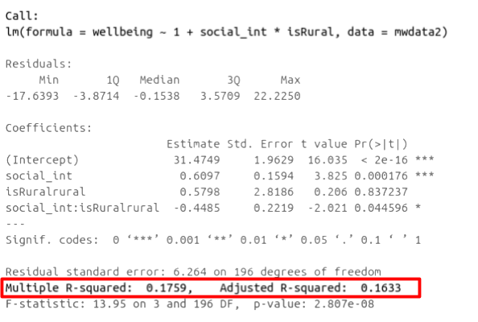

```{r setup, include=FALSE}
source('assets/setup.R')
library(tidyverse)
library(patchwork)
```

:::red
**Preliminaries**  

1. Open Rstudio, make sure you have the USMR project open, and create a new RMarkdown document (giving it a title for this week). 

:::

# Exercises: Interactions  

## ~ Numeric * Categorical

`r qbegin("A1")`  
Reseachers have become interested in how the number of social interactions might influence mental health and wellbeing differently for those living in rural communities compared to those in cities and suburbs. They want to assess whether the effect of social interactions on wellbeing _is moderated by_ (depends upon) whether or not a person lives in a rural area.  

load the **tidyverse** package read in the wellbeing data into R.  
The data is available at https://uoepsy.github.io/data/wellbeing.csv.    

Count the number of respondents in each location (City/Location/Rural).   

**Open-ended:** Do you think there is enough data to answer this question?
`r qend()`
`r solbegin(show=params$SHOW_SOLS, toggle=params$TOGGLE)`
```{r}
library(tidyverse)
mwdata <- read_csv("https://uoepsy.github.io/data/wellbeing.csv")

mwdata %>% count(location)
```

+ We have only 7 respondents who are from a rural location, and 25 from the city & suburbs. Intuitively, this doesn't seem very many to rely on as representative of the population of those living in rural areas in Edinburgh & Lothians. Another thing to think about is that we probably don't expect _large_ differences between rural and city dwellers in the effect of social interaction on wellbeing (i.e., we might not expect differences in these sub-groups to be stronger than the overall relationship between social interaction and wellbeing).  
`r solend()`

:::frame
> **Research Question:** 
> Does the relationship between number of social interactions and mental wellbeing differ between rural and non-rural residents?  

To investigate how the relationship between the number of social interactions and mental wellbeing might be different for those living in rural communities, the researchers conduct a new study, collecting data from 200 randomly selected residents of the Edinburgh & Lothian postcodes. 

`r optbegin("Wellbeing/Rurality data codebook", olabel=FALSE)`  

__Download link__

The data is available at https://uoepsy.github.io/data/wellbeing_rural.csv.  

__Description__

From the Edinburgh & Lothians, 100 city/suburb residences and 100 rural residences were chosen at random and contacted to participate in the study. The Warwick-Edinburgh Mental Wellbeing Scale (WEMWBS), was used to measure mental health and well-being. 
Participants filled out a questionnaire including items concerning: estimated average number of hours spent outdoors each week, estimated average number of social interactions each week (whether on-line or in-person), whether a daily routine is followed (yes/no). For those respondents who had an activity tracker app or smart watch, they were asked to provide their average weekly number of steps.  
  
The data in `wellbeing_rural.csv` contain seven attributes collected from a random sample of $n=200$ hypothetical residents over Edinburgh & Lothians, and include:  

- `wellbeing`: Warwick-Edinburgh Mental Wellbeing Scale (WEMWBS), a self-report measure of mental health and well-being. The scale is scored by summing responses to each item, with items answered on a 1 to 5 Likert scale. The minimum scale score is 14 and the maximum is 70.  
- `outdoor_time`: Self report estimated number of hours per week spent outdoors  
- `social_int`: Self report estimated number of social interactions per week (both online and in-person)
- `routine`: Binary 1=Yes/0=No response to the question "Do you follow a daily routine throughout the week?"
- `location`: Location of primary residence (City, Suburb, Rural)
- `steps_k`: Average weekly number of steps in thousands (as given by activity tracker if available)
- `age`: Age in years of respondent

__Preview__

The first six rows of the data are:

```{r echo=FALSE}
read_csv('https://uoepsy.github.io/data/wellbeing_rural.csv') %>% head %>% gt::gt()
```
  
`r optend()`

:::

`r qbegin("A2")`
Specify a multiple regression model to answer the research question.  
Read in the data, and assign it the name `mwdata2`. Then fully explore the variables and relationships which are going to be used in your analysis.   


> "Except in special circumstances, a model including a product term for interaction between two explanatory variables should also include terms with each of the explanatory variables individually, even though their coefficients may not be significantly different from zero. Following this rule avoids the logical inconsistency of saying that the effect of $X_1$ depends on the level of $X_2$ but that there is no effect of $X_1$."  
> @Ramsey2012

---
 
+ **Tip 1:** Install the `psych` package (remember to use the console, not your script to install packages), and then load it (load it in your script/Rmarkdown). The `pairs.panels()` function from this package will plot all variables in a dataset against one another. This will save you the time you would have spent creating individual plots.  
+ **Tip 2:** Check the "location" variable. It currently has three levels (Rural/Suburb/City), but we only want two (Rural/Not Rural). You'll need to fix this. One way to do this would be to use `ifelse()` to define a variable which takes one value ("Rural") if the observation meets from some condition, or another value ("Not Rural") if it does not. Type `?ifelse` in the **console** if you want to see the help function. You can use it to add a new variable either inside `mutate()`, or using `data$new_variable_name <- ifelse(test, x, y)` syntax.  

`r qend()`
`r solbegin(show=params$SHOW_SOLS, toggle=params$TOGGLE)`
To address the research question, we are going to fit the following model, where $y$ = wellbeing; $x_1$ = weekly outdoor time; and $x_2$ = whether or not the respondent lives in a rural location or not. 
$$
y = \beta_0 + \beta_1 \cdot x_1 + \beta_2 \cdot x_2 + \beta_3 \cdot x_1 \cdot x_2 + \epsilon \\ 
\quad \\ \text{where} \quad \epsilon \sim N(0, \sigma) \text{ independently}
$$

First we read in the data, and take a quick look at our variables:
```{r}
mwdata2 <- read_csv("https://uoepsy.github.io/data/wellbeing_rural.csv")
summary(mwdata2)
```

First let's create a new variable for Rural/Not Rural
```{r}
mwdata2 <- 
  mwdata2 %>% 
  mutate(
    isRural = ifelse(location == "rural", "rural","not rural")
  )
```

Now let's use `psych::pairs.panels()` function.  
We could use it on the whole dataset, but for now we'll just do it on the variables we're interested in:
```{r}
library(psych)
pairs.panels(mwdata2 %>% select(wellbeing, social_int, isRural))
```
`r solend()`

`r qbegin("A3")`
Produce a visualisation of the relationship between weekly number of social interactions and well-being, with separate _facets_ for rural vs non-rural respondents. 
`r qend()`
`r solbegin(show=params$SHOW_SOLS, toggle=params$TOGGLE)`
```{r}
ggplot(data = mwdata2, aes(x = social_int, y = wellbeing)) + 
  geom_point() + 
  facet_wrap(~isRural)
```
`r solend()`

`r qbegin("A4")`
Fit your model using `lm()`.   

**Hint:** When fitting a regression model in R with two explanatory variables A and B, and their interaction, these two are equivalent:  

+ y ~ A + B + A:B
+ y ~ A*B  

`r qend()`
`r solbegin(show=params$SHOW_SOLS, toggle=params$TOGGLE)`
```{r}
rural_mod <- lm(wellbeing ~ 1 + social_int * isRural, data = mwdata2)
```
`r solend()`

:::frame
__Interpreting coefficients for A and B in the presence of an interaction A:B__   

When you include an interaction between $x_1$ and $x_2$ in a regression model, you are estimating the extent to which the effect of $x_1$ on $y$ is different across the values of $x_2$.  

What this means is that the effect of $x_1$ on $y$ *depends on/is conditional upon* the value of $x_2$.  
(and vice versa, the effect of $x_2$ on $y$ is different across the values of $x_1$).   
This means that we can no longer talk about the "effect of $x_1$ _holding $x_2$ constant_". Instead we can talk about a _marginal effect_ of $x_1$ on $y$ at a specific value of $x_2$. 

:::red
When we fit the model $y = \beta_0 + \beta_1\cdot x_1 + \beta_2 \cdot x_2 + \beta_3 \cdot x_1 \cdot x_2 + \epsilon$ using `lm()`:  

- the parameter estimate $\hat \beta_1$ is the _marginal effect_ of $x_1$ on $y$ where $x_2 = 0$  
- the parameter estimate $\hat \beta_2$ is the _marginal effect_ of $x_2$ on $y$ where $x_1 = 0$  
:::

<div style="margin-left: 15px">
<small>
__side note:__ Regardless of whether or not there is an interaction term in our model, all parameter estimates in multiple regression are "conditional" in the sense that they are dependent upon the inclusion of other variables in the model. For instance, in $y = \beta_0 + \beta_1 x_1 + \beta_2 x_2 + \epsilon$ the coefficient $\hat \beta_1$ is conditional upon holding $x_2$ constant. 
</small>
</div>

:::

:::frame
__Interpreting the interaction term A:B__  

The coefficient for an interaction term can be thought of as providing an _adjustment to the slope._   
  
In our model: $\text{wellbeing} = \beta_0 + \beta_1\cdot\text{social-interactions} + \beta_2\cdot\text{isRural} + \beta_3\cdot\text{social-interactions}\cdot\text{isRural} + \epsilon$, we have a numeric*categorical interaction.  
The estimate $\hat \beta_3$ is the adjustment to the slope $\hat \beta_1$ to be made for the individuals in the $\text{isRural}=1$ group. 

:::


`r qbegin("A5")`  
Look at the parameter estimates from your model, and write a description of what each one corresponds to on the plot shown in Figure \@ref(fig:plot-annotate-int) (it may help to sketch out the plot yourself and annotate it).  

> "The best method of communicating findings about the presence of significant interaction may be to present a table of graph of the estimated means at various combinations of the interacting variables."    
> @Ramsey2012  


```{r plot-annotate-int, echo=FALSE, fig.cap="Multiple regression model: Wellbeing ~ Social Interactions * is Rural<br><small>Note that the dashed lines represent predicted values below the minimum observed number of social interactions, to ensure that zero on the x-axis is visible</small>"}
nd = expand_grid(social_int=0:13,isRural=c("rural","not rural"))
nd = nd %>% mutate(wellbeing = predict(rural_mod, newdata = .))
sjPlot::plot_model(rural_mod, type="int")+
  scale_fill_manual(NULL, values=c(NA,NA))+xlim(0,28)+
  geom_line(inherit.aes=FALSE,data=nd,aes(x=social_int,col=isRural,y=wellbeing), lty="longdash")+
  scale_x_continuous(expand = c(0, 0)) + scale_y_continuous(expand = c(0, 1))
```

`r optbegin("Hints", olabel=FALSE)`
Here are some options to choose from:

+ The point at which the blue line cuts the y-axis (where social_int = 0)
+ The point at which the red line cuts the y-axis (where social_int = 0)
+ The average vertical distance between the red and blue lines. 
+ The vertical distance from the blue to the red line _at the y-axis_ (where social_int = 0)
+ The vertical distance from the red to the blue line _at the y-axis_ (where social_int = 0)
+ The vertical distance from the blue to the red line _at the center of the plot_
+ The vertical distance from the red to the blue line _at the center of the plot_
+ The slope (vertical increase on the y-axis associated with a 1 unit increase on the x-axis) of the blue line
+ The slope of the red line
+ How the slope of the line changes when you move from the blue to the red line
+ How the slope of the line changes when you move from the red to the blue line
`r optend()`

`r qend()`
`r solbegin(show=params$SHOW_SOLS, toggle=params$TOGGLE)`
We can obtain our parameter estimates using various functions such as `summary(rural_mod)`,`coef(rural_mod)`, `coefficients(rural_mod)` etc. 

```{r}
coefficients(rural_mod)
```


+ $\hat \beta_0$ = `(Intercept)` = `r round(coef(rural_mod)[1],2)`: The point at which the blue line cuts the y-axis (where social_int = 0).  
+ $\hat \beta_1$ = `social_int` = `r round(coef(rural_mod)[2],2)`: The slope (vertical increase on the y-axis associated with a 1 unit increase on the x-axis) of the blue line.
+ $\hat \beta_2$ = `isRuralrural` = `r round(coef(rural_mod)[3],2)`: The vertical distance from the blue to the red line _at the y-axis_ (where social_int = 0).  
+ $\hat \beta_3$ = `social_int:isRuralrural` = `r round(coef(rural_mod)[4],2)`: How the slope of the line changes when you move from the blue to the red line. 

`r solend()`

`r qbegin("A6")`
Load the __sjPlot__ package and try using the function `plot_model()`.  
The default behaviour of `plot_model()` is to plot the parameter estimates and their confidence intervals. This is where `type = "est"`. 
Try to create a plot like Figure \@ref(fig:plot-annotate-int), which shows the two lines (**Hint:** what are this weeks' exercises all about? `type = ???`.)
`r qend()`
`r solbegin(show=params$SHOW_SOLS, toggle=params$TOGGLE)`
```{r}
library(sjPlot)
plot_model(rural_mod, type="int")
```
`r solend()`

---

## ~ Numeric * Numeric  

We will now look at a multiple regression model with an interaction betweeen two numeric explanatory variables.

> **Research question**   
> Previous research has identified an association between an individual's perception of their social rank and symptoms of depression, anxiety and stress. We are interested in the individual differences in this relationship.  
Specifically: 
> 
> + Does the effect of social comparison on symptoms of depression, anxiety and stress vary depending on level of neuroticism?
>  

`r optbegin("Social Comparison Study data codebook", olabel=FALSE)`  

__Download link__

The data is available at https://uoepsy.github.io/data/scs_study.csv

__Description__

Data from 656 participants containing information on scores on each trait of a Big 5 personality measure, their perception of their own social rank, and their scores on a measure of depression.  

The data in `scs_study.csv` contain seven attributes collected from a random sample of $n=656$ participants: 

- `zo`: Openness (Z-scored), measured on the Big-5 Aspects Scale (BFAS)
- `zc`: Conscientiousness (Z-scored), measured on the Big-5 Aspects Scale (BFAS)
- `ze`: Extraversion (Z-scored), measured on the Big-5 Aspects Scale (BFAS)
- `za`: Agreeableness (Z-scored), measured on the Big-5 Aspects Scale (BFAS)
- `zn`: Neuroticism (Z-scored), measured on the Big-5 Aspects Scale (BFAS)
- `scs`: Social Comparison Scale - An 11-item scale that measures an individual’s perception of their social rank, attractiveness and belonging relative to others. The scale is scored as a sum of the 11 items (each measured on a 5-point scale), with higher scores indicating more favourable perceptions of social rank.
- `dass`: Depression Anxiety and Stress Scale - The DASS-21 includes 21 items, each measured on a 4-point scale. The score is derived from the sum of all 21 items, with higher scores indicating higher a severity of symptoms.  

__Preview__

The first six rows of the data are:

```{r echo=FALSE}
read_csv('https://uoepsy.github.io/data/scs_study.csv') %>% head %>% gt::gt()
```
  
`r optend()`
:::frame
__Refresher: Z-scores__

When we __standardise__ a variable, we re-express each value as the distance from the mean _in units of standard deviations._ These transformed values are called __z-scores.__  

To transform a given value $x_i$ into a __z-score__ $z_i$, we simply calculate the distance from $x_i$ to the mean, $\bar{x}$, and divide this by the standard deviation, $s$:    
$$
z_i = \frac{x_i - \bar{x}}{s}
$$

A Z-score of a value is the number of standard deviations below/above the mean that the value falls.  

:::

`r qbegin("A7")`
Specify the model you plan to fit in order to answer the research question (e.g., $\text{??} = \beta_0 + \beta_1 \cdot \text{??} + .... + \epsilon$)
`r qend()`
`r solbegin(show=params$SHOW_SOLS, toggle=params$TOGGLE)`
$$
\text{DASS-21 Score} = \beta_0 + \beta_1 \cdot \text{SCS Score} + \beta_2 \cdot \text{Neuroticism} + \beta_3 \cdot \text{SCS score} \cdot \text{Neuroticism} + \epsilon
$$
`r solend()`

`r qbegin("A8")`
Read in the data and assign it the name `scs_study`. Produce plots of the relevant distributions and relationships involved in the analysis. 
`r qend()`
`r solbegin(show=params$SHOW_SOLS, toggle=params$TOGGLE)`
```{r}
scs_study <- read_csv("https://uoepsy.github.io/data/scs_study.csv")
summary(scs_study)
```

```{r}
ggplot(data = scs_study, aes(x=dass)) + 
  geom_density() + 
  geom_boxplot(width = 1/50) +
  labs(title="Marginal distribution of DASS-21 Scores", 
       x = "Depression Anxiety and Stress Scale", y = "Probability density")
```

:::int 
The marginal distribution of scores on the Depression, Anxiety and Stress Scale (DASS-21) is unimodal with a mean of approximately `r round(mean(scs_study$dass))` and a standard deviation of `r round(sd(scs_study$dass))`. 
:::


```{r}
ggplot(data = scs_study, aes(x=scs)) + 
  geom_density() + 
  geom_boxplot(width = 1/50) +
  labs(title="Marginal distribution of Social Comparison Scale (SCS) scores", 
       x = "Social Comparison Scale Score", y = "Probability density")
```

:::int 
The marginal distribution of score on the Social Comparison Scale (SCS) is unimodal with a mean of approximately `r round(mean(scs_study$scs))` and a standard deviation of `r round(sd(scs_study$scs))`. There look to be a number of outliers at the upper end of the scale. 
:::


```{r}
ggplot(data = scs_study, aes(x=zn)) + 
  geom_density() + 
  geom_boxplot(width = 1/50) +
  labs(title="Marginal distribution of Neuroticism (Z-Scored)", 
       x = "Neuroticism (Z-Scored)", y = "Probability density")
```

:::int 
The marginal distribution of Neuroticism (Z-scored) is positively skewed, with the 25\% of scores falling below `r round(quantile(scs_study$zn, .25),2)`, 75\% of scores falling below `r round(quantile(scs_study$zn, .75),2)`.
:::


```{r}
library(patchwork) # for arranging plots side by side
library(knitr) # for making tables look nice

p1 <- ggplot(data = scs_study, aes(x=scs, y=dass)) + 
  geom_point()+
  labs(x = "SCS", y = "DASS-21")

p2 <- ggplot(data = scs_study, aes(x=zn, y=dass)) + 
  geom_point()+
  labs(x = "Neuroticism", y = "DASS-21")

p1 | p2

# the kable() function from the knitr package can make table outputs print nicely into html.
scs_study %>%
  select(dass, scs, zn) %>%
  cor %>% 
  kable
```

:::int
There is a weak, negative, linear relationship between scores on the Social Comparison Scale and scores on the Depression Anxiety and Stress Scale for the participants in the sample. Severity of symptoms measured on the DASS-21 tend to decrease, on average, the more favourably participants view their social rank.  
There is a weak, positive, linear relationship between the levels of Neuroticism and scores on the DASS-21. Participants who are more neurotic tend to, on average, display a higher severity of symptoms of depression, anxiety and stress.  
:::

`r solend()`

`r qbegin("A9")`
Run the code below. It takes the dataset, and uses the `cut()` function to add a new variable called "zn_group", which is the "zn" variable split into 4 groups.  
<div style="margin-left:15px">
_Remember:_ we have re-assign this output as the name of the dataset (the `scs_study <- ` bit at the beginning) to make these changes occur in our __environment__ (the top-right window of Rstudio). If we didn't have the first line, then it would simply print the output.   
</div>

```{r}
scs_study <-
  scs_study %>%
  mutate(
    zn_group = cut(zn, 4)
  )
```

We can see how it has split the "zn" variable by plotting the two against one another:  
(Note that the levels of the new variable are named according to the cut-points).
```{r}
ggplot(data = scs_study, aes(x = zn_group, y = zn)) + 
  geom_point()
```

Plot the relationship between scores on the SCS and scores on the DASS-21, _for each group of the variable we just created._  
How does the pattern change? Does it suggest an interaction?  

**Tip:** Rather than creating four separate plots, you might want to map some feature of the plot to the variable we created in the data, or make use of `facet_wrap()`/`facet_grid()`.  
`r qend()`
`r solbegin(show=params$SHOW_SOLS, toggle=params$TOGGLE)`
```{r}
ggplot(data = scs_study, aes(x = scs, y = dass, col = zn_group)) + 
  geom_point() + 
  facet_grid(~zn_group) +
  theme(legend.position = "none") # remove the legend
```

The relationship between SCS scores and DASS-21 scores appears to be different between these groups. For those with a relatively high neuroticism score, the relationship seems stronger, while for those with a low neuroticism score there is almost no discernable relationship. 
This suggests an interaction - the relationship of DASS-21 ~ SCS differs across the values of neuroticism! 
`r solend()`

:::frame

Cutting one of the explanatory variables up into groups essentially turns a numeric variable into a categorical one. We did this just to make it easier to visualise how a relationship changes across the values of another variable, because we can imagine a separate line for the relationship between SCS and DASS-21 scores for each of the groups of neuroticism. However, in grouping a numeric variable like this we lose information. Neuroticism is measured on a continuous scale, and we want to capture how the relationship between SCS and DASS-21 changes across that continuum (rather than cutting it into chunks).   
We could imagine cutting it into more and more chunks (see Figure \@ref(fig:reglinescut)), until what we end up with is a an infinite number of lines - i.e., a three-dimensional plane/surface (recall that in for a multiple regression model with 2 explanatory variables, we can think of the model as having three-dimensions). The inclusion of the interaction term simply results in this surface no longer being necessarily flat. You can see this in Figure \@ref(fig:3dint). 
 
```{r reglinescut, echo=FALSE, fig.cap="Separate regression lines DASS ~ SCS for neuroticism when cut into 4 (left) or 6 (center) or 12 (right) groups", out.width="80%"}
p1 <- ggplot(data = scs_study, aes(x = scs, y = dass, col = zn_group)) + 
  geom_point(alpha=.1) + 
  stat_smooth(method="lm",se=FALSE)+theme(legend.position = "none")

scs_study %>%
  mutate(
    zn_group = cut(zn, 6)
  ) %>% ggplot(data = ., aes(x = scs, y = dass, col = zn_group)) + 
  geom_point(alpha=.1) + 
  stat_smooth(method="lm",se=FALSE)+theme(legend.position = "none") -> p2

scs_study %>%
  mutate(
    zn_group = cut(zn, 12)
  ) %>% ggplot(data = ., aes(x = scs, y = dass, col = zn_group)) + 
  geom_point(alpha=.1) + 
  stat_smooth(method="lm",se=FALSE)+theme(legend.position = "none") -> p3

p1 | p2 | p3
```


```{r include=FALSE, echo=FALSE}
fit<-lm(dass ~ scs*zn, data = scs_study)
steps=50
scs <- with(scs_study, seq(min(scs),max(scs),length=steps))
zn <- with(scs_study, seq(min(zn),max(zn),length=steps))
newdat <- expand.grid(scs=scs, zn=zn)
dass <- matrix(predict(fit, newdat), steps, steps)
p <- persp(scs,zn,dass, theta = -25,phi=5, col = NA)
```


```{r 3dint, echo=FALSE, fig.cap="3D plot of regression surface with interaction. You can explore the plot in the figure below from different angles by moving it around with your mouse."}
library(plotly)
plot_ly(x=scs,y=zn,z=dass, type="surface") %>% layout(
    scene = list(
      xaxis = list(title = "SCS"),
      yaxis = list(title = "Neuroticism"),
      zaxis = list(title = "DASS-21")
    ))
```

:::


`r qbegin("A10")`
Fit your model using `lm()`. 
`r qend()`
`r solbegin(show=params$SHOW_SOLS, toggle=params$TOGGLE)`
```{r}
dass_mdl <- lm(dass ~ 1 + scs*zn, data = scs_study)
summary(dass_mdl)
```
`r solend()`

`r qbegin("A11")`
```{r echo=FALSE}
summary(dass_mdl)$coefficients %>% kable %>%
  kableExtra::row_spec(1:3, bold = T)
```

Recall that the coefficients `zn` and `scs` from our model now reflect the estimated change in the outcome associated with an increase of 1 in the explanatory variables, _when the other variable is zero._  

**Think** - what is 0 in each variable? what is an increase of 1? Are these meaningful? Would you suggest recentering either variable?
`r qend()`
`r solbegin(show=params$SHOW_SOLS, toggle=params$TOGGLE)`
The neuroticism variable `zn` is Z-scored, which means that 0 is the mean (it is mean-centered), and 1 is a standard deviation.   
  
The Social Comparison Scale variable `scs` is the raw-score. Looking back at the description of the variables, we can work out that the minimum possible score is 11 (if people respond 1 for each of the 11 questions) and the maximum is 55 (if they respond 5 for all questions). Is it meaningful/useful to talk about estimated effects for people who score 0? Not really.  

But we can make it so that zero represents something else, such as the minimum score, or the mean score. For instance, `scs_study$scs - 11` will subtract 11 from the scores, making zero the minimum possible score on the scale.  

`r solend()`

`r qbegin("A12")`
Recenter one or both of your explanatory variables to ensure that 0 is a meaningful value
`r qend()`
`r solbegin(show=params$SHOW_SOLS, toggle=params$TOGGLE)`
We're going to mean-center the scores on the SCS. Think about what someone who now scores zero on the `zn` variable *and* zero on the mean-centered SCS?  
```{r}
scs_study <-
  scs_study %>%
  mutate(
    scs_mc = scs - mean(scs)
  )
```
`r solend()`

`r qbegin("A13")`
We re-fit the model using mean-centered SCS scores instead of the original variable. Here are the parameter estimates: 
```{r}
dass_mdl2 <- lm(dass ~ 1 + scs_mc * zn, data = scs_study)

# pull out the coefficients from the summary():
summary(dass_mdl2)$coefficients
```

Fill in the blanks in the statements below. 

:::int 
  
+ For those of average neuroticism and who score average on the SCS, the estimated DASS-21 Score is **???**  
+ For those who who score **???** on the SCS, an increase of **???** in neuroticism is associated with a change of `r round(coef(dass_mdl2)[3],2)` in DASS-21 Scores
+ For those of average neuroticism, an increase of **???** on the SCS is associated with a change of `r round(coef(dass_mdl2)[2],2)` in DASS-21 Scores  
+ For every increase of **???** in neuroticism, the change in DASS-21 associated with an increase of **???** on the SCS is asjusted by **???**
+ For every increase of **???** in SCS, the change in DASS-21 associated with an increase of **???** in neuroticism is asjusted by **???**
  
:::

`r qend()`
`r solbegin(show=params$SHOW_SOLS, toggle=params$TOGGLE)`

:::int 
  
+ For those of average neuroticism and who score average on the SCS, the estimated DASS-21 Score is **`r round(coef(dass_mdl2)[1],2)`**  
+ For those who who score **average (mean)** on the SCS, an increase of **1 standard deviation** in neuroticism is associated with a change of `r round(coef(dass_mdl2)[3],2)` in DASS-21 Scores
+ For those of average neuroticism, an increase of **1** on the SCS is associated with a change of `r round(coef(dass_mdl2)[2],2)` in DASS-21 Scores  
+ For every increase of **1 standard deviation** in neuroticism, the change in DASS-21 associated with an increase of **1** on the SCS is asjusted by **`r round(coef(dass_mdl2)[4],2)`**
+ For every increase of **1** in SCS, the change in DASS-21 associated with an increase of **1 standard deviation** in neuroticism is asjusted by **`r round(coef(dass_mdl2)[4],2)`**
  
:::

`r solend()`


# Exercises: Assumptions 

`r qbegin("B1")`
Create a new section header in your Rmarkdown document, as we are moving onto check assumptions.  

1. You will have just fitted the following interaction model:
    - $\text{DASS-21 Score} = \beta_0 + \beta_1 \cdot \text{SCS Score} + \beta_2 \cdot \text{Neuroticism} + \beta_3 \cdot \text{SCS score} \cdot \text{Neuroticism} + \epsilon$ 
2. Check that your model meets the assumptions of the linear model (**Tip:** to get a broad overview you can pass your model to the `plot()` function to get a series of plots). 
3. If you notice any violated assumptions:  
    - address the issues by, e.g., excluding observations from the analysis, or replacing outliers with the next most extreme value (*Winsorisation*). 
    - after fitting a new model which you hope addresses violations, you need to check **all** of your assumptions again. It can be an iterative process, and the most important thing is that your _final_ model (the one you plan to **use**) meets all the assumptions.  

--- 

**Tips:** 

+ When there is an interaction in the model, assessing linearity becomes difficult. In fact, `crPlots()` will not work. To assess, you can create a residuals-vs-fitted plot like we saw in previous labs.  
+ Interaction terms often result in multicollinearity, because these terms are made up of the product of some 'main effects'. Mean-centering the variables like we have here will reduce this source of structural multicollinearity ("structural" here refers to the fact that multicollinearity is due to our model specification, rather than the data itself)  
+ You can fit a model and exclude specific observations. For instance, to remove the 3rd and 5th rows of the dataset: `lm(y ~ x1 + x2, data = dataset[-c(3,5),])`. Be careful to remember that these values remain in the dataset, they have simply been excluded from the model fit.  

`r qend()`
`r solbegin(show=params$SHOW_SOLS, toggle=params$TOGGLE)`

Recall our model: We're going to mean-center the `scs` variable from the outset. 
```{r eval=FALSE}
dass_mdl2 <- lm(dass ~ 1 + scs_mc * zn, data = scs_study)
plot(dass_mdl2)
```

```{r echo=FALSE}
dass_mdl2 <- lm(dass ~ 1 + scs_mc * zn, data = scs_study)
par(mfrow=c(2,2))
plot(dass_mdl2)
par(mfrow=c(1,1))
```

From quick visual inspection, it looks like there is at least one very influential point, which has been labelled for us as case number 35. 

```{r}
scs_study[35,]
```

The code below fits a new model and assigns it the name `dass_mdl3`. How is it different from the previous model?  

```{r}
dass_mdl3 <- lm(dass ~ 1 + scs_mc * zn, data = scs_study[-35, ])
```

Does this new model meet the assumptions of multiple regression?  

__Linearity__
```{r}
plot(dass_mdl3, which = 1)
```


__Equal variances (Homoscedasticity)__
```{r}
library(car)
residualPlots(dass_mdl3)
ncvTest(dass_mdl3)
```

__Independence of errors__
```{r}
# we assume independence of observations was considered during study design (e.g., participants are not related, or influence one another in some way). We can test for autocorrelation:
durbinWatsonTest(dass_mdl3)
```

__Normality__
```{r}
hist(residuals(dass_mdl3))
shapiro.test(residuals(dass_mdl3))
```


__Check for multicollinearity__
```{r}
vif(dass_mdl3)
```

`r solend()`


# Exercises: Model Fit and Model Comparison  

## Model Fit 

:::frame
### Adjusted $R^2$  

We know from our work on simple linear regression that the R-squared can be obtained as:
$$
R^2 = \frac{SS_{Model}}{SS_{Total}} = 1 - \frac{SS_{Residual}}{SS_{Total}}
$$

However, when we add more and more predictors into a multiple regression model, $SS_{Residual}$ cannot increase, and may decrease by pure chance alone, even if the predictors are unrelated to the outcome variable. Because $SS_{Total}$ is constant, the calculation $1-\frac{SS_{Residual}}{SS_{Total}}$ will increase by chance alone. 

An alternative, the Adjusted-$R^2$, does not necessarily increase with the addition of more explanatory variables, by including a penalty according to the number of explanatory variables in the model. It is not by itself meaningful, but can be useful in determining what predictors to include in a model. 
$$
Adjusted{-}R^2=1-\frac{(1-R^2)(n-1)}{n-k-1} \\
\quad \\
\begin{align}
& \text{Where:} \\
& n = \text{sample size} \\
& k = \text{number of explanatory variables} \\
\end{align}
$$

---

**In R,** you can view the mutiple and adjusted $R^2$ at the bottom of the output of `summary(<modelname>)`:

```{r mlroutputrsq, echo=FALSE, fig.cap="Multiple regression output in R, summary.lm(). R-squared highlighted",fig.align = 'left'}

```

:::  

:::frame  
### F-ratio  

As in simple linear regression, the F-ratio is used to test the null hypothesis that all regression slopes are zero.  

It is called the F-ratio because it is the ratio of the how much of the variation is explained by the model (per paramater) versus how much of the variation is unexplained (per remaining degrees of freedom). 

$$
F_{df_{model},df_{residual}} = \frac{MS_{Model}}{MS_{Residual}} = \frac{SS_{Model}/df_{Model}}{SS_{Residual}/df_{Residual}} \\
\quad \\
\begin{align}
& \text{Where:} \\
& df_{model} = k \\
& df_{error} = n-k-1 \\
& n = \text{sample size} \\
& k  = \text{number of explanatory variables} \\
\end{align}
$$

---

**In R,** at the bottom of the output of `summary(<modelname>)`, you can view the F ratio, along with an hypothesis test against the alternative hypothesis that the at least one of the coefficients $\neq 0$ (under the null hypothesis that all coefficients = 0, the ratio of explained:unexplained variance should be approximately 1):

```{r mlroutputrf, echo=FALSE, fig.cap="Multiple regression output in R, summary.lm(). F statistic highlighted", fig.align = 'left'}
knitr::include_graphics("images/mlroutputf.png")
```
  
:::


`r qbegin("C1")`
Run the code below. It reads in the wellbeing/rurality study data, and creates a new binary variable which specifies whether or not each participant lives in a rural location.  

```{r}
library(tidyverse)
mwdata2<-read_csv("https://uoepsy.github.io/data/wellbeing_rural.csv")
mwdata2 <- 
  mwdata2 %>% mutate(
  isRural = ifelse(location=="rural","rural","notrural")
)
```


Fit the following model, and assign it the name "wb_mdl1".

+ $\text{Wellbeing} = \beta_0 + \beta_1 \cdot \text{Social Interactions} + \beta_2 \cdot \text{IsRural} + \epsilon$  

Does the model provide a better fit to the data than a model with no explanatory variables? (i.e., test against the alternative hypothesis that at least one of the explanatory variables significantly predicts wellbeing scores). 

`r qend()`
`r solbegin(show=params$SHOW_SOLS, toggle=params$TOGGLE)`

```{r}
wb_mdl1 <- lm(wellbeing ~ social_int + isRural, data=mwdata2)
summary(wb_mdl1)
```

:::int
```{r echo=FALSE}
mdl1<-wb_mdl1
```
Weekly social interactions and location (rural vs not rural) explained `r paste0(round(summary(mdl1)$adj.r.squared*100,1),"%")` of the variance (adjusted $R^2$ =`r round(summary(mdl1)$adj.r.squared,3)`, $F$(`r paste(summary(mdl1)$fstatistic[2:3],collapse=",")`)=`r round(summary(mdl1)$fstatistic,1)[1]`, p`r map_chr(pf(summary(mdl1)$fstatistic[1],summary(mdl1)$fstatistic[2],summary(mdl1)$fstatistic[3], lower.tail = FALSE), ~ifelse(.<001,"<.001",paste0("=",round(.,2))))`)
:::
  
`r solend()`


## Model Comparison 


:::frame
### Incremental F-test  

:::yellow
If (*and only if*) two models are __nested__ (one model contains all the predictors of the other and is fitted to the same data), we can compare them using an __incremental F-test.__  

This is a formal test of whether the additional predictors provide a better fitting model.  
Formally this is the test of:  

+ $H_0:$ coefficients for the added/ommitted variables are all zero.
+ $H_1:$ at least one of the added/ommitted variables has a coefficient that is not zero. 
:::

The F-ratio for comparing the residual sums of squares between two models can be calculated as:

$$
F_{(df_R-df_F),df_F} = \frac{(SSR_R-SSR_F)/(df_R-df_F)}{SSR_F / df_F} \\
\quad \\
\begin{align}
& \text{Where:} \\
& SSR_R = \text{residual sums of squares for the restricted model} \\
& SSR_F = \text{residual sums of squares for the full model} \\
& df_R = \text{residual degrees of freedom from the restricted model} \\
& df_F = \text{residual degrees of freedom from the full model} \\
\end{align}
$$

---

**In R,** we can conduct an incremental F-test by constructing two models, and passing them to the `anova()` function: `anova(model1, model2)`. 

:::


`r qbegin("C2")`
The F-ratio you see at the bottom of `summary(model)` is actually a comparison between two models: your model (with some explanatory variables in predicting $y$) and __the null model.__ In regression, the null model can be thought of as the model in which all explanatory variables have zero regression coefficients. It is also referred to as the __intercept-only model__, because if all predictor variable coefficients are zero, then the only we are only estimating $y$ via an intercept (which will be the mean - $\bar y$).  

Use the code below to fit the null model.  
Then, use the `anova()` function to perform a model comparison between your earlier model (**wb_mdl1**) and the null model.  
Check that the F statistic is the same as that which is given at the bottom of `summary(wb_mdl1)`.  

```{r}
null_model <- lm(wellbeing ~ 1, data = mwdata2)
```

`r qend()`
`r solbegin(show=params$SHOW_SOLS, toggle=params$TOGGLE)`

```{r}
# fit the null model
null_model <- lm(wellbeing ~ 1, data = mwdata2)

# model comparison null vs wb_mdl1
anova(null_model, wb_mdl1)

# extract f statistic from summary of wb_mdl1
summary(wb_mdl1)$fstatistic
# we can retrieve the p-value:
fstat = summary(wb_mdl1)$fstatistic[1]
df_1 = summary(wb_mdl1)$fstatistic[2]
df_2 = summary(wb_mdl1)$fstatistic[3]
pf(fstat, df_1, df_2, lower.tail = FALSE)
```
`r solend()`


`r qbegin("A3")`
Does weekly outdoor time explain a significant amount of variance in wellbeing scores over and above weekly social interactions and location (rural vs not-rural)?  

Provide an answer to this question by fitting and comparing two models (one of them you may already have fitted in an earlier question). 

`r qend()`
`r solbegin(show=params$SHOW_SOLS, toggle=params$TOGGLE)`
We can compare the following models which predict wellbeing scores from weekly social interactions and location, with and without weekly outdoor time.  

+ $\text{Wellbeing} = \beta_0 + \beta_1 \cdot \text{Social Interactions} + \beta_2 \cdot \text{IsRural} + \epsilon$ 
+ $\text{Wellbeing} = \beta_0 + \beta_1 \cdot \text{Social Interactions} + \beta_2 \cdot \text{IsRural} + \beta_3 \cdot \text{Outdoor time} +  \epsilon$ 

We have already fitted the first model and assigned it the name `wb_mdl1`.  
We need to fit the second:
```{r}
wb_mdl2 <- lm(wellbeing ~ 1 + social_int + isRural + outdoor_time, data=mwdata2)
```

Let's look at the amount of variation in wellbeing scores explained by each model:
```{r}
summary(wb_mdl1)$adj.r.squared
summary(wb_mdl2)$adj.r.squared
```

The model *with* weekly outdoor time as a predictor explains 30\% of the variance, and the model *without* explains 25\%.  
Does including weekly outdoor time as a predictor provide a significantly better fit of the data (**wb_mdl2** compared to **wb_mdl1**)?  
```{r}
anova(wb_mdl1, wb_mdl2)
```
```{r include=FALSE}
mc <- anova(wb_mdl1, wb_mdl2)
names(mc)[6]<-"p"
```

:::int
Weekly outdoor time was found to explain a significant amount of variance in wellbeing scores over and above weekly social interactions and location (rural vs not-rural)  
$F$(`r paste(mc$Df[2],mc$Res.df[2],collapse=",")`)=`r round(mc$F,2)`, p`r map_chr(mc$p[2], ~ifelse(.<001,"<.001",paste0("=",round(.,2))))`.
:::

`r solend()`


:::frame 
### Incremental validity - A caution  

A common goal for researchers is to determine which variables matter (and which do not) in contributing to some outcome variable. A common approach to answer such questions is to consider whether some variable $X$'s contribution remains significant _after_ controlling for variables $Z$.  

The reasoning:  

+ If our measure of $X$ correlates significantly with outcome $Y$ even when controlling for our measure of $Z$, then $X$ contributes to $y$ *over and above* the contribution of $Z$. 
    
  
In multiple regression, we might fit the model $Y = \beta_0 + \beta_1 \cdot X + \beta_2 \cdot Z + \epsilon$ and conclude that $X$ is a useful predictor of $Y$ *over and above* $Z$ based on the estimate $\hat \beta_1$, or via model comparison between that model and the model without $Z$ as a predictor ($Y = \beta_0 + \beta_1 \cdot X + \epsilon$).  
  
__A Toy Example__
  
Suppose we have monthly data over a seven year period which captures the number of shark attacks on swimmers each month, and the number of ice-creams sold by beach vendors each month.  
Consider the relationship between the two:  
```{r echo=FALSE}
read_csv("https://uoepsy.github.io/data/sharks.csv") %>%
ggplot(.,aes(x=ice_cream_sales,y=shark_attacks))+geom_point()+stat_smooth(method="lm")
```

We can fit the linear model and see a significant relationship between ice cream sales and shark attacks:  
```{r}
sharkdata <- read_csv("https://uoepsy.github.io/data/sharks.csv")
shark_mdl <- lm(shark_attacks ~ ice_cream_sales, data = sharkdata)
summary(shark_mdl)
```

`r qbegin()`
Does the relationship between ice cream sales and shark attacks make sense? What might be missing from our model? 
`r qend()`
`r solbegin(show=TRUE, toggle=FALSE)`
You might quite rightly suggest that this relationship is actually being driven by temperature - when it is hotter, there are more ice cream sales _and_ there are more people swimming (hence more shark attacks). 
`r solend()`


`r qbegin()`
Is $X$ (the number of ice-cream sales) a useful predictor of $Y$ (numbers of shark attacks) over and above $Z$ (temperature)?  
<br>
We might answer this with a multiple regression model including both temperature and ice cream sales as predictors of shark attacks: 
```{r}
shark_mdl2 <- lm(shark_attacks ~ ice_cream_sales + temperature, data = sharkdata)
summary(shark_mdl2)
```
<br>
What do you conclude?

`r qend()`
`r solbegin(show=TRUE, toggle=FALSE)`
It appears that numbers of ice cream sales is _not_ a significant predictor of sharks attack numbers over and above the temperature.  
`r solend()`

__However...__
In psychology, we can rarely observe and directly measure the constructs which we are interested in (for example, personality traits, intelligence, emotional states etc.). We rely instead on measurements of, e.g. behavioural tendencies, as a proxy for personality traits.  

Let's suppose that instead of including temperature in degrees celsius, we asked a set of people to self-report on a scale of 1 to 7 how hot it was that day. This measure should hopefully correlate well with the _actual_ temperature, however, there will likely be some variation: 
```{r echo=FALSE}
ggplot(data = sharkdata, aes(x = temperature, y = sr_heat)) + 
  geom_point() + 
  labs(title = paste0("r = ",round(cor(sharkdata$temperature, sharkdata$sr_heat),2)), 
       x = "actual temperature",y="self report measure of heat")
```

`r qbegin()`
Is $X$ (the number of ice-cream sales) a useful predictor of $Y$ (numbers of shark attacks) over and above $Z$ (temperature - measured on our self-reported heat scale)?  
<br>
```{r}
shark_mdl2a <- lm(shark_attacks ~ ice_cream_sales + sr_heat, data = sharkdata)
summary(shark_mdl2a)
```
<br>
What do you conclude?
`r qend()`

Moral of the story: be considerate of what exactly it is that you are measuring. 
<br>
This example was adapted from [Westfall and Yarkoni, 2020](https://onlinelibrary.wiley.com/doi/full/10.1111/pere.12309) which provides a much more extensive discussion of incremental validity and type 1 error rates. 


:::


:::frame
### AIC & BIC  

We can also compare models using information criterion statistics, such as AIC and BIC. These combine information about the sample size, the number of model parameters and the residual sums of squares ($SS_{residual}$). Models do not need to be nested to be compared via AIC and BIC, but they need to have been fit to the same dataset.  
For both of these fit indices, lower values are better, and both include a penalty for the number of predictors in the model, although BIC's penalty is harsher:

$$
AIC = n\,\text{ln}\left( \frac{SS_{residual}}{n} \right) + 2k \\
\quad \\
BIC = n\,\text{ln}\left( \frac{SS_{residual}}{n} \right) + k\,\text{ln}(n) \\
\quad \\
\begin{align}
& \text{Where:} \\
& SS_{residual} = \text{sum of squares residuals} \\
& n = \text{sample size} \\
& k = \text{number of explanatory variables} \\
& \text{ln} = \text{natural log function} 
\end{align}
$$

---

**In R,** we can calculate AIC and BIC by using the `AIC()` and `BIC()` functions. 

:::


`r qbegin("C4")`
The code below fits 5 different models:

```{r eval=FALSE}
model1 <- lm(wellbeing ~ social_int + outdoor_time, data = mwdata2)
model2 <- lm(wellbeing ~ social_int + outdoor_time + age, data = mwdata2)
model3 <- lm(wellbeing ~ social_int + outdoor_time + routine, data = mwdata2)
model4 <- lm(wellbeing ~ social_int + outdoor_time + routine + age, data = mwdata2)
model5 <- lm(wellbeing ~ social_int + outdoor_time + routine + steps_k, data = mwdata2)
```

For each of the below pairs of models, what methods are/are not available for us to use for comparison and why?  

+ `model1` vs `model2`
+ `model2` vs `model3`
+ `model1` vs `model4`
+ `model3` vs `model5`

`r qend()`
`r solbegin(show=params$SHOW_SOLS, toggle=params$TOGGLE)`

+ `model1` vs `model2`  
  These models are nested - `model2` contains all the variables of `model1` and they are fitted on the same dataset.  
  We can therefore use an F-test, AIC or BIC.  
    
+ `model2` vs `model3`  
  These models are __not__ nested, but they are fitted on the same dataset.  
  We can therefore use AIC or BIC, but we cannot use an F-test.  
    
+ `model1` vs `model4`
  These models are nested - `model4` contains all the variables of `model1` and they are fitted on the same dataset.  
  We can therefore use an F-test, AIC or BIC.  
    
+ `model3` vs `model5`  
  These models are __not__ nested, and they are __not__ fitted on the same dataset. the "steps_k" variable contains missing values, and so these whole rows are excluded from `model5` (but they are included in `model3`). We cannot compare these models.   

`r solend()`

`r qbegin("C5")`
Returning to the data on Big 5 Personality traits, perceptions of social ranks, and depression and anxiety scale scores: 

> **Research question**   
> 
> + Beyond neuroticism and its interaction with social comparison, do other personality traits predict symptoms of depression, anxiety and stress?
>   

Construct and compare multiple regression models to answer this question. Remember to check that your models meet assumptions (for this exercises, a quick eyeball of the diagnostic plots will suffice. Were this an actual research project, you would want to provide a more thorough check, for instance conducting formal tests of the assumptions).  
<br>
Although the solutions are available immediately for this question, we strongly advocate that you attempt it yourself before looking at them. 
`r qend()`
`r solbegin(show=TRUE, toggle=params$TOGGLE)`

We've already done this all earlier, but thus far, we should have read in the data, and mean-centered our social comparison scale scores:
```{r}
scs_study <- read_csv("https://uoepsy.github.io/data/scs_study.csv")
scs_study <- 
  scs_study %>%
  mutate(
    scs_mc = scs - mean(scs)
  )
```

The question is asking whether including a group of predictors (the O, C, E, A personality traits) improves model fit beyond a model with just neuoriticism, social comparison score and their interaction.  

Notice how our initial model has one very influential point, which we will remove:
```{r eval=FALSE}
dass_mod <- lm(dass ~ scs_mc * zn, data = scs_study)
plot(dass_mod)
```
```{r echo=FALSE}
dass_mod <- lm(dass ~ scs_mc * zn, data = scs_study)
par(mfrow=c(2,2))
plot(dass_mod)
par(mfrow=c(1,1))
```

```{r eval=FALSE}
dass_mod <- lm(dass ~ scs_mc * zn, data = scs_study[-35, ])
plot(dass_mod)
```
```{r echo=FALSE}
dass_mod <- lm(dass ~ scs_mc * zn, data = scs_study[-35, ])
par(mfrow=c(2,2))
plot(dass_mod)
par(mfrow=c(1,1))
```

And our full model, with the other personality variables included:
```{r eval=FALSE}
dass_mod2 <- lm(dass ~ scs_mc * zn + zo + zc + ze + za, data = scs_study[-35, ])
plot(dass_mod2)
```
```{r echo=FALSE}
dass_mod2 <- lm(dass ~ scs_mc * zn + zo + zc + ze + za, data = scs_study[-35, ])
par(mfrow=c(2,2))
plot(dass_mod2)
par(mfrow=c(1,1))
```

We can explore the individual coefficients of our full model, and we notice that none of the other personality variables (`zo`, `zc`, `ze`, `za`) significantly predict DASS-21 scores:
```{r}
summary(dass_mod2)
```

However, when we compare the two models, we find that including these predictors does significantly improve model fit. 
```{r}
anova(dass_mod, dass_mod2)
```

This may be a bit confusing - are we saying that none of openness, conscientiousness, agreeableness, or extraversion significantly predict DASS-21 scores, but collectively they do?  
  
This sort of discrepancy can often be the result of multicollinearity. Note that there may be some correlation between the `za` and `ze` variables: 
```{r}
vif(dass_mod2)
```

What may actually be happening here is that one variable is _masking_ the effect of the other. Note that when we take one of them out, the other becomes significant: 
```{r}
lm(dass ~ scs_mc * zn + zo + zc + ze, data = scs_study[-35, ]) %>% summary
```

`r solend()`

<div class="tocify-extend-page" data-unique="tocify-extend-page" style="height: 0;"></div>


