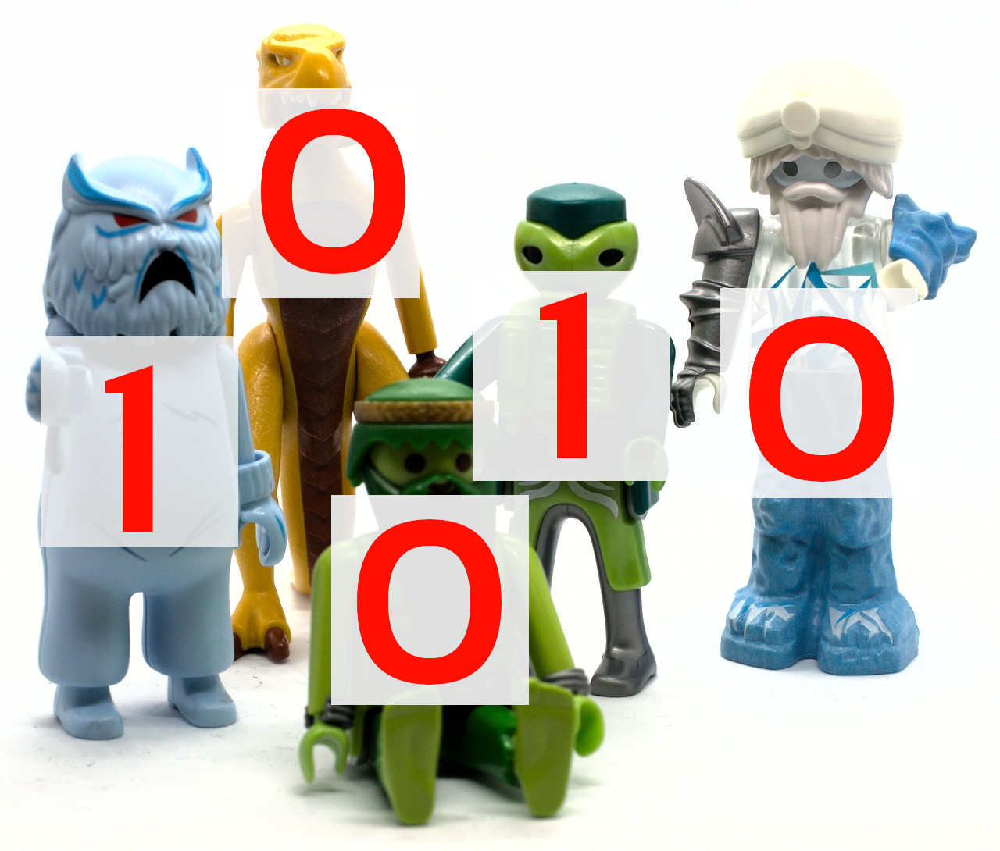
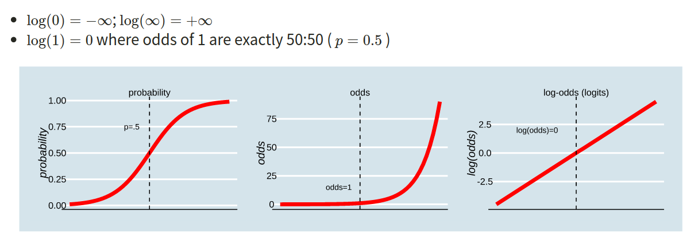
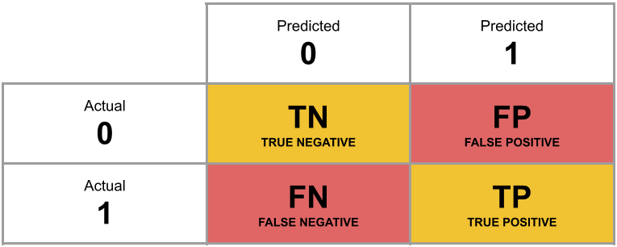

```{r setup, include=FALSE}
source('assets/setup.R')
library(tidyverse)
library(patchwork)
```

<!-- :::red -->
<!-- **Preliminaries**   -->

<!-- - Be sure to check the [**solutions to last week's exercises**](08_mlr.html). You can still ask any questions about previous weeks' materials if things aren't clear!    -->

<!-- 1. Open Rstudio, make sure you have the USMR project open, and create a new RMarkdown document (giving it a title for this week).  -->

<!-- ::: -->

# Some very quick recaps

`r optbegin("Simple linear regression", olabel=FALSE, show=TRUE, toggle=params$TOGGLE)`
Things have moved pretty quickly in the last couple of weeks.   
In the simple linear regression, we defined our model through a number of components:  

- $\beta_0$ / $b_0$ / the "Intercept". This is the predicted value of $y$ where $x = 0$.
    + In the plot below, it is the predicted value of wellbeing where outdoor_time is 0 (where the regression line cuts the y-axis) 
- $\beta_1$ / $b_1$ / the "Coefficient of $x$". This is the predicted *increase* in $y$ for every unit increase of $x$.  
    + In the plot below, this is the amount the regression line goes up for every one unit we move across.  
- $\epsilon$ / $e$ / the "Residuals" or "Error term". These are the distances from each of our observed values to the model predicted values. The standard deviation of all these gets denoted $\sigma$. 
    + In the plot below, these are the vertical distances from each red dot to the black line.  
    
```{r echo=FALSE}
mwdata = read_csv(file = "https://uoepsy.github.io/data/wellbeing.csv")
with(mwdata, plot(outdoor_time, wellbeing, col="red",pch=16))
abline(lm(wellbeing~outdoor_time, mwdata))
```
`r optend()`

`r optbegin("Multiple linear regression", olabel=FALSE, show=TRUE, toggle=params$TOGGLE)`
When we extended this to multiple regression, we essentially just added more explanatory variables, meaning we fitted more coefficients.  

The values of $y$ are now modelled as some relationship of more than just one $x$ variable.  
   
In the plot below with two predictors, we would have a coefficient for each one, showing the slope of the regression surface along each dimension. 

```{r echo=FALSE}
fit<-lm(wellbeing~outdoor_time+social_int, data=mwdata)
steps=50
outdoor_time <- with(mwdata, seq(min(outdoor_time),max(outdoor_time),length=steps))
social_int <- with(mwdata, seq(min(social_int),max(social_int),length=steps))
newdat <- expand.grid(outdoor_time=outdoor_time, social_int=social_int)
wellbeing <- matrix(predict(fit, newdat), steps, steps)


p <- persp(outdoor_time,social_int,wellbeing, theta = 0,phi=0, col = NA)
obs <- with(mwdata, trans3d(outdoor_time,social_int, wellbeing, p))
pred <- with(mwdata, trans3d(outdoor_time, social_int, fitted(fit), p))
points(obs, col = "red", pch = 16)
#points(pred, col = "blue", pch = 16)
segments(obs$x, obs$y, pred$x, pred$y)
```
`r optend()`

`r optbegin("Interactions", olabel=FALSE, show=TRUE, toggle=params$TOGGLE)`
We then saw how we can let the relationships between the outcome $y$ and an explanatory variable $x1$ vary *as a function of* some other explanatory variable $x2$.  
  
In the plot below, if someone asks you "what is the relationship between $x1$ and $x$, your reply should (hopefully) be "well, it depends on what the value of $x2$ is"  
  
This is captured in the curvature of the regression surface below, and we estimate it with a combination of 3 coefficients:  
  
1.  the effect of $x1$ on $y$ where $x2=0$  
(this is the slope of the surface where it meets the **front** face of the cube)  
2. the effect of $x2$ on $y$ where $x1=0$  
(this is the slope of the surface where it meets the **left** of face of the cube)  
3. the amount to which **1.** and **2.** are adjusted when there is an increase in the other variable. 

```{r echo=FALSE}
scs_study <- read_csv("https://uoepsy.github.io/data/scs_study.csv")

fit<-lm(dass ~ scs*zn, data = scs_study)
steps=50
scs <- with(scs_study, seq(min(scs),max(scs),length=steps))
zn <- with(scs_study, seq(min(zn),max(zn),length=steps))
newdat <- expand.grid(scs=scs, zn=zn)
dass <- matrix(predict(fit, newdat), steps, steps)
p <- persp(scs,zn,dass, theta = 0,phi=10, col = NA,
           xlab = "X1",zlab="Y (outcome)",ylab="X2")

```
`r optend()`  


`r optbegin("Categorical explanatory variables", olabel=FALSE, show=TRUE, toggle=params$TOGGLE)`
Throughout these, we also saw how this applied when we had explanatory variables that were **categorical**.  

They were entered in to the model as a set of "dummy variables" (zeroes and ones), representing differences between groups. If we had a categorical variable which contained $k$ levels (or "groups", or "categories"), then we R will put $k-1$ dummy variables into the model for us, and we will get out $k-1$ coefficients.  

The default behaviour in R is that, depending on what we set as our **reference level**, the coefficients represent the difference from this group to each of the others.  
In the plots below, if "City" is the reference, then the coefficient `locationRural` would represent the vertical distance from the red line to the green line, and the coefficient `locationSuburb` would be the vertical distance from the red line to the blue line.  

```{r echo=FALSE}
library(patchwork)
    ggplot(mwdata, aes(x=location, y=wellbeing,col=location))+
    geom_jitter(width = .1, height = 0)+
    stat_summary(fun = mean, geom="errorbar", aes(ymax=..y..,ymin=..y..,col=location),lwd=2) + 
        labs(title="wellbeing~location",subtitle="separated") + 

    ggplot(mwdata, aes(x=0, y=wellbeing,col=location))+
    geom_jitter(width = .1, height = 0)+
    stat_summary(fun = mean, geom="errorbar", aes(x=0,ymax=..y..,ymin=..y..,col=location),lwd=2) + 
    scale_x_continuous(NULL, breaks=NULL) +
        labs(title="wellbeing~location",subtitle="(collapsed)")+
        
    plot_layout(guides="collect")

```

*Note - because categorical predictors are coded as various dummy variables of zeroes and ones, the assumption of linearity is intrinsically there. The only possible way to get from the red line to the green line is via a straight line.*  

We also saw how this same logic applies when categorical explanatory variables are involved in an interaction.  

The coefficients provide  

1. coefficient for practice: the increase in 'reading age' associated with an increase of 1 unit of 'practice', when the dummy variables for 'method' are all 0  
    + (Where the reference level is *phonics*, this is the slope of the red line)
2. the coefficient for methodWord: the change in 'reading age' associated with the move from the reference level *phonics* to *word*, when 'practice' = 0.  
    + (This is the distance between the two lines where they meet the y-axis).  
3. the coefficient for the interaction: the adjustment to 1 and 2 associated with an increase of 1 in other variable (which for the categorical variable means the move to the other group).  

```{r echo=FALSE, fig.cap="https://uoepsy.github.io/usmr/lectures/lecture_8#58"}
knitr::include_graphics("images/glm/catint.png")
```

`r optend()`  

# Model Building  

it's been a lot, but let's take stock 

what have we seen:

we've seen regression models with one predictor, and with many predictors. 
we've also seen how categorical predictors are inputted into regression models as a series of dummy variables, with coefficients providing estimates of group differences.
we've also seen how we can model the effect of one predictor as _depending on_ the level of another, by including the product term (an "interaction").  

we've talked about the hypothesis tests that we can perform with these models, for instance, testing whether a specific slope is different from zero (the coefficients in `summary()`), or testing the improvement in model fit (by reduction in sums of squared residuals) gained from the addition of one (or several) predictors (model comparison with `anova(model1, model2)`).  
But all this supposes that we already know what to include in our model.  

typically interested in one or more specific predictors, or an interaction. 
may mention specific things to "control for" (e.g. to also take into account).  

to use a model to predict the world: 
shove everything, keep whatever sticks


to use a model to explain the world:  
include variables which theoretically make sense as influencing the outcome  
don't simply exclude predictors that are not significant  
don't throw the kitchen sink at it. parsimony is also good
remember the research question
it may help to think of predictors in sets (e.g. demographic, historical)


# Binary Outcomes!

So what do we do if we want to do a similar analysis but for an outcome variable that is not numeric?  
We measure a lot of things as categories, and sometimes what our research is interested in is what variables influence the likelihood that an observation will fall into a given category.  

In the lecture, we saw an example in which our participants (aliens), were either splatted or survived.  
```{r echo=FALSE, out.width="50%"}

```

Consider the following questions: 

- What features of speech influence the likelihood of an utterance being perceived as true/false?  
- What lifestyle and demographic variables influence the chances that a person does/does not smoke?  
- Does preference for milk vs dark chocolate depend on personality traits?  

The common thread in the questions above is that they all contain a dichotomy:  "splatted/not splatted", "true/false", "does/does not", "milk vs dark".  

A note: This sort of binary thinking can be useful, but it is important to remember that it can in part be simply a result of measurement. For instance, we might initially consider "has blond hair" to be binary "Yes/No", but that doesn't mean that in the real world people *either* have blond hair *or* they don't. We could instead choose to measure hair colour via colorimetric measures of the energy at each spectral wavelength, meaning "blondness" could become a continuum. While binary thinking can be useful, it is not difficult to think of ways in which it can be harmful.  

# Introducing GLM  

> **Research Questions**
> Is susceptibility to change blindness influenced by level of alcohol intoxication and perceptual load?  

Watch the following video 

<iframe width="560" height="315" src="https://www.youtube.com/embed/FWSxSQsspiQ" frameborder="0" allow="accelerometer; autoplay; clipboard-write; encrypted-media; gyroscope; picture-in-picture" allowfullscreen></iframe>
[Simons, D. J., & Levin, D. T. (1997). Change blindness. Trends in cognitive sciences, 1(7), 261-267.](https://www.cse.iitk.ac.in/users/se367/11/papers/simons-ambinder-05_change-blindness.pdf)

You may well have already heard of these series of experiments, or have seen similar things on [TV](https://www.netflix.com/gb/title/80190510).  
`r qbegin("A1")`
For a given participant in the 'Door Study', give a description of the outcome variable of interest, and ask yourself whether it is binary. 
`r qend()`
`r solbegin(show=params$SHOW_SOLS, toggle=params$TOGGLE)`
The outcome variable here is "Did the participant notice the person-swap?".  
The values of this are either "Yes" or "No" - they either do or don't notice that the person they are talking to suddenly changes. 
  
*Be careful:* The video doesn't actually state how they are measuring this - via post-experiment question of "did you notice?", or via what the experimenter perceives to be behaviour which indicates awareness of the swap. *Always think about what exactly you are measuring*.  
`r solend()`

`r optbegin("drunkdoor.csv Dataset", olabel=FALSE, show = TRUE, toggle = params$TOGGLE)`
**Method**
Researchers conducted a study in which they approached 120 people, recruited from within the vicinity of a number of establishments with licenses to sell alcohol to be consumed on-premises. Initially, experimenter A approached participants and asked if they were interested in participating in a short study, and obtained their written consent. While experimenter A subsequently talked each participant through a set of questions on multiple pieces of paper (with the pretense of explaining what the participant was required to do), experimenters B and C carrying a door passed between the participant and experimenter A, with experimenter C replacing A (as can be viewed in the video). 

The perceptual load of the experiment was manipulated via a) the presentation of the door and b) the papers held by the experimenters. For 60 of these participants, the door was painted with some detailed graffiti and had a variety of pieces of paper and notices attached to the side facing the participants. Additionally, for these participants, the experimenters handled a disorganised pile of 30 papers, with the top pages covered in drawings around the printed text. For the remaining 60, the door was a standard MDF construction painted a neutral grey, and the experimenters handled only 2 sheets of paper which had minimal printed text on them and nothing else. 

**Measures**   
After experimenters A and C had successfully swapped positions, the participant was asked (now by C) to complete small number of questions taking approximately 1 minute. Either after this set of questions, or if the participant made an indication that they had noticed the swap, the experimenters regrouped and the participant was explicitly asked whether they had noticed the swap.   
Immediately after this, participants were breathalysed, and their blood alcohol content was recorded.  

**Data**  
```{r echo=FALSE}
set.seed(2834)
N = 120
Xmatrix = tibble(
  int=1,
  bac = runif(N, 0, 0.082),
  age = round(rnorm(N,55,9)),
  condition = rep(0:1,each=N/2)
) 
coefs = c(0, 60, -.3, -5)
mu = as.matrix(Xmatrix) %*% coefs
sigma = 2
y = rnorm(N, mu, sigma)
bind_cols(Xmatrix[,-1], 
          tibble(notice = ifelse(y>mean(y),1,0))
          ) -> df
drunkdoor <- sample_n(df, n())
drunkdoor$id <- paste0("ID",1:N)
drunkdoor <- relocate(drunkdoor, id)
drunkdoor$condition <- factor(ifelse(drunkdoor$condition == 1,"High","Low"))
#write.csv(drunkdoor,"../../data/drunkdoor.csv", row.names=F)
#drunkdoor$condition<-fct_relevel(factor(drunkdoor$condition),"Low")
#changeblind_model <- glm(notice ~ I(bac*100) + condition + age, data = drunkdoor, family = "binomial")
#sjPlot::plot_model(changeblind_model)

```
The data can be downloaded from [https://uoepsy.github.io/data/drunkdoor.csv](https://uoepsy.github.io/data/drunkdoor.csv).  
A description of the variables included is presented below.  
```{r echo=FALSE}
tibble(
variable = names(drunkdoor),
description = c("Unique ID number","Blood Alcohol Content (BAC), A BAC of 0.0 is sober, while in the United States 0.08 is legally intoxicated, and above that is very impaired. BAC levels above 0.40 are potentially fatal.", "Age (in years)","Condition - Perceptual load created by distracting oject (door) and details and amount of papers handled in front of participant (Low vs High)", "Whether or not the participant noticed the swap (Yes = 1 vs No = 0)")
) %>% gt::gt()
```
`r optend()`

`r qbegin("A2")`
Read in the data, and plot the relationship between the `age` variable and the `notice` variable.   
Use `geom_point()`, and add to the plot `geom_smooth(method="lm")`. This will plot the regression line for a simple model of `lm(notice ~ age)`.  
`r qend()`
`r solbegin(show=params$SHOW_SOLS, toggle=params$TOGGLE)`

```{r}
drunkdoor <- read_csv("https://uoepsy.github.io/data/drunkdoor.csv")

ggplot(drunkdoor, aes(x=age, y=notice))+
  geom_point()+
  geom_smooth(method="lm")
```
`r solend()`

`r qbegin("A3")`
Just visually following the line from the plot produced in the previous question, what do you think the predicted model value would be for someone who is aged 30?  
What does this value *mean*?

`r qend()`
`r solbegin(show=params$SHOW_SOLS, toggle=params$TOGGLE)` 

This plot will make it easier to see that the model predicted value for someone aged 30 is approximately 1.15. 
```{r echo=FALSE}
ggplot(drunkdoor, aes(x=age, y=notice))+
  geom_point()+
  geom_smooth(method="lm",se=F,fullrange=T)+
  geom_smooth(method="lm")+
  xlim(30,80)+
  scale_y_continuous(breaks=seq(-.2,1.3,0.1))
```

But what does **1.15** really mean here? Does it mean that the 30 year old participant will notice 1.15 experimenter-swaps? That doesn't make sense, there is only one. Does it mean that they have a 115% probability of noticing the swap? That is closer, but again it doesn't make much sense - how can we have a 115% probability?  
`r solend()`


What we are interested in evaluating here is really the *probability* of noticing the experimenter-swap.  

This is where the **Generalised Linear Model (GLM)** comes in. With a little bit of trickery, we can translate probability (restricted to between 0 and 1, and not represented by a straight line), into "log-odds", which is both linear *and* unbounded (see Figure \@ref(fig:plodd)).  

:::statbox
**Probability, odds, log-odds**  

If we let $p$ denote the probability of a given event, then:  

- $\frac{p}{(1-p)}$ are the odds of the event happening. For example, the odds of rolling a 6 with a normal die is 1/5 (sometimes this is expressed '1:5', and in gambling the order is sometimes flipped and you'll see '5/1' or 'odds of five to one').  
- $ln(\frac{p}{(1-p)})$ are the log-odds of the event.  

```{r plodd, echo=FALSE, fig.cap="https://uoepsy.github.io/usmr/lectures/lecture_9.html#32"}

```

:::

`r qbegin("A4")`

1. The probability of a coin landing on heads if 0.5, or 50%. What are the odds, and what are the log-odds?    
2. This year's Tour de France winner, Tadej Pogacar, was given odds of 11 to 4 by a popular gambling site (i.e., if we could run the race over and over again, for every 4 he won he would lose 11). Translate this into the implied probability of him winning.  

`r qend()`
`r solbegin(show=params$SHOW_SOLS, toggle=params$TOGGLE)`

1. A 50% chance of landing on heads is equivalent to the odds of $\frac{0.5}{(1-0.5)} = \frac{0.5}{0.5} = \frac{1}{1}$ (odds of 1 to 1, i.e., "equal odds").   
The log-odds can be calculated using `log(1)` in R, which returns `r log(1)`.  
2. If Pogacar is predicted to win 4 for every 11 he loses, then this is means he is predicted to win 4 in every 15 races, so the implied probability of him winning is $\frac{4}{15} = $`r round(4/15,3)`.  

`r solend()`

How is this useful? 
Recall the linear model formula we have seen a lot of over the last couple of weeks: 
$$
\color{red}{Y} = \color{blue}{\beta_0 \cdot{} 1 + \beta_1 \cdot{} X_1 + ... + \beta_k \cdot{} X_k}
$$
Because we are defining a *linear* relationship here, we can't directly model the probabilities (because they are bounded by 0 and 1, and they are not linear). But we *can* model the log-odds of the event happening.  
Our model formula thus becomes:
$$
\color{red}{ln\left(\frac{p}{1-p} \right)} = \color{blue}{\beta_0 \cdot{} 1 + \beta_1 \cdot{} X_1 + ... + \beta_k \cdot{} X_k} \\
\quad \\
\text{Where} Y_i \sim Binomial(n, p_i) \text{ for a given }x_i \\
\text{and } n = 1 \text{for binary responses}
$$


`r optbegin("A bit of a tangent - How does the model get estimated?", show=TRUE, toggle=params$TOGGLE)`
**Maximum Likelihood Estimation**  

For a linear regression, we heard about how the regression line can be found by "minimising the residual sums of squares" (i.e., we rotate the line to find the point at which $\sum{(y - \hat{y})^2}$ is smallest. This gave us the "best fitting line" (Figure \@ref(fig:resslineplot)).  
```{r resslineplot, echo=FALSE, out.width="60%", fig.cap="https://uoepsy.github.io/usmr/lectures/lecture_6.html#36"}
knitr::include_graphics("images/glm/ss.png")
```

For the logistic regression model, what we're really wanting is the "best fitting *squiggle*" (Figure \@ref(fig:loglineplot)), and to get to this we must do something else. 
```{r loglineplot, echo=FALSE}
drunkdoor %>%
ggplot(aes(x=age,y=notice)) +
  ylab("p(noticed swap)") +
  geom_jitter(size=3,height=.02,alpha=.1) +
  geom_smooth(method="glm",method.args=list(family=binomial),se=F) +
  scale_y_continuous(breaks=seq(0,1,by=.2))
```
The reason we have to do something different is because for our actual observations, the event has either happened or it hasn't. So we can't take the raw data as "probabilities" which we can translate into log-odds. We can try, but it doesn't make sense, and we would just be trying to fit some line between infinity and negative infinity. This would mean the residuals would also all be infinity, and so it becomes impossible to work out anything!  
```{r}
drunkdoor %>% 
  mutate(
    notice_odds = notice/(1-notice),
    notice_logodds = log(notice_odds)
  )
```

Instead, *maximum likelihood estimation* is used to find the set of coefficients which best reproduce the observed data.  
  
For a given line on the plot where y = log-odds, and x = predictor variable, we can project our points on to it to find some candidate log-odd values for each observation, which we can then compare to the observed data (the 0s and 1s, or -Inf and Inf on the log-odds scale).   
  
Consider three possible lines we might fit below. You can see the observations at the `Inf` and `-Inf` points of the y-axis, and they are coloured by whether the event was observed or not. These are then projected down on to the possible lines. Recall that a log-odds of 0 is 50/50, or an odds of 1.  
In the left hand plot, all of the observations where the event *was* observed to happen (red dots at log-odds of +Inf), are modelled as having a log-odds of > 0 (red dots on the line). However, so are a lot of the observations where the event was *not* observed (blue dots at log-odds of -Inf).  
In the middle plot, some red dots get incorrectly given log-odds < 0, and a lot of blue dots get incorrectly given log-odds > 0. 
The right hand plot seems to fit a little better - there are only a few points which get given log-odds the wrong way from what we would expect.  
```{r echo=FALSE, out.width="100%", fig.cap="Note: the dotted lines are not residuals, but just to show the projections of observations down to the line"}
library(patchwork)
drunkdoor %>%
  mutate(fitted = 1-(0.01*age),
         y = ifelse(notice==1,max(fitted)+.1,min(fitted)-.3)) %>%
ggplot(aes(x=age)) +
  ylab("log-odds of p(noticed swap)") +
  geom_jitter(aes(y=y,col=notice==0),size=3,width=0,height=.02,alpha=.1) +
  geom_line(aes(y=fitted),col="blue")+
  geom_point(aes(y=fitted,col=notice==0),size=3,alpha=.8)+
  geom_segment(aes(x=age,xend=age,y=fitted,yend=y,col=notice==0),lty="dotted", alpha=.4)+
  scale_y_continuous(breaks=c(-.1,.3,.75), labels=c("-Inf","0","Inf"))+
  theme(panel.grid.major = element_blank(), panel.grid.minor = element_blank())+
  geom_hline(aes(yintercept=.3))+
  guides(col=FALSE) +

  drunkdoor %>%
  mutate(fitted = 1+(0.005*age),
         y = ifelse(notice==1,max(fitted)+.05,min(fitted)-.1)) %>%
ggplot(aes(x=age)) +
  geom_jitter(aes(y=y,col=notice==0),size=3,width=0,height=.02,alpha=.1) +
  geom_line(aes(y=fitted),col="blue")+
  geom_point(aes(y=fitted,col=notice==0),size=3,alpha=.8)+
  geom_segment(aes(x=age,xend=age,y=fitted,yend=y,col=notice==0),lty="dotted", alpha=.4)+
  scale_y_continuous(breaks=c(1.07,1.25,1.45), labels=c("-Inf","0","Inf"))+
  theme(panel.grid.major = element_blank(), panel.grid.minor = element_blank())+
  geom_hline(aes(yintercept=1.25))+
  guides(col=FALSE) +

drunkdoor %>%
  mutate(fitted = fitted(glm(notice~age,., family="binomial")),
         fitted = log(fitted/(1-fitted)),
         y = ifelse(notice==1,max(fitted)+1,min(fitted)-1)) %>%
ggplot(aes(x=age)) +
  geom_jitter(aes(y=y,col=notice==0),size=3,width=0,height=.3,alpha=.1) +
  #geom_smooth(method="lm",se=F) +
  geom_point(aes(y=fitted,col=notice==0),size=3,alpha=.8)+
  geom_segment(aes(x=age,xend=age,y=fitted,yend=y,col=notice==0),lty="dotted", alpha=.4)+
  theme(panel.grid.major = element_blank(), panel.grid.minor = element_blank())+
  scale_y_continuous(NULL,breaks=c(-4,0,4), labels=c("-Inf","0","Inf"))+
  geom_hline(aes(yintercept=0))+
  guides(col=FALSE)
```

<br>

If we take that right-hand plot above, and translate the log-odds back into probabilities, we see the squiggle! 

```{r echo=FALSE, out.width="100%"}
p1 <- drunkdoor %>%
  mutate(fitted = fitted(glm(notice~age,., family="binomial")),
         fitted = log(fitted/(1-fitted)),
         y = ifelse(notice==1,max(fitted)+1,min(fitted)-1)) %>%
ggplot(aes(x=age)) +
  ylab("log-odds") +
  geom_jitter(aes(y=y,col=notice==0),size=3,width=0,height=.3,alpha=.1) +
  #geom_smooth(method="lm",se=F) +
  geom_point(aes(y=fitted,col=notice==0),size=3,alpha=.3)+
  geom_segment(aes(x=age,xend=age,y=fitted,yend=y,col=notice==0),lty="dotted")+
  scale_y_continuous(breaks=c(-4,0,4), labels=c("-Inf","0","Inf"))+
  theme(panel.grid.major = element_blank(), panel.grid.minor = element_blank())+
  geom_hline(aes(yintercept=0))+
  guides(col=FALSE)


p2 <- drunkdoor %>%
  mutate(fitted = fitted(glm(notice~age,., family="binomial")),
         lab = round(fitted,2)) %>%
ggplot(aes(x=age)) +
  geom_jitter(aes(y=notice,col=notice==0),size=3,width=0,height=.01,alpha=.1) +
  ylab("probability") +
  geom_point(aes(y=fitted,col=notice==0),size=3,alpha=.3)+
  geom_segment(aes(x=age,xend=age,y=fitted,yend=notice,col=notice==0),lty="dotted")+
  geom_hline(aes(yintercept=0.5))+
  #scale_y_continuous(NULL,breaks=c(-4,0,4), labels=c("-Inf","0","Inf"))+
  guides(col=FALSE)

p1 + p2
```
  
What we can then ask for each of our candidate lines "what is the likelihood of the data, given this line?". To get this, we sum up the probabilities that observed 1s are predicted as 1s and that observed 0s predicted as 0s, at some given threshold which defines what we count as "predicted as 1" (e.g., is the predicted prob < or > 0.5?).    
For instance, the furthest right point is an observed 0, and so the likelihood of this data given the predicted probability is 1-0.04, or 0.96.  
```{r echo=FALSE}
p2+ geom_label(aes(x=78, y=0.1),label="0.04") +
  geom_label(aes(x=38, y=0.83),label="0.89")
```

The cool thing is that computers do all this for us. *Maximum likelihood estimation* is just a method to find out which parameters maximise the likelihood of the data. In our context, it tells us what values of coefficients in $\color{red}{ln\left(\frac{p}{1-p} \right)} = \color{blue}{\beta_0 \cdot{} 1 + \beta_1 \cdot{} X_1 }$ maximise the likelihood of reproducing the data we observed.   
`r optend()`


`r qbegin("A5")`
To fit a logistic regression model, we need to use`glm()`, a slightly more general form of `lm()`.  
The syntax is pretty much the same, but we need to add in a `family` at the end, to tell it that we are doing a binomial^[In this case it happens to be the special case of a binomial where $n=1$, which sometimes gets referred to as 'binary logistic regression'] logistic regression.  

Using the `drunkdoor.csv` data, fit a model investigating whether participants' age predicts the log-odds of noticing the person they are talking to be switched out mid-conversation. Look at the `summary()` output of your model.  

:::rtip
  
+ `lm(y ~ x1 + x2, data = data)`  
+ is the same as:  
+ `glm(y ~ x1 + x2, data = data, family = "gaussian")`  
  
([Gaussian](https://en.wikipedia.org/wiki/Carl_Friedrich_Gauss) is another name for the normal distribution)
:::
`r qend()`
`r solbegin(show=params$SHOW_SOLS, toggle=params$TOGGLE)`
```{r}
model1 <- glm(notice ~ age, data = drunkdoor, family="binomial")
summary(model1)
```
`r solend()`

`r qbegin("A6")`
Interpreting coefficients from a logistic regression can be difficult at first.  
Based on your model output, complete the following sentence:  

"Being 1 year older decreases _________ by 0.13."
`r qend()`
`r solbegin(show=params$SHOW_SOLS, toggle=params$TOGGLE)`
"Being 1 year older decreases **the log-odds of noticing a mid-conversation person switch** by 0.13."  
`r solend()`

`r qbegin("A7")`
Unfortunately, if we talk about increases/decreases in log-odds, it's not that intuitive.  
What we often do is translate this back into odds.  
The opposite of the natural logarithm is the exponential (see [here](http://mathonweb.com/help_ebook/html/functions_3.htm) for more details if you are interested), and in R these functions are `log()` and `exp()`:   

```{r}
log(2)
exp(log(2))
log(exp(0.6931472))
```

Exponentiate the coefficients from your model in order to translate them back from log-odds, and provide an interpretation of what the resulting numbers mean.  
`r qend()`
`r solbegin(show=params$SHOW_SOLS, toggle=params$TOGGLE)`
```{r}
exp(coef(model1))
```
:::int 
The odds of noticing a mid-conversation person-switch for someone age 0 is 1282:1.  
For every year older someone is, the odds of noticing decrease by 0.88. 
:::
`r solend()`

`r qbegin("A8")`
Based on your answer to the previous question, calculate the odds of noticing the swap for a one year-old (for now, forget about the fact that this experiment wouldn't work on a 1 year old!)  
And what about for a 40 year old?  

Can you translate the odds back to probabilities?  

`r qend()`
`r solbegin(show=params$SHOW_SOLS, toggle=params$TOGGLE)`
```{r}
exp(coef(model1))
```
>The odds of noticing a mid-conversation person-switch for someone age 0 is 1282:1.  
For every year older someone is, the odds of noticing decrease by 0.88. 

This means that for a one year old, the odds of noticing are $1282*0.88$, or 1129:1.  
The odds for a 40 year old are $1282*0.88^{40}$, or 7.71:1  

And we can always then turn these back into probabilities. 

From probabilities to log-odds (or logit):  
$$
logit_i=log(\frac{p_i}{1-p_i}))
$$
From log-odds to probability:  
$$
p_i=\frac{e^{logit_i}}{(1+e^{logit_i})}
$$

Predicted probability of noticing for a one year old = $\frac{1129}{1 + 1129} = 0.99$
Predicted probability of noticing for a 40 year old = $\frac{7.71}{1 + 7.71} = 0.89$  
`r solend()` 

`r qbegin("A9")`
We can easily get R to extract these predicted probabilities for us.  

+ Calculate the predicted log-odds (probabilities on the logit scale):  `predict(model, type="link")`  
+ Calculate the predicted probabilities: `predict(model, type="response")`   
  
The code below creates a dataframe with the variable `age` in it, which has the values 1 to 100. Can you use this object in the `predict()` function, along with your model, to calculate the predicted probabilities of the outcome (noticing the swap) for each value of age? How about then plotting them?  
```{r}
ages100 <- tibble(age = 1:100)
```
`r qend()`
`r solbegin(show=params$SHOW_SOLS, toggle=params$TOGGLE)`
This will spit out 100 predicted probabilities.. 
```{r eval=FALSE}
predict(model1, newdata = ages100, type = "response")
```

Let's add them to the `ages100` tibble
```{r}
ages100 <- 
  ages100 %>%
  mutate(
    predprobs = predict(model1, newdata = ages100, type = "response")
  )
```

and plot them against age!
```{r}
ggplot(data = ages100, aes(x = age, y = predprobs)) +
  geom_line()+
  labs(y="predicted probability of noticing the swap")
```

`r solend()`

`r qbegin("A9")`
We have the following model coefficients, in terms of log-odds: 
```{r}
summary(model1)$coefficients
```
We can convert these to odds by using `exp()`:
```{r}
exp(coef(model1))
```
In order to say something along the lines of "For every year older someone is, the odds of noticing the mid-conversation swap (the outcome event happening) decreases by 0.88."   
  
Why can we **not** translate this into a straightforward statement about the change in *probability* of the outcome for every year older someone is?  
`r qend()`
`r solbegin(show=params$SHOW_SOLS, toggle=params$TOGGLE)`
We have to be careful - we are talking about an odds *ratio*.  

Our model holds that a 21 year old has 0.88 the odds that a 20 year old has, and that a 51 year old has 0.88 the odds of a 50 year old. 
But these are not the same in terms of probability. The probability between age and the probability isn't linear, it is sigmoidal.

```{r}
example <- tibble(
  age = c(20,21,50,51)
)

example <- 
  example %>% mutate(
    logodds = predict(model1, newdata = example, type = "link"),
    odds = exp(logodds),
    probs = predict(model1, newdata = example, type = "response"),
  )

example
```

+ In log odds the difference is constant (it is a linear relationship):  
    ```{r}
    example$logodds[example$age == 21] - example$logodds[example$age == 20]
    example$logodds[example$age == 51] - example$logodds[example$age == 50]
    ```

- Translated back into odds, the difference is not constant:
    ```{r}
    example$odds[example$age == 21] - example$odds[example$age == 20]
    example$odds[example$age == 51] - example$odds[example$age == 50]
    ```
    the multiplication, however, IS constant (this is the odds ratio):
    ```{r}
    example$odds[example$age == 21]/example$odds[example$age == 20]
    example$odds[example$age == 51]/example$odds[example$age == 50]
    ```
- This is the same thing we saw visually in Figure \@ref(fig:plodd)!  

`r solend()`


# GLM as a classifier  

`r qbegin("B1")`
From the model we created in the earlier exercises:  

```{r eval=FALSE}
drunkdoor <- read_csv("")
model1 <- glm(notice ~ age, data = drunkdoor, family="binomial")
```

1. Add new column to the drunkdoor dataset which contains the predicted probability of the outcome for each observation.  
2. Then, using `ifelse()`, add another column which is these predicted probabilities translated into the predicted binary outcome (0 or 1) based on whether the probability is greater than >.5.  
3. Create a two-way contingency table of the predicted outcome and the observed outcome.  

*Hint:* you don't need the `newdata` argument for `predict()` if you want to use the original data the model was fitted on.  
`r qend()`
`r solbegin(show=params$SHOW_SOLS, toggle=params$TOGGLE)`
```{r}
drunkdoor <-
  drunkdoor %>%
  mutate(
    predprobs = predict(model1, type="response"),
    predclass = ifelse(predprobs > 0.5, 1, 0)
  )


drunkdoor %>%
  select(notice, predclass) %>%
  table()
```
`r solend()`

A table of predicted outcome vs observed outcome sometimes gets referred to as a *confusion matrix*, and we can think of the different cells in general terms (Figure \@ref(fig:confmat)).  
Another way to think about how our model is fitted is that it aims to maximise (TP + TN)/n, or, put another way, to minimise (FP+FN)/n.  
Which is equivalent to the good old idea of minimising sums of squares (where we minimise the extend to which the predicted values differ from the observed values).  
```{r confmat, echo=FALSE, fig.cap="Confusion Matrix"}

```

`r qbegin("B2")`
What percentage of the n = `r nrow(drunkdoor)` observations are correctly classified by our model, when the threshold is set at 0.5? 
`r qend()`
`r solbegin(show=params$SHOW_SOLS, toggle=params$TOGGLE)`
```{r}
sum(drunkdoor$predclass == drunkdoor$notice) / nrow(drunkdoor)
```
The model correctly classifies `r sum(drunkdoor$predclass == drunkdoor$notice) / nrow(drunkdoor) * 100`% of the observations.  
`r solend()`


# Exercises  

## Approaching a research question  

`r qbegin("C1")`
Recall our research question, which we will now turn to:  

> **Research Questions**
> Is susceptibility to change blindness influenced by level of alcohol intoxication and perceptual load?  

Try and make a mental list of the different relationships between variables that this question invokes, can you identify one variable as the 'outcome' or 'response' variable? (it often helps to think about the implicit direction of the relationship in the question)  
`r qend()`
`r solbegin(show=params$SHOW_SOLS, toggle=params$TOGGLE)`

The question seems to ask about two relationships:  

+ susceptibility to change blindness &#8592; alcohol intoxication  
+ susceptibility to change blindness &#8592; perceptual load  

The arrows above are used to show the implied direction of the influence, and in the `lm()/glm()` syntax, you could imagine each of these mapping to a formula syntax we have seen a few times (e.g., `t.test(data$outcome ~ data$group)` and `lm(outcome ~ predictor)`). We can see that the 'susceptibility to change blindness' is our outcome variable:  

+ `change blindness ~ alcohol`
+ `change blindness ~ perceptual load` 

As a general rule of thumb, it is often worth asking yourself "why run two models when one will do?". Think about what we have learned about moving from simple to multiple regression - some of the explanatory power of `x` in the relationship `y~x` might be shared by the relationship `y~z`. 
This will depend on precisely what quantity you want to estimate, i.e., "the overall effect of $x$ on $y$ *independent of $z$*" or "the effect of $x$ on $y$ *after partialling out the effect of $z$ on $y$*". The former statement might indicate a simple bivariate relationship, and the latter requires more advanced techniques (e.g., multiple regression).  

`r solend()`

`r qbegin("C2")`
Think about our outcome variable and how it is measured. What type of data is it? Numeric? Categorical?  
What type of distribution does it follow? For instance, do values vary around a central point, or fall into one of various categories, or follow the count of successes in a number of trials? 
`r qend()`
`r solbegin(show=params$SHOW_SOLS, toggle=params$TOGGLE)`
Our outcome variable here is `drunkdoor$notice`, and is stored as a set of 0s and 1s. These are the only two values that an observation can take, and they represent the number of successes in n = 1 trial.  

So, from this we learn that our method of analysis should be suited to model this binary outcome. So things like `lm()` and `t.test()` are not very suitable.  
`r solend()`

`r qbegin("C3")`
Think about our explanatory variable(s). Is there more than one? What type of variables are they? Do we want to model these together? Might they be correlated?  
Are there any other variables (measured or unmeasured) which our prior knowledge or theory suggests might be relevant?  
`r qend()`
`r solbegin(show=params$SHOW_SOLS, toggle=params$TOGGLE)`
We know that `drunkdoor$bac` is simply the observed blood alcohol level (BAC). This is technically measured as a proportion, but for the current purposes we can just treat it as any other numeric scale. However, we might consider scaling the variable so that instead of the coefficient representing the change when moving from 0% to 1% BAC (1% blood alcohol is fatal!), we might want to have the change associated with 0% to 0.01% BAC (i.e, a we want to talk about effects in terms of changing 1/100th of a percentage of BAC). 
The `drunkdoor$condition` variable is an experimental manipulation. That is, the researchers had control over what observations fell into which group. We wouldn't therefore expect any correlation between this and the `bac` variable (unless researchers did not allocate participants to conditions randomly).  

If we were actually doing research in this area, we might already have the idea based on previous research that change-blindness appears to vary depending upon age. From the earlier exercises here we have some evidence to corroborate this. We may therefore want to include this in our model. If we don't, any results might simply be due to, e.g. older people tending to be more highly intoxicated (and so we see an effects of alcohol that might actually be simply the effect of age). 
  
We might also think about any other possible variables which might influence our results, even if we didn't measure them. This sort of thinking becomes important in the discussion section. 

:::lo
**John Stuart Mill - Three Criteria for Causality**  
To varying extents, all of these criteria can be incredibly difficult to satisfy. Criteria 3 especially is one of the things that makes scientific investigation so interesting. 

1) The cause precedes the effect
2) The cause is demonstrably related to the effect
3) There are no plausible alternative explanations  
  
*Mill, J. S. (1869). A System of Logic, Ratiocinative and Inductive: Being a Connected View of the Principles of Evidence and the Methods of Scientific Investigation. Harper and brothers.*  
:::

`r solend()`

## Fitting the model  

`r qbegin("C4")`

1. Write a sentence describing the model you will fit. It might help to also describe each variable as you introduce it. 
2. Fit the model.  


**Things to think about:**  

- Do you want BAC on the current scale, or could you transform it somehow? 
- Is condition a factor? What is your reference level? Have you checked `contrasts(drunkdoor$condition)`? (This will only work if you make it a factor first)

`r qend()`
`r solbegin(show=params$SHOW_SOLS, toggle=params$TOGGLE)`

:::int 
Whether or not participants noticed the swap mid-conversation (binary 0 vs 1) is modelled using logistic regression, with blood alcohol content (measured in 100th of percentages blood content) and perceptual load condition (low load vs high load, with low as the reference level) and age (years).  
:::

In the sentence above, I stated that I want blood alcohol in terms of 100ths of percentages, rather than percentages.
```{r}
drunkdoor <- drunkdoor %>% 
  mutate(
    bac100 = bac*100
  )
```

I also stated that the low-load will be the reference level.  
Currently it is the other way around:
```{r}
# make it a factor
drunkdoor$condition<-factor(drunkdoor$condition)
contrasts(drunkdoor$condition)
```
So let's change it:
```{r}
# change 0,1 column to 1,0, and rename it so it 
# compares high against low (not low against high)
contrasts(drunkdoor$condition) <- cbind(High=c(1,0))
contrasts(drunkdoor$condition)
```
```{r}
changeblind_model <- glm(notice ~ bac100 + condition + age, data = drunkdoor, family = "binomial")
summary(changeblind_model)
```

`r solend()`

`r qbegin("C5")`
Compute 95% confidence intervals for the log-odds coefficients using `confint()`. Wrap the whole thing in `exp()` in order to convert all these back into odds and odds-ratios.   

Try the **sjPlot** package and using `plot_model()` on your model. What do you get? 
**Tip:**, for some people this plots seems to miss out plotting the BAC effect, so you might need to add: 
```{r, eval=FALSE}
plot_model(model) +
  scale_y_log10(limits = c(1e-05,10))
```


`r qend()`
`r solbegin(show=params$SHOW_SOLS, toggle=params$TOGGLE)`

```{r}
confint(changeblind_model)
exp(confint(changeblind_model))

sjPlot::plot_model(changeblind_model)+
  geom_hline(yintercept=1)+
  scale_y_log10(limits = c(1e-05,10))
```

`r solend()`


# Looking beyond  

This week we have looked at one specific type of Generalised Linear Model, in order to fit a *binary logistic* regression. We can use GLM to fit all sorts of models, depending on what type of data our outcome variable is, and this is all through the `family = ` part of the model syntax.  
  
For instance, if we had data which was binomial but with an $n > 1$, for instance the number of correct answers in 10 trials:  
  
```{r echo=FALSE}
set.seed(093)
tibble(
  participant = paste0("id",1:5),
  trials_correct = sample(1:10, size = 5),
  trials_incorrect = 10 - trials_correct,
  x1 = round(rnorm(5,100,15))
) %>%
  rbind("...") %>% gt::gt()
```
  
We could model this with `family = "binomial"` using the two columns as the outcome:  
`glm(cbind(trials_correct, trials_incorrect) ~ x1, data = data, family = "binomial")`

<br>
<br>
Or if we had *count* data, which can range from 0 to Infinity (theoretically), e.g.:  
  
```{r echo=FALSE}
set.seed(093)
tibble(
  person = paste0("id",1:5),
  n_fish_caught = rpois(5, 10),
  age = round(rnorm(5,50,15))
) %>%
  rbind("...") %>% gt::gt()
```
  
We could model this using `family = "poisson"`:  
`glm(n_fish_caught ~ age, data = data, family = "poisson")`  
  
<br>
<br>
If you want a really nice resource to help you in your future studies, then https://bookdown.org/roback/bookdown-BeyondMLR/ is an excellent read. 

<div style="margin-bottom:100px"></div>

**For real studies demonstrating the effects used in the example here, see:**

- [Simons, D. J., & Levin, D. T. (1997). Change blindness. Trends in cognitive sciences, 1(7), 261-267.](https://www.cse.iitk.ac.in/users/se367/11/papers/simons-ambinder-05_change-blindness.pdf)  
- [Colflesh, G. J., & Wiley, J. (2013). Drunk, but not blind: The effects of alcohol intoxication on change blindness. Consciousness and cognition, 22(1), 231-236.](https://www.sciencedirect.com/science/article/pii/S1053810013000032?casa_token=LRZHar5q8eIAAAAA:Rqb8AWhFmJBhLKHbM3RuoB2QaR2XvezrRGx-fJD_EGp_b-iI5OCy36GC_lmWpakoqi_In7T2ZH8)  
- [Murphy, G., & Murphy, L. (2018). Perceptual load affects change blindness in a real‐world interaction. Applied cognitive psychology, 32(5), 655-660.](https://onlinelibrary.wiley.com/doi/pdf/10.1002/acp.3441?casa_token=J8vaKjaBsmcAAAAA:3_zvcg0TB_6xbed49dGzgJAXYUr2vs_SxkfWsCRF1ebyJwvcyEvLzXOt3jxcOVCMiFc7ie55hFieyWw)  


<div class="tocify-extend-page" data-unique="tocify-extend-page" style="height: 0;"></div>


