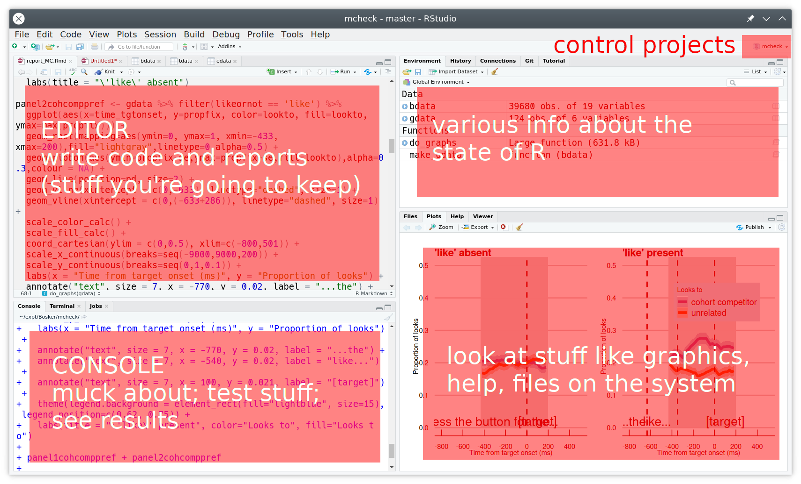
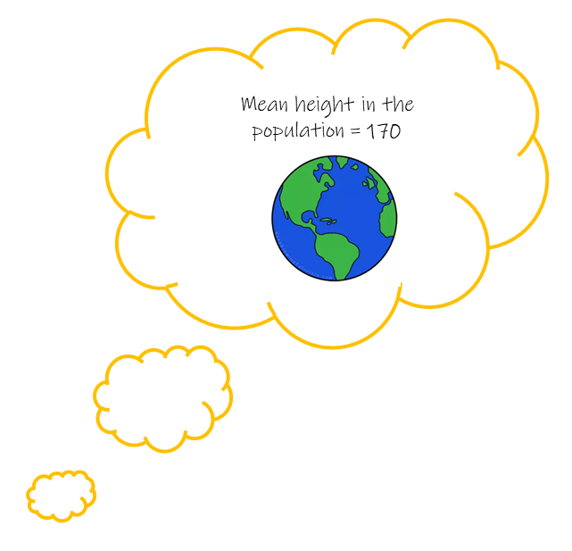

```{r setup, include=FALSE}
options(htmltools.dir.version = FALSE)
options(digits=4,scipen=2)
options(knitr.table.format="html")
xaringanExtra::use_xaringan_extra(c("tile_view","animate_css","tachyons"))
xaringanExtra::use_extra_styles(
  mute_unhighlighted_code = FALSE
)
library(knitr)
library(tidyverse)
library(ggplot2)
library(patchwork)
source('R/pres_theme.R')
knitr::opts_chunk$set(
  dev = "svg",
  warning = FALSE,
  message = FALSE,
  cache = FALSE
)
source('R/myfuncs.R')

library(xaringanthemer)
style_mono_accent(
  #base_color = "#0F4C81", # DAPR1
  # base_color = "#BF1932", # DAPR2
  # base_color = "#88B04B", # DAPR3 
  base_color = "#FCBB06", # USMR
  # base_color = "#a41ae4", # MSMR
  header_color = "#000000",
  header_font_google = google_font("Source Sans Pro"),
  header_font_weight = 400,
  text_font_google = google_font("Source Sans Pro", "400", "400i", "600", "600i"),
  code_font_google = google_font("Source Code Pro")
)
```

class: inverse, center, middle

# Week 1: R

---
# Week 1: R



---
class: inverse, center, middle
# Week 2: Distributions and Repeated Sampling

---
# We collect data

.pull-left[

]
.pull-right[
__Heights and Eye-Colours of USMR students__  
```{r}
library(tidyverse)
demo <- read_csv("https://uoepsy.github.io/data/surveydata_allcourse22.csv") %>%
  filter(course=="usmr") %>%
  select(height, eyecolour) %>% 
  na.omit()

dim(demo)
head(demo)
```
]

---
# We can describe data 

.pull-left[
```{r}
#| echo: false
p1 <- ggplot(demo, aes(x = height)) +
  geom_histogram(aes(y =..density..), bins=15, alpha=.4) +
  geom_density() + 
  xlim(140,200)+
  labs(title="USMR Student Heights") 
  
p2 <- ggplot(demo, aes(x = eyecolour, fill= eyecolour)) +
  geom_bar() +
  scale_fill_manual(values=c("blue"="#1569C7","brown"="#63390f","green"="#6ca580",
                             "grey"="grey","hazel"="#8e7618","other"="black"))+
  guides(fill = "none")+
  labs(title="USMR Student Eye-Colours")

(plot_spacer() + p1 + plot_spacer() + plot_layout(widths = c(.1, .8, .1))) / p2
  
```

]
.pull-right[
```{r}
demo %>% summarise(
  mean_height = mean(height),
  sd_height = sd(height)
)

demo %>% count(eyecolour) %>%
  mutate(prop = n/sum(n))
```

]

---
# _what if..._ we had collected different data?  

.pull-left[
- Statistics we have observed from $n = 228$: 
  - mean height: 168
  - standard deviation of heights: 9.1
  - proportion of people with brown eyes: 52%

- Statistics that we _might have_ computed would be different.  

{{content}}
]

--

- Demonstration: [lecture6_demo.R](./lecture6_demo.R)  

```{r}
#| eval: false
#| echo: false

# Our current best guesses for the population:  
# heights have an average of 168, sd of 9.1
# 52% of people have brown eyes

# these lines of code will 'take a sample' from the population defined above:
heights <- rnorm(n = 228, mean = 168, sd = 9.1)
browneyes <- sample(c(0,1), size = 228, replace = TRUE, prob = c(.48, .52))

# each time we run it, we get a different sample
# and different statistics
mean(heights)
mean(browneyes)
sum(browneyes==1)/228
```


---
# _what if..._ we had collected different data?  

.pull-left[
- Statistics we have observed from $n = 228$: 
  - mean height: 168
  - standard deviation of heights: 9.1
  - proportion of people with brown eyes: 52%

- Statistics that we _might have_ computed would be different.  

- Demonstration: [lecture6_demo.R](./lecture6_demo.R)  
]

.pull-right[
```{r}
#| echo: false
m_heights <- replicate(1e4, mean(rnorm(n = 228, mean = 168, sd = 9.1)))
p_breyes <- replicate(1e4, mean(sample(c(0,1), size = 228, replace = TRUE, prob = c(.48, .52))))
par(mfrow=c(2,1))
hist(m_heights, xlab = "Mean heights from samples of n=228",main="")
hist(p_breyes, xlab = "Proportions of brown eyes in samples of n=228",main="")
par(mfrow=c(1,1))
```
]

```{r}
#| eval: false
#| echo: false

# 1 possible sample:
rnorm(n = 228, mean = 168, sd = 9.1)
# mean height of 1 possible sample:
mean(rnorm(n = 228, mean = 168, sd = 9.1))
# mean heights of 1000 possible samples:
replicate(1000, mean(rnorm(n = 228, mean = 168, sd = 9.1)))

# 1 possible sample:
sample(c(0,1), size = 228, replace = TRUE, prob = c(.48, .52))
# prop browneyes of 1 possible sample:
mean(sample(c(0,1), size = 228, replace = TRUE, prob = c(.48, .52)))
# prop browneyes of 1000 possible samples:
replicate(1000, mean(sample(c(0,1), size = 228, replace = TRUE, prob = c(.48, .52))))

# these are "sampling distributions"
# hist to visualise
# sd to quantify (gives us the "standard error")

```

---
# quantifying sampling variation 

.pull-left[
__Simulations__  
```{r fig.height=4}
#| echo: false

set.seed(003)
sim <- tibble(
  meanheight = replicate(1000, mean(rnorm(n = 228, mean = 168, sd = 9.1))),
  propbrown = replicate(1000, mean(sample(c(0,1), size = 228, replace = TRUE, prob = c(.48, .52)))),
)

ggplot(sim, aes(x=meanheight))+ 
  geom_histogram(aes(y =..density..), bins=15) +
  xlim(165,171)+
  scale_y_continuous(NULL,labels=NULL)
```

```{r}
mheights <- replicate(1000, mean(rnorm(n = 228, mean = 168, sd = 9.1)))
sd(mheights)
```

]

---
count: false
# quantifying sampling variation (2)

.pull-left[
__Simulations__  
```{r fig.height=4}
#| echo: false

set.seed(003)
sim <- tibble(
  meanheight = replicate(1000, mean(rnorm(n = 228, mean = 168, sd = 9.1))),
  propbrown = replicate(1000, mean(sample(c(0,1), size = 228, replace = TRUE, prob = c(.48, .52)))),
)

ggplot(sim, aes(x=meanheight))+ 
  geom_histogram(aes(y =..density..), bins=15, alpha=.4) +
  xlim(165,171)+
  scale_y_continuous(NULL, labels=NULL) +
  stat_function(fun=dnorm,args=list(mean=168,sd=0.604),size=1)
```


```{r}
mheights <- replicate(1000, mean(rnorm(n = 228, mean = 168, sd = 9.1)))
sd(mheights)
```

]

.pull-right[
__Maths__  
sampling distribution is normally distributed with a standard deviation of:  

$$
\begin{align}
& \frac{\sigma}{\sqrt{n}} \\
\\
& \text{Where:} \\
& n = \text{sample size} \\
& \sigma = \text{population standard deviation}  
\end{align}
$$

```{r}
9.1 / sqrt(228)
```

]

???
we saw simulations, but we also saw that we can use formulae  

maybe motivate the formulas by taking the density plot or histogram from the simulations, and superimposing the normal with mean mu and SD = SE = sd / sqrt(n)

so they see the formulas actually map to the centre and width of the density curve


---
class: inverse, center, middle
# Week 3 - Test Statistics

---
# What we expect vs What we observe

e.g. "If the population mean height is 170, is it unlikely to see our sample's mean height of 168?"

.pull-left[
__What we expect:__  
```{r}
#| echo: false
#| fig-height: 5
tibble(meanheight=c(167,172)) %>%
ggplot(aes(x=meanheight))+ 
  scale_y_continuous(NULL, labels=NULL) +
  stat_function(fun=dnorm,args=list(mean=170,sd=0.604),size=1,col="grey")
```
]

--

.pull-right[
__What we observe:__  
```{r}
#| echo: false
#| fig-height: 5
tibble(meanheight=c(167,172)) %>%
ggplot(aes(x=meanheight))+ 
  scale_y_continuous(NULL, labels=NULL) +
  geom_vline(xintercept=168, col="red", size=1)+
  stat_function(fun=dnorm,args=list(mean=170,sd=0.604),size=1,col="grey")
```
]

---
# Standardised Test Statistics

e.g. "Given the statistics we expect, how unlikely is the statistic we observe?"  

.pull-left[
__Test Statistics we expect:__  
```{r}
#| echo: false
#| fig-height: 5
tibble(meanheight=c(-4,4)) %>%
ggplot(aes(x=meanheight))+ 
  scale_y_continuous(NULL, labels=NULL) +
  stat_function(fun=dnorm,args=list(mean=0,sd=1),size=1,col="grey")+
  labs(x="signal = (mean height - 170) / SE")
```
]

.pull-right[
__Test Statistics we observe:__  
```{r}
#| echo: false
#| fig-height: 5
tibble(meanheight=c(-4,4)) %>%
ggplot(aes(x=meanheight))+ 
  scale_y_continuous(NULL, labels=NULL) +
  geom_vline(xintercept=-2/0.604, col="red", size=1)+
  stat_function(fun=dnorm,args=list(mean=0,sd=1),size=1,col="grey") +
  labs(x="signal = (mean height - 170) / SE")
```
]


---
# sampling variation in theory

e.g. "Given the statistics we expect, how unlikely is the statistic we observe?"  

.pull-left[
__Test Statistics we expect:__  
```{r}
#| echo: false
#| fig-height: 5
tibble(meanheight=c(-4,4)) %>%
ggplot(aes(x=meanheight))+ 
  scale_y_continuous(NULL, labels=NULL) +
  stat_function(fun=dnorm,args=list(mean=0,sd=1),size=1,col="grey")+
  labs(x="signal = (mean height - 170) / SE")
```
]
.pull-right[
<br> 
$$
\begin{align}
& SE = \frac{\sigma}{\sqrt{n}} \\
\\
& \text{Where:} \\
& n = \text{sample size} \\
& \sigma = \color{red}{\text{population standard deviation}}  
\end{align}
$$
]

---
# sampling variation in practice

e.g. "Given the statistics we expect, how unlikely is the statistic we observe?"  

.pull-left[
__Test Statistics we expect:__  
```{r}
#| echo: false
#| fig-height: 5
tibble(meanheight=c(-4,4)) %>%
ggplot(aes(x=meanheight))+ 
  scale_y_continuous(NULL, labels=NULL) +
  stat_function(fun=dnorm,args=list(mean=0,sd=1),size=1,aes(col="infinite n"))+
  stat_function(fun=dt,args=list(df=7),size=1,aes(col="bigger n"))+
  stat_function(fun=dt,args=list(df=2),size=1,aes(col="small n"))+
  scale_color_manual(NULL, values=c("small n"="darkorange","bigger n"="cornflowerblue","infinite n"="grey"))+
  theme(legend.position=c(.8,.85))+
  labs(x="signal = (mean height - 170) / SE")
```
]
.pull-right[
<br> 
$$
\begin{align}
& SE = \frac{s}{\sqrt{n}} \\
\\
& \text{Where:} \\
& n = \text{sample size} \\
& s = \color{red}{\text{sample standard deviation}}  
\end{align}
$$
]

```{r}
#| include: false
# pop is mean 12, sd 2
simsignal <- function(size = 30){
  sample = rnorm(n = size, mean = 12, sd = 2)
  se = sd(sample)/sqrt(size)
  signal = (mean(sample)-12) / se 
  return(signal)
}
par(mfrow=c(2,2))
hist(replicate(1000, simsignal(size = 30)), main="n=30")
hist(replicate(1000, simsignal(size = 10)), main="n=10")
hist(replicate(1000, simsignal(size = 5)), main="n=5")
hist(replicate(1000, simsignal(size = 3)), main="n=3")
par(mfrow=c(1,1))
# add in xlims
```


---
# statistical testing

.pull-left[
1. Assume the null hypothesis is true

2. How likely would we be to obtain our statistic in a universe where the null hypothesis is true? 
]
.pull-right[



]

--

```{r}
usmr <- read_csv("../../data/surveydata_allcourse22.csv") %>%
  filter(course=="usmr")
```


---
# t-tests

__One sample t-test__  

- how far the sample mean is from some number:
$$t = \frac{\bar{x}_1 - \mu_0}{SE_{\bar{x}}}$$

```{r}
t.test(usmr$height, mu = 170)
```


---
# t-tests (2)

__Two sample t-test__  

- how far the difference in means is from zero:  
$$t = \frac{\bar{x}_1 - \bar{x}_2}{SE_{\bar{x}_1-\bar{x}_2}}$$  

```{r}
t.test(height ~ catdog, data = usmr)
```

---
class: inverse, center, middle
# Week 4 & 5 - more test statistics

---
# Chi-square tests

__Chi-squared: Goodness of Fit__  

$$
\chi^2 = \Sigma \frac{{(Observed-Expected)}^2}{Expected}
$$

```{r}
table(usmr$eyecolour)

chisq.test(table(usmr$eyecolour))
```


---
# Chi-square tests (2)

__Chi-squared: Test of Independence__  

$$
\chi^2 = \Sigma \frac{{(Observed-Expected)}^2}{Expected}
$$

```{r}
table(usmr$ampm, usmr$catdog)

chisq.test(table(usmr$ampm, usmr$catdog))
```

???
```{r}
table(usmr$ampm, usmr$catdog) %>% prop.table(margin=1)
```


---
# Crrelation tests

__Correlation__  

$$
t = \frac{r}{\sqrt{\frac{1-r^2}{n-2}}} = \frac{r}{SE_{r}}
$$

```{r}
cor.test(usmr$sleeprating, usmr$loc)
```

???

---
class: inverse, center, middle
# and here we are!  


