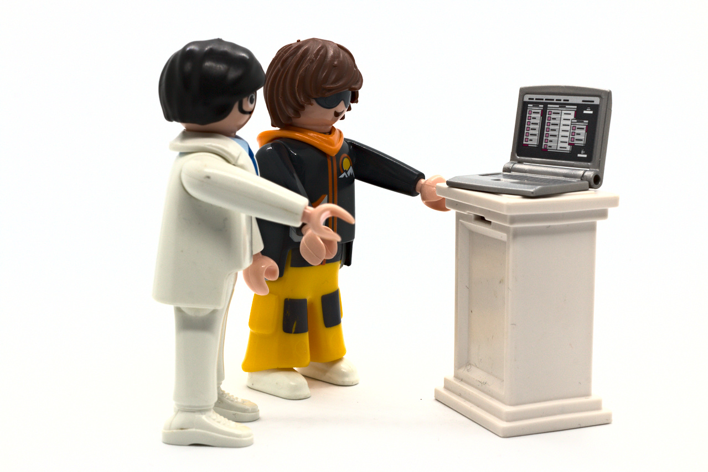

```{r setup, include=FALSE}
options(htmltools.dir.version = FALSE)
options(digits=4,scipen=2)
options(knitr.table.format="html")
xaringanExtra::use_xaringan_extra(c("tile_view","animate_css","tachyons"))
xaringanExtra::use_extra_styles(
  mute_unhighlighted_code = FALSE
)
library(tidyverse)
library(ggplot2)
source('R/pres_theme.R')
knitr::opts_chunk$set(
  dev = "svg",
  warning = FALSE
)
```

```{r xaringan-themer, include = FALSE}
library(xaringanthemer)
style_mono_accent(
  #base_color = "#0F4C81", # DAPR1
  # base_color = "#BF1932", # DAPR2
  # base_color = "#88B04B", # DAPR3 
  base_color = "#FCBB06", # USMR
  # base_color = "#a41ae4", # MSMR
  header_color = "#000000",
  header_font_google = google_font("Source Sans Pro"),
  header_font_weight = 400,
  text_font_google = google_font("Source Sans Pro", "400", "400i", "600", "600i"),
  code_font_google = google_font("Source Code Pro")
)
```

class: center, middle
# Welcome to Univariate Statistics and Methodology using R

???

- welcome. 
- intro me
- first, explain what course about, how its going to work
- i'd like to start by breaking down the title of the course. 
- the univariate refers to statistics where there's one source of variation.

---
# Univariate Statistics...

```{r hdataH,include=FALSE}
load('R/heights.Rdata')
heights <- heights %>% mutate(gender = ifelse(gender=='Other','NonBinary',gender))
```

```{r hadata}
heights
```

- one row represents one set of observations
???

- Typically in Psychology, this might be the identity of the person being measured
- example here - we have different peoples heights. 
- the variation comes from all these different people we've measured
- as statisticians, we're interested in examining whether there are _systematic_ differences, beyond the individual variation
- for example, height predicted by gender?

---
# ...and Methodology...

.pull-left.pt4[
- how do we measure height?

- how do we determine gender?

- how do we collect data in a way that is generalisable?
]
.pull-right[

]

???

- for that, we need a _methodology_
- we need to decide how to measure height
- and how to determine gender (quite a complex topic in the 21st century)
- we need to think about how we need to collect data in a way that is generaliseable. 
  - can't collect data from _everyone_.
  - we need a sample, and then we generalise from that.  

---
# ...Using R...
.flex.items-top[
.w-65.pa2[
```{r dens, fig.show='hide'}
heights %>% ggplot(aes(x=HEIGHT,color=gender,fill=gender)) +
  geom_density(size=2,alpha=0.4)
```
]

.w-35.pa2[

]]

???

- one thing we could do = look at our sample graphically.
- for that we can use R

- here is a little bit of R. 

- right now, this may look like nonsense. 
- in a few weeks time, you'll be able to start making sense of this sort of stuff.

- the code is what makes this plot
- we can see that people who identify as male are on average a bit taller. 

---
#...to Form Conclusions

```{r tt}
heights_t <- heights %>% filter(gender %in% c('Male','Female'))
t.test(heights_t$HEIGHT ~ heights_t$gender)
```

???

typically, it's not enough to stop there, we want to know how confident we are in this conclusion.  
if we keep sampling from the population, will we find similar patterns of results?  
this is where the "statistics" in USMR comes in.  

again, more R code.  
performs a statistical test of whether gender predicts height  
make things simpler, we've subsetted this to only those identifying male or female

for those of you familiar, you might recognise:  
t.test. t value, p-value.   
p-value tells us that the prob of observing this height difference if there isn't actually any difference in the bigger population, is very very small.  
if we were to sample from the population again, we would be pretty confident that the mean height of males would be greater than that of females.  

not _every_ man taller than _every_ woman. on average, men are likely to be taller than women.  

for those of you who are new to statistics, don't worry! all this stuff is what we're going to cover in a lot more depth. 

---
class: center, middle

.flex.items-center[.w-10.br3.pa1.yellow.f1[**U**] .f3.w-40[Univariate]]
.flex.items-center[.w-10.br3.pa1.yellow.f1[**S**] .f3.w-40[Statistics]]
.flex.items-center[.w-10[].f3.w-40[and]]
.flex.items-center[.w-10.br3.pa1.yellow.f1[**M**] .f3.w-40[ Methodology]]
.flex.items-center[.w-10[].f3.w-40[using]]
.flex.items-center[.w-10.br3.pa1.yellow.f1[**R**] .f3.w-40[R]]

???

broadly speaking, that's what we'll be doing. conducting univariate analyses in R to form conclusions.  

it's quite a mouthful, so you'll probably see us using the acronym USMR a lot.  


---

# What you will learn

.pull-left[
### Statistics

- foundations of Null Hypothesis Significance Testing
- probability
- samples and distributions
- the normal and the binomial distributions
- testing for significance
  + $F$-ratio, $\chi^2$, $t$-test, others
- the linear model
- multiple linear regression
- assumptions, models, model criticism
- logit regression (generalized linear model)
]

???

course covers a whole bunch of statistics. 
based on particular branch - NHST, which is the dominant approach in most fields, where we assume that the thing we are observing is governed by chance, and we work out the probability of what we _have_ observed occuring by chance.  
and if that's low, then we assume that other factors are at play.  

we'll be needing to cover things about probability, samples and populations, and tests of significance. 

the second block, starting week 6, starts to shift our focus to the linear model, which is a lovely way of thinking about analyses that provides the building blocks of many many complicated analyses. lots of the tests and models you might read about are either special cases of, or extensions of, the linear model.  

--
.pull-right[
### R

- basic programming
- using libraries
- using an IDE (**RStudio**)
- data types
  + data manipulation
  + visualisation (graphs)
- functions
- running statisical models
- **RMarkdown**
  + literate programming
  + document creation
]

---
# Shape of the Course


.flex.items-center[.w-10[] .f3.w-40[**Lectures**<br><small>Usually includes sections of live coding</small>] ] 

.flex.items-center[.w-10[] .f3.w-80[**Readings/Walkthroughs**<br><small>You're encouraged to work along with these</small>]]

.flex.items-center[.w-10[] .f3.w-80[**Labs (Exercises)**<br><small>A place to work through exercises with colleagues<br>(with help on-hand from a team of tutors)</small>]]

.flex.items-center[.w-10[] .f3.w-80[**Discussion forums and support**]]

.flex.items-center[.w-10[] .f3.w-80[**Assessment**]]

???
course mainly delivered in lectures and labs, with accompanying readings.  

we also have discussion forums and other avenues for you to get support  

and then there is the assessment.  


---
.pull-left[
# Lectures & Readings

- broadly, about _concepts_

  + statistics
  
  + coding
  
]

???

hopefully, makes you _think._  


--

.pull-right[
# Exercises

- broadly, _how to_

  + coding

  + data manipulation
  
  + statistics

- lots of hints and links to the readings

.br3.center.bg-green.black.f3[

solutions will be available at the end of each week

]


  
]

???
statistics, and especially R, is a very _practical_ skill.  

we can't teach people to swim by just giving lectures on how to swim. 


---
# Labs

- A time and place to work on the exercises

  - work should be done in **RStudio**  
  
  - working in small groups is encouraged
  
  - a team of tutors will be on-hand to answer any questions


???
the lab sessions are a time and place to work on exercises.  

we've got a bunch of lovely tutors who will be there to answer questions. just raise your hand and they'll come over when they're free.  
- working in groups.  

---
# Discussions

.tc[

]

- piazza discussion forums for the course on Learn

  + ask questions, share experiences, talk to the course team
  
  + post anonymously if preferred
  
  + an important way to keep in touch
  
---
# Support

<!-- FIXME image of zoom/teams session -->

.pt4.pull-left[]
.pt5.pull-right[
we are here to help you

  - lectures: feel free to ask questions at any point  
  
  - lab sessions: make use of the tutoring team (they _want_ to help!)  
  
  - piazza discussion forums: any time  
  
  - office hours: see Learn page for details  
  
]

???


---
.flex.items-center[.w-10.pa2[] .f1.w-80.pa2[Interim Assessments (20%)]]

- four online multiple-choice quizzes

- for each quiz, **one attempt** which must be completed within 60 min

.pt4[.br3.center.pa2.bg-gray.white.f3[
Quizzes released on Mondays of Weeks 2, 4, 7 and 9.  

must be completed within 7 days of release
]]


---
.flex.items-center[.w-10.pa2[] .f1.w-80.pa2[Final Assessment (80%)]]

<!-- FIXME -->

- check a dataset for consistency

- explore hypotheses about how variables are related
  + conduct and interpret appropriate statistical tests

- produce suitable graphics

- present your workings and conclusions in a markdown document

---
count: false
.flex.items-center[.w-10.pa2[] .f1.w-80.pa2[Final Assessment (80%)]]

<!-- FIXME -->

- .red[check] a dataset for consistency

- .red[explore] hypotheses about how variables are related
  + conduct and .red[interpret] appropriate statistical tests

- produce .red[suitable] graphics

- present your workings and .red[conclusions] in a markdown document

???
note that these are matters of _judgement_

statistics is not an 'exact science'

it's careful and principled story-telling
--

.br3.center.pa2.bg-red.white.f3[
coursework released: 17 Nov 2022

coursework submission deadline: 15 Dec 2022
]

---
# Tips for survival

1. active engagement! 

1. use the piazza forums and other forms of support whenever you need them

1. keep on top of the coursework

1. remember that some things will feel difficult at first

  + what's hard for you may be easy for others

  + what's easy for you may be hard for others
  
1. most importantly, _don't give up_

???
attend the lectures, and don't be afraid to ask any questions.  

if you don't understand something one of us says, then my guess is that either we made a mistake, or we didn't explain ourselves very well. 

there's a bit of an imposter syndrome problem in statistics, and it's very hard to tackle. 

important to remember why we're here, and that is to learn. 


---
# Tips for improving the course

- we have worked hard to make this course work, but some things will undoubtedly still be improvable

- please feed back to us!
  + during labs/after lectures, via email/forums/anonymously on Learn via "Have Your Say"
  
- please bear with us!
  + we are doing our very best 

- any good course is a _conversation_ between teachers and learners
  + we try our best to listen, but this also will only work with your help
  
---
class: center, middle

# first tasks

## 1. help us get to know you
## 2. get the software

---
# 1. help us get to know you

1. Log into Learn, navigate to the USMR course page  

2. look for the Piazza Forum button

  - it should automatically enroll you on
Piazza  

3. post a little introduction of yourself 
  
  Suggested content: 
  
  - pictures of pets/animals very welcome.  
  
  - answer a randomly generated question from  https://learnhip.com/randomq/

---
# 2. get the software

.pull-left[
## Option A
PPLS RStudio Server: [https://rstudio.ed.ac.uk](https://rstudio.ed.ac.uk)  

  - no installation required
  - accessed via a web browser (requires internet)

]
.pull-right[
## Option B  

Install it yourself. Instructions at [https://edin.ac/3B0oi5A](https://edin.ac/3B0oi5A)  

  - process is a bit more involved

]

<br>

.br3.center.pa1.bg-gray.white.f4[
__Our Recommendation__  
Go with option A for now.  
After the course (over the christmas break), move to option B in time for Semester 2.  
]

---
count: false
# 2. get the software

.pull-left[
## Option A
PPLS RStudio Server: [https://rstudio.ed.ac.uk](https://rstudio.ed.ac.uk)  

  - no installation required
  - accessed via a web browser (requires internet)

]
.pull-right[
## Option B  

Install it yourself. Instructions at [https://edin.ac/3B0oi5A](https://edin.ac/3B0oi5A)  

  - process is a bit more involved

]

<br>

.br3.pa1.bg-white.gray.f4[

- *The PPLS Rstudio Server will undergo regular maintenance on the first Sunday of every month, so there may be a short interruption to the service on these days*  
- *Our agreement with RStudio allows us the use of RStudio Server for teaching purposes only. __Please do not use the RStudio server for your dissertation__*  

]


---
class: inverse, center, middle, animated, heartBeat

# End

---
class: middle

# Acknowledgements

- icons by Becris, tezar tantula, ProSymbols, Arjan Farzkenari, Econceptive from the [Noun Project](https://thenounproject.com/)