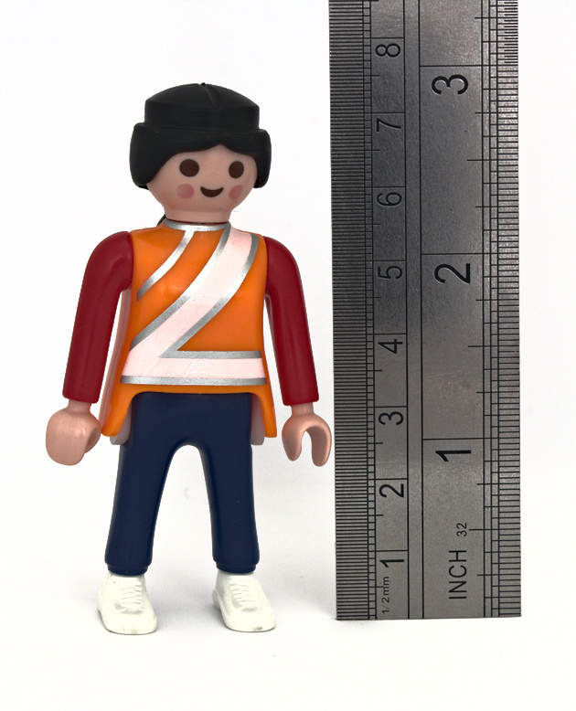
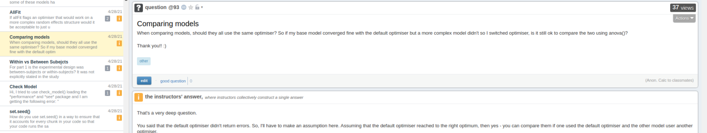
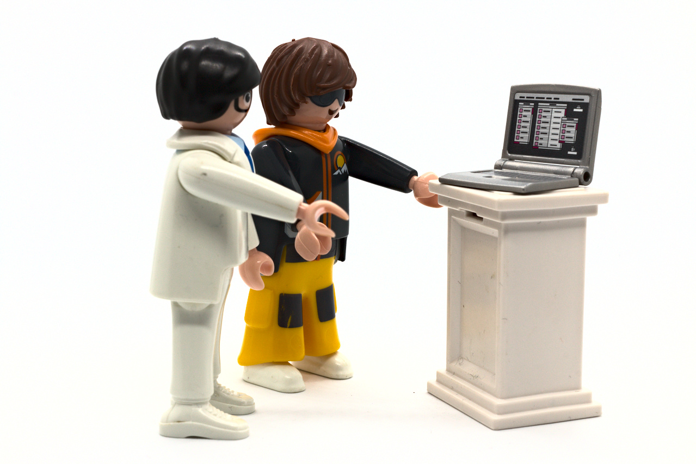

```{r setup, include=FALSE}
options(htmltools.dir.version = FALSE)
options(digits=4,scipen=2)
options(knitr.table.format="html")
xaringanExtra::use_xaringan_extra(c("tile_view","animate_css","tachyons"))
xaringanExtra::use_extra_styles(
  mute_unhighlighted_code = FALSE
)
library(tidyverse)
library(ggplot2)
source('R/pres_theme.R')
knitr::opts_chunk$set(
  dev = "svg",
  warning = FALSE,
  message = FALSE
)
```

```{r xaringan-themer, include = FALSE}
library(xaringanthemer)
style_mono_accent(
  #base_color = "#0F4C81", # DAPR1
  # base_color = "#BF1932", # DAPR2
  # base_color = "#88B04B", # DAPR3 
  base_color = "#FCBB06", # USMR
  # base_color = "#a41ae4", # MSMR
  header_color = "#000000",
  header_font_google = google_font("Source Sans Pro"),
  header_font_weight = 400,
  text_font_google = google_font("Source Sans Pro", "400", "400i", "600", "600i"),
  code_font_google = google_font("Source Code Pro")
)
```

class: center, middle
# Welcome to USMR

---
# Univariate Statistics...

```{r hdataH,include=FALSE}
load('R/heights.Rdata')
heights <- heights %>% mutate(gender = ifelse(gender=='Other','NonBinary',gender))
```

```{r hadata}
heights
```

- one row represents one set of observations
???
Univariate statistics refer to statistics where there's one source of variation.

Typically in Psychology this would be the identity of the person being measured:

In the example here, height is affected by identity (different people have different heights).

As statisticians, we're interested in whether there are systematic differences beyond the individual:

For example, is height affected by gender?
---
# ...and Methodology...

.pull-left.pt4[
- how do we measure height?

- how do we determine gender?

- how do we collect data in a way that is generalisable?
]
.pull-right[

]

---
# ...Using R
.flex.items-top[
.w-65.pa2[
```{r dens, fig.show='hide'}
heights %>% ggplot(aes(x=HEIGHT,color=gender,fill=gender)) +
  geom_density(size=2,alpha=0.4)

heights_t <- heights %>% filter(gender %in% c('Male','Female'))

t.test(heights_t$HEIGHT ~ heights_t$gender)
```
]
.w-35.pa2[
`)
]]

---
# What you will learn

.pull-left[
### Statistics

- foundations of Null Hypothesis Significance Testing
- probability
- samples and distributions
- the normal and the binomial distributions
- testing for significance
  + $F$-ratio, $\chi^2$, $t$-test, others
- the linear model
- multiple linear regression
- assumptions, models, model criticism
- logit regression (generalized linear model)
]

--
.pull-right[
### R

- basic programming
- using libraries
- using an IDE (**RStudio**)
- data types
  + data manipulation
  + visualisation (graphs)
- functions
- running statisical models
- **RMarkdown**
  + literate programming
  + document creation
]

---
# Shape of the Course


.flex.items-center[.w-20.pa2[] .f2.w-80.pa2[Lectures (online)]]

.flex.items-center[.w-20.pa2[] .f2.w-80.pa2[Labs (instructions online)]]

.flex.items-center[.w-20.pa2[] .f2.w-80.pa2[Discussions and support]]

.flex.items-center[.w-20.pa2[] .f2.w-80.pa2[Assessment]]

???
As soon as we can, we'll offer discussions and help on campus.

We might be able to offer labs on campus as the situation changes, and we hope to do so.

Lectures are likely to remain online throughout the course.

---
.pull-left[
# Lectures

- broadly, about _concepts_

  + statistics
  
  + coding
  
- prerecorded, follow in your own time

  + videos
  
  + everything you need online
]

--

.pull-right[
# Labs

- broadly, _how to_

  + coding

  + data manipulation
  
  + statistics

- online workbook with instructions

  + lab work should be done in **RStudio**
  
  + can either install on your own laptop or use online
]


---
# Discussions

.tc[

]

- forums for the course on Learn

  + ask questions, share experiences, talk to the course team
  
  + an important way to keep in touch
  
---
# Live Support

<!-- FIXME image of zoom/teams session -->

.pt4.pull-left[]
.pt5.f3.pull-right[
- we are here to help you

- live sessions:  every **FIXME**

- forums: any time
]

???
we will be moving live support and help on-campus when it becomes possible

this will be the first activity to move; labs may follow

---
.flex.items-center[.w-10.pa2[] .f1.w-80.pa2[Assessment]]

<!-- FIXME -->

- check a dataset for consistency

- explore hypotheses about how variables are related
  + conduct and interpret appropriate statistical tests

- produce suitable graphics

- present your workings and conclusions in a markdown document

---
count: false
.flex.items-center[.w-10.pa2[] .f1.w-80.pa2[Assessment]]

<!-- FIXME -->

- .red[check] a dataset for consistency

- .red[explore] hypotheses about how variables are related
  + conduct and .red[interpret] appropriate statistical tests

- produce .red[suitable] graphics

- present your workings and .red[conclusions] in a markdown document

???
note that these are matters of _judgement_

statistics is not an 'exact science'

it's careful and principled story-telling
--

.br3.center.pa2.bg-red.white.f3[
Coursework submission deadline: 17 Dec 2020
]

---
# Tips for survival

1. keep on top of the coursework

1. use the forums and other forms of support whenever you need them

1. remember that some things will feel difficult at first

  + what's hard for you may be easy for others

  + what's easy for you may be hard for others
  
1. most importantly, _don't give up_

---
# Devilish stuff

.pull-left[
## doing stats


]
.pull-right[
## coding

&nbsp;

.tc.pt3[
**NB** all indices in `R` start at `1`
]]
---
# Tips for improving the course

- this is a very unusual year(!)

- we have worked hard to make this course work, but some things will undoubtedly still be improvable

- please feed back to us!
  + you can do it via email, in the forums, or anonymously using padlet (details on Learn)
  
- please bear with us!
  + we are doing our very best 

- any good course is a _conversation_ between teachers and learners
  + this year, that's more important than ever, but it will only work with your help
---
class: center, middle

# first task

## help us get to know you
---
class: inverse, center, middle, animated, heartBeat

# End of Part One

---
class: inverse, center, middle

# Part 2


# Why R?

---
# What is R?


.flex.items-center[.w-20.pa2[
]
.w-80.pa2[
- **R** is a 'statistical programming language'

- created mid-90s as a free version of **S**

- widespread adoption since v2 (2004)
]]

.flex.items-center[.w-80.pa2[
- **RStudio** is an 'integrated development environment' (IDE)

- created 2011 'to improve **R** experience'

- widespread adoption since 2012
]
.w-20.pa2[
]]

---
# R vs RStudio

### This is R
```{r this-r, eval=FALSE}
model <- lm(RT ~ (age+freq+handedness)^2, data=words)
summary(model)
```
--
.flex[.w-50[
### This is RStudio
]
.w-50[]]
---
# RMarkdown
.flex.items-center[.w-20.pa2[
]
.w-80.pa2[
- **RMarkdown** is a 'text markup language'

- created 2012 as a markup language for **R**

- widespread adoption since 2015
]]

---
# RMarkdown
.flex.w-100.bg-light-gray[
```
### About RMarkdown
_This_ is some **RMarkdown**, which uses 'simple' codes to mark up text.

- it can include R code like `r knitr::inline_expr("sqrt(2)")`
- it's simple to format things like bulleted lists
  + or even sublists
```
]


.pt4[
### About RMarkdown
_This_ is some **RMarkdown**, which uses 'simple' codes to mark up text.

- it can include R code like `r sqrt(2)`
- it's simple to format things like bulleted lists
  + or even sublists
]

---


- these lecture slides are created in **RStudio**, using **RMarkdown** and **R**


---
# Why use R?

.pull-left[

]
.pull-right[


.tr.f7[
https://r4stats.com/articles/popularity
]]

---
# Pride and Prejudice

.pull-left.pt4[
```{r pp, dev='svg', fig.show='hide'}
require(tm)
require(wordcloud)
# load "Pride and Prejudice"
pp <- Corpus(DirSource('R/PP/'))
pp <- tm_map(pp,stripWhitespace)
pp <- tm_map(pp,tolower)
pp <- tm_map(pp,removeWords,
             stopwords('english'))
pp <- tm_map(pp,stemDocument)
pp <- tm_map(pp,removePunctuation)
pp <- tm_map(pp, PlainTextDocument)
wordcloud(pp, scale=c(5,0.5), max.words=150,
          random.order=FALSE, rot.per=0.35,
          colors=brewer.pal(12,'Dark2'))
```
]
.pull-right[
`)
]
???
R is a multipurpose programming language with an emphasis on statistics.

It can do all of the things that any statistics package can do and much more:

Here, we're using it to visualise the frequencies with which words are used
in Jane Austen's _Pride and Prejudice_.
---
# The R Community

.left-column[
`)
]
.right-column[
- _someone else_ has done all the hard work to create wordclouds
- released as libraries or **packages** (like `lme4` and `tidyverse`)
- all I supplied was a text version of _Pride and Prejudice_

.pt3[
- **R** allows you to do _anything_ with data
- if it's useful, chances are someone has already done it
- useful things include statistics!
]]


---
**FIXME**

---
class: inverse, center, middle

# Part 3

.pt3[

]
???
in part 3 we're going to look at probability, starting with a couple of dice


---
# How likely are you to throw 12?

- one way to find out:  throw two dice many times and count the outcomes

- first we need some dice

```{r dice}
dice <- function(num=1) {
  sample(1:6, num, replace=TRUE)
}

dice()
```
--
```{r dice2}
dice(2)
```
--
```{r dice3}
sum(dice(2))
```

---
# Throw two dice many times
```{r dice4}
replicate(500,sum(dice(2)))
```

---
# Make a graph

```{r dice5, fig.asp=.6}
d <- data.frame(dice=replicate(500,sum(dice(2))))
ggplot(d,aes(dice)) + geom_bar() + scale_x_continuous(breaks=1:12)
```


---
# Many more throws
```{r dice6, fig.asp=.6}
d <- data.frame(dice=replicate(10000,sum(dice(2)))) #<<
ggplot(d,aes(dice)) + geom_bar() + scale_x_continuous(breaks=1:12)
```

---
# 10,000 dice throws
.flex.items-top[
.w-20.pa2[
`)
]
.w-80.pa2[
- we can work out the proportion of throws that summed to 12

```{r dice7}
sum(d$dice == 12) / 10000
```

- and we know what that proportion should be if the dice are fair

```{r dice8}
1/36
```

]]
---
# Acknowledgements

- icons by Becris, tezar tantula, ProSymbols, Arjan Farzkenari from the [Noun Project](https://thenounproject.com/)