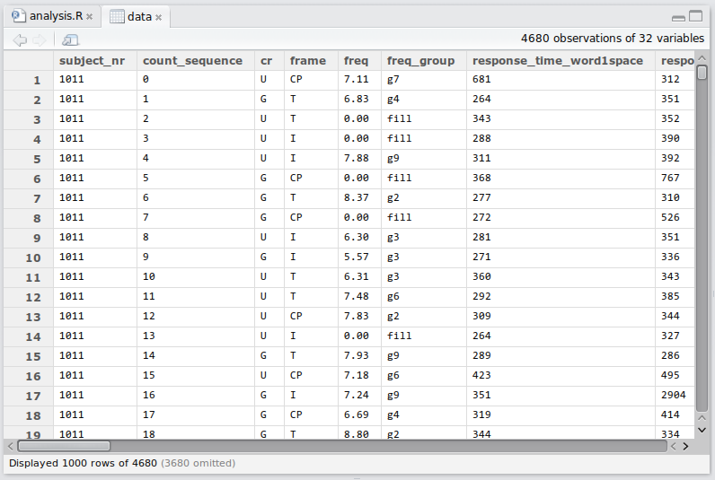
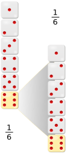

```{r setup, include=FALSE}
options(htmltools.dir.version = FALSE)
options(digits=4,scipen=2)
options(knitr.table.format="html")
xaringanExtra::use_xaringan_extra(c("tile_view","animate_css","tachyons"))
xaringanExtra::use_extra_styles(
  mute_unhighlighted_code = FALSE
)
library(tidyverse)
library(ggplot2)
source('R/pres_theme.R')
knitr::opts_chunk$set(
  dev = "svg",
  warning = FALSE,
  message = FALSE,
  cache = TRUE
)
source('R/myfuncs.R')
```

```{r xaringan-themer, include = FALSE}
library(xaringanthemer)
style_mono_accent(
  #base_color = "#0F4C81", # DAPR1
  # base_color = "#BF1932", # DAPR2
  # base_color = "#88B04B", # DAPR3 
  base_color = "#FCBB06", # USMR
  # base_color = "#a41ae4", # MSMR
  header_color = "#000000",
  header_font_google = google_font("Source Sans Pro"),
  header_font_weight = 400,
  text_font_google = google_font("Source Sans Pro", "400", "400i", "600", "600i"),
  code_font_google = google_font("Source Code Pro")
)
```

class: inverse, center, middle

# Part 1


# Why R? 

---
# What is R?


.flex.items-center[.w-20.pa2[
]
.w-80.pa2[
- **R** is a 'statistical programming language'

- created mid-90s as a free version of **S**

- widespread adoption since v2 (2004)
]]

.flex.items-center[.w-80.pa2[
- **RStudio** is an 'integrated development environment' (IDE)

- created 2011 'to improve **R** experience'

- widespread adoption since 2012
]
.w-20.pa2[
]]

---
# R vs RStudio

### This is R
```{r this-r, eval=FALSE}
model <- lm(RT ~ (age+freq+handedness)^2, data=words)
summary(model)
```
--
.flex[.w-50[
### This is RStudio
]
.w-50[]]
---
# RMarkdown
.flex.items-center[.w-20.pa2[
]
.w-80.pa2[
- **RMarkdown** is a 'text markup language'

- created 2012 as a markup language for **R**

- widespread adoption since 2015
]]

---
# RMarkdown
.flex.w-100.bg-light-gray[
```
### About RMarkdown
_This_ is some **RMarkdown**, which uses 'simple' codes to mark up text.

- it can include R code like `r knitr::inline_expr("sqrt(2)")`
- it's simple to format things like bulleted lists
  + or even sublists
```
]


.pt4[
### About RMarkdown
_This_ is some **RMarkdown**, which uses 'simple' codes to mark up text.

- it can include R code like `r sqrt(2)`
- it's simple to format things like bulleted lists
  + or even sublists
]

---


- these lecture slides are created in **RStudio**, using **RMarkdown** and **R**


---
class: inverse, center, middle
# What is R Good For?


---
# Managing Datasets
.center[

]

---
# Doing Statistics

```{r showmod,echo=F,comment=NA}
library(lme4)
load('R/model.Rdata')
.pp(summary(model),l = list(1:10,25:32,0))
```

---
# Publication-Quality Graphics

.center[

]

---
# Data Visualisation

.center[

]

.tr[.f6[
https://www.facebook.com/notes/facebook-engineering/visualizing-friendships/469716398919/
]]
---
### Online Interactive Visualisation
<!-- <div style="text-align:center"> -->
<iframe src="http://vac-lshtm.shinyapps.io/ncov_tracker/" width="100%" height="80%" align="center"></iframe>
<!-- </div> -->
---
# R for Anything to do with Data

.pull-left.pt4[
### Pride and Prejudice

```{r pp, dev='svg', fig.show='hide'}
require(tm)
require(wordcloud)
# load "Pride and Prejudice"
pp <- Corpus(DirSource('R/PP/'))
pp <- tm_map(pp,stripWhitespace)
pp <- tm_map(pp,tolower)
pp <- tm_map(pp,removeWords,
             stopwords('english'))
pp <- tm_map(pp,stemDocument)
pp <- tm_map(pp,removePunctuation)
pp <- tm_map(pp, PlainTextDocument)
wordcloud(pp, scale=c(5,0.5), max.words=150,
          random.order=FALSE, rot.per=0.35,
          colors=brewer.pal(12,'Dark2'))
```
]
.pull-right[
`)
]
???
R is a multipurpose programming language with an emphasis on statistics.

It can do all of the things that any statistics package can do and much more:

Here, we're using it to visualise the frequencies with which words are used
in Jane Austen's _Pride and Prejudice_.
---
# The R Community

.left-column[
`)
]
.right-column[
- _someone else_ has done all the hard work to create wordclouds
- released as libraries or **packages** (like `lme4` and `tidyverse`)
- all I supplied was a text version of _Pride and Prejudice_

.pt3[
- **R** allows you to do _anything_ with data
- if it's useful, chances are someone has already done it
- useful things include statistics!
]]

---
# The R Community

- if it serves no purpose, chances are that someone's already done it too
```{r cowsay}
library(cowsay)
say("hello USMR")
```

---
# Why Use R?

.pt4[
- because it's a _language_, I can easily show you what I did and you can copy it

- because it's a _language_, statisticians can use it to implement leading-edge stats

- because it's _free_, anyone can use it---and anyone can access your research

- because it's _open source_, anyone can fix or improve `R`
]

---
<!-- HERE HERE HERE HERE HERE -->

# Devilish stuff

.pull-left[
## doing stats


]
.pull-right[
## coding

&nbsp;

.tc.pt3[
**NB** all indices in `R` start at `1`
]]
---
# Why use R??

.pull-left[

]
.pull-right[


.tr.f7[
https://r4stats.com/articles/popularity
]]


---
class: inverse, center, middle, animated, heartBeat

# End of Part 1

---
class: inverse, center, middle

# Part 2

## Getting to Grips with R

---
# Basic Types of Data

.flex.items-center[
.w-70.pa2[
- **Nominal**

  ('names of things': e.g., hair colour)
  
- **Ordinal**

  (order, no number: e.g., small-medium-large)
  
- **Interval**

  (number without a true zero: e.g., body temp in ℃)

- **Ratio**

  (number with a true zero: e.g., height)
]
.w-30.pa2[

]]
---
# NOIR in R

.pull-left[
```{r, echo=FALSE}
library(gt)
t <- tibble(Type=c('Nominal','Ordinal','Interval','Ratio'),
            `R Variable Type`=c('character/factor','(ordered factor)','number','number'),
            Example=c('hair colour','size','body temperature','height')
)
t %>% gt()
```
]

--

.pull-right[
```{r}
hairColour <- c("brown", "white", "black")
hairColour # character
as.factor(hairColour) # factor

bodyTemp <- c(37.8,0,37.4)
bodyTemp
```

- note: it's up to us to us to interpret the units

]

---

class: inverse, center, middle, animated, heartBeat

# End of Part 2
---
class: inverse, center, middle

# Part 3

.pt3[

]
???
in part 3 we're going to look at probability, starting with a couple of dice


---
## How likely are you to throw 12 with two dice?

.left-column[

]
.right-column[
- pretty easy to work out

- one-in-six chance of throwing a six

- one-in-six chance of throwing a second six

  + NB., these observations are _independent_
  + (wouldn't matter if you threw one dice twice or two dice together)
  
- $\frac{1}{36}$ chance of throwing two sixes
]


---
# Are my dice fair?

- one way to find out:  throw two dice many times and count the outcomes

.center[
```{r justg, echo=FALSE, fig.asp=.55}
d <- data.frame(dice=replicate(20,sum(sample(1:6,2,replace=T))))
d %>% ggplot(aes(x=dice)) + geom_bar() + scale_x_continuous(breaks=1:12,name = 'sum of dice',limits = c(2,12)) +
  ggtitle('20 throws of 2 dice')
```
]

---
# What would fair dice look like?

.pull-left[

]
.pull-right[

- we need a lot of throws

- first rule of coding: be lazy

- let the computer do the work
]

---
# Using RStudio

.center[

]

---
count: false
# Using RStudio

.center[

]


---
class: center, middle

## create some dice

???
- show creating a project

- markdown; call project **dice**

- first show `1:6`

- then `sample(1:6, 1)`

- then help for `sample()`

- then `sample(1:6, 2, replace=T)`

- then `sum(sample(1:6,2,replace=T))`

- then make a `dice(num=1)` function which returns the sum, for default 1
---
# Now we can throw dice a _lot_ of times

```{r dice}
dice <- function(num=1) {
  sum(sample(1:6, num, replace=TRUE))
}

dice()
```
--
```{r dice2}
dice(2)
```

---
# Throw two dice many times
```{r dice4}
replicate(250,dice(2))
```
--

- ...and record the result

```{r dice 5}
d <- replicate(250,dice(2))
```
???
- actually, `d` won't contain the same numbers as you see on the slide

---
# Make a graph

```{r dice5}
table(d)
```

---
count: false
# Make a graph
```{r dice5a, fig.asp=.6}
barplot(table(d))
```

---
# Many more throws

```{r dice6, fig.asp=.6}
d <- replicate(10000,dice(2))
barplot(table(d))
```
---
# 10,000 dice throws
.flex.items-top[
.w-20.pa2[
`)
]
.w-80.pa2[
- we can work out the proportion of throws that summed to 12

```{r dice7}
sum(d == 12) / 10000
```

- and we know what that proportion should be if the dice are fair

```{r dice8}
1/36
```

]]

---
# Some more (fake) dice throws

.center[
```{r fdice, fig.asp=.5, echo=FALSE}
d <- tibble(dice=replicate(10000,sum(sample(1:6,2,T,c(rep(.164,5),.21)))))
d <- d %>% mutate(c = ifelse(dice==12,'a','b'))
d %>% ggplot(aes(x=dice,fill=c)) + geom_bar() +
  scale_fill_manual('legend',values=c('a'='red','b'='darkgrey')) +
  theme(legend.position = "none") +
  scale_x_continuous(breaks=1:12,name = 'sum of dice')
```
]

.br3.center.pa2.bg-green.white.f4[
are the patterns from the dice _different enough_ from what we would expect from fair dice for us to conclude that they're unfair?
]

---
# Statistical questions


- so the million-dollar question is:

.

---
class: inverse, center, middle, animated, heartBeat

# End

---
# Acknowledgements

- icons by Becris, tezar tantula, ProSymbols, Arjan Farzkenari from the [Noun Project](https://thenounproject.com/)