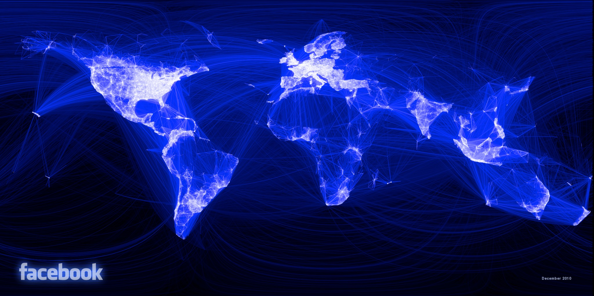
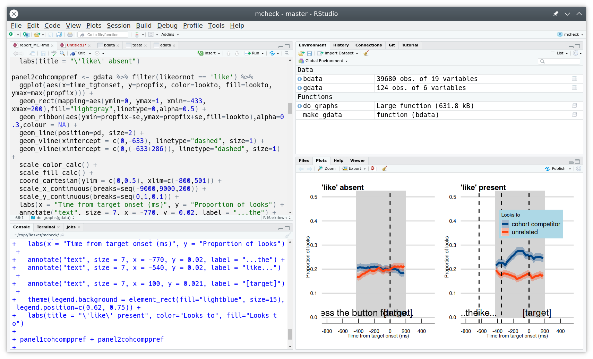

```{r setup, include=FALSE}
options(htmltools.dir.version = FALSE)
options(digits=4,scipen=2)
options(knitr.table.format="html")
xaringanExtra::use_xaringan_extra(c("tile_view","animate_css","tachyons"))
xaringanExtra::use_extra_styles(
  mute_unhighlighted_code = FALSE
)
library(tidyverse)
library(ggplot2)
source('R/pres_theme.R')
knitr::opts_chunk$set(
  dev = "svg",
  warning = FALSE,
  message = FALSE,
  cache = TRUE
)
source('R/myfuncs.R')
```

```{r xaringan-themer, include = FALSE}
library(xaringanthemer)
style_mono_accent(
  #base_color = "#0F4C81", # DAPR1
  # base_color = "#BF1932", # DAPR2
  # base_color = "#88B04B", # DAPR3 
  base_color = "#FCBB06", # USMR
  # base_color = "#a41ae4", # MSMR
  header_color = "#000000",
  header_font_google = google_font("Source Sans Pro"),
  header_font_weight = 400,
  text_font_google = google_font("Source Sans Pro", "400", "400i", "600", "600i"),
  code_font_google = google_font("Source Code Pro")
)
```

class: inverse, center, middle

# Part 1


# Why R? 

---
# What is R?


.flex.items-center[.w-20.pa2[
]
.w-80.pa2[
- **R** is a 'statistical programming language'

- created mid-90s as a free version of **S**

- widespread adoption since v2 (2004)
]]

.flex.items-center[.w-80.pa2[
- **RStudio** is an 'integrated development environment' (IDE)

- created 2011 'to improve **R** experience'

- widespread adoption since 2012
]
.w-20.pa2[
]]

---
# R vs RStudio

### This is R
```{r this-r, eval=FALSE}
model <- lm(RT ~ (age+freq+handedness)^2, data=words)
summary(model)
```
--
.flex[.w-50[
### This is RStudio
]
.w-50[]]
---
# RMarkdown
.flex.items-center[.w-20.pa2[
]
.w-80.pa2[
- **RMarkdown** is a 'text markup language'

- created 2012 as a markup language for **R**

- widespread adoption since 2015
]]

---
# RMarkdown
.flex.w-100.bg-light-gray[
```
### About RMarkdown
_This_ is some **RMarkdown**, which uses 'simple' codes to mark up text.

- it can include R code like `r knitr::inline_expr("sqrt(2)")`
- it's simple to format things like bulleted lists
  + or even sublists
```
]


.pt4[
### About RMarkdown
_This_ is some **RMarkdown**, which uses 'simple' codes to mark up text.

- it can include R code like `r sqrt(2)`
- it's simple to format things like bulleted lists
  + or even sublists
]

---


- these lecture slides are created in **RStudio**, using **RMarkdown** and **R**


---
class: inverse, center, middle
# What is R Good For?


---
# Managing Datasets
.center[

]

---
# Doing Statistics

```{r showmod,echo=F,comment=NA}
library(lme4)
load('R/model.Rdata')
.pp(summary(model),l = list(1:10,25:32,0))
```

---
# Publication-Quality Graphics

.center[

]

---
# Data Visualisation

.center[

]

.tr[.f6[
https://www.facebook.com/notes/facebook-engineering/visualizing-friendships/469716398919/
]]
---
### Online Interactive Visualisation
<!-- <div style="text-align:center"> -->
<iframe src="http://vac-lshtm.shinyapps.io/ncov_tracker/" width="100%" height="80%" align="center"></iframe>
<!-- </div> -->
---
# R for Anything to do with Data

.pull-left.pt4[
### Pride and Prejudice

```{r pp, dev='svg', fig.show='hide'}
require(tm)
require(wordcloud)
# load "Pride and Prejudice"
pp <- Corpus(DirSource('R/PP/'))
pp <- tm_map(pp,stripWhitespace)
pp <- tm_map(pp,tolower)
pp <- tm_map(pp,removeWords,
             stopwords('english'))
pp <- tm_map(pp,stemDocument)
pp <- tm_map(pp,removePunctuation)
pp <- tm_map(pp, PlainTextDocument)
wordcloud(pp, scale=c(5,0.5), max.words=150,
          random.order=FALSE, rot.per=0.35,
          colors=brewer.pal(12,'Dark2'))
```
]
.pull-right[
`)
]
???
R is a multipurpose programming language with an emphasis on statistics.

It can do all of the things that any statistics package can do and much more:

Here, we're using it to visualise the frequencies with which words are used
in Jane Austen's _Pride and Prejudice_.
---
# The R Community

.left-column[
`)
]
.right-column[
- _someone else_ has done all the hard work to create wordclouds
- released as libraries or **packages** (like `lme4` and `tidyverse`)
- all I supplied was a text version of _Pride and Prejudice_

.pt3[
- **R** allows you to do _anything_ with data
- if it's useful, chances are someone has already done it
- useful things include statistics!
]]

---
# The R Community

- if it serves no purpose, chances are that someone's already done it too
```{r cowsay}
library(cowsay)
say("hello USMR")
```

---
# Why Use R?

.pt4[
- because it's a _language_, I can easily show you what I did and you can copy it

- because it's a _language_, statisticians can use it to implement leading-edge stats

- because it's _free_, anyone can use it---and anyone can access your research

- because it's _open source_, anyone can fix or improve `R`
]

---
<!-- HERE HERE HERE HERE HERE -->

# Devilish stuff

.pull-left[
## doing stats


]
.pull-right[
## coding

&nbsp;

.tc.pt3[
**NB** all indices in `R` start at `1`
]]
---
# Why use R??

.pull-left[

]
.pull-right[


.tr.f7[
https://r4stats.com/articles/popularity
]]


---
class: inverse, center, middle, animated, heartBeat

# End of Part 1

---
class: inverse, center, middle

# Part 2

## Getting to Grips with R

---

# Data in R

- you can type **data** directly in to R
```{r d1}
# a number
1.2
# characters (a string)
"fáilte"
```

- and you can do **operations** on data

```{r d2}
1.2 + 7 * 2
```
???
by "data" we really mean anything that is measured *outside* R and provided to R directly
---
# Variables

.left-column[

]
.right-column[
- you can assign data to **variables**
```{r d3}
bodyTemp <- 37.8
```
- and use those variables
```{r d4}
bodyTemp * (9/5) + 32 # to Fahrenheit
```
- **NB** spelling/capitalization matter
```{r d5, error=TRUE}
BodyTemp - 37
```

]
---
# Statistics is about **groups** of things

.flex.items-center[
.w-70.pa2[
```{r d6}
allTemps <- c(37.8, 0, 37.4)

# vector maths
allTemps * (9/5) + 32
```


.pt2[
- note the **vectorization** of the calculation

- R is designed from the bottom up to deal with groups

]]
.w-30.pa2[

]]

---
# Not everything is a number

.flex.items-center[
.w-70.pa2[
```{r d7}
allHair <- c("brown","white","black")
allHair
```
- these are called **character strings**
  + can be anything
- **categories** (nominal data) are from a limited set
  + called **factors** in R
```{r d8}
as.factor(allHair)
```
]
.w-30.pa2[

]]


---
# Basic types of data (stats)

.flex.items-center[
.w-70.pa2[
- **Nominal**

  ('names of things': e.g., hair colour)
  
- **Ordinal**

  (order, no number: e.g., small-medium-large)
  
- **Interval**

  (number without a true zero: e.g., body temp in ℃)

- **Ratio**

  (number with a true zero: e.g., height)
]
.w-30.pa2[

]]
---
# NOIR in R

.flex.items-center[.w-40.pa1[
```{r, echo=FALSE}
library(gt)
t <- tibble(Type=c('Nominal','Ordinal','Interval','Ratio'),
            `R Variable Type`=c('character/factor','number','number','number')
)
t %>% gt()
```
]


.w-60.pa1[
- nominal
```{r d9}
allHair <- as.factor(c("brown", "white", "black"))
allHair
```

- interval
```{r da}
allTemps <- c(37.8, 0, 37.4)
allTemps
```


]]

--

.flex.items-center[
.w-5.pa1[

]
.w-95.pa1[
- ordinal data can also be represented as **ordered factors** (`as.ordered()`)
]]
???
this is the first time I've used this symbol, which means "dangerous bend in the road"

I'm going to use it when there's something additional that you really don't need to know but I can't help myself telling you
---
# Break it down
```{r bid}
allHair <- c("brown","white","black")
```

.flex.items-center[
.w-30.f3[
`allHair`
]
.w-70[
- **variable** (can be anything that isn't _reserved_)
]]
.flex.items-center[
.w-30.f3[
`<-`
]
.w-70[
- **assignment** ("goes in to")
]]
.flex.items-center[
.w-30.f3[
`c()`
]
.w-70[
- **function** (`c()` _combines_ its **arguments**)
]]
.flex.items-center[
.w-30.f3[
`"brown"`
]
.w-70[
- **character** (arbitrary sequence of symbols)
]]

---
# Dataframes

.flex.items-center[
.w-70.pa2[
- data can be grouped into a **dataframe**
- each _line_ represents one set of observations
- each _column_ represents one type of information
  + (a bit like a spreadsheet)
```{r df}
people <- data.frame(name=c('Johanna','Casper','Steve'),
                     temp=allTemps,
                     hair=as.factor(allHair),
                     height=c(132,205,181))
people
```
]
.w-30.pa2[

]]

???
- note that I've made _hair_ a factor but left _names_ as character strings.

- that's because, in my world, there is a finite set of hair colours, but a name can be anything:  it's an arbitrary label.

- you'll see the effect of this in the next slide.
---
# Can you run an **function** on a **dataframe**?

- youbetcha!

```{r df2}
summary(people)
```

- or on a vector
```{r db}
mean(people$temp) # just the temp column from people
```
???
note the difference between the name column ("there are some strings") and the hair column ("I know there are categories:  this is how many of each you have")
---
# We know a little about R

- we've seen some R code

- we know about basic data types

- we know what variables are

- we've seen vectors, and dataframes

- we've seen a couple of examples of functions

???
time for a break!

---
class: inverse, center, middle, animated, heartBeat

# End of Part 2
---
class: inverse, center, middle

# Part 3

.pt3[

]
???
in part 3 we're going to look at probability, starting with a couple of dice


---
## How likely are you to throw 12 with two dice?

.left-column[

]
.right-column[
- pretty easy to work out

- one-in-six chance of throwing a six

- one-in-six chance of throwing a second six

  + NB., these observations are _independent_
  + (wouldn't matter if you threw one dice twice or two dice together)
  
- $\frac{1}{36}$ chance of throwing two sixes
]


---
# Are my dice fair?

- one way to find out:  throw two dice many times and count the outcomes

.center[
```{r justg, echo=FALSE, fig.asp=.55}
d <- data.frame(dice=replicate(20,sum(sample(1:6,2,replace=T))))
d %>% ggplot(aes(x=dice)) + geom_bar() + scale_x_continuous(breaks=1:12,name = 'sum of dice',limits = c(2,12)) +
  ggtitle('20 throws of 2 dice')
```
]

---
# What would fair dice look like?

.pull-left[

]
.pull-right[

- we need a lot of throws

- first rule of coding: be lazy

- let the computer do the work
]

---
# Using RStudio

.center[

]

---
count: false
# Using RStudio

.center[

]


---
class: center, middle

## create some dice

???
- show creating a project

- markdown; call project **dice**

- first show `1:6`

- then `sample(1:6, 1)`

- then help for `sample()`

- then `sample(1:6, 2, replace=T)`

- then `sum(sample(1:6,2,replace=T))`

- then make a `dice(num=1)` function which returns the sum, for default 1
---
# Now we can throw dice a _lot_ of times

```{r dice}
dice <- function(num=1) {
  sum(sample(1:6, num, replace=TRUE))
}

dice()
```
--
```{r dice2}
dice(2)
```

---
# Throw two dice many times
```{r dice4}
replicate(250,dice(2))
```
--

- ...and record the result

```{r dice 5}
d <- replicate(250,dice(2))
```
???
- actually, `d` won't contain the same numbers as you see on the slide

---
# Make a graph

```{r dice5}
table(d)
```

---
count: false
# Make a graph
```{r dice5a, fig.asp=.6}
barplot(table(d))
```

---
# Many more throws

```{r dice6, fig.asp=.6}
d <- replicate(10000,dice(2))
barplot(table(d))
```
---
# 10,000 dice throws
.flex.items-top[
.w-20.pa2[
`)
]
.w-80.pa2[
- we can work out the proportion of throws that summed to 12

```{r dice7}
sum(d == 12) / 10000
```

- and we know what that proportion should be if the dice are fair

```{r dice8}
1/36
```

]]

---
# Some more (fake) dice throws

.center[
```{r fdice, fig.asp=.5, echo=FALSE}
d <- tibble(dice=replicate(10000,sum(sample(1:6,2,T,c(rep(.164,5),.21)))))
d <- d %>% mutate(c = ifelse(dice==12,'a','b'))
d %>% ggplot(aes(x=dice,fill=c)) + geom_bar() +
  scale_fill_manual('legend',values=c('a'='red','b'='darkgrey')) +
  theme(legend.position = "none") +
  scale_x_continuous(breaks=1:12,name = 'sum of dice')
```
]

.br3.center.pa2.bg-green.white.f4[
are the patterns from the dice _different enough_ from what we would expect from fair dice for us to conclude that they're unfair?
]

---
# Statistical questions


- so the million-dollar question is a _negative_ question

.br3.center.pa2.pt4.bg-green.white.f4[
are we dissatisfied with the suggestion that the pattern of results we have observed should be attributed to chance?
]

.pt2[
- if we are, then maybe we can persuade you of a different explanation

- but note that the different explanation is not _proven_, it's _suggested_
]


---
class: inverse, center, middle, animated, heartBeat

# End

---
# Acknowledgements

- icons by Diego Lavecchia from the [Noun Project](https://thenounproject.com/)