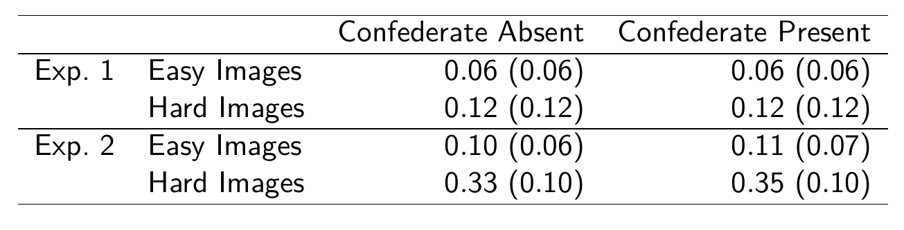
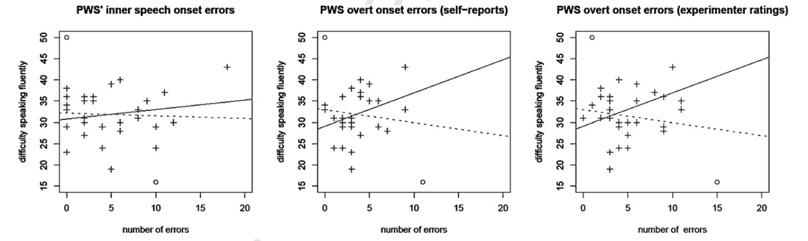

```{r setup, include=FALSE}
options(htmltools.dir.version = FALSE)
options(digits=4,scipen=2)
options(knitr.table.format="html")
xaringanExtra::use_xaringan_extra(c("tile_view","animate_css","tachyons"))
xaringanExtra::use_extra_styles(
  mute_unhighlighted_code = FALSE
)
library(knitr)
library(tidyverse)
library(ggplot2)
source('R/pres_theme.R')
knitr::opts_chunk$set(
  dev = "svg",
  warning = FALSE,
  message = FALSE
)
source('R/myfuncs.R')
```

```{r xaringan-themer, include = FALSE}
library(xaringanthemer)
style_mono_accent(
  #base_color = "#0F4C81", # DAPR1
  # base_color = "#BF1932", # DAPR2
  # base_color = "#88B04B", # DAPR3 
  base_color = "#FCBB06", # USMR
  # base_color = "#a41ae4", # MSMR
  header_color = "#000000",
  header_font_google = google_font("Source Sans Pro"),
  header_font_weight = 400,
  text_font_google = google_font("Source Sans Pro", "400", "400i", "600", "600i"),
  code_font_google = google_font("Source Code Pro")
)
```

class: inverse, center, middle
# Part 1
## ANOVA and GLM

---
# ANOVA and GLM

> If you should say to a mathematical statistician that you have discovered that linear multiple regression and the analysis of variance (and covariance) are identical systems, he would mutter something like "Of course&mdash;general linear model," and you might have trouble maintaining his attention.  If you should say this to a typical psychologist, you would be met with incredulity, or worse.  Yet it is true, and in its truth lie possibilities for more relevant and therefore more powerful research data.
.tr[
Cohen (1968)
]

---
# History

.pull-left[
.br3.pa2.bg-gray.white[
### .white[Multiple Regression]

- introduced c. 1900 in biological and behavioural sciences

- aligned to "natural variation" in observations

- tells us that means $(\bar{y})$ are related to groups $(g_1,g_2,\ldots,g_n)$
]]
.pull-right[
.br3.pa2.bg-gray.white[
### .white[ANOVA]

- introduced c. 1920 in agricultural research

- aligned to experimentation and manipulation

- tells us that groups $(g_1,g_2,\ldots,g_n)$ have different means $(\bar{y})$
]]

.pt2[
- both produce $F$-ratios, discussed in different language, but identical
]
---
# Why Teach GLM/Regression?

- GLM has less restrictive assumptions

  + especially true for unbalanced designs/missing data
  
- GLM is far better at dealing with covariates

  + can arbitrarily mix continuous and discrete predictors
  
- GLM is the gateway to other powerful tools

  + mixed models and factor analysis (→ MSMR)

  + structural equation models

---
# ANOVA in R

.pull-left.center[
```{r makedat-again,echo=F}
library(gt)
doit <- 1
while (doit) {
  toys <- tibble(type=gl(2,1,10,labels=c('playmo','zing')),UTILITY=round(runif(10,0,10),1))
  tt <- toys %>% group_by(type) %>% summarise(mean=mean(UTILITY))
  if (tt$mean[1] <= tt$mean[2]) {
    next
  }
  if (t.test(UTILITY~type,data=toys)$p.value < .05)
  {
    doit <- 0
  }
}
### adding lego
t1 <- toys %>% filter(type=='playmo')
doit <- 1
while (doit) {
  t2 <- tibble(type="lego",UTILITY=round(runif(5,0,10),1))
  if (mean(t1$UTILITY) > mean(t2$UTILITY) && t.test(t1$UTILITY,t2$UTILITY,data=toys)$p.value < .05)
  {
    doit <- 0
  }
}
toys <- toys %>% full_join(t2)
toys <- toys %>% group_by(type) %>% mutate(id=1:n()) %>% ungroup() %>% arrange(id,desc(type)) %>% select(-id) %>% mutate(type=as_factor(type))

head(toys,10) %>% gt()
```
]
.pull-right[

]

---
# GLM vs ANOVA

```{r lmod}
l.mod <- lm(UTILITY~type, data=toys)
anova(l.mod) #<<
a.mod <- aov(UTILITY~type, data=toys)
summary(a.mod) #<<
```


---
# GLM vs ANOVA

```{r lm1, eval=F}
summary(l.mod) #<<
```
```{r lm2,echo=F}
.pp(summary(l.mod),l=list(0,10:13,0))
```

```{r aov1}
model.tables(a.mod) #<<
```

???
- the (default) model table shows you the differences from the grand mean, which is `r mean(toys$UTILITY)`

- so in the linear model summary the mean value for playmos is `r coef(l.mod)[1]` + `r coef(l.mod)[2]` or `r coef(l.mod)[1]+coef(l.mod)[2]`

- in the anova summary the mean value for playmos is `r mean(toys$UTILITY)` + `r model.tables(a.mod)$tables$type[2]` or `r mean(toys$UTILITY)+model.tables(a.mod)$tables$type[2]`

- however in the model table (from ANOVA) we don't know what differences are statistically significant, and we don't have diagnostics such as $R^2$

---
background-image: url(lecture_10_files/img/elephant.jpg)
background-size: cover
class: bottom, animated, fadeIn

.f1.white.pa3.tc[
Repeated Measures
]

---
# Repeated Measures

- so far, _every_ model we've looked at has been "one observation per participant"

- however, most experiments have a _structure_

- some observations are "more related" to each other than others

- for example, because they come from the same person (repeated measures)


---
&nbsp;&nbsp; .f1[Mixed Models]


.br3.bg-gray.white.pa2[
$$y_{ij}=b_{0j}+b_{1j}x_{1ij}+\epsilon_{ij}$$

.pt3[
$$b_{0j}=\gamma_{00}+\nu_{0j}$$
$$b_{1j}=\gamma_{01}+\nu_{1j}$$

]]

- relatedness accounted for by more regression equations

- all part of the linear model .right[NEXT TERM]

---
# ANOVA reading

- brief introduction: Navarro (pp. 523-534, v0.5)

- Cohen, J. (1968). Multiple Regression as a General Data-Analytic System. _Psychological Bulletin, 70,_ 426-443.

- Chapter 16 of Howell, D. C. (2002).  _Statistical Methods for Psychology,_ 5th Edn. Duxbury, CA: Duxbury Thomson Learning.
---
class: center, middle, inverse, animated, flipInY
## End of Part 1

# For Parts 2 and 3:

# please read the example coursework
---
class: center, middle, inverse
# Part 2

## Analysis and Reporting


---
# Analytical Steps

.pull-left[
1. specify research questions and hypotheses

1. operationalize variables

1. clean and prepare data

1. describe and visualize data

1. select and run statistics

1. check and test data assumptions

1. report and interpret results
]
.pull-right.center[

]

???
- these are the typical steps you would take for an analysis
---
# 1. Research Questions and Hypotheses

.pt4[
> Does time of day and speed of driving predict the blood alcohol content over and above driver's age?

- several variables "predicting" one variable

- variables need to be operationalized
]
---
# 2. Operationalize Variables

.pull-left[
### predictors (IVs)

> Age of driver (in years)

> Speed when stopped by police (mph)

- continuous

> Whether or not the incident occurred at night

- binary

]
.pull-right[
### outcome (DV)

> Blood Alcohol Content (%) as measured by breathalyser

- continuous
]

---
# 3. Clean and Prepare Data

1. are there any impossible values?

  - clean and recode them as something sensible, often `NA`
  
1. are there any outliers?

  - often can't be sure unless we've measured _influence_
  
1. are categorical variables appropriately encoded?

  - does R recognise them as `factor`s?
  
  - how are the levels labelled?  (which is the intercept level?)

---
# 4. Describe and Visualize Data

.pt4[
- descriptions depend on variable types

- `age`, `speed`: continuous → mean, SD, histogram or density?

- `nighttime`: binary → frequencies, mosaic plot?
]
---
# 5. Statistics

- **t-test**: mean difference

- **correlation**: association

- **regression**: "prediction"

.pt2[
- choice depends on relational statement in question

- calculation depends on DV type etc.
]

--

.pt2[
- how does this method treat missing data? (`na.rm=T` ?)

- what is the key output (from `summary()`, for example?)
]

---
# 6. Checking Assumptions:  Linear Models

.pull-left[
### required

- linearity of relationship

- for the _residuals_:
  + normality
  + homogeneity of variance
  + independence
]
.pull-right[
### desirable
- uncorrelated predictors

- no "bad" (overly influential) observations
]

---
# 6. Checking Assumptions:  Logit Models

.pull-left[
### required

- linearity of relationship .red[between IVs and log-odds]

- for the _residuals_:
  + .red[~~normality~~]
  + .red[~~homogeneity of variance~~]
  + independence
]
.pull-right[
### desirable
- uncorrelated predictors

- no "bad" (overly influential) observations

- .red[large samples (due to maximum likelihood fitting)]
]


---
# EXAM INFO

.pt5[
- for the exam, we do not expect a full set of assumption checks for any `glm(..., family=binomial)` regressions you do

- please provide a rationale for using these regressions based on the types of the variables you are analysing
]

---
# 6. Interpretation

.center[

]
???
- remember that statistics are no substitute for common sense

---
# 6. Interpretation (see week 9)

1. is the intercept meaningful?

  - can I make it meaningful using scaling? 
  
1. do the units of $x_n$ and $y$ aid interpretation?

  - can I help interpretability using standardisation? 

  - often useful to report $b$s and $\beta$s

1. is the coding of nominal variables sensible?

  - right intercept?
  
  - .gray[could I use a better coding?]


---
# 7. Reporting Results:  General Formatting

- primary source for psychology (and empirical linguistics) is the _American Psychology Association Publication Manual_, 7th Edn.<sup>1</sup>

- plenty of material at http://www.apastyle.org/

- there are formal ways to present statistical results

- plenty of good resources, e.g., http://my.ilstu.edu/~jhkahn/apastats.html

.footnote[
<sup>1</sup>&nbsp;most people are still using the 6th Edn.
]
---
# Reporting Results: Tables

1. if you have fewer than 2 rows/columns, you don't need a table

1. number tables sequentially and refer to them in the text

  + _table 1 contains descriptive statistics..._
  
1. be consistent in your formatting

  + consistency is more important than exactly matching APA standards
  
1. include a brief informative title/caption above the table

---
# Example Table

.center[
.f4.tl[
Table X: Proportions of trials in which participants referred disfluently to disfluency images for experiments 1 and 2.  Standard errors are given in parentheses.
]

.pt2[

]

]
---
# Reporting Results: Figures

.center.pt2[

]
---
# Reporting Results: Figures

1. figures include all illustrations that aren't tables (chart, graph, photograph, drawing...)

1. number figures sequentially and refer to them in text

  + tables and figures have different numbering
  
1. for graphs, make sure

  + axes are labelled appropriately
  
  + legends are included where necessary
  
1. include a brief informative title/caption below the figure
---
# Example Figure and Caption

.center[

.f4.tl[Figure Y: Scatterplots showing, for each PWS, total number of onset
  errors (x axis) plotted against self ratings of difficulty speaking
  fluently in 10 commonly occurring speaking situation (y axis). From
  left to right, the three plots show raw numbers of onset errors in
  (1) inner speech; (2) overt speech (self-reports); and (3) overt
  speech (experimenter ratings). The unbroken regression line depicts
  the relationship between the two variables when two outliers (marked
  with $\circ$) are excluded.]
]
---
# Reporting Results

1. don't repeat information

1. be concise

1. provide rationales for the decisions you make

1. be consistent

1. describe all your steps, but only include diagnostic information for key analyses

---
class: inverse, center, middle, animated, flipInY
# End of Part 2

---
class: inverse, center, middle
# Part 3
## Report Writing

---
background-image: url(lecture_10_files/img/playmo_goodbye.jpg)
background-size: contain

# Goodbye!
