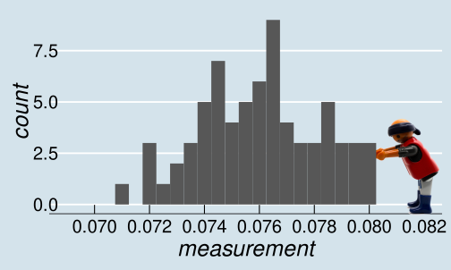

```{r setup, include=FALSE}
options(htmltools.dir.version = FALSE)
options(digits=4,scipen=2)
options(knitr.table.format="html")
xaringanExtra::use_xaringan_extra(c("tile_view","animate_css","tachyons"))
xaringanExtra::use_extra_styles(
  mute_unhighlighted_code = FALSE
)
library(knitr)
library(tidyverse)
library(ggplot2)
source('R/pres_theme.R')
knitr::opts_chunk$set(
  dev = "svg",
  warning = FALSE,
  message = FALSE,
  cache = TRUE
)
source('R/myfuncs.R')
```

```{r xaringan-themer, include = FALSE}
library(xaringanthemer)
style_mono_accent(
  #base_color = "#0F4C81", # DAPR1
  # base_color = "#BF1932", # DAPR2
  # base_color = "#88B04B", # DAPR3 
  base_color = "#FCBB06", # USMR
  # base_color = "#a41ae4", # MSMR
  header_color = "#000000",
  header_font_google = google_font("Source Sans Pro"),
  header_font_weight = 400,
  text_font_google = google_font("Source Sans Pro", "400", "400i", "600", "600i"),
  code_font_google = google_font("Source Code Pro")
)
```

class: inverse, center, middle

# Part 1

.center[

]

---
# Notch on a stick

.flex.items-center[
.w-50.pa2[

]
.w-50.pa2[

]]

---
count: false
class: middle

.br3.center.pa2.pt2.bg-gray.white.f3[
It is a truth universally acknowledged, that a single man in possession
of a good fortune, must be in want of a wife.
]


---
# Problem is...

.pull-left[
- we don't have any way of measuring accurately enough

- our measurements are likely to be _close to_ the truth

- they might vary, if we measure more than once
]
.pull-right[

]
---
# Measurement

.pull-left[

]
.pull-right[
- we might _expect_ values close to the "true" measurement to be more frequent
- something like this:

.center[
```{r sketchnorm, echo=FALSE,fig.dim=c(3,3)}
stick <- data.frame(x=rnorm(70,.076116,.0025))
stick %>% ggplot(aes(x=x)) +
  xlim(0.06,0.09) +  
  geom_density() + scale_y_continuous(breaks=NULL) +
  geom_vline(xintercept=.076116,colour="red") +
  annotate(geom="text",colour="red",x=0.0785,y=25,label="TRUE MEASURE") +
  xlab('measurement') + ylab("") + theme_presentation(16)
```
]]

???
- so let's do a thought experiment and imagine what things
would look like if lots and lots of people tried to measure
the "true" distance of the notch from the end of the stick.

- most of them would be quite competent, and we would expect
the majority of the measurements to be close to the "true" value.

- every now and again, someone would overshoot or undershoot by rather
more.

- _theoretically_ they might be completely off-beam, although the chances of being way off get vanishingly small quite quickly.
---
# Something quite familiar

.center[
```{r normnorm,echo=F,fig.asp=0.55}
t <- data.frame(x=c(0.06,0.09))
t %>% ggplot(aes(x)) +
  stat_function(fun = dnorm, n =151, args=list(mean=.076116,sd=.0025)) +
  ylab("") +
  geom_vline(xintercept = .076116,colour="red") +
  scale_y_continuous(breaks=NULL) +
  xlab("measurement")
```
]

???
- if we think a bit more about our thought experiment, we've actually described
something quite familiar:  A bell curve

- but what is a "bell curve"?

- to answer that question, let's start back where we were last week, with dice.
---
# Dice again

.center[
```{r dice, echo=FALSE,fig.asp=.6}
set.seed(13)
dice <- function(num=1) {
  sum(sample(1:6,num,replace = T))
}
t <- data.frame(x=replicate(1000,dice(2)))
t %>% ggplot(aes(x)) + geom_bar() +
  scale_x_continuous(breaks=2:12,name = 'sum of dice',limits = c(1,13)) +
  ggtitle('1000 throws of 2 dice')

```
]

???
- the height of the bars represent the numbers of times we obtain each value

- but why are the bars not touching each other?
---
# Dice throws aren't really numbers

.pull-left[
- **A** = 

- **B** =  or 

- **C** =  or  or 
]
.pull-right[
.center[
```{r dice2, echo=FALSE,fig.asp=.5}
t %>% ggplot(aes(x)) + geom_bar() +
  scale_x_continuous(breaks=2:12,labels = c('A','B','C','D','E','F','G','H','I','J','K'),
  name = 'outcome type',limits = c(1,13)) +
  ggtitle('1000 throws of 2 dice')
```
]]

.pt3[
- bar plot ("bar chart") always has gaps between bars
- represents frequencies of _discrete categories_ (`factors`)
]

???
- I could just label the possible outcomes of throwing two dice arbitrarily
  
- if you think about it, there are only 11 possible values that the sum
  of two dice can take.
  
- and if the dice didn't have actual numbers on their faces, you could still
  enumerate the outcomes

- so the outcomes are _discrete_ (you can never throw a value between 3 and 4, or between "B and C")
- and the bars on a bar plot have gaps between them to show this.
---
# Back to the Stick

- let's look at our stick measurement again

.flex.items-center[.w-30.pa2[
`r include_graphics("lecture_2_files/img/stick_numnum.png")`
]
.w-10[
&nbsp;
]
.w-30.pa2[
`r include_graphics("lecture_2_files/figure-html/sketchnorm-1.svg")`
]
.w-30.pa2[
- "true measurement" on graph _must_ be approximate
]
]

???
- the line we used to indicate the "true measure" isn't fully accurate
- we would have to draw an infinitely thin line with infinite precision
---
# Zooming In...

.pull-left[
```{r zoom, echo=FALSE, fig.asp=.6}
stick %>% ggplot(aes(x=x)) +
  xlim(0.0750,0.0770) +  
  geom_density() + scale_y_continuous(breaks=NULL) +
  xlab('measurement') + ylab("") + theme_presentation(16) +
  scale_y_continuous(expand=c(0,0),breaks=NULL) +
  geom_rect(xmin=0.07605,xmax=0.07615,ymin=0,ymax=10000,fill="red")
```
]
.pull-right[
- we are using the _width_ of the line to show measurement precision

- here, we know the value is between 0.0761 and 0.0762
  + but we can't be any more precise
]

---
# Histograms

.pull-left[
- this principle allows us to draw a _histogram_ of all the measurements taken

- the bars are touching because this represents _continuous_ data

]
.pull-right[
```{r hist1, echo=FALSE, fig.asp=0.6}
minx <- round(min(stick$x - .002),3)
maxx <- round(max(stick$x + .002),3)
p <- stick %>% ggplot(aes(x=x)) + geom_histogram(binwidth=0.001) +
  scale_x_continuous(limits=c(minx,maxx),breaks=seq(68,84,by=2)/1000) + xlab('measurement')
layD <- layer_data(p) %>% filter(x>=0.0755 & x<=0.0765)
barHt <- layD$y
p
```

]

---
count: false
# Histograms

.pull-left[
- this principle allows us to draw a _histogram_ of all the measurements taken

- the bars are touching because this represents _continuous_ data

- we know that there were `r barHt` measurements around `r layD$x`
  + strictly, between `r layD$xmin` and `r layD$xmax`
]
.pull-right[
```{r redhist, echo=FALSE, fig.asp=0.6}
p + geom_rect(xmin=layD$xmin,xmax=layD$xmax,ymin=0,ymax=barHt,fill="red")
```
]

---
# Histograms (2)

.pull-left[
- note that the _bin width_ of the histogram matters

- these show same data as on the previous slide
]
.pull-right[
```{r hist2, echo=FALSE, fig.asp=0.6}
stick %>% ggplot(aes(x=x)) + geom_histogram(binwidth=0.002) +
  scale_x_continuous(limits=c(minx,maxx),breaks=seq(68,84,by=2)/1000) + xlab('measurement')
```

]
---
count: false
# Histograms (2)

.pull-left[
- note that the _bin width_ of the histogram matters

- these show same data as on the previous slide
]
.pull-right[
```{r hist3, echo=FALSE, fig.asp=0.6}
stick %>% ggplot(aes(x=x)) + geom_histogram(binwidth=0.0005) +
  scale_x_continuous(limits=c(minx,maxx),breaks=seq(68,84,by=2)/1000) + xlab('measurement')
```

]

---
# Histograms in R

.pull-left[
```{r stix,echo=FALSE}
notches <- stick$x
```
```{r histstix, fig.asp=.6, fig.show='hide'}
head(notches) # some measurements

hist(notches)
```
]
.pull-right[
`r include_graphics('lecture_2_files/figure-html/histstix-1.svg')`
]

.flex.items-center[
.w-5.pa1[

]
.w-95.pa1[
- you can make prettier graphs using `ggplot()`
- `hist()` and friends are useful for exploring data
]]
---
class: inverse, center, middle, animated, swing

# End of Part 1
---
# Histograms

.flex.items-top[
.w-50.br3.pa2.bg-light-green[
### The Good

- way to examine the _distribution_ of data

- easy to interpret ($y$-axis = counts)

- sometimes helpful in spotting weird data

]
.w-50.br3.pa2.bg-light-red[
### The Bad

- changing bin width can completely change graph

  + can lack precision if bins too wide
  
  + can appear sparse if bins too narrow
]]

---
# Density Plots

.center[

]

- can "squeeze" the bars until they're "infinitely thin"

---
# Density Plots

.center[
```{r dense1, echo=FALSE, fig.asp=.6}
p <- stick %>% ggplot(aes(x=x)) + geom_density(size=2)
p
```
]
---
count: false
# Density Plots

.center[
```{r dense2, echo=FALSE, fig.asp=.6}
p + geom_rug()
```
]
- values are _interpolated_
- depends on a kernel (smoothing) function
---
# Density Plots

.center[
```{r dense3, echo=FALSE, fig.asp=.6,fig.width=6}
gp <- layer_data(p)
gp <- gp %>% filter(x>.0755 & x<.0765)
p + geom_area(data=gp, aes(x=x,y=y), fill="red") +
  geom_density(size=2)
```
]

- note that $y$ axis is no longer a count
- multiplied by a _range_ on the $x$ axis, gives **proportion** of cases (`r stick %>% filter(x >= .0755 & x <=.0765) %>% nrow() /70` )
- _total area_ under curve = "all possibilities" = **1**
???
- note that this isn't the whole curve, because the curve is **assymptotic**
  + tiny possibility that someone will say the distance is -1000 or 873

---
# A Famous Density Plot

.pull-left[
- when we started thinking about measurement,
  we thought things might look a bit like this

- the so-called **normal curve**

  + a hypothetical density plot
]
.pull-right[
`r include_graphics("lecture_2_files/figure-html/normnorm-1.svg")`

]
???
- in part 3, we'll look at where the normal curve comes from

- for now, let's look at some of its features
---
# Normal Curves

.center[
```{r norms, echo=FALSE, fig.asp=.6,fig.width=6}
t <- data.frame(x=c(0.06,0.09))
p <- t %>% ggplot(aes(x)) +
  stat_function(fun = dnorm, n =151, args=list(mean=.076116,sd=.0025)) +
  stat_function(fun = dnorm, n =151, args=list(mean=.076116,sd=.0035)) +
  stat_function(fun = dnorm, n =151, args=list(mean=.076116,sd=.001)) +
  ylab("") +
  geom_vline(xintercept = .076116,colour="red") +
#  scale_y_continuous(breaks=NULL) +
  xlab("measurement")
p
```
]

- normal curves are centred about the **mean** (or "true measurement")
- the area under the (asymptotic) curve is always **1**
???
- the y value here is just what is needed to ensure that the area under the is 1
---
# Standard Deviation

.pull-left[
- normal curves can be defined in terms of _two parameters_

- one is the centre or **mean** of the distribution ( $\bar{x}$, or sometimes $\mu$ )

- the other is the **standard deviation** ( $\textrm{sd}$, or sometimes $\sigma$ )

$$\textrm{sd}=\sqrt{\frac{\sum{(x-\bar{x})^2}}{n-1}}$$

]
.pull-right[
```{r annotated, echo=FALSE, fig.asp=.6}
p +
  geom_segment(aes(x=0.0761, xend=0.0761+0.001, y=250, yend=250), col="red", size=1.5) +
  geom_segment(aes(x=0.0761, xend=0.0761+0.0025, y=100, yend=100), col="red", size=1.5) +
  geom_segment(aes(x=0.0761, xend=0.0761+0.0035, y=70, yend=70), col="red", size=1.5)
```
]

.pt3.pa2[
- standard deviation is the "average distance of observations from the mean"
]
---
# The Standard Normal Curve

.pull-left[
- we can **standardize** any value on any normal curve by

- subtracting the mean
  + the effective mean is now **zero**
  
- dividing by the standard deviation
  + the effective standard deviation is now **one**
]
.pull-right[
```{r snorm, echo=FALSE, fig.asp=.6}
p <- ggplot(data=data.frame(x=c(-3.5,3.5)),aes(x=x)) +
  stat_function(fun = dnorm, n =151,size=2) + ylab("") +
  xlab("standard deviations")
p
```

$$ z_i = \frac{x_i - \bar{x}}{\sigma} $$
]
---
# Plan of attack

- barplots vs histograms

- sd?

### p2

- samples, populations

### p3

- CLT, standard deviation and standard error?


---
class: inverse, center, middle, animated, heartBeat

# End

---
# Acknowledgements

- icons by Diego Lavecchia from the [Noun Project](https://thenounproject.com/)