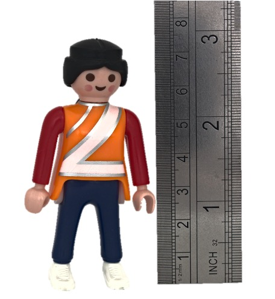
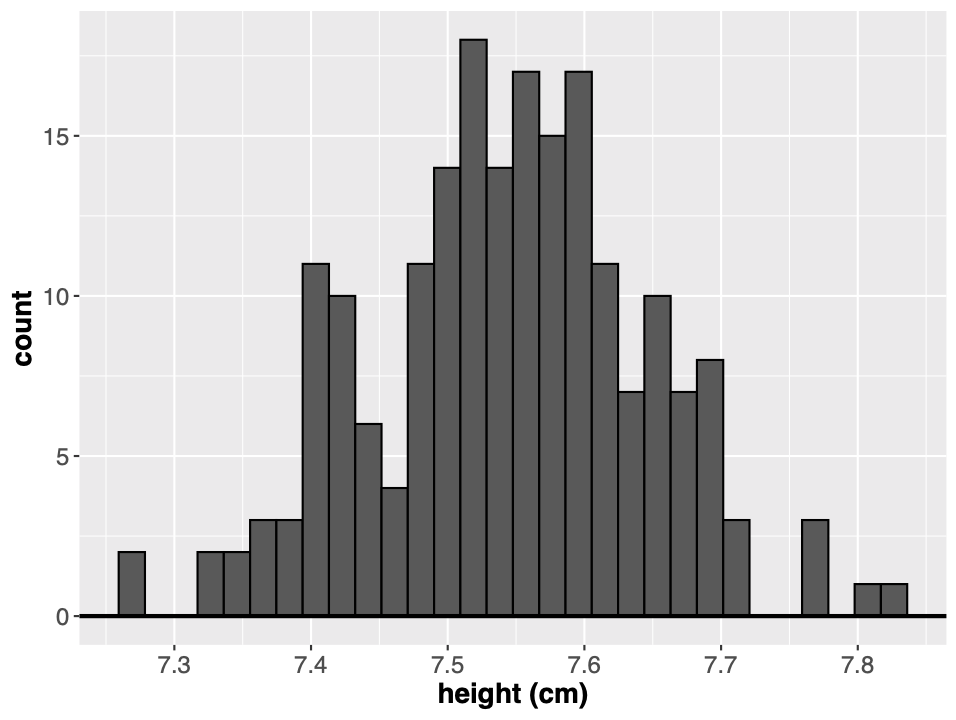
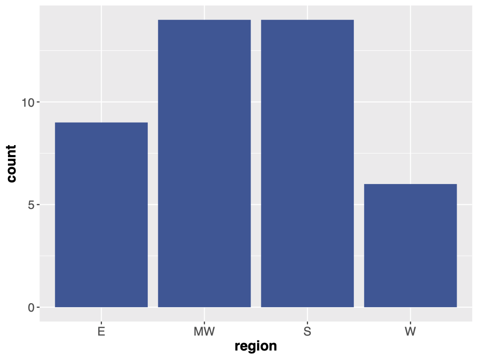
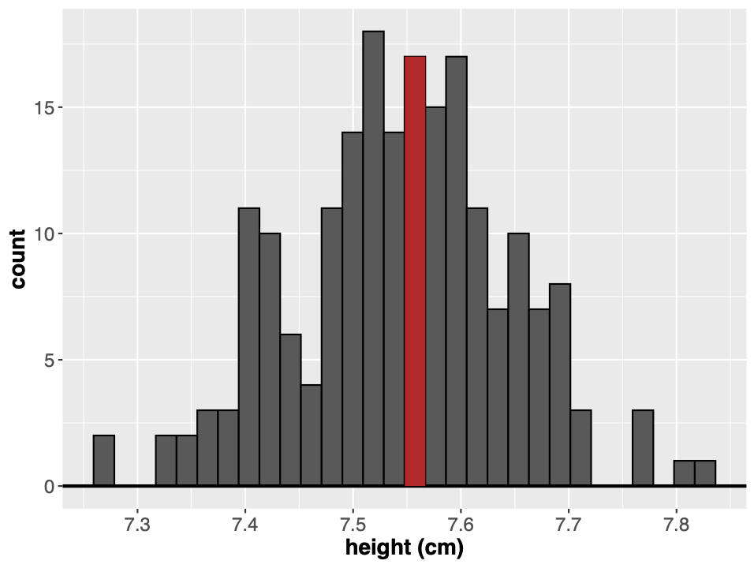
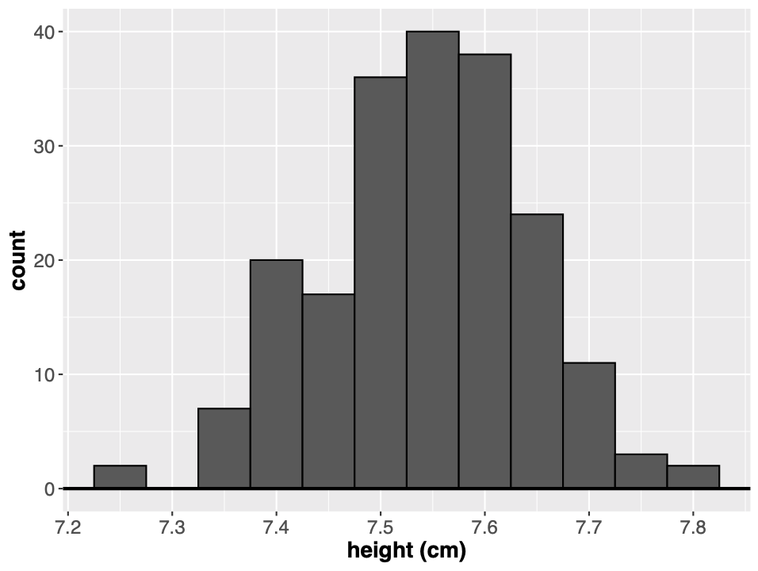
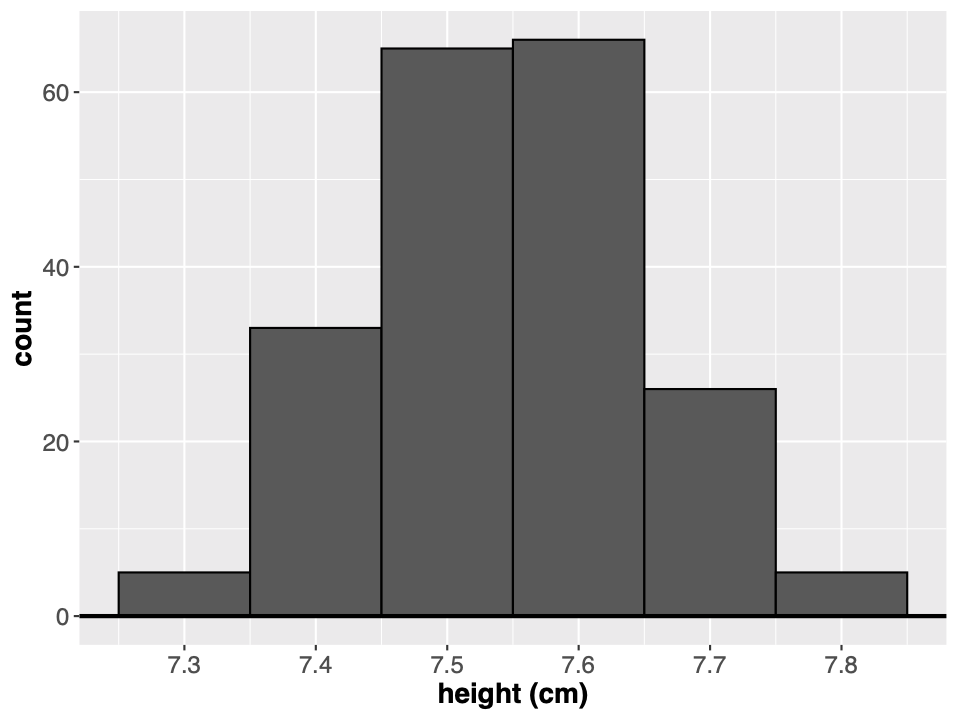
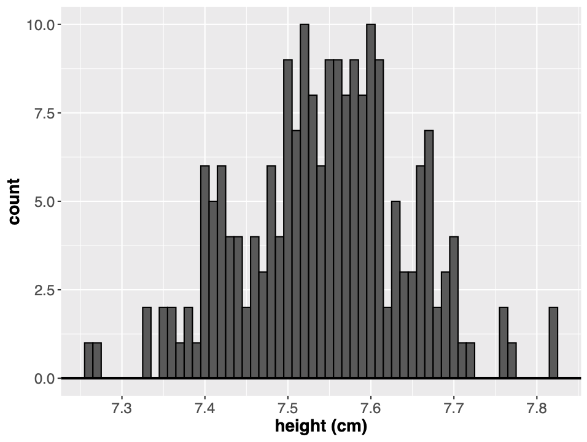
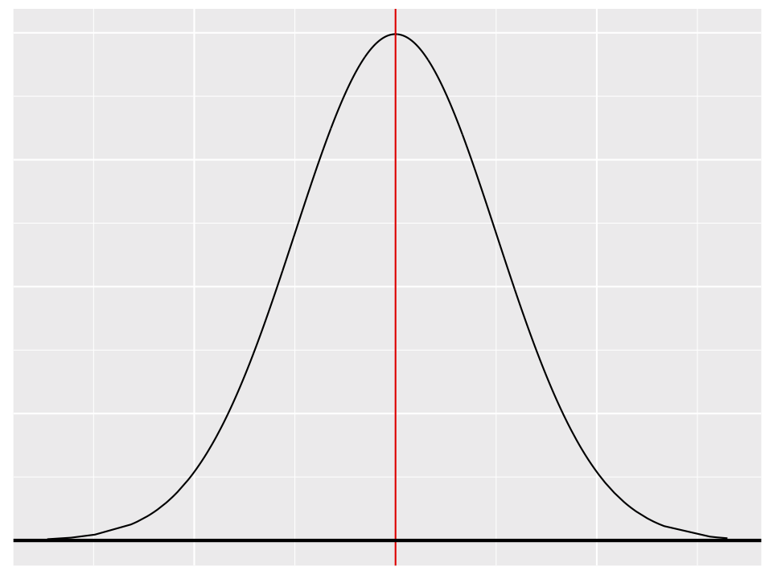
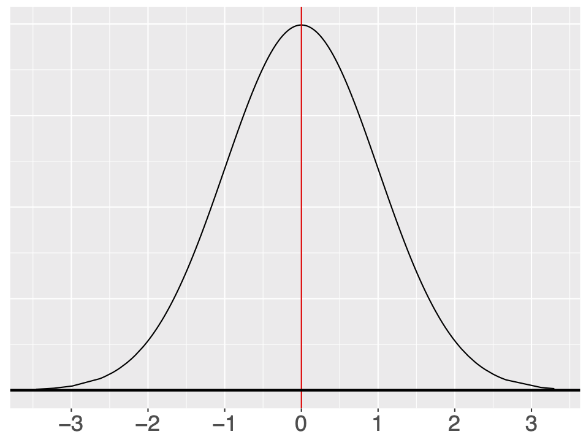

```{r setup, include=FALSE}
options(htmltools.dir.version = FALSE)
options(digits=4,scipen=2)
options(knitr.table.format="html")
xaringanExtra::use_xaringan_extra(c("tile_view","animate_css","tachyons"))
xaringanExtra::use_extra_styles(
  mute_unhighlighted_code = FALSE
)
library(knitr)
library(tidyverse)
library(ggplot2)
#source('R/pres_theme.R')
knitr::opts_chunk$set(
  dev = "svg",
  warning = TRUE,
  message = FALSE
)
source('R/myfuncs.R')
```

```{r xaringan-themer, include = FALSE}
library(xaringanthemer)
style_mono_accent(
  #base_color = "#0F4C81", # DAPR1
  # base_color = "#BF1932", # DAPR2
  # base_color = "#88B04B", # DAPR3 
  base_color = "#FCBB06", # USMR
  # base_color = "#a41ae4", # MSMR
  header_color = "#000000",
  header_font_google = google_font("Source Sans Pro"),
  header_font_weight = 400,
  text_font_google = google_font("Source Sans Pro", "400", "400i", "600", "600i"),
  code_font_google = google_font("Source Code Pro")
)
```
## Today's Key Topics
+ Histograms & Density Plots

+ The Normal Distribution

+ Populations &  Samples

+ Central Limit Theorem

---
class: inverse, center, middle

# Part 1

```{r, echo = FALSE, out.width = '40%', fig.align='center'}

```

---
# Measurement
+ When we measure something, we attempt to identify its **true measurement**, or the **ground truth**

+ The problem is that we don’t have any way of measuring accurately enough
  + Our measurements are likely to be close to the truth
  + They will likely vary if we take multiple measures

+ Let’s run a quick experiment:

```{r, echo = FALSE, out.width = '25%', fig.align='center'}

```

---
# Measurement
We might expect values close to the **true measurement** to be more frequent if we take multiple measurements:

.pull-left[
```{r, echo = FALSE, fig.align='left'}
knitr::include_graphics('lecture_2_files/img/MeasurementPlot.png')
```
]

.pull-right[
<pre>


</pre>
```{r, echo = FALSE, out.width='35%'}

```

(Though there are still limits to our precision)
]

---
# Histograms
Considering this principle, it might be useful to create a histogram of all measurements taken.

.pull-left[
```{r, echo = FALSE}

```
]

--
.pull-right[
**Note difference from a bar chart:**
+ Histogram represents **continuous** data
+ Bar Chart represents **categorical** data

```{r, echo = FALSE, out.width='70%'}

```
]

???
- the height of the bars represent the numbers of times we obtain each value

- but why are the bars not touching each other?

---
# Histograms
Considering this principle, it might be useful to create a histogram of all measurements taken.

.pull-left[
```{r, echo = FALSE}

```
]

.pull-right[
+ We know that there are 17 measurements around 7.55
+ Strictly, between 7.548 & 7.567
]


---
# Histograms in R
.pull-left[
```{r}
df <- data.frame(x=rnorm(200, mean = 7.55, sd = 0.1))
head(df)
```
]

.pull-right[
```{r, out.width='75%'}
hist(df$x)
```
]

---
# Histograms in R
.pull-left[
```{r}
df <- data.frame(x=rnorm(200, mean = 7.55, sd = 0.1))
head(df)
```
]

.pull-right[
```{r, out.width='60%%'}
library(ggplot2)
ggplot(df, aes(x)) +
  geom_histogram(colour='black')
```


<span style="color:red; font-family:monospace">stat_bin() using bins = 30. Pick better value with binwidth.</span>
]

---
# Histograms in R
Note that the bin width of the histogram matters. Every figure below displays the same data.
.pull-left[
```{r, echo=F, out.width='55%'}

```
ggplot default


```{r, echo=F, out.width='55%'}

```
binwidth = .05
]

.pull-right[
```{r, echo=F, out.width='55%'}

```
binwidth = .1


```{r, echo=F, out.width='55%'}

```
binwidth = .01
]

---
# Histograms
+ The Good
  + Way to examine the *distribution* of the data
  + Easy to interpret (*y* axis = counts)
  + Sometimes helpful in spotting weird data (**outliers**)

--
```{r, echo=F, fig.height=4, fig.width=8}
df <- data.frame(x=rnorm(200, mean = 7.55, sd = 0.1))
df$x[4] <- 2.95
ggplot(df, aes(x)) + geom_histogram(colour='black', bins = 100) + 
  labs(x='height (cm)') +
  theme(axis.text = element_text(size=12), axis.title=element_text(size=16, face='bold'))
```

---
# Histograms
+ The Good
  + Way to examine the *distribution* of the data
  + Easy to interpret (*y* axis = counts)
  + Sometimes helpful in spotting weird data (**outliers**)
  
+ The Bad
  + Only gives us information about distribution and mode; doesn't give us other information
      + E.g., the mean or median
  + Changing bin width can completely change the graph

---
# Density Plots
+ Similar to histogram in that it shows the distribution of the data

+ However, the *y* axis is no longer a count, but represents a **proportion** of cases.

+ The area under the curve is equal to 1 (or 100%, reflecting all cases)

```{r, echo=F}
df <- data.frame(x=rnorm(200, mean = 7.55, sd = 0.1))
```

.pull-left[
```{r, echo=F, out.height='70%', out.width='70%'}
ggplot(df, aes(x)) + geom_density() + 
  geom_hline(yintercept = 0) +
  labs(x='height (cm)') +
  theme(axis.text = element_text(size=12), axis.title=element_text(size=16, face='bold'))
```
]
--
.pull-right[
```{r, echo=F,out.height='70%', out.width='70%'}
ggplot(df, aes(x)) + geom_histogram(colour='black') + 
  labs(x='height (cm)') +
  theme(axis.text = element_text(size=12), axis.title=element_text(size=16, face='bold'))
```
]

???
Created using a kernel function that smooths the data

---
# Density Plots in R
```{r, echo=F}
df <- data.frame(x=rnorm(200, mean = 7.55, sd = 0.1))
```

.pull-left[
**ggplot**
```{r, out.height='70%', out.width='70%'}
ggplot(df, aes(x)) + geom_density()
```
]

.pull-right[
**base R**
```{r, out.height='70%', out.width='70%'}
densDat <- density(df$x)
plot(densDat)
```
]
---
class: inverse, center, middle

# Part 2
##The Normal Distribution

---
# The Normal Distribution
.pull-left[
+ A hypothetical density plot
  + Probability distribution of a random variable

+ Normal curves are unimodal, with values symmetrically distributed around the peak
  + Centered around the mean
  + A higher proportion of cases near the mean and a lower proportion of cases with more extreme values
]

.pull-right[
```{r, echo = FALSE}

```
]

---
# The Normal Distribution
.pull-left[
Normal curves can be defined in terms of *two parameters*:

+ The **mean** of the distribution ( $\bar{x}$, or sometimes $\mu$ )
```{r}
x <- c(22, 24, 21, 19, 22, 20)
mean(x)
```

+ The **standard deviation** of the distribution ( $\textrm{sd}$, or sometimes $\sigma$ )
```{r}
sd(x)
```
]

.pull-right[
```{r, echo = FALSE}

```
]

---
# A quick note on standard deviation
The **standard deviation** is the average distance of observations from the mean 


$$\textrm{sd}=\sqrt{\frac{\sum{(x-\bar{x})^2}}{n-1}}$$

*x* = individual observation

$\bar{x}$ = mean

n = sample size

$\sum$ = add it up
---
# How do these features affect the normal curve?

```{r, echo = F, fig.width=5, fig.height=2.75, fig.align='center'}
p1 <- ggplot(data = data.frame(x = c(-3, 3)), aes(x)) + 
  stat_function(fun = dnorm, n = 101, args = list(mean = 0, sd = 1), size=1) + 
  scale_y_continuous(breaks = NULL) + 
  scale_x_continuous(breaks=NULL, limits = c(-7, 7)) +
  labs(x=NULL, y=NULL) +
  geom_hline(yintercept = 0) +
  theme(axis.text = element_text(size=16), axis.title = element_text(size=18, face='bold'),
        panel.grid = element_blank(), panel.background = element_blank())
p1
```


--
The *mean* determines where the curve is centered.

---
# How do these features affect the normal curve?

```{r, echo = F, fig.width=5, fig.height=2.75, fig.align='center'}
p2 <- p1 + stat_function(fun = dnorm, n = 101, args = list(mean = 1, sd = 1), colour='red', size=1)
p2
```

The *mean* determines where the curve is centered.

---
# How do these features affect the normal curve?

```{r, echo = F, fig.width=5, fig.height=2.75, fig.align='center'}
p3 <- p2 + stat_function(fun = dnorm, n = 101, args = list(mean = -1, sd = 1), colour='blue', size=1)
p3
```

The *mean* determines where the curve is centered.
--


The *standard deviation* determines the shape of the curve

---
# How do these features affect the normal curve?

```{r, echo = F, fig.width=5, fig.height=2.75, fig.align='center'}
p4 <- p3 + stat_function(fun = dnorm, n = 101, args = list(mean = 0, sd = 2), colour='orange', size=1)
p4
```

The *mean* determines where the curve is centered.

The *standard deviation* determines the shape of the curve

---
# How do these features affect the normal curve?

```{r, echo = F, fig.width=5, fig.height=2.75, fig.align='center'}
p5 <- p4 + stat_function(fun = dnorm, n = 101, args = list(mean = 0, sd = 0.75), colour='purple', size=1)
p5
```

The *mean* determines where the curve is centered.

The *standard deviation* determines the shape of the curve

---
class: inverse, center, middle

# Part 3
## Sampling from a Population

---
# Samples vs Populations
+ **Population** – all members of the group that you are hypothesizing about

+ **Sample** – the subset of the population that you’re testing to find the answer

+ If we repeatedly sample from a population and measure the mean of each sample, we'll get a normal distribution

  + the mean will be (close to) the population mean
  
  + the standard deviation ("width") of the distribution of sample means is referred to as the **standard error** of the distribution
  
```{r, echo=FALSE, out.width='45%', fig.align='center'}
knitr::include_graphics('lecture_2_files/img/playmo_pop.jpg')
```

???
We want to say something about the population, rather than about one playmobile figure

For example -- what's their average height?
(We know this, it's on the packet, 7.5cm, but in the real world people differ...)

Let's go into RStudio and do a little simulation.

---
# Statistical Estimates

- so far, we've talked about sampling repeatedly from a population

- this might not be possible

- if we only have one sample we can make _estimates_ of the mean and standard error

  + the estimated _mean_ is the sample mean (we have no other info)
  
  + the estimated _standard error_ of the mean is defined in terms of the sample standard deviation
  
  $$ \textrm{se} = \frac{\sigma}{\sqrt{n}} = \frac{\sqrt{\frac{\sum{(x-\bar{x})^2}}{n-1}}}{\sqrt{n}} $$

---
class: inverse, center, middle
# Part 4
## Towards Statistical Testing

---

# Central Limit Theorem

- What we have just seen is a demonstration of **Central Limit Theorem**

- Lay version: _sample means will be normally distributed about the true mean_

- The more samples you take, the more normal the distribution should look, regardless of the variable's distribution in the population

```{r, echo = F, warning = F, out.width='28%', fig.show='hold'}
dfSamp <- data.frame(x=df[sample(1:nrow(df), 1),])
ggplot(data = dfSamp, aes(x)) + geom_histogram(colour='black') +
  geom_density(colour = '#FCBB06', size = 1) +
  scale_x_continuous(limits=c(7, 8)) +
  labs(x='height (cm)') +
  geom_hline(yintercept = 0) +
  geom_vline(xintercept = 7.55, colour='#FCBB06', size = 1) +
  ggtitle('n=1') +
  theme(plot.title = element_text(size = 24, face = 'bold', hjust = 0.5))

dfSamp <- data.frame(x=df[sample(1:nrow(df), 30),])
ggplot(data = dfSamp, aes(x)) + geom_histogram(colour='black') +
  geom_density(colour='#FCBB06', size = 1) +
  scale_x_continuous(limits=c(7, 8)) +
  labs(x='height (cm)') +
  geom_hline(yintercept = 0) +
  geom_vline(xintercept = 7.55, colour='#FCBB06', size = 1) +
  ggtitle('n = 30') +
  theme(plot.title = element_text(size = 24, face = 'bold',  hjust = 0.5))

dfSamp <- data.frame(x=df[sample(1:nrow(df), 100),])
ggplot(data = dfSamp, aes(x)) + geom_histogram(colour='black') +
  geom_density(colour='#FCBB06', size = 1) +
  scale_x_continuous(limits=c(7, 8)) +
  labs(x='height (cm)') +
  geom_hline(yintercept = 0) +
  geom_vline(xintercept = 7.55, colour='#FCBB06', size = 1) +
  ggtitle('n = 100') +
  theme(plot.title = element_text(size = 24, face = 'bold', hjust = 0.5))

```

???
Why does this even matter?

Understanding where a score falls on the normal curve tells us how extreme it is.
---
# The Standard Normal Curve

.pull-left[
We can *standardize* any value on any normal curve by:

+ subtracting the mean
  + the effective mean is now *zero*
  
+ dividing by the standard deviation
  + the effective standard deviation is now *one*

These new standardized values are called **z-scores**.

The standardized normal distribution is also known as **the z-distribution**.
]
.pull-right[
```{r, echo=FALSE}

```

$$ z_i = \frac{x_i - \bar{x}}{\sigma} $$
]

???
z-distribution - the normal distribution where the mean is 0 and standard deviation is 1

---
# The Standard Normal Curve

.pull-left[
+ **~68% of observations** fall <B>within one</B> standard deviation of the mean.

+ ~32% of observations fall <B>greater than one</B> standard deviation above or below the mean

]

.pull-right[
```{r snorm95, echo=FALSE, fig.asp=.6}
p <- ggplot(data=data.frame(x=c(-3.5,3.5)),aes(x=x)) +
  stat_function(fun = dnorm, n =151,size=2) + ylab("") +
  xlab("standard deviations") +
  theme(axis.text = element_text(size=16), axis.title = element_text(size=18, face='bold'))
d <- layer_data(p) %>% filter(x >=-1 & x <=1)
p + geom_area(data=d, aes(x=x,y=y),fill="#FCBB06") +
  stat_function(fun = dnorm, n =151,size=2)
```
]
---
# The Standard Normal Curve

.pull-left[

+ **~95% of observations** fall <B>within 1.96</B> standard deviations of the mean

+ ~5% of observations fall <B>greater than 1.96</B> standard deviations above or below the mean

+ We can phrase it another way:  _an area of .95_ lies between `r qnorm(.025)` and `r qnorm(.975)` standard deviations from the mean

  + "95% of predicted observations" (the 95% confidence interval)
]

.pull-right[
```{r snorm68, echo=FALSE, fig.asp=.6}
d <- layer_data(p) %>% filter(x >=qnorm(.025) & x <=qnorm(.975))
p + geom_area(data=d, aes(x=x,y=y),fill="#FCBB06") +
  stat_function(fun = dnorm, n =151,size=2)
```

]
???
So scores that fall outside this range are rare 

---
# Can We Use This For Real?

```{r get_data, include=FALSE}
# library(googlesheets4)
# clData <- read_sheet("1JacU9_yb9lt9FaHeiblZTw4vvFwLVOaCOiUIVdzmoPQ")
# hData <- lapply(clData[,4],as.character,simplify=T)[[1]]
# hData[hData=="NULL"] <- NA
# hData <- hData[!is.na(hData)]
# hData <- sub(' *cm','',hData)
# hData <- sub(',','.',hData)
# hData <- as.numeric(hData)
# hData[hData <100] <- hData[hData <100] * 100
hData <- 
  data.frame(height=read_csv("https://uoepsy.github.io/data/surveydata_allcourse22.csv") %>%
  select(height) %>% na.omit %>%
  pull(height))
```

- we have some survey data from the USMR class last year, including _height_ in cm

- perhaps we're interested in the "average height of a young statistician" (!)

--
  + "young statisticians" are a **population**
--

  + the USMR class of 2021 is a **sample**

--
.pt2[
&nbsp;
]

.br3.center.pa2.pt2.bg-gray.white.f3[
Can we use the information from the sample of `r length(hData$height)` responses we have to say anything about the population?
]

---
# Looking at the class data

.pull-left[
```{r, fig.height=4, fig.width=5}
ggplot(hData, aes(height)) + 
  geom_histogram(colour = 'black', binwidth = 1) + 
  labs(x = 'height (cm)')
```
]

.pull-right[
```{r}
head(hData$height)
mean(hData$height)
sd(hData$height)
```
]


---
# Statistically Useful Information
Remember, in normally distributed data, 95% of the data fall between $\bar{x}-1.96\sigma$ and $\bar{x}+1.96\sigma$

--
.pull-left[
```{r}
mean(hData$height) + 1.96*sd(hData$height)
mean(hData$height) - 1.96*sd(hData$height)
```
]

--

.pull-right[
```{r, echo=F, fig.width=5, fig.height=3}
t <- data.frame(x=c(min(hData$height-15),max(hData$height+15)))
p <- t %>% ggplot(aes(x=x)) +
  stat_function(fun=dnorm, n=length(hData$height), 
                args=list(mean=mean(hData$height), sd=sd(hData$height)), size=2) + 
  labs(x = "height (cm)", y = "density") +
  scale_x_continuous(breaks = seq(130, 210, by=10)) +
  theme(axis.text = element_text(size=12), axis.title = element_text(size = 16, face='bold'))

d <- layer_data(p) %>% 
  filter(x >= mean(hData$height)-1.96*sd(hData$height) & x <= mean(hData$height)+1.96*sd(hData$height))

p + geom_area(data=d, aes(x=x,y=y),fill="#FCBB06") +
  stat_function(fun = dnorm, n =151,size=2)

```
]

.br3.center.pa2.pt2.bg-gray.white.f3[If we measure the mean height of `r length(hData$height)` people from the same population as the USMR class, we estimate that the answer we obtain will lie between **`r round(mean(hData$height)-1.96*sd(hData$height),1)`cm** and  **`r round(mean(hData$height)+1.96*sd(hData$height),1)`cm** 95% of the time]

---
# The Aim of the Game

- As statisticians, a major goal is to infer from **samples** to **populations**

- More about how we do this next time

???
Understanding whether scores are extreme because of another outside variable (versus due to random variability) is a key priority of statistical analysis.

---
# Today's Key Points
+ The distribution of data can be visualized with histograms and density plots

+ Normally distributed data are symmetrically distributed, with scores near the mean being measured more often than scores further away

+ Populations include every member of a group of interest, while a sample includes only those members being observed or tested

+ The Central Limit Theorem states that as sample size increases, a variable's distribution begins to approximate the normal distribution. 


