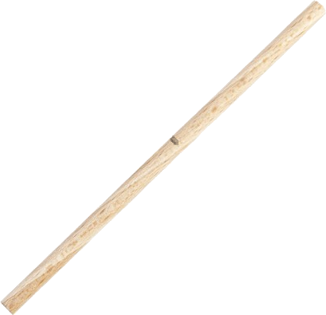
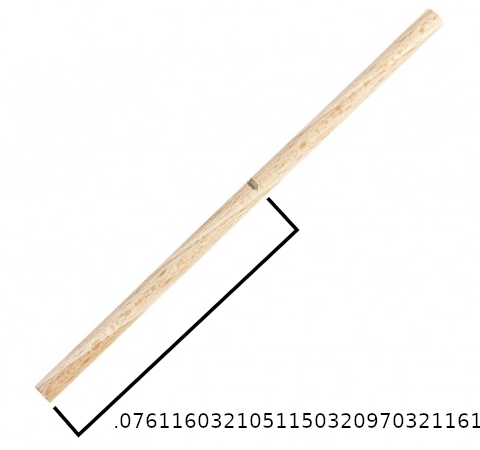
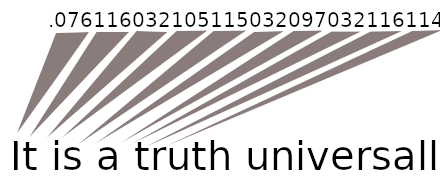
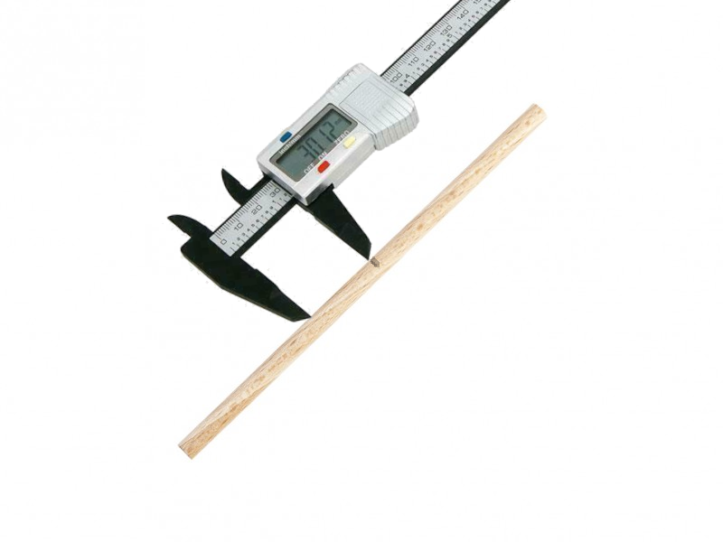

```{r setup, include=FALSE}
options(htmltools.dir.version = FALSE)
options(digits=4,scipen=2)
options(knitr.table.format="html")
xaringanExtra::use_xaringan_extra(c("tile_view","animate_css","tachyons"))
xaringanExtra::use_extra_styles(
  mute_unhighlighted_code = FALSE
)
library(tidyverse)
library(ggplot2)
source('R/pres_theme.R')
knitr::opts_chunk$set(
  dev = "svg",
  warning = FALSE,
  message = FALSE,
  cache = TRUE
)
source('R/myfuncs.R')
```

```{r xaringan-themer, include = FALSE}
library(xaringanthemer)
style_mono_accent(
  #base_color = "#0F4C81", # DAPR1
  # base_color = "#BF1932", # DAPR2
  # base_color = "#88B04B", # DAPR3 
  base_color = "#FCBB06", # USMR
  # base_color = "#a41ae4", # MSMR
  header_color = "#000000",
  header_font_google = google_font("Source Sans Pro"),
  header_font_weight = 400,
  text_font_google = google_font("Source Sans Pro", "400", "400i", "600", "600i"),
  code_font_google = google_font("Source Code Pro")
)
```

class: inverse, center, middle

# Part 1

.center[

]

---
# Notch on a stick

.flex.items-center[
.w-50.pa2[

]
.w-50.pa2[

]]

---
count: false
class: middle

.br3.center.pa2.pt2.bg-gray.white.f3[
It is a truth universally acknowledged, that a single man in possession
of a good fortune, must be in want of a wife.
]


---
# Problem is...

.pull-left[
- we don't have any way of measuring accurately enough

- our measurements are likely to be _close to_ the truth

- they might vary, if we measure more than once
]
.pull-right[

]
---
# Measurement

.pull-left[

]
.pull-right[
- we might _expect_ values close to the "true" measurement to be more frequent
- something like this:

.center[
```{r sketchnorm, echo=FALSE,fig.dim=c(3,3)}
t <- data.frame(x=rnorm(70,.076116,.0025))
t %>% ggplot(aes(x=x)) +
  xlim(0.06,0.09) +  
  geom_density() + scale_y_continuous(breaks=NULL) +
  geom_vline(xintercept=.076116,colour="red") +
  annotate(geom="text",colour="red",x=0.0785,y=25,label="TRUE MEASURE") +
  xlab('measurement') + ylab("") + theme_presentation(16)
```
]]

???
- so let's do a thought experiment and imagine what things
would look like if lots and lots of people tried to measure
the "true" distance of the notch from the end of the stick.

- most of them would be quite competent, and we would expect
the majority of the measurements to be close to the "true" value.

- every now and again, someone would overshoot or undershoot by rather
more.

- _theoretically_ they might be completely off-beam, although the chances of being way off get vanishingly small quite quickly.
---
# Something quite familiar

.center[
```{r normnorm,echo=F,fig.asp=0.55}
t <- data.frame(x=c(0.06,0.09))
t %>% ggplot(aes(x)) +
  stat_function(fun = dnorm, n =151, args=list(mean=.076116,sd=.0025)) +
  ylab("") +
  geom_vline(xintercept = .076116,colour="red") +
  scale_y_continuous(breaks=NULL) +
  xlab("measurement")
```
]

???
- if we think a bit more about our thought experiment, we've actually described
something quite familiar:  A bell curve

- but what is a "bell curve"?

- to answer that question, let's start back where we were last week, with dice.
---
# Dice again

.center[
```{r dice, echo=FALSE,fig.asp=.6}
dice <- function(num=1) {
  sum(sample(1:6,num,replace = T))
}
t <- data.frame(x=replicate(1000,dice(3)))
t %>% ggplot(aes(x)) + geom_bar() +
  scale_x_continuous(breaks=3:18,name = 'sum of dice',limits = c(2,19)) +
  ggtitle('1000 throws of 3 dice')

```
]

???
- to make it interesting, here's a plot of 1000 throws of 3 dice

- the height of the bars represent the numbers of times we obtain each value

- but why are the bars not touching each other?
---
# Dice throws aren't really numbers

.center[
```{r dice2, echo=FALSE,fig.asp=.6}
t %>% ggplot(aes(x)) + geom_bar() +
  scale_x_continuous(breaks=3:18,labels = c('A','B','x','y','Fr','C','D','E','f','p','7','Q','#','u','v','w'),
  name = 'outcome type',limits = c(2,19)) +
  ggtitle('1000 throws of 3 dice')
```
]

???
- I could just label the possible outcomes of throwing three dice arbitrarily
  + I haven't chosen particularly sensible labels here, but you get the idea.

- if you think about it, there are only 16 possible values that the sum
  of three dice can take.
  
- and if the dice didn't have actual numbers on their faces, you could still
  enumerate the outcomes
  + A might be "three reds", B might be "a green and two reds",
  + x might be "two greens and a red, or a yellow and two reds", and so on.
  
- so the outcomes are _discrete_ (you can never throw a value between 3 and 4, or between "A and B")
- and the bars on a bar plot have gaps between them to show this.
---
# Height


???
- so sticking with the examples from last week, let's consider how we might represent a bunch of people's heights.
---
# Plan of attack

- barplots vs histograms

- sd?

### p2

- samples, populations

### p3

- CLT, standard deviation and standard error?


---
class: inverse, center, middle, animated, heartBeat

# End

---
# Acknowledgements

- icons by Diego Lavecchia from the [Noun Project](https://thenounproject.com/)