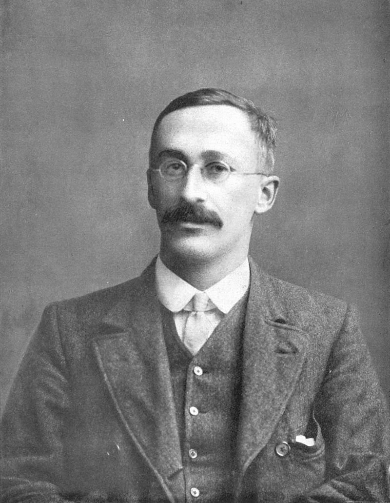

```{r setup, include=FALSE}
options(htmltools.dir.version = FALSE)
options(digits=4,scipen=2)
options(knitr.table.format="html")
xaringanExtra::use_xaringan_extra(c("tile_view","animate_css","tachyons"))
xaringanExtra::use_extra_styles(
  mute_unhighlighted_code = FALSE
)
library(knitr)
library(tidyverse)
library(ggplot2)
source('R/pres_theme.R')
knitr::opts_chunk$set(
  dev = "svg",
  warning = FALSE,
  message = FALSE,
  cache = TRUE
)
source('R/myfuncs.R')
```

```{r xaringan-themer, include = FALSE}
library(xaringanthemer)
style_mono_accent(
  #base_color = "#0F4C81", # DAPR1
  # base_color = "#BF1932", # DAPR2
  # base_color = "#88B04B", # DAPR3 
  base_color = "#FCBB06", # USMR
  # base_color = "#a41ae4", # MSMR
  header_color = "#000000",
  header_font_google = google_font("Source Sans Pro"),
  header_font_weight = 400,
  text_font_google = google_font("Source Sans Pro", "400", "400i", "600", "600i"),
  code_font_google = google_font("Source Code Pro")
)
```

class: inverse, center, middle

# Part 1

---
# More about Height

.pull-left[
- last time we simulated the heights of a population of 10,000 people

- mean height ( $\bar{x}$ ) was 170; standard deviation ( $\sigma$ ) was 12.
  
```{r pop, fig.asp=.6}
curve(dnorm(x,170,12),from = 120, to = 220)
```
]
.pull-right[
.center[

]]


---
# How Unusual is Casper?


.pull-left[
- in his socks, Casper is 198 cm tall

- how likely would we be to find someone Casper's height in our population?
]
.pull-right[
```{r normvline,echo=FALSE, fig.asp=.6}
t <- tibble(x=c(120,220))
p <- t %>% ggplot(aes(x=x)) +
  stat_function(fun=dnorm,n=151,args=list(mean=170,sd=12),size=1.5) +
  xlab("height") + ylab("density")
p + geom_vline(xintercept=198,colour="red")
```
]
???
- we can mark Casper's height on our normal curve
- but we can't do anything with this information
  + technically the line has "no width" so we can't calculate area
  + we need to reformulate the question
---
# How Unusual is Casper (Take 2)?

.pull-left[
- in his socks, Casper is 198 cm tall

- how likely would we be to find someone Casper's height _or more_ in our population?
]
.pull-right[
```{r normarea,echo=FALSE, fig.asp=.6}
ld <- layer_data(p) %>% filter(x >= 198)
q<- p + geom_area(data=ld,aes(x=x,y=y),fill="red") +
  stat_function(fun=dnorm,n=151,args=list(mean=170,sd=12),size=1.5)
q  
```
]


---
count: false
# How Unusual is Casper (Take 2)?

.pull-left[
- in his socks, Casper is 198 cm tall

- how likely would we be to find someone Casper's height _or more_ in our population?

- the area is `r (pp=pnorm(198,170,12,lower.tail=F))`

- so the probability of finding someone in the population of Casper's height or greater is `r pp` (or, $p=`r pp`$ )
]
.pull-right[
```{r normarea2,echo=FALSE, fig.asp=.6}
q
```
]

---
# Area under the Curve

.pull-left[
- so now we know that the area under the curve can be used to quantify **probability**

- but how do we calculate area under the curve?

- luckily, R has us covered, using (in this case) the `pnorm()` function

```{r pnorm}
pnorm(198, mean = 170, sd=12,
      lower.tail = FALSE)
```

]
.pull-right[
```{r tails, echo=F, fig.asp=.6}
df <- data.frame(lx=200,rx=196,lxe=215,rxe=181,y=.025)
p + geom_vline(xintercept=198,colour="red") +
  geom_segment(data=df,aes(x=lx,y=y,xend=lxe,yend=y),arrow=arrow(unit(35,"npc")),colour="red") +
  annotate(geom="text",x=df$lx+10,y=.028,label="upper tail",size=6,colour="red") + geom_segment(data=df,aes(x=rx,y=y,xend=rxe,yend=y),arrow=arrow(unit(35,"npc")),colour="red") +
  annotate(geom="text",x=df$rx-10,y=.028,label="lower tail",size=6,colour="red")

```

]
---
# Tailedness

.pull-left[
- we kind of knew that Casper was _tall_
  + it made sense to ask what the likelihood of finding someone 198 cm _or greater_ was
    + this is called a **one-tailed hypothesis** (we're not expecting Casper to be well below average height!)
  
- often our hypothesis might be vaguer
  + we expect Casper to be "different", but we're not sure how
    + we can capture this using a **two-tailed hypothesis**
]
.pull-right[
```{r normtwo, echo=F,fig.asp=.6}
ld <- layer_data(p) %>% filter(x <= 142)
q + geom_area(data=ld,aes(x=x,y=y),fill="red") +
  stat_function(fun=dnorm,n=151,args=list(mean=170,sd=12),size=1.5) +
  geom_vline(xintercept = 170) + 
  annotate(geom="text",colour="red",x=175,y=.015,label="mean")
```
]

---
count: false

# Tailedness

.pull-left[
- we kind of knew that Casper was _tall_
  + it made sense to ask what the likelihood of finding someone 198 cm _or greater_ was
    + this is called a **one-tailed hypothesis** (we're not expecting Casper to be well below average height!)
  
- often our hypothesis might be vaguer
  + we expect Casper to be "different", but we're not sure how
    + we can capture this using a **two-tailed hypothesis**
]
.pull-right[
- for a two-tailed hypothesis we need to sum the relevant upper and lower areas

- since the normal curve is symmetrical, this is easy!

```{r twot}
2 * pnorm(198, 170, 12, lower.tail = FALSE)
```


]

---
# So: Is Casper Special?

- how surprised should we be that Casper is 198 cm tall?

- given the population he's in, the probability that he's 28cm or more taller than the mean of 170 is `r (pp=pnorm(198,170,12,lower.tail=FALSE))` 
  + NB., this is according to a _one-tailed hypothesis_
  
--

- a more accurate way of saying this is that `r pp` is the probability of selecting him (or someone even taller than him) from the population at random

---
# A Judgement Call

.pull-left[
- if a `r (pc=round(100*pp,0))`% probability is _small enough_
.center[

]]
???
if a `r pc`% probability of selecting someone 28cm or more above the mean is enough to surprise us, then we should be surprised

if, on the other hand, we think `r pc`% isn't particularly low, then we shouldn't be surprised
--

.pull-right[
.center[
- if a `r pc`% chance doesn't impress us much
.center[

]]

]

- in either case, we have nothing (mathematical) to say about the _reasons_ for Casper's height

???
when it comes to comparing means, we'll see that there are conventions for the criteria we use, but they are just that:  conventions, because this is a judgement call.

And importantly, none of the maths we have done will tell us anything about the _reasons_ for Casper's height&mdash;that's for us to reason about.

Perhaps he's so tall because he's weightless, or perhaps he had a lot of milk in his diet:  That's the substance of the scientific paper we're going to write:  The statistical calculation just tells us that he's mildly unusual.

In the next part, we're going to look at how this works for group means as opposed to individuals, but the TL;DR is:  pretty much the same.

---
class: inverse, center, middle, animated, rubberBand

# End of Part 1

---
class: inverse, center, middle

# Part Two

### Group Means

---
# Investment Strategies

.br3.pa2.pt2.bg-gray.white.f3[
The Playmo Investors' Circle have been pursuing a special investment strategy over the past year.  By no means everyone has made a profit.  Is the strategy worth advertising to others?
]

```{r invest, echo=F, fig.asp=.2, fig.width=11}
set.seed(25)
m <- tibble(profit=rnorm(12,20,20),color=if_else(profit <0,'A','B'),
            names=c('Adam','Bill','Clare','Dave','Emma','Fred','Gina','Hal','Ian','Jane','Kim','Leo'))
m %>% ggplot(aes(x=names,y=profit,fill=color)) +
  geom_bar(stat="identity") +
  scale_fill_manual(values=c("red","blue")) +
  theme_presentation(10) +
  theme(legend.position = "none", axis.text.x = element_text(angle=45)) +
  xlab("") + ylab("£ profit")
profit <- round(m$profit,2)

```
---
# Information About the Investments

.pull-left[
- there are 12 investors

- the mean profit is £`r (pr=round(mean(profit),2))`

- the standard deviation is £`r round(sd(profit),2)`

- the standard error is $\sigma/\sqrt{12}$ which is `r sd(profit)/sqrt(12)`

.pt2[
- we are interested in the _probability of 12 people making at least a mean £`r pr` profit_

  + assuming that they come from the same population
]]

.pull-right[

]

---
# Using Standard Error

.pull-left[
- together with the mean, the standard error describes a normal distribution

- "likely distribution of means for other samples of 12"
]

.pull-right[
```{r segraph, echo=FALSE, fig.asp=.6}
df <- tibble(x=c(-30,30))
df %>% ggplot(aes(x=x)) +
  stat_function(fun=dnorm,n=151,args=list(mean=mean(profit),sd=sd(profit)/sqrt(12)),size=2) +
  geom_vline(xintercept=mean(profit),colour="red") +
  xlab("mean profit") + ylab("density")
```
]

---
# Using Standard Error (2)

.pull-left[
- last time, our **null hypothesis** ("most likely outcome") was "Casper is of average height"

- this time, our null hypothesis is "there was no profit"

- easiest way to operationalize this:

  + "the average profit was zero"
  
- so redraw the normal curve with _the same standard error_ and a _mean of zero_
]

.pull-right[
```{r segraph2, echo=FALSE, fig.asp=.6}
ng <- df %>% ggplot(aes(x=x)) +
  stat_function(fun=dnorm,n=151,args=list(mean=mean(profit),sd=sd(profit)/sqrt(12)),size=1.5,colour="grey") +
  xlab("mean profit") + ylab("density") +
  stat_function(fun=dnorm,n=151,args=list(mean=0,sd=sd(profit)/sqrt(12)),size=2)+
  geom_vline(xintercept=mean(profit),colour="red") +
  geom_vline(xintercept=0,linetype=3)
ng
```
]

---
# Using Standard Error (3)

.pull-left[
- null hypothesis: $\mu=0$

- probability of making a mean profit of £`r pr` or more:

  + _one-tailed_ hypothesis
  
  + evaluated as relevant area under the curve
  
```{r area}
se=sd(profit)/sqrt(12)

pnorm(mean(profit), mean=0, sd=se,
      lower.tail=FALSE)
```
]

.pull-right[
```{r segraph3, echo=FALSE, fig.asp=.6}
ld <- layer_data(ng,2) %>% filter(x>=mean(profit))
ng + geom_area(data=ld,aes(x=x,y=y),fill="red") +
    stat_function(fun=dnorm,n=151,args=list(mean=0,sd=sd(profit)/sqrt(12)),size=2)
```
]

---
# The Standardized Version

.flex.items-center[
.w-60[
- last week we talked about the _standard normal curve_
  + mean = 0; standard deviation = 1
- our investors' curve is very easy to transform
  + mean is _already_ 0; divide by standard error  
```{r twopnorms}
pnorm(mean(profit),0,se,lower.tail=FALSE)
pnorm(mean(profit)/se,0,1,lower.tail=FALSE)
```
- `mean(profit)/se` (`r mean(profit)/se`) is "number of standard errors from zero"
]
.w-40.pa2[
```{r snc,echo=FALSE, fig.asp=.6}
df <- tibble(x=c(-3.5,3.5))
gr <- df %>% ggplot(aes(x=x)) +
  stat_function(fun=dnorm,n=451,size=2) +
  xlab("standard errors") +
  ylab("density") +
  geom_vline(xintercept=mean(profit)/se,colour="red") +
  annotate(geom="text",x=mean(profit)/se-1,y=.28,label=paste0(round(mean(profit)/se,2)," standard errors"),size=6,colour="red")
ld <- layer_data(gr) %>% filter(x >= mean(profit)/se)
gr + geom_area(data=ld,aes(x=x,y=y),fill="red") +
  stat_function(fun=dnorm,n=451,size=2)
```

]]
---
# The Standardised Version

- you can take _any_ mean, and _any_ standard deviation, and produce "number of standard errors from the mean"

  + $z=\bar{x}/\sigma$
  
- here, the standard deviation is a _standard error_, but needn't be

  + the point of the calculation is to compare to the **standard normal curve**
  
  + made "looking up probability" easier in the days of printed tables
 
--

- usual practice is to refer to standardised statistics

  + _the name chosen for them comes from the relevant distribution_
  
- $z$ is assessed using the normal distribution
---
# Which Means...
- for $z=`r mean(profit)/se`$, $p=`r pnorm(mean(profit/se),lower.tail=FALSE)`$

.br3.pa2.pt2.bg-gray.white.f3[
If you picked 12 people at random from a population of investors who were making no profit, there would be a `r (pc=round(100*pnorm(mean(profit),0,sd(profit)/sqrt(12),lower.tail=F),0))`% chance that their average profit would be £`r pr` or more.
]

.pt2[
- is `r pc`% low enough for you to believe that the mean profit probably wasn't due to chance?

  + again, it's a _judgement call_
  
  + but before we make that judgement...
]
???
obviously here our "population of investors" means "investors like the Playmo Investors' Circle.

One important thing about statistics is that you can only extrapolate to the relevant population (but it's a matter of interpretation what the relevant population is!)
---
class: inverse, middle, center, animated, rubberBand

# End of Part 2

---
class: inverse, middle, center

# Part 3

### The $t$-test

---
# A Small Confession

.pull-left[

]

.pull-right[
### Part Two wasn't entirely true

- all of the principles are correct, but for smaller $n$ the normal curve isn't the best estimate

- for that we use the $t$ distribution
]


---
# The $t$ Distribution

.pull-left[
.center[


"A. Student", or William Sealy Gossett
]]

.pull-right[
```{r normvst, echo=F, fig.asp=.6}
df <- tibble(x=c(-3.5,3.5))
df %>% ggplot(aes(x=x)) +
  stat_function(fun=dnorm,n=151,colour="grey") +
  stat_function(fun=dt,n=151,args=list(df=11),colour="red") +
  xlab("standard deviations") + ylab("density") +
  annotate(geom="text",x=1.7,y=.3,label="t(11)",colour="red",size=8)
```

]

.pt2[
- note that the shape changes according to _degrees of freedom_, hence $t(11)$
]
???
The official name for the $t$-distribution is "Student's t-distribution", after William Gossett's pen-name

Gossett specialised in statistics for relatively small numbers of observations, working with Pearson, Fisher, and others

---
# The $t$ Distribution

.flex.items-top[
.w-60.pa2[
- conceptually, the $t$ distribution increases uncertainty when the sample is small

  + the probability of more extreme values is slightly higher
  
- exact shape of distribution depends on sample size
  
- the degrees of freedom are inherited from the standard error

$$ \textrm{se} = \frac{\sigma}{\sqrt{n}} = \frac{\sqrt{\frac{\sum{(\bar{x}-x)^2}}{\color{red}{n-1}}}}{\sqrt{n}} $$
]

.w-40.pa2[
```{r ts, echo=F, fig.asp=.6}
df <- tibble(x=c(0,3.5))
df %>% ggplot(aes(x=x)) +
  stat_function(fun=dt,n=151,args=list(df=11),colour="red") +
  stat_function(fun=dt,n=151,args=list(df=5),colour="blue") +
  stat_function(fun=dt,n=151,args=list(df=23),colour="black") +
  xlab("standard deviations") + ylab("density") +
  annotate(geom="text",x=1.7,y=.3,label="t(11)",colour="red",size=8) +
  annotate(geom="text",x=1.7,y=.34,label="t(23)",colour="black",size=8) +
  annotate(geom="text",x=1.7,y=.26,label="t(5)",colour="blue",size=8)
  

```
]]

???
here, I'm only showing the right-hand side of each distribution, so that you can see the differences between different degrees of freedom

the distributions are, of course, symmetrical
---
# Using the $t$ Distribution

- in part 2, we calculated the mean profit for the group as £`r pr` and the standard error as `r se`

- we used the formula $z=\bar{x}/\sigma$ to calculate $z$, and the standard normal curve to calculate probability

--

- **the formula for $t$ is the same as the formula for $z$ **

  + what differs is the _distribution we are using to calculate probability_
  
  + we need to know the degrees of freedom (to get the right $t$-curve)
  
- so $t(\textrm{df}) = \bar{x}/\sigma$  

- **in this case $t(11) = \bar{x}/\sigma$, where $\sigma$ is the standard error**
---
# So What is the Probability of a £`r pr` Profit?
.pull-left[
- for 12 people who made a mean profit of £`r pr` with an se of `r se`

- $t(11) = `r pr`/`r se` = `r pr/se`$

- instead of `pnorm()` we use `pt()` for the $t$ distribution
  
- `pt()` requires the degrees of freedom
  
```{r pt1}
pt(mean(profit)/se,df=11,lower.tail=FALSE)
```
]


.pull-right[
```{r tgraph, echo=FALSE, fig.asp=.6}
df <- tibble(x=c(-3.5,3.5))
g <- df %>% ggplot(aes(x=x)) +
  stat_function(fun=dt,n=151,args=list(df=11),size=2) +
  xlab("standard deviations") + ylab("density")

ld <- layer_data(g) %>% filter(x>= mean(profit)/se)
g + geom_area(data=ld,aes(x=x,y=y),fill="red") +
  stat_function(fun=dt,n=151,args=list(df=11),size=2) +
  annotate(geom="text",x=2,y=.3,label="t(11)",size=8)
```

]
---
# Did We Have to Do All That Work?

.flex.items-top[
.w-70.pa2[
```{r ttes1samp}
head(profit)

t.test(profit, mu=0, alternative = "greater")
```

]
.w-30.pa2[
- **one-sample** $t$-test

- compares a single sample against a hypothetical mean (`mu`)

- usually zero
  
]]

???
note the use of "alternative = greater" here.

we'll talk about that on the next slide.
---
# Types of Hypothesis

```{r ttt,eval=FALSE}
t.test(profit, mu=0, alternative = "greater")
```

- note the use of `alternative="greater"`

- we've talked about the _null hypothesis_ (also **H<sub>0</sub>**)

  + there is no profit (mean profit = 0)
  
- the **alternative hypothesis** (**H<sub>1</sub>**, **experimental hypothesis**) is the hypothesis we're interested in

  + here, that the profit is reliably £`r pr` _or more_ (_one-tailed_ hypothesis)
  
  + could also use `alternative = "less"` or `alternative = "two.sided"`

---
# Putting it Together

- for $t(11)=`r mean(profit)/se`$, $p=`r pt(mean(profit/se),11,lower.tail=FALSE)`$

.br3.pa2.pt2.bg-gray.white.f3[
If you picked 12 people at random from a population of investors who were making no profit, there would be a `r (pc=round(100*pt(mean(profit)/se,11,lower.tail=F),0))`% chance that their average profit would be £`r pr` or more.
]

.pt2[
- is `r pc`% low enough for you to believe that the mean profit probably wasn't due to chance?

- perhaps we'd better face up to this question!

]

---
# Setting the Alpha Level

.pull-left[
- the $\alpha$ level is a criterion for $p$

- if $p$ is lower than the $\alpha$ level

  + we can (decide to) _reject H<sub>0</sub>_

  + we can (implicitly) _accept H<sub>1</sub>_

- what we set $\alpha$ to is a _matter of convention_

- typically, in Psychology, $\color{red}{\alpha}$ .red[is set to .05]

- important to set _before_ any statistical analysis
]
.pull-right[
```{r twonorms, echo=F, fig.asp=.8}
library(patchwork)
p <- df %>% ggplot(aes(x=x)) +
  xlab("") + ylab("density") +
  stat_function(fun=dnorm,n=151)
ld <- layer_data(p) %>% filter(x>=qnorm(.95))
p1 <- p + geom_area(data=ld,aes(x=x,y=y),fill="red") +
  ggtitle("one-tailed") +
  stat_function(fun=dnorm,n=151,size=1)
ld1 <- layer_data(p) %>% filter(x>=qnorm(.975))
ld2 <- layer_data(p) %>% filter(x<=qnorm(.025))
p2 <- p + geom_area(data=ld1,aes(x=x,y=y),fill="red") +
  geom_area(data=ld2,aes(x=x,y=y),fill="red") +
  xlab("std devs") + ggtitle("two-tailed") +
  stat_function(fun=dnorm,n=151,size=1)
p1/p2
```
]
???
I've shown you here on the normal curve because it's a more general distribution than the $t$ distribution, which requires degrees of freedom, but the graphs would look quite similar, as you know

- if we're testing a medicine, with possible side-effects, we want alpha to be low

- for general psychology, meh...

- no leading zeroes because $p$ is always less than 1

- no cheating now!fl

---
# $p < .05$

- the $p$-value is the probability of finding our results under H<sub>0</sub>, the null hypothesis

- H<sub>0</sub> is essentially "&#128169; happens"
  
- $\alpha$ is the maximum level of $p$ at which we are prepared to conclude that H<sub>0</sub> is false (and argue for H<sub>1</sub>)

--

.flash.animated[
## there is a 5% probability of falsely rejecting H<sub>0</sub>
]

- wrongly rejecting H<sub>0</sub> (false positive) is a **type 1 error**

- wrongly accepting H<sub>0</sub> (false negative) is a **type 2 error**
???
---
# Most Experiments Involve Differences

.pull-left[
- but of course "profit" _is_ a difference between **paired samples**

```{r table,echo=F}
df <- tibble(before=runif(12,100,1000),after=before+profit,profit=profit)
before=df$before
after=df$after
library(gt)
df %>% head() %>% gt() %>% fmt_currency(columns=everything(),currency="GBP")
```
]

.pull-right[
- doesn't matter whether _values_ are approx. normal as long as _differences_ are

```{r hist, fig.asp=.6}
hist(before)
```
]
---
# Equivalent $t$-tests

.pull-left[
```{r ttest1}
t.test(profit, mu=0, 
       alternative="greater")
```

]
.pull-right[
```{r ttests}
t.test(after, before, paired=TRUE,
       alternative="greater")
```
]
.flex.items-center[
.w-5.pa1[

]
.w-95.pa1[
- note that a paired-samples $t$-test is actually (kind of) _multivariate_ (>1 measure per person)
]]

???
- note that the $t$-values have different signs

- this is essentially irrelevant

  + it just reflects which column was subtracted from which


---
class: inverse, center, middle, animated, rubberBand

# End

---
# Acknowledgements

- icons by Diego Lavecchia from the [Noun Project](https://thenounproject.com/)
