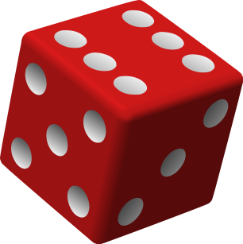

```{r setup, include=FALSE}
options(htmltools.dir.version = FALSE)
options(digits=4,scipen=2)
options(knitr.table.format="html")
xaringanExtra::use_xaringan_extra(c("tile_view","animate_css","tachyons"))
xaringanExtra::use_extra_styles(
  mute_unhighlighted_code = FALSE
)
library(knitr)
library(tidyverse)
library(ggplot2)
source('R/pres_theme.R')
knitr::opts_chunk$set(
  dev = "svg",
  warning = FALSE,
  message = FALSE,
  cache = TRUE
)
source('R/myfuncs.R')
```

```{r xaringan-themer, include = FALSE}
library(xaringanthemer)
style_mono_accent(
  #base_color = "#0F4C81", # DAPR1
  # base_color = "#BF1932", # DAPR2
  # base_color = "#88B04B", # DAPR3 
  base_color = "#FCBB06", # USMR
  # base_color = "#a41ae4", # MSMR
  header_color = "#000000",
  header_font_google = google_font("Source Sans Pro"),
  header_font_weight = 400,
  text_font_google = google_font("Source Sans Pro", "400", "400i", "600", "600i"),
  code_font_google = google_font("Source Code Pro")
)
```

class: inverse, center, middle

# Part 1

### R:  The Big Ideas


---
- the big ideas include the idea that if you know the chance distribution, you
  can work out probability
  
- in Part 3 maybe simulate a x-sq distribution??
  + live R?

- any other tests?
---
class: inverse, center, middle, animated, RollIn

# End of Part 1

---
class: inverse, center, middle
# Part 2

### Where Are You All?

---
- chisq

---
class: inverse, center, middle

# Part 3

### Statistics:  The $\chi^2$ test

---
# Time to Revisit Dice

.left-column[

]
.right-column[
- using one die for simplicity...

- we have already talked about the sides being categories

- we know that in a fair die, the probability of getting each number is $\frac{1}{6}$

  + our **H<sub>0</sub>**
  
- can we look at the proportions of throws and assess the probability of finding that distribution if H<sub>0</sub> is true?

- _if the probability is low enough_ ( $<.05$ ) we can assert that the die is biased
]

---
# Calculating $\chi^2$

```{r settings,include=FALSE}
throws=600
```

- let's assume we throw the die `r throws` times

- if everything worked out _perfectly_ for an unbiased die, our **expected values** would be:
```{r values}
ev <- 600 * c(1/6,1/6,1/6,1/6,1/6,1/6)
ev
```

- and we can calculate a $\chi^2$ statistic using the formula
$$ \chi^2 = \sum{\frac{(O_i-E_i)^2}{E_i}} $$ 
where $O_i$ is the $i\textrm{th}$ observed value and $E_i$ is the $i\textrm{th}$ expected value

---
# Calculating $\chi^2$

- we don't have to do this calculation by hand

- we can do it piece-by-piece

```{r t1}
# "throw a die 600 times"
dice <- tibble(ov=sample(1:6, 600, replace=TRUE))

# create a tibble of counts
chiTab <- dice %>% count(ov)
chiTab <- chiTab %>% mutate(ev=ev) # from our earlier calculation
chiTab
```
???
- note that I'm using the tidyverse way of doing things here, so the scary-sounding `mutate()` function is a way of adding columns to a tibble or dataframe (or of changing existing columns)
---
# Calculating $\chi^2$

```{r t2}
# calculate (O-E)^2 / E
chiTab <- chiTab %>% mutate(sq_diff = (n-ev)^2, std_sq_diff=sq_diff/ev)
chiTab

# chisq value
sum(chiTab$std_sq_diff)
```
---
# Calculating $\chi^2$

- so for the particular random throws we did $\chi^2=`r (xx=sum(chiTab$std_sq_diff))`$

- what we want to know is how probable that value is in a world where chance governs dice throws

--

- we already know two important things

  + we're going to have to work out the distribution of $\chi^2$ and work out the probability of getting that value _or more_
  
  + the reason we're calling the value we've calculated ** $\chi^2$ ** is because we're going to compare it to the $\chi^2$ distribution
  
- in R, there are `pchisq(), dchisq(), rchisq(), qchisq()`

---
# Why do Things the Easy Way?

- build a general function to calculate chisq for lots of dice throws

.pull-left[
```{r chisqfun,fig.asp=.6,fig.show='hide'}
# compact function to calculate chi-squared
# for n dice throws
diceChi <- function(n) {
  dice <- sample(1:6, n, replace=TRUE)
  chisq.test(table(dice))$statistic
}

chiDist <- replicate(10000,diceChi(600))

plot(density(chiDist),
     main="chisq(5)")
```
]
.pull-right[

]
.flex.items-center[
.w-5.pa1[

]
.w-95.pa1[
for more on `chisq.test(...)$statistic`, start with `str(chisq.test(...))`
]]

???
- here I'm using a cheat's way to calculate the $\chi^2$ value, by relying on the R function to calculate it

- note that the `density()` function isn't perfect here -- $\chi^2$ can never actually go below zero, because the numerators in the sum are squared 
---
# $\chi^2$ probability

.pull-left[
- for our random 600 dice throws a couple of slides back

  + $\chi^2=`r xx`$, $\textrm{df} = 5$

- we can use `pchisq()` to find $p$


```{r results ="asis",echo=FALSE}
cat("```r\n")
cat(paste0("pchisq(",xx,", 5, lower.tail=FALSE)"),"\n")
cat("```\n")
```

```{r pchisq, echo=FALSE}
pchisq(xx, 5, lower.tail=FALSE)
```

- looks like we can conclude that our die is `r ifelse(pchisq(xx, 5, lower.tail=FALSE)<.05,"_unlikely_","likely")` to be fair

]

.pull-right[
```{r chisqf2,echo=FALSE,fig.asp=.6, cache=FALSE}
x <- tibble(x=c(0,20))
p <- x %>% ggplot(aes(x=x)) +
  xlab(expression(paste(chi^2, "(5)"))) + ylab("density") +
  stat_function(fun=dchisq,n=151,args=list(df=5),size=2)
ld <- layer_data(p) %>% filter(x>=xx)
p + geom_area(data=ld,aes(x=x,y=y),fill="red") +
  stat_function(fun=dchisq,n=151,args=list(df=5),size=2)
```
]

---
# The $\chi^2$ Distribution

.center[
```{r biggraph, fig.asp=.4, echo=FALSE, fig.width=10}
library(patchwork)
x <- tibble(x=c(0,20))

p <- x %>% ggplot(aes(x=x)) +
  xlab(expression(chi^2)) + ylab("density") +
  ylim(0,.3) + theme_presentation(10)

q <- p + ggtitle("1 df") +
  stat_function(fun=dchisq,n=151,args=list(df=1),size=1.5,colour="purple")

r <- p + ggtitle("2 df") +
  stat_function(fun=dchisq,n=151,args=list(df=2),size=1.5,colour="purple")

s <- p + ggtitle("5 df") +
  stat_function(fun=dchisq,n=151,args=list(df=5),size=1.5,colour="purple")

t <- p + ggtitle("9 df") +
  stat_function(fun=dchisq,n=151,args=list(df=9),size=1.5,colour="purple")

(q + r) / (s + t)

```
]
---
# How Many Throws?

.pull-left[
- I give you a die, and you suspect it's biased

- you decide to go away and throw the die lots of times

- how many times should you throw it before you're satisfied you have an answer?
]
.pull-right[
FIXME IMAGE OF PLAYMO THROWING DICE
]
---
# Type 1 and Type 2 Errors again

### Type 1 Errors

- we falsely reject H<sub>0</sub> (and accept H<sub>1</sub>) although H<sub>0</sub> is true

- by convention, we accept a 5% probability of this happening ( $\alpha=.05$ )

### Type 2 Errors

- we falsely _accept_ H<sub>0</sub> (and reject H<sub>1</sub>) although H<sub>1</sub> is true

  + this is less "dangerous", so we can be more conservative
  
  + a typical value for the probability we accept is 20%

- expressed as _the probability of correctly detecting H<sub>1</sub> when true_, or ** $\beta=.80$ **

---
# So, How Many Throws?

- reformulated: How many throws to detect a _genuine bias_ with 80% accuracy?

- first, let's set up a "genuinely unfair" die
```{r dicey}
# return a p-value representing chi^2 compared to fair dice
unfairDie <- function(throws) {
  d <- sample(1:6,throws,replace=TRUE,prob=c(1,1,1,1,1,2)) #<<
  chisq.test(table(d))$p.value
}
```
???
- see the "prob" in the sample?  I've basically told the sampling function to be twice as likely to select the sixth value (OK, 6) as any other value for the dice.  So our dice is genuinely biased, compared to the default which is that all numbers would be chosen with equal probability.

- in this function we've directly calculated the $\chi^2$ value, and are simply recording the p value

--

- next, repeat the experiment with 30 dice and count up how many times $p<.05$
```{r dicey2}
pValues <- replicate(1000,unfairDie(30))
sum(pValues < .05)/1000
```
- (by simulation), there is a `r sum(pValues <.05)/1000` probability of detecting that the die is biased
???
- so here we're throwing the biased die 30 times, and recording the $p$ value from the $\chi^2$ test.  We're doing that 1,000 times to create a vector of $p$ values.

- in the final line which begins with `sum()` we're working out the proportion out of 1000 times that we found a $p$ value of less than .05

- that number is well below 0.8, which is the criterion we set.  So on the next slide, we're going to try it with higher and higher numbers
---
# How Many?

.center[
```{r dicey3, fig.asp=.6, echo=F, fig.width=5}
propP <- Vectorize(function(throws) {
  sum(replicate(1000,unfairDie(throws))<.05)/1000
})
die <- tibble(throws=seq(30,200,by=10))
die <- die %>% mutate(power = propP(throws))
die %>% ggplot(aes(x=throws,y=power)) +
  geom_hline(yintercept=.8, colour="red", size=1) +
  geom_line(size=2)
```
]

- would have to throw die around 140 times to be reasonably sure it was biased
- (but this obviously depends on _how biased_ it is in the first place)
???
- we're not going to delve further into statistical power just now.

- we've seen that we can estimate power by simulation; for simple designs such as $\chi^2$ there are also straightforward mathematical ways of doing it.

---
# A Very Biased Die

- the important thing to remember is that the **effect size** and the **sample size** interact to affect the probability you have of finding an effect if it's there.

.flex.items-top[.w-30[
- for this die, 6 is _3_ times as likely as the other values

- would take around _50 throws_ to reliably detect bias
]
.w-70.pa2[
.center[
```{r diceyn, fig.asp=.6, echo=F, fig.width=4.5}
propP <- Vectorize(
  function(throws) {
  sum(replicate(1000,chisq.test(table(sample(1:6,throws,
      prob=c(1,1,1,1,1,3),replace=T)))$p.value)<.05)/1000
})
die <- tibble(throws=seq(30,200,by=10))
die <- die %>% mutate(power = propP(throws))
die %>% ggplot(aes(x=throws,y=power)) +
  geom_hline(yintercept=.8, colour="red", size=1) +
  geom_line(size=2) + theme_presentation(16)
```
]]]

---
class: inverse, center, middle, animated, rollIn

# End of Part 3

---
class: inverse, center, middle

# Part 4

### Concepts Refesher

---
# We Have Been Bandying Terms About


---
- combine "big ideas" -- simulate, use plot() on categories -> mosaic
---
class: inverse, center, middle, animated, rollIn

# End

---
# Acknowledgements

- icons by Diego Lavecchia from the [Noun Project](https://thenounproject.com/)