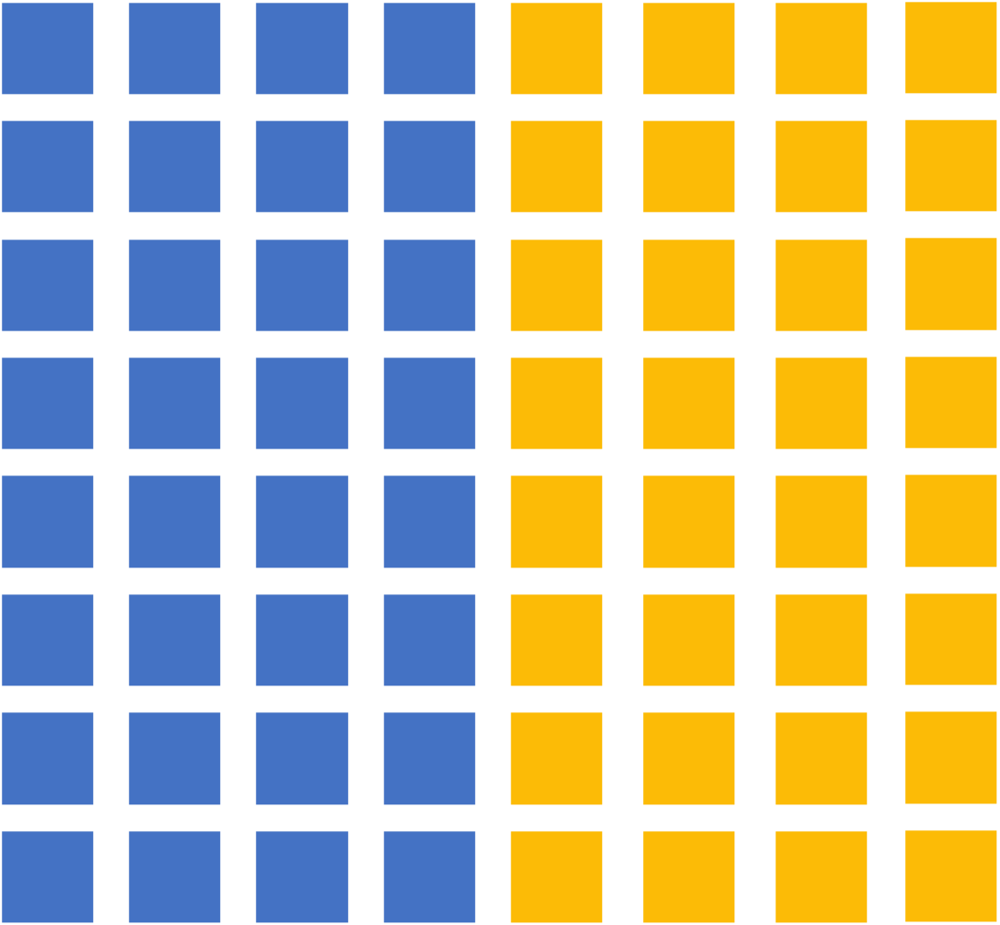
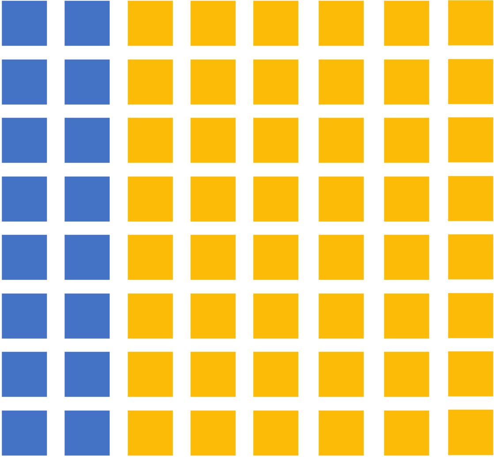
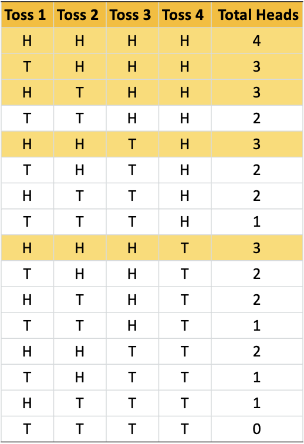
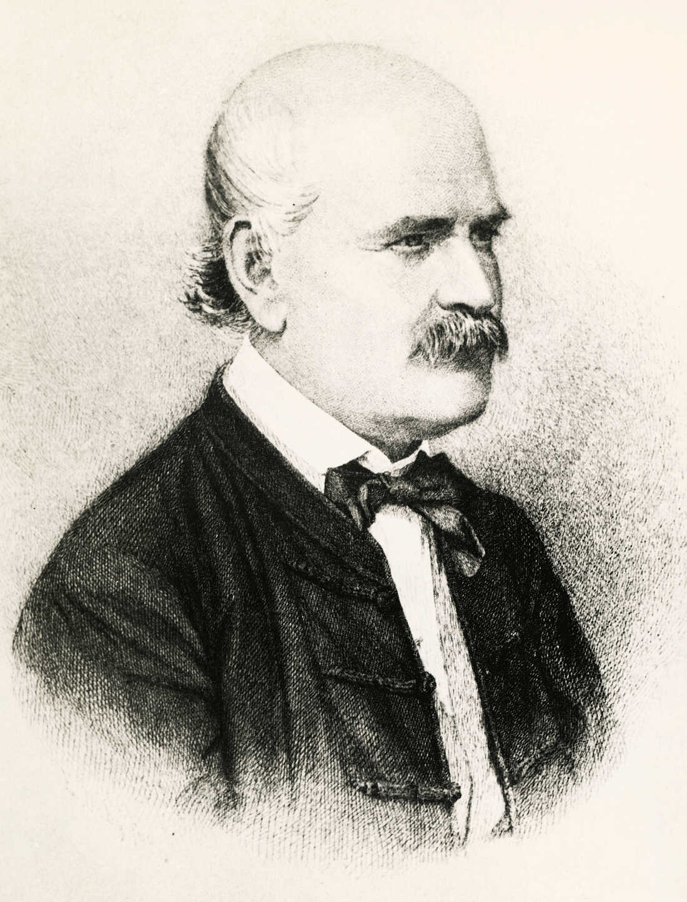

```{r setup, include=FALSE}
options(htmltools.dir.version = FALSE)
options(digits=4,scipen=2)
options(knitr.table.format="html")
xaringanExtra::use_xaringan_extra(c("tile_view","animate_css","tachyons"))
xaringanExtra::use_extra_styles(
  mute_unhighlighted_code = FALSE
)
library(knitr)
library(tidyverse)
library(ggplot2)
#source('R/pres_theme.R')
knitr::opts_chunk$set(
  dev = "svg",
  warning = FALSE,
  message = FALSE
)
source('R/myfuncs.R')
baseColor <- '#FCBB06'
```

```{r xaringan-themer, include = FALSE}
library(xaringanthemer)
style_mono_accent(
  #base_color = "#0F4C81", # DAPR1
  # base_color = "#BF1932", # DAPR2
  # base_color = "#88B04B", # DAPR3 
  base_color = "#FCBB06", # USMR
  # base_color = "#a41ae4", # MSMR
  header_color = "#000000",
  header_font_google = google_font("Source Sans Pro"),
  header_font_weight = 400,
  text_font_google = google_font("Source Sans Pro", "400", "400i", "600", "600i"),
  code_font_google = google_font("Source Code Pro")
)
```

```{r data, include=FALSE}
statsClasses <- read.csv("https://uoepsy.github.io/data/surveydata_allcourse22.csv")
```

# Key Points
+ Binomial Tests

+ $\chi^2$ Distribution

+ $\chi^2$ Tests
  + Goodness of Fit
  + Test of Independence

---
# More Tests

+ The *t*-test & *z*-test are useful in certain situations

--

+ These tests are used to:

--
 
  + Compare *continuous* data from two groups
  
      + Independent groups (independent-samples t-tests)
      + Dependent groups (paired-samples t-tests)

--
    + Compare *continuous* data to a known value
    
      + A known $\mu$ and $\sigma$(z-test)
      + A known $\mu$ when $\sigma$ is unknown (one-sample t-test)


--

+ However, there are times you’ll want to conduct a statistical analysis on data that fall outside these parameters

???
You use your data to compute a test statistic, and then you calculate the probability of observing a statistic at least as extreme as yours, given that the null hypothesis is true

---
# More Tests

+ Suppose you want to test data that are not continuous...
+ In this case, you're probably interested in whether your data are distributed in the way you would expect

  + Are cat and dog lovers evenly distributed in this course?
  + Does opinion of the monarchy (approve/disapprove) differ across political parties?
  + Do people who vape develop lung disease in similar frequencies to those who smoke?
  
--

+ To do this, you can use tests that are specifically meant to compare frequencies of the categories within your data: 
  + Binomial Tests
  + Chi-Square ( $\chi^2$ ) Tests
  
---
class: inverse, center, middle

# Part 1: Binomial Tests

---
# Binomial tests
+ **Binomial distribution:** probability distribution where just two possible outcomes have fixed probabilities

--

+ The probability of the two outcomes does not necessarily have to be equal, but must sum to one
  
--

+ The binomial distribution can be used to describe the counts of a variable that has two outcomes and an expectation of a specific proportion between the two 

--

+ The binomial distribution describes data that follow these conditions:
  + The number of trials or observations (*n*) is fixed
  + Each observation is independent
  + Each observation has one of two outcomes
  + The probability of each outcome is consistent across observations

---
# Can these be described by a binomial distribution?
.pull-left[
.br3.pa2.pt2.bg-gray.white.f5[
**Rule 1** The number of trials or observations (*n*) is fixed

**Rule 2** Each observation is independent

**Rule 3** Each observation has one of two outcomes

**Rule 4** The probability of each outcome is consistent across observations
]

.center.f3[
**Consider the following scenarios, where X = random variable that represents success**
]

]

.pull-right[
+ A fair coin is flipped 20 times; X = # of heads
]

---
count: false

# Can these be described by a binomial distribution?
.pull-left[
.br3.pa2.pt2.bg-gray.white.f5[
**Rule 1** The number of trials or observations (*n*) is fixed

**Rule 2** Each observation is independent

**Rule 3** Each observation has one of two outcomes

**Rule 4** The probability of each outcome is consistent across observations
]

.center.f3[
**Consider the following scenarios, where X = random variable that represents success**
]

]

.pull-right[
+ A fair coin is flipped 20 times; X = # of heads

+ Draw 3 cards at random, one after the other *without replacement*; X = # of diamonds
]

---
count: false

# Can these be described by a binomial distribution?
.pull-left[
.br3.pa2.pt2.bg-gray.white.f5[
**Rule 1** The number of trials or observations (*n*) is fixed

**Rule 2** Each observation is independent

**Rule 3** Each observation has one of two outcomes

**Rule 4** The probability of each outcome is consistent across observations
]

.center.f3[
**Consider the following scenarios, where X = random variable that represents success**
]

]

.pull-right[
+ A fair coin is flipped 20 times; X = # of heads

+ Draw 3 cards at random, one after the other *without replacement*; X = # of diamonds

+ Draw 3 cards at random, one after the other *with replacement*, X = # of diamonds 
]

---
count: false

# Can these be described by a binomial distribution?
.pull-left[
.br3.pa2.pt2.bg-gray.white.f5[
**Rule 1** The number of trials or observations (*n*) is fixed

**Rule 2** Each observation is independent

**Rule 3** Each observation has one of two outcomes

**Rule 4** The probability of each outcome is consistent across observations
]

.center.f3[
**Consider the following scenarios, where X = random variable that represents success**
]

]

.pull-right[
+ A fair coin is flipped 20 times; X = # of heads

+ Draw 3 cards at random, one after the other *without replacement*; X = # of diamonds

+ Draw 3 cards at random, one after the other *with replacement*, X = # of diamonds 

+ The probability of having blood type B is 0.1. Choose 4 people at random; X = # with blood type B
]

---
count: false

# Can these be described by a binomial distribution?
.pull-left[
.br3.pa2.pt2.bg-gray.white.f5[
**Rule 1** The number of trials or observations (*n*) is fixed

**Rule 2** Each observation is independent

**Rule 3** Each observation has one of two outcomes

**Rule 4** The probability of each outcome is consistent across observations
]

.center.f3[
**Consider the following scenarios, where X = random variable that represents success**
]

]

.pull-right[
+ A fair coin is flipped 20 times; X = # of heads

+ Draw 3 cards at random, one after the other *without replacement*; X = # of diamonds

+ Draw 3 cards at random, one after the other *with replacement*, X = # of diamonds 

+ The probability of having blood type B is 0.1. Choose 4 people at random; X = # with blood type B

+ A student answers 10 quiz questions at random; the first five are true/false, the second five are multiple choice, with four options each. X = # of correct answers
]

---

# Binomial Test

+ Calculates the probability of getting a proportion as extreme as or more extreme than the value measured, given that the expected proportion reflects the ground truth. 

.center[
```{r, binomPop50, out.width = '25%', echo = F}

```
]

--

+ How likely are we to draw the following samples, given the above population?


.center[
```{r, binomSamples, out.width = '75%', echo = F}

```
]

---

# Binomial Test

+ Calculates the probability of getting a proportion as extreme as or more extreme than the value measured, given that the expected proportion reflects the ground truth. 

.center[
```{r, binomPop25, out.width = '25%', echo = F}

```
]


+ How likely are we to draw the following samples, given the above population?


.center[
```{r, binomSamples25, out.width = '75%', echo = F}

```
]

+ Binomial test tells you whether your sample deviates significantly from your expectations. 

---

# Binomial Distribution

.pull-left.center[
```{r ht, out.width = '75%', echo = F}
knitr::include_graphics('lecture_4_files/img/50p_ht.jpg')
```

.f3[
**If you toss a coin 100 times, what's the likelihood of success (success = heads)?**
]
]

--

.pull-right[

```{r dpp, echo = F, fig.height=5}
set.seed(2210)
n <-  100
p <-  0.5
nSuccess = 1:n

dat <- data.frame(nSuccess = nSuccess, prob = dbinom(nSuccess, size=n, prob=p))

ggplot(dat, aes(nSuccess, prob)) + geom_col(width = 0.5) + 
  labs(x = 'Number of Successes', y = 'Probability') + 
  scale_x_continuous(breaks = seq(20, 80, 10), limits = c(20, 80)) +
  ggtitle(label = paste0('Binomial Distribution (n = ', n, ', p = ', p, ')')) +
  theme(axis.text = element_text(size = 14), axis.title = element_text(size = 16, face = 'bold'),
        title = element_text(size = 16, face = 'bold')) 
```

]

---
# Binomial Test

.pull-left[
+ If you toss a coin 4 times, what's the probability of it landing on heads at least 3 times?

+ 2 possible outcomes for each of the 4 tosses 

  + $2^4 = 16$ possible sequences of outcomes
  
+ Of those 16, 5 outcomes include $\ge$ 3 heads 

+ $p = 5/16 = .3125$

.center[
```{r ht2, out.width = '50%', echo = F}
knitr::include_graphics('lecture_4_files/img/50p_ht.jpg')
```
]
]

```{r, include=FALSE}
coins <- expand.grid(rep(list(c('H','T')),4))
names(coins) <- c('Toss1','Toss2','Toss3', 'Toss4')
coins$HEADS <- apply(coins[1:4],1, function(x) length(which(x=='H')))
```

.pull-right[
.center[
```{r coinsTable, out.width = '60%', echo = F}

```
]
]

---
# Binomial Test

```{r eval=FALSE}
binom.test(3, 4, 0.5, alternative="greater")
```

```{r binomTest1, highlight.output=5, echo = F}
print(binom.test(3, 4, p = 0.5, alternative = 'greater'), digits = 7)
```

+ Don't be fooled by the the *probability of success* line (which is just 3/4)


---
# Binomial Test

.br3.pa2.pt1.bg-gray.white.f3.center[
Approximately 9% of the world’s population have blue eyes; is the USMR class of 2022-23 a representative sample?
]


.center[
```{r playmoEyes, echo = F, out.height='50%', out.width='50%'}

```
]

---
# Binomial Test

**Approximately 9% of the world’s population have blue eyes; is the USMR class of 2022-23 a representative sample?**

.pull-left[
+ “Two possible outcomes”
  
+ “An expectation of a specific proportion between the two”
  
+ The number of trials or observations (n) is fixed
  
+ Each observation is independent
  
+ Each observation has one of two outcomes
  
+ The probability of each outcome is consistent across observations
]

.pull-right.center[
```{r playmoEyes2, echo = F}

```
]


---
# Binomial Test in R

.pull-left[
Eye Colours for USMR:

```{r eyeCol}
eyes <- table(statsClasses$eyecolour[statsClasses$course=='usmr' & statsClasses$year == '2022'])

eyes
```
]

.pull-right[
```{r eyesBar, echo=F, fig.height = 5}
ggplot(as.data.frame(eyes), aes(Var1, Freq, fill = Var1)) +
  geom_bar(stat='identity') +
  labs(x='Eye Colour', y = 'Count') +
  scale_fill_manual(values = c('#218BB2', '#593520', '#7CA69A', '#8C8C8C',
                               '#5C643D', '#071726')) +
  theme(legend.position = 'none', axis.text = element_text(size=14), 
        axis.title=element_text(size=16, face = 'bold'))
```
]

---
# Binomial Test in R

**Approximately 9% of the world’s population have blue eyes; is the USMR class of 2022-23 a representative sample?**

```{r eyecolour22, highlight.output=5}
binom.test(eyes['blue'],sum(eyes),0.09,alternative="two.sided")
```

???
- here, we can be confident that the USMR poll sample is not typical of the world's population

- there are `r eyes['blue']` out of `r sum(eyes)` people with blue eyes, or around `r 100*eyes['blue']/sum(eyes)`%

---
class: inverse, center, middle

# Part 2: The $\chi^2$ distribution

---
# But first, Ignaz Semmelweise

.pull-left[

+ Doctor in maternity clinic in 1846

+ Discovered women in clinics staffed by doctors and med students were dying much more often than those in midwives' clinics

+ We'll use hypothetical data adapted from Semmelweis's study to demonstrate a $\chi^2$ test


```{r sDat, echo = F}
sDat <- data.frame(Setting = c('Hospital', 'Teaching Hospital', 'Midwifery Unit'), 
                   DeathCount = c(13, 18, 2),
                   LifeCount = c(87, 82, 98))

sDat %>%
  group_by(Setting)
```

]

.pull-right.center[
```{r Semmelweise, echo = F, out.height='50%', out.width='50%'}

```

]

---

# The $\chi^2$ distribution
+ Sometimes you need to test the frequencies of variables that have more than 2 levels

--

+ Similar to previous tests with continuous variables, a test statistic is computed and compared to a cutoff within a larger distribution

--

  + Like the *t*-distribution, the comparison distribution is dependent upon the degrees of freedom

  + Unlike the *t*-distribution, the degrees of freedom isn't dependent on sample size, but on the number of comparison groups

.center[
```{r chiSqDist, echo = F, fig.height = 3, fig.width = 5}
ggplot(data.frame(x = c(0, 20)), aes(x = x)) +
  stat_function(fun = dchisq, args = list(df = 2), colour = '#002060', size = 1) +
  stat_function(fun = dchisq, args = list(df = 4), colour = '#9E3E50', size = 1) +
  stat_function(fun = dchisq, args = list(df = 6), colour = '#BE6751', size = 1) +
  stat_function(fun = dchisq, args = list(df = 10), colour = '#F2C36B', size = 1) +
  labs(x = expression(chi^{2}), y = 'Probability') +
  annotate(geom = 'rect', xmin=14, xmax=16, ymin = .34, ymax =.47, fill = 'white') +
  annotate(geom = 'text', x = 15, y = 0.45, label = 'df = 2', colour = '#002060', size = 4) +
  annotate(geom = 'text', x = 15, y = 0.42, label = 'df = 4', colour = '#9E3E50', size = 4) +
  annotate(geom = 'text', x = 15, y = 0.39, label = 'df = 6', colour = '#BE6751', size = 4) +
  annotate(geom = 'text', x = 15, y = 0.36, label = 'df = 8', colour = '#F2C36B', size = 4)
```
]

---

# $\chi^2$ Statistic

.center.f2[
$\chi^2 = \Sigma \frac{{(O-E)}^2}{E}$
]

+ $\Sigma$ = sum up
+ $O$ = Observed Cases
+ $E$ = Expected Cases


--

+ Once you've computed the statistic, you need to compare it to the proper distribution, but first you'll need the degrees of freedom


---

# $\chi^2$ Degrees of Freedom

+ The formula for $df$ depends on the question you're asking and the test you're using...

--

.pull-left[
.center.f3[**Goodness of Fit**]

+ Checks whether your data come from an expected distribution

+ $\chi^2 = \sum\limits_{k} \frac{{(O-E)}^2}{E}$ 
  + $k$ = the number of categories

+ $df = k - 1$

]

--

.pull-right[
.center.f3[**Test of Homogeneity/Independence**]

+ Checks whether groups have the same distribution of a categorical variable (*homogeneity*) or whether categorical variables are associated with each other in a single group (*independence*)

+ $\chi^2 = \sum\limits_{i j} \frac{{(O-E)}^2}{E}$ 
  + $i$ = # of rows 
  + $j$ = # of columns

+ $df = (i-1)(j-1)$

]

---

# Which test do we need for our Semmelweis data?

.pull-left[

**Is maternal mortality rate consistent across healthcare setting?**

```{r sDatTab, echo = F}
sDat %>%
  group_by(Setting)
```

]

.pull-right[
**Goodness of Fit** Do the data come from a specific distribution?

**Test of Homogeneity** Do the groups have the same distribution on a variable of interest?

**Test of Independence** Are the categorical variables associated with each other within a single population?

]

---
# Computing $\chi^2$

```{r sdf, echo = F}
sDf <- as.data.frame(sDat %>% group_by(Setting))
sDf$RowTotal <- rowSums(sDf[2:ncol(sDf)])
sDf[4,] <- c('ColumnTotal', colSums(sDf[2:ncol(sDf)]))
```
.center.f3[
$\chi^2 = \sum\limits_{i j} \frac{{(O-E)}^2}{E}$

$E = \frac{(row\:total)(column\:total)}{total\:number\:measured}$
]


**Observed Data**
```{r printsDF, echo = F}
sDf
```

**Expected Data**
```{r expDat, echo = F}
expDat <- data.frame(Setting = c('Hospital', 'Teaching Hospital', 'Midwifery Unit'),
                     DeathCount = rep((100*33)/300, 3),
                     LifeCount = rep((100*267)/300, 3))

expDat
```

---

# Computing $\chi^2$

.center[
$\chi^2 = \sum\limits_{i j} \frac{{(O-E)}^2}{E}$
]
.pull-left.f3[
**Observed**
```{r, echo = F}
sDat
```
]

.pull-right.f3[
**Expected**
```{r, echo = F}
expDat
```
]


.center[
```{r fullDat, echo = F}
fullDat <- data.frame(Setting = c('Hospital', 'Teaching Hospital', 'Midwifery Unit'),
                     DeathCount = c((13-11)^2/11, (18-11)^2/11, (2-11)^2/11),
                     LifeCount = c((87-89)^2/89, (82-89)^2/89, (98-89)^2/89))

fullDat
```
]

--

.center[
```{r sChiStat}

sum(fullDat[,2:3])
```
]

---
# Interpreting $\chi^2$

.pull-left.f4[
+ $df = (i-1)(j-1)$
+ $df = (3-1)(2-1)$
+ $df = 2$

]

--

.pull-right[
```{r chiSqDf2, echo = F, fig.height = 3, fig.width = 5}
ggplot(data.frame(x = c(0, 20)), aes(x = x)) +
  stat_function(fun = dchisq, args = list(df = 2), colour = '#002060', size = 1) +
  labs(x=expression(chi^{2}), y = 'Probability') +
  annotate(geom = 'text', x = 2, y = 0.45, label = 'df = 2', colour = '#002060', size = 5)

```
]

---
count: false

# Interpreting $\chi^2$

.pull-left.f4[
+ $df = (i-1)(j-1)$
+ $df = (3-1)(2-1)$
+ $df = 2$

** There is a significant difference between healthcare settings in mortality rate after birth, $\chi^2 (2, N = 300) = 13.69, p = .001$**
]


.pull-right[
```{r chiSqDf, echo = F, fig.height = 3, fig.width = 5}
ggplot(data.frame(x = c(0, 20)), aes(x = x)) +
  stat_function(fun = dchisq, args = list(df = 2), colour = '#002060', size = 1) +
  labs(x=expression(chi^{2}), y = 'Probability') +
  annotate(geom = 'text', x = 2, y = 0.45, label = 'df = 2', colour = '#002060', size = 5) +
  geom_vline(xintercept = sum(fullDat[,2:3]), linetype = 'dashed', colour = '#002060')

```

```{r pchi}
pchisq(13.69, 2, lower.tail=FALSE)
```
]


---

# Computing $\chi^2$ in R

```{r chiSqDat}
sDat[,2:3]

chisq.test(sDat[,2:3])

```

---
# One more small example...

+ Imagine that Semmelweis wondered whether there were certain days of the week when maternal mortality was higher than others. 

+ Which test do we need for these data?

.pull-left[

**Is the maternal mortality rate consistent throughout the week?**

]

.pull-right[
**Goodness of Fit** Do the data come from a specific distribution?

**Test of Homogeneity** Do the groups have the same distribution on a variable of interest?

**Test of Independence** Are the categorical variables associated with each other within a single population?

]

---

# $\chi^2$ - Goodness of Fit

Let's imagine that Semmelweis spent some time gathering data on daily mortality rates:

```{r gofDat, echo = F}
gofDat <- data.frame(Day=c('Monday', 'Tuesday', 'Wednesday', 'Thursday', 'Friday', 'Saturday', 
                           'Sunday'), weekMR=c(26, 31, 45, 37, 29, 32, 44))
gofDat
```


If there was absolutely no difference in mortality rates across days of the week, we would expect the values for each day to be equal.

```{r}
gofDat$ExpMR <- rep(round((sum(gofDat$weekMR)/7), 2), 7)
```

```{r printgofdat, echo = F}
gofDat
```

---
# Computing $\chi^2$ for Goodness of Fit Test

.center[
$\chi^2 = \sum\limits_{k} \frac{{(O-E)}^2}{E}$
]

.center[
```{r gofS1, echo = F}
gofDat$ObsMinExp <- gofDat$weekMR-gofDat$ExpMR

gofDat
```
]

---
count: false

# Computing $\chi^2$ for Goodness of Fit Test

.center[
$\chi^2 = \sum\limits_{k} \frac{{(O-E)}^2}{E}$
]

.center[
```{r gofS2, echo = F}
gofDat$ObsMinExp <- gofDat$weekMR-gofDat$ExpMR
gofDat$SqDiff <- gofDat$ObsMinExp^2

gofDat
```
]

---
count: false

# Computing $\chi^2$ for Goodness of Fit Test

.center.f3[
$\chi^2 = \sum\limits_{k} \frac{{(O-E)}^2}{E}$
]

.center[
```{r gofS3, echo = F}
gofDat$ObsMinExp <- gofDat$weekMR-gofDat$ExpMR
gofDat$SqDiff <- gofDat$ObsMinExp^2
gofDat$SqDiffdivExp <- gofDat$SqDiff/gofDat$ExpMR

gofDat
```
]

---
count: false

# Computing $\chi^2$ for Goodness of Fit Test

.center[
$\chi^2 = \sum\limits_{k} \frac{{(O-E)}^2}{E}$
]

.center[
```{r gofS4, echo = F}
gofDat$ObsMinExp <- gofDat$weekMR-gofDat$ExpMR
gofDat$SqDiff <- gofDat$ObsMinExp^2
gofDat$SqDiffdivExp <- gofDat$SqDiff/gofDat$ExpMR

gofDat

sum(gofDat$SqDiffdivExp)
```
]

---
# Interpreting $\chi^2$ - Goodness of Fit

.pull-left.f4[
+ $df = k-1$
+ $df = 7-1$
+ $df = 6$
]


.pull-right[
```{r gofDf, echo = F, fig.height = 3, fig.width = 5}
ggplot(data.frame(x = c(0, 20)), aes(x = x)) +
  stat_function(fun = dchisq, args = list(df = 6), colour = '#BE6751', size = 1) +
  labs(x=expression(chi^{2}), y = 'Probability') +
  annotate(geom = 'text', x = 15, y = 0.05, label = 'df = 6', colour = '#BE6751', size = 5) +
  geom_vline(xintercept = sum(gofDat$SqDiffdivExp), linetype = 'dashed', colour = '#BE6751')

```

```{r pchiGOF}
pchisq(9.37, 6, lower.tail=FALSE)
```
]

---
# Computing $\chi^2$ Goodness of Fit in R

```{r gofTest}

chisq.test(gofDat$weekMR, p = rep(1/7, 7))

```

---
# How did it end for Semmelweis?

+ He noticed that a major difference in the two settings was that the doctors and residents were doing a lot of autopsies...

--

+ AND NOT WASHING THEIR HANDS OR INSTRUMENTS

--

+ Semmelweis was a handwashing pioneer - he recommended that doctors use a chlorine solution to cleanse their hands and instruments.

+ So it was a great victory for Semmelweis, right?

--
+ No.

--
 
+ "He too was attacked widely by the establishment of obstetricians in Europe, who could not believe that they or their midwife colleagues were responsible for the enormous number of deaths." (Chamberlain, 2006)

---
class: inverse, center, middle

# End