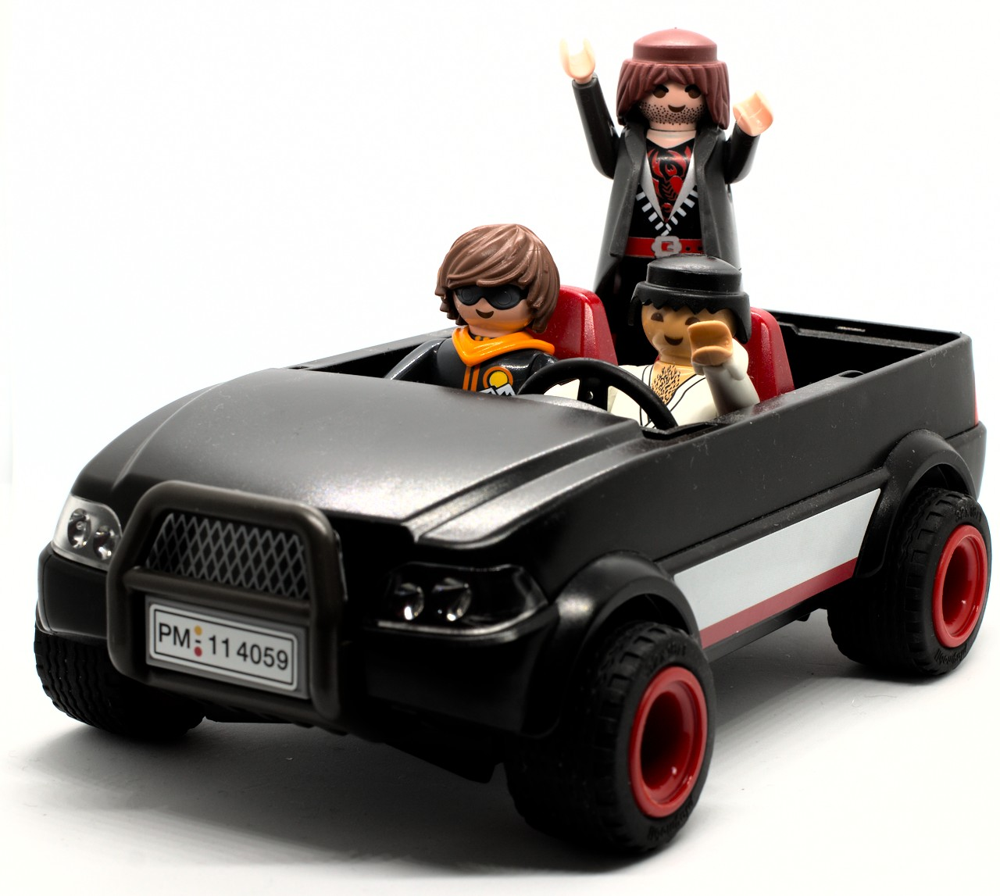

```{r setup, include=FALSE}
options(htmltools.dir.version = FALSE)
options(digits=4,scipen=2)
options(knitr.table.format="html")
xaringanExtra::use_xaringan_extra(c("tile_view","animate_css","tachyons"))
xaringanExtra::use_extra_styles(
  mute_unhighlighted_code = FALSE
)
library(knitr)
library(tidyverse)
library(ggplot2)
source('R/pres_theme.R')
knitr::opts_chunk$set(
  dev = "svg",
  warning = FALSE,
  message = FALSE,
  cache = TRUE
)
source('R/myfuncs.R')
```

```{r xaringan-themer, include = FALSE}
library(xaringanthemer)
style_mono_accent(
  #base_color = "#0F4C81", # DAPR1
  # base_color = "#BF1932", # DAPR2
  # base_color = "#88B04B", # DAPR3 
  base_color = "#FCBB06", # USMR
  # base_color = "#a41ae4", # MSMR
  header_color = "#000000",
  header_font_google = google_font("Source Sans Pro"),
  header_font_weight = 400,
  text_font_google = google_font("Source Sans Pro", "400", "400i", "600", "600i"),
  code_font_google = google_font("Source Code Pro")
)
```

class: inverse, center, middle

# Part 1:  Correlation

---
# Blood Alcohol and Reaction Time

.pull-left[
```{r ba, fig.asp=.6, echo=F,cache=F}
library(faux)
set.seed(29)
dat <- rnorm_multi(n=50,
                   mu=c(0.1,650),
                   sd=c(.009,60),
                   r=.4,
                   varnames=c('BloodAlc','RT'))
dat %>% ggplot(aes(x=BloodAlc,y=RT)) +
  xlab("Blood Alcohol %/vol") + ylab("RT (ms)") +
  geom_point(size=3)
```
- data from 100 drivers
- are blood acohol and RT systematically related?

]
.pull-right[

]
???
- the playmo crew have been out joyriding and were caught in a police speed trap

- the police measured 100 people's blood alcohol and their reaction times

- how would we go about telling whether two variables like this were related?
---
# A Simplified Case

.center[
```{r cor5,echo=F,fig.asp=.5,cache=F}
dat2 <- rnorm_multi(n=5,
                    mu=c(5,5),
                    sd=c(2,2),
                    r=.70,
                    varnames=c('x','y'))
p<- dat2 %>% ggplot(aes(x=x,y=y)) +
  geom_point(size=5)
p
```
]

- does $y$ vary with $x$?

--

- equivalent to asking "does $y$ differ from its mean in the same way that $x$ does?"

---
count: false
# A Simplified Case

.center[
```{r cor5a,echo=F,fig.asp=.5,cache=F}
dat2$xm <- mean(dat2$x)
dat2$ym <- mean(dat2$y)
p2 <- p +
  geom_vline(xintercept=mean(dat2$x),colour="blue") +
  geom_segment(data=dat2,aes(xend=xm,yend=y),colour="blue",linetype="dotted")
p2
```
]

- does $y$ vary with $x$?

- equivalent to asking "does $y$ differ from its mean in the same way that $x$ does?"
???
here are the ways in which the values of $x$ differ from `mean(x)`

---
count: false
# A Simplified Case

.center[
```{r cor5b,echo=F,fig.asp=.5,cache=F}
p2 + geom_hline(yintercept=mean(dat2$y),colour="red") +
  geom_segment(data=dat2,aes(xend=x,yend=ym),colour="red",linetype="dotted")
```
]

- does $y$ vary with $x$?

- equivalent to asking "does $y$ differ from its mean in the same way that $x$ does?"
???
and here are the ways in which $y$ varies from its mean
---
# Covariance
.center[
```{r covlines,echo=FALSE, fig.asp=.4, fig.width=10}
library(patchwork)
dat2 <- dat2 %>% mutate(yd=y-ym, xd=x-xm)
g1 <- dat2 %>% ggplot(aes(x=1:5,y=yd,fill="r")) +
  scale_fill_manual(values=c("red")) +
  scale_x_discrete(limit=1:5,labels=round(dat2$yd,2)) +
  guides(fill=FALSE) +
  geom_bar(stat="identity") +
  xlab("") + ylab("y diff") + ylim(-3,3)
g2 <- dat2 %>% ggplot(aes(x=1:5,y=xd,fill="r")) +
  scale_fill_manual(values=c("blue")) +
  scale_x_discrete(limit=1:5,labels=round(dat2$xd,2)) +
  guides(fill=FALSE) +
  geom_bar(stat="identity") +
  xlab("") + ylab("x diff") + ylim(-3,3)
g1/g2
```
]

- it's likely the variables are related **if observations differ proportionately from their means**

---
# Covariance

### Variance
.br3.white.bg-gray.pa1[
$$ s^2 = \frac{\sum{(x-\bar{x})^2}}{n} = \frac{\sum{(x-\bar{x})(x-\bar{x})}}{n} $$
]

???
- note that here we're using $n$, not $n-1$, because this is the whole population
--

### Covariance
.br3.white.bg-gray.pa1[
$$ \textrm{cov}(x,y) = \frac{\sum{(x-\bar{x})\color{red}{(y-\bar{y})}}}{n} $$
]

---
# Covariance

```{r table,include=F}
library(gt)
t <- dat2 %>% select(xd,yd) %>% mutate(xy=xd * yd) %>% round(2)
```

| $x-\bar{x}$ | $y-\bar{y}$ | $(x-\bar{x})(y-\bar{y})$ |
|------------:|------------:|-------------------------:|
| `r t$xd[1]` | `r t$yd[1]` |              `r t$xy[1]` |
| `r t$xd[2]` | `r t$yd[2]` |              `r t$xy[2]` |
| `r t$xd[3]` | `r t$yd[3]` |              `r t$xy[3]` |
| `r t$xd[4]` | `r t$yd[4]` |              `r t$xy[4]` |
| `r t$xd[5]` | `r t$yd[5]` |              `r t$xy[5]` |
|             |             |        **`r sum(t$xy)`** |

.pt4[

$$ \textrm{cov}(x,y) = \frac{\sum{(x-\bar{x})(y-\bar{y})}}{n} = \frac{`r sum(t$xy)`}{5} \simeq \color{red}{`r round(sum(t$xy)/5,2)`} $$
]

???
- I've rounded up the numbers at the end to make this a bit neater on the slide
---
# FIXME COVARIANCE UNITS

---
# Correlation Coefficient

- the standardisedm version of covariance is the **correlation coefficient**, $r$

$$ r = \frac{\textrm{covvariance}(x,y)}{\textrm{standard deviation}(x)\cdot\textrm{standard deviation}(y)} $$

--

.pt3[
$$ r=\frac{\frac{\sum{(x-\bar{x})(y-\bar{y})}}{\color{red}{N}}}{\sqrt{\frac{\sum{(x-\bar{x})^2}}{\color{red}{N}}}\sqrt{\frac{\sum{(y-\bar{y})^2}}{\color{red}{N}}}} $$
]

--
.pt1[
$$ r=\frac{\sum{(x-\bar{x})(y-\bar{y})}}{\sqrt{\sum{(x-\bar{x})^2}}\sqrt{\sum{(y-\bar{y})^2}}} $$
]

---
class: inverse, center, middle
# Part Z:  The Zen of Stats

.center[

]

---
# We Have Been Bandying Terms About


---
- combine "big ideas" -- simulate, use plot() on categories -> mosaic

---
class: inverse, center, middle, animated, rubberBand

# End

---
# Acknowledgements

- icons by Diego Lavecchia from the [Noun Project](https://thenounproject.com/)