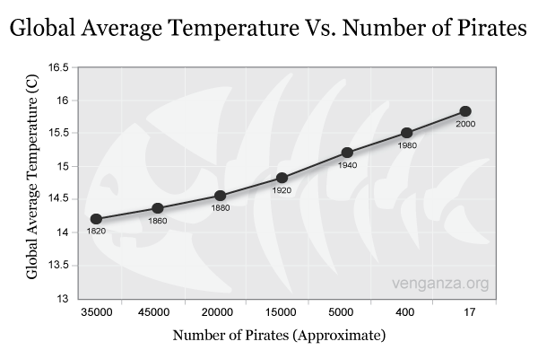

```{r setup, include=FALSE}
options(htmltools.dir.version = FALSE)
options(digits=4,scipen=2)
options(knitr.table.format="html")
xaringanExtra::use_xaringan_extra(c("tile_view","animate_css","tachyons"))
xaringanExtra::use_extra_styles(
  mute_unhighlighted_code = FALSE
)
library(knitr)
library(tidyverse)
library(ggplot2)
library(faux)
# source('R/pres_theme.R')
source('R/getSample.R')
knitr::opts_chunk$set(
  dev = "svg",
  warning = FALSE,
  message = FALSE
)
baseColour <- '#FCBB06'
source('R/myfuncs.R')
```

```{r xaringan-themer, include = FALSE}
library(xaringanthemer)
style_mono_accent(
  #base_color = "#0F4C81", # DAPR1
  # base_color = "#BF1932", # DAPR2
  # base_color = "#88B04B", # DAPR3 
  base_color = "#FCBB06", # USMR
  # base_color = "#a41ae4", # MSMR
  header_color = "#000000",
  header_font_google = google_font("Source Sans Pro"),
  header_font_weight = 400,
  text_font_google = google_font("Source Sans Pro", "400", "400i", "600", "600i"),
  code_font_google = google_font("Source Code Pro")
)
```

```{r}

```

class: inverse, center, middle

# Part 1:  Correlation

---

# Brain Volume & Activity Level

.center[
```{r bv, echo = F, fig.height=4}
set.seed(526)
bvAl <- give_me_a_sample(1000)

bvAlplot <- ggplot(bvAl, aes(weekly_actv, brain_vol)) + geom_point(alpha = 0.5, size = 1) +
  labs(x =  'Weekly Activity', y = 'Brain Volume (%)') + 
  scale_x_continuous(breaks = seq(0, 25, 5), limits = c(5, 20)) +
  theme(axis.text = element_text(size = 14), 
        axis.title = element_text(size = 16, face = 'bold'))

bvAlplot

```
]

---

# Correlation

.pull-left[
+ A measure of the relationship between two **continuous** variables

+ Does a linear relationship exist between _x_ and _y_ ?

+ Specifically, do two variables **covary**?

  + A change in one equates to a change in the other

]


---
count: false

# Correlation
.pull-left[
+ A measure of the relationship between two **continuous** variables

+ Does a linear relationship exist between _x_ and _y_ ?

+ Specifically, do two variables **covary**?

  + A change in one equates to a change in the other
  
+ Does $y$ vary with $x$ ?

+ Equivalent to asking "does $y$ differ from its mean in the same way $x$ does?"

]

.pull-right[


```{r cov, echo = F, fig.width=5, fig.height=2.5}

bvCut <- bvAl[1:8,]
bvCut$subNum <- 1:nrow(bvCut)

bvPlot <- ggplot(bvCut, aes(subNum, brain_vol)) + geom_point(colour = '#274259', size = 2) + 
  scale_x_continuous(breaks = seq(1, 8, 1)) +
  geom_hline(yintercept = mean(bvCut$brain_vol, colour = '#274259', size = 1)) +
  labs(x = 'Participant', y = 'Brain Volume (%)')
  
waPlot <- ggplot(bvCut, aes(subNum, weekly_actv)) + geom_point(colour = '#008C72', size = 2) + 
  scale_x_continuous(breaks = seq(1, 8, 1)) +
  geom_hline(yintercept = mean(bvCut$weekly_actv, size = 1)) +
  labs(x = 'Participant', y = 'Weekly Activity (hrs)') 

waPlot

bvPlot

```
]

---
count: false

# Correlation
.pull-left[
+ A measure of the relationship between two **continuous** variables

+ Does a linear relationship exist between _x_ and _y_ ?

+ Specifically, do two variables **covary**?
  + A change in one equates to a change in the other
  
+ Does $y$ vary with $x$ ?

+ Equivalent to asking "does $y$ differ from its mean in the same way $x$ does?"

]

.pull-right[


```{r cov2, echo = F, fig.width=5, fig.height=2.5}

bvDis <- bvPlot +
  annotate(geom='segment', x = 1, xend = 1, y = mean(bvCut$brain_vol), yend = bvCut$brain_vol[1], linetype = 'dashed', colour = '#274259') +
  annotate(geom='segment', x = 2, xend = 2, y = bvCut$brain_vol[2], yend = mean(bvCut$brain_vol), linetype = 'dashed', colour = '#274259') +
  annotate(geom='segment', x = 3, xend = 3, y = bvCut$brain_vol[3], yend = mean(bvCut$brain_vol), linetype = 'dashed', colour = '#274259') +
   annotate(geom='segment', x = 4, xend = 4, y = mean(bvCut$brain_vol), yend = bvCut$brain_vol[4], linetype = 'dashed', colour = '#274259') +
  annotate(geom='segment', x = 5, xend = 5, y = bvCut$brain_vol[5], yend = mean(bvCut$brain_vol), linetype = 'dashed', colour = '#274259') +
  annotate(geom='segment', x = 6, xend = 6, y = bvCut$brain_vol[6], yend = mean(bvCut$brain_vol), linetype = 'dashed', colour = '#274259') +
  annotate(geom='segment', x = 7, xend = 7, y = bvCut$brain_vol[7], yend = mean(bvCut$brain_vol), linetype = 'dashed', colour = '#274259') +
   annotate(geom='segment', x = 8, xend = 8, y = mean(bvCut$brain_vol), yend = bvCut$brain_vol[8], linetype = 'dashed', colour = '#274259')
  
waDis <- waPlot +
  annotate(geom='segment', x = 1, xend = 1, y = mean(bvCut$weekly_actv), yend = bvCut$weekly_actv[1], linetype = 'dashed', colour = '#008C72') +
  annotate(geom='segment', x = 2, xend = 2, y = bvCut$weekly_actv[2], yend = mean(bvCut$weekly_actv), linetype = 'dashed', colour = '#008C72') +
  annotate(geom='segment', x = 3, xend = 3, y = bvCut$weekly_actv[3], yend = mean(bvCut$weekly_actv), linetype = 'dashed', colour = '#008C72') +
   annotate(geom='segment', x = 4, xend = 4, y = mean(bvCut$weekly_actv), yend = bvCut$weekly_actv[4], linetype = 'dashed', colour = '#008C72') +
  annotate(geom='segment', x = 5, xend = 5, y = bvCut$weekly_actv[5], yend = mean(bvCut$weekly_actv), linetype = 'dashed', colour = '#008C72') +
  annotate(geom='segment', x = 6, xend = 6, y = bvCut$weekly_actv[6], yend = mean(bvCut$weekly_actv), linetype = 'dashed', colour = '#008C72') +
  annotate(geom='segment', x = 7, xend = 7, y = bvCut$weekly_actv[7], yend = mean(bvCut$weekly_actv), linetype = 'dashed', colour = '#008C72') +
   annotate(geom='segment', x = 8, xend = 8, y = mean(bvCut$weekly_actv), yend = bvCut$weekly_actv[8], linetype = 'dashed', colour = '#008C72')

waDis

bvDis

```
]


---
count: false

# Correlation
.pull-left[
+ A measure of the relationship between two **continuous** variables

+ Does a linear relationship exist between _x_ and _y_ ?

+ Specifically, do two variables **covary**?
  + A change in one equates to a change in the other
  
+ Does $y$ vary with $x$ ?

+ Equivalent to asking "does $y$ differ from its mean in the same way $x$ does?"

+ It's likely the variables are related **if observations differ proportionally from their means**

]

.pull-right[


```{r cov3, echo = F, fig.width=5, fig.height=2.5}

waDis

bvDis

```
]

---

# Covariance

### Variance
.br3.white.bg-gray.pa1[
$$ s^2 = \frac{\sum{(x-\bar{x})^2}}{n} = \frac{\sum{(x-\bar{x})(x-\bar{x})}}{n} $$
]

???
- note that here we're using $n$, not $n-1$, because this is the whole population
--

### Covariance
.br3.white.bg-gray.pa1[
$$ \textrm{cov}(x,y) = \frac{\sum{(x-\bar{x})\color{red}{(y-\bar{y})}}}{n} $$
]
???
- note that for any (x,y), $x-\bar{x}$ might be positive and $y-\bar{y}$ might be positive, so the covariance could be a negative number

---

# Covariance

.pull-left[
```{r covCalc, echo = F, fig.width=5, fig.height=2.5}
bvCut$bvVar <- round(bvCut$brain_vol-mean(bvCut$brain_vol), 2)
bvCut$waVar <- round(bvCut$weekly_actv-mean(bvCut$weekly_actv), 2)
bvCut$bvPlotPoint <- round(bvCut$brain_vol-(bvCut$bvVar*.5),1)
bvCut$waPlotPoint <- round(bvCut$weekly_actv-(bvCut$waVar*.5),1)

annTextBV <- data.frame(subNum = (1:8)+.4, brain_vol = bvCut$bvPlotPoint,
                       lab = round(bvCut$bvVar, 2))

annTextWA <- data.frame(subNum = (1:8)+.4, weekly_actv = bvCut$waPlotPoint,
                       lab = round(bvCut$waVar, 2))

waDis +  geom_text(data = annTextWA, label = annTextWA$lab, size = 4)

bvDis +  geom_text(data = annTextBV, label = annTextBV$lab, size = 4)

```
]

.pull-right[
```{r table,include=F}
bvCut$bvwa <- bvCut$bvVar*bvCut$waVar
```

| $x-\bar{x}$ | $y-\bar{y}$ | $(x-\bar{x})(y-\bar{y})$ |
|-------------------:|-------------------:|------------------:|
| `r bvCut$waVar[1]` | `r bvCut$bvVar[1]` | `r bvCut$bvwa[1]` |
| `r bvCut$waVar[2]` | `r bvCut$bvVar[2]` | `r bvCut$bvwa[2]` |
| `r bvCut$waVar[3]` | `r bvCut$bvVar[3]` | `r bvCut$bvwa[3]` |
| `r bvCut$waVar[4]` | `r bvCut$bvVar[4]` | `r bvCut$bvwa[4]` |
| `r bvCut$waVar[5]` | `r bvCut$bvVar[5]` | `r bvCut$bvwa[5]` |
| `r bvCut$waVar[6]` | `r bvCut$bvVar[6]` | `r bvCut$bvwa[6]` |
| `r bvCut$waVar[7]` | `r bvCut$bvVar[7]` | `r bvCut$bvwa[7]` |
| `r bvCut$waVar[8]` | `r bvCut$bvVar[8]` | `r bvCut$bvwa[8]` |
|                    |                    | **`r round(sum(bvCut$bvwa), 2)`** |

]

---
count: false

# Covariance

.pull-left[
```{r covCalc2, echo = F, fig.width=5, fig.height=2.5}
waDis +  geom_text(data = annTextWA, label = annTextWA$lab, size = 4)

bvDis +  geom_text(data = annTextBV, label = annTextBV$lab, size = 4)

```
]

.pull-right[

| $x-\bar{x}$ | $y-\bar{y}$ | $(x-\bar{x})(y-\bar{y})$ |
|-------------------:|-------------------:|------------------:|
| `r bvCut$waVar[1]` | `r bvCut$bvVar[1]` | `r bvCut$bvwa[1]` |
| `r bvCut$waVar[2]` | `r bvCut$bvVar[2]` | `r bvCut$bvwa[2]` |
| `r bvCut$waVar[3]` | `r bvCut$bvVar[3]` | `r bvCut$bvwa[3]` |
| `r bvCut$waVar[4]` | `r bvCut$bvVar[4]` | `r bvCut$bvwa[4]` |
| `r bvCut$waVar[5]` | `r bvCut$bvVar[5]` | `r bvCut$bvwa[5]` |
| `r bvCut$waVar[6]` | `r bvCut$bvVar[6]` | `r bvCut$bvwa[6]` |
| `r bvCut$waVar[7]` | `r bvCut$bvVar[7]` | `r bvCut$bvwa[7]` |
| `r bvCut$waVar[8]` | `r bvCut$bvVar[8]` | `r bvCut$bvwa[8]` |
|                    |                    | **`r round(sum(bvCut$bvwa), 2)`** |


$$ \textrm{cov}(x,y) = \frac{\sum{(x-\bar{x}){(y-\bar{y})}}}{n} = \frac{`r round(sum(bvCut$bvwa), 2)`}{8} = `r round(sum(bvCut$bvwa)/5, 2)`$$

]

---
# The Problem With Covariance

```{r tDat,include=F}
dat2 <- rnorm_multi(n=5,
                    mu=c(5,5),
                    sd=c(2,2),
                    r=.70,
                    varnames=c('x','y'))
dat2$xm <- mean(dat2$x)
dat2$ym <- mean(dat2$y)
dat2 <- dat2 %>% mutate(yd=y-ym, xd=x-xm)

library(gt)
t <- dat2 %>% select(xd,yd) %>% mutate(xy=xd * yd) %>% round(2)
```

.pull-left[

**Miles**

| $x-\bar{x}$ | $y-\bar{y}$ | $(x-\bar{x})(y-\bar{y})$ |
|------------:|------------:|-------------------------:|
| `r t$xd[1]` | `r t$yd[1]` |              `r t$xy[1]` |
| `r t$xd[2]` | `r t$yd[2]` |              `r t$xy[2]` |
| `r t$xd[3]` | `r t$yd[3]` |              `r t$xy[3]` |
| `r t$xd[4]` | `r t$yd[4]` |              `r t$xy[4]` |
| `r t$xd[5]` | `r t$yd[5]` |              `r t$xy[5]` |
|             |             |        **`r sum(t$xy)`** |

$$ \textrm{cov}(x,y)=\frac{`r sum(t$xy)`}{5}\simeq `r round(sum(t$xy)/5,2)` $$
]

.pull-right[
**Kilometres**
```{r mkm,include=F}
tk <- dat2 %>% select(xd,yd) %>% mutate(xd=xd * 1.60934,yd=yd * 1.60934) %>% mutate(xy=xd*yd) %>% round(2)
```

| $x-\bar{x}$ | $y-\bar{y}$ | $(x-\bar{x})(y-\bar{y})$ |
|------------:|------------:|-------------------------:|
| `r tk$xd[1]` | `r tk$yd[1]` |              `r tk$xy[1]` |
| `r tk$xd[2]` | `r tk$yd[2]` |              `r tk$xy[2]` |
| `r tk$xd[3]` | `r tk$yd[3]` |              `r tk$xy[3]` |
| `r tk$xd[4]` | `r tk$yd[4]` |              `r tk$xy[4]` |
| `r tk$xd[5]` | `r tk$yd[5]` |              `r tk$xy[5]` |
|             |             |        **`r sum(tk$xy)`** |

$$ \textrm{cov}(x,y)=\frac{`r sum(tk$xy)`}{5}\simeq `r round(sum(tk$xy)/5,2)` $$

]
???
- these are exactly the same 'values' so they should each be as correlated as the other

- so we need to divide covariance by something to represent the overall "scale" of the units

---
# Correlation Coefficient

- The standardised version of covariance is the **correlation coefficient**, $r$

$$ r = \frac{\textrm{covariance}(x,y)}{\textrm{standard deviation}(x)\cdot\textrm{standard deviation}(y)} $$

--

.pt3[
$$ r=\frac{\frac{\sum{(x-\bar{x})(y-\bar{y})}}{\color{red}{N}}}{\sqrt{\frac{\sum{(x-\bar{x})^2}}{\color{red}{N}}}\sqrt{\frac{\sum{(y-\bar{y})^2}}{\color{red}{N}}}} $$
]

--
.pt1[
$$ r=\frac{\sum{(x-\bar{x})(y-\bar{y})}}{\sqrt{\sum{(x-\bar{x})^2}}\sqrt{\sum{(y-\bar{y})^2}}} $$
]
---
# Interpeting $r$

$-1 \le r \le 1$ ( $\pm 1$ = perfect fit; $0$ = no fit; sign shows direction of slope )

The sign of $r$ gives you information about the direction of the relationship

.pull-left.center[
```{r posCorr, echo = F, fig.height = 4, fig.width = 5}
set.seed(2210)
modCor <- rnorm_multi(n=100, mu = c(85, 13), sd = c(5, 3), varnames = c('BrainVolume', 'WeeklyActivity'), r = 0.5)
modCor$corrStrength <- 'Moderate'

ggplot(modCor, aes(WeeklyActivity, BrainVolume)) + geom_point(alpha = 0.7, size = 2) + 
  geom_smooth(method = 'lm', se = F, colour = baseColour) +
  labs(x = 'Weekly Activity (hours)', y = 'Brain Volume (%)') +
  scale_x_continuous(breaks = seq(0, 25, 5), limits = c(5, 20)) +
  scale_y_continuous(limits = c(70, 100)) +
  annotate(geom ='text', label = paste0('r = ', round(cor(modCor$BrainVolume, modCor$WeeklyActivity), 2)), x = 7, y = 95, size = 5)

```
]

.pull-right.center[
```{r negCorr, echo = F, fig.height= 4, fig.width=5}
set.seed(65)
negCor <- rnorm_multi(n=100, mu = c(85, 13), sd = c(5, 3), varnames = c('BrainVolume', 'WeeklyActivity'), r = -0.5)

ggplot(negCor, aes(WeeklyActivity, BrainVolume)) + geom_point(alpha = 0.7, size = 2) + 
  geom_smooth(method = 'lm', se = F, colour = baseColour) +
  labs(x = 'Weekly Activity (hours)', y = 'Brain Volume (%)') +
  scale_x_continuous(breaks = seq(0, 25, 5), limits = c(5, 20)) +
  scale_y_continuous(limits = c(70, 100)) +
  annotate(geom ='text', label = paste0('r = ', round(cor(negCor$BrainVolume, negCor$WeeklyActivity), 2)), x = 18.5, y = 95, size = 5)

```
]

---

# Interpreting $r$

The magnitude of $r$ gives you information about the strength of the relationship

.center[
```{r corStr1, echo = F, fig.width = 11, fig.height = 5}
set.seed(504)
strCor <- rnorm_multi(n=100, mu = c(85, 13), sd = c(5, 3), varnames = c('BrainVolume', 'WeeklyActivity'), r = 0.8)
strCor$corrStrength <- 'Strong'
set.seed(615)
lowCor <- rnorm_multi(n=100, mu = c(85, 13), sd = c(5, 3), varnames = c('BrainVolume', 'WeeklyActivity'), r = 0.1)
lowCor$corrStrength <- 'Weak'

set.seed(608)
noCor <- rnorm_multi(n=100, mu = c(85, 13), sd = c(5, 3), varnames = c('BrainVolume', 'WeeklyActivity'), r = 0)
noCor$corrStrength <- 'None'

corDat <- rbind(strCor, modCor, lowCor, noCor)

corDat$corrStrength <- factor(corDat$corrStrength, levels = c('None', 'Weak', 'Moderate', 'Strong'))

corPlot <- ggplot(corDat, aes(WeeklyActivity, BrainVolume)) + 
  geom_point(alpha = 0.7, size = 1) + 
  geom_smooth(method = 'lm', se = F, colour = baseColour) +
  labs(x = 'Weekly Activity (hours)', y = 'Brain Volume (%)') +
  scale_x_continuous(breaks = seq(0, 25, 5), limits = c(5, 20)) +
  scale_y_continuous(limits = c(70, 100))

ann_text <- data.frame(BrainVolume = rep(95, 4),WeeklyActivity = rep(7, 4),
                       lab = c('r = 0.02', 'r = 0.12', 'r = 0.52', 'r = 0.84'),
                       corrStrength = c('None', 'Weak', 'Moderate', 'Strong'))

ann_text$corrStrength <- factor(ann_text$corrStrength, levels = c('None', 'Weak', 'Moderate', 'Strong'))

corPlot + facet_grid(.~corrStrength) +
  theme(strip.text = element_text(size = 10, face = 'bold')) +
  geom_text(data = ann_text, label = ann_text$lab, size = 5)


```
]

---
class: inverse, center, middle

# Part 2

## Hypothesis Testing with Correlation

---
# Sampling from the Population

.pull-left[
```{r multSamp, echo = F, fig.height=3, fig.width = 5}
set.seed(526)
d1 <- bvAl[sample(1:nrow(bvAl), 100),]
d2 <- bvAl[sample(1:nrow(bvAl), 100),]
d3 <- bvAl[sample(1:nrow(bvAl), 100),]
d4 <- bvAl[sample(1:nrow(bvAl), 100),]

d1$sampNum <- 'Sample 1'
d2$sampNum <- 'Sample 2'
d3$sampNum <- 'Sample 3'
d4$sampNum <- 'Sample 4'

sampDat <- rbind(d1, d2, d3, d4)


bvAlplot + geom_smooth(method = 'lm', se = F, colour = baseColour) +
  annotate(geom = 'text', label = paste0('r = ', round(cor(bvAl$weekly_actv, bvAl$brain_vol), 2)),
           x = 7, y = 97, size = 5)
```
]

---
count: false

# Sampling from the Population

.pull-left[
```{r multSamp2, echo = F, fig.height=3, fig.width = 5}
bvAlplot + geom_smooth(method = 'lm', se = F, colour = baseColour) + 
  annotate(geom = 'text', label = paste0('r = ', round(cor(bvAl$weekly_actv, bvAl$brain_vol), 2)),
           x = 7, y = 97, size = 5) 
```
]

.pull-right[
```{r, echo = F, fig.height=4, fig.width = 6.5}

sPlot <- ggplot(sampDat, aes(weekly_actv, brain_vol)) + geom_point() +
  geom_smooth(method = 'lm', se = F, colour = baseColour) +
  scale_x_continuous(breaks = seq(5, 20, 5), limits = c(5, 21)) +
  scale_y_continuous(breaks = seq(80, 100, 5), limits = c(80, 100)) +
  labs(x = 'Weekly Activity (hrs)', y = 'Brain Volume (%)') +
  theme(axis.text = element_text(size = 12), axis.title = element_text(size = 14, face = 'bold'))

sCorr <- sampDat %>%
  group_by(sampNum) %>%
  summarise(sampCor = cor(weekly_actv, brain_vol))

annText <- data.frame(brain_vol = rep(100, 4),weekly_actv = rep(14, 4),
                       lab = paste0('r = ', round(sCorr$sampCor, 2)), 
                      sampNum = c('Sample 1', 'Sample 2', 'Sample 3', 'Sample 4'))

sPlot + facet_grid(.~sampNum) +
  theme(strip.text = element_text(size = 10, face = 'bold'), 
        strip.background = element_rect(fill = baseColour)) +
  geom_text(data = annText, label = annText$lab, size = 5)

```
]

---

# Sampling from the Population

.pull-left[
```{r multSampLo, echo = F, fig.height=3, fig.width = 5}
set.seed(44)
lowCor <- rnorm_multi(n=1000, mu = c(85, 13), sd = c(5, 3), varnames = c('brain_vol', 'weekly_actv'), r = 0.1)

set.seed(88)
d1 <- lowCor[sample(1:nrow(lowCor), 50),]
d2 <- lowCor[sample(1:nrow(lowCor), 50),]
d3 <- lowCor[sample(1:nrow(lowCor), 50),]
d4 <- lowCor[sample(1:nrow(lowCor), 50),]

d1$sampNum <- 'Sample 1'
d2$sampNum <- 'Sample 2'
d3$sampNum <- 'Sample 3'
d4$sampNum <- 'Sample 4'

sampDat <- rbind(d1, d2, d3, d4)

lowPlot <- ggplot(lowCor, aes(weekly_actv, brain_vol)) + geom_point(alpha = 0.5) + 
  geom_smooth(method = 'lm', se = F, colour = baseColour) +
  scale_y_continuous(limits = c(68, 100)) +
  labs(x = 'Weekly Activity', y = 'Brain Volume (%)') +
  theme(axis.text = element_text(size = 12),
        axis.title = element_text(size = 14, face = 'bold')) +
  annotate(geom = 'text', label = paste0('r = ', round(cor(lowCor$weekly_actv, lowCor$brain_vol), 2)), x = 6, y = 97, size = 5)

lowPlot

```
]


---
count: false

# Sampling from the Population

.pull-left[
```{r multSampLo2, echo = F, fig.height=3, fig.width = 5}
lowPlot 
```
]

.pull-right[
```{r, echo = F, fig.height=4, fig.width = 6.5}

sLoPlot <- ggplot(sampDat, aes(weekly_actv, brain_vol)) + geom_point(alpha = 0.7) +
  geom_smooth(method = 'lm', se = F, colour = baseColour) +
  scale_x_continuous(breaks = seq(5, 20, 5), limits = c(5, 21)) +
  scale_y_continuous(breaks = seq(80, 100, 5), limits = c(80, 100)) +
  labs(x = 'Weekly Activity (hrs)', y = 'Brain Volume (%)') +
  theme(axis.text = element_text(size = 12), axis.title = element_text(size = 14, face = 'bold'))

sCorr <- sampDat %>%
  group_by(sampNum) %>%
  summarise(sampCor = cor(weekly_actv, brain_vol))

annText <- data.frame(brain_vol = rep(100, 4),weekly_actv = rep(14, 4),
                       lab = paste0('r = ', round(sCorr$sampCor, 2)), 
                      sampNum = c('Sample 1', 'Sample 2', 'Sample 3', 'Sample 4'))

sLoPlot + facet_grid(.~sampNum) +
  theme(strip.text = element_text(size = 10, face = 'bold'),
        strip.background = element_rect(fill = baseColour)) +
  geom_text(data = annText, label = annText$lab, size = 5)

```
]

---

# Hypothesis Testing

+ Does a linear relationship exist between _x_ and _y_ ?

+ $H_0:r_{population}=0$ 

--

+ **Two-tailed**

  + $H_1: r_{population}\neq0$ 
  
  + There is a significant relationship between brain volume and weekly activity.
  
  + As brain volume changes, weekly activity changes.

--
  
+ **One-tailed**

  + $H_1:r_{population}>0$  OR  $r_{population}<0$ 
  
  + As weekly activity increases, brain volume increases. 
  
  + As weekly activity increases, brain volume decreases.
  

---
# Significance of a Correlation

+ We want to know whether a correlation is **significant**

  + i.e., whether the probability of finding it by chance is low enough
  
.pt2[
- Cardinal rule in NHST:  compare everything to chance

- Let's investigate by examining the range of _r_ values we expect from random data
]

---
# Random Correlations

+ **Step 1:** Pick two random sets of numbers

--

```{r randNum}
x <- runif(10, min=0, max=100)
y <- runif(10, min=0, max=100)
head(cbind(x,y))
```

--

+ **Step 2:** Run a correlation

```{r randCor}
cor(x,y)
```

--

+ **Step 3:** Repeat. A lot.

---

# Random Correlations

+ **Step 3:** Repeat. A lot.

.pull-left[
```{r pcor}
randomCor <- function(size) {
  x <- runif(size, min=0, max=100)
  y <- runif(size, min=0, max=100)
  cor(x,y) # calculate r
}

# then we can use the usual trick:
rs <- data.frame(corrDat = 
                   replicate(1000, randomCor(5)))
head(rs)
```
]

--

.pull-right[
```{r corDist2, echo = F, fig.width = 5, fig.height = 4}
ggplot(rs, aes(corrDat)) + geom_histogram(colour = 'black', fill = baseColour) +
  labs(x = 'r', y = 'Count') +
  scale_x_continuous(limits = c(-1, 1), breaks = seq(-1, 1, .5)) +
  theme(axis.title.x = element_text(face='bold.italic', size = 16),
        axis.title.y = element_text(face='bold', size = 16),
        axis.text = element_text(size = 14))
```
]


---

# Random Correlations

+ Extreme scores are less common, so the distribution narrows as more observations are added.

.pull-left[
```{r pcor1, echo = F, fig.width = 5, fig.height = 4}
t <- data.frame(r=replicate(1000,randomCor(15)))
ggplot(t, aes(x=r)) + 
  geom_histogram(aes(y=..density..), colour = 'black', fill = baseColour) +
  geom_density(size=1) +
  ggtitle("1000 correlations of 15 random pairs") +
  labs(x = 'r', y = 'Probability') +
  geom_vline(xintercept = quantile(t$r,.025), colour = 'red', linetype = 'dashed') +
  geom_vline(xintercept = quantile(t$r,.975), colour = 'red', linetype = 'dashed') +
  geom_segment(aes(x=quantile(r,.025),xend=quantile(r,.975),y=1.75,yend=1.75),colour="red",size=1,arrow=arrow(type="open",ends="both")) +
  annotate("text",x=0,y=1.95,label="95% of observations",size=4.75) +
  scale_x_continuous(limits = c(-1, 1), breaks = seq(-1, 1, .5)) +
    theme(axis.title.x = element_text(face='bold.italic', size = 16),
        axis.title.y = element_text(face='bold', size = 16),
        axis.text = element_text(size = 14),
        title = element_text(size = 12, face = 'bold'))  

```
]

.pull-right[
```{r pcor2, echo = F, fig.width = 5, fig.height = 4}
t2 <- data.frame(r=replicate(1000,randomCor(30)))
ggplot(t2, aes(x=r)) + 
  geom_histogram(aes(y=..density..), colour = 'black', fill = baseColour) +
  geom_density(size = 1) +
  ggtitle("1000 correlations of 30 random pairs") +
  labs(x = 'r', y = 'Probability') +
  geom_vline(xintercept = quantile(t2$r,.025), colour = 'red', linetype = 'dashed') +
  geom_vline(xintercept = quantile(t2$r,.975), colour = 'red', linetype = 'dashed') +
  geom_segment(aes(x=quantile(r,.025),xend=quantile(r,.975),y=2.25,yend=2.25),colour="red",size=1,arrow=arrow(type="open",ends="both")) +
  annotate("text",x=0,y=2.45,label="95% of observations",size=4.75) +
  scale_x_continuous(limits = c(-1, 1), breaks = seq(-1, 1, .5)) +
    theme(axis.title.x = element_text(face='bold.italic', size = 16),
        axis.title.y = element_text(face='bold', size = 16),
        axis.text = element_text(size = 14),
        title = element_text(size = 12, face = 'bold'))  

```
]

---
# The _t_ distribution

.pull-left[
```{r pcor4,echo=FALSE,fig.asp=.8}
rt <- function(r,n) {r*sqrt((n-2)/(1-r^2))}
dtr <- function(r,n) {dt(rt(r,n),n-2)*sqrt((n-2)/(1-r^2))}

ggplot(t2, aes(r)) +
  geom_histogram(aes(y=..density..), colour = 'black', fill = baseColour) + 
  geom_density() + 
  stat_function(fun=dtr,colour="red",args=list(n=30)) + 
  ggtitle("1000 correlations of 30 random pairs") +
  labs(x = 'r', y = 'Probability') + 
  scale_x_continuous(limits = c(-1, 1), breaks = seq(-1, 1, .5)) +
    theme(axis.title.x = element_text(face='bold.italic', size = 16),
        axis.title.y = element_text(face='bold', size = 16),
        axis.text = element_text(size = 14),
        title = element_text(size = 12, face = 'bold'))
```
]
.pull-right[
+ The distribution of random $r$s is the $t$ distribution, with $n-2$ df

+ This formula computes the corresponding $t$ statistic for the observed $r$ value

$$ t= r\sqrt{\frac{n-2}{1-r^2}} $$

- Allows you to calculate the probability of getting a value **equal to or more extreme than** $r$ for sample size $n$ by chance
]

---
# Correlation in R

+ In R, you can get the correlation value alone:
```{r corVal}
cor(bvAl$weekly_actv, bvAl$brain_vol)
```

+ ...or you can get the full results from a $t$ -test of your correlation:
```{r corTest}

cor.test(bvAl$weekly_actv, bvAl$brain_vol)

```

---

# Reporting Correlation Results

.center[
```{r corrPlot, echo = F, fig.height=3.5}
bvAlcorr <- round(cor.test(bvAl$weekly_actv, bvAl$brain_vol)$estimate, 2)
bvAlplot
```
]

"There was a positive relationship between weekly activity level and brain volume, $r(998)=`r bvAlcorr`,p < .001.$"

--

+ **Note the lack of causal language!** 
  + CANNOT SAY "An increase in weekly activity _leads to_ an increase in brain volume."

---
# Pirates and Global Warming

.center[
```{r, echo = F}

```

]

--

- Clear _negative_ correlation between number of pirates and mean global temperature
- We need pirates to combat global warming

---
# Simpson's Paradox

.center[
```{r simpson, echo=F, fig.asp=.6,fig.width=6}
set.seed(13)
dat <- correlation::simulate_simpson(n=50,r=-.5,groups=3) %>% mutate(prob=(V1-min(V1))/(max(V1)-min(V1)),hours=(V2-min(V2))/(max(V2)-min(V2))*10) %>% mutate(group=factor(Group,labels=c('younger','middle','older')))
p <- ggplot(dat, aes(x=hours,y=prob)) +
  geom_point(size=2) +
  geom_smooth(method="lm", colour = baseColour) +
  xlab("Exercise (hrs)") +
  ylab("Disease Probability") +
  theme(axis.text = element_text(size = 14),
        axis.title = element_text(size = 16, face = 'bold'))
  
p
```
]

- The more hours of exercise, the greater the risk of disease

---
# Simpson's Paradox

.center[
```{r simpson2, echo=F,fig.width=8, fig.height = 4}
p + geom_point(aes(colour=group)) +
  scale_colour_manual(values = c('#002060', '#9E3E50', '#BE6751')) + 
  geom_smooth(aes(colour=group),method="lm") + 
  labs(colour = 'Age Group') + 
  theme(legend.text = element_text(size = 14),
        legend.title = element_text(size = 14, face = 'bold'))
```
]

- Age groups mixed together
- An example of a _mediating variable_

---
# Interpreting Correlation

+ Correlation does not imply causation

+ Correlation simply suggests that two variables are related

  + There may be mediating variables

+ Interpretation of that relationship is key

+ Never rely on statistics such as $r$ without

  + Looking at your data

  + Thinking about the real world


---
class: inverse, center, middle

# Part 3
# Putting it all Together

---
# Has Statistics Got You Frazzled?

.pull-left[
```{r, echo = F}
knitr::include_graphics('lecture_5_files/img/playmo_frazzled.jpg')
```
]

.pull-right[
- We've bandied a lot of terms around in quite a short time

- We've tended to introduce them by example

- Time to step back...
]

---

# What is NHST all about?

## **N**ull **H**ypothesis **S**tatistical **T**esting

- Two premises

  1. Much of the variation in the universe is due to _chance_

  1. We can't _prove_ a hypothesis that something else is the cause

---
# Chance

.pull-left[
- When we say _chance_, what we really mean is "stuff we didn't measure"

- We believe that "pure" chance conforms approximately to predictable patterns (like the normal and $t$ distributions)

  - If our data isn't in a predicted pattern, perhaps we haven't captured all of the non-chance elements
]

.pull-right[
**Patterns attributable to**

```{r chance,echo=F,fig.asp=.45}
x <- tibble(x=c(-4,4))
p1 <- ggplot(x, aes(x=x)) +
  stat_function(fun=dnorm,size=1) +
  xlab("SDs") + ylab("density") +
  ggtitle("Chance") +
  theme(title = element_text(size = 10, face = 'bold'),
        axis.text = element_text(size = 10),
        axis.title = element_text(size = 12, face = 'bold'))

db <- function(x) {dnorm(x-2)+dnorm(x+1)}
p2 <- ggplot(x, aes(x=x)) +
  stat_function(fun=db,size=1) +
  xlab("SDs") + ylab("") +
  ggtitle("Something Else") +
  theme(title = element_text(size = 10, face = 'bold'),
        axis.text = element_text(size = 10),
        axis.title = element_text(size = 12, face = 'bold'))


p1

p2
```
]
???
- we'll come back to looking at the patterns later on; essentially there is always going to be some part of any variation we can't explain

---
# Proof

.pull-left[
```{r, echo = F}
knitr::include_graphics('lecture_5_files/img/playmo_sun.jpg')
```
]
.pull-right[
- Can't prove a hypothesis to be true

- "The sun will rise tomorrow"
]


---
count: false
# Proof

.pull-left[
```{r, echo = F}
knitr::include_graphics('lecture_5_files/img/playmo_nosun.jpg')
```

]
.pull-right[
- Can't prove a hypothesis to be true

- "The sun will rise tomorrow"

- _Just takes one counterexample_
]

---
# Chance and Proof

.br3.pa2.bg-gray.white[If the likelihood that the pattern of data we've observed would be found _by chance_ is low enough, propose an alternative explanation
]

- Work from summaries of the data (e.g., $\bar{x}$, $\sigma$)

- Use these to approximate chance (e.g., $t$ distribution)

--

  + Catch: we can't estimate the probability of an exact value (this is an example of the measurement problem)
  
  + Estimate the probability of finding the measured difference _or more_

---
# Alpha and Beta

- We need an agreed "standard" for proposing an alternative explanation

  + Typically in psychology, we set $\alpha$ to 0.05

  + "If the probability of finding this difference or more under chance is $\alpha$ (e.g., 5%) or less, propose an alternative"
  
--

- We also need to understand the quality of evidence we're providing

  + Can be measured using $\beta$
  
  + **power** = 1 - $\beta$
  
  + Psychologists typically aim for $\beta = 0.20$ (i.e., a power level of 80%)

  + "Given that an effect truly exists in a population, what is the probability of finding $p<\alpha$ in a sample (of size $n$ etc.)?"

---
class: middle
background-image: url(lecture_5_files/img/nuts-and-bolts.jpg)

.br3.pa2.bg-white-80[
# The Rest is Just Nuts and Bolts

- Type of measurement

- Relevant laws of chance

- Suitable estimated distribution (normal, $t$, $\chi^2$, etc.)

- Suitable summary statistic ( $z$, $t$, $\chi^2$, $r$, etc.)

- Use statistic and distribution to calculate $p$ and compare to $\alpha$

- Rinse, repeat

]

---
class: inverse, center, middle, animated, bounceInUp

# End
