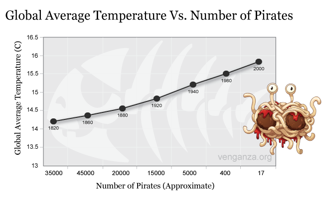

```{r setup, include=FALSE}
options(htmltools.dir.version = FALSE)
options(digits=4,scipen=2)
options(knitr.table.format="html")
xaringanExtra::use_xaringan_extra(c("tile_view","animate_css","tachyons"))
xaringanExtra::use_extra_styles(
  mute_unhighlighted_code = FALSE
)
library(knitr)
library(tidyverse)
library(ggplot2)
source('R/pres_theme.R')
knitr::opts_chunk$set(
  dev = "svg",
  warning = FALSE,
  message = FALSE,
  cache = TRUE
)
source('R/myfuncs.R')
```

```{r xaringan-themer, include = FALSE}
library(xaringanthemer)
style_mono_accent(
  #base_color = "#0F4C81", # DAPR1
  # base_color = "#BF1932", # DAPR2
  # base_color = "#88B04B", # DAPR3 
  base_color = "#FCBB06", # USMR
  # base_color = "#a41ae4", # MSMR
  header_color = "#000000",
  header_font_google = google_font("Source Sans Pro"),
  header_font_weight = 400,
  text_font_google = google_font("Source Sans Pro", "400", "400i", "600", "600i"),
  code_font_google = google_font("Source Code Pro")
)
```

class: inverse, center, middle

# Part 1:  Correlation

---
# Blood Alcohol and Reaction Time

.pull-left[
```{r ba, fig.asp=.6, echo=F,cache=F}
library(faux)
set.seed(29)
dat <- rnorm_multi(n=50,
                   mu=c(0.1,650),
                   sd=c(.009,60),
                   r=.4,
                   varnames=c('BloodAlc','RT'))
dat %>% ggplot(aes(x=BloodAlc,y=RT)) +
  xlab("Blood Alcohol %/vol") + ylab("RT (ms)") +
  geom_point(size=3)
```
- data from 100 drivers
- are blood alcohol and RT systematically related?

]
.pull-right[

]
???
- the playmo crew have been out joyriding and were caught in a police speed trap

- the police measured 100 people's blood alcohol and their reaction times

- how would we go about telling whether two variables like this were related?
---
# A Simplified Case

.center[
```{r cor5,echo=F,fig.asp=.5,cache=F}
dat2 <- rnorm_multi(n=5,
                    mu=c(5,5),
                    sd=c(2,2),
                    r=.70,
                    varnames=c('x','y'))
p<- dat2 %>% ggplot(aes(x=x,y=y)) +
  geom_point(size=5)
p
```
]

- does $y$ vary with $x$?

--

- equivalent to asking "does $y$ differ from its mean in the same way that $x$ does?"

---
count: false
# A Simplified Case

.center[
```{r cor5a,echo=F,fig.asp=.5,cache=F}
dat2$xm <- mean(dat2$x)
dat2$ym <- mean(dat2$y)
p2 <- p +
  geom_vline(xintercept=mean(dat2$x),colour="blue") +
  geom_segment(data=dat2,aes(xend=xm,yend=y),colour="blue",linetype="dotted")
p2
```
]

- does $y$ vary with $x$?

- equivalent to asking "does $y$ differ from its mean in the same way that $x$ does?"
???
here are the ways in which the values of $x$ differ from `mean(x)`

---
count: false
# A Simplified Case

.center[
```{r cor5b,echo=F,fig.asp=.5,cache=F}
p2 + geom_hline(yintercept=mean(dat2$y),colour="red") +
  geom_segment(data=dat2,aes(xend=x,yend=ym),colour="red",linetype="dotted")
```
]

- does $y$ vary with $x$?

- equivalent to asking "does $y$ differ from its mean in the same way that $x$ does?"
???
and here are the ways in which $y$ varies from its mean
---
# Covariance
.center[
```{r covlines,echo=FALSE, fig.asp=.4, fig.width=10}
library(patchwork)
dat2 <- dat2 %>% mutate(yd=y-ym, xd=x-xm)
g1 <- dat2 %>% ggplot(aes(x=1:5,y=yd,fill="r")) +
  scale_fill_manual(values=c("red")) +
  scale_x_discrete(limit=1:5,labels=round(dat2$yd,2)) +
  guides(fill=FALSE) +
  geom_bar(stat="identity") +
  xlab("") + ylab("y diff") + ylim(-3,3)
g2 <- dat2 %>% ggplot(aes(x=1:5,y=xd,fill="r")) +
  scale_fill_manual(values=c("blue")) +
  scale_x_discrete(limit=1:5,labels=round(dat2$xd,2)) +
  guides(fill=FALSE) +
  geom_bar(stat="identity") +
  xlab("") + ylab("x diff") + ylim(-3,3)
g1/g2
```
]

- it's likely the variables are related **if observations differ proportionately from their means**

---
# Covariance

### Variance
.br3.white.bg-gray.pa1[
$$ s^2 = \frac{\sum{(x-\bar{x})^2}}{n} = \frac{\sum{(x-\bar{x})(x-\bar{x})}}{n} $$
]

???
- note that here we're using $n$, not $n-1$, because this is the whole population
--

### Covariance
.br3.white.bg-gray.pa1[
$$ \textrm{cov}(x,y) = \frac{\sum{(x-\bar{x})\color{red}{(y-\bar{y})}}}{n} $$
]
???
- note that for any (x,y), $x-\bar{x}$ might be positive and $y-\bar{y}$ might be positive, so the covariance could be a negative number
---
# Covariance

```{r table,include=F}
library(gt)
t <- dat2 %>% select(xd,yd) %>% mutate(xy=xd * yd) %>% round(2)
```

| $x-\bar{x}$ | $y-\bar{y}$ | $(x-\bar{x})(y-\bar{y})$ |
|------------:|------------:|-------------------------:|
| `r t$xd[1]` | `r t$yd[1]` |              `r t$xy[1]` |
| `r t$xd[2]` | `r t$yd[2]` |              `r t$xy[2]` |
| `r t$xd[3]` | `r t$yd[3]` |              `r t$xy[3]` |
| `r t$xd[4]` | `r t$yd[4]` |              `r t$xy[4]` |
| `r t$xd[5]` | `r t$yd[5]` |              `r t$xy[5]` |
|             |             |        **`r sum(t$xy)`** |

.pt4[

$$ \textrm{cov}(x,y) = \frac{\sum{(x-\bar{x})(y-\bar{y})}}{n} = \frac{`r sum(t$xy)`}{5} \simeq \color{red}{`r round(sum(t$xy)/5,2)`} $$
]

???
- I've rounded up the numbers at the end to make this a bit neater on the slide
---
# The Problem With Covariance

.pull-left[

**Miles**

| $x-\bar{x}$ | $y-\bar{y}$ | $(x-\bar{x})(y-\bar{y})$ |
|------------:|------------:|-------------------------:|
| `r t$xd[1]` | `r t$yd[1]` |              `r t$xy[1]` |
| `r t$xd[2]` | `r t$yd[2]` |              `r t$xy[2]` |
| `r t$xd[3]` | `r t$yd[3]` |              `r t$xy[3]` |
| `r t$xd[4]` | `r t$yd[4]` |              `r t$xy[4]` |
| `r t$xd[5]` | `r t$yd[5]` |              `r t$xy[5]` |
|             |             |        **`r sum(t$xy)`** |

$$ \textrm{cov}(x,y)=\frac{`r sum(t$xy)`}{5}\simeq `r round(sum(t$xy)/5,2)` $$
]

.pull-right[
**Kilometres**
```{r mkm,include=F}
tk <- dat2 %>% select(xd,yd) %>% mutate(xd=xd * 1.60934,yd=yd * 1.60934) %>% mutate(xy=xd*yd) %>% round(2)
```

| $x-\bar{x}$ | $y-\bar{y}$ | $(x-\bar{x})(y-\bar{y})$ |
|------------:|------------:|-------------------------:|
| `r tk$xd[1]` | `r tk$yd[1]` |              `r tk$xy[1]` |
| `r tk$xd[2]` | `r tk$yd[2]` |              `r tk$xy[2]` |
| `r tk$xd[3]` | `r tk$yd[3]` |              `r tk$xy[3]` |
| `r tk$xd[4]` | `r tk$yd[4]` |              `r tk$xy[4]` |
| `r tk$xd[5]` | `r tk$yd[5]` |              `r tk$xy[5]` |
|             |             |        **`r sum(tk$xy)`** |

$$ \textrm{cov}(x,y)=\frac{`r sum(tk$xy)`}{5}\simeq `r round(sum(tk$xy)/5,2)` $$

]
???
- these are exactly the same 'values' so they should each be as correlated as the other

- so we need to divide covariance by something to represent the overall "scale" of the units

---
# Correlation Coefficient

- the standardised version of covariance is the **correlation coefficient**, $r$

$$ r = \frac{\textrm{covariance}(x,y)}{\textrm{standard deviation}(x)\cdot\textrm{standard deviation}(y)} $$

--

.pt3[
$$ r=\frac{\frac{\sum{(x-\bar{x})(y-\bar{y})}}{\color{red}{N}}}{\sqrt{\frac{\sum{(x-\bar{x})^2}}{\color{red}{N}}}\sqrt{\frac{\sum{(y-\bar{y})^2}}{\color{red}{N}}}} $$
]

--
.pt1[
$$ r=\frac{\sum{(x-\bar{x})(y-\bar{y})}}{\sqrt{\sum{(x-\bar{x})^2}}\sqrt{\sum{(y-\bar{y})^2}}} $$
]

---
# Correlation Coefficient

- measure of _how related_ two variables are

- $-1 \le r \le 1$ ( $\pm 1$ = perfect fit; $0$ = no fit; sign shows direction of slope )
.pull-left[

$$ r=`r cor(dat$BloodAlc,dat$RT)` $$
]
.pull-right[
```{r ba2,fig.asp=.6,echo=FALSE}
dat3 <- dat %>% mutate(Blood = max(BloodAlc)-BloodAlc+min(BloodAlc))
dat3 %>% ggplot(aes(x=Blood,y=RT)) +
  xlab("Blood Alcohol %/vol") + ylab("RT (ms)") +
  geom_point(size=3)
```

$$ r=`r cor(dat3$Blood,dat$RT)` $$
]
???
- on the left, we have the drunken drivers from our first slide, and you can see that there is a moderate positive correlation
  + the higher your blood alcohol, the slower your RT
  
- on the right, we have a negative correlation: what the drivers _think_ happens
  + the higher your blood alcohol, the _faster_ your RT
---
# What Does the Value of _r_ Mean?

```{r lots, fig.asp=.4, echo=F, fig.width=11}
set.seed(13)
ndat <- rnorm_multi(n=50,
                   mu=c(0.1,650),
                   sd=c(.009,60),
                   r=0,
                   varnames=c('BloodAlc','RT'),
                   empirical = TRUE)
p1 <- ndat %>% ggplot(aes(x=BloodAlc,y=RT)) +
  xlab("Blood Alcohol %/vol") + ylab("RT (ms)") +
  geom_point(size=2) + ggtitle("r = 0") +
  theme_presentation(10) +
  theme(plot.title = element_text(size = 14, colour="red")) +
  ylim(500,850)
ndat <- rnorm_multi(n=50,
                   mu=c(0.1,650),
                   sd=c(.009,60),
                   r=0.2,
                   varnames=c('BloodAlc','RT'),
                   empirical = TRUE)
p2 <- ndat %>% ggplot(aes(x=BloodAlc,y=RT)) +
  xlab("Blood Alcohol %/vol") + ylab("RT (ms)") +
  geom_point(size=2) + ggtitle("r = 0.2") +
  theme_presentation(10) +
  theme(plot.title = element_text(size = 14, colour="red")) +
  ylim(500,850)
ndat <- rnorm_multi(n=50,
                   mu=c(0.1,650),
                   sd=c(.009,60),
                   r=0.5,
                   varnames=c('BloodAlc','RT'),
                   empirical = TRUE)
p3 <- ndat %>% ggplot(aes(x=BloodAlc,y=RT)) +
  xlab("Blood Alcohol %/vol") + ylab("RT (ms)") +
  geom_point(size=2) + ggtitle("r = 0.5") +
  theme_presentation(10) +
  theme(plot.title = element_text(size = 14, colour="red")) +
  ylim(500,850)
ndat <- rnorm_multi(n=50,
                   mu=c(0.1,650),
                   sd=c(.009,60),
                   r=0.9,
                   varnames=c('BloodAlc','RT'),
                   empirical = TRUE)
p4 <- ndat %>% ggplot(aes(x=BloodAlc,y=RT)) +
  xlab("Blood Alcohol %/vol") + ylab("RT (ms)") +
  geom_point(size=2) + ggtitle("r = 0.9") +
  theme_presentation(10) +
  theme(plot.title = element_text(size = 14, colour="red")) +
  ylim(500,850)
(p1 + p2) / (p3 + p4)
```


---
class: inverse, center, middle, animated, bounceInUp

# Intermission

---
class: inverse, center, middle

# Part 1a

## Correlations Contd.

---
# Significance of a Correlation

.pull-left[

$$ r = `r cor(dat$BloodAlc,dat$RT)` $$
]
.pull-right[

]
???
- the police have stopped our friends and measured their blood alcohol

- is their evidence sufficient to conclude that there is likely to be a relationship between blood alcohol and reaction time?
---
# Significance of a Correlation

- we can measure a correlation using $r$

- we want to know whether that correlation is **significant**

  + i.e., whether the probability of finding it by chance is low enough
  
.pt2[
- cardinal rule in NHST:  compare everything to chance

- let's investigate...
]
---
# Random Correlations

- function to pick some pairs of numbers entirely at random, return correlation

- arbitrarily, I've picked numbers uniformly distributed between 0 and 100

```{r pcor0}
x <- runif(5, min=0, max=100)
y <- runif(5, min=0, max=100)
cbind(x,y)
cor(x,y)
```

---
count: false
# Random Correlations

- function to pick some pairs of numbers entirely at random, return correlation

- arbitrarily, I've picked numbers uniformly distributed between 0 and 100

.flex.items-top[
.w-50.pa2[

```{r pcor, fig.asp=.6,fig.show='hide'}
randomCor <- function(size) {
  x <- runif(size, min=0, max=100)
  y <- runif(size, min=0, max=100)
  cor(x,y) # calculate r
}

# then we can use the usual trick:
rs <- replicate(1000, randomCor(5))
hist(rs)
```

]
.w-50.pa2[

]]

---
# Random Correlations

.pull-left[

```{r pcor2,echo=FALSE,fig.asp=.8}
t <- tibble(r=replicate(1000,randomCor(15)))
t %>% ggplot(aes(x=r)) + geom_density(size=2) +
  ggtitle("1000 correlations of 15 random pairs") +
  ylim(0,2.5) + xlim(-.8,.8) +
  geom_segment(aes(x=quantile(r,.025),xend=quantile(r,.975),y=1.5,yend=1.5),colour="red",size=1,arrow=arrow(type="open",ends="both")) +
  annotate("text",x=0,y=1.65,label="95% of observations",size=6,colour="red")
```

]
.pull-right[
```{r pcor3,echo=FALSE,fig.asp=.8}
t <- tibble(r=replicate(1000,randomCor(30)))
t %>% ggplot(aes(x=r)) + geom_density(size=2) +
  ggtitle("1000 correlations of 30 random pairs") +
  ylim(0,2.5) + xlim(-.8,.8) +
  geom_segment(aes(x=quantile(r,.025),xend=quantile(r,.975),y=1.5,yend=1.5),colour="red",size=1,arrow=arrow(type="open",ends="both")) +
  annotate("text",x=0,y=1.65,label="95% of observations",size=6,colour="red")
```

]
---
# Larger Sample Size

.pull-left[
```{r pcor4,echo=FALSE,fig.asp=.8}
t <- tibble(r=replicate(10000,randomCor(30)))
rt <- function(r,n) {r*sqrt((n-2)/(1-r^2))}
dtr <- function(r,n) {dt(rt(r,n),n-2)*sqrt((n-2)/(1-r^2))}
p <- t %>% ggplot(aes(x=r)) + geom_density(size=2) +
  ggtitle("10000 correlations of 30 random pairs") +
  ylim(0,2.5) + xlim(-.8,.8)
p + stat_function(fun=dtr,colour="red",args=list(n=30))
```
]
.pull-right[
- distribution of random $r$s is $t$ distribution, with $n-2$ df

$$ t= r\sqrt{\frac{n-2}{1-r^2}} $$

- makes it "easy" to calculate probability of getting $\ge{}r$ for sample size $n$ by chance
]

---
# Pirates and Global Warming

.center[

]

- clear _negative_ correlation between number of pirates and mean global temperature
- we need pirates to combat global warming

---
# Simpson's Paradox

.center[
```{r simpson, echo=F, fig.asp=.6,fig.width=6}
set.seed(13)
dat <- correlation::simulate_simpson(n=50,r=-.5,groups=3) %>% mutate(prob=(V1-min(V1))/(max(V1)-min(V1)),hours=(V2-min(V2))/(max(V2)-min(V2))*10) %>% mutate(group=factor(Group,labels=c('younger','middle','older')))
p <- dat %>% ggplot(aes(x=hours,y=prob)) +
  geom_point(size=2) +
  geom_smooth(method="lm") +
  xlab("hours of exercise") +
  ylab("prob of disease") + theme_presentation(14)
p
```
]

- the more hours of exercise, the greater the risk of disease
---
# Simpson's Paradox

.center[
```{r simpson2, fig.asp=.6, echo=F,fig.width=6}
p + geom_point(aes(colour=group)) +
  geom_smooth(aes(colour=group),method="lm")
```
]

- age groups mixed together
- an example of a _mediating variable_

---
# Interpreting Correlation

- correlation does not imply causation

- correlation simply suggests that two variables are related

  + there may be mediating variables

- interpretation of that relationship is key

- never rely on statistics such as $r$ without

  + looking at your data

  + thinking about the real world

---
class: inverse, center, middle, animated, bounceInUp

# End of Part 1

---
class: inverse, center, middle

# Part 2

---
# Has Statistics Got You Frazzled?

.pull-left[

]

.pull-right[
- we've bandied a lot of terms around in quite a short time

- we've tended to introduce them by example

- time to step back...
]
---
class: inverse, center, middle
# Part Z:  The Zen of Stats

.center[

]

---
# What is NHST all about?

## **N**ull **H**ypothesis **S**tatistical **T**esting

- two premises

  1. much of the variation in the universe is due to _chance_

  1. we can't _prove_ a hypothesis that something else is the cause

---
# Chance

.pull-left[
- when we say _chance_, what we really mean is "stuff we didn't measure"

- we believe that "pure" chance conforms approximately to predictable patterns (like the normal and $t$ distributions)

  - if our data isn't in a predicted pattern, perhaps we haven't captured all of the non-chance elements
]

.pull-right[
### pattens attributable to

```{r chance,echo=F,fig.asp=.6}
x <- tibble(x=c(-4,4))
p1 <- x %>% ggplot(aes(x=x)) +
  stat_function(fun=dnorm,size=1) +
  xlab("SDs") + ylab("density") +
  ggtitle("Chance")

db <- function(x) {dnorm(x-2)+dnorm(x+1)}
p2 <- x %>% ggplot(aes(x=x)) +
  stat_function(fun=db,size=1) +
  xlab("SDs") + ylab("") +
  ggtitle("Something Else")

p1+p2
```
]
???
- we'll come back to looking at the patterns later on; essentially there is always going to be some part of any variation we can't explain
---
# Proof

.pull-left[


]
.pull-right[
- can't prove a hypothesis to be true

- "the sun will rise tomorrow"
]


---
count: false
# Proof

.pull-left[


]
.pull-right[
- can't prove a hypothesis to be true

- "the sun will rise tomorrow"

- _just takes one counterexample_
]

---
# Chance and Proof

.br3.pa2.bg-gray.white[if the likelihood that the pattern of data we've observed would be found _by chance_ is low enough, propose an alternative explanation
]

- work from summaries of the data (e.g., $\bar{x}$, $\sigma$)

- use these to approximate chance (e.g., $t$ distribution)

--

  + catch: we can't estimate the probability of an exact value (this is an example of the measurement problem)
  
  + estimate the probability of finding the measured difference _or more_

---
# Alpha and Beta

- we need an agreed "standard" for proposing an alternative explanation

  + typically in psychology, we set $\alpha$ to 0.05

  + "if the probability of finding this difference or more under chance is $\alpha$ (e.g., 5%) or less, propose an alternative"
  
- we also need to understand the quality of evidence we're providing

  + can be measured using $\beta$ (psychologists typically aim for 0.80)

  + "given that an effect truly exists in a population, what is the probability of finding $p<\alpha$ in a sample (of size $n$ etc.)?"

---
class: middle
background-image: url(lecture_5_files/img/nuts-and-bolts.jpg)

.br3.pa2.bg-white-80[
# The Rest is Just Nuts and Bolts

- type of measurement

- relevant laws of chance

- suitable estimated distribution (normal, $t$, $\chi^2$, etc.)

- suitable summary statistic ( $z$, $t$, $\chi^2$, $r$, etc.)

- use statistic and distribution to calculate $p$ and compare to $\alpha$

- rinse, repeat

]
---
# The Most Useful Tool

.pull-left[

]
.pull-right[
- $t$ (or $z$) statistics are really ubiquitous

- formally, mean difference divided by standard error

- conceptually:

  + what is the difference?
  + what is the range of differences I would get by chance?
  + how extreme is this difference compared to the range?
  
- expressed in terms of _numbers of standard errors_ from the most likely difference (usually, by hypothesis, zero)
]
---
class: inverse, center, middle
# Part N: Nirvana

.center[

]

---
# .red[Announcement]

.flex.items-center[
.w-50.pa2[
- no lecture or lab released in week 6 (26-31 October)

- quiz due on Friday 30th

- after the break: linear models

- in the meantime, have a good break and a Happy Halloween
]
.w-50.pa2[

]]
---
class: inverse, center, middle, animated, bounceInUp

# End

---
# Acknowledgements

- the [papaja package](https://github.com/crsh/papaja) helps with the preparation of APA-ready manuscripts

- icons by Diego Lavecchia from the [Noun Project](https://thenounproject.com/)