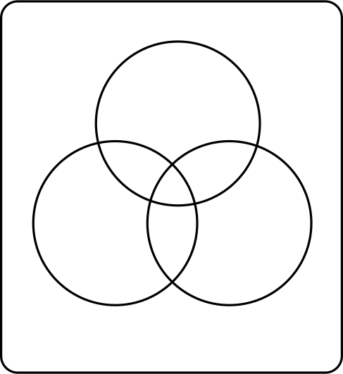
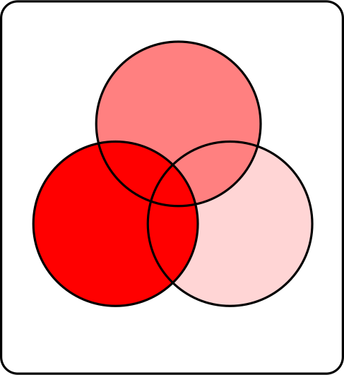

```{r setup, include=FALSE}
options(htmltools.dir.version = FALSE)
options(digits=4,scipen=2)
options(knitr.table.format="html")
xaringanExtra::use_xaringan_extra(c("tile_view","animate_css","tachyons"))
xaringanExtra::use_extra_styles(
  mute_unhighlighted_code = FALSE
)
library(knitr)
library(tidyverse)
library(ggplot2)
source('R/pres_theme.R')
knitr::opts_chunk$set(
  dev = "svg",
  warning = FALSE,
  message = FALSE,
  cache = TRUE
)
source('R/myfuncs.R')
```

```{r xaringan-themer, include = FALSE}
library(xaringanthemer)
style_mono_accent(
  #base_color = "#0F4C81", # DAPR1
  # base_color = "#BF1932", # DAPR2
  # base_color = "#88B04B", # DAPR3 
  base_color = "#FCBB06", # USMR
  # base_color = "#a41ae4", # MSMR
  header_color = "#000000",
  header_font_google = google_font("Source Sans Pro"),
  header_font_weight = 400,
  text_font_google = google_font("Source Sans Pro", "400", "400i", "600", "600i"),
  code_font_google = google_font("Source Code Pro")
)
```

class: inverse, center, middle
# Part 1
## Checking Assumptions

---
# Back on the Road Again!

.pull-left[
```{r frecap2,fig.asp=.6,echo=FALSE}
library(faux)
set.seed(29)
dat <- rnorm_multi(n=50,
                   mu=c(0.1,650),
                   sd=c(.009,60),
                   r=.4,
                   varnames=c('BloodAlc','RT'))
d20 <- dat %>% sample_n(20)
m1 <- lm(RT~BloodAlc, data=d20)
d20 <- d20 %>% mutate(pred=predict(m1),mRT=mean(RT))
dat %>% ggplot(aes(x=BloodAlc,y=RT)) +
  xlab("Blood Alcohol %/vol") + ylab("RT (ms)") +
  geom_point(size=3) + geom_smooth(method="lm")
mod <- lm(RT~BloodAlc, data=dat)
```

.tc[
"for every extra 0.01% blood alcohol, reaction time slows down by around `r round(coef(mod)[2]*0.01,0)` ms"
]
]
.pull-right[


]

---
# The Model We Nearly Made
### All 50 Participants
```{r summod,echo=F}
summary(mod)
```

???
- note the _huge_ affect of `BloodAlc`

- why is this? [pause?]

- because these are "real" units, not units x 100

---
# Assumptions of Linear Models

.pull-left[
.br3.bg-gray.white.pa2[
### required
- **linearity** of relationship(!)

- for the _residuals_:
  + **normality**
  + **homogeneity of variance**
  + **independence**
]
]
.pull-right[
.br3.bg-gray.white.pa2[
### desirable
<!-- - uncorrelated predictors (no collinearity) -->
- no 'bad' (overly influential) observations
]]

---
# Residuals

.pull-left[
$$y_i=b_0+b_1\cdot{}x_i+\epsilon_i$$
$$\color{red}{\epsilon\sim{}N(0,\sigma)~\text{independently}}$$
- normally distributed (mean should be $\simeq{}$ zero)

- homogeneous (differences from $\hat{y}$ shouldn't be systematically smaller or larger for different $x$)

- independent (residuals shouldn't influence other residuals)
]
.pull-right[
```{r resid,fig.asp=.6,echo=F}
d20 %>% ggplot(aes(x=BloodAlc,y=RT,yend=pred)) +
  geom_segment(aes(xend=BloodAlc),linetype="dotted",colour="red",size=1) +
  geom_smooth(method="lm",se=FALSE) +
  geom_point(size=3)
```
]
---
# At A Glance
```{r modresid,highlight.output=7}
summary(mod)
```

---
# In More Detail

```{r margins,include=FALSE}
par(mar=c(0,0,0,0))
```

.pull-left[
### linearity

```{r resid1,fig.asp=.8,fig.show='hide'}
plot(mod,which=1)
```
- plots residuals $\epsilon_i$ against fitted values $\hat{y}_i$

- the 'average residual' is roughly zero across $\hat{y}$, so relationship is likely to be linear
]
.pull-right[

]
---
# In More Detail

.pull-left[
### normality

```{r resid2,fig.asp=.8,fig.show='hide'}
hist(resid(mod))
```
]
.pull-right[

]
---
count: false
# In More Detail

.pull-left[
### normality

```{r resid3,fig.asp=.8,fig.show='hide'}
plot(density(resid(mod)))
```

- check that residuals $\epsilon$ are approximately normally distributed

- in fact there's a better way of doing this...
]
.pull-right[

]

---
name: QQ
# In More Detail

.pull-left[
### normality

```{r resid4,fig.asp=.8,fig.show='hide'}
plot(mod,which=2)
```

- **Q-Q plot** compares the residuals $\epsilon$ against a known distribution (here, normal)

- observations close to the straight line mean residuals are approximately normal

- numbered observations refer to _row numbers_ in the original data, for checking
]
.pull-right[

]
---
# Q-Q Plots

.pull-left[
#### y axis

- for a normal distribution, what values _should_ (say) 2%, or 4% of the observations lie below?

- expressed in "standard deviations from the mean"

```{r qn1}
qnorm(c(.02,.04))
```
]

--

.pull-right[
#### x axis

- from our residuals, what values _are_ (say) 2%, or 4%, of observations found to be less than?

- convert to "standard deviations from the mean"

```{r qn2}
quantile(scale(resid(mod)),c(.02,.04))
```
]

--

- Q-Q Plot shows these values plotted against each other

---
template: QQ
---
# In More Detail

.pull-left[
### homogeneity of variance

```{r resid5,fig.asp=.8,fig.show='hide'}
plot(mod,which=3)
```

- the _size_ of the residuals is approximately the same across values of $\hat{y}$
]
.pull-right[

]

---
# Visual vs Other Methods

- statistical ways of checking assumptions will be introduced in labs

- they tend to have limitations (for example, they're susceptible to sample size)

- nothing beats looking at plots like these (and `plot(<model>)` makes it easy)

- however, two things:

--

.pt2[
1. there are no criteria for deciding exactly when assumptions are sufficiently met

  + it's a matter of experience and judgement
  
1. we need to talk about **independence** of residuals
]

---
class: inverse, center, middle, animated, flip
# End of Part 1
---
class: inverse, center, middle
# Part 2
## Independence, Influence
---
# Independence

- no easy way to check independence of residuals

- in part, because it depends on the _source_ of the observations

.pt2[
- one determinant might be a single person being observed multiple times

- e.g., my reaction times might tend to be slower than yours<br/>
  $\rightarrow$ multivariate statistics
]
---
# Independence

- another determinant might be _time_

- observations in a sequence might be autocorrelated
  
- can be checked using the Durbin-Watson Test from the `car` package
  
```{r dwt,highlight.output=2}
library(car)
dwt(mod)
```

- shows no autocorrelation at lag 1
---
# Influence
.center[
```{r baddata1,echo=F,fig.asp=.6,fig.width=6}
ba <- mean(d20$BloodAlc)
b20 <- d20 %>% select(RT,BloodAlc) %>% add_row(BloodAlc=ba,RT=1000)
p <- d20 %>% ggplot(aes(x=BloodAlc,y=RT)) +
  geom_point(size=2) +
  geom_smooth(method="lm",se=FALSE)
m <- lm(RT~BloodAlc,data=b20)
tt <- tibble(x=c(min(b20$BloodAlc),max(b20$BloodAlc)),
             y=c(min(predict(m)),max(predict(m))))
p + geom_line(data=tt,aes(x=x,y=y),size=.8,colour="red") +
  geom_point(aes(x=ba,y=1000),size=3,colour="red")
```
]
- even substantial **outliers** may only have small effects on the model

- here, only the intercept is affected
---
# Influence
.center[
```{r baddata2,echo=F,fig.asp=.6,fig.width=6}
m1 <- lm(RT~BloodAlc,data=d20)
rt=coef(m1)[1]+.14*coef(m1)[2]+rnorm(1,sd=50)
b20 <- d20 %>% select(RT,BloodAlc) %>% add_row(BloodAlc=.14,RT=rt)
m <- lm(RT~BloodAlc,data=b20)
tt <- tibble(x=c(min(b20$BloodAlc),max(b20$BloodAlc)),
             y=c(min(predict(m)),max(predict(m))))
p + geom_line(data=tt,aes(x=x,y=y),size=.8,colour="red") +
  geom_point(aes(x=.14,y=rt),size=3,colour="red")
```
]
- observations with high **leverage** are inconsistent with other data, but may not be distorting the model

---
# Influence
.center[
```{r baddata3,echo=F,fig.asp=.6,fig.width=6}
m1 <- lm(RT~BloodAlc,data=d20)
rt=coef(m1)[1]+.13*coef(m1)[2]+rnorm(1,sd=50)-250
b20 <- d20 %>% select(RT,BloodAlc) %>% add_row(BloodAlc=.13,RT=rt)
m <- lm(RT~BloodAlc,data=b20)
tt <- tibble(x=c(min(b20$BloodAlc),max(b20$BloodAlc)),
             y=c(min(predict(m)),max(predict(m))))
p + geom_line(data=tt,aes(x=x,y=y),size=.8,colour="red") +
  geom_point(aes(x=.13,y=rt),size=3,colour="red")
```
]
- we care about observations with high **influence** (outliers with high leverage)
---
# Cook's Distance

.center[
```{r cook,fig.asp=.6,fig.width=6,echo=F}
tt <- mutate(tt,y1=c(min(predict(m1)),coef(m1)[1]+max(x)*coef(m1)[2]))
tb <- d20 %>% mutate(y1=predict(m1),y2=predict(m)[-21])
d20 %>% ggplot(aes(x=BloodAlc,y=RT)) +
  geom_point(size=2) + geom_point(aes(x=.13,y=rt),size=3,colour="red") +
  geom_line(data=tt,aes(x=x,y=y),col="red",size=.8) +
  geom_line(data=tt,aes(x=x,y=y1),col="blue",size=.8) +
  geom_segment(data=tb,aes(x=BloodAlc,xend=BloodAlc,y=y1,yend=y2),linetype="dashed")
```
]

- a standardised measure of "how much the model differs without observation $i$"

---
.flex.items-center[.w-10.pa1[] .f1.w-80.pa1[Cook's Distance]]

.pt3[
$$D_i=\frac{\sum_{j=1}^{n}{(\hat{y}_j-\hat{y}_{j(i)})^2}}{(p+1)\hat{\sigma}^2}$$
- $\hat{y}+j$ is the $j$th fitted value
- $\hat{y}_{j(i)}$ is the $j$th value from a fit which doesn't include observation $i$
- $p$ is the number of regression coefficients
- $\hat{\sigma}^2$ is the estimated variance from the fit, i.e., mean squared error
]
---
# Cook's Distance

```{r scramble,include=F}
b20 <- b20 %>% slice_sample(n=21)
mod <- lm(RT~BloodAlc,data=b20)
```

.pull-left[
```{r cook2,fig.asp=.8,fig.show='hide'}
plot(mod,which=4)
```

- observations labelled by row

- various rules of thumb, but start looking when Cook's Distance > 0.5
]
.pull-right[

]

---
class: animated, rollIn
# Learning to Read

```{r makedat,include=FALSE}
# library(broom)
# doit <- TRUE
# 
# while (doit) {
#   reading <- tibble(
#     age=runif(50,5,11),
#     hrs_wk=rnorm(50,5,1),
#     method=gl(2,25,labels=c("phonics","word"))
#   )
# 
#   reading <- reading %>% mutate(
#     R_AGE=age + hrs_wk/2 - ifelse(method=="word",2,0)
#   )
# 
#   reading <- reading %>% mutate(
#     R_AGE=R_AGE+hrs_wk*ifelse(method=="word",0,.6)
#   )
# 
#   reading <- reading %>% mutate(
#     R_AGE=R_AGE-.03*age*hrs_wk
#   )
# 
#   reading <- reading %>% mutate(
#     R_AGE=R_AGE+rnorm(50,sd=.5)
#   )
# 
#   m <- lm(R_AGE ~ method,data=reading) %>% tidy() %>% mutate(sig=(p.value<.05))
#   if (!m$sig[2]) {
#     next
#   }
# 
#   m <- lm(R_AGE~age+hrs_wk,data=reading) %>% tidy() %>% mutate(sig=(p.value<.05))
# 
#   if (sum(m$sig[2:3])!=2) {
#     next
#   }
# 
#   m <- lm(R_AGE ~ hrs_wk*method,data=reading) %>% tidy() %>% mutate(sig=(p.value<.05))
#   if (!m$sig[4]) {
#     next
#   }
# 
#   m <- lm(R_AGE ~ age*hrs_wk,data=reading) %>% tidy() %>% mutate(sig=(p.value<.05))
#   if (!m$sig[4]) {
#     next
#   }
# 
#   doit <- FALSE
# 
# }
# 
# save(reading,file = "R/reading.Rdata")

load("R/reading.Rdata")
```
.pull-left[

]
.pull-right[
- the Playmo School has been evaluating its reading programmes, using 50 students

- ages of students

- hours per week students spend reading of their own volition

- whether they are taught using phonics or whole-word methods

- **outcome: "reading age"**
]

---
count: false
# Learning to Read

.pull-left[

]
.pull-right[
.center[
```{r showdat, echo=FALSE}
library(gt)
reading %>% slice(c(1:5,46:50)) %>% gt()
```
]]
???
- this is just some of the data in the dataframe

- on the right you can see the outcome variable, `R_AGE` for reading age.

- note that I tend to put my dependent variables in all caps, just so that I can recognise at a glance that they're what we measured.
---
count: false
# Learning to Read

.pull-left[

]
.pull-right[
.center[
```{r showdat2, echo=FALSE}
library(gt)
reading %>% slice(c(1:5,46:50)) %>% gt() %>%
  data_color(columns=c("hrs_wk","R_AGE"),colors="#d0d9ff",alpha=.8)
```
]]

---
# Does Practice Affect Reading Age?

.pull-left[

```{r plot1,fig.asp=.6,fig.show='hide'}
p <- reading %>% 
  ggplot(aes(x=hrs_wk,y=R_AGE)) +
  geom_point(size=3) +
  ylab("reading age") +
  xlab("hours reading/week")
p
```

]
.pull-right[

]

--

- hours per week is correlated with reading age: $r=`r cor(reading$hrs_wk,reading$R_AGE)`$,
$p=`r cor.test(reading$hrs_wk,reading$R_AGE)$p.value`$

- we can use a linear model to say something about the effect size

---
# Does Practice Affect Reading Age?

.pull-left[
```{r plot2,fig.asp=.6,fig.show='hide'}
p + geom_smooth(method="lm")
```
]
.pull-right[

]

```{r include=FALSE}
mod <- lm(R_AGE~hrs_wk,data=reading)
```

--

- each extra hour spent reading a week adds `r .rround(coef(mod)[2])` years to reading age


---
# A Linear Model

```{r lm1, highlight.output=c(7,11,12,17,18)}
mod <- lm(R_AGE ~ hrs_wk, data=reading)
summary(mod)
```

---
class: center, middle, inverse
.f1[but...]
---
.center[
```{r diagp2,echo=FALSE,fig.asp=.7,fig.width=9}
par(mfrow=c(2,2))
plot(mod,which=1:4)
```
]

---
# Assumptions Not Met!
.pull-left[
- it seems that the assumptions aren't met for this model

- (another demonstration on the right)

- one reason for this can be because there's still systematic structure in the residuals

- i.e., _more than one thing_ which can explain the variance
]
.pull-right[
```{r re,echo=F,fig.asp=.7}
plot(density(resid(mod)))
```

]
---
class: inverse, center, middle, animated, flip

# End of Part 2
---
class: inverse, center, middle

# Part 3
## Multiple Regression 

---
# Adding Age into the Equation

.pull-left[
- so far, have focused on effects of practice

- but presumably older children read better?

```{r tab3,echo=F}
reading %>% slice(c(1:3,48:50)) %>% gt() %>%
  data_color(columns=c("age","R_AGE"),colors="#d0d9ff",alpha=.8)
```
]
.pull-right[
```{r try3d,echo=F,fig.width=7}
library(rgl)
par(mar=c(0,0,0,0))
plot3d(x=reading$hrs_wk,y=reading$age,z=reading$R_AGE,
       type='s',
       radius=.1,
       xlab="practise",ylab="age",zlab="READING AGE")
rglwidget()
```
]

???
- **rotate cube leftward to show R_AGE~age**
---
# Another Model

.center[
```{r anmod,fig.asp=.6,echo=F}
reading %>% ggplot(aes(x=age,y=R_AGE)) +
  xlab("age") + ylab("reading age") +
  geom_point(size=3) +
  geom_smooth(method="lm")
```

]

---
# Another Model

```{r mod2,highlight.output=c(7,11,12,17,18)}
mod2 <- lm(R_AGE ~ age, data=reading)
summary(mod2)
```

???
- point out that intercept is quite meaningless (reading age for age zero)

---
.center[
```{r diag2,echo=F,fig.asp=.7,fig.width=9}
par(mfrow=c(2,2))
plot(mod2,which=1:4)

```
]

---
# Two Models, No Answers

.pull-left[
- we now have two models that don't map well to assumptions

- each suggests an effect

  + one of `age`
  
  + one of `hrs_wk`
]
.pull-right[
- if we run them independently, the chances of a type 1 error are

  + $\frac{1}{20}$ (`mod`, including `hrs_wk`)
  
  + $\frac{1}{20}$ (`mod2`, including `age`)
  
- or ** $\frac{1}{10}$ ** overall
]

--
.pt1[
&nbsp;
]

.br3.pa2.bg-gray.white.tc[
we need to test multiple predictors in _one_ linear model
]
---
# Model Equations Again

$$\color{red}{\textrm{outcome}_i}=\color{blue}{(\textrm{model})_i}+\textrm{error}_i$$

$$\color{red}{y_i}=\color{blue}{b_0\cdot{}1+b_1\cdot{}x_i}+\epsilon_i$$
--

### linear model with two predictors

$$\color{red}{y_i}=\color{blue}{b_0\cdot{}1+b_1\cdot{}x_{1i}+b_2\cdot{}x_{2i}}+\epsilon_i$$
$$\color{red}{\hat{y}_i}=\color{blue}{b_0\cdot{}1+b_1\cdot{}x_{1i}+b_2\cdot{}x_{2i}}$$

--
.center[
`y ~ 1 + x1 + x2`

`R_AGE ~ 1 + hrs_wk + age` &nbsp;&nbsp; or &nbsp;&nbsp; `R_AGE ~ hrs_wk + age`<sup>1</sup>
]


.footnote[
<sup>1</sup> we'll come back to why order can matter in a bit
]
---
# Running A Multiple Regression

```{r multi,highlight.output=11:13}
mod.m <- lm(R_AGE ~ age + hrs_wk, data=reading)
summary(mod.m)
```

---
# Running a Multiple Regression

```{r multi2, echo=F}
ca <- coef(mod.m)[2]
ch <- coef(mod.m)[3]
.pp(summary(mod.m),l = list(0,11:13,0))
```

- there are _independent_ effects of age and practice

  + reading age improves by `r ca` for each year of age

  + reading age improves by `r ch` for each weekly hour of practice

- note that the _intercept_ (0 years old, 0 hours/week) is meaningless here

--

- important question:  is this model _better_ than a model based just on age?

---
# Model Fit

```{r multi3,echo=F}
.pp(summary(mod.m),l=list(0,17:19))

```

- in multiple regression, $R^2$ measures the fit of the entire model
  + sum of individual $R^2$s _if predictors not correlated_

- $R^2=`r summary(mod.m)$r.squared`$ looks better than the $R^2$ for `mod2` (`age` as a predictor) of $`r summary(mod2)$r.squared`$

- but _any_ predictor will improve $R^2$ (chance associations guarantee this)

```{r multi4,eval=F}
mod.r <- update(mod2, ~ . + runif(50)) #<<
summary(mod.r)
```
```{r multi4b,echo=F}
mod.r <- update(mod2, ~ . + runif(50))
.pp(summary(mod.r),l=list(0,18,0))
```
???

- Adjusted $R^2$ accounts for multiple predictors

- for `mod2`, it's `r summary(mod2)$adj.r.squared`

- for `mod.r`, it's `r summary(mod.r)$adj.r.squared`

---
# Comparing Models

```{r multic,echo=F,highlight.output=3}
.pp(summary(mod.r),l=list(0,18:19))
```

- $F$ ratio compares model to the null model, which just has an intercept

- but we can also use $F$ ratios to compare models in succession

```{r multic2}
anova(mod.m)
```

---
# Order Matters!

- `age` then `hrs_wk`
```{r multic3, echo=F}
<<multic2>>
```
- `hrs_wk` then `age`
```{r multic4o, echo=F}
anova(lm(R_AGE~hrs_wk+age,data=reading))
```

---
# Type 1 vs. Type 3 SS

- order matters because R, by default, uses **Type 1** sums of squares
  + calculate each predictor's improvement to the model _in turn_
- compare to **Type 3** sums of squares
  + calculate each predictor's improvement to the model _taking all other predictors into account_
  
- huge debate about which is "better" (nobody likes Type 2)

- if using Type 1, _predictors should be entered into the model in a theoretically-motivated order_
---
# Type 1 vs. Type 3 SS
.pull-left[
### type 1
.center[

]]
.pull-right[
### type 3
.center[

]]
---

```{r t1, echo=F, results="asis"}
img <- dir("lecture_7_files/t13/",pattern="type1.+svg$",full.names=TRUE)
slides_txt <- glue::glue("
count: false
# Type 1 vs. Type 3 SS
.pull-left[
### type 1
.center[

]]
.pull-right[
### type 3
.center[

]]

---

")
cat(slides_txt, sep="")
```

```{r t3, echo=F, results="asis"}
img <- dir("lecture_7_files/t13/",pattern="type3.+svg$",full.names=TRUE)
slides_txt <- glue::glue("
count: false
# Type 1 vs. Type 3 SS
.pull-left[
### type 1
.center[

]]
.pull-right[
### type 3
.center[

]]

---

")
cat(slides_txt, sep="")
```

# The Two-Predictor Model

```{r multiti,highlight.output=11:13}
<<multi>>
```
---

# The Two-Predictor Model

.flex.items-center[
.w-25[
&nbsp;
]
.w-50[
```{r 3d,echo=F}
plot3d(x=reading$hrs_wk,y=reading$age,z=reading$R_AGE,
       type='s',
       radius=.1,
       xlab="practise",ylab="age",zlab="READING AGE")
coefs <- coef(mod.m)
a <- coefs["hrs_wk"]
b <- coefs["age"]
c <- -1
d <- coefs["(Intercept)"]
planes3d(a,b,c,d, alpha=0.5)
rglwidget()
```
]
.w-25[
&nbsp;
]]
---
class: inverse, center, middle, animated, flip

# End

---
# Acknowledgements


- icons by Diego Lavecchia from the [Noun Project](https://thenounproject.com/)