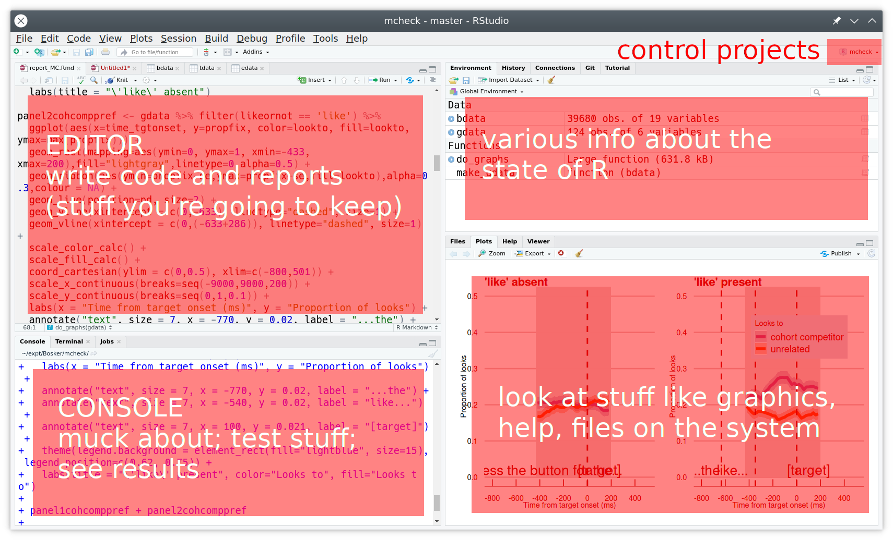
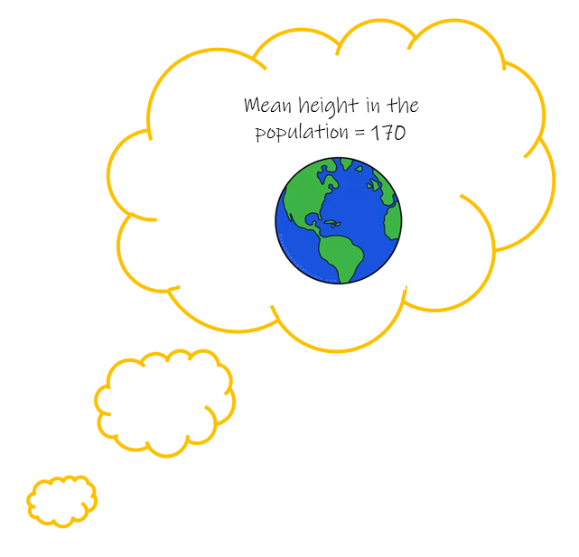

```{r setup, include=FALSE}
options(htmltools.dir.version = FALSE)
options(digits=4,scipen=2)
options(knitr.table.format="html")
xaringanExtra::use_xaringan_extra(c("tile_view","animate_css","tachyons"))
xaringanExtra::use_extra_styles(
  mute_unhighlighted_code = FALSE
)
library(knitr)
library(tidyverse)
library(ggplot2)
library(patchwork)
source('R/pres_theme.R')
knitr::opts_chunk$set(
  dev = "svg",
  warning = FALSE,
  message = FALSE,
  cache = FALSE
)
source('R/myfuncs.R')

library(xaringanthemer)
style_mono_accent(
  #base_color = "#0F4C81", # DAPR1
  # base_color = "#BF1932", # DAPR2
  # base_color = "#88B04B", # DAPR3 
  base_color = "#FCBB06", # USMR
  # base_color = "#a41ae4", # MSMR
  header_color = "#000000",
  header_font_google = google_font("Source Sans Pro"),
  header_font_weight = 400,
  text_font_google = google_font("Source Sans Pro", "400", "400i", "600", "600i"),
  code_font_google = google_font("Source Code Pro")
)
```

class: inverse, center, middle

# Week 1: R

???
- Week 1 was really all about getting started with R and RStudio  


---
# Week 1: R



???
- hopefully getting more familiar with using this software now
- IT IS HARD
- there's not an expectation that you commit this all to memory. 
- coding is something that only really comes with practice. 
- by the time you're on your dissertations, you'll find lots of things will have become almost second nature


---
class: inverse, center, middle
# Week 2: Distributions and Repeated Sampling

???
- we're not going to recap R for that very reason. 
- just keep using it, and you'll find things start to come quicker
- if they don't there's always google! we all google all the time

- what i think _is_ worth going over again is the conceptual stats stuff. 
- when i took this course as a student, i missed one week, and for the rest of it i had zero idea what was going on. 
- going to _Try_ to provide some high level intuition behind everything we've done so far

---
# We collect data

.pull-left[

]
.pull-right[
__Heights and Eye-Colours of USMR students__  
```{r}
library(tidyverse)
demo <- read_csv("https://uoepsy.github.io/data/surveydata_allcourse22.csv") %>%
  filter(course=="usmr") %>%
  select(height, eyecolour) %>% 
  na.omit()

dim(demo)
head(demo)
```
]

???
- all of this stuff starts with data 
- there's data everywhere. 
- ultimately, stats is all about looking for patterns
- statistical testing is about asking how likely we are to see the pattern, if in reality there's no pattern to be found. 

- so here we are again, we have heights and eyecolours of USMR students (past and present). 
- apologies for the incessant use of these variables
- they're very useful for these sort of examples  

---
# We can describe data 

.pull-left[
```{r}
#| echo: false
p1 <- ggplot(demo, aes(x = height)) +
  geom_histogram(aes(y =..density..), bins=15, alpha=.4) +
  geom_density() + 
  xlim(140,200)+
  labs(title="USMR Student Heights") 
  
p2 <- ggplot(demo, aes(x = eyecolour, fill= eyecolour)) +
  geom_bar() +
  scale_fill_manual(values=c("blue"="#1569C7","brown"="#63390f","green"="#6ca580",
                             "grey"="grey","hazel"="#8e7618","other"="black"))+
  guides(fill = "none")+
  labs(title="USMR Student Eye-Colours")

(plot_spacer() + p1 + plot_spacer() + plot_layout(widths = c(.1, .8, .1))) / p2
  
```

]
.pull-right[
```{r}
demo %>% summarise(
  mean_height = mean(height),
  sd_height = sd(height)
)

demo %>% count(eyecolour) %>%
  mutate(prop = n/sum(n))
```

]

???
- we've seen how we can describe data that we collect.  
- means, standard deviations, proportions, etc.  


---
# _what if..._ we had collected different data?  

.pull-left[
- Statistics we have observed from $n = 228$: 
  - mean height: 168
  - standard deviation of heights: 9.1
  - proportion of people with brown eyes: 52%

- Statistics that we _might have_ computed would be different.  

]

???
- now, if we're interested in "how tall are the USMR students from the last couple of years?", then we're golden. 
- we can stop here because we have everybody's data (let's pretend all of you filled it in). - what if we're interested in the average height of MSc students in general? 
- our estimate of 168cm might be a little off, because we might have a slightly taller, or shorter sample of students here. 

- another way of putting this is _if we had collected a different sample_, then the statistics that we would have calculated, would be different. 

---
count: false
# _what if..._ we had collected different data?  

.pull-left[
- Statistics we have observed from $n = 228$: 
  - mean height: 168
  - standard deviation of heights: 9.1
  - proportion of people with brown eyes: 52%

- Statistics that we _might have_ computed would be different.  

- Demonstration: [lecture7_demo.R](./lecture7_demo.R)  
]
.pull-right[
```{r}
#| echo: false
m_heights <- replicate(1e4, mean(rnorm(n = 228, mean = 168, sd = 9.1)))
p_breyes <- replicate(1e4, mean(sample(c(0,1), size = 228, replace = TRUE, prob = c(.48, .52))))
par(mfrow=c(2,1))
hist(m_heights, xlab = "Mean heights from samples of n=228",main="")
hist(p_breyes, xlab = "Proportions of brown eyes in samples of n=228",main="")
par(mfrow=c(1,1))
```
]

???
- even if our statistics are exactly correct for the broader population.  
- sampling introduces variability 


---
# quantifying sampling variation 

.pull-left[
__Simulations__  
```{r fig.height=4}
#| echo: false

set.seed(003)
sim <- tibble(
  meanheight = replicate(1000, mean(rnorm(n = 228, mean = 168, sd = 9.1))),
  propbrown = replicate(1000, mean(sample(c(0,1), size = 228, replace = TRUE, prob = c(.48, .52)))),
)

ggplot(sim, aes(x=meanheight))+ 
  geom_histogram(aes(y =..density..), bins=15) +
  xlim(165,171)+
  scale_y_continuous(NULL,labels=NULL)
```

```{r}
mheights <- replicate(1000, mean(rnorm(n = 228, mean = 168, sd = 9.1)))
sd(mheights)
```

]
???
- we're going to focus on heights now, but this logic applies also to what we just saw with brown eyes etc.  
- here's the simulation we just made 
- and we can use it to quantify how much we expect "mean heights from 228 people" to vary.  

---
count: false
# quantifying sampling variation (2)

.pull-left[
__Simulations__  
```{r fig.height=4}
#| echo: false

set.seed(003)
sim <- tibble(
  meanheight = replicate(1000, mean(rnorm(n = 228, mean = 168, sd = 9.1))),
  propbrown = replicate(1000, mean(sample(c(0,1), size = 228, replace = TRUE, prob = c(.48, .52)))),
)

ggplot(sim, aes(x=meanheight))+ 
  geom_histogram(aes(y =..density..), bins=15, alpha=.4) +
  xlim(165,171)+
  scale_y_continuous(NULL, labels=NULL) +
  stat_function(fun=dnorm,args=list(mean=168,sd=0.604),size=1)
```


```{r}
mheights <- replicate(1000, mean(rnorm(n = 228, mean = 168, sd = 9.1)))
sd(mheights)
```

]

.pull-right[
__Maths__  
sampling distribution is normally distributed with a standard deviation of:  

$$
\begin{align}
& \frac{\sigma}{\sqrt{n}} \\
\\
& \text{Where:} \\
& n = \text{sample size} \\
& \sigma = \text{population standard deviation}  
\end{align}
$$

```{r}
9.1 / sqrt(228)
```

]

???
- simulations are all well and good, but in the past, computers weren't a thing, and people had to be smarter and work out these things using maths. 
- another way we can get at the shape of this distribution is using a formula. 
- notice how closely these two map - they're both getting at the same thing, the "what would things look like if i did this again and again and again" etc. 
- and that means we can say "we think the mean height of msc students is 168, give or take 2cm"
- i got that 2cm by eye, but we obviously have more principled ways of constructing an interval. 


---
class: inverse, center, middle
# Week 3 - Test Statistics

???
- now that we know about how it is possible to quantify the variation in estimates due to random sampling, we can use that to conduct statistical tests

---
# What we expect vs What we observe

e.g. "If the population mean height is 170, is it unlikely to see our sample's mean height of 168?"

.pull-left[
__What we expect:__  
```{r}
#| echo: false
#| fig-height: 5
tibble(meanheight=c(167,172)) %>%
ggplot(aes(x=meanheight))+ 
  scale_y_continuous(NULL, labels=NULL) +
  stat_function(fun=dnorm,args=list(mean=170,sd=0.604),size=1,col="grey")
```
]

???
- stat testing is based around thinking about what we expect under some _null hypothesis_
- in this case, we're saying that this is what we would expect in the universe where Msc students have a height of 170. 
- really just that distribution we saw a couple of slides ago, shifted to being centered on 170cm

--

.pull-right[
__What we observe:__  
```{r}
#| echo: false
#| fig-height: 5
tibble(meanheight=c(167,172)) %>%
ggplot(aes(x=meanheight))+ 
  scale_y_continuous(NULL, labels=NULL) +
  geom_vline(xintercept=168, col="red", size=1)+
  stat_function(fun=dnorm,args=list(mean=170,sd=0.604),size=1,col="grey")
```
]

???
- and a statistical test is asking "in the universe where the null hypothesis is true, how likely am i to get the statistic i have?"

---
# Standardised Test Statistics

e.g. "Given the statistics we expect, how unlikely is the statistic we observe?"  

.pull-left[
__Test Statistics we expect:__  
```{r}
#| echo: false
#| fig-height: 5
tibble(meanheight=c(-4,4)) %>%
ggplot(aes(x=meanheight))+ 
  scale_y_continuous(NULL, labels=NULL) +
  stat_function(fun=dnorm,args=list(mean=0,sd=1),size=1,col="grey")+
  labs(x="statistic = (mean height - 170) / SE")
```
]

.pull-right[
__Test Statistics we observe:__  
```{r}
#| echo: false
#| fig-height: 5
tibble(meanheight=c(-4,4)) %>%
ggplot(aes(x=meanheight))+ 
  scale_y_continuous(NULL, labels=NULL) +
  geom_vline(xintercept=-2/0.604, col="red", size=1)+
  stat_function(fun=dnorm,args=list(mean=0,sd=1),size=1,col="grey") +
  labs(x="statistic = (mean height - 170) / SE")
```
]

???
- there's a middle step here that we need to be aware of
- we tend to divide our estimate (difference from 170) by the standard error. so instead of being "2cm lower", we are now "3 and a bit standard errors lower"
- why? well the point of this is to give us a _standardised_ statistic. 
- we can compare this against an appropriate standardised distribution. 

---
# sampling variation in theory

e.g. "Given the statistics we expect, how unlikely is the statistic we observe?"  

.pull-left[
__Test Statistics we expect:__  
```{r}
#| echo: false
#| fig-height: 5
tibble(meanheight=c(-4,4)) %>%
ggplot(aes(x=meanheight))+ 
  scale_y_continuous(NULL, labels=NULL) +
  stat_function(fun=dnorm,args=list(mean=0,sd=1),size=1,col="grey")+
  labs(x="statistic = (mean height - 170) / SE")
```
]
.pull-right[
<br> 
$$
\begin{align}
& SE = \frac{\sigma}{\sqrt{n}} \\
\\
& \text{Where:} \\
& n = \text{sample size} \\
& \sigma = \color{red}{\text{population standard deviation}}  
\end{align}
$$

$$
z = \frac{168 - 170}{\frac{??}{\sqrt{228}}}
$$
]

???
- this leads to a little piece of the puzzle that is more practical. 
- what distribution do we use? 
- the formula we use for the SE relies on this sigma, which is actually the population standard deviation. 
- which we don't know, because we haven't measured the entire population 

---
# sampling variation in practice

e.g. "Given the statistics we expect, how unlikely is the statistic we observe?"  

.pull-left[
__Test Statistics we expect:__  
```{r}
#| echo: false
#| fig-height: 5
tibble(meanheight=c(-4,4)) %>%
ggplot(aes(x=meanheight))+ 
  scale_y_continuous(NULL, labels=NULL) +
  stat_function(fun=dnorm,args=list(mean=0,sd=1),size=1,aes(col="infinite n"))+
  stat_function(fun=dt,args=list(df=7),size=1,aes(col="bigger n"))+
  stat_function(fun=dt,args=list(df=2),size=1,aes(col="small n"))+
  scale_color_manual(NULL, values=c("small n"="darkorange","bigger n"="cornflowerblue","infinite n"="grey"))+
  theme(legend.position=c(.8,.85))+
  labs(x="statistic = (mean height - 170) / SE")
```
]
.pull-right[
<br> 
$$
\begin{align}
& SE = \frac{s}{\sqrt{n}} \\
\\
& \text{Where:} \\
& n = \text{sample size} \\
& s = \color{red}{\text{sample standard deviation}}  
\end{align}
$$
$$
t = \frac{168 - 170}{\frac{9.01}{\sqrt{228}}}
$$

]

```{r}
#| include: false
# pop is mean 12, sd 2
simsignal <- function(size = 30){
  sample = rnorm(n = size, mean = 12, sd = 2)
  se = sd(sample)/sqrt(size)
  signal = (mean(sample)-12) / se 
  return(signal)
}
par(mfrow=c(2,2))
hist(replicate(1000, simsignal(size = 30)), main="n=30")
hist(replicate(1000, simsignal(size = 10)), main="n=10")
hist(replicate(1000, simsignal(size = 5)), main="n=5")
hist(replicate(1000, simsignal(size = 3)), main="n=3")
par(mfrow=c(1,1))
# add in xlims
```

???
- in practice, we use the sample standard deviation as an estimat of the population standard deviation
- but this introduces a bit more variability into our statistics, especially for smaller samples. 
- so in practice, we use something like this as our standard error, and our test statistics [XLAB PLOT] are considered to be t-statistics, compared to a t-distribution 

---
# statistical testing

.pull-left[
1. Assume the null hypothesis is true

2. How likely would we be to obtain our statistic in a universe where the null hypothesis is true? 
]
.pull-right[


$$
P(\text{Data} | H_0)
$$

]

???
- so we now have all the pieces of the puzzle
- recall the logic of performing a test:
  - think about the universe where the null hypothesis is true
  - in that universe, how likely are we to get our statistic?
- well, we know our statistic, it's a t-statistic
- and we know the distribution of what we would expect in the null hypothesis universe - it's the appropriate t-distribution for the sample size we have


--

```{r}
usmr <- read_csv("https://uoepsy.github.io/data/surveydata_allcourse22.csv") %>%
  filter(course=="usmr") %>%
  filter(!is.na(height), !is.na(eyecolour))
```

???
so lets perform the test. i'll just get the data back here:  


---
# t-tests

__One sample t-test__  

- how far the sample mean is from some number:
$$t = \frac{\bar{x}_1 - \mu_0}{SE_{\bar{x}}}$$

```{r}
t.test(usmr$height, mu = 170)
```

???
- so we have our statistic
- which is the difference from our observed mean 168 to 170 _in units of standard errors_. 
- so we're standardising it. 
- and we get the p-value here, which is the probability in that universe where the null hypothesis is true and the average height is 170, of getting a statistic at least as extreme as this one. 
- a t that is at least as big as 3


---
# t-tests (2)

__Two sample t-test__  

- how far the difference in means is from zero:  
$$t = \frac{\bar{x}_1 - \bar{x}_2}{SE_{\bar{x}_1-\bar{x}_2}}$$  

```{r}
t.test(height ~ catdog, data = usmr)
```

???
- this scales up, we can use it to study a difference in means
- the logic is the same, we have the thing we're calculating - mean 1 vs mean 2 - in units of standard errors, so it is a standardised t statistic.  
- and we compare that t statistic to a reference t distribution  

---
class: inverse, center, middle
# Week 4 & 5 - more test statistics

???
the conceptual stuff didn't really change too much when we moved to weeks 4 and 5, we just applied it in different contexts

---
# Chi-square tests

__Chi-squared: Goodness of Fit__  

$$
\chi^2 = \Sigma \frac{{(Observed-Expected)}^2}{Expected}
$$

```{r}
table(usmr$eyecolour)

chisq.test(table(usmr$eyecolour))
```

???
- we can apply the same idea of taking some measure of "what we've got" and standardising it by some measure of "what we might expect" to categorical variables
- the difference being we don't have a t-statistic, we have a chi-square statistic. 
- and so it is compared to a chi-square distribution. 


---
# Chi-square tests (2)

__Chi-squared: Test of Independence__  

$$
\chi^2 = \Sigma \frac{{(Observed-Expected)}^2}{Expected}
$$

```{r}
table(usmr$ampm, usmr$catdog)

chisq.test(table(usmr$ampm, usmr$catdog))
```

???
and we also so how this applied to 2x2 tables too 
```{r}
table(usmr$ampm, usmr$catdog) %>% prop.table(margin=1)
```


---
# Correlation tests

__Correlation__  

$$
t = \frac{r}{\sqrt{\frac{1-r^2}{n-2}}} = \frac{r}{SE_{r}}
$$

```{r}
cor.test(usmr$sleeprating, usmr$loc)
```

???
- when we moved to correlations, we started by looking at a calculation of r
- which is some measure of the strength of the relationshp between two continuous variables
- when we take that measure, and standardise it - i.e. how big is $r$ in units of SE - the types of $r$ we would expect due to sampling variation, 
- we get a t statistic! and we know what to do with a t-statistic! compare it to a t-distribution.  


---
class: inverse, center, middle
# and here we are!  


---
# visual inference: which is the real data?

menti.com code 4139 8174  
```{r echo=FALSE, fig.asp=.7}
library(tidyverse)
set.seed(8)
df <- tibble(
  x = c(rnorm(19*50, 0, 1),rnorm(25, 0, 1), rnorm(25,0.7,1)),
  g = rep(rep(c("group1","group2"),e=25),20),
  sim = rep(sample(letters[1:20], 20),e=50)
)
ggplot(df,aes(x=g,y=x))+
  geom_boxplot()+
  facet_wrap(~sim)+
  theme_grey()+
  scale_x_discrete(NULL, labels=NULL)+
  scale_y_continuous(NULL,labels=NULL)

```


