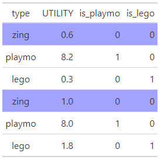
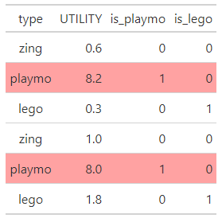
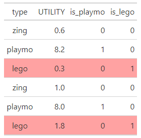

```{r setup, include=FALSE}
options(htmltools.dir.version = FALSE)
options(digits=4,scipen=2)
options(knitr.table.format="html")
xaringanExtra::use_xaringan_extra(c("tile_view","animate_css","tachyons"))
xaringanExtra::use_extra_styles(
  mute_unhighlighted_code = FALSE
)
library(knitr)
library(tidyverse)
library(ggplot2)
source('R/pres_theme.R')
knitr::opts_chunk$set(
  dev = "svg",
  warning = FALSE,
  message = FALSE
)
source('R/myfuncs.R')

library(xaringanthemer)
style_mono_accent(
  #base_color = "#0F4C81", # DAPR1
  # base_color = "#BF1932", # DAPR2
  # base_color = "#88B04B", # DAPR3 
  base_color = "#FCBB06", # USMR
  # base_color = "#a41ae4", # MSMR
  header_color = "#000000",
  header_font_google = google_font("Source Sans Pro"),
  header_font_weight = 400,
  text_font_google = google_font("Source Sans Pro", "400", "400i", "600", "600i"),
  code_font_google = google_font("Source Code Pro"),
  code_font_size = "0.8rem"
)
```

class: inverse, center, middle
# Part 1
## Scaling

???
- the theme for first part of today: getting what you want from your model
- we know we get intercept + slope
- we can do things to make those represent more useful bits of information for us
- first up: scaling. 

---
# Learning to Read

.pull-left.pulse.animated[

]
.pull-right[
.center[
```{r showdat, echo=FALSE}
library(gt)
load("R/reading.Rdata")

## NB running model for next slide here
mod.m <- lm(R_AGE ~ age+hrs_wk, data=reading)
reading %>% slice(c(1:5,46:50)) %>% gt() %>%
  data_color(columns=c("age","hrs_wk","R_AGE"),colors="#d0d9ff",alpha=.8)
```
]]

???
- continue with out reading example
- we've talked about how both a child's age, and how much prcatice they do, might influence their reading ability


---
# Learning to Read
```{r modrsum,echo=F}
.pp(summary(mod.m),l=list(0,10:13,0))
```

???
- so we had a model.
- we put both of those predictors in, and we get out some estimates


---
count: false
# Learning to Read
```{r modrsum2,echo=F,highlight.output=3}
<<modrsum>>
```

- as we noted last week, the _intercept_ for this model is nonsensical

  + "children aged zero who read for zero hours a week have a predicted reading age of `r coef(mod.m)[1]`"

- perhaps there's something we can do about this?

???
- we noted that the intercept is not useful
  - a newborn baby who does zero hours of reading


---
# One-Predictor Model

.pull-left[
- let's start with a model with a _single_ predictor of age<sup>1</sup>

```{r ggp,fig.asp=.6,fig.show='hide'}
# model
mod2 <- lm(R_AGE ~ age,data=reading)

# figure
p <- reading %>% ggplot(aes(x=age,y=R_AGE)) +
  xlab("age") + ylab("reading age") +
  geom_point(size=3) +
  geom_smooth(method="lm")
p
```

]
.pull-right[

]

.footnote[
<sup>1</sup> we know this model doesn't meet assumptions, but it will work for an illustration
]
???
- let's just return to a single predictor model for ease of exposition
- reading age is predicted by biological age.  
- we know that the model doesn't meet asumptions, but this is just for an illustration

- intercept is reading age of a newborn baby. Age zero. 

---
# Changing the Intercept

.pull-left[
- actually it's fairly easy to move the intercept

- we can just pick a "useful-looking" value

- for example, we might want the intercept to tell us about students at age 8

  + this is a decision; no magic about it
]

.pull-right[
```{r ggp2,fig.asp=.6,echo=F}
p + theme(axis.text.x = element_text(colour = "red")) +
  scale_x_continuous(breaks=c(6,8,10),labels=c("6-8","8-8","10-8"))
```

]

???
- as it happens, we can pretty easily move the intercept
- our model doesn't really _care_ about "0", here. 
- so we can _make_ the number "0" be used to represent, for instance children aged 8

- this is done, subtracting 8 from each number


---
count: false

# Changing the Intercept

.pull-left[
- actually it's fairly easy to move the intercept

- we can just pick a "useful-looking" value

- for example, we might want the intercept to tell us about students at age 8

  + this is a decision; no magic about it
]

.pull-right[
```{r ggp3,fig.asp=.6,echo=F}
p + theme(axis.text.x = element_text(colour = "red")) +
  scale_x_continuous(breaks=c(6,8,10),labels=c("-2","0","2")) +
  geom_vline(xintercept=8,linetype="dashed",colour="red")
```

]

???
- so the iterpretation of intercept as "when all predictors are zero"
- we now think "well what _is_ zero?". and we know that it's 8 years old

- this is just a decision we make. i choose 8, but you might choose, for instance, the mean. or the i might choose 4 years old, because that's when people start going to school

---
# A Model With a New Intercept

### original model
```{r oldm,echo=F}
.pp(summary(mod2),l=list(0,10:12,0))
```

### new model
```{r newm,eval=F}
mod2b <- lm(R_AGE ~ I(age-8), data=reading) #<<
summary(mod2b)
```
```{r newm2,echo=F}
mod2b <- lm(R_AGE ~ I(age-8), data=reading)
.pp(summary(mod2b),l=list(0,10:12,0))
```

???
- note i can do this all _within_ the model
- requires trickery
- formulas of lm interpret `+` and `-` __not__ as arithmetic things. 
- this little `I()` thing basically _isolates_ this computation, and says "do this to all the age values first.  
- don't really _need_ to know this function much. it's useful, but we can get around it, as we'll see in a couple of slides.
- so this new model gives us the same set of coefficients. 
- the intercept has changed. 
- reading age of an 8 year old is 9.8
- slope of age, is just the same


---
# Fit Remains Unchanged

### original model
```{r oldm3,echo=F}
.pp(summary(mod2),l=list(0,17:18))
```

### new model

```{r newm3,echo=F}
.pp(summary(mod2b),l=list(0,17:18))
```

???
- and that's the important thing to realise here
- we're not changing the fit of the model
- just making our model _work for us_. 
- getting our more useful bits of information


---
# A Model with a New Slope

.pull-left[
- it's also easy to linearly scale the slope

- we can just pick a "useful" scale

- for example, we might want to examine the effect per month of age

  + this is a decision; no magic about it
]

.pull-right[
```{r ggp5,echo=F,fig.asp=.6}
p + theme(axis.text.x = element_text(colour = "red")) +
  scale_x_continuous(breaks=c(6,8,10),labels=c("6*12","8*12","10*12"))
```
]


???
- we can also change the slope
- remember that the slope is "how much does y change for every 1 increase in x"
- "how much does Reading Age change for every increase of 1 year in age?"

- just like changing what "0" represents, we can change what "an increase of 1" represents. 

- e.g. i can convert ages in years, into ages in months. 
- multiply by 12.


---
count: false
# A Model with a New Slope

.pull-left[
- it's also easy to linearly scale the slope

- we can just pick a "useful" scale

- for example, we might want to examine the effect per month of age

  + this is a decision; no magic about it
]

.pull-right[
```{r ggp4,echo=F,fig.asp=.6}
p + theme(axis.text.x = element_text(colour = "red")) +
  scale_x_continuous(breaks=c(6,8,10),labels=c("72","96","120"))
```
]

???
- so now, and increase of 1 represents an increase in 1 month, rather than 1 year.


---
# A Model With a New Slope

### original model
```{r oldm5,echo=F}
.pp(summary(mod2),l=list(0,10:12,0))
```

### new model
```{r newm5,eval=F}
mod2c <- lm(R_AGE ~ I(age*12), data=reading) #<<
summary(mod2c)
```
```{r newm6,echo=F}
mod2c <- lm(R_AGE ~ I(age*12), data=reading)
.pp(summary(mod2c),l=list(0,10:12,0))
```

???
- coefficient of original model = "how much does increase of reading age increase with every 1 year of age?"
- coefficient of new model = "how much does increase of reading age increase with every 1 _month_ of age?". 
- and if you're paying attention. you might think you can do this already.  
- if i know it increases by 1.01 for every _year_, then i can just divide that by 12, right? 

- right! 

---
# Fit Remains Unchanged

### original model
```{r oldm7,echo=F}
.pp(summary(mod2),l=list(0,17:18))
```

### new model

```{r newm7,echo=F}
.pp(summary(mod2c),l=list(0,17:18))
```

???
- again, ultimately the model isn't changing, its the bits we are extracting that are changing. 

---
# We Can Get Fancy About This

```{r mm}
mod.mb <- lm(R_AGE ~ I((age-8)*12) + I(hrs_wk-mean(hrs_wk)), data=reading)
summary(mod.mb)
```

???
- we can get quite fancy.  
- so here's a model with hrs_wk in again. 
- we can see the age variable is centered on 8 years old, so the intercept will be for an 8 year old. 
- it's multiplied by 12, so the coefficient will be how reding changes for every _month_ of age
- and for hours week, it's been centered on its mean. so the intercept will be the reading age for
  - an 8 year old
  - with the average level of practice
- and the slope of hrs week is going to be still in terms of "1 hour"

---
# Often easier to scale *then* fit.

```{r eval = FALSE}
reading <- reading %>% 
  mutate(
    agemonthC = (age - 8)*12,
    hrs_wkC = hrs_wk - mean(hrs_wk)
  )
mod.mb2 <- lm(R_AGE ~ agemonthC + hrs_wkC, data=reading)
summary(mod.mb2)
```
```{r echo = FALSE}
reading %>% 
  mutate(
    agemonthC = (age - 8)*12,
    hrs_wkC = hrs_wk - mean(hrs_wk)
  ) %>%
  lm(R_AGE ~ agemonthC + hrs_wkC, data=.) %>%
  summary() %>%
  .pp(., l = list(5:20))
```

???
- often, i personally find it easier to do this stuff prior to fitting the model
- make a new variable in the data 
  - here we can see the same calculations: age, in montnhs, centered on 8years old. 
  - hrs week centered on the mean. 
  
- and then i put these new variables in the model instead
- and it's just the same

---
# Which Has a Bigger Effect?

.flex.items-center[
.w-40.pa2[

]

.w-60.pa2[
- in our two-predictor model, is age more important than practise?  Or vice-versa?

- hard to tell because the predictors are in different _units_

```{r sumsum,echo=F}
<<modrsum>>
```


-  how do we compare effects of a year of age to those of an hour per week of practise?
]]

???
- this leads us to being able to ask an interesting question. 
- in this 2 predictor model, which is mre important for reading age?
  - biological age
  - or hrs week practce?  
- because our variables are in different units, it's hard to cmpare these

- comparing increase in reading age for
  - 1 month increase in age
  - 1 hour increase in practise
  
- months and hours are both time, but what if we had a predictor of "number of books read?". could we compare 1 month of age to 1 extra book?  


---
# Standardisation

- _if_ the predictors and outcome are very roughly normally distributed...

.center[
```{r hist, fig.asp=.25,fig.width=9,echo=F}
reading %>% select(-method) %>% gather %>%
  ggplot(aes(x=value)) +
  stat_density() +
  facet_wrap(~key, scales="free_x") +
  theme(axis.title.x=element_blank())
```
]
- we can calculate $z$-scores by subtracting the mean and dividing by the standard deviation

$$z_i=\frac{x_i-\bar{x}}{\sigma_x}$$

???
- provided the variables are _very_ very roughly normally distributed
  - (we don't have to care too much about this)
- we can turn "the increase of 1 on x" to be 
- "the increase of 1 SD on x"  

- this is known as standadisation
  - we've seen it before back in week 2's reading. 
  - subtract the mean, divide by the stanard dev
- "0" is now the mean
- "1" is 1 sd above the mean, "2" is 2 sds above them mean, and so on 

---
# Standardisation

- in R, the `scale()` function calculates $z$-scores

- in R, you don't need to create new columns!
  + also don't need to use `I()` because no ambiguity (though you can use it if you want)
  
```{r mods}
mod.ms <- lm(scale(R_AGE) ~ scale(age) + scale(hrs_wk), data=reading)
```

???
- there's a handy function `scale()` that will do this for us. 
- again, i can do all this inside the model
- here we're scaling everything. the outcome, the predictors. everything
- so what are we going to get out for our slopes? 

[ PAUSE AND ASK (ignore intercept)]

--

- the variables are now _all_ in terms of standard deviations from the mean

- at the _intercept_, `age` is the mean of age and `hrs_wk` is the mean of hrs_wk

- _slopes_: "how many standard deviations does `R_AGE` change for a one standard deviation change in the predictor?"

???
- slopes, however, are "how many standard deviations does `R_AGE` change for a one standard deviation change in the predictor?"

---
# Standardisation

```{r showme,eval=F}
summary(mod.ms)
```
```{r showme2,echo=F}
.pp(summary(mod.ms),l=list(0,10:13,0))
```


- `R_AGE` changes `r .rround(coef(mod.ms)[2],2)` sds for a 1-sd change in `age`, and `r .rround(coef(mod.ms)[3],2)` sds for a 1-sd change in `hrs_wk`

- reasonable conclusion might be that `r ifelse(coef(mod.ms)[2] > coef(mod.ms)[3],"age","practice")` has a greater effect on reading age than does `r ifelse(coef(mod.ms)[2] > coef(mod.ms)[3],"practice","age")`

???
- we _expect_ the intercept to be zero because it's the mean of everything
- but we can see:
  - a 1 SD of age increases Reading age by .5 SDs
  - a 1 SD of practice increases Reading age by .26 SDs
- age has a bigger effect than practice! 

--

- model fit doesn't change with standardisation

```{r showme3,echo=F}
.pp(summary(mod.ms),l=list(0,18:19))
```

???
- and as before, the model fit hasn't changed at all! 
- it's just rescaling stuff to be in units we can compare

---
# Standardisation pre-fit

- Using `scale()` inside the `lm()` is just the same as adjusting the variable prior to fitting the model 

```{r eval=FALSE}
reading <- reading %>%
  mutate(
    zR_AGE = (R_AGE - mean(R_AGE)) / sd(R_AGE),
    zage = (age - mean(age))/sd(age),
    zhrs_wk = scale(hrs_wk)
  )
mod.ms2 <- lm(zR_AGE ~ zage + zhrs_wk, data=reading)
summary(mod.ms2)
```
```{r echo=F}
reading %>%
  mutate(
    zR_AGE = (R_AGE - mean(R_AGE)) / sd(R_AGE),
    zage = (age - mean(age))/sd(age),
    zhrs_wk = scale(hrs_wk)
  ) %>%
  lm(zR_AGE ~ zage + zhrs_wk, data=.) %>%
  summary() %>%
  .pp(.,l=list(0,10:13,0))
```


???
- similarly to before, it might be easier to do all this prior to fitting the model
- as an example
- [EXPLAIN CODE]

- and estimates are just the same

---
# Standardisation Post-Hoc

- we can convert "raw" model coefficients $b$ to standardised coefficients $\beta$ without re-running the regression]

- for predictor $x$ of outcome $y$:

$$\beta_x=b_x\cdot{}\frac{\sigma_x}{\sigma_y}$$
- or there are functions to do it for you

.left-column[
<br>
```{r lsr}
library(lsr)
standardCoefs(mod.m)
```
]
.right-column[
```{r lmbeta, eval=FALSE}
library(lm.beta)
summary(lm.beta(mod.m))
```
```{r echo=FALSE}
library(lm.beta)
.pp(summary(lm.beta(mod.m)),l=list(9:13))
```
]

???
- and just like i said i could divide the coefficient for age in years by 12 to get the coefficient for age in months, we can actually do it afterwards

- standardised coefficients, are the original coefficients, multiplied by SD x over SD y.

- coefficients show the 1 units change in x, so we multiply it by SD x to be "1 SD change in x"
- and divide by SD y gives it in units of standard deviation change in y


---
class: inverse, center, middle, animated, rotateInDownLeft

# End of Part 1

---
class: inverse, center, middle

# Part 2
## Categorical Predictors

???
- okay. another way we can adjust what we get out of our model is specifi to when we have categorical predictrs
- 

---
# Playmobil vs. SuperZings

.pull-left[

]
.pull-right[
- some important pretesting went into these lectures

- every individual figure rated for "usefulness" in explaining stats

- how do we decide which to use?
]

???
- so with all these toy examples we've been using
- some of the figures have been more useful for explanations. 
- some haven't 
- might be the first time we've seen these guys. these are "superzings"
 


---
count: false
#Playmobil vs. SuperZings

.pull-left[
```{r makedat,echo=FALSE}
set.seed(3)
library(gt)
doit <- 1
while (doit) {
  toys <- tibble(type=gl(2,1,10,labels=c('playmo','zing')),UTILITY=round(runif(10,0,10),1))
  tt <- toys %>% group_by(type) %>% summarise(mean=mean(UTILITY))
  if (tt$mean[1] <= tt$mean[2]) {
    next
  }
  if (t.test(UTILITY~type,data=toys)$p.value < .05)
  {
    doit <- 0
  }
}

toys %>% gt() %>%
  data_color("type",c("red","blue"),alpha=0.3)
```


]
.pull-right[
- some important pretesting went into these lectures

- every individual figure rated for "usefulness" in explaining stats

- how do we decide which to use?

]

???
- so we've rated all of the individual toys on how useful they are
- utility column
- and we also have which type of toy they are


---
# Playmobil vs. SuperZings

.pull-left[
```{r gt2,echo=F}
toys %>% gt() %>%
  data_color("type",c("red","blue"),alpha=0.3)
```
]

.pull-right[

- we already know one way to answer this

```{r ttest,highlight.output=5}
t.test(UTILITY~type, data=toys,
       var.equal=TRUE) #<<
```
]

???
- if i ask you "how does the utility of the playmos differ from that of the superzings?"
- you might, correctly, suggest i just do a t.test
- and so here i have
- tells us lots of stuff - playmos look like the'yre more useful

- note i'm setting var equal as true, because we're going to see this mapping to a linear model
- and hte linear model has that assumption of "equal variances" or "constant variance", so this is what we would need to do to make it match up with a t test

---
# The Only Equation You'll Ever Need

- which toys are the most useful?

.br3.pa2.bg-light-gray[
$$\color{red}{\textrm{outcome}_i}\color{black}=\color{blue}{(\textrm{model})_i}\color{black}{+\textrm{error}_i}$$

$$\color{red}{\textrm{utility}_i}\color{black}{=}\color{blue}{(\textrm{some function of type})_i}\color{black}{+\epsilon_i}$$
]

- we need to represent `type` as a number

- the simplest way of doing this is to use 0 or 1

???
- think about in model terms
- need some way of representing "type" using numbers
- easy option. 0 vs 1

---
# Quantifying a Nominal Predictor

.pull-left[
```{r qu}
toys <- toys %>% 
  mutate(is_playmo = 
           ifelse(type=="playmo",1,0))
toys
```
]
???
here's a variable that is 1 if it's a playmo, and 0 otherwise

--

.pull-right[
- this maps to a linear model


$$\color{red}{\textrm{utility}_i}=\color{blue}{b_0+b_1\cdot{}\textrm{is_playmo}}+\epsilon_i$$


- $\overline{\textrm{utility}}$ for SuperZings is **intercept**

- "change due to playmo-ness" is **slope**

]

???
- we can map this to the linear model
- when isplaymo is 0, that's going to be the non-playmos, the superzings
- the intercept is the estimated utility when isplaymo is 0, so it's going to be hte superzing utility
- the change in playmoness. when you become 1 in playmonness vs 0 in playmoness, you move from superzings to playmos. that's b1


---
# Linear Model Using `is_playmo`

```{r lm1,highlight.output=12}
mod1 <- lm(UTILITY~is_playmo,data=toys)
summary(mod1)
```
???
- here's hte model! 
- note that the $t$ value (and the $p$ value) are exactly what we got from our initial $t$-test
- the $t$-test is just a special case of the linear model


---
# Let R Do the Work

```{r lm2}
contrasts(toys$type)
```

- already built-in to factors

- NB the first value will be the default intercept (because $b_n=0$ for that value)

  + can change this using the `relevel()` function (or tidyverse `fct_relevel()`)
  
- as long as we have a _factor_, can just use lm() with that column

???
- what we've been doing is letting R do all this for us
- deep down, we give it a variable that says "playmo" or "superzing", and it will translate that into some 0/1 variable for us.
- we can actually see this thourhg the "contrasts".

- [EXPLAIN CONTRASTS]

---
# Linear Model Using `type`

```{r lm3,highlight.output=12}
mod2 <- lm(UTILITY~type, data=toys)
summary(mod2)
```

???
- so here's model with type, rather than isplaymo
- point out why sign is reversed!

- point out `typezing` label

---
# Graphically

.center[
```{r ggpA,echo=F,fig.asp=.55,fig.width=6}
toys %>% ggplot(aes(x=type,y=UTILITY)) +
  geom_point(size=3) +
  geom_smooth(aes(x=2-is_playmo),method="lm")
```
]

- shows "what the model is doing", but isn't a very good presentation

- the line suggests you can make predictions for types between _playmo_ and _zing_

???
- and we can visualis it like we've seen for all our linear models
- not great though, because it kind of misses the fact that these are categories


---
# Graphically

.center[
```{r ggpB,echo=F,fig.asp=.55,fig.width=6}
gd <- toys %>% group_by(type) %>% summarise(mean_se(UTILITY))
gd %>% ggplot(aes(x=type,y=y,ymin=ymin,ymax=ymax,fill=type)) +
  geom_bar(stat="identity") +
  geom_errorbar(width=.2) +
  scale_fill_manual(values=c('#E69F00','#999999')) +
  scale_y_continuous(limits=c(0,8),breaks=seq(0,8,2))+
  ylab("UTILITY") +
  theme(legend.position = "none")
```
]

- error bars represent one standard error of the mean

???
so instead we might do this:


---
# Graphically

.center[
```{r ggpC,echo=F,fig.asp=.55,fig.width=6}
gd <- toys %>% group_by(type) %>% summarise(mean_se(UTILITY))
gd %>% ggplot(aes(x=type,y=y,ymin=ymin,ymax=ymax,col=type)) +
  geom_path(aes(group=1), lty="dotted",col="black", lwd=.5) +
  geom_pointrange(size=1) +
  scale_color_manual(values=c('#E69F00','#999999')) +
  scale_y_continuous(limits=c(0,8),breaks=seq(0,8,2))+
  ylab("UTILITY") +
  theme(legend.position = "none")
```
]

- error bars represent one standard error of the mean

???
or this: 

---
# What About Lego Figures?

.pull-left[

]

.pull-right[
```{r addlego, include=F}
set.seed(12)
t1 <- toys %>% filter(type=='playmo')
doit <- 1
while (doit) {
  t2 <- tibble(type="lego",UTILITY=round(runif(5,0,10),1))
  if (mean(t1$UTILITY) > mean(t2$UTILITY) && t.test(t1$UTILITY,t2$UTILITY,data=toys)$p.value < .05)
  {
    doit <- 0
  }
}
toys <- toys %>% select(-is_playmo) %>% full_join(t2)
toys <- toys %>% group_by(type) %>% mutate(id=1:n()) %>% ungroup() %>% arrange(id,desc(type)) %>% select(-id) %>% mutate(type=as_factor(type))
```


- we now have three groups

- can't label them `c(0, 1, 2)` because that would express a linear relationship

```{r minig,echo=F,fig.asp=.6}
toys %>% ggplot(aes(x=as.numeric(as.factor(type))-1,y=UTILITY)) +
  geom_point(size=2) +
  scale_x_continuous(name="type",c(0,1,2)) +
  geom_smooth(se=FALSE,linetype="dashed") +
  annotate("text",x=1.7,y=6,label="??",colour="red",size=20)
```

]
???
- but what about when we have more categories?  
- so here we're adding in the lego people
- can't use numbers 0, 1, 2
- that would make a line... 


---
# Independent Effects

- "change due to lego-ness" is _independent_ of change due to anything else

- solution: add another predictor

```{r addthem}
toys <- toys %>% mutate(
  is_playmo = ifelse(type=="playmo",1,0),
  is_lego   = ifelse(type=="lego",1,0)
)
head(toys)
```

???
- can make 2 separate lines
- one to playmo
- one to legos
- when both are zero = it's still superzing

---
# Three-Level Predictor: Two Coefficients

.flex.items-center[
.w-40.pa2[

```{r gtt,echo=F, eval=F}
head(toys) %>% gt() %>%
   tab_style(
    style = list(
      cell_fill(color = "#a2a2ff")
    ),
    locations = cells_body(
      rows = c(1,4))
  )
```

]

.w-60.pa2[

$$\textrm{UTILITY}_i=\color{blue}{b_0}\color{gray}{+b_1\cdot\textrm{is_playmo}_i+b_2\cdot\textrm{is_lego}_i}+\epsilon_i$$

$$\textrm{UTILITY}_i=\color{blue}{b_0}\color{gray}{+b_1\cdot0+b_2\cdot0}+\epsilon_i$$
.tc.pt3[
"utility of a zing"
]
]]

???
- when we put these in our model
- when all are zero
- that's the superzing


---
count: false
# Three-Level Predictor: Two Coefficients

.flex.items-center[
.w-40.pa2[

```{r gtt2,echo=F, eval=F}
head(toys) %>% gt() %>%
   tab_style(
    style = list(
      cell_fill(color = "#ffa2a2")
    ),
    locations = cells_body(
      rows = c(2,5))
  )
```

]

.w-60.pa2[

$$\textrm{UTILITY}_i=\color{blue}{b_0}\color{red}{+b_1\cdot\textrm{is_playmo}_i}+\color{gray}{b_2\cdot\textrm{is_lego}_i}+\epsilon_i$$
$$\textrm{UTILITY}_i=\color{blue}{b_0}\color{red}{+b_1\cdot1}+\color{gray}{b_2\cdot0}+\epsilon_i$$
.tc.pt3[
"change in utility from a zing due to being a playmo"
]
]]

???
- moving 1 in isplaymo, is moving from superzing to playmo

---
count: false
# Three-Level Predictor: Two Coefficients

.flex.items-center[
.w-40.pa2[

```{r gtt3,echo=F, eval=F}
head(toys) %>% gt() %>%
   tab_style(
    style = list(
      cell_fill(color = "#ffa2a2")
    ),
    locations = cells_body(
      rows = c(3,6))
  )
```

]

.w-60.pa2[

$$\textrm{UTILITY}_i=\color{blue}{b_0}\color{gray}{+b_1\cdot\textrm{is_playmo}_i}+\color{red}{b_2\cdot\textrm{is_lego}_i}+\epsilon_i$$
$$\textrm{UTILITY}_i=\color{blue}{b_0}\color{gray}{+b_1\cdot0}+\color{red}{b_2\cdot1}+\epsilon_i$$
.tc.pt3[
"change in utility from a zing due to being a lego"
]
]]

???
moving 1 on islego, is moving from superzing to lego

---
# R Has Our Backs

.pull-left[
- this is the _default_ contrast coding in R

- known as **treatment** (or **dummy**) contrasts


```{r cont2}
contrasts(toys$type)
```
]

???
- again, R does all this for us, we really just need to give it the "type" variable, we don't need to make these variable isPlaymo and isLego ourselves
- looking at the contrasts allow us to see _how_ the model will constrct these comparisons

--

.pull-right[
### a subtle difference .fr[]

```{r include=FALSE}
toys$type <- as.character(toys$type)
```

```{r asf, eval=FALSE}
# core R: alphabetical
contrasts(factor(toys$type))
contrasts(as.factor(toys$type))
```
```{r echo=FALSE}
contrasts(as.factor(toys$type))
```
```{r}
# tidyverse: order of mention
contrasts(as_factor(toys$type))
```

```{r include=FALSE}
toys$type <- as_factor(toys$type)
```
]

???
- tiny little note.
- different functions set the reference level differently


---
# A Linear Model

```{r lm22}
mod <- lm(UTILITY ~ type, data=toys)
summary(mod)
```
???
- saw last week in the reading - this is like a form of multiple regression

  + 3 levels -> 2 predictors

- so we can say that playmo are better than zing (we can see that zing is the intercept because it's omitted from the table)

- we can say that lego are not better than zing

- _playmo and lego are not directly compared_

- to do this, we would need a different contrast coding scheme

---
 &nbsp;&nbsp; .f1[Group Means, Graphically]

.pull-left[
```{r ggpB2,fig.asp=.6,fig.show='hide'}
gd <- toys %>% group_by(type) %>%
  summarise(mean_se(UTILITY))
gd

gd %>% ggplot(aes(x=type,y=y,
                  ymin=ymin,ymax=ymax)) +
  geom_bar(stat="identity") +
  geom_errorbar(width=.2) +
  ylab("UTILITY")
```

]
.pull-right[

]

???
- the way we visualise this simply matches to previously when we had only 2 groups
- here are the group means
- [EXPLAIN CODE]

---
 &nbsp;&nbsp; .f1[Model estimates, Graphically]

.pull-left[
```{r ggpB2m,fig.asp=.6,fig.show='hide'}
mod <- lm(UTILITY ~ type, data=toys)

library(sjPlot)
plot_model(mod, type = "eff")
```

]
.pull-right[

]

???
- but often want to plot the model estimtes
- if we have other things in our model, then plotting the group means is not going to represent the model estimates we get out,
  - some of the group differences may be due to other variables in the model
  
- so we can plot the model using things like plot_model that we've seen already

---
# Contrast Coding

- there may be a different contrast coding which better suits our research interests

- for a predictor with $g$ levels (or "groups") there are $g-1$ possible contrasts

- these can be anything you like (values don't have to be zero or one):  there are a few built in to R

- usefulness depends on your research question

- contrasts act like "tests of differences of interest" once your model has been fit

- model fit is not affected by the choice of contrasts<sup>1</sup>

.footnote[
<sup>1</sup> for type 1 sums of squares
]

???
- this can get quite complex. and there's lots of different ways we can set up the comparisons
- the default is what we've seen so far "compare each level to a reference level"
- in the reading and labs this week you'll also see about another common one, which is  "compare each level to the mean of all levels"

- not going too much into these, but thing to remember is that depending on research question, 
there may be a way of extracting a more useful comparison between sets of groups.  

---
class: inverse, center, middle, animated, rotateInDownLeft

# End of Part 2

???
TAKE A BREAK


---
class: inverse, center, middle

# Part 3
## Interactions

---
# Back to Reading

.pull-left[

]
.pull-right[
.center[
```{r showdat2, echo=FALSE}
## NB running model for next slide here
mod.m <- lm(R_AGE ~ method, data=reading)
reading %>% slice(c(1:5,46:50)) %>% gt() %>%
  data_color(columns=c("method","R_AGE"),colors="#d0d9ff",alpha=.8)
```
]]

???
- okay. back to reading
- we're going to now start talking about how the effect of one thing _depends on_ the level of some other. 

- for instance, we might think that how practise improves reading age if you follow one method of learning, whereas it doesn't if you follow another. 

- so we have two techniques of learning to read. 
- one is "phonics", the other is "word" 

---
# We Know Enough to Fit a Linear Model

```{r lmr}
mod3 <- lm(R_AGE~method,data=reading)
summary(mod3)
```

???
- so we might fit a model.
- looks similar to the models we fitted a minute ago. 
- intercept is reading age of those learning phonics,
- coefficient is the difference from phonics to word method

---
# We Know Enough to Draw a Graph

.center[
```{r rg,fig.asp=.6,echo=F}
gd <- reading %>% group_by(method) %>% summarise(mean_se(R_AGE))
gd %>% ggplot(aes(x=method,y=y,ymin=ymin,ymax=ymax)) +
  geom_bar(stat="identity") +
  geom_errorbar(width=.2)
```
]

- we also know enough to run model diagnostics

???
- can see this visually too. so phonics learners have higher reading ages than word learners.
- we might also want to check our assumptions. 

---
.center[
```{r diag,echo=F,fig.asp=.7,fig.width=9}
par(mfrow=c(2,2))
plot(mod3,which=1:4)
```
]

???
- because we only have a predictor with 2 levles in our model, the residuals will cluster arond those two levels
- so i wanted to show you this briefly because this might make you sit up and think "i see non-randomness" 
- but what we are actually seeing is perfectly fine. 
- it is randomness with similar variances, simply at 2 different places on our predictor - phonics and words

---
# Adding Predictors

- we also know that `hrs_wk` affects reading age

- we can build a multiple regression, and inspect the coefficients

```{r mr,eval=F}
mod.m2 <- lm(R_AGE ~ hrs_wk + method,data=reading)
summary(mod.m2)
```
```{r mr2,echo=F}
mod.m2 <- lm(R_AGE ~ hrs_wk + method,data=reading)
.pp(summary(mod.m2),l=list(0,10:13,0))

```


???
- so lets add in a predictor now. 
- we're sticking to the one predictor for simplicity here (just humour me and let's forget about age for a bit)
- here's our model output
- [INTERPRET]

---
# Graphically

.center[
```{r fancyg,fig.asp=.55,fig.width=6,echo=FALSE}
p <- reading %>% ggplot(aes(x=hrs_wk,y=R_AGE,colour=method)) +
  xlab("practice") + ylab("reading age") +
  geom_point(size=3)

p + geom_abline(intercept=coef(mod.m2)[1],slope=coef(mod.m2)[2],colour="red") +
  geom_abline(intercept=coef(mod.m2)[1]+coef(mod.m2)[3],slope=coef(mod.m2)[2],colour="blue")
```
]

- note that according to this model the lines are parallel

- an hour of practice has _exactly the same_ effect, however you're taught

???
- model is saying these two effects are independent. 
- we can think of this visually
- phonics have higher reading age by [diff lines], regardless of how much practice
- practice increases reading age by [slope lines], regardless of which method

---
# Different Effects for Different Methods

```{r mod33}
mod.m3 <- lm(R_AGE ~ hrs_wk + method + hrs_wk:method,data=reading)
summary(mod.m3)
```

???
- we might have reason to think, or indeed we might be specifically interested in asking "does practice influence reading age to a different extent depending upon the method you are learning?" 
- we can model this. 
- and it's called an interaction
- we can include it in the model using the colon
- i'll show you another way in a second too. 
- here it is hrs_wk:method
- "the effect of hrs_wk is different depending on which method"
- vice versa
- "the effect of method is different depending on the amount of practice"
- and we get out this term here, that broadly speaking is an _adjustment_ to these other effects. 


---
# Different Effects for Different Methods

.center[
```{r fif,fig.asp=.55,fig.width=7,echo=FALSE}
p + geom_abline(intercept=coef(mod.m3)[1],slope=coef(mod.m3)[2],colour="red") +
  geom_abline(intercept=coef(mod.m3)[1]+coef(mod.m3)[3],slope=coef(mod.m3)[2]+coef(mod.m3)[4],colour="blue")
```
]

???
- we'll try to understand what that means in a second, but just to visualise this new model
- what we're now allowing our model to do is to estimate that these two lines are not parallel.
- 

---
# Interaction is Just Multiplication

.br3.pa2.bg-light-gray[
$$\hat{y}_i=b_0+b_1x_{1i}+b_2x_{2i}+\color{red}{b_3x_{1i}x_{2i}}$$
]

$$\widehat{\textrm{R_AGE}}=b_0+b_1\cdot\textrm{hrs_wk}+b_2\cdot\textrm{word}+b_3\cdot\textrm{hrs_wk}\cdot\textrm{word}$$
- when $\textrm{word}=0$:

$$\widehat{\textrm{R_AGE}}=b_0+b_1\cdot\textrm{hrs_wk}+\color{gray}{b_2\cdot0+b_3\cdot\textrm{hrs_wk}\cdot0}$$
- when $\textrm{word}=1$:

$$\widehat{\textrm{R_AGE}}=b_0+b_1\cdot\textrm{hrs_wk}+b_2\cdot1+b_3\cdot\textrm{hrs_wk}\cdot1$$
???
- so how does it do it?
- what we're actually adding into our model is an estimate for the multiplication between two variables
- [DESCRIBE TOP MODEL]
- and let's think about what this means for eachmethod
- if word = 0, then b3 cancels out
- slope of hours week is just b1
- if word = 1, then slope of hours week is b1 PLUS b3. it's the adjustment we make when going from phonics to word 


---
count: false
# Interaction is Just Multiplication

```{r coefs, include=FALSE}
b0=.rround(coef(mod.m3)[1],2)
b1=.rround(coef(mod.m3)[2],2)
b2=.rround(coef(mod.m3)[3],2)
b3=.rround(coef(mod.m3)[4],2)
```


.br3.pa2.bg-light-gray[
$$\hat{y}_i=b_0+b_1x_{1i}+b_2x_{2i}+\color{red}{b_3x_{1i}x_{2i}}$$
]

$$\widehat{\textrm{R_AGE}}=\color{blue}{`r b0`}+\color{blue}{`r b1`}\cdot\textrm{hrs_wk}+\color{blue}{`r b2`}\cdot\textrm{word}+\color{blue}{`r b3`}\cdot\textrm{hrs_wk}\cdot\textrm{word}$$
- when $\textrm{word}=0$:

$$\widehat{\textrm{R_AGE}}=\color{blue}{`r b0`}+\color{blue}{`r b1`}\cdot\textrm{hrs_wk}+\color{gray}{`r b2`\cdot0+`r b3`\cdot\textrm{hrs_wk}\cdot0}$$
- when $\textrm{word}=1$:

$$\widehat{\textrm{R_AGE}}=\color{blue}{`r b0`}+\color{blue}{`r b1`}\cdot\textrm{hrs_wk}+\color{blue}{`r b2`}\cdot1+\color{blue}{`r b3`}\cdot\textrm{hrs_wk}\cdot1$$
???
- here i've put our coefficeints in
- we can see that for word = 0 (i.e. phonics group)
  - reading age is 4.53 + 1.57 for every hours week practice
- when word = 1
- reading age, for every hours week practice is that 1.57 plus the adjustment of -1.44, 
  -so the interaction coefficient is negative, so the practice doesn't do as much for the word=1 group
- this coefficient for "word", this 2.23, is going to be the difference from phonics to word, when hrs week is 0


---
# Nice Graphs

.pull-left[
```{r ng,fig.asp=.6,fig.show='hide'}
reading %>% ggplot(
  aes(x=hrs_wk,y=R_AGE,colour=method)) +
  xlab("practice") +
  ylab("reading age") +
  geom_point(size=3) +
  geom_smooth(method="lm")
```

]
.pull-right[
```{r ng1,fig.asp=.6,fig.show='hide'}
library(sjPlot)
plot_model(mod.m3, type = "int",
           show.data = TRUE)
```

]

???
- and all this maps to the plots we might see
- the slope of reading age and practrice is increasing for the phonics.
  - that's the 1.57
- and we subtract 1.44 to get the slope of the word group

- these two plots are more or less the same
  - the left we take the data, and then ask it to plot two separate linear models, one for phonics, one for word
  - on the right, we take our model with the interaction and plot it using something lke `plotmodel`. 
  
- left for quick exploration
- right for showing reuslts

- okay. question. 
- what is the effect of practice on reading age? 
- [PAUSE]
- [RETURN TO MODEL SUMMARY. DISCUSS CONDITIONAL EFFECTS]


---
# Interaction Really _Is_ Just Multiplication

- in our dataset it's also possible that age and practice interact

.br3.pa2.bg-light-gray.tc[
"effect of practice is not constant across ages"

$$\hat{y}_i=b_0+b_1x_{1i}+b_2x_{2i}+\color{red}{b_3x_{1i}x_{2i}}$$
]

```{r int1, eval=F}
mod.m4 <- lm(R_AGE ~ age + hrs_wk + age:hrs_wk, data=reading)
```

???
- we've seen this as an idea of two lines being differnet.
- we had a continuous predictor of practice, and a categoricla predictor of method
- because the logic is just this multiplication, we can actually apply this to other types
 
- so we can ask our model to estimate the extent to which prcatice effects on reading age is different for different ages!  


--

.tc.pt2[
`a + b + a:b` can also be written `a * b`
]

```{r int2}
mod.m4 <- lm(R_AGE ~ age * hrs_wk, data=reading)
```

???
- and here's the little note about how we can also write these interactions as shorthand.  
- [EXPLAIN A*B vs A+B+A:B]

---
# Interaction of Age and Practice

```{r int3, highlight.output=14}
summary(mod.m4)
```

???
- heres the model then
- note that the effects of age and of practice are not reliably different from zero
- again, these are _conditional_ upon the other variable being zero.
- so for people who don't do _any_ practice. zero hours week, then reading age is not associated with age
- for people who are zero years old, then practice doesn't do anything for reading age
- the interaction, however, is significant, which is telling us that these effects change acros values of the other. 


---
# Interaction Effect

```{r int4,echo=F}
b0=round(coef(mod.m4)[1],2)
b1=round(coef(mod.m4)[2],2)
b2=round(coef(mod.m4)[3],2)
b3=round(coef(mod.m4)[4],2)
.pp(summary(mod.m4),l=list(0,10:14,0))
```

.br3.pa2.bg-light-gray.tc[
$$\widehat{\textrm{R_AGE}}_i=b_0+b_1\cdot\textrm{age}_i+b_2\cdot\textrm{hrs_wk}_i+b_3\cdot\textrm{age}_i\cdot\textrm{hrs_wk}_i$$
]

.pull-left[
#### age 7; hrs_wk 5

$$`r b0`+`r b1`\cdot7+`r b2`\cdot5+`r b3`\cdot7\cdot5$$
$$\color{red}{=`r b0+7*b1+5*b2+35*b3`}$$
]

.pull-right[
#### age 12; hrs_wk 6

$$`r b0`+`r b1`\cdot12+`r b2`\cdot6+`r b3`\cdot12\cdot6$$
$$\color{red}{=`r b0+12*b1+6*b2+72*b3`}$$
]

???
- so lets look at this in the same we did for the previous interation
- here are two people
- one is age 7,and does 5 hours practice
- one is age 12, and does 6 hours practice
- the amount which practice is going to improve their reading age is not the same for both these people. 
- in fact, for a newborn baby, 1 hour more practice _decreases_ reading age by 3. that feels weird. practice should probably improve reading age. 
- but let's take our 7 year old. 
- their estimate reading age is the intercept:
  - plus the -1.4 * their age 7
  - plus that -3 * however much practice they do 5
  - plus the interaction 0.5 times their age times their practice. 0.5 tims 7 times

[DRAW LOTS OF LINES]
- R_AGE ~ hrs_week 
  - 0yo, 1yo, 2yo,


---
# Significance

```{r intN,echo=F,highlight.output=3:5}
.pp(summary(mod.m4),l=list(0,10:14,0))
```

- note that not all of the effects are significant

- the model's best guess at the data ( $\widehat{\textrm{R_AGE}}$ ) is expressed by the coefficients

- but we're not confident that the highlighted effects would reliably differ from zero less than 5% of the time if we repeatedly sampled from the same population

- so the _predictions_ of the model are as above (and below) but our _conclusion_ is only that practise is more beneficial the older a child is

???
- note that these terms, might not be very representative of the data we have.
- just like intercept term is "for a new born baby"
- these are best guesses.
- in our data, we have no babies, and so the model doesn't have much confidence in the slope of hrs week. 

---
# Graphical Model

```{r psetup, include=F}
library(plotly)
steps=49
age <- with(reading,seq(min(age),max(age),length=steps))
hrs_wk <- with(reading,seq(min(hrs_wk),max(hrs_wk),length=steps))
newdat <- expand.grid(age=age,hrs_wk=hrs_wk)
```

.pull-left[
```{r plotly1, echo=F}
fit <- lm(R_AGE~age*hrs_wk,data=reading)
R_AGE <- matrix(predict(fit, newdat),steps,steps)
plot_ly(x=~age,y=~hrs_wk,z=~R_AGE, type="surface") %>% layout(
    scene = list(
      xaxis = list(title = "age"),
      yaxis = list(title = "practise"),
      zaxis = list(title = "READING AGE"),
      aspectmode = "cube"
    ))
#p <- persp(age,hrs_wk,R_AGE,theta=-25,phi=5,col=NA)
```
]
.pull-right[
```{r plotly2, echo=F}
fit <- lm(R_AGE~age+hrs_wk,data=reading)
R_AGE <- matrix(predict(fit, newdat),steps,steps)
plot_ly(x=~age,y=~hrs_wk,z=~R_AGE, type="surface") %>% layout(
    scene = list(
      xaxis = list(title = "age"),
      yaxis = list(title = "practise"),
      zaxis = list(title = "READING AGE"),
      aspectmode = "cube"
    ))
#p <- persp(age,hrs_wk,R_AGE,theta=-25,phi=5,col=NA)
```
]

???
- so here's hte best we can do for a visualisation of this.
- the labs will go through how we visualise this when writing up results, but here we just love 3d stuff. 


---


class: inverse, center, middle, animated, rotateInDownLeft

# End

---
# Acknowledgements


- icons by Diego Lavecchia from the [Noun Project](https://thenounproject.com/)