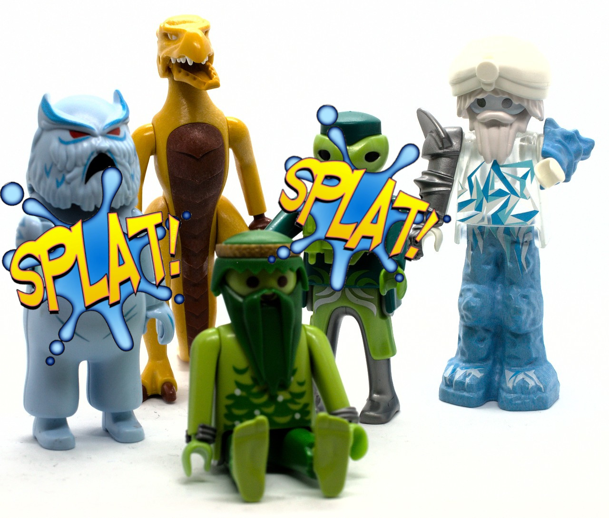
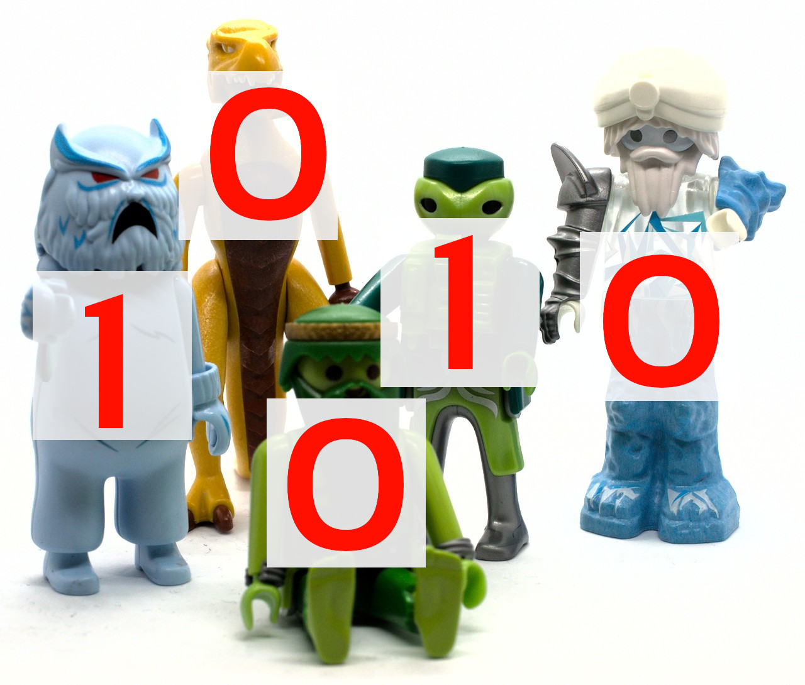

```{r setup, include=FALSE}
options(htmltools.dir.version = FALSE)
options(digits=4,scipen=2)
options(knitr.table.format="html")
xaringanExtra::use_xaringan_extra(c("tile_view","animate_css","tachyons"))
xaringanExtra::use_extra_styles(
  mute_unhighlighted_code = FALSE
)
library(knitr)
library(tidyverse)
library(ggplot2)
source('R/pres_theme.R')
knitr::opts_chunk$set(
  dev = "svg",
  warning = FALSE,
  message = FALSE,
  cache = TRUE
)
source('R/myfuncs.R')
```

```{r xaringan-themer, include = FALSE}
library(xaringanthemer)
style_mono_accent(
  #base_color = "#0F4C81", # DAPR1
  # base_color = "#BF1932", # DAPR2
  # base_color = "#88B04B", # DAPR3 
  base_color = "#FCBB06", # USMR
  # base_color = "#a41ae4", # MSMR
  header_color = "#000000",
  header_font_google = google_font("Source Sans Pro"),
  header_font_weight = 400,
  text_font_google = google_font("Source Sans Pro", "400", "400i", "600", "600i"),
  code_font_google = google_font("Source Code Pro")
)
```

class: inverse, center, middle
# Part 1
## Bigger and Better

---
# Learning to Read

.pull-left.pulse.animated[

]
.pull-right[
.center[
```{r showdat, echo=FALSE}
library(gt)
load("R/reading.Rdata")

## NB running model for next slides here
mod.m <- lm(R_AGE ~ hrs_wk*method, data=reading)
reading %>% slice(c(1:5,46:50)) %>% gt() %>%
  data_color(columns=c("hrs_wk","method","R_AGE"),colors="#d0d9ff",alpha=.8)
```
]]

---
count: false
# Learning to Read

.pull-left[

]
.pull-right[
```{r plotme1,echo=F,fig.asp=.6}
reading %>% ggplot(aes(x=hrs_wk,y=R_AGE,colour=method)) +
  xlab("practice") + ylab("reading age") +
  geom_point(size=3) +
  geom_smooth(method="lm")
```

]

---
# Learning to Read

.pull-left[

]
.pull-right[
.center[
```{r showdat2, echo=FALSE}
library(gt)
load("R/reading.Rdata")

## NB running model for next slides here
mod.m2 <- lm(R_AGE ~ age*hrs_wk, data=reading)
reading %>% slice(c(1:5,46:50)) %>% gt() %>%
  data_color(columns=c("age","hrs_wk","R_AGE"),colors="#d0d9ff",alpha=.8)
```
]]

---
count: false
# Learning to Read

.pull-left[

]
.pull-right[
```{r plotly,echo=F}
library(plotly)
steps=49
age <- with(reading,seq(min(age),max(age),length=steps))
hrs_wk <- with(reading,seq(min(hrs_wk),max(hrs_wk),length=steps))
newdat <- expand.grid(age=age,hrs_wk=hrs_wk)
R_AGE <- matrix(predict(mod.m2, newdat),steps,steps)
plot_ly(x=~age,y=~hrs_wk,z=~R_AGE, type="surface") %>% layout(
    scene = list(
      xaxis = list(title = "age"),
      yaxis = list(title = "practise"),
      zaxis = list(title = "READING AGE"),
      aspectmode = "cube"
    ))
```
]
---
# Bigger and Better

- easy to build models including more predictors

.br3.pa2.bg-gray.white[
$$\hat{y}_i=b_0+b_1x_{1i}+b_2x_{2i}+\ldots{}+b_nx_{ni}+\ldots{}+b_mx_{1i}x_{2i}+b_{m+1}x_{2i}x_{3i}+\ldots$$
]


- for example


```{r model}
mod.mm <- lm(R_AGE ~ age + hrs_wk + method + hrs_wk:method + age:hrs_wk, data=reading)
```

--

- NB., order of predictors matters (judgement is important)

- first question:  is it worth it building such a complex model?

---
# Does Each New Predictor Improve Fit?
```{r anova}
anova(mod.mm)
```

- adding `age:hrs_wk` doesn't improve the model any further over a model without it

```{r update}
mod.mm <- update(mod.mm, ~ . -age:hrs_wk)
# equivalent
# mod.mm <- lm(R_AGE ~ age + hrs_wk + method + hrs_wk:method, data=reading)
```
???
- I'm showing you the "update" command in part to show you how "-" can have a special meaning outside the I() function (in this case, it means "take this predictor out")

---
.center[
```{r assumptions,echo=F,fig.asp=.7,fig.width=9}
par(mfrow=c(2,2))
plot(mod.mm,which=1:4)
```
]
---
# The Model
```{r mod,echo=F}
summary(mod.mm)
```


---
# The Model

.pull-left[
- not always convenient to draw 3d models!

- graphs can show "interesting" results

- here, `age` doesn't interact with anything

- so show plot for _mean age_ (or some other meaningful value)
]
.pull-right[
```{r pp,echo=F,fig.asp=.6}
r2 <- reading %>% mutate(age=mean(age))
r2 <- r2 %>% bind_cols(as_tibble(predict(mod.mm,r2,interval="confidence")))
r2 %>% ggplot(aes(x=hrs_wk,y=R_AGE,colour=method)) +
  geom_point(size=3) +
  geom_ribbon(aes(ymin=lwr,ymax=upr,fill=method,colour=NULL),alpha=.15) +
  geom_line(aes(y=fit),size=1) +
  ylab("reading age") + xlab("practice")
```
.f5[_reading age predicted by practice hours per week for children of average age_]
]


---
class: inverse, center, middle, animated, zoomInRight

# End of Part 1


---
class: inverse, center, middle
# Part 2
## Probability, Odds, Log-Odds

---
# Aliens
.center[
<video width= "70%" controls>
  <source src="lecture_9_files/video/alien.mp4" type="video/mp4">
  video not supported by this browser
</video>
]


---
# A Binary World

.center[

]

---
count: false
# A Binary World

.center[

]

---
count: false
# A Binary World

.center[

]

---
# 1,000 Aliens
```{r aliens,include=F}
load("R/singers.Rdata")
a<-c("The Great Odorjan of Erpod",
"Hapetox Bron",
"Loorn Molzeks",
"Ba'lite Adrflen",
"Tedlambo Garilltet",
"Goraveola Grellorm",
"Colonel Garqun",
"Bosgogo Lurcat",
"Osajed Voplily",
"Subcommander Edorop",
"Dopjed Klumlily",
"Terajis Roygan",
"Colonel Bonkloren",
"Gwjed Bineflimegs",
"Ka'tin Kaisor",
"Quejan Vodgongonala",
"Dinzok Krhoplan",
"Judhop Cakrn",
"Gwhuru Darutsnol",
"Volaela Guttrop",
"Kaikrut Gurjid")
singers$id <- as.character(singers$id)
singers$id[1:21] <- a
singers <- as_tibble(singers) %>% rename(SPLATTED=splatted)
rm(a)
```
.pull-left[
```{r al,echo=F}
library(gt)
head(singers,10) %>% gt()
```
]
.pull-right[
- `quality` = quality of singing

- `SPLATTED` = whether splatted (1 or 0)
]

---
# 1,000 Aliens

.center[
```{r plotm,echo=F,fig.asp=.6}
p <- singers %>% ggplot(aes(x=quality,y=SPLATTED)) +
  scale_y_continuous(breaks=c(0,1))
p + geom_point(size=3)
```

]
---
count: false
# 1,000 Aliens

.center[
```{r plotme,echo=F,fig.asp=.6}
p + geom_jitter(size=3,width=0,height=.2) +
  scale_y_continuous(breaks=c(0,1))
```
]
- using `geom_jitter()`

---
# Binomial Regression, Conceptually

- each alien either gets splatted or doesn't

  + each observation is either a 1 or a 0
  
- underlyingly, there's a **binomial** distribution

- for each value of "quality of singing" there's a _probability_ of getting splatted

--

.pt2[
- for each alien, the outcome is deterministic

- but it's the _probability_ we are ultimately interested in

- we can approximate it by binning our data...
]

---
# Binned Data

.pull-left[
```{r cut,fig.asp=.6,fig.show='hide'}
singers <- singers %>% 
  mutate(bin=cut_interval(quality,10))
dat <- singers %>% group_by(bin) %>%
  summarise(prop=mean(SPLATTED))
dat %>% ggplot(aes(x=bin,y=prop)) +
  xlab("bin") + ylab("prop splatted") +
  geom_point(size=3) +
  scale_x_discrete(label=1:10)
```
]
.pull-right[

]


---
# Best Fit Lines

.pull-left[
- we can fit our data using a standard linear model

- but there's something very wrong...
]

.pull-right[
```{r with_line,echo=F,fig.asp=.6}
p2 <- p + geom_point(size=3) +
  geom_smooth(method="lm")
p2
```

]

---
# The Problem with Probability

.center[
```{r bplot,echo=F,fig.asp=.6,fig.width=6}
p + geom_point(size=3) +
  geom_smooth(method="lm") +
  geom_smooth(method="glm",method.args=list(family="binomial"),se=FALSE,
              linetype="dashed", colour="grey") +
  ylab("p(SPLATTED)") + theme_presentation(16) +
  theme(legend.position = "none")
  
```
]

---
count: false
# The Problem with Probability

.center[
```{r bplot2,echo=F,fig.asp=.6,fig.width=6}
gd <- layer_data(p2,2)
p + geom_rect(aes(xmin=0,xmax=100,ymin=1,ymax=max(gd$ymax),fill="red"),alpha=0.05) +
  geom_rect(aes(xmin=0,xmax=100,ymin=min(gd$ymin),ymax=0,fill="red"),alpha=0.05) + geom_point(size=3) +
  geom_smooth(method="lm") +
  geom_smooth(method="glm",method.args=list(family="binomial"),se=FALSE,
              linetype="dashed", colour="grey") +
  ylab("p(SPLATTED)") + theme_presentation(16) +
  theme(legend.position = "none")
  
```
]

- a _linear_ model predicts impossible values because probability isn't linear; it's **asymptotic**

---
# The Problem with Probability

.center[
```{r bplot3,echo=F,fig.asp=.6,fig.width=6}
tt <- singers %>% group_by(bin) %>% summarise(var=var(SPLATTED)) %>% mutate(x=seq(5,95,10))
p + geom_point(size=3) +
  geom_smooth(method="glm",method.args=list(family="binomial"),se=FALSE,
              linetype="dashed", colour="grey") +
  ylab("p(SPLATTED)") + theme_presentation(16) +
  theme(legend.position = "none") +
  geom_path(data=tt,aes(x=x,y=var,colour="red"),size=2)
  
```
]

- variance _necessarily_ covaries with probability

---
# Assumptions
.center[
```{r ass,fig.asp=.7,width=9,echo=F}
mod.b <- lm(SPLATTED~quality,data=singers)
par(mfrow=c(2,2))
plot(mod.b,which=1:4)
```

]

---
# Probability and Odds

.br3.pa2.bg-gray.white.flex.items-center[
.w-50.pa2[
$$\textrm{odds}(x)=\frac{p(x)}{1-p(x)}$$
]
.w-50.pa2[
$$0<p<1$$
$$0<\textrm{odds}<\infty$$
]]
--
.center[
.flex.flex-column[
.flex.items-center[
.w-40[
&nbsp;
]
.w-20[
$p(x)$
]
.w-20[
$\textrm{odds}(x)$
]
]
.flex.items-center[
.w-40[
throw heads
]
.w-20[
$\frac{1}{2}$
]
.w-20[
$\frac{1}{1}$
]
]
.flex.items-center[
.w-40[
throw 8
]
.w-20[
$\frac{5}{36}$
]
.w-20[
$\frac{5}{31}$
]
]
.flex.items-center[
.w-40[
get splatted
]
.w-20[
$\frac{99}{100}$
]
.w-20[
$\frac{99}{1}$
]
]
]
]
---
# Probability and Log-Odds

- $\log(0)=-\infty$; $\log(\infty)=+\infty$
- $\log(1)=0$ where odds of 1 are exactly 50:50 ( $p=0.5$ )

.center[
```{r threeg,echo=F,fig.asp=.25,fig.width=10}
library(patchwork)
pt <- tibble(x=seq(-4.5,4.5,length=49),lo=x,o=exp(x),p=o/(1+o))

p1 <- pt %>% ggplot(aes(x=x,y=p)) +
  theme_presentation(10) +
  geom_path(size=2,colour="red") +
  scale_x_continuous() +
  theme(axis.title.x=element_blank(),
        axis.text.x=element_blank(),
        axis.ticks.x=element_blank()) +
  geom_vline(xintercept = 0,linetype="dashed") +
  ylab("probability") +
  ggtitle("probability") +
  annotate("text",-1,.75,label="p=.5",size=3)

p2 <- pt %>% ggplot(aes(x=x,y=o)) +
  theme_presentation(10) +
  geom_path(size=2,colour="red") +
  scale_x_continuous() +
  theme(axis.title.x=element_blank(),
        axis.text.x=element_blank(),
        axis.ticks.x=element_blank()) +
  geom_vline(xintercept = 0,linetype="dashed") +
  ylab("odds") +
  ggtitle("odds") +
  annotate("text",-1.2,15,label="odds=1",size=3)

p3 <- pt %>% ggplot(aes(x=x,y=lo)) +
  theme_presentation(10) +
  geom_path(size=2,colour="red") +
  scale_x_continuous() +
  geom_vline(xintercept = 0,linetype="dashed") +
  ylab("log(odds)") +
  ggtitle("log-odds (logits)")

p4 <- p3 + annotate("text",-2.2,2,label="log(odds)=0",size=3) +
  theme(axis.title.x=element_blank(),
        axis.text.x=element_blank(),
        axis.ticks.x=element_blank())

p1+p2+p4

```
]

--

- if log-odds are _less than zero_, the odds go down (multiply by <1)
- if log-odds are _more than zero_, the odds go up (multiply by >1)
- high odds = high probability

---
class: inverse, center, middle, animated, zoomInRight
# End of Part 2

---
class: inverse, center, middle

# Part 3
## The Generalized Linear Model

---
name: glm1
# The Generalized Linear Model

- generalises the linear model using mapping functions

- coefficients are in **logit** (log-odds) units

.pt2[

- fit using **maximum likelihood**

- coefficients use **Wald's $z$ ** instead of $t$

]
---
# Likelihood

.flex.items-center[

.w-20.pa2[

]
.w-80[
.center[
```{r likely,echo=F,fig.asp=.6,fig.width=6}
do.l <- function(heads,total=10) {
  tt <- tibble(x=seq(0,1,length.out=89),
               y=dbinom(heads,total,x))

  tt %>% ggplot(aes(x=x,y=y)) +
    xlab("model: p(H)") + ylab('likelihood') +
    ggtitle(paste(heads," H out of ",total," tosses",sep='')) +
    theme_presentation(12) +
    ylim(0,.4) +
    theme(axis.text.y=element_blank(),
         axis.ticks.x=element_blank(),
         axis.title.y=element_text("likelihood")) +
    geom_path(size=1)
}

(do.l(3) + do.l(5)) / (do.l(7) + do.l(9))

```
]]]
- extent to which a sample provides support for a model

---
template: glm1

- but actually it's all quite straightforward...

---
# Alien Singer Splat Probability

.pull-left[
```{r assp,echo=F}
singers %>% select(-bin) %>% head(10) %>% gt()
```
]
.pull-right[
- use `glm()` instead of `lm()`

- specify **link function** with `family = binomial`

.pt2[
```{r}
mod.b <- glm(SPLATTED ~ quality,
             family = binomial, 
             data=singers)
```

]


.pt5.tc[
 &nbsp;&nbsp;can take a 2-level factor DV
]]
---
# Evaluating the Model


.pull-left[
```{r anova1,highlight.output=12}
anova(mod.b)
```
]
.pull-right[
- NB., no statistical test done by default

- **deviance** compares the likelihood of the new model to that of the previous model

  + a generalisation of sums of squares
  
- _high_ deviance and _low_ residual deviance is good
]

---
 &nbsp;&nbsp; .f1[Evaluating the Model]


```{r anova2, echo=F}
.pp(anova(mod.b),top=0,bot=-3)
```

- deviance is $-2\times$ the **log-likelihood ratio** of the reduced compared to the full model

```{r anova3}
mod.n <- glm(SPLATTED~1,family=binomial,data=singers)
logLik(mod.n)
logLik(mod.b)
```
```{r anova4,highlight.output=1}
-2 * (logLik(mod.n)-logLik(mod.b))
```
???
- remember that because we're in log-world, a log-ratio is obtained by subtracting one log from another
---
# Evaluating the Model
- model deviance maps to the $\chi^2$ distribution

- can specify a $\chi^2$ test to statistically evaluate model in a similar way to $F$ ratio

```{r anova5, highlight.output=12}
anova(mod.b, test="Chisq")
```

---
# Model Coefficients

```{r sum1,echo=F}
summary(mod.b)
```
???
- note at the bottom that the residual deviance minus the null deviance is the model deviance

- next slide
---
# Model Coefficients

.flex.items-center[
.w-70.pa2[
#### coefficients are in **logits** (= log-odds)

```{r sum2,echo=F,highlight=2:4}
.pp(summary(mod.b),l=list(0,10:12,0))
```
- zero = "50/50" (odds of 1)

- value below zero: probability of being splatted _decreases_ as quality increases
]
.w-30.pa2[
```{r p3,fig.asp=1,echo=F}
p3 + theme_presentation(20) +
  annotate("text",-2.2,2,label="log(odds)=0",size=9)+
  theme(axis.title.x=element_blank(),
        axis.text.x=element_blank(),
        axis.ticks.x=element_blank())
```
]]

---
# Log-Odds, Odds, and Probability
```{r sum3,echo=F}
a<-round(as.numeric(coef(mod.b)[1]),2)
b<-round(as.numeric(coef(mod.b)[2]),2)
l<-a+70*b
o<-exp(l)
<<sum2>>
```
.pull-left[
**quality** = 70

- _log-odds_:  $`r a`+`r b`\cdot70=\color{red}{`r a+70*b`}$ 

- _odds_: 
$e^{`r l`}=\color{red}{`r o`}$

- _probability_:
$\frac{`r o`}{1+`r o`}=\color{red}{`r o/(1+o)`}$

]
.pull-right[
<br/>
$$\hat{y}_i=b_0+b_1x_i$$
$$\textrm{odds}=e^{\hat{y}_i}$$
$$p=\frac{\textrm{odds}}{1+\textrm{odds}}$$

]
---
# A Useful Function

- intuitive to think in probability

- useful to write a function which takes a value in logits `l` and converts it to a probability `p`

```{r l2p}
l2p <- function(logits) {
  odds = exp(logits)
  prob = odds/(1+odds)
  return(prob)
}
```
.pull-left[
- singing quality 70

```{r l2pex,results ="asis",echo=FALSE}
cat("```r\n")
cat(paste0("l2p(",a,"+",b,"*70)\n"))
cat("```\n")
```
```{r l2pexr,echo=FALSE}
l2p(a+70*b)
```
]
.pull-right[
- singing quality 10

```{r l2pex1,results ="asis",echo=FALSE}
cat("```r\n")
cat(paste0("l2p(",a,"+",b,"*10)\n"))
cat("```\n")
```
```{r l2pex1r,echo=FALSE}
l2p(a+10*b)
```
]

---
# Representing the Model Graphically


```{r g,fig.asp=.6,fig.width=5.5,fig.show='hide'}
singers %>% ggplot(aes(x=quality,y=SPLATTED)) +
  ylab("p(SPLATTED)") +
  geom_jitter(size=3,width=0,height=.2,alpha=.1) +
  geom_smooth(method="glm",method.args=list(family=binomial)) +
  scale_y_continuous(breaks=seq(0,1,by=.2)) #<<
```
.center[

]

---
# One Last Trick

- so far we've looked at

  + model _deviance_ and $\chi^2$ (similar to sums of squares and $F$)
  
  + model _coefficients_ and how to map them to probability
  
- what about "explained variance" (similar to $R^2$)?

- no really good way of doing this, many proposals

- SPSS uses something called "accuracy" (how well does the model predict actual data?)

- not very informative, but good for learning R

---
# Accuracy

- first, what does the model predict (in logit units)?
```{r acc}
guess <- predict(mod.b) # in logit units
```
- if the chance of being splatted is more than .5 (logit > 0) call it a "splat"
```{r acc2}
guess <- ifelse(guess>0,1,0)
```
- how well do predicted splats match actual splats?
```{r acc3}
hits <- sum(guess == singers$SPLATTED)
hits/length(singers$SPLATTED)
```

- present model "correctly predicts" `r 100*hits/length(singers$SPLATTED)`% of the observations

---
# Other Types of Data

- logit regression is _one type_ of GLM

- others make use of different **link functions** (through `family=...`)

.pt2[

- **poisson**: number of events in a time period

- **inverse gaussian**: time to reach some criterion

- ...
]
---
# GLMs

.flex[
.w-50.br3.mr2.pa2.bg-gray.white[
### Predictor Variables
- linear

- convertible to linear (use `log()` etc.)

- non-convertible (use `contrasts()` etc. to map)

- **don't affect the choice of model**

]
.w-50.br3.mr2.pa2.bg-gray.white[
### Dependent Variables
- linear

- convertible to linear (use `log()` etc.)

- non-convertible (use `glm()` with `family=...`)

- **directly affect the choice of model**

]]


---
class: inverse, center, middle, animated, zoomInRight
# End

---
# Acknowledgements


- icons by Diego Lavecchia from the [Noun Project](https://thenounproject.com/)