<!-- > We demand rigidly defined areas of doubt and uncertainty -->
<!-- > I'd far rather be happy than right any day -->


```{r}
#| include: false

library(tidyverse)
library(gt)
library(patchwork)
library(modelsummary)
# eseed=round(runif(1,1,1e7))
# set.seed(eseed)
set.seed(7570359)
## obs
chimp_obs <- tibble(
  chimp = paste0("chimp-", letters),
  age = round(runif(26, 13, 29)),
  treat = rbinom(26,1,plogis(5*scale(age))),
  enclosure_type = ifelse(treat==1,"Group","Paired")
)
nnk = residuals(lm(rnorm(26) ~ chimp_obs$age + chimp_obs$treat))
nny = residuals(lm(rnorm(26,0,2) ~ chimp_obs$age + chimp_obs$treat + nnk))

chimp_obs <- 
  chimp_obs |>
  mutate(
    K0 = round(12 + nnk, 1),
    K1 = K0 + 4,
    k_time = ifelse(enclosure_type == "Group", K1, K0),
    Y0 = round(35 - 0.4 * age + 0.5 * K0 + nny, 1),
    Y1 = Y0 + 1 + 0.5 * (K1 - K0),
    PUZZLET = ifelse(enclosure_type=="Group",Y1,Y0)
  ) 
chimp_obs <- 
  chimp_obs |>
  transmute(chimp, age,enrichment_hrs=k_time, enclosure_type, PUZZLET)
write_csv(chimp_obs, file="../../data/chimp_obs.csv")
sjPlot::tab_model(
  lm(PUZZLET ~ enclosure_type, chimp_obs),
  lm(PUZZLET ~ age+enclosure_type, chimp_obs),
  lm(PUZZLET ~ age+enrichment_hrs+enclosure_type, chimp_obs),
  lm(PUZZLET ~ enrichment_hrs+enclosure_type, chimp_obs)
)

## rct
# eseed=round(runif(1,1,1e7))
# set.seed(eseed)
set.seed(738557)
chimp_rct <- tibble(
  chimp = paste0("chimp-", letters),
  age = rep(round(runif(13, 13, 29)),2),
  treat = rep(0:1,e=13),
  enclosure_type = ifelse(treat==1,"Group","Paired"),
)
nnk = residuals(lm(rnorm(26) ~ chimp_rct$age + chimp_rct$treat))
nny = residuals(lm(rnorm(26,0,2) ~ chimp_rct$age + chimp_rct$treat + nnk))

chimp_rct <- 
  chimp_rct |>
  mutate(
    K0 = round(12 + nnk, 1),
    K1 = K0 + 4,
    k_time = ifelse(enclosure_type == "Group", K1, K0),
    Y0 = round(35 - 0.4 * age + 0.5 * K0 + nny, 1),
    Y1 = Y0 + 1 + 0.5 * (K1 - K0),
    # Y0 = round(15 - .4*age + nny,1),
    # Y1 = Y0 + delta,
    PUZZLET = ifelse(enclosure_type=="Group",Y1,Y0)
  ) 

set.seed(461753)
chimp_rct$asleep <- 
  rbinom(nrow(chimp_rct),1,
         plogis(
           -1.4+scale(chimp_rct$PUZZLET)*+-1 + 1*(chimp_rct$enclosure_type=="Group")
  ))

# lm(PUZZLET~enclosure_type,chimp_rct)
# lm(PUZZLET~asleep+enclosure_type,chimp_rct)
# lm(PUZZLET~enclosure_type,chimp_rct[chimp_rct$asleep==0,])
# table(chimp_rct$asleep)

chimp_rct <- chimp_rct |>
  transmute(chimp, age, asleep, enrichment_hrs=k_time, enclosure_type, PUZZLET)
write_csv(chimp_rct, file="../../data/chimp_rct.csv")

sjPlot::tab_model(
  lm(PUZZLET ~ enclosure_type, chimp_rct),
  lm(PUZZLET ~ age+enclosure_type, chimp_rct),
  lm(PUZZLET ~ age+enrichment_hrs+enclosure_type, chimp_rct),
  lm(PUZZLET ~ enrichment_hrs+enclosure_type, chimp_rct)
)
# 
# 

```

::::{.columns}
:::{.column width="50%"}

Over the past 10 weeks, we have done a lot of work learning about the machinery of statistical models. But learning how different tools work is not the same as learning how to use them to build something. 

One of the biggest challenges in doing scientific research is to thinking very carefully, deliberately, and __clearly__ about all parts of the process. 
It is all too easy to go through the motions and do what _looks like_ science, but only ever have a research question that is ill-defined and ambiguous. 
No amount of fancy statistics can provide a clear answer to an under-specified question.  

:::
:::{.column width="2%"}
:::
:::{.column width="48%"}

```{r}
#| echo: false
#| label: fig-tool
#| fig-cap: "I may know how to use a saw, a drill, a hammer, etc., but I cannot build a house!"
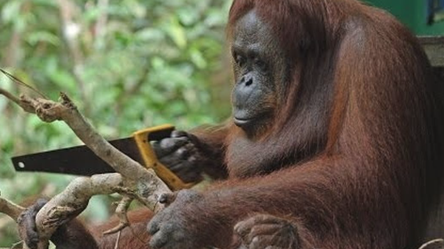
```

:::
::::

<!-- > The first principle is that you must not fool yourself and you are the easiest person to fool   -->
<!-- > [Richard Feynmann] -->

# The Ultimate Question

> **"I checked it very thoroughly," said the computer, "and that quite definitely is the answer. I think the problem, to be quite honest with you, is that you’ve never actually known what the question is."**  
> The Hitchhikers Guide to the Galaxy, Douglas Adams.

At a big picture level, research goals typically fall into one of three categories:  

|  | Aim |
|-- |---|
| **descriptive** | summarise characteristics |
| **predictive** | forecast the future for use in screening/selection/monitoring |
| **explanatory** | identify if one thing causes another or understand the mechanism by which it happens |

<br>

A large amount of psychological research falls into the "explanatory" category, aiming to understand if some variable X influences another variable Y, or by how much, or if the influence differs across another variable Z. 
We have been using statistical associations to provide us with answers to such questions, while at the same time endlessly hammering the phrase "correlation does not imply causation". 
It is a valid statement, but it is not very useful: if our aim is to understand the world and how it works, we cannot shy away from thinking about causality when defining our research questions. 
It is true that statistical analyses can only ever provide us with associations, but depending on what variables we measure and how we build our models, there are countless different 'associations' that we could report.
It is crucial that we do not lose sight of our *target*, which is so often causal in nature.

Research questions in the social sciences will very often use language that is *implicitly* causal. 
A frequent trap that researchers fall into is to have such a question, but then fail to engage with the assumptions that underpin whether their analysis is actually able to address that question. 
Words such as "effect", "influence", "explain", "prevent", "improve", "protect" etc., are all terms that imply causation, asking a question about what *would* happen to a variable $Y$ in the event that variable $X$ changed. 
Without careful thought (about both design and analysis) a statistical association might not tell us anything about the specific question that we are actually interested in. 

:::imp
**Important Note:** we're not going to learn anything in this reading that magically allows us to interpret our estimates as 'causal'. No such thing exists.  

Consider this reading more as a gentle encouragement to think more carefully about *which* association it is that you actually want to report. 

> "causality is not extra‐statistical but instead is a logical antecedent of real‐world inferences"
> (Greenland, 2022, p. 3).

:::


To build the intuition of how we can improve our research questions, let's move to an example.  

Suppose that we are in the realms of primate behaviour, and we are interested in social settings and engagement with cognitive puzzles - i.e., how long they spend working through sets of puzzles until they get bored/give up.  

- **Research Question:** Do chimpanzees in group-housing enclosures (with >2 chimps) engage with puzzles for longer than chimpanzees in paired-housing enclosures (2 chimps)?  

Take a few minutes to reflect on whether the above research question is clear and specific. What exactly is it asking? Is it descriptive? predictive? explanatory?  

As it currently reads, this may _feel_ like it is fairly clear, but it is actually quite under-specified. 
As well as not being clear about whether our question is about *all* chimpanzees, just adults, or just those in zoos, the question does not explicitly differentiate between whether we are interested in:  

- a descriptive question, targeting the observed difference in 'time-engaged-with-puzzles' between chimpanzees currently in group-enclosures and those currently in paired-enclosures?
- an explanatory question, targeting the difference in puzzle engagement for a given chimpanzee in group-enclosure compared to how long that same chimpanzee *would* spend with puzzles if it lived in a paired-enclosure?"

## How to specify clear research questions

A clearly defined research question should have two things, that can be defined outside of any statistical model: 

1. a unit-specific quantity
    - this is the thing we want to know about, defined at the level of the unit of interest. It could be a single value $Y_i$ for a given unit $i$, or a counterfactual comparison of $Y_i$ under different levels of another variable $X$, which we could be write as, e.g.,: $Y_i^{X=1} - Y_i^{X=0}$^[More complex questions involving interactions might then be framed in terms of comparisons of comparisons!]
2. a target population
    - this is the set of units over which we are aggregating our quantity. 
  
Returning to our chimp example, we can move to a somewhat more clearly stated question: 

- **Research Question:** For adult chimpanzees housed in UK zoos, what is the average effect on time-spent engaging with puzzles due to being placed in group-housing enclosure (>2 chimps) compared to being placed in paired-housing enclosure (2 chimps)? 

Note that the word "effect" here is stating that we want to know how much of the chimpanzee $i$'s "puzzle-time" is _because_ they are in a group-enclosure.  
This is a causal question, and as such concerns what we would expect chimp $i$'s "puzzle-time" to be like in the counterfactual world where we observed them in the other type of enclosure. 
The unit-specific quantity that we are interested in here is $\text{PuzzleTime}_i(\text{Group-Housing}) - \text{PuzzleTime}_i(\text{Paired-Housing})$, and these correspond to the values that are in the `diff` column in @tbl-delta. 
We want the average of these across a sample that represents the target population 

```{r}
#| echo: false
#| label: tbl-delta
#| tbl-cap: "The unit specific quantity we are interested in is the average difference in chimpanzees' puzzle-time when they are place in a group-enclosure compared to when they are placed in a paired-enclosure - these values are in the diff column"
set.seed(56011)
chdat <- tibble(
  age = round(runif(26,13,29)),
  delta = round(rnorm(26,3,1)),
  Y0 = pmax(0,round(rnorm(26,35-0.4 * age,3))),
  Y1 = Y0 + delta,
  enclosure_type = rbinom(26,1,plogis(1.3*scale(age))),
  PUZZLET = ifelse(enclosure_type==1,Y1,Y0)
) |> arrange(enclosure_type) |>
  transmute(
    chimp = paste0("chimp-",letters),
    age,
    puzzlet_paired = Y0, puzzlet_group = Y1, diff = delta,
    enclosure_type = ifelse(enclosure_type==0,"Paired","Group"), 
    PUZZLET
)
chdat[24,3:5] <- chdat[4,3:5]
chdat[24,7] <- chdat[24,4]
chdat[1,c(3:4,7)] <-chdat[1,c(3:4,7)]-8 
chdat[3,c(3:4,7)] <-chdat[3,c(3:4,7)]+7 

chdat[26,c(3:4,7)] <-chdat[26,c(3:4,7)]-3
chdat[25,c(3:4,7)] <-chdat[25,c(3:4,7)]-7


bind_rows(
  chdat[1:4,],
  data.frame(chimp=c(NA,NA)),
  chdat[23:26,]
) |> 
  select(-age,-enclosure_type,-PUZZLET) |>
  gt() |> sub_missing(missing_text="...")
```

:::{.readingref}

Lundberg, I., Johnson, R., & Stewart, B. M. (2021). *What is your estimand? Defining the target quantity connects statistical evidence to theory*. American Sociological Review, 86(3), 532-565.  

:::

<div class="divider div-transparent div-dot"></div>


# Mapping out the universe


Now that we have a well defined research question, there are lots of ways we might design a study to address it. 
We'll assume that we are measuring "puzzle-time" the same way in all of these - by giving each chimpanzee an hour to work through a series of puzzles, and seeing how long they engage with the puzzles before they give up/get bored/wander off.  

There are different ways we could study chimpanzees from both paired- and group-enclosures doing these puzzles:  

:::fancyframe
**1. observational study**  
Randomly sample chimpanzees living in both types of enclosure, and administer our puzzle-series task to all of them, also recording other variables required to identify the quantity of interest.   


**2. between-chimp randomized experiment**  
Randomly allocate half of chimpanzees into group-enclosures, and half into paired-enclosures, and (after a period of time that we would expect any effect to have taken place), administer our puzzle task. 


**3. within-chimp randomized experiment**  
Place each chimpanzee in both types of enclosure (counterbalancing the order in which these occur for each chimp), and then administer our puzzle task.  
:::

We will not cover 3 right now - this design involves multiple measurements of the puzzle task per chimpanzee, and we will cover statistical models for such designs in MSMR. 
Here, we will focus on options 1 and 2, to illustrate how our understanding of the how the data has come about informs the statistics we will use to address our research question. This includes understanding the bit about "other variables required to identify the quantity of interest".  

In our options for desiging a study of chimp-puzzling, in both the scenarios 1 and 2 detailed above, we only ever observe a given chimpanzee in _one type of enclosure_. 
This means that we can never observe the values in both of the `puzzlet_paired` and `puzzlet_group` columns for the same chimp - we can never directly observe the effect of enclosure type on puzzle-engagement-time for any given chimpanzee:  

```{r}
#| label: tbl-miss
#| tbl-cap: "Chimps allocated into different types of enclosure means we ultimately need to compare the puzzle-engagement-time between different groups of chimps. Greyed out values here show the data we cannot observe."
#| echo: false
bind_rows(
  chdat[1:4,],
  data.frame(chimp=c(NA,NA)),
  chdat[23:26,]
) |> select(-age) |>
  gt() |> sub_missing(missing_text="...") |>
  tab_style(
    style = cell_text(color = 'grey80'),
    locations = cells_body(columns=c(puzzlet_paired, diff), rows=enclosure_type=="Group")
  ) |>
   tab_style(
    style = cell_text(color = 'grey80'),
    locations = cells_body(columns=c(puzzlet_group, diff), rows=enclosure_type=="Paired")
  ) |>
  tab_spanner("Observed Data",columns=c(enclosure_type,PUZZLET))
```

Our understanding of the study design (our theory about the 'data generating process') is absolutely crucial in informing how we use our observed data to assess the research question appropriately. 
Knowing *how* chimps were allocated to the different types of enclosure will be necessary to determine what to put in our model.  

To build the intuition, we are going to look at some diagrams.
These diagrams represent our understanding of how the various attributes influence one another in the real world to generate the data that we have - they are visualisations of **data generating processes**!  

:::sticky
__"Data Generating Process"__  

A data generating process (DGP) is a process in the real world that "generates" the data we are interested in. 
Or, more broadly "how the data have come to be the way they are". 
We don't know the *true* DGP, but we usually have some understanding to allow us to have a rough idea of it. 

It may be easier to think of a DGP first in a closed system: imagine we're thinking about whether a toaster produces some toast. 
Several things need to happen in order for me to get my toast. 
We can draw a picture of how we understand the process to work:


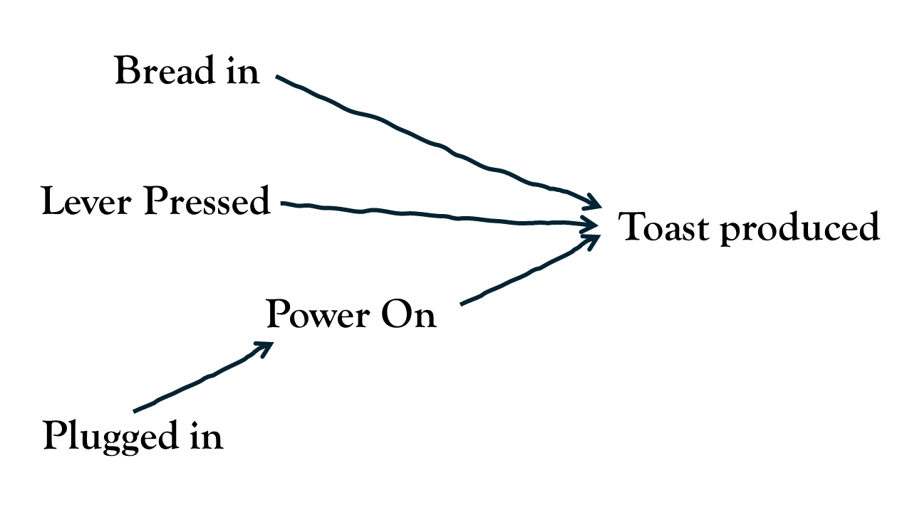{fig-align="center" width="200px"}

In diagrams like these, the words represent variables - quantifiable attributes in the real-world. 
The arrows represent how these different real-world attributes relate to one another to produce an outcome (toast).  

:::

In our chimpanzee studies, if we think about out research question in isolation, we can draw it as an arrow going from `EnclosureType` to `PuzzleTime`. 

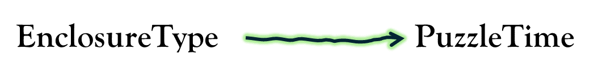

In the real world, however, there are lots of other things that influence why a chimpanzee might spend more time engaging with puzzles: its age, sex, genetics, hunger, social status, rearing history, hormones etc., etc.
To simplify our explanations, let's just pretend there's only one other thing that influences puzzle-engagement in chimpanzees, and that is its age, with older chimpanzees being less curious than younger ones. 
How `age` relates to other variables in our diagram depends on how the study is designed, as well as what we theorise about the world. 
For instance, let's suppose that we have good reason to suspect that zoos tend to place younger chimpanzees in paired-enclosures, and older ones in group-enclosures.  

Let's consider how this knowledge fits with our understanding of our two studies:  

:::fancyframe
#### 1. observational study

If our study was simply observing chimpanzees in whatever type of enclosure that we find them in, then we need to understand _how_ that allocation happened. If zoos tend to place younger chimpanzees in paired-enclosures, then we would draw a line from `Age` to `EnclosureType`.  

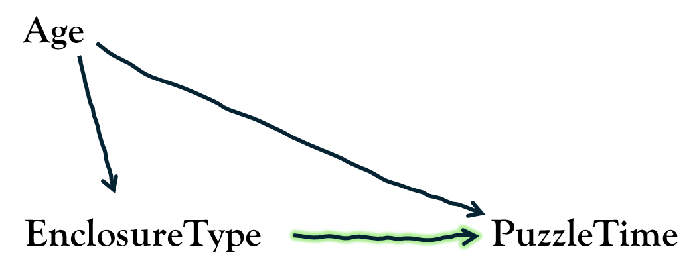
:::

:::fancyframe
#### 2. randomised experiment

If our study is instead a randomised experiment, then in our diagram, we know that there is no arrow going from `Age` to `EnclosureType`. 
In fact, we know that there should be *no* arrows going into `EnclosureType`, because it's just been randomly allocated!  

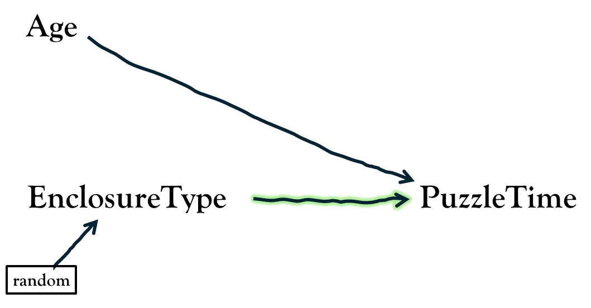
:::

In the observational study, because zoos are tending to place younger chimpanzees in paired-enclosures, then our data will likely reflect this: the chimps we observe from paired-enclosures might show greater time spent with puzzles than those we observe from group-enclosures *because* they tend to be younger.  
If we fail to take into account the age differences, it is impossible to isolate the effect of enclosure type on puzzle-time - it would be 'confounded' by age. 
By contrast, in our randomised experiment, because the only thing influencing which enclosure a chimp is allocated to is the random flip of a coin, it means that we should end up with similar aged chimps in each type. 

To illustrate how this understanding of the data generating process changes how we should build our models, we have simulated data for the two scenarios above so that you can play around with it yourself. 
In both the cases, we have made it so that being in a group-enclosure makes every individual chimpanzee spend on average exactly 3 minutes more engaging with the puzzles than they would be in a paired-enclosure.  


- In <https://uoepsy.github.io/data/chimp_obs.csv> we have an observational study where the allocation of chimps into paired/group-enclosures is dependent on age: zookeepers tended to put younger chimpanzees in paired-enclosures.  
- In <https://uoepsy.github.io/data/chimp_rct.csv>, we have a experiment in which chimpanzees are randomly allocated into either paired or group enclosures. 

In both cases, we have the chimpanzee's ages as a third variable. The question arises of whether to include `age` in our model. 
Let's compare the models with and without age in both scenarios. 
We are interested, remember, in "the effect of enclosure type on puzzle-time", which in this case corresponds to the `enclosure_type` coefficient (the difference in time spent on puzzles in `"Paired"` vs `"Group"` enclosures). 
Remember that in both scenarios, we have made it so that this difference is 3 (`"Group"` vs `"Paired"`) for every chimp (or -3 if for `"Paired"` vs `"Group"`).  

:::fancyframe
#### 1. observational study
```{r}
# TODO
# chimp_obs <- read.csv("https://uoepsy.github.io/data/chimp_obs.csv")


m1 <- lm(PUZZLET ~ enclosure_type, chimp_obs) 
m2 <- lm(PUZZLET ~ age + enclosure_type, chimp_obs)
```
```{r}
#| echo: false
modelsummary(list(m1, m2),
             fmt = 1, 
             estimate  = "{estimate} [{conf.low}, {conf.high}]",
             statistic = NULL, 
             gof_omit = 'DF|F|AIC|BIC|Log|RMSE|Num|Adj')
```
:::
:::fancyframe
#### 2. randomized experiment
```{r}
# TODO
# chimp_rct <- read.csv("https://uoepsy.github.io/data/chimp_rct.csv")

mr1 <- lm(PUZZLET ~ enclosure_type, chimp_rct) 
mr2 <- lm(PUZZLET ~ age + enclosure_type, chimp_rct)

```
```{r}
#| echo: false
modelsummary(list(mr1, mr2),
             fmt = 1, 
             estimate  = "{estimate} [{conf.low}, {conf.high}]",
             statistic = NULL, 
             gof_omit = 'DF|F|AIC|BIC|Log|RMSE|Num|Adj')
```
:::


Note that in the randomised experiment, `age` is a significant predictor, but including/excluding it does not change the estimate of the `enclosure_type` coefficient. 
In this toy example, the `enclosure_type` coefficient doesn't change **at all**, whereas in a real randomised experiment it probably would change just a little bit (this is just because we've made it so that the randomisation has resulted in *exactly* the same ages of chimps in both types of enclosure --- which is what randomisation achieves in the long-run).  
While including/excluding `age` in the model doesn't *bias* in our estimate of the `enclosure_type` coefficient, its inclusion will increase our *precision* (note the confidence interval gets narrower), because we are explaining more variance in our outcome variable (making the variance explained by enclosure easier to detect^[Think of this as $\frac{\text{signal}}{\text{noise}}$. Including age doesn't change the signal, but it does make the noise smaller.]). 

Contrast this with the observational study, in which it is absolutely necessary to adjust for `age` in order to 'de-confound' the effect of enclosure on puzzle-time. 
If we fail to include `age` in our model then we might erroneously conclude that smaller enclosures lead to *more* aggression, rather than less!  

::: {.callout-caution collapse="true"}
#### optional note for wizards: exchangeability of potential outcomes

It's tempting to think that what we're aiming for is having the same aged chimps in both types of enclosure - i.e., it feels like what we _want_ is "balanced" covariates. 
Indeed, this is why people design studies that "match" subjects on things like age and sex - for instance, for each chimp observed in a paired enclosure, finding a chimp of the same age in a group enclosure.
Technically however, this isn't actually the thing we're aiming for, it is simply one way to get it.  

To identify the effect of `enclosure_type` on `PUZZLET`, what we are wanting is "exchangeability of the potential outcomes".  

The "potential outcomes" here are the values of `PUZZLET` we would have measured if we could see a chimp in either enclosure type.  
In the situation of the observational study, the sets of potential outcomes (`puzzlet_paired`, `puzzlet_group`) are not comparable for the two groups of `enclosure_type` that we have observed (@tbl-miss2) --- where `enclosure_type=="Group"`, these values tend to be slightly lower than where `enclosure_type=="Paired"`. This is because of age!  

```{r}
#| label: tbl-miss2
#| tbl-cap: "To identify the effect of a treatment on an outcome, we want it so that units in treatment group A, *had they been in group B, would have had the same outcome distribution as the units we do see in group B (and vice versa)"
#| echo: false
bind_rows(
  chdat[1:4,],
  data.frame(chimp=c(NA,NA)),
  chdat[23:26,]
) |> select(chimp,puzzlet_paired,puzzlet_group,
            diff,age,enclosure_type,PUZZLET)  |>
  gt() |> sub_missing(missing_text="...") |>
  tab_style(
    style = cell_text(color = 'grey80'),
    locations = cells_body(columns=c(puzzlet_paired,puzzlet_group, diff))
  ) |>
  tab_spanner("Observed Data", columns =
                c(enclosure_type,age,PUZZLET),
              level=2) |>
  tab_spanner("Potential Outcomes", columns =
                c(puzzlet_paired,puzzlet_group)) |>
  tab_spanner("Individual Effect", columns =
                c(diff)) |>
  tab_spanner("Unobservable", columns=c(puzzlet_paired,puzzlet_group,
                                        diff),level=2) |>
  tab_spanner("Realised Outcome", columns=c(PUZZLET),
              level=1)
```

To think about how 'adjusting for age' helps this, simply consider how the comparison works when comparing chimpanzees of the same ages. 
For instance, in @tbl-miss2, "chimp-d" and "chimp-x" are in different enclosure types, but are both the same age, and their potential outcomes are the same!  

Randomisation achieves this because there is nothing that influences the allocation into different enclosures. 

:::{.readingref}

Darren Dahly: *Out of balance* - <https://statsepi.substack.com/p/out-of-balance>

:::

:::
 
Our takeaway might be that we should always conduct experiments, and this is a reasonable first thought --- if we have randomly allocated our observations to values of our explanatory variable $X$, we don't have to worry about measuring all the possible confounding variables, because it is only randomness that influences what value of $X$ an observation takes. 
Indeed, "randomised controlled trials" are generally considered the gold standard for estimating an 'effect'. 
Remember however, that it may often be unethical or impossible to intervene and force people into a certain condition, and in situations where we *can* intervene, we often do so at the sacrifice of ecological validity.  

More importantly, while randomisation may assist with confounding variables prior to allocation, experiments do not magically allow us to make causal claims, nor do they absolve us from thinking about the data generating process to inform our analytical decisions. 

Let's suppose that in our two studies of chimpanzees we also record the average number of hours of "enrichment activities" that each chimpanzee receives each week (these are things the zookeeper might do such as scatter-feeding nuts, puzzle feeders, or novel scent trails). 
Should we include this variable in our analysis in the observational study? What about in the experimental study? Will it matter?  

To answer, this, we need to consult our understanding of how the variable fits in to the data generating process. 
We talk to the zookeepers, read up on literature, and decide that it is likely to sit somewhere along path between `EnclosureType` and `PuzzleTime`: zookeepers tend to spend more time on enrichment activities to the group enclosures, and that enrichment activities encourage chimps to be more curious, better at solving puzzles etc. 
In this case, the `Enrichment Hrs` variable fits in our data generating process as so: 

::::{.columns}
:::{.column width="50%"}
__1. an observational study__  

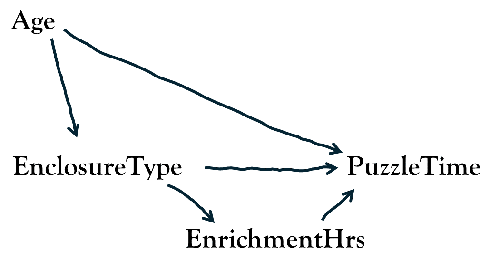
:::
:::{.column width="50%"}
__2. a randomised experiment__  

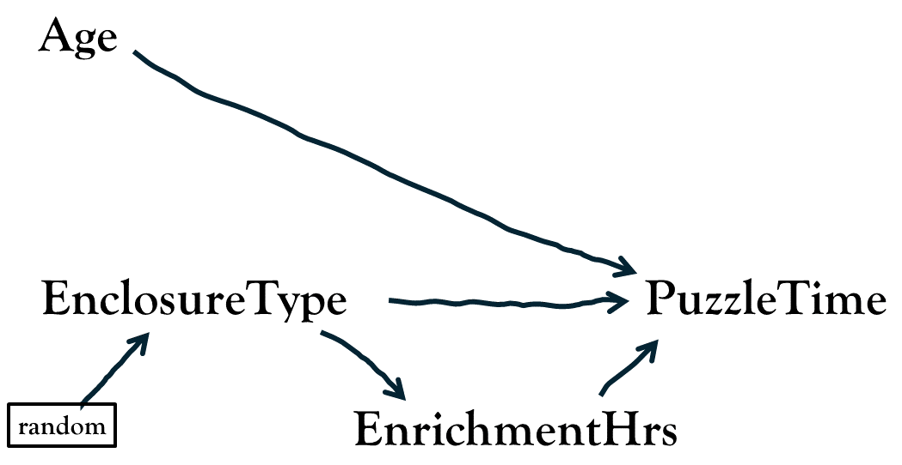
:::
::::

If we are right with our above view of the data generating process, which model should we use in order to address our research question? 
Try it out for yourself in the two simulated datasets! 
Remember, that in both of datasets, we have made it so that chimpanzees spend exactly 3 minutes more on puzzles in group-enclosures than they would in paired-enclosures (and exactly 3 minutes less in paired-enclosures than they would in group-enclosures) --- i.e., we have made it so that the "effect of paired/group housing on puzzle-time" is exactly 3.  

:::fancyframe
#### 1. observational study
```{r}
# TODO
# chimp_obs <- read.csv("https://uoepsy.github.io/data/chimp_obs.csv")

m1 <- lm(PUZZLET ~ enclosure_type, chimp_obs) 
m2 <- lm(PUZZLET ~ age + enclosure_type, chimp_obs)
m3 <- lm(PUZZLET ~ enrichment_hrs + enclosure_type, chimp_obs)
m4 <- lm(PUZZLET ~ age + enrichment_hrs + enclosure_type, chimp_obs)
```

```{r}
#| echo: false
modelsummary(list(m1, m2, m3, m4),
             fmt = 1, 
             estimate  = "{estimate} [{conf.low}, {conf.high}]",
             statistic = NULL, 
             gof_omit = 'DF|F|AIC|BIC|Log|RMSE|Num|Adj')
```

:::
:::fancyframe
#### 2. randomized experiment
```{r}
# TODO
# chimp_rct <- read.csv("https://uoepsy.github.io/data/chimp_rct.csv")

mr1 <- lm(PUZZLET ~ enclosure_type, chimp_rct) 
mr2 <- lm(PUZZLET ~ age + enclosure_type, chimp_rct)
mr3 <- lm(PUZZLET ~ enrichment_hrs + enclosure_type, chimp_rct)
mr4 <- lm(PUZZLET ~ age + enrichment_hrs + enclosure_type, chimp_rct)
```
```{r}
#| echo: false
modelsummary(list(mr1, mr2, mr3, mr4),
             fmt = 1, 
             estimate  = "{estimate} [{conf.low}, {conf.high}]",
             statistic = NULL, 
             gof_omit = 'DF|F|AIC|BIC|Log|RMSE|Num|Adj')
```
:::

Note that, in both the observational study and the randomised experiment, when we include `enrichment_hrs` in the model, the coefficient for `enclosure_type` changes.
Given our diagrams above, this actually makes perfect sense - the coefficient no longer captures the total effect of "what would happen to a chimp's puzzle-time *were* it to be in a paired (instead of group) enclosure?". 
It changes to being "what would happen to a chimp's puzzle-time *were* it to be in a paired (instead of group) enclosure, *but the amount of time on enrichment activities did not change*".  

Note that this may in some cases be an interesting quantity, but it is not the quantity we were interested in when we specified our research question. To take a much more extreme simplification, imagine that we want to assess if lighting a fire will set off the fire alarms in 7GS, so we go and set fires in a randomly chosen set of rooms^[please don't do this!] and record whether the alarm goes off, along with measuring the volume of smoke in the rooms.  

Because fire alarms respond to smoke, not fire, when we fit a model of `lm(alarm ~ smoke + fire)`, the coefficient for `fire` would be zero, because the effect of the fire on the alarm is entirely via the increased volume of smoke.  

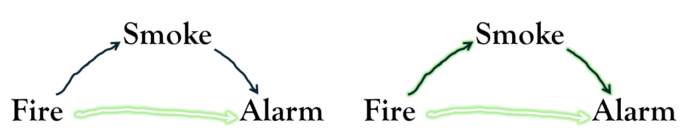

This is because our question was "will lighting a fire set off an alarm?" (all the arrows in green on the right hand side above) and not "will lighting a fire, but (somehow) not changing the volume of smoke in the room, set off an alarm?" (the single green arrow in the left hand below). In this extreme case, the direct arrow from Fire &rarr; Alarm doesn't actually exist!  

<br><br>

Returning to our chimpanzee examples, we are now at the point where we know that:   

::::{.columns}
:::{.column width="48%"}
__1. observational study__  

To answer our research question in this study, we _need_ to adjust for `age` in our model, and we *don't* want to adjust for `enrichment_hrs` (because that's part of the effect we're interested in).  

:::
:::{.column width="4%"}
:::
:::{.column width="48%"}
__2. randomised experiment__  

To answer our research question in this study, we *don't* want to adjust for `enrichment_hrs`. Adjusting for `age` will help our power to detect the effect that we're interested in, but not including it in our model will not bias our results.    

:::
::::

Another way in which we might veer off target with out analysis can be demonstrated with the inclusion of a further variable. 
Suppose that, on reviewing videos of the chimpanzees in our study completing the puzzle-task, we notice that some chimps were simply not engaging much and fell asleep during their 1-hour puzzle session. 
We decide to record which chimps fell asleep, and then adjust for that variable in our models. 
This creates a problem if, according to our DGP, `Asleep` is influenced by both the predictor of interest `EnclosureType` and the outcome `PuzzleTime`. 
This is a plausible scenario because a) chimpanzees in group-housing might live in more stimulating environments, meaning they take more opportunities to rest, and b) when a chimp stopped engaging with the puzzles, there was not much else for them to do for the rest of the hour. 

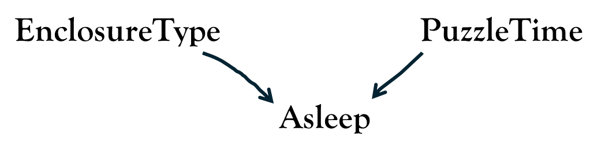

According to our DGP, chimps are more likely to fall asleep in the study session *either* because they are in group-housing **or** because they have spent less time engaging with the puzzles (or both)

To see how this causes a problem, suppose that there was **no** effect of `EnclosureType` on `PuzzleTime`, meaning that we shouldn't be able to see any pattern between the two (hence the lack of an arrow between the two in the figure above).
If we recorded whether or not each chimpanzee fell asleep, and then include this in our model `lm(PUZZLET ~ asleep + enclosure_type)`, then we will actually create a spurious association between `PUZZLET` and `enclosure_type`. 
Think of it like we did with `age`, and consider how the Paired vs Group chimps would differ when we compare chimps of the same value in `asleep`. 
If you consider all the awake chimps, then suddenly we see a spurious association: 

- `enclosure_type=="Group"` is indicative of high puzzle engagement.
- `enclosure_type=="Paired"` is indicative of low puzzle engagement.

This same mechanism can be seen at work in "selection bias", which is when this sort of variable decides whether or not we include/exclude observations from a study. 
For instance, a study which didn't discarded any chimps who fell asleept (meaning they aren't included in the analysis), creates the same spurious association because it looks at the effect specifically within the awake chimpanzees.  

You can play around with this yourself:  

```{r}
mr1 <- lm(PUZZLET ~ enclosure_type, chimp_rct)
mr5 <- lm(PUZZLET ~ asleep + enclosure_type, chimp_rct)

# selecting on awake:
chimp_rct_awake <- chimp_rct |>
  filter(asleep == 0)
mr6 <- lm(PUZZLET ~ enclosure_type, chimp_rct_awake)
```
```{r}
#| echo: false
modelsummary(list(mr1, mr5, mr6),
             fmt = 1, 
             estimate  = "{estimate} [{conf.low}, {conf.high}]",
             statistic = NULL, 
             gof_omit = 'DF|F|AIC|BIC|Log|RMSE|Num|Adj')
```


As another example, if we wanted to know if "attractiveness tends to co-occur with talent", but we only take a sample of famous people, then we might see a negative correlation, because famous people tend to be famous because they are _either_ talented _or_ attractive (see <https://colliderbias.herokuapp.com/>)

::: {.callout-tip collapse="true"}
## Optional: More generally 

> *Let's think the unthinkable, let's do the undoable. Let us prepare to grapple with the ineffable itself, and see if we may not eff it after all*  
> The Hitchhikers Guide to the Galaxy, Douglas Adams.


If you're planning on heading into observational research, then all of the stuff we have been talking about here is incredibly important. To ignore this sort of stuff will make it much harder for your work to provide meaningful insights.  

Many questions of interest to us are concerned with estimating "the effect of $X$ on $Y$", or some extension of this (e.g., "does the effect of $X$ on $Y$ depend on $Z$?").  

Part of the challenge of getting this from a statistical model is ensuring that the specific effect of interest is 'identified' (i.e., under our assumed DGP, the observed data is sufficient to isolate the 'what happens to $Y$ if $X$ changes without being confounded or masked by other variables).
What we do with other variables will depend on where we see them fitting in the DGP.  

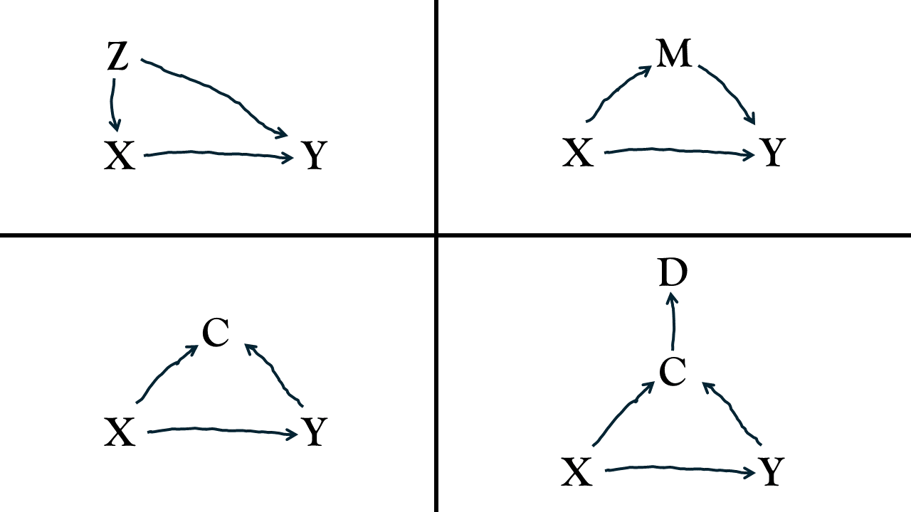

We can think of information as flowing along the arrows in these diagrams, with flow passing through nodes that have the form &rarr;V&rarr; and &larr;V&rarr; but not &rarr;V&larr;.
As such, there are three places a third variable might be placed - it could be a 'confounder' (variable $Z$), a 'mediator' (variable $M$) or a 'collider' (variable $C$). It could also be a descendent (variable $D$) of some other variable.  

In our image above:  

- The path $X$&larr;$Z$&rarr;$Y$ is by default "open" (letting information flow). By adjusting for $Z$ in our model, we close it.  
- The path $X$&rarr;$M$&rarr;$Y$ is by default open. Adjusting for $M$ in our model closes it. 
- The path $X$&rarr;$C$&larr;$Y$ is by default closed. If we adjust for $C$ in our model, we open it. If we adjust for $D$ in our model, we would also open this path! 

::::{.columns}
:::{.column width="50%"}

So if our DGP had all variables included (see the image to the right), then in order to isolate the specific effect of interest $X$&rarr;$Y$, we should:

- close the back doors paths going into $X$
- leave open the required front doors paths coming out of $X$ open that capture the causal effect of interest

If we want "the effect of $X$ on $Y$", this therefore means including $Z$ in our model, but not $M$ or $C$ or $D$.
Including $M$ would fail to capture the total effect of $X$ on $Y$, and including $C$ or $D$ would introduce a spurious association.  
:::
:::{.column width="50%"}

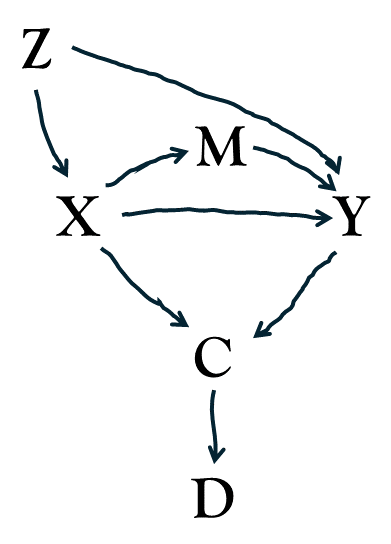

:::
::::

Regression adjustment is just *one* way to "control" for third variables, and there are many more sophisticated approaches if you are interested.^[These typically aim to achieve balanced covariates by using algorithms that match observations or re-weight them based on an estimated 'propensity' for receiving one treatment value versus another. In our chimp example, this would involve matching or weighting based on predicted probabilities from a model like: `glm(enclosure_type ~ age + ..., family = binomial)`.]
In practice, however, even the most sophisticated tools cannot fully make up for the fact that specifying a clear Data Generating Process (DGP) for observational studies is incredibly difficult. This is especially true in psychology, where constructs can be ill-defined and almost everything correlates with everything else! 

It is still possible to get meaningful insights from observational studies, but it takes a lot more careful thought. In fact, the diagrams that we have been using ("Directed Acyclic Graphs", or "DAGS") are actually one of the key tools that is used! 
While an entire ecosystem of sophisticated quantitative methods has arisen from this sort of work, satisfyingly answering a causal question from observational data typically is only possible in very specific circumstances. 

In the spirit of "let's all try to do better," here is some general advice for a workflow: 

**Prior to data analysis:**  

1. **Define your target question clearly up front.** (What exact quantity are you trying to estimate?)
2. **Draw your assumed DGP**, including all relevant variables you can think of, especially the unobservable/unmeasured ones.
3. **Figure out your "identification" strategy.** Using the drawing in 2, think about how you will need to analyse the data in order to estimate your target quantity. If it's impossible to 'de-confound' the estimate via the standard 'back door' closing, this is where it may be necessary to learn about some of the more sophisticated methods. Use this to inform what data to collect/what data is required. 

**After data analysis:**  

4. **Be transparent about structural limitations.** consider including your drawing in your paper (this is very common in fields like health research). Consider conducting sensitivity analyses to determine how strong an unmeasured confounder would have to be to flip your conclusions (see e.g., the [**tipr** package](https://github.com/r-causal/tipr){target="_blank"}).  


:::{.readingref}

- Chatton, A., & Rohrer, J. M. (2024). *The causal cookbook: Recipes for propensity scores, g-computation, and doubly robust standardization.* Advances in Methods and Practices in Psychological Science, 7(1)

:::

:::

The biggest problem for observational studies is that things are rarely as simple as in the toy example we have used here. 
There are loads and loads of other things that might fit into our data generating process. Figuring out what they are, and how they fit in, is extremely difficult. 
We may end up with a much more complex diagram,^[ 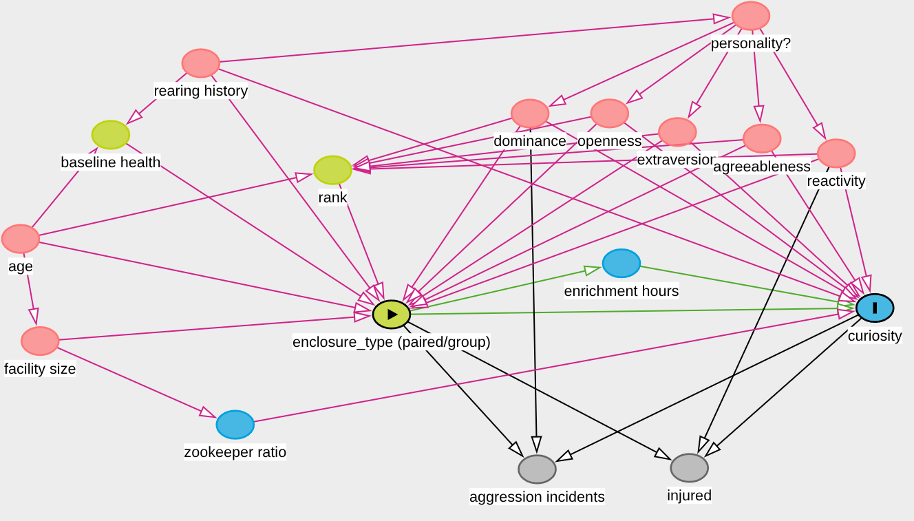 this is just as many things as I could think of in ~10 minutes! I don't know anything about how zoos work, or about primatology, so I don't know how many of these arrows are justified!] and 
TODO


:::{.readingref}

- Wysocki, A. C., Lawson, K. M., & Rhemtulla, M. (2022). *Statistical control requires causal justification*. Advances in Methods and Practices in Psychological Science, 5(2).
- Rohrer, J. M. (2024). *Causal inference for psychologists who think that causal inference is not for them*. Social and Personality Psychology Compass, 18(3)
- Cinelli, C., Forney, A., & Pearl, J. (2024). *A crash course in good and bad controls*. Sociological Methods & Research, 53(3), 1071-1104

:::

<div class="divider div-transparent div-dot"></div>

# Key Takeaways

> **Don't Panic.**  
> The Hitchhikers Guide to the Galaxy, Douglas Adams.

- observational studies are *hard*. 
- experiments are great!  
- if nothing else, draw your theory about the data generating process ahead of time, and use it to inform what variables to collect, and what to put in your model


If you feel the draw of experimental work, then this is all useful stuff, but we would strongly recommend devoting time to reading "**Experimentology**" by M. Frank and others ([available online for free here](https://doi.org/10.25936/3JP6-5M50){target="_blank"}).  

If you're excited by observational research, then you've got your work cut out! However, there are lots and lots of tutorials out there, and the field is constantly developing. One particular book that stands out (for me at least) for its engaging and accessible language is Nick Huntington-Klein's "**the effect**" ([available online for free here](https://theeffectbook.net/){target="_blank"}).   

<div class="divider div-transparent div-dot"></div>

# Additional considerations

> **Would it save you a lot of time if i just gave up and went mad now?**  
> The Hitchhikers Guide to the Galaxy, Douglas Adams.


::: {.callout-tip collapse="true"}
#### TODO What about descriptive work?

```{r}
#| include: false
set.seed(3456)
hhgbsm_desc <- tibble( 
  uY = rbinom(1e5, 1, .2),
  pM = rbinom(1e5,1, plogis(uY)),
  Y = ifelse(pM==1,NA,uY)
)
set.seed(3)
dep_fullpop <- hhgbsm_desc |>
  transmute(
    status = uY,
    will_complete_survey = (pM==0)*1
    # observed_status = Y
  ) |> slice_sample(prop=1)
dep_sample <- dep_fullpop |>
  filter(will_complete_survey==1) |>
  slice(1:100)

mean(dep_fullpop$status)
mean(dep_sample$status)
```


The phrase "No causes in, no causes out" (Nancy Cartwright) is a useful reminder that to interpret a statistical estimate as an "effect", we need to make causal assumptions --- assumptions about the data generating process.  

What then, if we are not trying to answer an explanatory question, and are sticking with descriptive work? 

__Example__  

Suppose our goal is to estimate the prevalence of severe depression.  

This is purely descriptive: we're aiming to simply summarise the proportion of people with a diagnosis of severe depression. 

To demonstrate, let's see pretend we complete data for the entire population. This is no longer an estimate, it's just the true value we're interested in:   
```{r}
table(dep_fullpop$status) |> 
  prop.table()
```

With access to the full population, we know that `r round(mean(dep_fullpop$status)*100)`% of the population has severe depression.  

In practice, however, we rarely have the full population data, and so instead we might conduct a survey on a random sample of people. But we still need to think carefully about the data generating process - we should think about the things that might lead people to decide to complete (or not complete) a questionnaire on depression. 

Typically, people who are severely depressed a way less likely to ever fill out these surveys. 
So we can think of our population as containing people like this: 
```{r}
head(dep_fullpop)
```

What that means is, when we take a sample, we are far less likely to see those people who have severe depression, and we are therefore likely to _underestimate_ the prevalence of depression.  

This code mimics taking a sample of 100 people who 'will complete the survey'
`r set.seed(55)`
```{r}
dep_sample <- dep_fullpop |>
  filter(will_complete_survey==1) |>
  slice_sample(n = 100)

table(dep_sample$status) |>
  prop.table()
```

Even with a bigger sample of 10,000 the problem persists! 
```{r}
dep_sample <- dep_fullpop |>
  filter(will_complete_survey==1) |>
  slice_sample(n = 10000)

table(dep_sample$status) |>
  prop.table()
```

The problem here is that we are using statistics in such a way that misrepresents the data generating process. 
We are assuming that we have the situation in @fig-desc Left, whereas in reality it looks more like @fig-desc Right. 

TODO figure

It is clear then, that maintaining that "I'm only describing things" does not absolve us from _thinking_ about the data generating process.  
"No causes in, nothing out" (Richard McElreath)

:::

::: {.callout-tip collapse="true"}
#### TODO Can't we just report 'associations'?

Occasionally, people will appear to avoid engaging with difficult thinking about the data generating process by maintaining that their results are only ever 'associations' or 'correlations'.  

It is true that all our statistics cannot transcend the world of 'associations' - all any of us ever report are associations.  

However, this somewhat misses the key point that we need clarity in our research question in order to decide *which* association it is that we actually want to report.  

An example from Rohrer et al shows a commonly used template for research: 

1. Does money bring happiness << implicitly causal question
2. report associations between income and happiness from a cross-sectional survey << does not target the causal question 
3.  << implicitly causal answer to 1.
4. state correlation != causation 


(see e.g., <https://youtu.be/IKdCuY-GjP4?si=4gX-94YjgieCnygI&t=1618> )


:::

::: {.callout-tip collapse="true"}
#### TODO what about moderation/interaction?  

If both variables involved in the interaction can be controlled/manipulated then we can design a randomised experiment accordingly, for instance following a "2x2 factorial design", in which participants are randomly allocated to one of the following rows:

```{r}
expand_grid(
  predictor_1 = LETTERS[1:2],
  predictor_2 = LETTERS[3:4],
  outcome = "..."
) |> gt::gt()
```

Because allocation to both predictors is randomised, we can study the interaction `outcome ~ predictor_1 * predictor_2` without worrying about confounding variables.  

However, very often there are situations in which researchers wish to study an interaction in which one (or both) of the predictors is an observed attribute (not something they can manipulate).  

For example: 


https://journals.sagepub.com/doi/10.1177/25152459211007368

https://datacolada.org/80 

```{r}
df <- tibble(
  w = scale(rnorm(200))[,1],
  x = rep(0:1,100),
  z = scale(rnorm(200,.5*w,1))[,1],
  lp = -w + z + x + x*z + -x*w,
  y = rnorm(200,lp,.0001)
) 
sjPlot::tab_model(
  lm(y~x,df),
  lm(y~x*z,df),
  lm(y~w+x*z,df),
  lm(y~x*(w + z),df)
)

```

- if you are interested in Y ~ X \* Z
- if one (or both) of X or Z is not randomised, then it may well be necessary to control for other variables W. 
- simply controlling for Y~W+X\*Z will not deconfound your X\*Z interaction in the event that the true data generating process involves W interacting with X or Z. 

e.g., suppose we randomly allocate people to X, but are wanting to know if the effect of X differs by Z. 
- Z and Y share a common cause of W, so we should control for W. 
- if our target estimate is what a hypothetical intervention on Z would do to the effect on Y of intervening on X, then it may also be necessary to control for X*W, in the event that W also moderates the effect of X.  


:::

::: {.callout-tip collapse="true"}
#### TODO what about longitudinal studies?  

we will get more of this in MSMR, but sometimes people get stuck assuming that anything measured "within participants" avoids any problems with confounding. 

e.g., let's suppose we do:  

**3. within-chimp randomized experiment**  
Place each chimpanzee in both types of enclosure (counterbalancing the order in which these occur for each chimp), and then administer our puzzle task.  

We have data that looks like this:  

```{r}
junk::sim_basicrs
```


:::

::: {.callout-tip collapse="true"}
#### TODO do not simply control for *all* available variables


:::

::: {.callout-tip collapse="true"}
#### TODO do not just simply control for all pre-treatment variables

      - zoo-budget past >> enclosure size
      - zoo-budget past >> stress
      - enclosure size >> stress
      - aggression >> stress
      - genetic >> aggression
      - genetic >> stress
      
:::

::: {.callout-tip collapse="true"}
#### TODO do not use predictive criteria for an explanatory question 
  
- if your research goal is explanatory do not use predictive criteria to determine what to include in your model

note that if our goal is to explain, then the predictive accuracy of a model is not a good criteria for choosing which model we should use. 

something like a simple model comparison of residual SS (using `anova(mod1, mod2)`) will make us think that X is the "better model", because the addition of XX explains more variance --- it does a better job of predicting Y. 
The issue is that using model fit criteria (anything like an F test, AIC, BIC, etc) **doesn't care** about the direction of the arrows in your theory. 

for example, we can add in XX to predict Y, but that really doesn't make any sense to do.  

:::

::: {.callout-tip collapse="true"}
#### TODO not all coefficients are the same

  - we can't interpret coefficients of confounders in the same way as we do the focal predictor (table 2 fallacy)

:::


