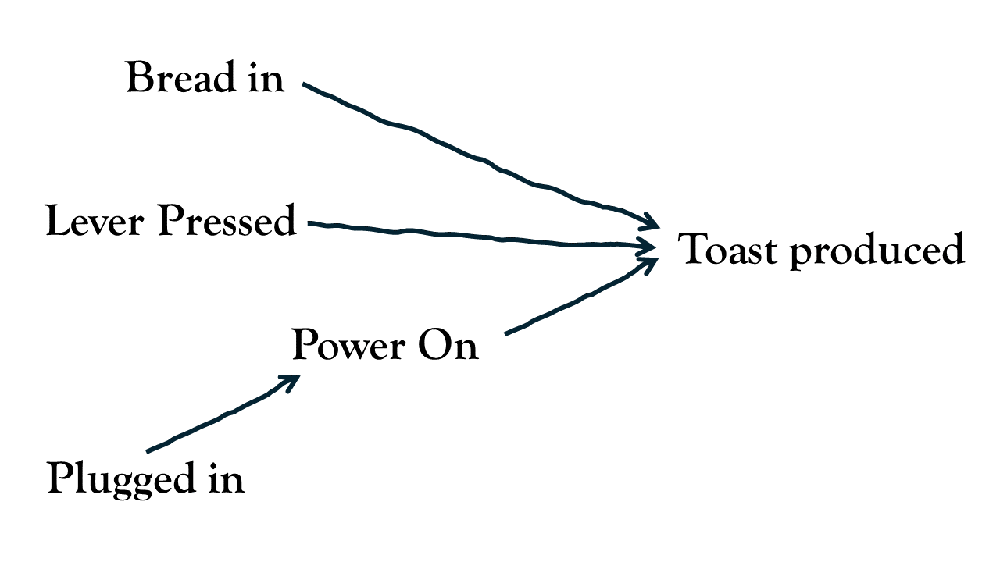
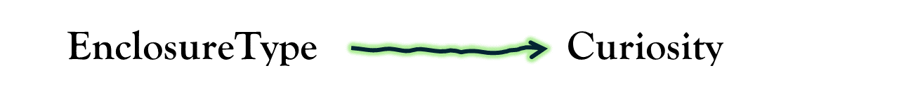
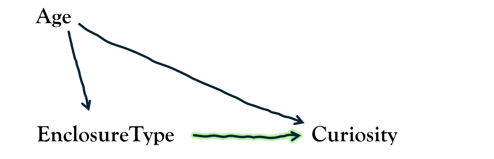
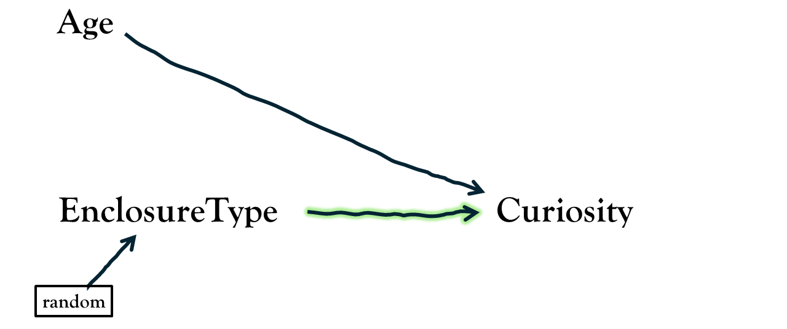
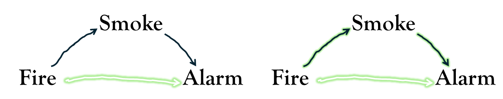
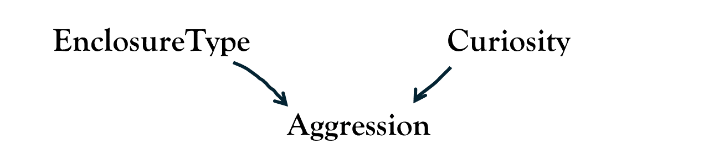
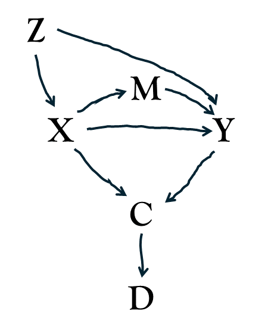

<!-- > We demand rigidly defined areas of doubt and uncertainty -->
<!-- > I'd far rather be happy than right any day -->


```{r}
#| include: false

library(tidyverse)
library(gt)
library(patchwork)
library(modelsummary)
# eseed=round(runif(1,1,1e7))
# set.seed(eseed)
set.seed(7570359)
## obs
chimp_obs <- tibble(
  chimp = paste0("chimp-", letters),
  age = round(runif(26, 13, 29)),
  treat = rbinom(26,1,plogis(5*scale(age))),
  enclosure_type = ifelse(treat==1,"Group","Paired")
)
nnk = residuals(lm(rnorm(26) ~ chimp_obs$age + chimp_obs$treat))
nny = residuals(lm(rnorm(26,0,2) ~ chimp_obs$age + chimp_obs$treat + nnk))

chimp_obs <- 
  chimp_obs |>
  mutate(
    K0 = round(12 + nnk, 1),
    K1 = K0 + 4,
    k_time = ifelse(enclosure_type == "Group", K1, K0),
    Y0 = round(35 - 0.4 * age + 0.5 * K0 + nny, 1),
    Y1 = Y0 + 1 + 0.5 * (K1 - K0),
    CURIOUS = ifelse(enclosure_type=="Group",Y1,Y0)
  ) 
chimp_obs <- 
  chimp_obs |>
  transmute(chimp, age,enrichment_hrs=k_time, enclosure_type, CURIOUS)
write_csv(chimp_obs, file="../../data/chimp_obs.csv")
sjPlot::tab_model(
  lm(CURIOUS ~ enclosure_type, chimp_obs),
  lm(CURIOUS ~ age+enclosure_type, chimp_obs),
  lm(CURIOUS ~ age+enrichment_hrs+enclosure_type, chimp_obs),
  lm(CURIOUS ~ enrichment_hrs+enclosure_type, chimp_obs)
)

## rct
# eseed=round(runif(1,1,1e7))
# set.seed(eseed)
set.seed(738557)
chimp_rct <- tibble(
  chimp = paste0("chimp-", letters),
  age = rep(round(runif(13, 13, 29)),2),
  treat = rep(0:1,e=13),
  enclosure_type = ifelse(treat==1,"Group","Paired"),
)
nnk = residuals(lm(rnorm(26) ~ chimp_rct$age + chimp_rct$treat))
nny = residuals(lm(rnorm(26,0,2) ~ chimp_rct$age + chimp_rct$treat + nnk))

chimp_rct <- 
  chimp_rct |>
  mutate(
    K0 = round(12 + nnk, 1),
    K1 = K0 + 4,
    k_time = ifelse(enclosure_type == "Group", K1, K0),
    Y0 = round(35 - 0.4 * age + 0.5 * K0 + nny, 1),
    Y1 = Y0 + 1 + 0.5 * (K1 - K0),
    # Y0 = round(15 - .4*age + nny,1),
    # Y1 = Y0 + delta,
    CURIOUS = ifelse(enclosure_type=="Group",Y1,Y0)
  ) 

set.seed(135074)
chimp_rct$injured <- 
  rbinom(nrow(chimp_rct),1,
         plogis(
           scale(chimp_rct$CURIOUS)*+1 + 1*(chimp_rct$enclosure_type=="Group")
  ))

# lm(CURIOUS~enclosure_type,chimp_rct)
# lm(CURIOUS~coll+enclosure_type,chimp_rct)
# lm(CURIOUS~enclosure_type,chimp_rct[chimp_rct$coll==0,])


chimp_rct <- chimp_rct |>
  transmute(chimp, age, injured, enrichment_hrs=k_time, enclosure_type, CURIOUS)
write_csv(chimp_rct, file="../../data/chimp_rct.csv")

sjPlot::tab_model(
  lm(CURIOUS ~ enclosure_type, chimp_rct),
  lm(CURIOUS ~ age+enclosure_type, chimp_rct),
  lm(CURIOUS ~ age+enrichment_hrs+enclosure_type, chimp_rct),
  lm(CURIOUS ~ enrichment_hrs+enclosure_type, chimp_rct)
)
# 
# 

```


# tools vs design

::::{.columns}
:::{.column width="50%"}

Over the past 10 weeks, we have done a lot of work learning about the machinery of statistical models. But learning how different tools work is not the same as learning how to use them to build something. 

One of the biggest challenges in doing scientific research is to thinking very carefully, deliberately, and __clearly__ about all parts of the process. 
It is all too easy to go through the motions and do what _looks like_ science, but only ever have a research question that is ill-defined and ambiguous. 
No amount of fancy statistics can provide a clear answer to an under-specified question.  

:::
:::{.column width="2%"}
:::
:::{.column width="48%"}

```{r}
#| echo: false
#| label: fig-tool
#| fig-cap: "I may know how to use a saw, a drill, a hammer, etc., but I cannot build a house!"
knitr::include_graphics("images/tools.png")
```

:::
::::

<!-- > The first principle is that you must not fool yourself and you are the easiest person to fool   -->
<!-- > [Richard Feynmann] -->

# What is your quest?   

> *"I checked it very thoroughly," said the computer, "and that quite definitely is the answer. I think the problem, to be quite honest with you, is that you’ve never actually known what the question is."*  
> The Hitchhikers Guide to the Galaxy, Douglas Adams.

At a big picture level, research goals typically fall into one of three categories:  

- descriptive - summarise characteristics
- predictive - forecast the future for use in screening/selection/monitoring
- explanatory - identify if one thing causes another or understand the mechanism by which it happens  

The majority of psychological research tends to fall into the "explanatory" category. 
Often, after taking an introductory statistics class, we have had the phrase "correlation does not imply causation" endlessly hammered into us. 
It's a valid statement, but it's not very useful - if our aim is to understand the world and how it works, we cannot shy away from thinking about causality when defining our research questions. 


Research questions in the social sciences will very often use language that is *implicitly* causal, but then fail to engage with the assumptions that underpin whether their analysis is actually able to address that question. 
Words such as "effect", "influence", "explain", "prevent", "improve", "protect" etc., are all terms that imply causation, asking a question about what *would* happen to a variable $Y$ in the event that variable $X$ changed. 
Without careful thought (about both design and analysis) a statistical association might not tell us anything about the specific question that we are actually interested in. 

:::imp
**Important Note:** we're not going to learn anything in this reading that magically allows us to interpret our estimates as 'causal'. No such thing exists.  

Consider this reading more as a gentle encouragement to think more carefully about *which* association it is that you actually want to report. 

> "causality is not extra‐statistical but instead is a logical antecedent of real‐world inferences"
> (Greenland, 2022, p. 3).

:::

To build the intuition of how we can improve our research questions, let's move to an example:  

- **Research Question:** Are chimpanzees in group-housing enclosures (with >2 chimps) more curious than chimpanzees in paired-housing enclosures (2 chimps)?  

Take a few minutes to reflect on whether the above research question is clear and specific. What exactly is it asking? Is it descriptive? predictive? explanatory?  

As it currently reads, this may _feel_ like it is fairly clear, but it is actually quite underspecified. 
As well as not being clear about whether our question is about *all* chimpanzees, just adults, or just those in zoos, and not specifying how "curiosity" is measured, the question does not explicitly differentiate between whether we are interested in:  

- a descriptive question, targeting the observed difference in curiosity levels between chimpanzees currently in group-enclosures and those currently in paired-enclosures?
- an explanatory question, targetting the difference in curiosity levels for a given chimpanzee in group-enclosure compared to how curious that same chimpanzee *would be* if placed in paired-enclosure?"

## How to specify clear research questions

A clearly defined research question should have two things: 

1. a unit-specific quantity
    - this is the thing we want to know about, defined at the level of the unit of interest. It could be a single value $Y_i$ for a given unit $i$, or a counterfactual comparison of $Y_i$ under different levels of another variable $X$, which we could write as $Y_i(X_i=1) - Y_i(X_i=0)$
2. a target population
    - this is the set of units over which we are aggregating our quantity. 
  
Returning to our chimp example, we can move to a somewhat more clearly stated question: 

- **Research Question:** For adult chimpanzees housed in UK zoos, what is the average effect on curiosity (average minutes per day spent engaging with novel objects, over the course of a week) of being placed in group-housing enclosure (>2 chimps) compared to being placed in paired-housing enclosure (2 chimps)?

Note that the word "effect" here is stating that we want to know how much of the chimpanzee $i$'s curiosity is _because_ they are in a group-enclosure.  
This is a causal question, and as such concerns what we would expect chimp $i$'s score on our curiosity measure to be like in the counterfactual world where we observed them in the other type of enclosure. 
The unit-specific quantity that we are interested in here is $\text{Curiosity}_i(\text{Group-Housing}) - \text{Curiosity}_i(\text{Paired-Housing})$, and these correspond to the values that are in the `diff` column in @tbl-delta.  

```{r}
#| echo: false
#| label: tbl-delta
#| tbl-cap: "The unit specific quantity we are interested in is the average difference in a chimpanzee's curiosity score if it were placed in a group-enclosure vs if were placed in a paired-enclosure - these values are in the diff column"
set.seed(56011)
chdat <- tibble(
  age = round(runif(26,13,29)),
  delta = round(rnorm(26,3,1)),
  Y0 = pmax(0,round(rnorm(26,35-0.4 * age,3))),
  Y1 = Y0 + delta,
  enclosure_type = rbinom(26,1,plogis(1.3*scale(age))),
  CURIOUS = ifelse(enclosure_type==1,Y1,Y0)
) |> arrange(enclosure_type) |>
  transmute(
    chimp = paste0("chimp-",letters),
    age,
    curious_P = Y0, curious_G = Y1, diff = delta,
    enclosure_type = ifelse(enclosure_type==0,"Paired","Group"), 
    CURIOUS
)
chdat[24,3:5] <- chdat[4,3:5]
chdat[24,7] <- chdat[24,4]
chdat[1,c(3:4,7)] <-chdat[1,c(3:4,7)]-8 
chdat[3,c(3:4,7)] <-chdat[3,c(3:4,7)]+7 

chdat[26,c(3:4,7)] <-chdat[26,c(3:4,7)]-3
chdat[25,c(3:4,7)] <-chdat[25,c(3:4,7)]-7


bind_rows(
  chdat[1:4,],
  data.frame(chimp=c(NA,NA)),
  chdat[23:26,]
) |> 
  select(-age,-enclosure_type,-CURIOUS) |>
  gt() |> sub_missing(missing_text="...")
```

:::{.readingref}

Lundberg et al
:::

<div class="divider div-transparent div-dot"></div>


## Study Designs


Now that we have a well defined research question, there are lots of ways we might design a study to address it. 
For a few simple examples, we could consider studies where we:  

1. measure chimpanzee's curiosity levels (record the time they spend engaging with novel objects) in both types of enclosure, along with other variables required to identify the quantity of interest.   
2. randomly allocate half of chimpanzees into group-enclosures, and half into paired-enclosures, and then measure their curiosity.^[after a period of time that we would expect any effect to have taken place]   
3. place each chimpanzee in both types of enclosure (counterbalancing the order in which these occur for each chimp), and measure their curiosity.  

We will not cover 3 right now - this design involves multiple measurements of curiosity per chimpanzee, and we will cover statistical models for such designs in MSMR. 
Here, we will focus on options 1 and 2, to illustrate how our understanding of the how the data has come about informs the statistics we will use to address our research question. This includes understanding the bit about "other variables required to identify the quantity of interest".  

In our options for desiging a study of chimp-curiosity, in both the scenarios 1 and 2 detailed above, we only ever observe a given chimpanzee in _one type of enclosure_. 
This means that we can never observe the values in both of the `CURIOUS_paired` and `CURIOUS_group` columns for the same chimp - we can never directly observe the effect of enclosure type on curiosity for any given chimpanzee:  

```{r}
#| label: tbl-miss
#| tbl-cap: "Chimps allocated into different types of enclosure means we ultimately need to compare the curiosity levels between different groups of chimps. Greyed out values here show the data we cannot observe."
#| echo: false
bind_rows(
  chdat[1:4,],
  data.frame(chimp=c(NA,NA)),
  chdat[23:26,]
) |> select(-age) |>
  gt() |> sub_missing(missing_text="...") |>
  tab_style(
    style = cell_text(color = 'grey80'),
    locations = cells_body(columns=c(curious_P, diff), rows=enclosure_type=="Group")
  ) |>
   tab_style(
    style = cell_text(color = 'grey80'),
    locations = cells_body(columns=c(curious_G, diff), rows=enclosure_type=="Paired")
  ) |>
  tab_spanner("Observed Data",columns=c(enclosure_type,CURIOUS))
```

Our understanding of the study design (our theory about the 'data generating process') is absolutely crucial in informing how we use our observed data to assess the research question appropriately. 
Knowing *how* chimps were allocated to the different types of enclosure will be necessary to determine what to put in our model.  

To build the intuition, we are going to look at some diagrams.
These diagrams represent our understanding of how the various attributes influence one another in the real world to generate the data that we have - they are visualisations of **data generating processes**!  

:::sticky
__"Data Generating Process"__  

A data generating process (DGP) is a process in the real world that "generates" the data we are interested in. 
Or, more broadly "how the data have come to be the way they are". 
We don't know the *true* DGP, but we usually have some understanding to allow us to have a rough idea of it. 

It may be easier to think of a DGP first in a closed system: imagine we're thinking about whether a toaster produces some toast. 
Several things need to happen in order for me to get my toast. 
We can draw a picture of how we understand the process to work:


{fig-align="center" width="200px"}

In diagrams like these, the words (or "nodes") represent variables - quantifiable attributes in the real-world. 
The arrows represent how these different real-world attributes relate to one another to produce an outcome (toast).  

:::

In our chimpanzee studies, if we think about out research question in isolation, we can draw it as an arrow going from `EnclosureType` to `Curiosity`. 



But in the real world, however, there are lots of other things that influence why a chimpanzee might be more/less curious: its age, sex, genetics, hunger, social status, rearing history, hormones etc., etc.
To simplify our explanations, let's just pretend there's only one other thing that influences curiosity levels, and that's a chimpanzee's age, with older chimpanzees being less curious than younger ones. 
How `age` relates to other variables in our diagram depends on how the study is designed, as well as what we theorise about the world. 
For instance, let's suppose that we have good reason to suspect that zoos tend to place younger chimpanzees in paired-enclosures, and older ones in group-enclosures.  

:::fancyframe
#### 1. observational study

If our study was simply observing chimpanzees in whatever type of enclosure that we find them in, then we need to understand _how_ that allocation happened. If zoos tend to place younger chimpanzees in paired-enclosures, then we would draw a line from `Age` to `EnclosureType`.  


:::

:::fancyframe
#### 2. randomised experiment

If our study is instead a randomised experiment, then in our diagram, we know that there is no arrow going from `Age` to `EnclosureType`. 
In fact, we know that there should be *no* arrows going into `EnclosureType`, because it's just been randomly allocated!  


:::

In the observational study, because zoos are tending to place younger chimpanzees in paired-enclosures, then our data will likely reflect this: the chimps we observe from paired-enclosures might exhibit a higher level of curiosity than those we observe from group-enclosures *because* they tend to be younger.  
If we fail to take into account the age differences, it is impossible to isolate the effect of enclosure type on curiosity - it would be 'confounded' by age. 
By contrast, in our randomised experiment, because the only thing influencing which enclosure a chimp is allocated to is the random flip of a coin, it means that we should end up with similar aged chimps in each type. 

To illustrate how this understanding of the data generating process changes how we should build our models, we have simulated data for the two scenarios above so that you can play around with it yourself. 
In both the cases, we have made it so that being in a group-enclosure makes every individual chimpanzee spend on average exactly 3 minutes more playing with the novel objects (i.e. score 3 higher on the 'curiosity' measure) than they would be in a paired-enclosure.  


- In <https://uoepsy.github.io/data/chimp_obs.csv> we have a study where the allocation of chimps into paired/group-enclosures was *not* random: zookeepers tended to put younger chimpanzees in paired-enclosures.  
- In <https://uoepsy.github.io/data/chimp_rct.csv>, we have a experiment in which chimpanzees are randomly allocated into either paired or group enclosures. 

In both cases, we have the chimpanzee's ages as a third variable. 
Let's compare the models with and without age in the two scenarios. 
We are interested, remember, in "the effect of enclosure type on curiosity", which in this case corresponds to the `enclosure_type` coefficient (the difference in curiosity minutes in `"Paired"` vs `"Group"` enclosures). 
Remember that in both scenarios, we have made it so that this difference is 3 (`"Group"` vs `"Paired"`) for every chimp (or -3 if for `"Paired"` vs `"Group"`).  

:::fancyframe
#### 1. observational study
```{r}
# TODO
# chimp_obs <- read.csv("https://uoepsy.github.io/data/chimp_obs.csv")


m1 <- lm(CURIOUS ~ enclosure_type, chimp_obs) 
m2 <- lm(CURIOUS ~ age + enclosure_type, chimp_obs)
```
```{r}
#| echo: false
modelsummary(list(m1, m2),
             fmt = 1, 
             estimate  = "{estimate} [{conf.low}, {conf.high}]",
             statistic = NULL, 
             gof_omit = 'DF|F|AIC|BIC|Log|RMSE|Num|Adj')
```
:::
:::fancyframe
#### 2. randomized experiment
```{r}
# TODO
# chimp_rct <- read.csv("https://uoepsy.github.io/data/chimp_rct.csv")

mr1 <- lm(CURIOUS ~ enclosure_type, chimp_rct) 
mr2 <- lm(CURIOUS ~ age + enclosure_type, chimp_rct)

```
```{r}
#| echo: false
modelsummary(list(mr1, mr2),
             fmt = 1, 
             estimate  = "{estimate} [{conf.low}, {conf.high}]",
             statistic = NULL, 
             gof_omit = 'DF|F|AIC|BIC|Log|RMSE|Num|Adj')
```
:::


Note that in the randomised experiment, `age` is a significant predictor, but including/excluding it does not change the estimate of the `enclosure_type` coefficient. 
In this toy example, the `enclosure_type` coefficient doesn't change **at all**, whereas in a real randomised experiment it probably would change just a little bit (this is just because we've made it so that the randomisation has resulted in *exactly* the same ages of chimps in both types of enclosure --- which is what randomisation achieves in the long-run).  
While including/excluding `age` in the model doesn't *bias* in our estimate of the `enclosure_type` coefficient, its inclusion will increase our *precision* (note the confidence interval gets narrower), because we are explaining more variance in our outcome variable (making the variance explained by enclosure easier to detect^[Think of this as $\frac{\text{signal}}{\text{noise}}$. Including age doesn't change the signal, but it does make the noise smaller.]). 

Contrast this with the observational study, in which it is absolutely necessary to adjust for `age` in order to 'de-confound' the effect of enclosure on curiosity. 
If we fail to include `age` in our model then we might erroneously conclude that smaller enclosures lead to *more* aggression, rather than less!  

::: {.callout-caution collapse="true"}
#### optional note for wizards: exchangeability of potential outcomes

It's tempting to think that what we're aiming for is having the same aged chimps in both types of enclosure - i.e., it feels like what we _want_ is "balanced" covariates. 
Indeed, this is why people design studies that "match" subjects on things like age and sex - for instance, for each chimp observed in a paired enclosure, finding a chimp of the same age in a group enclosure.
Technically however, this isn't actually the thing we're aiming for, it is simply one way to get it.  

To identify the effect of `enclosure_type` on `curiosity`, what we are wanting is "exchangeability of the potential outcomes".  

The "potential outcomes" here are the values of `curiosity` we would have measured if we could see a chimp in either enclosure type.  
In the situation of the observational study, the sets of potential outcomes (`curious_P`, `curious_G`) are not comparable for the two groups of `enclosure_type` that we have observed (@tbl-miss2) --- where `enclosure_type=="Group"`, these values tend to be slightly lower than where `enclosure_type=="Paired"`. This is because of age!  

```{r}
#| label: tbl-miss2
#| tbl-cap: "To identify the effect of a treatment on an outcome, we want it so that units in treatment group A, *had they been in group B, would have had the same outcome distribution as the units we do see in group B (and vice versa)"
#| echo: false
bind_rows(
  chdat[1:4,],
  data.frame(chimp=c(NA,NA)),
  chdat[23:26,]
) |> select(chimp,curious_P,curious_G,
            diff,age,enclosure_type,CURIOUS)  |>
  gt() |> sub_missing(missing_text="...") |>
  tab_style(
    style = cell_text(color = 'grey80'),
    locations = cells_body(columns=c(curious_P, curious_G, diff))
  ) |>
  tab_spanner("Observed Data", columns =
                c(enclosure_type,age,CURIOUS),
              level=2) |>
  tab_spanner("Potential Outcomes", columns =
                c(curious_P, curious_G)) |>
  tab_spanner("Individual Effect", columns =
                c(diff)) |>
  tab_spanner("Unobservable", columns=c(curious_P,
                                        curious_G,
                                        diff),level=2) |>
  tab_spanner("Realised Outcome", columns=c(CURIOUS),
              level=1)
```

To think about how 'adjusting for age' helps this, simply consider how the comparison works when comparing chimpanzees of the same ages. 
For instance, in @tbl-miss2, "chimp-d" and "chimp-x" are in different enclosure types, but are both the same age, and their potential outcomes are the same!  

Randomisation achieves this because there is nothing that influences the allocation into different enclosures. 

:::{.readingref}

https://statsepi.substack.com/p/out-of-balance

:::

:::
 
Our takeaway might be that we should always conduct experiments, and this is a reasonable first thought --- if we have randomly allocated our observations to values of our explanatory variable $X$, we don't have to worry about measuring all the possible confounding variables, because it is only randomness that influences what value of $X$ an observation takes. 
Indeed, "randomised controlled trials" are generally considered the gold standard. 
Remember however, that it may often be unethical or impossible to intervene and force people into a certain condition, and in situations where we can conduct experiments we often have to sacrifice ecological validity.  

More importantly, while randomisation may assist with confounding variables prior to allocation, experiments do not magically allow us to make causal claims, nor do they absolve us from thinking about the data generating process in our analytical decisions. 

Consider, for example, that in our two studies of chimpanzees, we also recorded the number of hours of "enrichment activities" that each chimpanzee receives (these are things the zookeeper might do such as scatter-feeding nuts, puzzle feeders, or novel scent trails). 
Should we include this variable in our analysis in the observational study? What about in the experimental study? Will it matter?  

To answer, this, we need to consult our understanding of how the variable fits in to the data generating process. 
Let's suppose that it sits somewhere along path between `EnclosureType` and `Curiosity`.
Here we are saying that zookeepers give more enrichment activities to the group enclosures, and that enrichment activities encourage chimps to be more curious. 
In this case, the `Enrichment Hrs` variable fits in our data generating process as so: 

::::{.columns}
:::{.column width="50%"}
__1. an observational study__  


:::
:::{.column width="50%"}
__2. a randomised experiment__  


:::
::::

If we are right with our above view of the data generating process, which model should we use in order to address our research question? 
Try it out for yourself in the two simulated datasets! 
Remember, that in both of datasets, we have made it so that chimpanzees scores on the curiosity measure are exactly 3 points higher in group-enclosures than they would be in paired-enclosures (and exactly 3 points lower in paired-enclosures than they would be in group-enclosures) --- i.e., we have made it so that the "effect of paired/group housing on curiosity" is exactly 3.  

:::fancyframe
#### 1. observational study
```{r}
# TODO
# chimp_obs <- read.csv("https://uoepsy.github.io/data/chimp_obs.csv")

m1 <- lm(CURIOUS ~ enclosure_type, chimp_obs) 
m2 <- lm(CURIOUS ~ age + enclosure_type, chimp_obs)
m3 <- lm(CURIOUS ~ enrichment_hrs + enclosure_type, chimp_obs)
m4 <- lm(CURIOUS ~ age + enrichment_hrs + enclosure_type, chimp_obs)
```

```{r}
#| echo: false
modelsummary(list(m1, m2, m3, m4),
             fmt = 1, 
             estimate  = "{estimate} [{conf.low}, {conf.high}]",
             statistic = NULL, 
             gof_omit = 'DF|F|AIC|BIC|Log|RMSE|Num|Adj')
```

:::
:::fancyframe
#### 2. randomized experiment
```{r}
# TODO
# chimp_rct <- read.csv("https://uoepsy.github.io/data/chimp_rct.csv")

mr1 <- lm(CURIOUS ~ enclosure_type, chimp_rct) 
mr2 <- lm(CURIOUS ~ age + enclosure_type, chimp_rct)
mr3 <- lm(CURIOUS ~ enrichment_hrs + enclosure_type, chimp_rct)
mr4 <- lm(CURIOUS ~ age + enrichment_hrs + enclosure_type, chimp_rct)
```
```{r}
#| echo: false
modelsummary(list(mr1, mr2, mr3, mr4),
             fmt = 1, 
             estimate  = "{estimate} [{conf.low}, {conf.high}]",
             statistic = NULL, 
             gof_omit = 'DF|F|AIC|BIC|Log|RMSE|Num|Adj')
```
:::

Note that, in both the observational study and the randomised experiment, when we include `enrichment_hrs` in the model, the coefficient for `enclosure_type` changes.  
Given our diagrams above, this actually makes perfect sense - the coefficient no longer captures the total effect of "what would happen to a chimp *were* it to be in a paired (instead of group) enclosure?". 
It changes to being "what would happen to a chimp *were* it to be in a paired (instead of group) enclosure, but the amount of time on enrichment activities did not change".  

Note that that may in some cases be an interesting quantity, but it is not the quantity we were interested in when we specified our research question. To take a much more extreme simplification, imagine that we want to assess if lighting a fire will set off the fire alarms in 7GS, so we go and set fires in a randomly chosen set of rooms^[please don't do this!] and record whether the alarm is goes off, along with the level of smoke.
Because fire alarms respond to smoke, not fire, when we fit a model of `lm(alarm ~ smoke + fire)`, the coefficient for `fire` would be zero, because the effect of the fire on the alarm is actually going via the increased volume of smoke. 
This is because our question was "will lighting a fire set off an alarm" (all the arrows in green on the right hand side below) and not "will lighting a fire, but (somehow) not changing the volume of smoke in the room, set off an alarm?" (the single green arrow in the left hand below)




Returning to our chimpanzee examples, we are now at the point where we know that: 

::::{.columns}
:::{.column width="50%"}
__1. observational study__  

To answer our research question in this study, we _need_ to adjust for `age` in our model, and we *don't* want to adjust for `enrichment_hrs` (because that's part of the effect we're interested in).  

:::
:::{.column width="50%"}
__2. randomised experiment__  

To answer our research question in this study, we *don't* want to adjust for `enrichment_hrs`. Adjusting for `age` will help our power to detect the effect that we're interested in, but not including it in our model will not bias our results.    

:::
::::

Another way in which we might come a cropper is if we also recorded whether or not chimps were injured in their enclosure, and then chose to adjust for that variable in our models. This creates a problem if, according to our DGP), `Injured` is influenced by both the predictor of interest `EnclosureType` and the outcome `Curiosity`. 
This is a plausible scenario because being placed in group-housing increases the likelihood of a chimpanzee getting injured, as does being more curious (more curious chimps tend to explore more, push social boundaries, and take more risks).  



According to our DGP, chimps are more likely to be injured *either* because they are in group-housing **or** because they have more curiosity (or both).

To illustrate how this causes a problem, suppose that there was **no** effect of `EnclosureType` on `Curious`, meaning that we shouldn't be able to see any pattern between the two.
If we recorded whether or not each chimpanzee was injuted, and then include this in our model `lm(CURIOUS ~ injured + enclosure_type)`, then we will actually create a spurious association between curiosity and enclosure type. 
Think of it like we did with `age`, and consider how the Paired vs Group chimps would differ when we compare chimps of the same value in `injured`. 
If you consider all the non-injured chimps, then suddenly we see a spurious association: 

- `enclosure_type=="Group"` is indicative of low curiosity.
- `enclosure_type=="Paired"` is indicative of high curiosity.

This same mechanism can be seen at work in "selection bias", which is when this sort of variable decides whether or not we include/exclude observations from a study. 
For instance, a study which didn't measure the curiosity levels for injured chimps (meaning they aren't included in the analysis), creates the same spurious association because it looks at the effect specific within the non-injured chimpanzees.  

You can play around with this yourself:  

```{r}
mr1 <- lm(CURIOUS ~ enclosure_type, chimp_rct)
mr5 <- lm(CURIOUS ~ injured + enclosure_type, chimp_rct)

# selecting on non-injured:
chimp_rct_healthy <- chimp_rct |>
  filter(injured == 0)
mr6 <- lm(CURIOUS ~ enclosure_type, chimp_rct_healthy)
```
```{r}
#| echo: false
modelsummary(list(mr1, mr5, mr6),
             fmt = 1, 
             estimate  = "{estimate} [{conf.low}, {conf.high}]",
             statistic = NULL, 
             gof_omit = 'DF|F|AIC|BIC|Log|RMSE|Num|Adj')
```


As another example, if we wanted to know if "attractiveness tends to co-occur with talent", but we only take a sample of famous people, then we might see a negative correlation, because famous people tend to be famous because they are _either_ talented _or_ attractive (see <https://colliderbias.herokuapp.com/>)


::: {.callout-tip collapse="true"}
## Optional: More generally 

If you're planning on heading into observational research, then do read on. To ignore this sort of stuff will make it much harder for your work to provide meaningful insights.  

If you feel the draw of experimental work, then this is all useful stuff, but we would maybe recommend devoting time to https://experimentology.io/ instead. 

> *Let's think the unthinkable, let's do the undoable. Let us prepare to grapple with the ineffable itself, and see if we may not eff it after all*  
> The Hitchhikers Guide to the Galaxy, Douglas Adams.

Many questions of interest to us are concerned with estimating "the effect of $X$ on $Y$".  

Part of the challenge of getting this from a statistical model is ensuring that the specific effect of interest is 'identified' (i.e., under our assumed DGP, the observed data is sufficient to isolate the 'what happens to $Y$ if $X$ changes without being confounded or masked by other variables).
What we do with other variables will depend on where we see them fitting in the DGP.  


We can think of information as flowing along the arrows in these diagrams, with flow passing through nodes that have the form &rarr;V&rarr; and &larr;V&rarr; but not &rarr;V&larr;.
As such, there are three places a third variable might be placed - it could be a 'confounder' (variable $Z$), a 'mediator' (variable $M$) or a 'collider' (variable $C$). It could also be a descendent (variable $D$) of some other variable.  

In our image above:  

- The path $X$&larr;$Z$&rarr;$Y$ is by default "open" (letting information flow). By adjusting for $Z$ in our model, we close it.  
- The path $X$&rarr;$M$&rarr;$Y$ is by default open. Adjusting for $M$ in our model closes it. 
- The path $X$&rarr;$C$&larr;$Y$ is by default closed. If we adjust for $C$ in our model, we open it. If we adjust for $D$ in our model, we would also open this path! 

::::{.columns}
:::{.column width="50%"}

So if our DGP had all variables included (see the image to the right), then in order to isolate the specific effect of interest $X$&rarr;$Y$, we should:

- close the back doors paths going into $X$
- leave open the required front doors paths coming out of $X$ open that capture the causal effect of interest

If we want "the effect of $X$ on $Y$", this therefore means including $Z$ in our model, but not $M$ or $C$ or $D$.
Including $M$ would fail to capture the total effect of $X$ on $Y$, and including $C$ or $D$ would introduce a spurious association.  
:::
:::{.column width="50%"}



:::
::::

Regression adjustment is just *one* way to "control" for third variables, and there are many more sophisticated approaches if you are interested. 
In practice, however, all of the fancy tools will only go so far to making up for the fact that it is very difficult to specify a clear DGP for observational studies. Especially in psychology where constructs can be ill-defined and everything relates to everything else! 

It is still possible to get useful things from observational studies, but it takes a lot more careful thought. In fact, the diagrams that we have been using ("directed acyclic graphs", or "DAGS") are actually one of the key tools used! While many sophisticated methods have arisen from this are, often it is only possible to address a causal question from an observational study in certain very specific circumstances.  

:::{.readingref}
https://theeffectbook.net/

wizocki et al - stat control requires causal justific
rohrer - causal inference for psych
pearl - crash course
:::
:::

The problem with observational studies is that things are rarely as simple as in the toy example we have used here. 
There are loads and loads of other things that might fit into our data generating process. Figuring out what they are, and how they fit in, is extremely difficult. 
We may end up with a much more complex diagram that is something like the image below.  
And that's just as many things as I could think of in ~10 minutes! 

Note that this includes variables which are descendents of.. 

and some which are not directly observable! 

TODO


optional - suppose i captured all those variables.. what should i include.. what shouldn't i include? 


# Key Takeaways

> *Don't Panic.*  
> The Hitchhikers Guide to the Galaxy, Douglas Adams.

- observational studies are hard. 
- experiments are great.  
- if nothing else, draw your theory about the data generating process ahead of time, and use it to inform what variables to collect, and what to put in your model

## Additional considerations

> **Would it save you a lot of time if i just gave up and went mad now?**  
> The Hitchhikers Guide to the Galaxy, Douglas Adams.


::: {.callout-tip collapse="true"}
#### what about descriptive work?

but, even successfully maintaining "i'm only describing things" does not absolve us from _thinking_ causally. 
and analyses of experimental designs can still fall foul of some of these trip ups


It can be surprising how many assumptions about the causal net are necessary to support causal claims. Philosopher of science Nancy Cartwright summarizes this as “No causes in, no causes out” (Cartwright, 1994). And given that even description usually requires assumptions about the causal processes that generated the data, she may be underselling the point (“No causes in, nothing out”, McElreath, 2022).


Goal: estimate proportion of people with diagnosis of severe depression
```{r}
library(tidyverse)
pdf <- tibble( 
  uY = rbinom(1e5, 1, .2),
  pM = rbinom(1e5,1, plogis(uY)),
  Y = ifelse(pM==1,NA,uY)
) 
df <- sample_n(na.omit(pdf), 100) |> select(Y)
mean(df$Y)
mean(pdf$uY)
```


:::

::: {.callout-tip collapse="true"}
#### can't we just stick at 'associations'?
    - just plausible deniability
    - unclear what it means
:::

::: {.callout-tip collapse="true"}
#### what about moderation?

:::

::: {.callout-tip collapse="true"}
#### what about longitudinal studies?  


:::
## Countering some common misconceptions

::: {.callout-tip collapse="true"}
#### do not simply control for *all* available variables

:::

::: {.callout-tip collapse="true"}
#### do not just simply control for all pre-treatment variables

      - zoo-budget past >> enclosure size
      - zoo-budget past >> stress
      - enclosure size >> stress
      - aggression >> stress
      - genetic >> aggression
      - genetic >> stress
      
:::

::: {.callout-tip collapse="true"}
#### do not use predictive criteria for an explanatory question 
  
- if your research goal is explanatory do not use predictive criteria to determine what to include in your model

note that if our goal is to explain, then the predictive accuracy of a model is not a good criteria for choosing which model we should use. 

something like a simple model comparison of residual SS (using `anova(mod1, mod2)`) will make us think that X is the "better model", because the addition of XX explains more variance --- it does a better job of predicting Y. 
The issue is that using model fit criteria (anything like an F test, AIC, BIC, etc) **doesn't care** about the direction of the arrows in your theory. 

for example, we can add in XX to predict Y, but that really doesn't make any sense to do.  

:::

::: {.callout-tip collapse="true"}
#### not all coefficients are the same

  - we can't interpret coefficients of confounders in the same way as we do the focal predictor (table 2 fallacy)

:::


<div class="divider div-transparent div-dot"></div>

# Part 2 querying your model

- the aim here is to estimate the unit specific quantity defined in our research Q.  
- sometimes that will correspond to a coefficient
- but be careful not to simply define RQ relative to a model coefficient. it creates circularity we need to we need to be able to know that the quantity is actually a theoretically useful or interesting one.  


